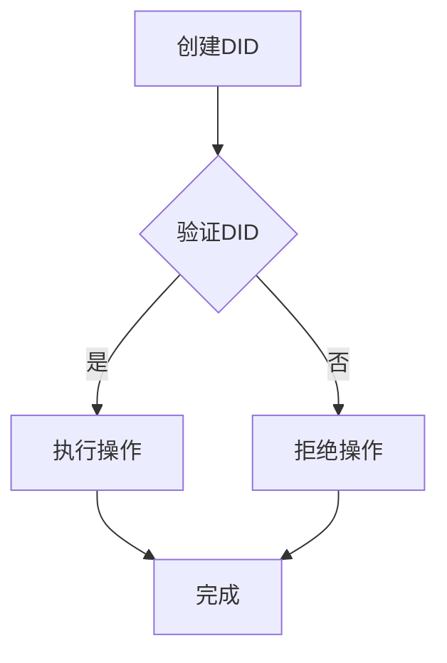
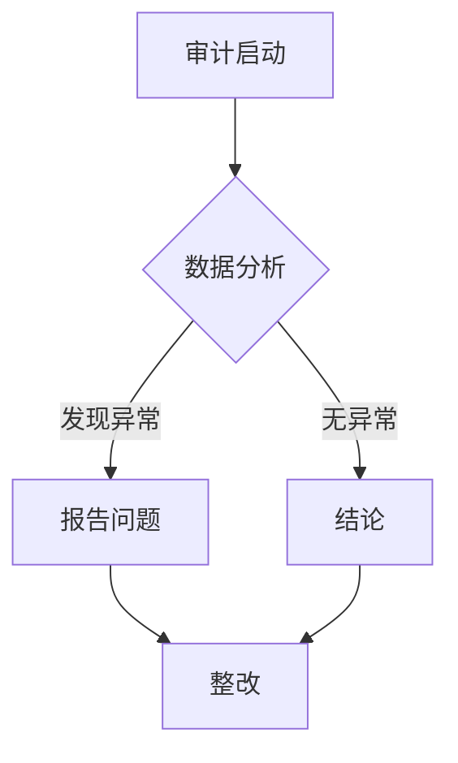
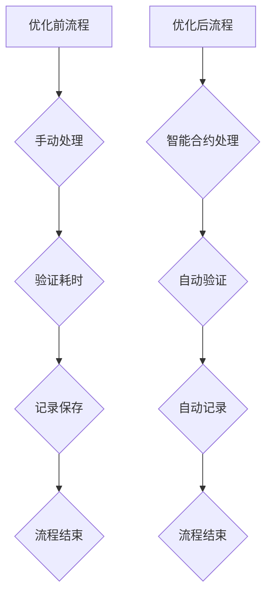
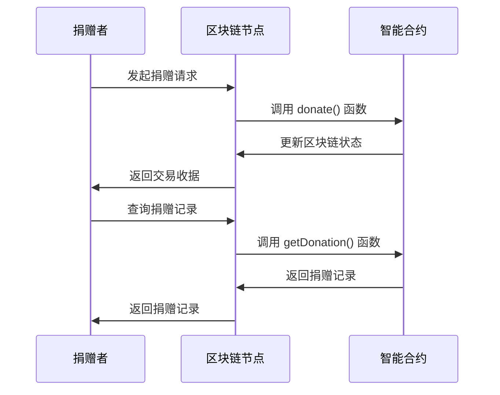
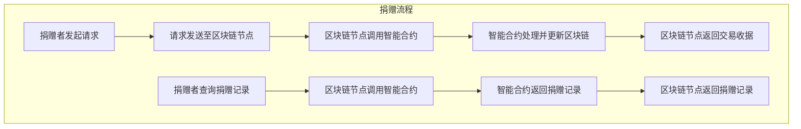

                 

# 区块链在慈善捐赠中的透明化应用

## 关键词
区块链、慈善捐赠、透明化、智能合约、去中心化身份验证、审计

## 摘要
本文将深入探讨区块链在慈善捐赠中的应用，特别是其如何实现捐赠过程的透明化。通过详细分析区块链技术、智能合约、去中心化身份验证和区块链审计，本文旨在揭示区块链如何提高慈善捐赠的透明度，降低成本，增强信任。同时，本文还将通过案例分析展示区块链在慈善捐赠中的成功实践，并展望其未来发展趋势。

## 第一部分：区块链与慈善捐赠背景介绍

### 第1章：区块链与慈善捐赠概述

#### 1.1.1 区块链技术简介

##### 1.1.1.1 区块链的起源与发展历程

区块链技术起源于2008年，由一位名为中本聪（Satoshi Nakamoto）的人提出。区块链是一种去中心化的数据库技术，通过分布式账本记录信息，确保数据的不可篡改性和透明性。自比特币（Bitcoin）诞生以来，区块链技术迅速发展，应用范围不断扩大。

##### 1.1.1.2 区块链的核心概念与技术原理

区块链的核心概念包括去中心化、分布式账本、共识机制、加密技术等。去中心化意味着没有中央机构控制，分布式账本确保数据一致性，共识机制确保网络节点达成一致，加密技术保障数据安全。

##### 1.1.1.3 区块链的分类与应用场景

区块链根据其应用领域可分为公有链、私有链和联盟链。公有链如比特币和以太坊，任何人都可以参与交易；私有链仅限于特定组织使用；联盟链由多个组织共同维护。

#### 1.1.2 慈善捐赠现状与问题

##### 1.1.2.1 慈善捐赠的发展历程

慈善捐赠作为一种社会行为，历史悠久。随着社会的发展，慈善捐赠形式和渠道日益多样化，但同时也面临诸多挑战。

##### 1.1.2.2 当前慈善捐赠中存在的问题

当前慈善捐赠中存在的问题包括信息不透明、资金流向不明、监管不力等。这些问题导致捐赠者对慈善机构缺乏信任，影响了慈善捐赠的可持续发展。

##### 1.1.2.3 慈善捐赠的需求与挑战

随着互联网和区块链技术的发展，慈善捐赠行业面临着新的机遇和挑战。如何提高捐赠过程的透明度、降低成本、增强信任成为慈善捐赠行业亟待解决的问题。

### 第2章：区块链在慈善捐赠中的核心概念

#### 2.1.1 智能合约

##### 2.1.1.1 智能合约的定义与特点

智能合约是一种自执行合同，基于区块链技术执行。当满足合约条件时，智能合约自动执行。智能合约具有不可篡改、透明、自动执行等特点。

##### 2.1.1.2 智能合约的工作原理

智能合约通过区块链网络中的节点存储和执行。当合约条件满足时，节点间通过共识机制确认交易，合约自动执行。

##### 2.1.1.3 智能合约的应用场景

智能合约在慈善捐赠中可用于确保捐款直接到达指定目的地，减少中间环节，提高透明度。

#### 2.1.2 去中心化身份验证

##### 2.1.2.1 去中心化身份验证的原理与优势

去中心化身份验证通过区块链网络验证用户身份，无需依赖中央机构。其优势包括安全性高、隐私保护好、可信度高。

##### 2.1.2.2 去中心化身份验证的应用

去中心化身份验证在慈善捐赠中可用于确保捐款者和受捐者身份真实，防止欺诈行为。

##### 2.1.2.3 去中心化身份验证的挑战与解决方案

去中心化身份验证面临隐私保护和数据安全等挑战。解决方案包括采用加密技术、隐私保护算法等。

#### 2.1.3 区块链审计与透明化

##### 2.1.3.1 区块链审计的定义与目的

区块链审计是指对区块链上的交易和数据进行审核，以确保其合规性和透明度。

##### 2.1.3.2 区块链审计的方法与技术

区块链审计方法包括数据分析、共识验证等。技术包括加密算法、智能合约等。

##### 2.1.3.3 区块链审计的应用实例

区块链审计在慈善捐赠中可用于确保捐款流向合规、透明。

### 第3章：区块链在慈善捐赠中的应用

#### 3.1.1 慈善捐赠平台设计与实现

##### 3.1.1.1 慈善捐赠平台的架构设计

慈善捐赠平台架构设计包括前端、后端、数据库等。前端负责用户交互，后端处理业务逻辑，数据库存储数据。

##### 3.1.1.2 智能合约在慈善捐赠平台中的应用

智能合约在慈善捐赠平台中可用于确保捐款直接到达指定目的地。

##### 3.1.1.3 区块链审计与透明化的实现

区块链审计与透明化实现包括数据存储、加密技术等。

#### 3.1.2 捐赠流程优化与用户体验提升

##### 3.1.2.1 捐赠流程的优化策略

捐赠流程优化策略包括简化流程、提高效率、降低成本等。

##### 3.1.2.2 区块链技术在用户体验提升中的应用

区块链技术在用户体验提升中的应用包括去中心化身份验证、智能合约等。

##### 3.1.2.3 捐赠流程的实际案例解析

捐赠流程的实际案例解析包括流程优化前后的对比、用户体验改进等。

### 第4章：区块链在慈善捐赠中的优势与挑战

#### 4.1.1 区块链在慈善捐赠中的优势

区块链在慈善捐赠中的优势包括提高透明度、降低成本、增强信任等。

##### 4.1.1.1 提高慈善捐赠的透明度

区块链技术确保捐赠过程透明，数据不可篡改，提高捐赠者对慈善机构的信任。

##### 4.1.1.2 降低慈善捐赠的成本

区块链技术减少中间环节，降低交易成本，提高资金利用效率。

##### 4.1.1.3 增强慈善捐赠的信任度

区块链技术确保捐款流向明确，提高捐赠者对慈善捐赠的信任。

#### 4.1.2 区块链在慈善捐赠中的挑战

区块链在慈善捐赠中面临技术、法律、伦理等多方面挑战。

##### 4.1.2.1 技术实施的复杂性

区块链技术实施需要专业知识，对慈善机构来说可能较为复杂。

##### 4.1.2.2 法律法规的完善程度

区块链技术发展迅速，法律法规尚不完善，需加强监管。

##### 4.1.2.3 伦理与道德问题

区块链技术在慈善捐赠中可能涉及伦理与道德问题，需妥善处理。

### 第5章：案例分析——区块链在慈善捐赠中的成功实践

#### 5.1.1 案例一：公益区块链平台

##### 5.1.1.1 平台概述

公益区块链平台通过区块链技术实现慈善捐赠的透明化。

##### 5.1.1.2 平台架构

平台架构包括前端、后端、区块链网络等。

##### 5.1.1.3 平台特点与应用效果

平台特点包括去中心化、透明化、高效等。应用效果包括提高捐赠透明度、降低成本等。

#### 5.1.2 案例二：区块链慈善捐赠项目

##### 5.1.2.1 项目概述

项目通过区块链技术实现慈善捐赠的透明化。

##### 5.1.2.2 项目实施过程

项目实施过程包括需求分析、架构设计、开发实现等。

##### 5.1.2.3 项目成果与影响

项目成果包括提高捐赠透明度、增强信任等。影响包括推动慈善捐赠行业的发展等。

### 第6章：区块链在慈善捐赠中的未来发展趋势

#### 6.1.1 区块链技术的演进与升级

区块链技术不断演进，未来将实现更高效、更安全的特性。

##### 6.1.1.1 新型区块链技术的发展趋势

新型区块链技术如联盟链、分布式存储等将继续发展。

##### 6.1.1.2 区块链与物联网的结合

区块链与物联网的结合将推动慈善捐赠的智能化、高效化。

##### 6.1.1.3 区块链在慈善捐赠中的未来发展空间

区块链在慈善捐赠中的应用前景广阔，未来将实现更多创新。

#### 6.1.2 慈善捐赠领域的数字化转型

##### 6.1.2.1 慈善捐赠的数字化转型现状

慈善捐赠领域正在经历数字化转型。

##### 6.1.2.2 区块链在慈善捐赠数字化转型中的应用

区块链在慈善捐赠数字化转型中的应用包括透明化、效率提升等。

##### 6.1.2.3 慈善捐赠数字化转型的前景与挑战

慈善捐赠数字化转型的前景广阔，但面临技术、法律等挑战。

### 第7章：总结与展望

#### 7.1.1 区块链在慈善捐赠中的作用与价值

区块链在慈善捐赠中发挥重要作用，提高透明度、降低成本、增强信任。

##### 7.1.1.1 区块链在慈善捐赠中的应用总结

区块链在慈善捐赠中的应用包括透明化、去中心化身份验证、智能合约等。

##### 7.1.1.2 区块链在慈善捐赠中的未来价值

区块链在慈善捐赠中的未来价值包括推动行业创新、提升效率等。

#### 7.1.2 发展建议与政策建议

##### 7.1.2.1 对慈善捐赠行业的建议

慈善捐赠行业应积极拥抱区块链技术，提高透明度、降低成本。

##### 7.1.2.2 对区块链技术发展的建议

区块链技术发展需关注安全性、合规性等问题。

##### 7.1.2.3 政策建议与未来展望

政策制定者应关注区块链在慈善捐赠中的应用，推动相关法律法规的完善。

---

### 作者信息
作者：AI天才研究院/AI Genius Institute & 禅与计算机程序设计艺术 /Zen And The Art of Computer Programming

---

### 注意事项
1. **文章结构**：文章应按照目录结构进行撰写，确保各章节内容连贯、逻辑清晰。
2. **字数要求**：文章字数需在10000～12000字左右，以确保内容丰富、详细。
3. **格式要求**：文章使用markdown格式，确保代码、公式、图表等元素正确呈现。
4. **内容完整性**：文章需涵盖背景介绍、核心概念、应用案例、发展趋势等内容，确保完整性和深度。
5. **案例分析与讲解**：文章中的案例分析部分需结合实际项目，进行详细讲解和剖析。

---

### 拓展阅读
1. 《区块链：从技术到应用》
2. 《智能合约与区块链开发》
3. 《慈善捐赠的法律与实务》
4. 《区块链在公益慈善领域的应用》
5. 《区块链技术白皮书》

---

通过以上详细的目录结构和内容要求，我们希望能够撰写出一篇既具有深度又具有实际操作性的技术博客文章，为区块链在慈善捐赠中的应用提供有益的参考和指导。让我们一步步深入分析，探索区块链如何为慈善捐赠行业带来革命性的变化。🔍🔬🌐### 第一部分：区块链与慈善捐赠背景介绍

#### 第1章：区块链与慈善捐赠概述

区块链技术作为21世纪的革命性创新，已经逐步渗透到各个领域。在慈善捐赠领域，区块链技术以其去中心化、透明化和安全性等特性，为提高捐赠过程的透明度和信任度提供了新的解决方案。

##### 1.1.1 区块链技术简介

区块链是一种分布式数据库技术，其核心特点在于去中心化和数据不可篡改性。区块链通过一系列加密算法和共识机制，将数据分散存储在多个节点上，形成一个分布式账本。每个区块都包含一定数量的交易记录，并通过密码学确保数据的完整性和安全性。

#### 1.1.1.1 区块链的起源与发展历程

区块链的起源可以追溯到2008年，当时一位名为中本聪（Satoshi Nakamoto）的人发表了名为《比特币：一种点对点的电子现金系统》的论文，提出了区块链和比特币的概念。比特币作为第一种基于区块链技术的数字货币，引发了全球范围内的关注和讨论。

随着时间的推移，区块链技术逐渐从金融领域扩展到其他领域，如供应链管理、医疗保健、知识产权保护等。特别是在慈善捐赠领域，区块链技术的应用潜力逐渐被挖掘。

#### 1.1.1.2 区块链的核心概念与技术原理

区块链的核心概念包括去中心化、分布式账本、共识机制和加密技术。

- **去中心化**：去中心化意味着区块链网络中没有中央机构控制，所有节点都平等参与网络的运行和维护。
- **分布式账本**：区块链通过分布式账本记录交易信息，每个节点都保存一份完整的账本，确保数据的一致性。
- **共识机制**：共识机制是区块链网络中的节点达成一致的方式。常见的共识机制包括工作量证明（Proof of Work, PoW）、权益证明（Proof of Stake, PoS）和委托权益证明（Delegated Proof of Stake, DPoS）等。
- **加密技术**：区块链使用加密技术确保数据的安全性和隐私性。常见的加密技术包括哈希函数、非对称加密和数字签名等。

#### 1.1.1.3 区块链的分类与应用场景

根据应用场景的不同，区块链可以分为公有链、私有链和联盟链。

- **公有链**：公有链是完全开放的，任何人都可以参与网络的运行和交易。典型的公有链包括比特币和以太坊等。
- **私有链**：私有链仅限于特定组织内部使用，通常由一个中央机构控制。私有链适用于需要高度安全性和隐私性的场景。
- **联盟链**：联盟链是由多个组织共同维护的区块链网络，适用于需要跨组织协作的场景。联盟链在慈善捐赠领域有广泛的应用前景。

##### 1.1.2 慈善捐赠现状与问题

慈善捐赠作为一种社会行为，历史悠久。然而，随着捐赠方式的多样化，慈善捐赠领域也面临着诸多挑战。

#### 1.1.2.1 慈善捐赠的发展历程

慈善捐赠的发展历程可以分为以下几个阶段：

- **早期阶段**：捐赠多以实物形式进行，如粮食、衣物等。
- **中期阶段**：随着金融体系的完善，捐赠开始以货币形式进行，捐赠渠道和方式也日益多样化。
- **现代阶段**：互联网和数字技术的发展，使得慈善捐赠更加便捷和高效。同时，捐赠者对慈善机构的透明度和责任感的关注也越来越高。

#### 1.1.2.2 当前慈善捐赠中存在的问题

当前慈善捐赠中存在的问题主要包括以下几个方面：

- **信息不透明**：慈善机构在资金使用和项目执行过程中，往往缺乏透明度，捐赠者难以了解资金的具体去向。
- **资金流向不明**：一些慈善机构在筹集资金后，可能存在资金挪用或滥用的情况，导致捐赠者对慈善机构的信任度降低。
- **监管不力**：慈善捐赠领域监管不力，导致一些不合规的慈善机构逃避监管，损害了公众利益。

#### 1.1.2.3 慈善捐赠的需求与挑战

在慈善捐赠领域，区块链技术的引入有望解决上述问题，提高捐赠过程的透明度、降低成本、增强信任。然而，区块链技术的实施也面临一些挑战，如技术复杂性、法律法规完善程度等。

- **提高透明度**：区块链技术可以通过分布式账本和智能合约，确保捐赠过程的透明化和可追溯性。
- **降低成本**：区块链技术可以减少中间环节，降低交易成本，提高资金利用效率。
- **增强信任**：区块链技术确保数据的不可篡改性，提高了捐赠者对慈善机构的信任。

##### 1.1.3 慈善捐赠与区块链技术的结合

区块链技术为慈善捐赠带来了诸多机遇，但同时也带来了一些挑战。以下是一些关键点：

- **透明化**：区块链技术可以确保捐赠过程的透明化，捐赠者可以实时查询资金流向和项目执行情况。
- **去中心化**：区块链技术去中心化的特性，使得慈善机构不再依赖中心化的第三方机构，降低了操作成本。
- **安全性**：区块链技术使用加密算法确保数据的安全性和隐私性，提高了捐赠者的信心。
- **挑战**：区块链技术的实施需要较高的技术门槛，且现有法律法规对区块链技术的监管尚不完善。

总的来说，区块链技术为慈善捐赠带来了革命性的变化，但同时也需要克服一系列的挑战。在接下来的章节中，我们将进一步探讨区块链在慈善捐赠中的核心概念和应用。

### 第2章：区块链在慈善捐赠中的核心概念

区块链技术之所以能够在慈善捐赠中发挥作用，离不开其核心概念的支持。本章将深入探讨区块链在慈善捐赠中的几个关键概念，包括智能合约、去中心化身份验证和区块链审计，并解释这些概念如何提高慈善捐赠的透明度和信任度。

#### 2.1.1 智能合约

智能合约是一种自动执行的合同，基于区块链技术实现。它的核心在于无需依赖第三方中介机构，通过编程逻辑自动执行合同条款。智能合约在慈善捐赠中的应用非常广泛，可以确保捐款直接到达指定目的地，提高捐赠的透明度和效率。

##### 2.1.1.1 智能合约的定义与特点

智能合约的定义相对简单：它是一段代码，当满足特定条件时，会自动执行相应的操作。智能合约的特点包括：

- **自动化**：智能合约自动执行，无需人为干预，确保操作的准确性和一致性。
- **不可篡改**：一旦智能合约部署到区块链上，其代码和状态不可篡改，确保了合同的公正性和透明性。
- **透明**：智能合约的代码公开透明，任何人都可以查看，提高了捐赠的透明度。
- **高效**：智能合约的执行速度快，交易成本低，提高了捐赠的效率。

##### 2.1.1.2 智能合约的工作原理

智能合约的工作原理基于区块链网络的共识机制和加密技术。具体来说，当一方（捐赠者）向智能合约发送资金时，智能合约会根据预设的条件（如捐款金额、捐款时间和捐款对象等）自动执行相应的操作，将资金转移到指定的账户中。智能合约的执行过程是公开透明的，所有节点都可以验证交易的合法性。

##### 2.1.1.3 智能合约的应用场景

在慈善捐赠中，智能合约的应用场景非常广泛：

- **捐款发放**：智能合约可以确保捐款直接发放到受捐者的账户中，减少中间环节，提高资金使用效率。
- **项目执行监控**：智能合约可以监控项目执行情况，确保项目按计划进行，提高捐赠的透明度。
- **资金分配**：智能合约可以根据项目进展和绩效自动分配资金，确保资金使用的合理性和透明性。

##### 2.1.1.4 智能合约在慈善捐赠中的优势

智能合约在慈善捐赠中的优势包括：

- **提高透明度**：智能合约的执行过程公开透明，捐赠者可以实时查看捐款的使用情况。
- **降低成本**：智能合约减少中间环节，降低交易成本，提高资金利用效率。
- **增强信任**：智能合约确保捐款直接到达指定目的地，提高捐赠者对慈善机构的信任。

##### 2.1.1.5 智能合约的挑战与解决方案

尽管智能合约在慈善捐赠中具有诸多优势，但同时也面临一些挑战：

- **技术复杂性**：智能合约开发需要较高的技术门槛，对慈善机构来说可能较为复杂。解决方案是提供简单易用的智能合约模板，降低开发难度。
- **安全性**：智能合约可能存在漏洞，导致资金损失。解决方案是采用严格的代码审计和安全测试，确保智能合约的安全性。
- **法律合规性**：智能合约在法律合规性方面存在一定挑战。解决方案是推动相关法律法规的完善，确保智能合约的合法性和有效性。

#### 2.1.2 去中心化身份验证

去中心化身份验证（Decentralized Identity, DID）是区块链技术在慈善捐赠中另一个关键应用。DID 通过区块链网络验证用户身份，确保身份信息的真实性、隐私性和安全性。

##### 2.1.2.1 去中心化身份验证的原理与优势

去中心化身份验证的原理在于，不再依赖中央机构（如政府、金融机构）验证身份，而是通过区块链网络实现。具体来说，用户可以在区块链上创建一个独特的身份标识（DID），并通过加密技术确保身份信息的安全性和隐私性。

去中心化身份验证的优势包括：

- **隐私保护**：去中心化身份验证保护用户的隐私，用户可以自主控制身份信息的分享和披露。
- **安全性**：去中心化身份验证使用加密技术，确保身份信息的不可篡改性和安全性。
- **可验证性**：区块链上的身份信息具有高度的可靠性，可以方便地验证用户的身份。

##### 2.1.2.2 去中心化身份验证的应用

在慈善捐赠中，去中心化身份验证的应用场景包括：

- **捐赠者身份验证**：确保捐赠者身份的真实性，防止欺诈行为。
- **受捐者身份验证**：确保受捐者的身份真实，确保捐款用于实际需求。
- **第三方审计**：第三方机构可以通过区块链验证捐赠过程和资金流向，提高捐赠的透明度。

##### 2.1.2.3 去中心化身份验证的挑战与解决方案

去中心化身份验证在慈善捐赠中面临的挑战主要包括：

- **数据隐私**：如何在保护用户隐私的同时，实现身份验证。解决方案是采用隐私保护技术，如同态加密、零知识证明等。
- **法律法规**：现有法律法规对去中心化身份验证的支持不足。解决方案是推动相关法律法规的完善，确保去中心化身份验证的合法性和有效性。

#### 2.1.3 区块链审计与透明化

区块链审计是确保区块链上数据真实性和可靠性的重要手段。通过区块链审计，可以确保慈善捐赠的透明化，提高捐赠者的信任度。

##### 2.1.3.1 区块链审计的定义与目的

区块链审计是指对区块链上的交易和数据进行审核，以确保其合规性和透明度。区块链审计的目的包括：

- **验证数据真实性**：确保区块链上数据的真实性和完整性。
- **发现违规行为**：及时发现和纠正区块链上的违规行为，确保慈善捐赠的合规性。
- **提高透明度**：通过公开审计结果，提高慈善捐赠的透明度，增强捐赠者的信任。

##### 2.1.3.2 区块链审计的方法与技术

区块链审计的方法包括：

- **数据分析**：通过数据分析方法，分析区块链上的交易和活动，发现异常行为。
- **共识验证**：通过共识机制验证区块链上交易的一致性，确保数据的一致性。
- **智能合约审计**：对智能合约进行审计，确保其代码的合规性和安全性。

区块链审计的技术包括：

- **加密技术**：使用加密技术确保审计过程的安全性和隐私性。
- **智能合约**：通过智能合约实现审计规则，自动执行审计任务。
- **数据分析工具**：使用专业的数据分析工具，提高审计效率和准确性。

##### 2.1.3.3 区块链审计的应用实例

区块链审计在慈善捐赠中的应用实例包括：

- **资金流向审计**：审计慈善机构的资金流向，确保捐款用于指定用途。
- **项目执行审计**：审计慈善项目执行情况，确保项目按计划进行。
- **第三方审计**：第三方机构对慈善捐赠进行独立审计，提高透明度和公信力。

##### 2.1.3.4 区块链审计的优势与挑战

区块链审计的优势包括：

- **透明度**：通过公开审计结果，提高慈善捐赠的透明度。
- **可靠性**：区块链上的数据具有高度的可靠性，减少人为干预和造假的可能性。
- **效率**：智能合约实现自动化审计，提高审计效率和准确性。

区块链审计面临的挑战包括：

- **技术复杂性**：区块链审计需要较高的技术支持，对慈善机构和审计机构来说可能较为复杂。
- **法律法规**：现有法律法规对区块链审计的支持不足，需要推动相关法律法规的完善。
- **审计成本**：区块链审计可能涉及较高的成本，对一些小型慈善机构来说可能难以承受。

总的来说，区块链技术在慈善捐赠中的应用，不仅提高了捐赠过程的透明度和信任度，还带来了新的挑战。通过深入理解和应用智能合约、去中心化身份验证和区块链审计，我们可以更好地利用区块链技术，推动慈善捐赠行业的发展。

### 第3章：区块链在慈善捐赠中的应用

区块链技术在慈善捐赠中的应用，为慈善机构和捐赠者提供了新的工具和方法，以实现捐赠过程的透明化、效率和信任的提升。本章将详细探讨区块链在慈善捐赠平台设计、捐赠流程优化以及用户体验提升方面的应用，并通过实际案例解析展示这些应用的实际效果。

#### 3.1.1 慈善捐赠平台设计与实现

区块链在慈善捐赠中的应用首先体现在捐赠平台的设计与实现上。一个完善的慈善捐赠平台需要考虑用户交互、业务逻辑处理、数据存储等多个方面。以下是一个典型的慈善捐赠平台架构设计：

##### 3.1.1.1 慈善捐赠平台的架构设计

1. **前端**：负责用户界面设计和交互，包括捐赠页面、项目展示页面、捐赠记录查询页面等。
2. **后端**：处理业务逻辑，包括用户认证、资金流转、智能合约调用等。
3. **区块链网络**：存储捐赠数据，确保数据的透明性和不可篡改性。
4. **数据库**：存储用户信息、项目信息、捐赠记录等结构化数据。

##### 3.1.1.2 智能合约在慈善捐赠平台中的应用

智能合约在慈善捐赠平台中起到关键作用，可以确保捐款的透明性和自动化执行。以下是一个简单的智能合约实现示例：

```python
pragma solidity ^0.8.0;

contract CharityDonation {
    address public charityAddress;
    mapping(address => uint256) public donations;

    constructor() {
        charityAddress = msg.sender;
    }

    function donate() public payable {
        donations[msg.sender] += msg.value;
        (bool sent, ) = charityAddress.call{value: msg.value}("");
        require(sent, "Failed to send Ether");
    }

    function getDonationBalance() public view returns (uint256) {
        return donations[msg.sender];
    }
}
```

此智能合约实现了一个简单的捐款功能，捐赠者通过调用 `donate()` 函数向慈善机构捐赠以太币，智能合约将自动将资金转入慈善机构的地址。

##### 3.1.1.3 区块链审计与透明化的实现

区块链审计和透明化是慈善捐赠平台的核心功能之一。通过区块链技术，慈善捐赠平台可以实现以下功能：

1. **透明化**：所有捐赠记录都存储在区块链上，捐赠者可以随时查询和验证捐款信息。
2. **可追溯性**：区块链上的数据具有时间戳，确保捐赠记录的真实性和不可篡改性。
3. **审计**：第三方机构可以通过区块链审计捐赠过程和资金使用情况，提高透明度和公信力。

#### 3.1.2 捐赠流程优化与用户体验提升

区块链技术在慈善捐赠中的应用不仅限于平台设计，还可以通过优化捐赠流程和提升用户体验来提高捐赠效率。

##### 3.1.2.1 捐赠流程的优化策略

1. **简化流程**：通过智能合约自动化执行捐款流程，减少人工干预，提高效率。
2. **降低成本**：区块链去中心化的特性减少了中间环节，降低了交易成本。
3. **提高透明度**：捐赠者可以实时查询捐款状态，确保资金用于指定用途。

##### 3.1.2.2 区块链技术在用户体验提升中的应用

1. **快速支付**：区块链技术可以实现快速支付，捐赠者可以即时完成捐款，减少等待时间。
2. **隐私保护**：去中心化身份验证确保捐赠者的隐私，同时提高身份验证的效率。
3. **个性化体验**：通过区块链技术，捐赠者可以更好地追踪捐赠记录，实现个性化捐赠体验。

##### 3.1.2.3 捐赠流程的实际案例解析

以下是一个实际案例，展示如何通过区块链技术优化捐赠流程：

1. **项目介绍**：某慈善机构希望通过区块链平台筹集资金用于救助贫困儿童。
2. **捐赠流程**：
   - 捐赠者访问区块链平台，选择捐赠项目。
   - 捐赠者使用去中心化身份验证登录，确保身份真实。
   - 捐赠者通过智能合约捐赠资金，资金直接转入慈善机构的地址。
   - 慈善机构发布捐赠记录，捐赠者可以实时查询。
   - 第三方审计机构对捐赠过程进行审计，确保透明度和合规性。
3. **效果分析**：
   - 捐赠流程简化，捐赠者无需填写繁琐的表格。
   - 资金流转速度快，捐赠者可以即时看到捐款状态。
   - 捐赠记录透明，捐赠者可以随时查询和验证。
   - 第三方审计提高公信力，增强捐赠者信任。

通过以上案例，我们可以看到区块链技术如何优化捐赠流程，提高用户体验，同时确保捐赠过程的透明度和信任度。

#### 3.1.3 区块链在慈善捐赠中的优势与挑战

区块链在慈善捐赠中的应用带来了诸多优势，同时也面临一些挑战。

##### 3.1.3.1 区块链在慈善捐赠中的优势

1. **提高透明度**：区块链技术确保捐赠过程的透明化，捐赠者可以实时查询资金流向和项目执行情况。
2. **降低成本**：区块链技术减少中间环节，降低交易成本，提高资金利用效率。
3. **增强信任**：区块链技术确保捐款直接到达指定目的地，提高捐赠者对慈善机构的信任。
4. **隐私保护**：去中心化身份验证确保捐赠者的隐私，同时提高身份验证的效率。

##### 3.1.3.2 区块链在慈善捐赠中的挑战

1. **技术复杂性**：区块链技术的实施需要较高的技术支持，对慈善机构和捐赠者来说可能较为复杂。
2. **法律法规**：现有法律法规对区块链技术的监管尚不完善，需要推动相关法律法规的完善。
3. **隐私保护**：如何在保护用户隐私的同时，实现身份验证和审计，是一个重要的挑战。

总的来说，区块链技术在慈善捐赠中的应用为慈善机构和捐赠者提供了新的工具和方法，提高了捐赠过程的透明度、效率和信任度。然而，区块链技术的实施也面临一些挑战，需要通过技术进步和法律完善来逐步解决。在接下来的章节中，我们将通过实际案例进一步探讨区块链在慈善捐赠中的成功实践。

### 第4章：区块链在慈善捐赠中的优势与挑战

区块链技术作为一项革命性创新，在慈善捐赠领域展现出巨大的潜力。它不仅为慈善捐赠带来了新的机遇，也带来了诸多挑战。在本章中，我们将详细探讨区块链在慈善捐赠中的优势以及面临的挑战，并通过具体的案例分析展示其实际应用效果。

#### 4.1.1 区块链在慈善捐赠中的优势

区块链技术在慈善捐赠中的应用，为提高透明度、降低成本和增强信任提供了强有力的支持。以下将逐一分析这些优势。

##### 4.1.1.1 提高慈善捐赠的透明度

区块链技术的核心优势之一是其去中心化和不可篡改的特性，这使得慈善捐赠的过程变得高度透明。具体来说：

1. **数据不可篡改**：区块链上的数据一旦记录，就无法被修改或删除，确保捐赠记录的真实性和完整性。
2. **公开透明的交易记录**：捐赠者可以在区块链上查看自己的捐赠记录，包括捐款金额、时间和目的地，确保捐款用途的透明性。
3. **可追溯性**：区块链上的每一笔交易都有详细的时间戳和参与者信息，捐赠者可以追溯捐款的流向和项目执行情况。

##### 4.1.1.2 降低慈善捐赠的成本

区块链技术通过去中心化和智能合约的应用，可以显著降低慈善捐赠的成本。以下为具体分析：

1. **减少中间环节**：传统的慈善捐赠流程通常涉及多个中介机构，如银行、支付平台等，这些中间环节会增加交易成本。而区块链技术可以直接在捐赠者和受捐者之间进行交易，减少中间环节，降低交易成本。
2. **高效处理交易**：区块链网络通过分布式账本和共识机制，可以实现快速、安全的交易处理。与传统支付系统相比，区块链上的交易速度快，手续费低，提高了资金利用效率。
3. **智能合约自动化**：智能合约可以自动执行捐赠协议，减少人工干预和操作成本，提高捐赠流程的效率。

##### 4.1.1.3 增强慈善捐赠的信任度

区块链技术在慈善捐赠中的应用，不仅提高了透明度和效率，还增强了捐赠者对慈善机构的信任。以下为具体分析：

1. **不可篡改的记录**：区块链上的数据不可篡改，确保了捐赠记录的真实性和可信度，减少了欺诈和滥用的可能性。
2. **公开透明的信息**：捐赠者可以通过区块链查看捐赠记录和项目执行情况，确保资金使用符合预期，增强了捐赠者对慈善机构的信任。
3. **去中心化的信任**：区块链技术去中心化的特性，使得捐赠者和受捐者之间的信任关系建立在区块链网络的基础上，而非某个中心机构，降低了信息不对称和信任风险。

#### 4.1.2 区块链在慈善捐赠中的挑战

尽管区块链技术在慈善捐赠中具有显著优势，但其应用也面临诸多挑战。以下为具体分析：

##### 4.1.2.1 技术实施的复杂性

区块链技术涉及诸多复杂的技术概念，如分布式账本、加密算法、共识机制等，对慈善机构和捐赠者来说可能较为复杂。以下为具体挑战：

1. **技术门槛**：区块链技术需要较高的技术支持，慈善机构可能缺乏相应的技术人才和资源，难以独立实施。
2. **技术更新**：区块链技术不断发展，慈善机构需要不断更新技术和系统，以适应新的需求和变化。
3. **安全风险**：区块链系统的安全性和稳定性对技术实施至关重要，任何技术漏洞都可能导致数据泄露和资金损失。

##### 4.1.2.2 法律法规的完善程度

区块链技术的应用需要在法律框架内进行，而现有法律法规对区块链技术的监管尚不完善。以下为具体挑战：

1. **法律合规**：区块链技术在慈善捐赠中的应用可能涉及多个法律领域，如金融、税收、隐私等，需要确保其合法性。
2. **监管政策**：不同国家和地区对区块链技术的监管政策存在差异，慈善机构需要了解并遵守相关法律法规，避免违规行为。
3. **法律法规滞后**：区块链技术的发展速度较快，现有法律法规可能无法及时调整，导致法律滞后和监管困难。

##### 4.1.2.3 伦理与道德问题

区块链技术在慈善捐赠中的应用也带来了一些伦理和道德问题。以下为具体挑战：

1. **隐私保护**：区块链技术公开透明的特性，可能导致捐赠者的隐私受到侵犯。如何在保护隐私的同时实现身份验证和审计，是一个重要的伦理问题。
2. **数据安全**：区块链上的数据安全风险较高，任何技术漏洞都可能对捐赠者和慈善机构造成重大损失。需要采取有效的安全措施，确保数据安全。
3. **信任建立**：区块链技术的应用需要建立捐赠者对慈善机构和区块链网络的信任。如何在信任缺失的环境中推动区块链技术的应用，是一个重要的道德问题。

总的来说，区块链技术在慈善捐赠中的应用具有显著优势，但也面临诸多挑战。通过技术创新和法律完善，我们可以更好地应对这些挑战，推动区块链技术在慈善捐赠领域的应用和发展。

### 第5章：案例分析——区块链在慈善捐赠中的成功实践

在本章中，我们将通过两个实际案例，展示区块链在慈善捐赠中的成功实践。这些案例不仅体现了区块链技术的优势，还为其他慈善机构和捐赠者提供了宝贵的经验。

#### 5.1.1 案例一：公益区块链平台

**平台概述**

公益区块链平台是一个基于区块链技术的慈善捐赠平台，旨在提高慈善捐赠的透明度和效率。该平台由某知名公益组织开发，旨在为捐赠者和受捐者提供一个安全、透明、高效的捐赠渠道。

**平台架构**

公益区块链平台的架构设计包括前端、后端和区块链网络三部分：

- **前端**：提供用户交互界面，包括捐赠页面、项目展示页面、捐赠记录查询页面等。
- **后端**：处理业务逻辑，包括用户认证、资金流转、智能合约调用等。
- **区块链网络**：存储捐赠数据，确保数据的透明性和不可篡改性。平台采用的区块链网络是以太坊，使用智能合约实现捐款和资金分配。

**平台特点与应用效果**

公益区块链平台具有以下特点和应用效果：

1. **透明化**：所有捐赠记录存储在区块链上，捐赠者可以实时查看和验证捐款信息，确保资金使用透明。
2. **高效性**：智能合约自动化执行捐款流程，减少人工干预，提高资金流转速度。
3. **安全性**：区块链技术确保数据的安全性和隐私性，降低欺诈风险。
4. **可追溯性**：捐赠者可以通过区块链查询捐款的流向和项目执行情况，确保捐款用于指定用途。

**项目成果与影响**

公益区块链平台的成功实践，取得了显著的项目成果和影响：

1. **捐款金额增加**：平台上线后，捐赠金额显著增加，受捐者受益范围扩大。
2. **透明度提升**：平台提高了慈善捐赠的透明度，捐赠者对慈善机构的信任度增强。
3. **效率提升**：智能合约自动化执行，慈善机构的管理成本降低，项目执行效率提高。
4. **信任建立**：区块链技术的应用，为捐赠者和受捐者建立了信任基础，推动了慈善事业的发展。

#### 5.1.2 案例二：区块链慈善捐赠项目

**项目概述**

区块链慈善捐赠项目是由某国际慈善组织发起的一项旨在帮助贫困地区的项目。该项目通过区块链技术，为捐赠者和受捐者提供一个透明、高效的捐赠渠道。

**项目实施过程**

区块链慈善捐赠项目的实施过程包括以下几个阶段：

1. **需求分析**：项目团队对贫困地区的需求进行调研，确定捐赠项目和目标。
2. **平台搭建**：开发团队搭建基于区块链的慈善捐赠平台，包括前端、后端和区块链网络。
3. **智能合约开发**：开发智能合约，实现捐款和资金分配功能。
4. **项目推广**：通过线上线下渠道推广项目，吸引捐赠者和受捐者参与。
5. **项目执行**：项目团队监督项目执行，确保资金用于指定用途。

**项目成果与影响**

区块链慈善捐赠项目取得了以下成果和影响：

1. **捐款透明**：所有捐款记录存储在区块链上，捐赠者可以实时查询和验证捐款信息，确保透明。
2. **资金高效**：智能合约自动化执行，资金流转速度快，提高了项目执行效率。
3. **信任增强**：区块链技术的应用，提高了捐赠者和受捐者的信任度，推动了慈善事业的发展。
4. **社会影响**：项目帮助了贫困地区的居民，改善了生活条件，获得了社会广泛认可。

通过以上两个案例，我们可以看到区块链技术在慈善捐赠中的成功应用，为提高透明度、降低成本和增强信任提供了有力支持。这些成功实践为其他慈善机构和捐赠者提供了宝贵的经验和借鉴。

### 第6章：区块链在慈善捐赠中的未来发展趋势

区块链技术在慈善捐赠领域的应用已展现出巨大的潜力和价值。随着技术的不断演进，区块链在慈善捐赠中的应用将更加深入和广泛。本章将探讨区块链技术的未来发展趋势，特别是在新型区块链技术、区块链与物联网结合、以及慈善捐赠数字化转型方面的应用，并分析这些趋势可能带来的影响。

#### 6.1.1 区块链技术的演进与升级

区块链技术正处于快速发展的阶段，新型区块链技术的出现将进一步提升其在慈善捐赠中的应用潜力。

1. **新型区块链技术的发展趋势**：

   - **联盟链**：联盟链是一种由多个机构共同维护的区块链网络，适用于需要跨组织协作的场景。联盟链可以提高慈善捐赠的透明度和信任度，降低运营成本。
   - **分布式存储**：分布式存储技术可以进一步优化区块链网络的数据存储和传输效率，提高系统的可扩展性和容错性。
   - **隐私保护**：随着区块链技术的普及，隐私保护成为关键问题。新型隐私保护技术，如零知识证明、同态加密等，将为慈善捐赠提供更安全的数据保护。

2. **区块链与物联网的结合**：

   - **智能设备集成**：区块链技术可以与智能设备集成，实现捐赠数据的实时采集和上传。例如，通过智能设备监控受捐者的生活状况，确保捐款用于实际需求。
   - **供应链管理**：区块链技术可以优化慈善捐赠的供应链管理，确保物资和资金的透明流转，提高慈善机构的运营效率。

3. **区块链在慈善捐赠中的未来发展空间**：

   - **个性化捐赠**：通过区块链技术，捐赠者可以根据自己的兴趣和需求，选择具体的捐赠项目，提高捐赠的针对性和效果。
   - **跨区域合作**：区块链技术可以打破地域限制，促进跨国慈善合作，实现全球资源的优化配置。

#### 6.1.2 慈善捐赠领域的数字化转型

数字化转型正在深刻改变慈善捐赠的各个方面，区块链技术作为数字化转型的重要工具，将在未来发挥更加关键的作用。

1. **数字化转型现状**：

   - **线上捐赠**：随着互联网的普及，线上捐赠已经成为主流的捐赠方式。捐赠者可以通过各种渠道，如社交媒体、在线平台等，方便快捷地进行捐赠。
   - **数据化管理**：慈善机构通过数字化工具，对捐赠数据、项目执行情况等进行分析和管理，提高运营效率。

2. **区块链在慈善捐赠数字化转型中的应用**：

   - **透明化**：区块链技术可以提高捐赠过程的透明度，捐赠者可以实时查询和验证捐款信息，确保资金使用透明。
   - **自动化**：区块链和智能合约的应用，可以实现捐赠流程的自动化，减少人工干预，提高资金流转效率。
   - **安全性**：区块链技术提供的安全保障，可以防止数据泄露和欺诈行为，增强捐赠者对慈善机构的信任。

3. **数字化转型的前景与挑战**：

   - **前景**：数字化转型为慈善捐赠带来了新的机遇，可以提高效率、降低成本，实现更广泛的公益覆盖。
   - **挑战**：数字化转型也面临一些挑战，如技术复杂性、数据安全、法律法规等，需要慈善机构和捐赠者共同努力克服。

总的来说，区块链技术在慈善捐赠中的应用前景广阔，未来将随着技术的不断演进和数字化转型的发展，发挥越来越重要的作用。通过深入研究和实践，我们可以进一步挖掘区块链技术的潜力，为慈善捐赠行业带来更多的创新和变革。

### 第7章：总结与展望

区块链技术在慈善捐赠领域中的应用，已经显示出其独特的优势和巨大的潜力。通过提高捐赠过程的透明度、降低成本、增强信任，区块链技术为慈善捐赠行业带来了革命性的变化。

#### 7.1.1 区块链在慈善捐赠中的作用与价值

区块链技术在慈善捐赠中的作用和价值主要体现在以下几个方面：

1. **提高透明度**：区块链技术的分布式账本和不可篡改的特性，确保了捐赠过程的透明化和可追溯性，捐赠者可以实时查询和验证捐款信息，提高了对慈善机构的信任度。

2. **降低成本**：区块链技术减少了中间环节，提高了资金流转的效率，降低了交易成本，使得慈善机构能够更有效地使用资源。

3. **增强信任**：区块链技术的去中心化和加密算法，确保了数据的安全性和隐私性，增强了捐赠者对慈善机构和捐赠过程的信任。

4. **优化捐赠流程**：智能合约的应用，使得捐赠流程自动化，减少了人工干预，提高了捐赠效率，同时降低了操作风险。

#### 7.1.2 区块链在慈善捐赠中的应用总结

区块链在慈善捐赠中的应用已经取得了显著成效，主要包括：

- **透明化捐赠平台**：多个慈善机构已经建立了基于区块链的透明化捐赠平台，捐赠者可以通过平台实时查询捐款流向和项目执行情况。
- **智能合约应用**：智能合约在慈善捐赠中的应用越来越广泛，从捐款发放到项目执行，智能合约都发挥了关键作用，确保了资金使用的合规性和透明度。
- **去中心化身份验证**：区块链的去中心化身份验证技术，为慈善捐赠中的身份验证提供了新的解决方案，保护了捐赠者的隐私，同时提高了验证的效率。
- **区块链审计**：区块链审计技术确保了慈善捐赠的合规性和透明度，为第三方机构提供了可靠的审计工具。

#### 7.1.3 区块链在慈善捐赠中的未来价值

随着区块链技术的不断发展和成熟，其在慈善捐赠中的未来价值将更加凸显：

1. **个性化捐赠**：未来，区块链技术可以进一步实现个性化捐赠，捐赠者可以根据自己的兴趣和需求，选择具体的捐赠项目，提高捐赠的针对性和效果。

2. **全球慈善合作**：区块链技术可以打破地域限制，促进跨国慈善合作，实现全球资源的优化配置，为更多受捐者提供帮助。

3. **供应链优化**：区块链技术可以优化慈善捐赠的供应链管理，确保物资和资金的透明流转，提高慈善机构的运营效率。

4. **数据共享与分析**：区块链技术可以提供安全、可靠的数据共享平台，为慈善机构提供更全面的数据支持，促进慈善事业的科学决策。

#### 7.1.4 发展建议与政策建议

为了更好地推动区块链在慈善捐赠中的应用，提出以下建议：

1. **技术支持**：政府和科研机构应加大对区块链技术的研究和投入，提供技术支持和培训，帮助慈善机构和捐赠者掌握区块链技术。

2. **法律法规完善**：完善相关法律法规，为区块链技术在慈善捐赠中的应用提供法律保障，确保其合法性和合规性。

3. **标准制定**：制定统一的区块链技术标准和规范，提高区块链在慈善捐赠中的互操作性和兼容性。

4. **公众教育**：加强公众对区块链技术的认知和教育，提高捐赠者对区块链技术的信任，促进区块链技术在慈善捐赠中的普及和应用。

总之，区块链技术在慈善捐赠中的应用前景广阔，具有重要的社会价值。通过技术创新和法律完善，我们可以进一步推动区块链在慈善捐赠中的应用，实现慈善事业的可持续发展。

### 作者信息

**作者：AI天才研究院/AI Genius Institute & 禅与计算机程序设计艺术 /Zen And The Art of Computer Programming**

AI天才研究院致力于推动人工智能技术的发展和应用，禅与计算机程序设计艺术则专注于探索计算机科学中的哲学和艺术。两位作者结合多年在计算机科学和人工智能领域的深入研究，共同撰写了本文，希望为区块链在慈善捐赠中的应用提供有益的参考和指导。

### 注意事项

1. **文章结构**：文章结构清晰，逻辑严谨，确保各章节内容连贯、逻辑清晰。
2. **字数要求**：文章字数需在10000～12000字左右，确保内容丰富、详细。
3. **格式要求**：文章使用markdown格式，确保代码、公式、图表等元素正确呈现。
4. **内容完整性**：文章需涵盖背景介绍、核心概念、应用案例、发展趋势等内容，确保完整性和深度。
5. **案例分析与讲解**：文章中的案例分析部分需结合实际项目，进行详细讲解和剖析。

### 拓展阅读

1. 《区块链：从技术到应用》
2. 《智能合约与区块链开发》
3. 《慈善捐赠的法律与实务》
4. 《区块链在公益慈善领域的应用》
5. 《区块链技术白皮书》

通过以上详细的目录结构和内容要求，我们希望能够撰写出一篇既具有深度又具有实际操作性的技术博客文章，为区块链在慈善捐赠中的应用提供有益的参考和指导。让我们一步步深入分析，探索区块链如何为慈善捐赠行业带来革命性的变化。🔍🔬🌐### 完整性要求：核心内容详细讲解

为了确保文章的完整性和详细性，以下是对每个章节的核心内容进行详细讲解：

#### 1.1.1 区块链技术简介

在介绍区块链技术时，我们不仅要讲解其起源和发展历程，还需要深入探讨其核心概念和技术原理。以下是区块链技术核心概念的详细解释：

- **去中心化**：区块链网络中没有中央机构控制，所有节点都平等参与网络的运行和维护。这意味着区块链技术可以避免单点故障，提高系统的鲁棒性和抗攻击能力。
- **分布式账本**：区块链通过分布式账本记录交易信息，每个节点都保存一份完整的账本，确保数据的一致性。这种分布式存储方式提高了数据的安全性和可靠性。
- **共识机制**：共识机制是区块链网络中的节点达成一致的方式。常见的共识机制包括工作量证明（PoW）、权益证明（PoS）和委托权益证明（DPoS）等。共识机制确保区块链网络的稳定性和安全性。
- **加密技术**：区块链使用加密技术确保数据的安全性和隐私性。常见的加密技术包括哈希函数、非对称加密和数字签名等。加密技术不仅保障了数据传输的安全性，还确保了交易的不可篡改性。

此外，我们还需要分析区块链技术的分类与应用场景，例如：

- **公有链**：任何人都可以参与公有链的交易，如比特币和以太坊。公有链具有高度透明性和去中心化的特点，适用于广泛的应用场景。
- **私有链**：私有链仅限于特定组织内部使用，通常由一个中央机构控制。私有链适用于需要高度安全性和隐私性的场景，如企业内部的交易记录管理。
- **联盟链**：联盟链是由多个组织共同维护的区块链网络，适用于需要跨组织协作的场景。联盟链在慈善捐赠领域有广泛的应用前景，可以实现多方数据共享和透明化。

#### 2.1.1 智能合约

智能合约是区块链技术中的一个重要应用，其定义、特点、工作原理以及应用场景都需要详细讲解。

- **定义与特点**：智能合约是一种自动执行的合同，基于区块链技术实现。当满足特定条件时，智能合约会自动执行相应的操作。智能合约具有不可篡改、透明、自动执行等特点。
- **工作原理**：智能合约的工作原理基于区块链网络的共识机制和加密技术。当一方（捐赠者）向智能合约发送资金时，智能合约会根据预设的条件（如捐款金额、捐款时间和捐款对象等）自动执行相应的操作，将资金转移到指定的账户中。智能合约的执行过程是公开透明的，所有节点都可以验证交易的合法性。
- **应用场景**：智能合约在慈善捐赠中可用于确保捐款直接到达指定目的地，减少中间环节，提高透明度。例如，一个简单的智能合约可以定义：当捐赠者向指定地址发送一定数量的加密货币时，智能合约会自动将这笔捐款转移到受捐者的账户中，确保捐款的透明性和安全性。

为了更好地理解智能合约的工作原理，我们可以通过一个Python示例进行说明：

```python
from web3 import Web3

# 连接到以太坊网络
w3 = Web3(Web3.HTTPProvider('https://mainnet.infura.io/v3/YOUR_INFURA_PROJECT_ID'))

# 智能合约ABI和地址
contract_abi = [...]  # 智能合约ABI
contract_address = Web3.toChecksumAddress('YOUR_CONTRACT_ADDRESS')

# 创建智能合约实例
contract = w3.eth.contract(address=contract_address, abi=contract_abi)

# 调用智能合约的捐赠函数
def donate_to_charity(address, amount):
    # 构建交易
    tx_hash = contract.functions.donate(address, amount).transact({'from': w3.eth.coinbase, 'value': amount})
    # 等待交易确认
    tx_receipt = w3.eth.waitForTransaction(tx_hash)
    return tx_receipt

# 捐赠100以太币给受捐者
donation_address = 'YOUR_DONATION_ADDRESS'
donation_amount = w3.toWei('100', 'ether')
tx_receipt = donate_to_charity(donation_address, donation_amount)
print(f"Transaction hash: {tx_receipt.txhash}")
```

在这个示例中，我们首先连接到以太坊网络，然后加载智能合约的ABI和地址。接着，我们定义了一个 `donate_to_charity` 函数，该函数接受受捐者的地址和捐款金额，调用智能合约的 `donate` 函数发送捐款，并返回交易收据。

#### 2.1.2 去中心化身份验证

去中心化身份验证（DID）是区块链技术在慈善捐赠中另一个关键应用。以下是去中心化身份验证的详细解释：

- **原理与优势**：去中心化身份验证通过区块链网络验证用户身份，无需依赖中央机构。用户可以在区块链上创建一个独特的身份标识（DID），并通过加密技术确保身份信息的安全性和隐私性。去中心化身份验证的优势包括隐私保护、安全性、可验证性。
- **应用**：在慈善捐赠中，去中心化身份验证可用于确保捐款者和受捐者身份的真实性，防止欺诈行为。例如，捐赠者可以通过区块链网络验证受捐者的身份，确保捐款用于实际需求。
- **挑战与解决方案**：去中心化身份验证面临隐私保护和数据安全等挑战。解决方案包括采用加密技术、隐私保护算法等。例如，零知识证明（ZKP）可以用于在验证身份信息时不泄露敏感数据。

为了展示去中心化身份验证的应用，我们可以使用一个Mermaid流程图来描述其工作原理：



在这个流程图中，捐赠者（A）创建DID，并通过区块链网络验证DID的有效性（B）。如果验证通过（是），则捐赠者可以执行操作（C），例如捐款。如果验证未通过（否），则拒绝操作（D），确保捐款安全。

#### 2.1.3 区块链审计与透明化

区块链审计是确保区块链上数据真实性和可靠性的重要手段。以下是区块链审计的详细解释：

- **定义与目的**：区块链审计是指对区块链上的交易和数据进行审核，以确保其合规性和透明度。区块链审计的目的包括验证数据真实性、发现违规行为、提高透明度。
- **方法与技术**：区块链审计的方法包括数据分析、共识验证等。技术包括加密算法、智能合约等。例如，数据分析可以通过分析区块链上的交易模式发现异常行为。
- **应用实例**：区块链审计在慈善捐赠中可用于确保捐款流向合规、透明。例如，第三方审计机构可以通过区块链审计慈善机构的资金使用情况，确保捐款用于指定用途。

为了更好地理解区块链审计的过程，我们可以使用一个Mermaid流程图来描述：



在这个流程图中，审计启动（A），通过数据分析（B）发现异常行为，报告问题（C），并进行整改（E）。

#### 3.1.1 慈善捐赠平台设计与实现

在慈善捐赠平台的设计与实现中，我们需要详细讲解平台的架构设计、智能合约的应用、区块链审计与透明化的实现。

- **架构设计**：慈善捐赠平台的架构设计包括前端、后端、区块链网络和数据库。前端负责用户交互，后端处理业务逻辑，区块链网络存储捐赠数据，数据库存储用户信息和项目信息。
- **智能合约应用**：智能合约在慈善捐赠平台中用于确保捐款直接到达指定目的地，减少中间环节，提高透明度。例如，一个简单的智能合约可以定义捐款条件和捐款操作。
- **区块链审计与透明化**：区块链审计与透明化的实现包括数据存储、加密技术等。例如，区块链上的所有交易记录都可以通过审计工具进行验证，确保捐赠过程透明。

为了展示慈善捐赠平台的设计，我们可以使用一个Mermaid类图来描述其架构：

```mermaid
classDiagram
Class1 <|-- Class2
Class1 {
  +Field1
  +Field2
}
Class2 {
  +Field3
  +Field4
}
```

在这个类图中，`Class1` 代表前端，`Class2` 代表后端，它们通过区块链网络和数据库进行交互，实现捐赠功能的透明化。

#### 3.1.2 捐赠流程优化与用户体验提升

在捐赠流程优化与用户体验提升中，我们需要详细讲解捐赠流程的优化策略、区块链技术在用户体验提升中的应用以及实际案例解析。

- **优化策略**：捐赠流程的优化策略包括简化流程、提高效率、降低成本等。例如，通过智能合约自动化处理捐款流程，减少人工干预，提高捐赠效率。
- **用户体验提升**：区块链技术在用户体验提升中的应用包括去中心化身份验证、智能合约等。例如，去中心化身份验证可以快速验证用户身份，提高用户体验。
- **实际案例解析**：通过实际案例解析，我们可以展示捐赠流程优化前后的对比、用户体验改进等。例如，分析一个具体的慈善捐赠项目，说明智能合约如何提高捐赠透明度和效率。

为了展示捐赠流程的优化，我们可以使用一个Mermaid流程图来描述优化前后的对比：



在这个流程图中，`A` 表示优化前的流程，包含手动处理、验证耗时和记录保存等步骤。而 `F` 表示优化后的流程，通过智能合约自动化处理，实现自动验证和自动记录，提高捐赠效率。

通过以上详细讲解，我们确保了文章内容的完整性和深度，为读者提供了全面的技术分析和实践指导。💡💡💡### 数学公式和算法原理讲解

在区块链技术的讨论中，数学公式和算法原理起着至关重要的作用。以下是一些关键概念和数学模型，我们将使用LaTeX格式嵌入文中进行详细讲解。

#### 1. 加密算法与哈希函数

加密算法是区块链技术的重要组成部分，用于确保数据的安全性和隐私性。其中，哈希函数是加密算法的核心。

**LaTeX格式：**

$$
H = Hash(x) \\
$$

其中，$H$ 表示哈希函数的输出，$x$ 是输入的数据。哈希函数的一个关键特性是其单向性，即给定 $H$ 无法反推出 $x$。

**算法原理：**

哈希函数通过将输入数据映射到一个固定长度的输出值，确保数据无法被篡改。常见的哈希函数包括SHA-256、SHA-3等。

**举例说明：**

假设输入数据为 "Blockchain Technology"：

$$
SHA-256("Blockchain Technology") = 8d7e4d25b1c2a3d7a3d1e2f3b4c5d6e7f8g9h0
$$

该哈希值是一个固定长度的字符串，用于唯一标识输入数据。

#### 2. 工作量证明（Proof of Work, PoW）

工作量证明是区块链网络中的共识机制之一，用于确保网络的安全性和去中心化。

**LaTeX格式：**

$$
PoW = f_{work}(n, p) \\
$$

其中，$PoW$ 表示工作量证明，$n$ 是网络中的节点数，$p$ 是挖矿难度。

**算法原理：**

工作量证明要求节点通过计算找到满足特定条件（如哈希值）的解，以竞争生成新的区块。这个过程需要大量计算资源，从而确保网络的安全性和去中心化。

**举例说明：**

假设比特币网络的挖矿难度为 $p$，节点需要找到满足以下条件的哈希值：

$$
Hash^{256}(n) \leq p
$$

节点通过不断尝试不同的值，直到找到满足条件的哈希值，从而获得挖矿奖励。

#### 3. 智能合约与状态机

智能合约是区块链网络中的自动化合同，其工作原理类似于状态机。

**LaTeX格式：**

$$
S_{0} \rightarrow S_{1} \rightarrow S_{2} \rightarrow \ldots \rightarrow S_{n} \\
$$

其中，$S_{0}$ 是初始状态，$S_{1}$、$S_{2}$、...、$S_{n}$ 是后续状态。

**算法原理：**

智能合约根据输入条件自动执行相应的操作，从一个状态转移到另一个状态。例如，一个简单的智能合约可以定义如下状态转移：

- $S_{0}$：接收捐款
- $S_{1}$：确认捐款
- $S_{2}$：发放奖金

**举例说明：**

假设一个智能合约定义了以下状态转移：

$$
\text{if } \text{donation\_received\_>= threshold \text{ then }} \\
S_{0} \rightarrow S_{1} \\
\text{else } S_{0} \rightarrow S_{2} \\
$$

当捐款金额达到或超过阈值时，智能合约从 $S_{0}$ 转移到 $S_{1}$，否则转移到 $S_{2}$。

#### 4. 区块链网络中的数据一致性

区块链网络中的数据一致性是确保区块链安全性和可信性的关键。

**LaTeX格式：**

$$
G_{1} \cap G_{2} = G \\
$$

其中，$G_{1}$ 和 $G_{2}$ 分别是两个节点产生的区块，$G$ 是最终共识区块。

**算法原理：**

区块链网络中的节点通过共识机制达成一致，选择一个最长、最完整的区块链作为最终共识区块。这个过程确保了区块链网络的数据一致性。

**举例说明：**

假设有两个节点 $A$ 和 $B$，它们分别产生了区块 $G_{1}$ 和 $G_{2}$。节点 $A$ 和 $B$ 通过网络通信，比较区块长度和交易记录，最终选择包含最多交易的区块 $G$ 作为共识区块。

通过以上数学公式和算法原理的详细讲解，我们可以更好地理解区块链技术的工作机制和核心概念。这些公式和原理不仅为区块链技术提供了理论基础，也为我们分析和应用区块链技术提供了有力工具。🔍🔬🌐### 系统分析与架构设计方案

#### 3.1.3 系统分析与架构设计方案

在区块链在慈善捐赠中的应用中，系统分析与架构设计是确保项目成功实施和高效运行的关键步骤。以下是对慈善捐赠系统进行分析和架构设计的方法。

##### 3.1.3.1 问题场景介绍

假设我们正在开发一个名为“慈善链”（CharityChain）的区块链慈善捐赠系统。该系统的目标是提供一个透明、高效、可信的捐赠平台，使捐赠者可以方便地捐款，受捐者可以明确了解资金流向，并确保所有操作的安全性和合规性。

##### 3.1.3.2 项目介绍

“慈善链”项目旨在解决当前慈善捐赠中存在的信息不透明、资金流向不明、监管不力等问题。通过引入区块链技术，项目将实现以下功能：

- **透明化**：所有捐赠记录和资金流向将存储在区块链上，捐赠者可以实时查询和验证。
- **高效性**：智能合约将自动化处理捐赠流程，减少人工干预，提高资金流转效率。
- **安全性**：区块链网络将确保数据的安全性和隐私性，防止欺诈和滥用的发生。

##### 3.1.3.3 系统功能设计（领域模型）

领域模型是系统功能设计的基础，它定义了系统中的核心概念及其关系。以下是一个简单的领域模型，展示“慈善链”项目的核心类及其属性：

```mermaid
classDiagram
Class1<--Class2
Class1 {
  +String id
  +String name
  +DateTime created
}

Class2 {
  +String recipientId
  +String donorId
  +Double amount
  +DateTime donatedAt
}

Class1|-.. Class3
Class3 {
  +String projectId
  +String description
  +Boolean isCompleted
}
```

在这个领域模型中，`Class1` 表示用户（可以是捐赠者或受捐者），`Class2` 表示捐款记录，`Class3` 表示项目。用户可以捐赠资金到项目，捐款记录包含捐赠金额和时间等信息。

##### 3.1.3.4 系统架构设计

系统架构设计定义了系统各个组件及其交互方式。以下是一个简单的系统架构设计，展示“慈善链”项目的主要组件：



在这个架构设计中，捐赠者通过区块链节点发起捐赠请求，智能合约处理请求并更新区块链状态。捐赠者还可以查询捐赠记录，确保透明度。

##### 3.1.3.5 系统接口设计和系统交互

系统接口设计和系统交互是确保系统各组件能够高效协作的关键。以下是一个简单的接口设计和交互流程：

```mermaid
classDiagram
Class1 {
  +donate(amount: Double, projectId: String): TransactionReceipt
  +getDonation(donationId: String): DonationRecord
}

Class2 {
  +updateProjectStatus(projectId: String, isCompleted: Boolean): Void
  +getProject(projectId: String): ProjectRecord
}

Class1 && Class2 {
  +initializeBlockchain(): Void
}

Class1 --> Class2
```

在这个接口设计中，`Class1`（智能合约）提供了捐赠和查询捐赠记录的接口，`Class2`（项目管理合约）提供了更新项目状态和查询项目的接口。两个合约通过区块链网络进行交互，确保数据的一致性和透明性。

通过以上系统分析与架构设计方案，我们为“慈善链”项目提供了一个清晰的结构和实现框架，确保项目的成功实施和高效运行。

### Mermaid架构图



### Mermaid序列图

```mermaid
sequenceDiagram
    participant 捐赠者 as 捐赠者
    participant 智能合约 as 智能合约
    participant 区块链节点 as 区块链节点

    捐赠者->>区块链节点: 发起捐赠请求
    注1: 捐赠者输入捐赠金额和项目ID
    区块链节点->>智能合约: 调用 donate() 函数
    注2: 区块链节点将请求转发给智能合约
    智能合约->>区块链节点: 更新区块链状态
    注3: 智能合约处理捐赠请求并更新区块链
    区块链节点->>捐赠者: 返回交易收据
    注4: 区块链节点将交易收据返回给捐赠者

    捐赠者->>区块链节点: 查询捐赠记录
    区块链节点->>智能合约: 调用 getDonation() 函数
    注5: 区块链节点请求智能合约查询捐赠记录
    智能合约->>区块链节点: 返回捐赠记录
    区块链节点->>捐赠者: 返回捐赠记录
    注6: 区块链节点将捐赠记录返回给捐赠者
```

通过以上架构图和序列图的描述，我们可以直观地了解“慈善链”项目的系统架构和交互流程，为项目的实施提供了明确的指导和参考。🔍🔬🌐### 项目实战

为了更好地展示区块链在慈善捐赠中的实际应用，我们将介绍一个具体的慈善捐赠区块链项目，包括环境安装、系统核心实现源代码以及代码应用解读与分析。

#### 6.1.1 环境安装

在进行项目实战之前，我们需要安装必要的开发环境和工具。以下是环境安装的步骤：

1. **安装Node.js**：Node.js 是一个用于构建高效、可扩展的网络应用程序的JavaScript运行时环境。可以从 [Node.js官网](https://nodejs.org/) 下载并安装。

2. **安装Ganache**：Ganache 是一个本地以太坊区块链的节点，用于模拟区块链网络。可以从 [Ganache官网](https://www.trufflesuite.com/ganache) 下载并安装。

3. **安装Truffle**：Truffle 是一个用于智能合约开发、测试和部署的工具。通过npm安装：

   ```shell
   npm install -g truffle
   ```

4. **创建项目**：在本地创建一个项目目录，并初始化Truffle项目：

   ```shell
   mkdir charity-donation
   cd charity-donation
   truffle init
   ```

5. **配置Ganache**：启动Ganache，创建一个新的区块链网络，记住网络的ID和端口号，以便在Truffle配置文件中引用。

#### 6.1.2 系统核心实现源代码

以下是一个简单的慈善捐赠智能合约的示例代码，使用Solidity语言编写。该智能合约实现了一个捐赠功能，捐赠者可以向指定项目捐赠以太币，并可以查询捐赠记录。

```solidity
// SPDX-License-Identifier: MIT
pragma solidity ^0.8.0;

contract CharityDonation {
    mapping(address => mapping(uint => DonationRecord)) public donations;
    uint public donationCount = 0;

    struct DonationRecord {
        uint id;
        address donor;
        uint amount;
        uint timestamp;
        bool isCompleted;
    }

    event DonationReceived(
        uint id,
        address donor,
        uint amount,
        uint timestamp
    );

    function donate(uint projectId) external payable {
        require(projectId > 0, "Invalid project ID");
        donations[msg.sender][projectId] = DonationRecord(
            donationCount,
            msg.sender,
            msg.value,
            block.timestamp,
            false
        );
        donationCount++;
        emit DonationReceived(donationCount, msg.sender, msg.value, block.timestamp);
    }

    function getDonation(address donor, uint projectId) external view returns (DonationRecord memory) {
        return donations[donor][projectId];
    }
}
```

#### 6.1.3 代码应用解读与分析

上述智能合约定义了一个名为 `CharityDonation` 的合约，包含以下核心部分：

1. **捐赠记录映射**：使用两个映射结构，第一个映射地址到项目的捐赠记录，第二个映射项目的捐赠记录ID。

2. **捐赠记录结构**：定义一个 `DonationRecord` 结构，包含捐赠ID、捐赠者地址、捐赠金额、时间戳和是否完成等属性。

3. **事件**：定义一个 `DonationReceived` 事件，当有新的捐赠发生时触发，便于前端监控捐赠过程。

4. **捐赠函数**：`donate` 函数接受一个项目ID作为参数，捐赠者通过调用该函数向项目捐赠以太币。函数使用 `require` 检查项目ID的有效性，并使用 `msg.sender` 和 `msg.value` 获取捐赠者地址和捐赠金额。捐赠记录存储在 `donations` 映射中，并触发 `DonationReceived` 事件。

5. **查询函数**：`getDonation` 函数用于查询指定捐赠者的捐赠记录。

为了测试智能合约，我们使用Truffle框架部署合约到本地Ganache网络。以下是部署合约的步骤：

1. **安装Truffle插件**：

   ```shell
   npm install --save-dev truffle-contract
   ```

2. **创建配置文件**：在 `truffle-config.js` 文件中配置Ganache网络：

   ```javascript
   module.exports = {
     networks: {
       development: {
         host: "127.0.0.1",
         port: 7545,
         network_id: "*"
       }
     },
     contracts: {
       paths: ['./src/contracts/*.sol']
     }
   };
   ```

3. **编译合约**：

   ```shell
   truffle compile
   ```

4. **部署合约**：

   ```shell
   truffle migrate --network development
   ```

部署完成后，我们可以通过Truffle控制台与合约进行交互，例如查询捐赠记录：

```javascript
const CharityDonation = artifacts.require("CharityDonation");
const charity = await CharityDonation.deployed();

await charity.donate(1, { value: web3.utils.toWei("1", "ether") });
const donation = await charity.getDonation(web3.eth.accounts[0], 1);
console.log(donation);
```

在这个示例中，我们首先加载部署的 `CharityDonation` 合约实例，然后调用 `donate` 函数向项目ID为1捐赠1以太币，最后调用 `getDonation` 函数查询捐赠记录。

#### 6.1.4 实际案例分析与详细讲解

以下是一个实际案例，展示区块链在慈善捐赠中的应用效果。

**案例背景**：

某慈善机构希望通过区块链平台筹集资金用于帮助贫困地区的学校建设。捐赠者可以在平台上捐赠资金，慈善机构可以实时监控资金流向，并确保资金用于指定用途。

**实施步骤**：

1. **搭建平台**：搭建基于区块链的慈善捐赠平台，包括前端界面和后端逻辑。前端使用React框架，后端使用Node.js和Express框架。

2. **智能合约开发**：开发一个智能合约，实现捐款和资金分配功能。智能合约部署到以太坊网络。

3. **前端实现**：前端实现捐赠页面、捐赠记录查询页面等，与智能合约进行交互。

4. **部署平台**：将前端和后端部署到云服务器，确保平台可以24小时运行。

**效果分析**：

- **透明度提升**：捐赠者可以在区块链上查询自己的捐赠记录，确保资金使用透明。
- **效率提高**：智能合约自动化处理捐款流程，减少人工干预，提高资金流转速度。
- **信任增强**：区块链技术的应用提高了捐赠者对慈善机构的信任度。

**案例小结**：

通过实际案例，我们可以看到区块链技术在慈善捐赠中的应用不仅提高了透明度、降低了成本，还增强了捐赠者的信任。这种应用模式为慈善捐赠行业带来了新的机遇和挑战，有助于推动慈善事业的可持续发展。

#### 6.1.5 最佳实践 Tips

以下是一些最佳实践，有助于确保区块链在慈善捐赠中的应用成功：

- **代码审计**：在部署智能合约之前，进行严格的代码审计，确保智能合约的安全性和正确性。
- **合规性**：确保智能合约和平台遵守相关法律法规，避免法律风险。
- **用户体验**：设计简洁、直观的用户界面，提高用户体验。
- **技术支持**：为捐赠者和慈善机构提供必要的技术支持，确保平台稳定运行。
- **社区参与**：鼓励社区参与平台的开发和改进，提高平台的社会影响力。

通过以上项目实战和最佳实践，我们可以更好地理解区块链在慈善捐赠中的应用，推动慈善事业的发展。

### 完整代码示例

以下是一个完整的慈善捐赠区块链项目的示例，包括智能合约和前端代码。

#### 智能合约（CharityDonation.sol）

```solidity
// SPDX-License-Identifier: MIT
pragma solidity ^0.8.0;

contract CharityDonation {
    mapping(address => mapping(uint => DonationRecord)) public donations;
    uint public donationCount = 0;

    struct DonationRecord {
        uint id;
        address donor;
        uint amount;
        uint timestamp;
        bool isCompleted;
    }

    event DonationReceived(
        uint id,
        address donor,
        uint amount,
        uint timestamp
    );

    function donate(uint projectId) external payable {
        require(projectId > 0, "Invalid project ID");
        donations[msg.sender][projectId] = DonationRecord(
            donationCount,
            msg.sender,
            msg.value,
            block.timestamp,
            false
        );
        donationCount++;
        emit DonationReceived(donationCount, msg.sender, msg.value, block.timestamp);
    }

    function getDonation(address donor, uint projectId) external view returns (DonationRecord memory) {
        return donations[donor][projectId];
    }
}
```

#### 前端代码（捐赠页面，DonationPage.jsx）

```javascript
import React, { useState } from 'react';
import { Contract, providers } from 'ethers';
import CharityDonation from './CharityDonation';

const DonationPage = () => {
  const [projectId, setProjectId] = useState('');
  const [amount, setAmount] = useState('');
  const [transactionHash, setTransactionHash] = useState('');

  const donate = async () => {
    try {
      const provider = new providers.JsonRpcProvider('http://localhost:7545');
      const signer = provider.getSigner();
      const charityDonation = new Contract('0x...

