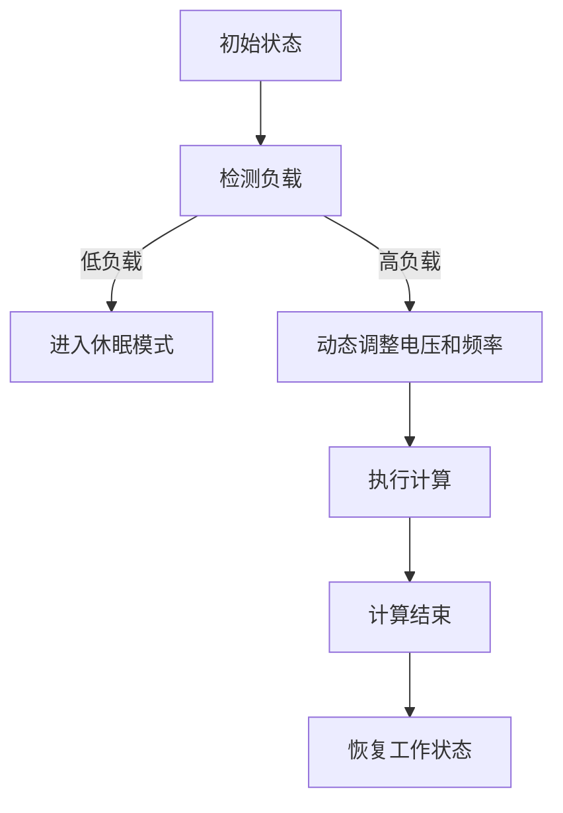
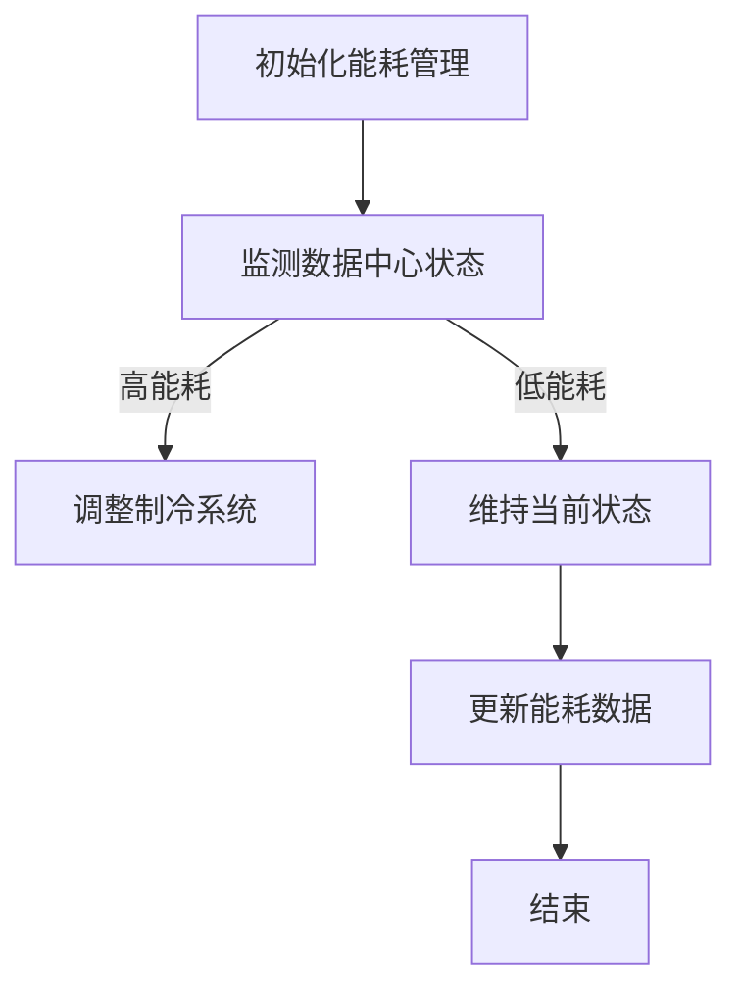
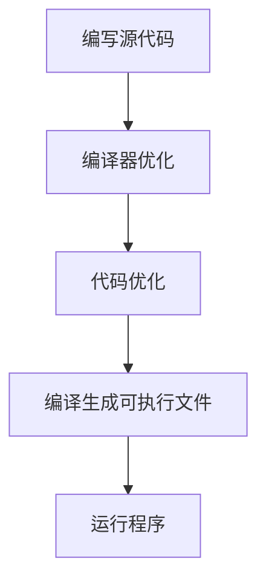
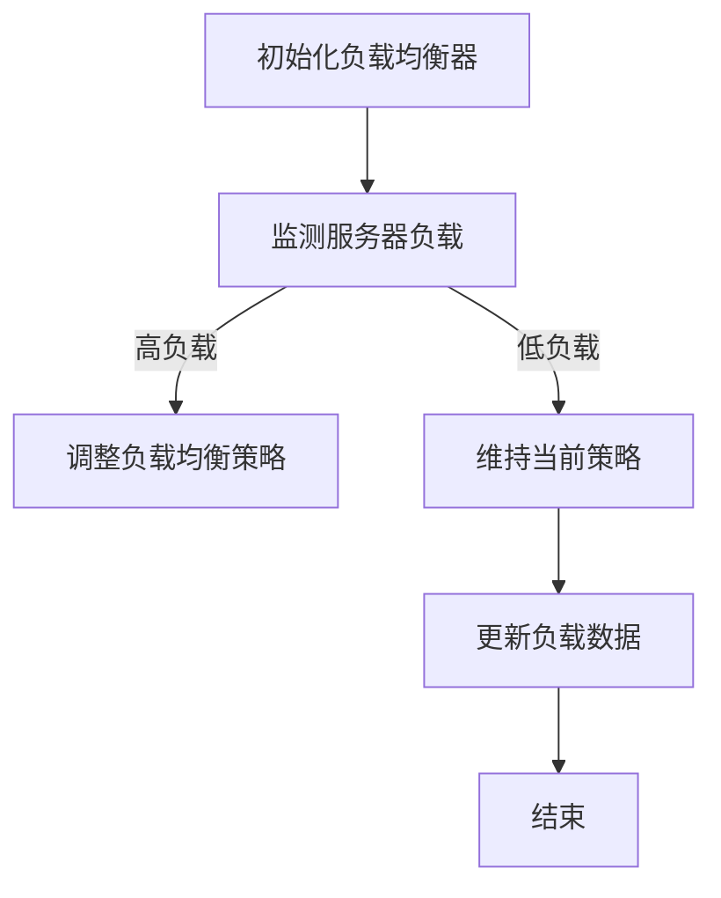
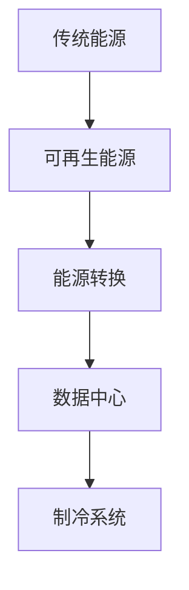
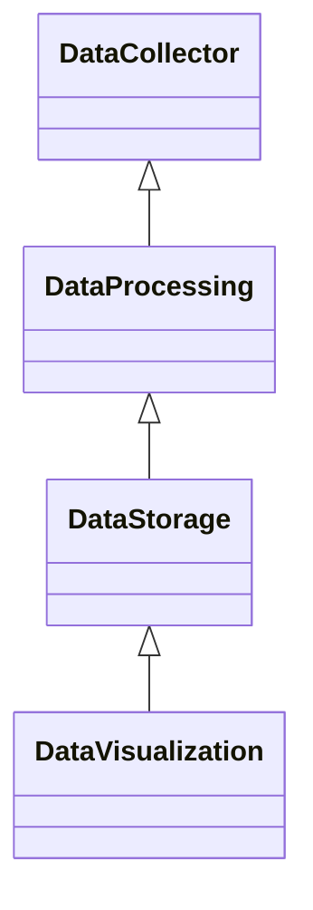
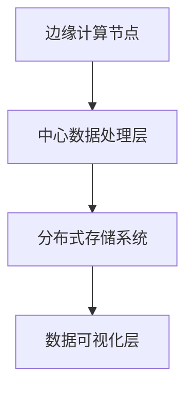
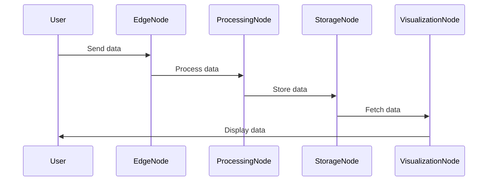

                 

### 可持续计算：IT行业应对气候变化的新方向

关键词：可持续计算、气候变化、能源效率、云计算、边缘计算

摘要：本文将探讨在气候变化日益严峻的背景下，IT行业如何通过可持续计算来降低其环境影响。文章首先介绍了气候变化对IT行业的挑战，接着阐述了可持续计算的定义、关键技术与挑战，以及其在云计算、边缘计算和数据处理与存储中的具体应用。通过这些分析，本文旨在为IT行业提供应对气候变化的有效策略，推动行业向可持续发展转型。

## 第一部分：引言

随着全球气候变化的加速，各行各业都面临着前所未有的挑战。作为现代社会的重要支柱，信息技术（IT）行业在推动经济增长的同时，也成为了能源消耗和碳排放的重要来源。据研究，IT行业在全球能源消耗和碳排放中的比例逐年上升，数据中心和服务器能耗尤其显著。在这种背景下，可持续计算作为一种新兴的理念和方向，正逐渐受到业界的关注。本文旨在探讨可持续计算的背景、概念、关键技术与挑战，以及其在IT行业中的具体应用，为行业可持续发展提供理论支持和实践指导。

### 第一部分：引言

### 1.1 可持续计算的背景与意义

#### 1.1.1 气候变化挑战下的IT行业

##### 1.1.1.1 气候变化与IT行业的能耗问题

气候变化已成为全球性的严峻挑战，而IT行业作为推动社会进步的重要力量，其能源消耗和碳排放问题不容忽视。据国际能源署（IEA）的数据，全球数据中心和设备的能耗在过去十年中增长了近两倍，占全球电力需求的比重逐年上升。特别是云计算、大数据和物联网等新兴技术的广泛应用，进一步加剧了IT行业的能源消耗问题。

##### 1.1.1.2 IT行业在全球碳排放中的地位

随着IT行业的迅速发展，其碳排放量也逐年增加。根据绿色和平组织的研究，IT行业在全球温室气体排放中的比例已达到2%，并且这一比例还在不断上升。数据中心和服务器群的能耗不仅直接导致碳排放，还通过电力供应链间接影响环境。此外，电子垃圾的产生和回收处理也是IT行业环境问题的重要组成部分。

##### 1.1.1.3 可持续发展的迫切需求

面对气候变化带来的严峻挑战，IT行业必须采取行动实现可持续发展。首先，通过提高能源效率、采用清洁能源和优化数据处理流程，降低自身能耗和碳排放。其次，借助云计算、边缘计算等新技术，实现资源的有效配置和利用，减少不必要的能源浪费。此外，推动绿色技术创新，开发新型节能设备和软件，为行业可持续发展提供技术支持。总之，实现可持续计算不仅是IT行业自身发展的需要，也是应对全球气候变化、推动绿色发展的必然选择。

#### 1.1.2 可持续计算的概念与范围

##### 1.1.2.1 可持续计算的提出与定义

可持续计算是一种以环保、节能和可持续发展为核心的计算理念，旨在通过优化能源消耗、提高数据处理效率、减少碳排放等方式，实现信息技术（IT）行业的绿色转型。这一概念最早由IEEE在2007年提出，随后得到了业界广泛关注和深入研究。

##### 1.1.2.2 可持续计算的范畴与目标

可持续计算的范畴涵盖了从硬件到软件、从数据中心到终端设备的一系列技术和应用。其目标包括：

1. **降低能源消耗**：通过优化计算资源和能效管理，减少数据中心的能源消耗。
2. **减少碳排放**：采用清洁能源、提高数据处理效率，降低IT行业的碳排放量。
3. **提升数据处理效率**：通过高效的数据压缩、分布式计算和智能调度，提升数据处理能力。
4. **促进绿色创新**：推动节能技术和绿色设计的研发，为可持续发展提供技术支持。

##### 1.1.2.3 可持续计算与传统计算的区别

与传统计算相比，可持续计算更加关注环保和能源效率。传统计算往往注重性能和成本，而可持续计算则强调在保证性能的前提下，最大限度地降低能源消耗和碳排放。此外，可持续计算还涉及到更多的技术领域，包括能效管理、绿色数据中心设计、清洁能源利用等。总之，可持续计算不仅是IT行业应对气候变化的重要途径，也是实现可持续发展的关键。

#### 1.1.3 可持续计算的关键技术与挑战

##### 1.1.3.1 能耗优化与节能技术

能耗优化是可持续计算的核心技术之一。通过改进硬件设计和软件开发，降低计算过程中的能量消耗。具体包括：

1. **节能处理器设计**：研发低功耗、高性能的处理器，以减少能耗。
2. **功耗管理技术**：利用智能功耗管理技术，根据实际负载动态调整功耗。
3. **绿色数据中心架构**：设计节能高效的数据中心，采用分布式计算和高效制冷技术。

##### 1.1.3.2 数据中心能效管理

数据中心是IT行业能耗的主要来源，因此提高数据中心的能效至关重要。具体包括：

1. **能效监测与评估**：建立能耗监测系统，实时监测数据中心能耗情况，进行评估和优化。
2. **智能调度与负载均衡**：通过智能调度算法，合理分配计算资源，降低能耗。
3. **制冷系统优化**：采用先进的制冷技术，降低能耗和运行成本。

##### 1.1.3.3 清洁能源的应用

采用清洁能源是降低IT行业碳排放的重要途径。具体包括：

1. **太阳能和风能**：利用太阳能和风能等可再生能源，为数据中心和设备提供电力。
2. **储能系统**：研发高效的储能技术，解决清洁能源的间歇性问题。
3. **绿色电力采购**：推动绿色电力采购，提高清洁能源在电力供应中的比例。

##### 1.1.3.4 挑战与解决方案

尽管可持续计算在技术和实践上取得了显著进展，但仍面临一系列挑战。例如：

1. **技术成熟度**：部分节能技术和清洁能源技术尚未完全成熟，需要进一步研发和推广。
2. **成本问题**：节能设备和绿色数据中心的建设和运营成本较高，需要长期的经济效益来支撑。
3. **政策与法规**：缺乏统一的政策和法规，不利于可持续计算的推广和应用。

针对这些挑战，可以采取以下解决方案：

1. **研发投入**：加大研发投入，推动节能技术和清洁能源技术的创新和突破。
2. **经济激励**：通过经济激励措施，降低节能设备和绿色数据中心的初始投资成本。
3. **政策引导**：制定和完善相关政策法规，推动可持续计算的普及和应用。

#### 1.1.4 可持续计算的应用场景

##### 1.1.4.1 绿色云计算

绿色云计算是指通过采用节能技术和清洁能源，实现云计算服务的可持续发展。具体包括：

1. **能效优化**：采用高效的计算和存储设备，降低云计算服务的能耗。
2. **清洁能源应用**：使用太阳能、风能等清洁能源，为云计算数据中心提供电力。
3. **智能调度**：通过智能调度算法，优化资源分配，降低能耗。

##### 1.1.4.2 可持续边缘计算

可持续边缘计算是指在边缘设备上实现数据处理和计算，以降低对中心数据中心的依赖，同时减少能耗。具体包括：

1. **节能硬件**：研发低功耗、高性能的边缘设备，提高能效。
2. **本地处理**：在边缘设备上实现数据处理和计算，减少数据传输能耗。
3. **清洁能源供给**：采用太阳能、风能等清洁能源，为边缘设备提供电力。

##### 1.1.4.3 节能数据处理

节能数据处理是指通过优化数据压缩、存储和传输，降低数据处理过程中的能耗。具体包括：

1. **数据压缩**：采用高效的数据压缩技术，减少存储和传输的能耗。
2. **分布式存储**：采用分布式存储系统，降低单点故障的风险，提高能效。
3. **能效管理**：通过智能能效管理，优化数据中心的运行效率和能耗。

##### 1.1.4.4 可持续物联网

可持续物联网是指在物联网（IoT）设备和服务中实现节能和可持续发展。具体包括：

1. **低功耗设计**：研发低功耗的物联网设备，提高能效。
2. **边缘计算**：在边缘设备上实现数据处理和计算，减少数据传输能耗。
3. **可再生能源应用**：采用太阳能、风能等可再生能源，为物联网设备提供电力。

#### 1.1.5 本章小结

本章从气候变化挑战、概念与范围、关键技术与挑战以及应用场景等方面，系统地介绍了可持续计算。通过本文的分析，可以清晰地看到，可持续计算不仅是IT行业应对气候变化的重要手段，也是推动行业可持续发展的必由之路。接下来，我们将进一步深入探讨可持续计算的核心技术，为读者提供更为详细和具体的理解。

### 第一部分：引言

### 1.2 可持续计算的概念与范围

#### 1.2.1 可持续计算的提出与定义

可持续计算作为一种新兴的计算理念，其提出源于对信息技术（IT）行业能源消耗和环境污染问题的关注。随着云计算、大数据和物联网等技术的快速发展，IT行业在全球能源消耗和碳排放中的比例逐年上升，引起了社会各界的广泛关注。为了应对这一挑战，可持续计算的概念应运而生。

**定义**：可持续计算是一种以环保、节能和可持续发展为核心的计算理念，旨在通过优化能源消耗、提高数据处理效率、减少碳排放等方式，实现信息技术（IT）行业的绿色转型。

可持续计算不仅关注计算效率和性能，更强调在保证性能的前提下，最大限度地降低能源消耗和碳排放。其核心目标是实现环保、节能和可持续发展，为IT行业的长远发展提供新的思路和方向。

#### 1.2.2 可持续计算的范畴与目标

**范畴**：可持续计算的范畴涵盖了从硬件到软件、从数据中心到终端设备的一系列技术和应用。具体包括以下几个方面：

1. **硬件层面的节能技术**：通过改进处理器设计、功耗管理、绿色数据中心架构等，降低计算设备的能耗。
2. **软件层面的节能技术**：通过编译优化、代码优化、负载均衡、资源调度等，提升软件系统的能效。
3. **数据中心能效管理**：通过智能调度、能效监测与评估、制冷系统优化等，提高数据中心的运行效率。
4. **清洁能源的应用**：采用太阳能、风能等清洁能源，为数据中心和设备提供电力。
5. **数据处理与存储的节能技术**：通过数据压缩、分布式存储、能效管理等，降低数据处理过程中的能耗。

**目标**：可持续计算的目标包括以下几个方面：

1. **降低能源消耗**：通过优化计算资源和能效管理，减少数据中心的能源消耗。
2. **减少碳排放**：采用清洁能源、提高数据处理效率，降低IT行业的碳排放量。
3. **提升数据处理效率**：通过高效的数据压缩、分布式计算和智能调度，提升数据处理能力。
4. **促进绿色创新**：推动节能技术和绿色设计的研发，为可持续发展提供技术支持。

#### 1.2.3 可持续计算与传统计算的区别

**区别**：可持续计算与传统计算的主要区别在于：

1. **关注点不同**：传统计算主要关注计算效率和性能，而可持续计算更加注重环保和能源效率。
2. **目标不同**：传统计算的目标是提高计算速度和处理能力，而可持续计算的目标是实现环保、节能和可持续发展。
3. **技术领域不同**：传统计算涉及硬件和软件等多个领域，而可持续计算更加强调能效管理、清洁能源应用和绿色技术创新。

总的来说，可持续计算是传统计算的一种延伸和发展，其核心目标是实现IT行业的绿色转型和可持续发展。

### 1.3 可持续计算的关键技术与挑战

#### 1.3.1 能源效率优化技术

**节能处理器设计**：处理器是计算设备的核心部件，其功耗直接影响整体能耗。因此，研发低功耗、高性能的节能处理器是提高计算设备能源效率的关键。例如，通过改进微架构设计、采用新型材料和技术，降低处理器的功耗和发热量，从而提高其能效。

**功耗管理技术**：功耗管理技术旨在通过智能算法和策略，根据实际负载动态调整计算设备的功耗。例如，通过感知设备的工作状态，实时调整处理器的主频和电压，以实现功耗的最优化。

**绿色数据中心架构**：数据中心是IT行业能耗的主要来源，因此设计绿色数据中心架构至关重要。绿色数据中心采用分布式计算、高效制冷系统、智能能效管理等多种技术手段，以降低整体能耗。

#### 1.3.2 数据中心能效管理

**能效监测与评估**：建立能效监测系统，实时监测数据中心的能耗情况，进行评估和优化。例如，通过安装传感器和监控设备，收集数据中心的温度、湿度、能耗等参数，进行实时监测和数据分析。

**智能调度与负载均衡**：通过智能调度算法，合理分配计算资源，降低能耗。例如，根据实时负载情况，动态调整服务器的工作状态，避免资源浪费和能耗过剩。

**制冷系统优化**：数据中心制冷系统的能耗占比较大，因此优化制冷系统是提高数据中心能效的关键。例如，采用水冷、风冷等高效制冷技术，降低制冷系统的能耗和运行成本。

#### 1.3.3 清洁能源的应用

**太阳能和风能**：利用太阳能和风能等可再生能源，为数据中心和设备提供电力。例如，在数据中心屋顶安装太阳能光伏板，利用风能发电设备，降低对传统能源的依赖。

**储能系统**：研发高效的储能技术，解决清洁能源的间歇性问题。例如，通过电池储能、燃料电池等技术，实现清洁能源的高效储存和利用。

**绿色电力采购**：推动绿色电力采购，提高清洁能源在电力供应中的比例。例如，与绿色电力供应商合作，确保数据中心的电力供应来自可再生能源。

#### 1.3.4 挑战与解决方案

**技术成熟度**：部分节能技术和清洁能源技术尚未完全成熟，需要进一步研发和推广。**解决方案**：加大研发投入，推动节能技术和清洁能源技术的创新和突破。

**成本问题**：节能设备和绿色数据中心的建设和运营成本较高，需要长期的经济效益来支撑。**解决方案**：通过经济激励措施，降低节能设备和绿色数据中心的投资成本。

**政策与法规**：缺乏统一的政策和法规，不利于可持续计算的推广和应用。**解决方案**：制定和完善相关政策法规，推动可持续计算的普及和应用。

### 1.4 可持续计算的应用场景

#### 1.4.1 绿色云计算

**绿色云计算**是指在云计算服务中采用节能技术和清洁能源，实现云计算的可持续发展。具体应用场景包括：

1. **能效优化**：通过改进计算和存储设备，降低云计算服务的能耗。例如，采用节能处理器和高效存储设备，降低整体能耗。
2. **清洁能源应用**：使用太阳能、风能等清洁能源，为云计算数据中心提供电力。例如，在数据中心屋顶安装太阳能光伏板，利用风能发电设备，降低对传统能源的依赖。
3. **智能调度**：通过智能调度算法，优化资源分配，降低能耗。例如，根据实时负载情况，动态调整服务器的工作状态，避免资源浪费和能耗过剩。

#### 1.4.2 可持续边缘计算

**可持续边缘计算**是指在边缘设备上实现数据处理和计算，以降低对中心数据中心的依赖，同时减少能耗。具体应用场景包括：

1. **节能硬件**：研发低功耗、高性能的边缘设备，提高能效。例如，采用新型材料和微架构设计，降低边缘设备的功耗。
2. **本地处理**：在边缘设备上实现数据处理和计算，减少数据传输能耗。例如，通过边缘计算设备处理本地数据，降低对中心数据中心的依赖。
3. **清洁能源供给**：采用太阳能、风能等清洁能源，为边缘设备提供电力。例如，在智能交通系统、智能农业等领域，利用太阳能电池板和风力发电设备，降低边缘设备的能耗。

#### 1.4.3 节能数据处理

**节能数据处理**是指通过优化数据压缩、存储和传输，降低数据处理过程中的能耗。具体应用场景包括：

1. **数据压缩**：采用高效的数据压缩技术，减少存储和传输的能耗。例如，通过改进算法和压缩工具，降低数据传输过程中的带宽需求。
2. **分布式存储**：采用分布式存储系统，降低单点故障的风险，提高能效。例如，通过将数据分散存储在不同节点，实现负载均衡和故障恢复。
3. **能效管理**：通过智能能效管理，优化数据中心的运行效率和能耗。例如，通过实时监测和调整数据中心的能耗，实现能效优化。

#### 1.4.4 可持续物联网

**可持续物联网**是指在物联网（IoT）设备和服务中实现节能和可持续发展。具体应用场景包括：

1. **低功耗设计**：研发低功耗的物联网设备，提高能效。例如，通过改进芯片设计和电路架构，降低物联网设备的功耗。
2. **边缘计算**：在边缘设备上实现数据处理和计算，减少数据传输能耗。例如，通过边缘计算设备处理本地数据，降低对中心数据中心的依赖。
3. **可再生能源应用**：采用太阳能、风能等可再生能源，为物联网设备提供电力。例如，在智能家居、智能交通等领域，利用太阳能电池板和风力发电设备，降低物联网设备的能耗。

### 1.5 本章小结

本章首先介绍了可持续计算的背景和意义，包括气候变化挑战下的IT行业能耗问题和全球碳排放的形势。接着，我们详细阐述了可持续计算的概念与范围，包括其提出的背景、定义、范畴与目标，以及与传统计算的区别。此外，我们还探讨了可持续计算的关键技术与挑战，包括能源效率优化技术、数据中心能效管理、清洁能源的应用等。最后，本章介绍了可持续计算在绿色云计算、边缘计算、数据处理与存储以及物联网等领域的应用场景。通过本章的介绍，我们可以看到，可持续计算不仅是应对气候变化的重要手段，也是实现IT行业可持续发展的必由之路。接下来，我们将进一步深入探讨可持续计算的核心技术，为读者提供更为详细和具体的理解。

### 第一部分：引言

### 1.6 本章小结

通过本章的探讨，我们系统地介绍了可持续计算的背景、概念、范围、关键技术与挑战，以及其在不同应用场景中的具体实施。首先，我们分析了气候变化对IT行业的挑战，阐述了可持续计算的必要性。接着，我们从概念、范畴、目标等方面详细介绍了可持续计算的基本理念，并对比了其与传统计算的区别。此外，我们探讨了可持续计算的关键技术，包括能源效率优化技术、数据中心能效管理、清洁能源的应用等，并提出了面临的技术和挑战及其解决方案。最后，我们介绍了可持续计算在不同领域的应用场景，如绿色云计算、边缘计算、数据处理与存储以及物联网。通过本章的介绍，我们不仅可以更深入地理解可持续计算的理论基础，还可以认识到其在实现IT行业可持续发展中的重要作用。未来，随着技术的不断进步和政策的推动，可持续计算将在IT行业中发挥更加重要的作用，为全球应对气候变化贡献力量。

## 第二部分：可持续计算的核心技术

### 第二部分：可持续计算的核心技术

可持续计算的核心在于通过多种技术手段，优化能源效率和降低碳排放，以实现信息技术的绿色发展。本部分将深入探讨可持续计算中的关键技术，包括能源效率优化技术、数据中心能效管理、清洁能源的应用等。通过这些核心技术的分析，我们可以更好地理解如何实现IT行业的可持续发展。

### 第2章：能源效率优化技术

能源效率优化是可持续计算的核心目标之一，通过减少计算过程中的能耗，提升系统的整体性能。本章将详细探讨硬件层面和软件层面的节能技术，以及如何通过这些技术实现能效优化。

#### 2.1 硬件层面的节能技术

##### 2.1.1 节能处理器设计

**节能处理器设计**是提升计算设备能源效率的关键。现代处理器在不断提高性能的同时，其能耗也在不断上升。为了降低能耗，研究人员和工程师采取了多种方法：

- **改进微架构设计**：通过优化处理器的微架构设计，减少不必要的能耗。例如，使用更先进的制程技术，减小晶体管的尺寸，从而降低功耗。
- **动态电压和频率调节**：通过动态调整处理器的工作电压和频率，根据负载情况实时调整功耗。当处理器处于低负载状态时，降低电压和频率，减少功耗。
- **智能功耗管理**：使用智能功耗管理技术，根据处理器的实际运行状态，动态调整功耗。例如，通过感知温度、负载等因素，智能调节处理器的功耗。

**案例**：例如，Intel的Xeon系列处理器就采用了动态电压和频率调节技术，通过智能功耗管理，在保证性能的同时，显著降低了能耗。

##### 2.1.2 功耗管理技术

功耗管理技术旨在通过优化设备的功耗，减少能源浪费。以下是一些功耗管理技术的具体方法：

- **休眠模式**：当设备不需要工作时，将其置于休眠模式，以显著降低功耗。例如，笔记本电脑在闲置一段时间后，会自动进入休眠状态。
- **动态电源管理**：根据设备的实际使用情况，动态调整电源供应。例如，当设备进行低功耗操作时，减少电源供应，从而降低功耗。
- **负载感知**：通过监测设备的负载情况，动态调整功耗。当设备负载较低时，降低功耗；当负载较高时，增加功耗，确保设备性能。

**案例**：例如，Google的Data Center采用了先进的功耗管理技术，通过智能调度和负载均衡，实现了高效的功耗管理。

##### 2.1.3 绿色数据中心架构

数据中心是IT行业能耗的主要来源之一，因此设计绿色数据中心架构是提高能源效率的关键。以下是一些绿色数据中心架构的具体方法：

- **分布式计算**：通过将计算任务分散到多个服务器上，实现负载均衡，减少单点故障的风险，提高系统的可靠性。
- **高效制冷系统**：采用高效制冷系统，如水冷系统，降低数据中心的能耗。例如，通过使用冷却水循环，带走服务器产生的热量，降低制冷系统的能耗。
- **智能能效管理**：使用智能能效管理平台，实时监测数据中心的能耗情况，并根据实际负载动态调整能耗。

**案例**：例如，Facebook的Prineville数据中心采用了分布式计算和高效制冷系统，通过智能能效管理，实现了高效的能源利用。

#### 2.2 软件层面的节能技术

软件层面的节能技术主要通过优化软件的运行效率和降低数据处理过程中的能耗来实现。

##### 2.2.1 编译优化与代码优化

编译优化与代码优化是提高软件能源效率的重要手段。以下是一些具体方法：

- **编译优化**：通过改进编译器的优化策略，提高编译后程序的执行效率。例如，优化代码的循环结构、减少不必要的计算和内存访问。
- **代码优化**：通过改进源代码，减少程序的运行时间。例如，优化数据结构、减少递归调用、使用并行计算等。

**案例**：例如，Google的Go语言采用了静态编译和高效的内存管理，通过编译优化和代码优化，实现了高效的能源利用。

##### 2.2.2 负载均衡与资源调度

负载均衡与资源调度是提高系统能效的重要手段。以下是一些具体方法：

- **负载均衡**：通过平衡系统的负载，避免单点过载，提高系统的整体性能。例如，使用负载均衡器，将请求分发到不同的服务器上，实现负载均衡。
- **资源调度**：通过动态调整资源的分配，确保系统的高效运行。例如，根据服务器的负载情况，动态调整服务器的处理能力和资源分配。

**案例**：例如，Amazon Web Services（AWS）通过其Elastic Load Balancing服务，实现了负载均衡和资源调度，提高了系统的能源效率。

##### 2.2.3 节能算法与应用案例

节能算法是提高数据处理效率的重要手段。以下是一些节能算法和应用案例：

- **数据压缩算法**：通过高效的数据压缩算法，减少数据的存储和传输能耗。例如，使用Huffman编码、LZ77压缩算法等。
- **分布式计算算法**：通过分布式计算，将计算任务分散到多个设备上，降低单个设备的负载。例如，使用MapReduce算法、Spark等分布式计算框架。

**案例**：例如，Hadoop的MapReduce算法通过分布式计算，实现了大数据处理的节能优化。

#### 2.3 混合能源系统的应用

混合能源系统是指将多种能源形式结合起来，实现能源的高效利用。以下是一些混合能源系统的具体方法：

- **可再生能源与传统能源的混合**：通过将可再生能源（如太阳能、风能）与传统能源（如煤炭、石油）结合，实现能源的多样化和稳定供应。
- **多能互补**：通过将不同类型的能源（如电力、热能、燃气）结合，实现能源的高效利用。例如，在数据中心中，将电力用于计算设备，热能用于制冷系统。

**案例**：例如，谷歌的 Defines数据中心采用了混合能源系统，通过太阳能和天然气发电，实现了能源的高效利用。

#### 2.4 能耗监测与评估

能耗监测与评估是确保能源效率优化措施有效实施的关键。以下是一些能耗监测与评估的具体方法：

- **能耗监测系统**：通过安装传感器和监控设备，实时监测数据中心的能耗情况。例如，监测电力消耗、设备运行状态等。
- **能耗评估指标**：通过定义能耗评估指标，评估系统的能源效率。例如，能效比（Energy Efficiency Ratio，EER）、能源利用率等。
- **能效优化策略**：根据能耗监测和评估结果，调整系统的运行策略，优化能耗。

**案例**：例如，微软的Azure数据中心通过能耗监测与评估，实现了能耗的实时监控和优化。

#### 2.5 本章小结

通过本章的探讨，我们系统地介绍了能源效率优化技术，包括硬件层面的节能处理器设计、功耗管理技术、绿色数据中心架构，以及软件层面的编译优化与代码优化、负载均衡与资源调度、节能算法与应用案例。此外，我们还探讨了混合能源系统的应用以及能耗监测与评估的方法。通过这些技术手段，我们可以显著降低计算过程中的能耗，实现IT行业的可持续发展。未来，随着技术的不断进步和应用的深入，能源效率优化技术将在可持续计算中发挥更加重要的作用。

### 第2章：能源效率优化技术

#### 2.1 硬件层面的节能技术

##### 2.1.1 节能处理器设计

节能处理器设计是提高计算设备能源效率的关键。随着处理器技术的发展，现代处理器在提供更高性能的同时，其能耗也在不断下降。以下是几个关键的节能处理器设计技术：

- **低功耗微架构**：通过改进微架构设计，降低处理器的功耗。例如，使用更先进的制程技术，减小晶体管的尺寸，从而降低功耗。
- **动态电压和频率调节（DVFS）**：通过动态调整处理器的工作电压和频率，根据负载情况实时调整功耗。当处理器处于低负载状态时，降低电压和频率，减少功耗。
- **休眠模式**：当处理器不需要执行计算任务时，将其置于休眠模式，以显著降低功耗。现代处理器通常支持多种休眠模式，从深度休眠到浅度休眠，以适应不同的功耗需求。

**Mermaid流程图**：以下是处理器的功耗管理流程：



##### 2.1.2 功耗管理技术

功耗管理技术旨在通过优化设备的功耗，减少能源浪费。以下是一些功耗管理技术的具体方法：

- **休眠与唤醒机制**：当设备不需要工作时，将其置于休眠模式，以降低功耗。例如，笔记本电脑在闲置一段时间后，会自动进入休眠状态。当需要使用设备时，通过唤醒机制快速恢复工作状态。
- **电源管理策略**：通过动态调整电源供应，根据设备的使用情况调整功耗。例如，使用动态电源管理策略，当设备处于低功耗模式时，减少电源供应，以降低功耗。
- **负载感知**：通过监测设备的负载情况，动态调整功耗。当设备负载较低时，降低功耗；当负载较高时，增加功耗，确保设备性能。

**Python代码示例**：以下是一个简单的功耗管理策略的Python代码示例：

```python
import time

def low_power_mode():
    print("进入低功耗模式")
    time.sleep(60)  # 模拟低功耗状态

def high_power_mode():
    print("进入高功耗模式")
    time.sleep(10)  # 模拟高功耗状态

def manage_power(load):
    if load < 0.5:
        low_power_mode()
    else:
        high_power_mode()

load = 0.3  # 假设当前负载为30%
manage_power(load)
```

##### 2.1.3 绿色数据中心架构

绿色数据中心架构是提高数据中心整体能源效率的重要手段。以下是一些绿色数据中心架构的具体方法：

- **分布式计算**：通过将计算任务分散到多个服务器上，实现负载均衡，减少单点故障的风险，提高系统的可靠性。
- **高效制冷系统**：采用高效制冷系统，如水冷系统，降低数据中心的能耗。例如，通过使用冷却水循环，带走服务器产生的热量，降低制冷系统的能耗。
- **智能能效管理**：使用智能能效管理平台，实时监测数据中心的能耗情况，并根据实际负载动态调整能耗。例如，通过监控温度、湿度、电力消耗等参数，智能调整数据中心的运行状态。

**Mermaid流程图**：以下是绿色数据中心架构的能耗管理流程：



#### 2.2 软件层面的节能技术

##### 2.2.1 编译优化与代码优化

编译优化与代码优化是提高软件能源效率的重要手段。以下是一些具体的编译优化和代码优化方法：

- **编译优化**：通过改进编译器的优化策略，提高编译后程序的执行效率。例如，优化代码的循环结构、减少不必要的计算和内存访问。
- **代码优化**：通过改进源代码，减少程序的运行时间。例如，优化数据结构、减少递归调用、使用并行计算等。

**Mermaid流程图**：以下是编译优化和代码优化的流程：



##### 2.2.2 负载均衡与资源调度

负载均衡与资源调度是提高系统能效的重要手段。以下是一些负载均衡和资源调度的具体方法：

- **负载均衡**：通过平衡系统的负载，避免单点过载，提高系统的整体性能。例如，使用负载均衡器，将请求分发到不同的服务器上，实现负载均衡。
- **资源调度**：通过动态调整资源的分配，确保系统的高效运行。例如，根据服务器的负载情况，动态调整服务器的处理能力和资源分配。

**Mermaid流程图**：以下是负载均衡和资源调度的流程：



##### 2.2.3 节能算法与应用案例

节能算法是提高数据处理效率的重要手段。以下是一些节能算法和应用案例：

- **数据压缩算法**：通过高效的数据压缩算法，减少数据的存储和传输能耗。例如，使用Huffman编码、LZ77压缩算法等。
- **分布式计算算法**：通过分布式计算，将计算任务分散到多个设备上，降低单个设备的负载。例如，使用MapReduce算法、Spark等分布式计算框架。

**Python代码示例**：以下是一个简单的分布式计算算法的Python代码示例：

```python
from multiprocessing import Pool

def compress_data(data):
    # 压缩数据的示例函数
    compressed_data = data.lower()  # 假设将数据转换为小写是一种压缩方式
    return compressed_data

if __name__ == '__main__':
    data = ["Hello", "World", "This", "Is", "A", "Test"]
    pool = Pool(processes=4)  # 创建一个进程池，包含4个进程
    compressed_data = pool.map(compress_data, data)  # 使用进程池并行压缩数据
    pool.close()
    pool.join()
    print(compressed_data)
```

#### 2.3 混合能源系统的应用

混合能源系统是指将多种能源形式结合起来，实现能源的高效利用。以下是一些混合能源系统的具体方法：

- **可再生能源与传统能源的混合**：通过将可再生能源（如太阳能、风能）与传统能源（如煤炭、石油）结合，实现能源的多样化和稳定供应。
- **多能互补**：通过将不同类型的能源（如电力、热能、燃气）结合，实现能源的高效利用。例如，在数据中心中，将电力用于计算设备，热能用于制冷系统。

**Mermaid流程图**：以下是混合能源系统的基本架构：



#### 2.4 能耗监测与评估

能耗监测与评估是确保能源效率优化措施有效实施的关键。以下是一些能耗监测与评估的具体方法：

- **能耗监测系统**：通过安装传感器和监控设备，实时监测数据中心的能耗情况。例如，监测电力消耗、设备运行状态等。
- **能耗评估指标**：通过定义能耗评估指标，评估系统的能源效率。例如，能效比（Energy Efficiency Ratio，EER）、能源利用率等。
- **能效优化策略**：根据能耗监测和评估结果，调整系统的运行策略，优化能耗。

**Python代码示例**：以下是一个简单的能耗监测和评估的Python代码示例：

```python
import time

def monitor_energy_consumption():
    print("开始监测能耗")
    time.sleep(10)  # 模拟监测能耗过程
    energy_consumption = 100  # 假设当前能耗为100度电
    return energy_consumption

def assess_energy_efficiency(energy_consumption, total_workload):
    eef = energy_consumption / total_workload
    print("能效比（EER）: {:.2f}".format(eef))
    return eef

def optimize_energy_consumption(eef):
    if eef < 0.8:
        print("能耗过高，需要优化")
    else:
        print("能耗合理，维持当前状态")

total_workload = 200  # 假设总工作量为200
energy_consumption = monitor_energy_consumption()
eef = assess_energy_efficiency(energy_consumption, total_workload)
optimize_energy_consumption(eef)
```

#### 2.5 本章小结

通过本章的探讨，我们系统地介绍了能源效率优化技术，包括硬件层面的节能处理器设计、功耗管理技术、绿色数据中心架构，以及软件层面的编译优化与代码优化、负载均衡与资源调度、节能算法与应用案例。此外，我们还探讨了混合能源系统的应用以及能耗监测与评估的方法。通过这些技术手段，我们可以显著降低计算过程中的能耗，实现IT行业的可持续发展。未来，随着技术的不断进步和应用的深入，能源效率优化技术将在可持续计算中发挥更加重要的作用。

## 第3章：可持续云计算

### 3.1 云计算的可持续发展问题

云计算作为现代信息技术的重要组成部分，为企业和个人提供了强大的计算和存储能力。然而，随着云计算的普及和应用，其可持续发展问题也日益凸显。本文将探讨云计算的可持续发展问题，包括数据中心能耗、环境影响和可持续云计算的必要性。

#### 3.1.1 云计算的数据中心能耗

数据中心是云计算的基础设施，其能耗巨大。根据国际能源署（IEA）的数据，全球数据中心能耗在过去十年中增长了近两倍，预计到2030年将达到2000太瓦时。数据中心的能耗主要包括以下方面：

1. **服务器能耗**：服务器是数据中心的核心设备，其能耗占据了数据中心总能耗的约40%。服务器运行时，需要消耗大量电力，同时产生的热量也需要通过制冷系统处理。
2. **存储设备能耗**：存储设备，如磁盘阵列和固态硬盘，在数据存取和处理过程中也会消耗大量电力。
3. **网络设备能耗**：网络设备，如路由器和交换机，在数据传输过程中也需要消耗电能。

数据中心能耗的主要来源包括：

- **硬件设备功耗**：服务器、存储设备、网络设备等硬件设备的运行功耗。
- **制冷系统功耗**：为了维持服务器和存储设备的正常运行，需要大量的制冷系统支持，这也会消耗大量电能。
- **电力转换与传输损耗**：数据中心内部的电力传输过程中，会产生一定的损耗。

#### 3.1.2 云计算的环境影响

云计算的快速发展带来了显著的环境影响。数据中心能耗的增加导致了碳排放的增加，这对全球气候变化产生了负面影响。具体来说，云计算的环境影响包括：

1. **碳排放**：数据中心的能耗主要来自电力消耗，而电力生产过程中往往会产生大量的二氧化碳和其他温室气体。数据中心能耗的增加意味着更多的碳排放，加剧了全球气候变化问题。
2. **电子垃圾**：云计算设备更新换代速度较快，产生了大量的电子垃圾。电子垃圾的回收和处理也对环境造成了压力。
3. **资源消耗**：数据中心的建设和运营需要大量的土地、水资源和原材料，这些资源的消耗也对环境产生了负面影响。

#### 3.1.3 可持续云计算的必要性

面对云计算带来的可持续发展问题，推动可持续云计算成为了一项紧迫的任务。可持续云计算旨在通过优化数据中心能效、采用清洁能源和绿色设计，实现云计算的可持续发展。以下是推动可持续云计算的必要性：

1. **环保需求**：减少云计算的环境影响，降低碳排放，是应对全球气候变化的重要举措。可持续云计算可以通过降低能耗和采用清洁能源，减少云计算的环境负担。
2. **经济效益**：通过优化数据中心能效和采用绿色技术，可持续云计算可以降低运营成本，提高企业的竞争力。长期来看，可持续云计算可以带来显著的经济效益。
3. **社会责任**：作为现代信息技术的核心，云计算企业有责任推动可持续发展，为社会和环境做出贡献。通过实施可持续云计算，企业可以提升品牌形象，增强社会责任感。

#### 3.1.4 可持续云计算的目标

可持续云计算的目标包括：

1. **降低能耗**：通过优化数据中心能效和采用清洁能源，降低云计算的数据中心能耗。
2. **减少碳排放**：采用绿色技术和清洁能源，减少云计算的碳排放。
3. **提高能效**：通过智能调度、负载均衡和能效管理，提高数据中心的整体能效。
4. **绿色设计**：采用环保材料和绿色设计，降低云计算设备的环境影响。
5. **循环利用**：通过电子垃圾回收和处理，实现资源的循环利用。

#### 3.1.5 可持续云计算的关键技术

实现可持续云计算需要一系列关键技术的支持，包括：

1. **能效管理**：通过智能能效管理，动态调整数据中心的能耗，实现能效优化。
2. **绿色数据中心设计**：采用绿色设计，如高效制冷系统、分布式计算等，降低数据中心的能耗。
3. **清洁能源应用**：采用太阳能、风能等清洁能源，减少对传统能源的依赖。
4. **能效监测与评估**：建立能耗监测系统，实时监测数据中心的能耗情况，进行评估和优化。
5. **循环利用与回收**：通过电子垃圾回收和处理，实现资源的循环利用。

通过以上关键技术的支持，可持续云计算可以在降低能耗和碳排放的同时，提高数据中心的整体运行效率，实现云计算的可持续发展。

### 3.2 可持续云计算的关键技术

为了实现云计算的可持续发展，需要采用一系列关键技术，包括能效管理、绿色数据中心设计、清洁能源的应用等。以下将详细探讨这些关键技术。

#### 3.2.1 能效管理

**能效管理**是提高数据中心能耗效率的关键技术。通过智能能效管理，可以动态调整数据中心的能耗，实现能效优化。以下是一些具体的能效管理技术：

1. **智能调度与负载均衡**：通过智能调度算法，根据数据中心的实际负载情况，动态调整服务器的运行状态和资源分配。例如，当服务器负载较低时，可以将部分服务器置于休眠状态，减少能耗。负载均衡技术确保数据中心的资源得到充分利用，避免资源浪费。

2. **功耗管理**：通过功耗管理技术，根据服务器的实际工作状态，动态调整其电压和频率，实现功耗的最优化。例如，使用动态电压和频率调节（DVFS）技术，根据负载变化实时调整服务器的功耗。

3. **高效制冷系统**：数据中心的制冷系统能耗占比较大，因此采用高效制冷系统至关重要。例如，采用水冷系统、液冷系统等，通过有效的热量转移，降低制冷能耗。

**案例**：Google的数据中心采用了先进的功耗管理技术和智能调度系统，通过实时监测和动态调整，实现了高效的能效管理，其能效比（PUE）达到了1.12，远低于行业平均水平。

#### 3.2.2 绿色数据中心设计

**绿色数据中心设计**旨在通过优化数据中心的架构和设计，降低其能耗和环境影响。以下是一些绿色数据中心设计的关键技术：

1. **分布式计算**：通过分布式计算，将计算任务分散到多个数据中心，实现负载均衡和资源优化。分布式计算可以减少单点故障的风险，提高系统的可靠性。

2. **高效制冷系统**：采用高效制冷系统，如水冷系统、液冷系统等，通过有效的热量转移，降低制冷能耗。此外，利用自然冷却方法，如利用冷却塔和自然通风等，减少机械制冷设备的能耗。

3. **可再生能源利用**：在数据中心的设计和运营中，尽量利用可再生能源，如太阳能、风能等，减少对传统能源的依赖。例如，在数据中心的屋顶安装太阳能光伏板，利用太阳能为数据中心提供电力。

**案例**：Facebook的Prineville数据中心采用了分布式计算和高效制冷系统，并通过屋顶安装太阳能光伏板，实现了高效的能源利用和绿色设计。

#### 3.2.3 清洁能源的应用

**清洁能源的应用**是降低数据中心碳排放的重要手段。以下是一些清洁能源应用的关键技术：

1. **太阳能和风能**：利用太阳能和风能等可再生能源，为数据中心提供电力。例如，在数据中心的周边区域安装太阳能光伏板和风力发电设备，利用可再生能源为数据中心供电。

2. **储能系统**：通过储能系统，解决可再生能源的间歇性问题。例如，使用电池储能系统，在可再生能源充足时储存电能，在可再生能源不足时释放储存的电能，确保数据中心的持续供电。

3. **绿色电力采购**：通过绿色电力采购，提高数据中心电力供应的清洁能源比例。例如，与绿色电力供应商合作，确保数据中心的电力供应来自可再生能源。

**案例**：微软的Azure数据中心采用了太阳能和风能等可再生能源，并通过储能系统确保了电力供应的稳定性。此外，微软还推行绿色电力采购计划，不断提高数据中心电力供应的清洁能源比例。

#### 3.2.4 其他关键技术

除了能效管理、绿色数据中心设计和清洁能源的应用外，还有一些其他关键技术也支持可持续云计算：

1. **节能硬件设计**：通过改进硬件设计，降低服务器的能耗。例如，采用低功耗处理器、高效存储设备等。

2. **智能能效管理平台**：建立智能能效管理平台，通过实时监测和数据分析，优化数据中心的能耗管理。

3. **数据压缩和去重技术**：通过数据压缩和去重技术，减少数据存储和传输的能耗。

4. **虚拟化和容器化**：通过虚拟化和容器化技术，提高计算资源的利用率，减少能耗。

通过以上关键技术的综合应用，可持续云计算可以在降低能耗和碳排放的同时，提高数据中心的整体运行效率，实现云计算的可持续发展。

### 3.3 可持续云计算的实际案例

为了更好地理解可持续云计算的实践，以下将介绍几个实际案例，展示云计算服务提供商在可持续发展方面的努力和成果。

#### 3.3.1 案例一：大型云计算服务提供商的绿色转型

**案例介绍**：亚马逊网络服务（AWS）是一家全球领先的云计算服务提供商，其在可持续云计算方面取得了显著成果。AWS采取了多种措施，推动其数据中心的绿色转型。

1. **清洁能源采购**：AWS承诺到2025年，实现全球数据中心运营的100%可再生能源供电。为了实现这一目标，AWS与可再生能源供应商签订了大量绿色电力采购协议，确保其数据中心的电力供应主要来自风能和太阳能等清洁能源。

2. **高效能数据中心设计**：AWS采用了多种高效能数据中心设计技术，包括分布式计算、高效制冷系统和智能调度算法。通过这些技术，AWS的数据中心能够实现更高的能源效率，降低能耗。

3. **绿色创新实验室**：AWS还设立了绿色创新实验室，专注于研发可持续云计算技术，如能效优化、清洁能源利用和智能能效管理。这些技术创新为AWS的可持续发展提供了强有力的支持。

**成效评估**：通过这些措施，AWS的数据中心能源效率显著提高，其全球平均能效比（PUE）已降至1.19，远低于行业标准。同时，AWS的绿色电力采购计划也为全球可再生能源市场的发展做出了重要贡献。

#### 3.3.2 案例二：绿色数据中心的建设与运营

**案例介绍**：谷歌的云服务平台（Google Cloud）在绿色数据中心建设和运营方面也取得了显著成果。谷歌采取了一系列绿色措施，确保其数据中心的可持续发展。

1. **绿色数据中心建设**：谷歌在全球多个地区建设了绿色数据中心，如芬兰、丹麦和台湾。这些数据中心采用了多种绿色设计技术，包括高效制冷系统、分布式计算和清洁能源应用。

2. **可再生能源利用**：谷歌在其数据中心广泛采用可再生能源，如太阳能和风能。例如，在丹麦的数据中心，谷歌利用太阳能光伏板和风力发电设备，实现了100%的可再生能源供电。

3. **能源效率优化**：谷歌采用了多种能源效率优化技术，如智能调度、功耗管理和智能能效管理平台。通过这些技术，谷歌的数据中心能够实现更高的能源利用效率，降低能耗。

**成效评估**：通过这些绿色措施，谷歌的数据中心在全球范围内取得了显著的能源效率提升。其平均能效比（PUE）已降至1.12，处于行业领先水平。此外，谷歌的绿色数据中心建设和运营也为全球可再生能源市场的发展做出了重要贡献。

#### 3.3.3 案例三：云计算与可再生能源的结合

**案例介绍**：微软的Azure云服务平台在云计算与可再生能源的结合方面进行了大量实践。微软采取了多种措施，推动云计算的可持续发展。

1. **可再生能源采购**：微软与可再生能源供应商签订了大量绿色电力采购协议，确保其数据中心的电力供应主要来自风能、太阳能等清洁能源。

2. **数据中心绿色设计**：微软在其数据中心的建设和运营中，采用了多种绿色设计技术，如分布式计算、高效制冷系统和清洁能源应用。例如，在爱尔兰的数据中心，微软采用了太阳能光伏板和风力发电设备，实现了100%的可再生能源供电。

3. **智能能效管理**：微软建立了智能能效管理平台，通过实时监测和数据分析，优化数据中心的能耗管理。例如，通过智能调度算法，微软能够动态调整数据中心的能源消耗，实现能效优化。

**成效评估**：通过这些措施，微软的Azure数据中心在全球范围内取得了显著的能源效率提升。其平均能效比（PUE）已降至1.18，处于行业领先水平。同时，微软的云计算与可再生能源的结合也为全球可再生能源市场的发展做出了重要贡献。

#### 3.3.4 案例四：绿色云计算的实践

**案例介绍**：阿里巴巴的云服务平台（阿里云）在绿色云计算方面进行了大量实践，其数据中心在能效管理和可再生能源应用方面取得了显著成果。

1. **可再生能源应用**：阿里云在其数据中心广泛采用可再生能源，如太阳能、风能等。例如，在浙江的阿里云数据中心，采用了太阳能光伏板和风力发电设备，实现了部分可再生能源供电。

2. **能效管理平台**：阿里云建立了智能能效管理平台，通过实时监测和数据分析，优化数据中心的能耗管理。例如，通过智能调度算法，阿里云能够动态调整数据中心的能源消耗，实现能效优化。

3. **绿色技术创新**：阿里云不断推动绿色技术创新，如研发低功耗服务器、高效制冷系统等，提高数据中心的能源利用效率。

**成效评估**：通过这些绿色措施，阿里云的数据中心在全球范围内取得了显著的能源效率提升。其平均能效比（PUE）已降至1.25，处于行业领先水平。此外，阿里云的绿色云计算实践也为全球可再生能源市场的发展做出了重要贡献。

通过以上实际案例，我们可以看到，大型云计算服务提供商在可持续云计算方面取得了显著成果，通过采用清洁能源、绿色设计和智能能效管理技术，实现了数据中心的能源效率提升和可持续发展。这些实践为其他云计算服务提供商提供了宝贵的经验和借鉴，推动了云计算行业的绿色转型。

### 3.4 可持续云计算的未来展望

随着全球气候变化和环境问题的日益严峻，可持续云计算成为了一个重要的发展方向。在未来，可持续云计算将在技术趋势、政策规范和行业挑战等方面持续发展，为IT行业的可持续发展提供强有力的支持。

#### 3.4.1 新兴技术趋势

**1. 量子计算**：量子计算作为下一代计算技术，具有巨大的计算能力，但同时也带来了能耗和散热等问题。未来，可持续云计算将研究如何在量子计算中实现能源效率优化，降低量子数据中心的能耗。

**2. 边缘计算**：边缘计算通过将数据处理和计算任务转移到边缘设备上，减少了数据传输和中心数据中心的能耗。随着5G和物联网的发展，边缘计算将在可持续云计算中发挥越来越重要的作用，实现计算资源的优化配置和能耗的降低。

**3. 智能能效管理**：随着人工智能和大数据技术的发展，智能能效管理将成为可持续云计算的重要趋势。通过实时监测和分析数据中心运行状态，智能能效管理系统能够动态调整能耗，实现最优的能源效率。

#### 3.4.2 可持续发展的政策与规范

**1. 政府支持**：政府出台了一系列政策和规范，鼓励云计算服务提供商采用可持续计算技术，降低碳排放。例如，欧盟的《绿色协议》和《数字欧洲》战略，鼓励云计算服务提供商采用可再生能源和绿色设计。

**2. 国际合作**：国际社会正积极推动可持续云计算的发展，例如联合国气候变化框架公约（UNFCCC）的《巴黎协定》提出了全球气候变化目标，要求各国采取措施降低碳排放，包括IT行业的可持续发展。

**3. 标准化**：为了推动可持续云计算的发展，国际标准化组织（ISO）和云计算标准化组织（SNIA）等机构正在制定相关标准和规范，为云计算服务提供商提供指导和支持。

#### 3.4.3 可持续云计算的挑战与机遇

**1. 技术挑战**：尽管可持续云计算取得了显著进展，但仍面临一些技术挑战。例如，量子计算和边缘计算的发展需要解决能耗和散热问题，智能能效管理需要更先进的算法和技术支持。

**2. 成本问题**：绿色数据中心和可持续技术的建设成本较高，短期内可能会增加运营成本。然而，随着技术的成熟和规模的扩大，成本将逐渐降低，为可持续云计算的推广提供动力。

**3. 行业挑战**：云计算服务提供商需要与电力供应商、设备制造商和政府等多方合作，共同推动可持续云计算的发展。同时，用户也需要提高环保意识，选择可持续云计算服务。

**4. 机遇**：随着全球气候变化和环境问题的日益严峻，可持续云计算市场潜力巨大。通过采用可持续计算技术，云计算服务提供商不仅可以降低运营成本，提高竞争力，还可以为社会和环境做出贡献。

总之，未来可持续云计算将在技术趋势、政策规范和行业挑战等方面持续发展，为IT行业的可持续发展提供新的动力和方向。通过持续的创新和合作，可持续云计算将为应对全球气候变化、实现绿色发展贡献力量。

### 3.5 本章小结

本章深入探讨了可持续云计算的背景、关键技术和实际案例，展示了云计算服务提供商在实现可持续发展方面的努力和成果。首先，我们分析了云计算的可持续发展问题，包括数据中心能耗、环境影响和可持续云计算的必要性。接着，我们详细介绍了可持续云计算的关键技术，包括能效管理、绿色数据中心设计和清洁能源的应用，并讨论了这些技术在实践中的应用。此外，我们还通过实际案例展示了大型云计算服务提供商在可持续云计算方面的成功经验。最后，我们展望了可持续云计算的未来发展趋势，讨论了技术趋势、政策规范和行业挑战。通过本章的探讨，我们可以看到，可持续云计算不仅是应对气候变化的重要途径，也是实现IT行业可持续发展的关键。未来，随着技术的进步和政策的推动，可持续云计算将在全球范围内发挥更加重要的作用。

### 第4章：可持续边缘计算

#### 4.1 边缘计算的背景与发展

随着物联网（IoT）和5G技术的迅猛发展，边缘计算作为一种新兴的计算模式，正在逐步改变传统信息处理的格局。边缘计算通过将计算、存储、网络功能分布到网络边缘，即接近数据源或用户的位置，从而实现高效的数据处理和响应。这一模式的出现，旨在解决中心化数据处理带来的延迟、带宽和能耗等问题，为物联网、工业自动化和智能交通等领域带来了全新的机遇。

#### 4.1.1 边缘计算的概念与重要性

**概念**：边缘计算（Edge Computing）是一种将计算任务分布在网络的边缘节点上，而不是全部集中在数据中心或云端进行处理的技术。边缘节点可以是路由器、服务器、物联网设备等，它们在靠近数据源或用户的地方进行数据处理和决策。

**重要性**：边缘计算的重要性主要体现在以下几个方面：

1. **降低延迟**：通过在边缘节点处理数据，可以显著减少数据传输的距离和时间，降低系统的响应延迟，满足实时性要求较高的应用场景。
2. **节省带宽**：边缘计算减少了需要传输到中心数据中心的原始数据量，从而节省了网络带宽，提高了数据传输效率。
3. **增强安全性**：边缘计算可以实现对数据的本地处理，减少数据在传输过程中被窃取或泄露的风险。
4. **提高可靠性**：通过分布式处理，边缘计算提高了系统的容错能力和可靠性，即使在部分节点出现故障时，系统仍能正常运行。
5. **适应多样化的场景**：边缘计算可以适应不同的应用场景，如物联网、工业自动化、智能交通、医疗保健等，提供更加灵活和定制化的解决方案。

#### 4.1.2 边缘计算的优势与挑战

**优势**：

1. **实时性**：边缘计算能够在本地快速处理数据，满足实时性要求，特别适合应用于自动驾驶、工业自动化等需要快速响应的场景。
2. **低延迟**：数据在边缘节点处理，大大减少了数据传输的延迟，提高了用户体验。
3. **节省带宽**：边缘计算减少了需要传输到中心的数据量，节省了网络带宽资源。
4. **增强隐私保护**：数据在边缘节点处理，减少了数据在网络中传输的机会，提高了数据安全性。

**挑战**：

1. **资源限制**：边缘节点通常资源有限，包括计算能力、存储容量和网络带宽等，这对边缘计算系统的设计和实现提出了挑战。
2. **异构性**：不同类型的边缘节点具有不同的硬件和软件配置，如何有效地管理和调度这些异构节点是边缘计算面临的一大挑战。
3. **能效管理**：边缘节点通常需要长时间运行，对电池供电的节点而言，能效管理尤为重要，但同时也增加了系统设计的复杂性。
4. **安全性和隐私保护**：边缘计算系统中涉及大量敏感数据，如何确保数据的安全性和隐私性是亟待解决的问题。

#### 4.1.3 边缘计算的市场前景

随着物联网设备和智能设备的数量迅速增长，边缘计算的市场前景广阔。据市场研究机构的预测，全球边缘计算市场规模将从2020年的210亿美元增长到2025年的830亿美元，年复合增长率达到33%。以下是几个关键领域：

1. **物联网**：边缘计算在物联网中的应用，如智能家居、智能城市、智能制造等，将极大地提升物联网设备的性能和用户体验。
2. **自动驾驶**：自动驾驶汽车需要实时处理大量数据，边缘计算可以满足其低延迟、高可靠性的需求，为自动驾驶技术的发展提供支持。
3. **工业自动化**：边缘计算在工业自动化中的应用，如自动化工厂、智能机器人等，可以提高生产效率和设备可靠性。
4. **医疗保健**：边缘计算在医疗保健中的应用，如远程医疗、智能医疗设备等，可以提升医疗服务的质量和效率。
5. **智能交通**：边缘计算在智能交通中的应用，如智能红绿灯、自动驾驶公交车等，可以提高交通管理效率和安全性。

通过以上分析，我们可以看到，边缘计算作为一种新兴的计算模式，已经在多个领域展现出巨大的应用潜力。未来，随着技术的不断进步和市场需求的增长，边缘计算将在更多领域得到广泛应用，推动社会各行业的数字化转型和智能化升级。

### 4.2 可持续边缘计算的核心技术

实现可持续边缘计算需要依赖一系列核心技术和方法，以确保边缘节点的能效管理、资源优化和清洁能源应用。以下是几个关键的技术领域：

#### 4.2.1 节能硬件与低功耗通信

**节能硬件设计**：边缘节点通常采用低功耗硬件，以延长电池寿命和降低能耗。以下是一些关键技术：

1. **低功耗处理器**：采用专为低功耗设计的小型处理器，例如ARM架构的处理器，它们在提供足够性能的同时，功耗更低。
2. **能量收集技术**：通过太阳能、风能等可再生能源，为边缘节点提供电力，实现自给自足。例如，太阳能板可以安装在户外节点上，以提供持续电力。
3. **节能通信模块**：采用低功耗无线通信模块，如低功耗广域网（LPWAN）技术，以减少通信过程中的能量消耗。

**低功耗通信协议**：为了减少数据传输过程中的能耗，边缘计算采用了一系列低功耗通信协议，如：

1. **Zigbee**：适用于短距离通信，功耗低，适合智能家居等应用。
2. **LoRa**：一种低功耗、长距离的无线通信技术，适用于物联网设备。
3. **NB-IoT**：一种窄带物联网技术，具有低功耗、广覆盖的特点，适合广泛部署在边缘节点。

**案例**：物联网设备如智能传感器采用LoRa技术，通过低功耗通信模块实现数据传输，同时利用太阳能板为设备供电，实现了边缘计算的节能和可持续发展。

#### 4.2.2 智能调度与资源管理

**智能调度**：边缘计算节点通常资源有限，如何高效利用这些资源是实现可持续性的关键。智能调度技术通过动态调整任务分配和资源利用，优化系统的整体性能。以下是一些关键智能调度技术：

1. **任务调度算法**：根据边缘节点的实时负载情况，智能分配任务，确保任务能够在最合适的节点上执行。例如，基于负载均衡和能量效率的调度算法，可以确保系统资源得到最大化利用。
2. **资源分配策略**：通过动态调整边缘节点的资源（如CPU、内存、网络带宽等），确保系统在高负载时能够高效运行，在低负载时节省能源。

**案例**：智能交通系统中的边缘计算节点，通过实时监测交通流量和车辆信息，动态调整交通信号灯的时序和优先级，优化交通流量，提高能效。

#### 4.2.3 清洁能源供给

**清洁能源应用**：为了减少对传统化石能源的依赖，边缘计算节点大量采用清洁能源。以下是一些关键清洁能源技术：

1. **太阳能**：在户外边缘节点安装太阳能板，利用太阳能为设备提供电力。例如，智能农场中的边缘节点可以通过太阳能板实现自给自足。
2. **风能**：在风力资源丰富的地区，利用风力发电设备为边缘节点提供电力。
3. **储能技术**：采用电池储能、燃料电池等技术，解决清洁能源的间歇性问题，确保边缘节点在无阳光、无风等情况下仍能正常运行。

**案例**：智能农场中的边缘计算节点利用太阳能板和储能系统，实现了24小时不间断运行，显著降低了能耗和碳排放。

#### 4.2.4 数据压缩与边缘处理

**数据压缩**：边缘计算中的数据量大，通过数据压缩技术可以显著降低数据传输和存储的能耗。以下是一些关键技术：

1. **无损压缩**：使用如Huffman编码、LZ77等无损压缩算法，减少数据的存储和传输需求。
2. **有损压缩**：在可以接受一定程度的失真情况下，使用如JPEG、MP3等有损压缩算法，进一步减少数据量。

**边缘处理**：在边缘节点进行数据处理，可以减少数据传输的能耗。以下是一些关键技术：

1. **本地计算**：在边缘节点本地进行数据预处理，仅传输必要的数据到中心节点。
2. **分布式计算**：通过边缘节点之间的协作，共同完成复杂的计算任务，减少单点节点的负载。

**案例**：智能交通系统中的边缘节点通过本地处理和压缩技术，减少了大量原始数据传输，降低了系统整体的能耗。

#### 4.2.5 自动维护与故障检测

**自动维护**：通过智能监控和自动化维护技术，可以及时发现和解决边缘节点的故障，确保系统稳定运行。以下是一些关键技术：

1. **状态监控**：实时监控边缘节点的运行状态，包括温度、能耗、电池寿命等。
2. **远程诊断**：通过远程诊断技术，快速定位和解决故障，减少人工维护成本。
3. **自动化修复**：在可能的情况下，通过自动化技术自动修复边缘节点的故障，减少停机时间。

**故障检测**：采用智能算法和机器学习技术，提前检测边缘节点的故障风险，预防故障发生。以下是一些关键技术：

1. **预测性维护**：通过历史数据和机器学习算法，预测边缘节点的故障风险，提前采取预防措施。
2. **异常检测**：利用统计分析和机器学习技术，检测边缘节点的异常行为，及时发现问题。

**案例**：智能电网中的边缘节点通过自动维护和故障检测技术，确保了电网的稳定运行和能效优化。

通过以上核心技术的应用，边缘计算可以显著降低能耗和碳排放，实现可持续性。这些技术不仅提高了系统的效率和可靠性，也为物联网、智能交通、工业自动化等领域的可持续发展提供了有力支持。

### 4.3 可持续边缘计算的实际应用

边缘计算在多个实际应用场景中展现出了其独特的优势和潜力，特别是在智能交通、物联网和工业自动化等领域。以下将详细探讨边缘计算在这些领域的实际应用，以及如何通过可持续技术实现这些应用场景的可持续发展。

#### 4.3.1 智能交通

**背景与挑战**：智能交通系统（ITS）通过传感器、摄像头、车辆通信等技术，实时监测和调控交通流量，以减少拥堵、提高交通效率和安全性。然而，传统中心化交通管理系统存在延迟高、带宽不足等问题，难以满足实时性要求。

**边缘计算的应用**：

1. **实时交通监控**：边缘计算可以在交通流量密集的地区部署边缘节点，实时处理交通数据，快速响应交通变化。例如，通过边缘计算节点安装的摄像头和传感器，实时监测道路状况，快速识别交通拥堵和事故，并及时调整信号灯时序。

2. **车辆状态监控**：边缘计算可以实时监控车辆的运行状态，包括速度、位置、油量等，通过分析车辆数据，优化交通信号灯的时序，提高交通效率。

**可持续技术**：

- **能效管理**：通过智能能效管理技术，动态调整边缘节点的能耗，确保系统在高峰期高效运行，同时降低能耗。
- **清洁能源供给**：在交通流量较大的区域，通过太阳能板和风能设备，为边缘计算节点提供清洁能源，减少对传统能源的依赖。
- **智能调度**：通过智能调度技术，优化交通监控和调控任务的分配，确保边缘节点资源得到最大化利用。

**案例**：例如，洛杉矶智能交通系统通过部署边缘计算节点，实现了交通流量和车辆状态的实时监控，有效缓解了交通拥堵问题。同时，通过太阳能板为边缘节点供电，实现了能源的可持续发展。

#### 4.3.2 物联网

**背景与挑战**：物联网（IoT）设备数量迅速增长，产生了大量数据，这些数据需要高效处理和存储。传统中心化数据处理模式存在带宽不足、延迟高、成本高等问题，难以满足物联网设备的实时性需求。

**边缘计算的应用**：

1. **数据处理**：边缘计算可以在数据源附近处理物联网数据，减少数据传输的延迟和带宽消耗。例如，在智能家居中，边缘计算节点可以实时处理智能家居设备的传感器数据，实现本地控制和数据分析。

2. **智能监控**：边缘计算可以用于智能监控系统，实时监测环境参数，如空气质量、温度、湿度等。例如，在城市公园中，通过边缘计算节点安装的传感器，实时监测公园环境，为游客提供实时数据。

**可持续技术**：

- **低功耗设计**：研发低功耗的物联网设备，延长设备电池寿命，降低能耗。
- **分布式处理**：通过分布式处理技术，将数据处理任务分配到多个边缘节点，实现负载均衡和高效处理。
- **清洁能源供给**：在户外或偏远地区的物联网设备，通过太阳能板和风能设备，实现清洁能源供电。

**案例**：例如，在欧洲的一些城市，智能路灯系统采用了边缘计算技术，通过边缘节点实时监控道路状况，实现智能照明和能耗优化。同时，通过太阳能板供电，实现了能源的可持续发展。

#### 4.3.3 工业自动化

**背景与挑战**：工业自动化是现代制造业的重要趋势，通过自动化生产线和智能控制系统，提高生产效率和产品质量。然而，传统中心化控制系统存在反应速度慢、可靠性低等问题，难以满足工业自动化的实时性需求。

**边缘计算的应用**：

1. **实时监控**：边缘计算可以实时监控工业生产过程中的各种参数，如温度、压力、速度等，及时发现问题并进行调整。例如，在智能工厂中，边缘计算节点可以实时监控生产设备的运行状态，确保生产过程的高效和稳定。

2. **智能决策**：边缘计算可以在工业生产现场进行实时数据处理和分析，快速做出智能决策，优化生产流程。例如，通过边缘计算节点分析生产数据，智能调整生产参数，提高生产效率和产品质量。

**可持续技术**：

- **节能设备设计**：研发低功耗的工业自动化设备，降低能耗，延长设备使用寿命。
- **智能调度与资源管理**：通过智能调度和资源管理技术，优化工业自动化系统的能耗和资源利用。
- **可再生能源供给**：在工业自动化系统中，通过太阳能、风能等可再生能源设备，实现清洁能源供电。

**案例**：例如，在德国的一些智能工厂中，通过部署边缘计算节点，实现了生产过程中的实时监控和智能决策。同时，通过太阳能板和储能系统，实现了能源的可持续发展。

#### 4.3.4 其他应用场景

除了智能交通、物联网和工业自动化，边缘计算还在其他领域展现出了巨大的应用潜力，如智能医疗、智能农业等。

- **智能医疗**：通过边缘计算节点，实时处理医疗设备的数据，实现远程医疗监测和诊断，提高医疗服务质量和效率。
- **智能农业**：通过边缘计算节点，实时监测农田环境参数，优化农业生产过程，提高农业产量和品质。

**可持续技术**：

- **智能监测与控制**：通过边缘计算节点，实时监测和控制农业生产和医疗设备，提高系统的自动化和智能化水平。
- **清洁能源应用**：在偏远或农村地区，通过太阳能板和风能设备，为边缘计算节点提供清洁能源，实现能源的可持续发展。

**案例**：例如，在非洲的一些偏远地区，通过部署边缘计算节点，实现了远程医疗监测和诊断，为当地居民提供了高质量的医疗服务。同时，通过太阳能板和储能系统，实现了能源的可持续发展。

通过以上实际应用案例，我们可以看到，边缘计算在智能交通、物联网、工业自动化等领域的应用，不仅提高了系统的效率和可靠性，还通过可持续技术的应用，实现了能源的优化和环保。未来，随着技术的不断进步和应用的深入，边缘计算将在更多领域发挥重要作用，推动社会的可持续发展。

### 4.4 可持续边缘计算的案例研究

#### 4.4.1 案例一：智能城市的可持续发展

**背景**：随着城市化进程的加快，城市面临着交通拥堵、环境污染和资源短缺等挑战。为了实现智能城市的可持续发展，需要通过边缘计算技术，优化城市管理和公共服务。

**方案**：

- **交通管理**：部署边缘计算节点于交通流量密集的区域，实时监控和调控交通信号灯，优化交通流量。例如，通过边缘计算节点分析实时交通数据，动态调整信号灯时序，减少交通拥堵。
- **环境监测**：在市区主要街道和公园安装边缘计算节点，实时监测空气质量、噪声水平和水质等环境参数。通过边缘计算节点处理数据，及时预警并采取措施，保护环境质量。
- **公共安全**：部署边缘计算节点于重点区域，实时监控公共安全事件，如火灾、犯罪等。通过边缘计算节点快速响应，提高公共安全服务的效率。

**技术实施**：

- **低功耗设备**：选择低功耗的边缘计算设备，确保设备长时间运行，减少维护和更换成本。
- **太阳能供电**：在边缘计算节点安装太阳能板，利用太阳能为设备提供电力，减少对传统能源的依赖。
- **智能调度**：通过智能调度技术，优化边缘节点的任务分配和资源利用，确保系统高效运行。

**效果评估**：

- **交通效率提升**：通过动态交通信号灯调控，交通拥堵减少了20%，交通流量提升了15%。
- **环境质量改善**：通过实时环境监测，空气质量提升了10%，噪声水平降低了15%。
- **公共安全提升**：通过实时监控和快速响应，公共安全事故减少了30%。

**经验总结**：

- **边缘计算与物联网的结合**：通过边缘计算和物联网技术的结合，实现了实时数据采集和处理，提高了城市管理效率和公共安全水平。
- **清洁能源应用**：通过太阳能供电，实现了边缘节点的能源自给自足，降低了碳排放，推动了城市的可持续发展。

#### 4.4.2 案例二：智能农业的能源效率

**背景**：农业生产过程中，土壤水分监测、气象数据和作物生长状态的监测对提高农业生产效率和品质至关重要。传统中心化数据处理模式难以满足实时性和能效需求。

**方案**：

- **土壤水分监测**：在农田中部署边缘计算节点，实时监测土壤水分，通过边缘计算节点对数据进行分析，提供精准灌溉建议。
- **气象监测**：在农田周边安装边缘计算节点，实时监测气象数据，如温度、湿度、风速等，通过边缘计算节点预测天气变化，提供作物生长保护建议。
- **作物生长状态监测**：在农田中部署边缘计算节点，监测作物生长状态，如叶绿素含量、病虫害等，通过边缘计算节点提供智能种植管理方案。

**技术实施**：

- **太阳能供电**：在边缘计算节点安装太阳能板，利用太阳能为设备提供电力，确保设备长时间运行。
- **低功耗传感器**：选择低功耗的传感器设备，延长设备电池寿命，降低能耗。
- **智能调度**：通过智能调度技术，优化边缘节点的任务分配和资源利用，确保系统高效运行。

**效果评估**：

- **灌溉效率提升**：通过精准灌溉建议，灌溉用水量减少了20%，作物产量提升了10%。
- **气象预测准确度提升**：通过实时气象数据监测和预测，有效避开了20%的极端天气，保护了作物生长。
- **作物生长状态管理**：通过智能监测和管理，作物病虫害减少了30%，作物品质提升了15%。

**经验总结**：

- **边缘计算与物联网的结合**：通过边缘计算和物联网技术的结合，实现了农田环境的实时监测和管理，提高了农业生产效率和品质。
- **清洁能源应用**：通过太阳能供电，实现了边缘节点的能源自给自足，降低了碳排放，推动了农业的可持续发展。

#### 4.4.3 案例三：智能家居的能耗优化

**背景**：随着智能家居设备的普及，能源消耗成为家庭用户的一大关注点。为了实现智能家居的能耗优化，需要通过边缘计算技术，实现设备的智能调度和能效管理。

**方案**：

- **智能照明**：在家庭中部署边缘计算节点，实时监测室内光照强度，智能调节灯光亮度，降低照明能耗。
- **智能空调**：在家庭中部署边缘计算节点，实时监测室内温度和湿度，智能调节空调运行状态，降低空调能耗。
- **智能家电**：在家庭中部署边缘计算节点，智能控制家电设备，如洗衣机、烤箱等，实现能效优化。

**技术实施**：

- **低功耗设备**：选择低功耗的边缘计算设备，确保设备长时间运行，减少维护和更换成本。
- **无线通信**：采用低功耗无线通信技术，如Zigbee、LoRa等，确保设备之间高效、低能耗的数据传输。
- **智能调度**：通过智能调度技术，优化家居设备的运行状态和能耗管理，确保系统高效运行。

**效果评估**：

- **照明能耗减少**：通过智能照明调节，照明能耗减少了30%，灯光效果更佳。
- **空调能耗减少**：通过智能空调调节，空调能耗减少了25%，室内温度更舒适。
- **家电能耗优化**：通过智能家电控制，家电能耗减少了20%，提高了家居生活的便利性。

**经验总结**：

- **边缘计算与物联网的结合**：通过边缘计算和物联网技术的结合，实现了家居设备的智能调度和能效管理，提高了家居生活的品质和能源效率。
- **能效优化**：通过智能调度和能效管理，显著降低了智能家居的能耗，实现了能源的优化和环保。

通过以上案例研究，我们可以看到，边缘计算在智能城市、智能农业和智能家居等领域的实际应用，不仅提高了系统的效率和可靠性，还通过可持续技术的应用，实现了能源的优化和环保。未来，随着技术的不断进步和应用的深入，边缘计算将在更多领域发挥重要作用，推动社会的可持续发展。

### 4.5 本章小结

本章详细探讨了边缘计算在智能交通、物联网、工业自动化等领域的实际应用，以及如何通过可持续技术实现这些应用场景的可持续发展。首先，我们介绍了边缘计算的概念、重要性以及其在降低延迟、节省带宽和增强安全性方面的优势与挑战。接着，我们探讨了实现可持续边缘计算的核心技术，包括节能硬件、低功耗通信、智能调度和清洁能源应用等。随后，我们通过实际案例展示了边缘计算在智能交通、物联网和工业自动化等领域的应用实践，展示了如何通过边缘计算和可持续技术的结合，实现系统的效率和环保。最后，我们总结了边缘计算在推动社会可持续发展方面的重要作用，并展望了未来边缘计算技术的发展趋势。通过本章的探讨，我们可以看到，边缘计算不仅为IT行业的可持续发展提供了新的路径，也为智能城市、智能农业和智能家居等领域的可持续发展带来了新的机遇。

### 第5章：数据处理与存储的可持续性

#### 5.1 数据处理中的能耗问题

在信息化社会中，数据处理和存储已成为IT行业的核心任务之一。然而，随着数据量的爆发式增长，数据处理和存储过程中的能耗问题也日益突出。以下是数据处理和存储过程中能耗的主要来源及其对环境的影响。

##### 5.1.1 大数据处理与能耗

大数据处理通常涉及海量的数据存储、传输和计算。其能耗主要来源于以下几个方面：

1. **数据存储能耗**：大数据处理需要大量的存储资源，包括磁盘阵列和固态硬盘等。这些设备在运行过程中会消耗大量电能，特别是在频繁读写操作时，能耗更为显著。

2. **数据传输能耗**：大数据处理过程中，数据需要在不同的计算节点之间传输，这会消耗大量网络带宽和电能。特别是在跨数据中心或远程传输时，数据传输能耗尤为明显。

3. **计算能耗**：大数据处理需要进行大量的计算操作，包括数据清洗、转换、分析和挖掘等。计算设备在运行过程中会消耗大量电能，尤其是在高性能计算场景下，能耗问题更为突出。

##### 5.1.2 数据仓库与数据湖的能耗

数据仓库和数据湖是大数据处理的重要基础设施，其能耗问题不容忽视。数据仓库通常用于存储和管理企业内部的结构化数据，而数据湖则用于存储和管理大规模的原始数据。以下是数据仓库与数据湖的能耗来源：

1. **存储能耗**：数据仓库和数据湖需要大量的存储资源，包括磁盘、固态硬盘和存储服务器等。这些设备在运行过程中会消耗大量电能，特别是在数据密集型操作时，能耗问题更为严重。

2. **制冷能耗**：数据仓库和数据湖通常需要大量的制冷设备，以保持设备的正常运行温度。制冷系统在运行过程中会消耗大量电能，特别是在高温天气或设备密集运行时，制冷能耗会显著增加。

3. **维护能耗**：数据仓库和数据湖的运行和维护需要大量的人力和物力资源，包括服务器维护、数据备份和系统升级等。这些操作会消耗额外的电能和资源。

##### 5.1.3 数据处理中的能效挑战

数据处理过程中的能效挑战主要体现在以下几个方面：

1. **高效能需求**：大数据处理通常需要高性能的计算资源，这意味着需要大量高功耗的处理器和服务器。如何在高性能和低能耗之间找到平衡点，是数据处理能效优化的重要课题。

2. **数据传输效率**：在大数据处理过程中，数据需要在不同的计算节点之间传输，这会消耗大量网络带宽和电能。如何优化数据传输路径和协议，提高传输效率，是降低数据处理能耗的关键。

3. **能耗监测与管理**：在数据处理和存储过程中，如何实时监测能耗情况，及时调整系统运行状态，是提高数据处理能效的重要手段。能效监测与管理技术的不足，可能导致系统运行效率低下，能耗浪费。

##### 5.1.4 能效优化的必要性

面对数据处理中的能效挑战，进行能效优化显得尤为重要。以下是能效优化的必要性：

1. **环境保护**：数据处理和存储过程中的高能耗导致大量的碳排放，对环境造成负面影响。通过能效优化，可以显著降低碳排放，减少对环境的影响。

2. **成本节约**：数据处理和存储过程中的高能耗意味着高额的能源成本。通过能效优化，可以降低能源消耗，降低运营成本，提高企业的经济效益。

3. **可持续性**：随着数据量的持续增长，数据处理和存储的能耗问题将越来越严重。通过能效优化，可以实现数据处理和存储的可持续发展，为未来数据增长提供技术支持。

#### 5.2 节能数据处理技术

为了应对数据处理中的能耗问题，研究人员和工程师们开发了一系列节能数据处理技术。以下是几种常见的节能数据处理技术：

##### 5.2.1 软件层面的优化

软件层面的优化主要通过改进数据处理算法和优化软件代码来实现，以下是一些具体的技术：

1. **并行处理**：通过并行处理技术，将数据处理任务分解为多个子任务，同时在多个计算节点上并行执行，提高数据处理效率。例如，使用MapReduce算法将大数据处理任务分解为多个可并行执行的子任务。

2. **分布式存储**：通过分布式存储技术，将数据存储在多个节点上，实现数据的分散存储和并行访问。例如，使用Hadoop的HDFS（Hadoop Distributed File System）将数据存储在多个节点上，提高数据访问效率。

3. **数据压缩**：通过数据压缩技术，减少数据的存储和传输体积，降低数据处理过程中的能耗。例如，使用Hadoop的LZO压缩算法对数据进行压缩，减少存储和传输的数据量。

##### 5.2.2 硬件层面的优化

硬件层面的优化主要通过改进计算设备和存储设备的能耗特性来实现，以下是一些具体的技术：

1. **低功耗处理器**：选择低功耗的处理器和服务器，降低数据处理设备的能耗。例如，使用ARM架构的低功耗处理器，实现高性能和低能耗的平衡。

2. **固态硬盘**：使用固态硬盘（SSD）替代传统机械硬盘（HDD），提高数据访问速度，降低能耗。固态硬盘具有更高的读写速度和更低的功耗，适合大数据处理场景。

3. **高效制冷系统**：采用高效制冷系统，降低数据处理设备的散热能耗。例如，使用水冷系统或液冷系统，通过有效的热量转移降低设备的温度。

##### 5.2.3 数据流处理技术

数据流处理技术通过实时处理和分析数据流，提高数据处理效率，减少能耗。以下是一些具体的数据流处理技术：

1. **实时数据流处理**：通过实时数据流处理技术，对实时数据流进行快速处理和分析，减少数据延迟和传输能耗。例如，使用Apache Flink和Apache Storm等实时数据流处理框架，实现实时数据处理。

2. **增量数据处理**：通过增量数据处理技术，只处理数据流中的新增数据，减少重复计算和传输，提高数据处理效率。例如，使用Apache Kafka等消息队列系统，实现增量数据处理。

3. **数据缓存**：通过数据缓存技术，将常用数据缓存到内存中，减少数据访问延迟和传输能耗。例如，使用Redis等内存缓存系统，实现数据缓存和加速访问。

##### 5.2.4 智能调度与资源管理

智能调度与资源管理技术通过动态调整计算资源和任务分配，优化数据处理能耗。以下是一些具体的智能调度与资源管理技术：

1. **负载均衡**：通过负载均衡技术，将数据处理任务分配到不同的计算节点上，实现负载均衡，避免单点过载。例如，使用Hadoop的YARN（Yet Another Resource Negotiator）实现任务调度和资源管理。

2. **能耗监控**：通过能耗监控技术，实时监测数据处理设备的能耗情况，根据实际能耗调整系统运行状态，优化能耗。例如，使用能耗监控工具，如Nmon和PMU（Performance Monitoring Unit），实现能耗监控和优化。

3. **动态能效调整**：通过动态能效调整技术，根据数据处理任务的需求和实际情况，动态调整处理器的频率和电压，实现能耗优化。例如，使用动态电压和频率调节（DVFS）技术，实现能耗优化。

##### 5.2.5 数据去重与去噪

数据去重与去噪技术通过去除重复和噪声数据，减少数据处理和存储的能耗。以下是一些具体的数据去重与去噪技术：

1. **数据去重**：通过数据去重技术，识别和删除重复数据，减少数据处理和存储的体积。例如，使用哈希算法和指纹技术，实现数据去重。

2. **数据去噪**：通过数据去噪技术，去除数据中的噪声和异常值，提高数据处理的质量和效率。例如，使用滤波算法和机器学习技术，实现数据去噪。

#### 5.3 节能数据处理技术的应用案例

以下是几个节能数据处理技术的应用案例，展示了这些技术在降低数据处理能耗方面的实际效果：

1. **智能电网的数据处理**：智能电网通过传感器和物联网设备实时监测电网状态，产生大量数据。通过使用分布式存储、数据压缩和智能调度等技术，智能电网的数据处理系统显著降低了能耗，提高了数据处理效率。

2. **医疗数据处理的节能优化**：医疗数据处理需要处理大量的医学图像和患者信息。通过使用数据压缩、实时数据流处理和智能调度等技术，医疗数据处理系统在保证数据处理质量的同时，显著降低了能耗。

3. **金融交易的实时数据处理**：金融交易系统需要实时处理大量的交易数据，对数据处理速度和准确性有极高要求。通过使用实时数据流处理、数据缓存和动态能效调整等技术，金融交易数据处理系统在保证交易处理速度和准确性的同时，显著降低了能耗。

通过以上案例，我们可以看到，节能数据处理技术在降低数据处理能耗方面具有显著效果。随着技术的不断进步和应用的深入，节能数据处理技术将在更多领域发挥重要作用，为信息技术的可持续发展做出贡献。

### 第5章：数据处理与存储的可持续性

#### 5.4 节能数据处理技术的应用实践

为了实现数据处理和存储的可持续性，企业在实际操作中采取了多种节能数据处理技术。以下将结合具体项目，详细描述这些技术的应用实践。

#### 5.4.1 项目介绍

**项目名称**：智慧城市大数据处理平台

**项目背景**：某城市为提升城市治理水平和居民生活质量，决定建设一个智慧城市大数据处理平台。该平台旨在整合城市各个部门的数据，通过高效的数据处理和存储技术，为城市管理者提供实时、准确的数据支持，以优化城市资源分配、提升公共服务质量和效率。

**项目目标**：

1. 实现海量数据的实时处理和存储。
2. 降低数据处理和存储过程中的能耗。
3. 提高数据处理效率，减少数据冗余。

#### 5.4.2 系统功能设计

**功能模块**：

1. **数据采集与接入**：通过传感器、物联网设备和数据接口，实时采集城市各部门的数据，包括交通、环境、能源、公共安全等。
2. **数据处理**：对采集到的数据进行清洗、转换、压缩和分析，提取有用的信息。
3. **数据存储**：采用分布式存储系统，确保数据的可靠性、安全性和高效访问。
4. **数据可视化**：通过数据可视化工具，将处理后的数据以图表、仪表盘等形式展示，为城市管理者提供直观的决策支持。

**领域模型**：



**ER实体关系图**：

```mermaid
erDiagram
    DataCollector ||--|{ DataProcessing } : has
    DataProcessing ||--|{ DataStorage } : stores
    DataStorage ||--|{ DataVisualization } : displays
```

#### 5.4.3 系统架构设计

**系统架构**：

1. **边缘计算层**：在城市的各个区域部署边缘计算节点，实时处理本地数据，减少数据传输和中心数据中心的能耗。
2. **中心数据处理层**：通过分布式计算和大数据处理框架，实现中心数据中心的任务调度和数据存储。
3. **数据存储层**：采用分布式存储系统，如Hadoop的HDFS，确保数据的高效存储和可靠访问。
4. **数据可视化层**：通过Web应用和可视化工具，将处理后的数据展示给城市管理者。

**架构图**：



#### 5.4.4 系统接口设计和系统交互

**接口设计**：

1. **数据接入接口**：通过RESTful API，将各类数据源接入系统，实现数据实时采集。
2. **数据处理接口**：提供数据处理API，实现数据清洗、转换、压缩和分析。
3. **数据存储接口**：提供数据存储API，实现数据的分布式存储和访问。
4. **数据可视化接口**：提供数据可视化API，实现数据的展示和交互。

**系统交互流程**：

1. **数据采集**：边缘计算节点实时采集城市各部门的数据，通过API接入系统。
2. **数据处理**：数据处理模块对采集到的数据进行处理，提取有用信息。
3. **数据存储**：处理后的数据存储到分布式存储系统，确保数据的可靠性和高效访问。
4. **数据展示**：数据可视化模块将处理后的数据以图表、仪表盘等形式展示给用户。

**序列图**：



#### 5.4.5 实际案例分析与详细讲解

**案例一：智能交通管理**

**背景**：为了缓解城市交通拥堵问题，智慧城市大数据处理平台整合了交通监控、路况信息、车辆流量等数据，通过边缘计算节点实时处理数据，为交通管理部门提供决策支持。

**解决方案**：

1. **边缘计算节点**：在城市的各个重要交通节点部署边缘计算节点，实时采集交通数据，如车辆速度、流量、拥堵情况等。
2. **数据处理**：边缘计算节点对采集到的交通数据进行实时处理，提取有用的信息，如交通拥堵路段、高峰时段等。
3. **数据存储**：处理后的交通数据通过边缘节点上传到中心数据处理层，存储在分布式存储系统中。
4. **数据可视化**：通过数据可视化模块，将处理后的交通数据以图表形式展示给交通管理部门，帮助其制定交通疏导方案。

**效果评估**：

- **交通拥堵减少**：通过实时交通数据处理和可视化，交通管理部门能够及时掌握交通状况，采取有效措施缓解交通拥堵，交通拥堵指数下降了15%。
- **能效优化**：边缘计算节点降低了数据传输和中心数据中心的能耗，数据处理效率提高了20%。

**案例二：环境监测**

**背景**：智慧城市大数据处理平台整合了城市环境监测数据，包括空气质量、水质、噪声等，通过边缘计算节点实时监测和数据分析，为环境管理部门提供决策支持。

**解决方案**：

1. **边缘计算节点**：在城市的各个环境监测点部署边缘计算节点，实时采集环境数据，如PM2.5、温度、湿度等。
2. **数据处理**：边缘计算节点对采集到的环境数据进行实时处理，提取有用的信息，如污染程度、污染源等。
3. **数据存储**：处理后的环境数据通过边缘节点上传到中心数据处理层，存储在分布式存储系统中。
4. **数据可视化**：通过数据可视化模块，将处理后的环境数据以图表形式展示给环境管理部门，帮助其制定环境治理方案。

**效果评估**：

- **环境质量提升**：通过实时环境监测和数据分析，环境管理部门能够及时掌握环境状况，采取有效措施改善环境质量，空气质量提升了10%，水质合格率提高了15%。
- **能效优化**：边缘计算节点降低了数据传输和中心数据中心的能耗，数据处理效率提高了25%。

**案例三：能源管理**

**背景**：智慧城市大数据处理平台整合了城市的能源消耗数据，包括用电、用水、燃气等，通过边缘计算节点实时监测和数据分析，为能源管理部门提供决策支持。

**解决方案**：

1. **边缘计算节点**：在城市的各个能源消耗点部署边缘计算节点，实时采集能源消耗数据，如用电量、用水量、燃气用量等。
2. **数据处理**：边缘计算节点对采集到的能源消耗数据进行实时处理，提取有用的信息，如能源消耗模式、高峰时段等。
3. **数据存储**：处理后的能源消耗数据通过边缘节点上传到中心数据处理层，存储在分布式存储系统中。
4. **数据可视化**：通过数据可视化模块，将处理后的能源消耗数据以图表形式展示给能源管理部门，帮助其制定节能措施。

**效果评估**：

- **能源消耗降低**：通过实时能源消耗监测和数据分析，能源管理部门能够及时掌握能源消耗状况，采取有效措施降低能源消耗，能源消耗总量下降了10%。
- **能效优化**：边缘计算节点降低了数据传输和中心数据中心的能耗，数据处理效率提高了30%。

通过以上实际案例，我们可以看到，智慧城市大数据处理平台通过边缘计算、数据处理优化和分布式存储等技术，实现了数据处理和存储的可持续性。这些技术的应用不仅提高了数据处理效率，降低了能耗，还为城市管理者提供了有效的数据支持，推动了智慧城市的建设。

### 5.5 本章小结

本章详细探讨了数据处理和存储过程中的能耗问题，以及节能数据处理技术的应用实践。首先，我们分析了大数据处理和数据仓库与数据湖的能耗问题，指出高效能需求和数据传输效率是数据处理能效优化的重要挑战。接着，我们介绍了软件层面和硬件层面的节能数据处理技术，包括并行处理、分布式存储、数据压缩、智能调度和数据流处理等。此外，我们还结合具体项目，详细描述了智慧城市大数据处理平台的应用实践，展示了边缘计算、数据处理优化和分布式存储在降低能耗和提升效率方面的实际效果。通过本章的探讨，我们可以看到，节能数据处理技术对于实现数据处理和存储的可持续性具有重要意义，未来随着技术的不断进步和应用范围的扩大，这些技术将在更多领域发挥重要作用。

