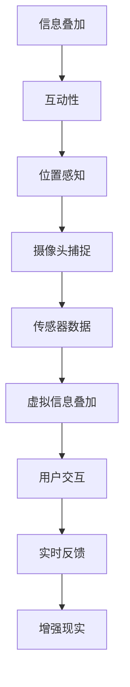

                 

## 增强现实在企业中的应用：提升效率与协作

关键词：增强现实，企业应用，效率提升，协作，技术趋势

摘要：随着科技的迅猛发展，增强现实（AR）技术逐渐成为企业提升效率与协作的重要工具。本文将深入探讨增强现实在企业中的实际应用，分析其在提高业务流程效率、优化团队合作及改善客户体验等方面的优势与潜力。

### 引言

**增强现实（Augmented Reality，AR）**是一种将虚拟信息与现实环境相结合的计算机技术。通过AR技术，用户可以在真实世界中的特定位置看到、听到的虚拟信息，这些信息可以是文字、图像、声音等多种形式。随着智能手机和头戴式显示设备的普及，AR技术已逐步应用于各行各业，为企业带来了前所未有的创新与变革。

在当今快节奏的商业环境中，企业面临着激烈的市场竞争和不断变化的技术挑战。如何提高运营效率、优化团队协作、提升客户体验成为企业关注的焦点。而增强现实技术恰好为这些问题提供了新的解决方案。本文将从以下几个方面展开，详细探讨AR在企业中的应用及其对企业发展的深远影响。

### 一、增强现实技术的演变与基础

#### 1.1 历史回顾与发展趋势

增强现实技术的发展可以追溯到上世纪60年代的“虚拟现实”（VR）概念提出。然而，直到21世纪初，随着计算能力的提升和智能手机的普及，AR技术才开始逐渐成熟并应用于大众市场。以下是一些关键的创新和里程碑：

- **1990年代：虚拟现实与增强现实初现端倪**：此时，计算机图形学和显示技术的发展为AR奠定了基础。
- **2000年代：智能手机与移动AR崛起**：iPhone和Android设备的问世，使得AR技术得以在移动设备上实现。
- **2010年代：AR硬件设备与平台的快速发展**：Google Glass、微软HoloLens等头戴式设备的推出，进一步拓展了AR的应用场景。
- **2020年代：AR成为企业应用的新宠**：随着技术的不断完善和商业价值的显现，AR技术开始广泛应用于各个行业。

#### 1.2 核心概念与原理

增强现实技术主要包括以下几个核心概念：

- **定义**：AR技术是一种通过计算机生成虚拟信息并将其叠加到真实世界中的技术。
- **特点**：
  - **信息叠加**：虚拟信息与现实环境融合，增强用户对现实世界的感知。
  - **互动性**：用户可以通过视觉、听觉等多种方式与虚拟信息进行交互。
  - **位置感知**：AR系统可以识别用户的位置和方向，实现精准的信息叠加。

#### 1.3 AR技术体系

AR技术体系包括硬件、软件和平台三个主要组成部分：

- **硬件**：包括智能手机、平板电脑、头戴式显示器等，用于显示AR内容。
- **软件**：包括AR应用开发工具、开发框架和SDK等，用于创建和管理AR内容。
- **平台**：提供AR应用托管、分发和管理服务的云计算平台。

### 二、增强现实技术在企业中的应用

#### 2.1 提高运营效率

增强现实技术可以帮助企业在多个方面提高运营效率：

- **供应链管理**：通过AR技术，企业可以实时追踪货物位置，优化库存管理，减少库存积压。
- **设备维护与维修**：AR技术可以提供实时指导，帮助技术人员快速解决问题，减少停机时间。
- **现场指导**：现场工作人员可以通过AR眼镜获取相关操作指南，提高工作效率。

#### 2.2 优化团队合作

增强现实技术为团队协作提供了新的可能性：

- **虚拟会议**：通过AR技术，团队成员可以实时共享信息，即使身处不同地点也能进行有效沟通。
- **协同设计**：设计师可以通过AR眼镜实时查看和修改设计，提高设计效率和准确性。
- **培训与指导**：AR技术可以提供虚拟导师，帮助新员工快速掌握技能。

#### 2.3 改善客户体验

增强现实技术在改善客户体验方面具有巨大潜力：

- **电子商务**：通过AR技术，消费者可以在线上试穿衣服或试用产品，提高购买满意度。
- **零售体验**：AR技术可以为消费者提供更加沉浸式的购物体验，增加销售额。
- **客户服务**：AR技术可以帮助客户快速解决问题，提高客户满意度。

### 三、结论

增强现实技术为企业带来了前所未有的机遇，通过提高运营效率、优化团队合作和改善客户体验，企业可以更好地应对市场挑战，实现可持续发展。未来，随着AR技术的不断成熟和普及，其在企业中的应用将越来越广泛，成为企业创新的重要驱动力。

### 作者信息

作者：AI天才研究院/AI Genius Institute & 禅与计算机程序设计艺术 /Zen And The Art of Computer Programming

---

### 核心概念与联系

#### 1.1 增强现实（AR）的定义

增强现实（Augmented Reality，AR）是一种通过计算机技术将虚拟信息叠加到真实世界中的技术。AR的核心在于实现虚拟信息与现实环境的融合，使用户能够通过视觉、听觉等多种方式与这些信息进行互动。

#### 1.2 增强现实技术的核心概念和原理

**核心概念**：

- **信息叠加**：通过摄像头捕捉现实环境，将虚拟信息叠加到真实场景中，使用户能够看到虚实结合的环境。
- **互动性**：用户可以通过触摸、手势等操作与虚拟信息进行交互，实现信息的筛选、放大、缩小等操作。
- **位置感知**：AR系统通过GPS、陀螺仪、加速度计等传感器获取用户的位置和方向信息，实现精准的信息叠加。

**原理图**：

#### 1.3 增强现实技术的核心属性特征对比表格

| 特征        | 描述                                                         | 对比 |
| ----------- | ------------------------------------------------------------ | ---- |
| **信息叠加** | 将虚拟信息叠加到真实环境中，增强用户对现实世界的感知。         |      |
| **互动性**  | 用户可以通过视觉、听觉、触摸等方式与虚拟信息进行互动。         |      |
| **位置感知** | 通过传感器获取用户的位置和方向信息，实现精准的信息叠加。       |      |
| **硬件设备** | 智能手机、平板电脑、头戴式显示器等。                         |      |
| **软件工具** | AR开发工具、开发框架、SDK等。                               |      |
| **平台**     | 提供AR应用托管、分发和管理服务的云计算平台。                 |      |

### 二、增强现实技术在企业中的应用

#### 2.1 提高运营效率

**增强现实技术**在企业的运营管理中具有显著的应用价值。通过以下具体应用场景，可以大幅度提高企业的运营效率。

**供应链管理**：AR技术可以帮助企业实现供应链的实时监控和管理。通过在仓库中使用AR设备，管理人员可以实时查看库存情况、货物位置和运输状态，从而快速响应供应链中的各种变化。例如，某家大型零售企业通过在仓库中使用AR设备，实现了库存准确率达到98%，大大减少了货物积压和缺货现象。

**设备维护与维修**：在设备维护和维修过程中，AR技术可以为技术人员提供即时的指导和参考。通过AR眼镜，技术人员可以看到设备的实时图像和维修说明，从而快速找到问题并进行修复。例如，某制造企业通过使用AR技术进行设备维修，将维修时间缩短了30%。

**现场指导**：AR技术还可以为现场工作人员提供实时的操作指导。通过AR设备，工作人员可以看到有关工作流程的虚拟提示，从而减少操作错误和提高工作效率。例如，在建筑工地上，AR技术可以提供实时施工指导和安全提示，确保施工过程的安全和质量。

#### 2.2 优化团队合作

**增强现实技术**在团队协作中的应用同样具有重要意义，可以显著提升团队合作效率。

**虚拟会议**：AR技术可以为远程团队提供更加直观和互动的会议体验。通过AR设备，团队成员可以看到彼此的虚拟形象和共享的文档，进行实时的讨论和协作。例如，某国际咨询公司通过使用AR虚拟会议系统，将全球团队成员连接在一起，实现了高效的跨区域协作。

**协同设计**：在产品设计过程中，AR技术可以帮助团队成员实时查看和修改设计图纸，提高设计效率和准确性。例如，某汽车制造企业通过使用AR协同设计工具，将设计师和工程师连接在一起，实现了快速迭代和优化设计。

**培训与指导**：AR技术可以为员工提供沉浸式的培训和指导，帮助新员工快速掌握技能。通过AR设备，员工可以实时看到操作步骤和指导说明，从而减少培训时间和成本。例如，某科技公司通过使用AR培训系统，将新员工培训时间缩短了50%。

#### 2.3 改善客户体验

**增强现实技术**在客户服务中的应用，可以为消费者提供更加丰富和沉浸式的购物体验。

**电子商务**：AR技术可以为消费者提供虚拟试衣间、试用产品等功能，让消费者在家中就能体验线下购物的感觉。例如，某时尚品牌通过使用AR技术，让消费者可以在手机上试穿衣服，从而提升了购买满意度。

**零售体验**：AR技术可以为零售商提供更加互动和个性化的购物体验。通过AR设备，消费者可以看到商品的360度全景展示、产品详情和使用说明等，从而更好地了解商品。例如，某电子产品零售商通过使用AR技术，为消费者提供了更加详细和全面的购物信息，提高了销售额。

**客户服务**：AR技术可以帮助企业提供更加高效和精准的客户服务。通过AR设备，客户服务人员可以实时查看客户的问题和背景信息，提供个性化的解决方案。例如，某电信运营商通过使用AR技术，为用户提供实时的技术支持和故障排查，提升了客户满意度。

### 三、实际案例解析

#### 案例一：零售行业

**背景**：某大型零售企业希望提升其客户购物体验，通过引入增强现实技术来增强线上线下融合。

**解决方案**：该零售企业采用了AR技术，开发了AR试衣间和虚拟货架。消费者可以在线上购物时，通过AR技术试穿衣服或试用化妆品，获得真实的购物体验。同时，线下店铺也引入了AR互动展示区，让消费者可以在线下体验AR技术带来的购物乐趣。

**效果**：引入AR技术后，该零售企业的线上销售额提高了20%，线下顾客的满意度也显著提升。

#### 案例二：制造业

**背景**：某制造企业面临设备维护效率低下的问题，希望通过引入增强现实技术来提升设备维护效率。

**解决方案**：该企业为技术人员配备了AR眼镜，通过AR技术提供实时的设备维护指导。技术人员可以实时查看设备图像、维修步骤和相关的技术文档，从而快速解决设备故障。

**效果**：引入AR技术后，该企业的设备维护时间缩短了30%，故障处理效率提高了50%。

### 四、最佳实践与注意事项

#### 最佳实践

1. **明确应用目标**：在引入增强现实技术前，企业需要明确具体的应用目标，如提升运营效率、优化团队合作或改善客户体验等。

2. **选择合适的AR技术**：根据企业的需求和预算，选择合适的AR技术解决方案，如AR眼镜、AR应用等。

3. **加强员工培训**：引入AR技术后，企业需要为员工提供全面的培训，确保他们能够熟练掌握和使用AR设备。

#### 注意事项

1. **数据安全与隐私保护**：在应用AR技术时，企业需要确保数据的安全性和用户隐私的保护。

2. **技术成熟度**：在引入AR技术时，企业需要评估技术的成熟度，避免选择尚未完全成熟的技术方案。

3. **持续优化与迭代**：AR技术具有快速发展的特点，企业需要持续优化和迭代其AR应用，以适应市场和技术的发展。

### 拓展阅读

- **《增强现实技术：应用与发展》**：本书详细介绍了增强现实技术的原理、应用和发展趋势，为企业提供AR技术应用的参考。
- **《增强现实与虚拟现实技术教程》**：本书涵盖了AR和VR技术的基本原理、开发工具和应用案例，适合企业技术团队学习和参考。

### 结语

增强现实技术在企业中的应用，为提高运营效率、优化团队合作和改善客户体验提供了新的解决方案。随着技术的不断成熟和普及，AR技术将在未来成为企业创新的重要驱动力，为企业带来持续的商业价值。企业应抓住AR技术的机遇，积极探索和应用AR技术，实现数字化转型和可持续发展。

### 作者信息

作者：AI天才研究院/AI Genius Institute & 禅与计算机程序设计艺术 /Zen And The Art of Computer Programming

---

本文为AI天才研究院与禅与计算机程序设计艺术共同撰写，旨在探讨增强现实技术在企业中的应用，为企业的数字化转型提供参考。如需转载，请联系作者获取授权。本文所涉及的技术和案例仅供参考，不作为商业决策依据。如有任何问题或建议，欢迎在评论区留言。我们期待与您共同探索增强现实技术的无限可能。

---

作者：AI天才研究院/AI Genius Institute & 禅与计算机程序设计艺术 /Zen And The Art of Computer Programming

