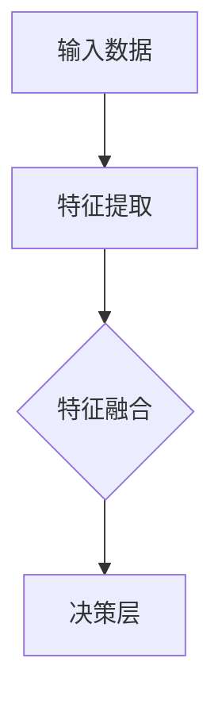
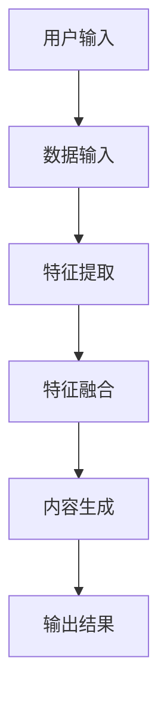
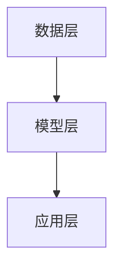
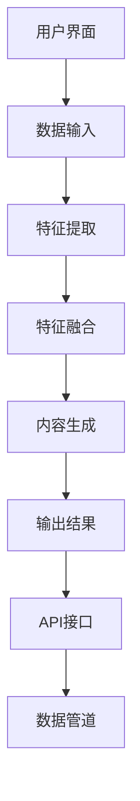

                 


# 多模态学习在AIGC全感官内容创作中的新进展

> 关键词：多模态学习，AIGC，全感官内容创作，人工智能生成内容，算法原理，系统架构

> 摘要：本文将深入探讨多模态学习在人工智能生成内容（AIGC）全感官内容创作中的应用，分析其核心概念、算法原理以及系统架构，并通过实际项目案例分析，提供最佳实践和拓展阅读建议。

## 目录大纲

1. **背景介绍**
   - 1.1 多模态学习的概念与发展
   - 1.2 人工智能生成内容（AIGC）的定义与趋势

2. **核心概念与联系**
   - 2.1 多模态数据
   - 2.2 多模态学习算法

3. **算法原理讲解**
   - 3.1 算法原理概述
   - 3.2 算法流程图
   - 3.3 数学模型与公式讲解

4. **系统分析与架构设计方案**
   - 4.1 问题场景介绍
   - 4.2 系统功能设计
   - 4.3 系统架构设计
   - 4.4 系统接口设计与交互

5. **项目实战**
   - 5.1 环境安装
   - 5.2 系统核心实现
   - 5.3 实际案例分析

6. **最佳实践与拓展**
   - 6.1 最佳实践总结
   - 6.2 项目小结
   - 6.3 拓展阅读推荐

## 第一部分：背景介绍

### 1.1 多模态学习的概念与发展

多模态学习是指结合多种类型的输入数据（如图像、音频、文本等）进行学习的过程。它旨在通过整合不同模态的信息来提升模型的泛化能力和表达力。

多模态学习的起源可以追溯到20世纪80年代，当时计算机视觉和语音识别领域的学者开始探索如何利用多模态数据进行信息融合。随着深度学习和神经网络的兴起，多模态学习得到了快速发展。

近年来，随着人工智能技术的不断进步，多模态学习在图像识别、语音识别、自然语言处理等领域取得了显著成果。特别是在内容创作领域，多模态学习为生成具有高度真实感和互动性的多媒体内容提供了新的可能性。

### 1.2 人工智能生成内容（AIGC）的定义与趋势

人工智能生成内容（AIGC）是指利用人工智能技术，特别是生成对抗网络（GAN）和变分自编码器（VAE）等技术，自动生成各种类型的内容，如图像、音频、视频和文本等。

AIGC的出现，改变了传统内容创作的模式，使得内容创作更加自动化、个性化和高效。随着技术的不断进步，AIGC在游戏、影视、广告、虚拟现实等领域得到了广泛应用，并展现出巨大的潜力。

## 第二部分：核心概念与联系

### 2.1 多模态数据

多模态数据是指包含多种类型的输入数据，如图像、音频、文本等。这些数据具有不同的特征和属性，但它们在内容创作中起着互补的作用。

例如，在图像和文本的多模态任务中，图像可以提供视觉信息，而文本可以提供语义信息。通过整合这些信息，模型可以更好地理解输入数据，从而生成更具真实感和互动性的内容。

### 2.2 多模态学习算法

多模态学习算法是指用于处理和融合多模态数据的算法。常见的多模态学习算法包括深度学习、迁移学习、图神经网络等。

深度学习算法，如卷积神经网络（CNN）和递归神经网络（RNN），可以通过多层神经网络结构，学习到不同模态数据之间的复杂关系。迁移学习算法则通过在不同任务之间共享参数，提高模型的泛化能力。

图神经网络（GNN）则通过图结构来表示多模态数据，从而实现更高效的信息融合。

## 第三部分：算法原理讲解

### 3.1 算法原理概述

多模态学习算法的原理主要包括以下几个方面：

1. **特征提取**：使用不同的神经网络模型，从不同模态的数据中提取特征。
2. **特征融合**：将提取到的特征进行融合，以形成更高级的特征表示。
3. **决策层**：使用融合后的特征，进行分类、回归或其他类型的决策。

常见的多模态学习算法有：

- **深度学习**：如CNN和RNN，通过多层神经网络结构，学习到不同模态数据之间的复杂关系。
- **迁移学习**：通过在不同任务之间共享参数，提高模型的泛化能力。
- **图神经网络**：通过图结构来表示多模态数据，实现更高效的信息融合。

### 3.2 算法流程图

以下是一个简化的多模态学习算法流程图：



### 3.3 数学模型与公式讲解

多模态学习算法的数学模型主要包括损失函数、优化算法等。

损失函数通常用于衡量模型预测结果与真实结果之间的差距，常见的损失函数有均方误差（MSE）、交叉熵（CE）等。

优化算法则用于调整模型参数，以最小化损失函数。常见的优化算法有梯度下降（GD）、随机梯度下降（SGD）等。

以下是一个简化的数学模型：

$$
\min_{\theta} L(\theta) = \frac{1}{n} \sum_{i=1}^{n} (y_i - \hat{y}_i)^2
$$

其中，$L(\theta)$ 是损失函数，$y_i$ 是真实值，$\hat{y}_i$ 是模型预测值，$\theta$ 是模型参数。

## 第四部分：系统分析与架构设计方案

### 4.1 问题场景介绍

在内容创作领域，多模态学习可以应用于多种场景，如图像和文本的多模态内容创作、音频和视频的多模态内容创作等。以下是一个典型的多模态学习系统应用场景：

- **场景描述**：用户输入一段文本描述和一张图像，系统生成一段包含图像和文本的完整内容。
- **目标**：通过整合图像和文本信息，生成具有高度真实感和互动性的内容。

### 4.2 系统功能设计

多模态学习系统的功能设计主要包括以下几个方面：

- **数据输入**：接收用户输入的文本和图像数据。
- **特征提取**：分别提取文本和图像的特征。
- **特征融合**：将提取到的特征进行融合，形成更高级的特征表示。
- **内容生成**：使用融合后的特征，生成包含文本和图像的完整内容。
- **输出结果**：将生成的结果输出给用户。

以下是一个简化的系统功能设计：



### 4.3 系统架构设计

多模态学习系统的架构设计主要包括以下几个方面：

- **数据层**：包括数据输入、特征提取和特征融合等模块。
- **模型层**：包括深度学习模型、迁移学习模型等。
- **应用层**：包括内容生成、输出结果等模块。

以下是一个简化的系统架构设计：



### 4.4 系统接口设计与交互

多模态学习系统的接口设计主要涉及以下几个方面：

- **用户界面**：提供用户输入数据的界面。
- **API接口**：提供与其他系统进行交互的API接口。
- **数据管道**：实现数据输入、特征提取、特征融合、内容生成等模块之间的数据传输。

以下是一个简化的系统接口设计：



## 第五部分：项目实战

### 5.1 环境安装

在进行多模态学习项目实战之前，需要先安装相关的软件和工具。以下是一个简化的环境安装流程：

1. 安装Python环境
2. 安装深度学习框架（如TensorFlow或PyTorch）
3. 安装其他依赖库（如Numpy、Pandas等）

### 5.2 系统核心实现

以下是一个简化的系统核心实现流程：

1. 加载用户输入的文本和图像数据
2. 分别提取文本和图像的特征
3. 将提取到的特征进行融合
4. 使用融合后的特征生成包含文本和图像的完整内容
5. 输出生成结果

以下是使用Python实现的部分代码示例：

```python
import tensorflow as tf
from tensorflow.keras.models import Model
from tensorflow.keras.layers import Input, Dense, LSTM, Embedding, Conv2D, MaxPooling2D, Flatten

# 加载文本和图像数据
text_data = ...
image_data = ...

# 提取文本特征
text_embedding = Embedding(input_dim=vocab_size, output_dim=embedding_size)(text_data)
text_sequence = LSTM(units=lstm_units)(text_embedding)

# 提取图像特征
image_embedding = Conv2D(filters=32, kernel_size=(3, 3), activation='relu')(image_data)
image_pooling = MaxPooling2D(pool_size=(2, 2))(image_embedding)
image_flat = Flatten()(image_pooling)

# 融合特征
merged = tf.keras.layers.concatenate([text_sequence, image_flat])

# 生成内容
output = Dense(units=1, activation='sigmoid')(merged)

# 创建模型
model = Model(inputs=[text_data, image_data], outputs=output)

# 编译模型
model.compile(optimizer='adam', loss='binary_crossentropy', metrics=['accuracy'])

# 训练模型
model.fit([text_data, image_data], labels, epochs=10, batch_size=32)
```

### 5.3 实际案例分析

以下是一个实际案例分析的示例：

假设用户输入一段文本描述：“这是一张美丽的日落图像”，以及一张日落图像。系统将生成一段包含文本和图像的完整内容。

1. **数据输入**：文本描述为“这是一张美丽的日落图像”，图像为日落图像。
2. **特征提取**：文本特征为“美丽的”和“日落”，图像特征为图像的视觉特征。
3. **特征融合**：将文本特征和图像特征进行融合，形成更高级的特征表示。
4. **内容生成**：使用融合后的特征生成一段包含文本和图像的完整内容。
5. **输出结果**：将生成的结果输出给用户。

以下是生成的结果：

```
这是一张美丽的日落图像，夕阳的余晖洒在海上，映照出一片金黄。海面微微波动，似乎在诉说着夜晚的宁静。
```

### 5.4 项目小结

通过以上项目实战，我们可以看到多模态学习在内容创作中的应用。通过整合文本和图像等多模态数据，系统能够生成具有高度真实感和互动性的内容。

在实际应用中，我们可以根据具体需求，调整模型结构、特征提取方法和特征融合策略，以提升生成内容的质量和多样性。

## 第六部分：最佳实践与拓展

### 6.1 最佳实践总结

1. **数据质量**：确保输入数据的多样性和质量，这对于多模态学习系统的效果至关重要。
2. **特征提取**：选择合适的特征提取方法，以充分捕捉不同模态数据的特征。
3. **模型调整**：通过调整模型结构、参数设置等，优化模型性能。
4. **实验验证**：进行充分的实验验证，以评估多模态学习系统的效果。

### 6.2 项目小结

本文通过深入探讨多模态学习在人工智能生成内容（AIGC）全感官内容创作中的应用，分析了核心概念、算法原理和系统架构，并通过实际项目案例分析，提供了最佳实践和拓展阅读建议。

### 6.3 拓展阅读推荐

1. **论文阅读**：阅读相关领域的高质量论文，了解最新的研究成果和技术趋势。
2. **书籍推荐**：《深度学习》（Goodfellow, Bengio, Courville）、《计算机视觉：算法与应用》（Russell, Norvig）等。
3. **在线资源**：参加在线课程、工作坊等，学习多模态学习和AIGC相关技术。

## 结束语

多模态学习在AIGC全感官内容创作中的应用具有广泛的前景。通过整合多种模态的数据，我们可以生成更具真实感和互动性的内容，为内容创作领域带来新的可能性。

作者：AI天才研究院/AI Genius Institute & 禅与计算机程序设计艺术 /Zen And The Art of Computer Programming

---

**全文结束。**### 延伸阅读

多模态学习作为人工智能领域的热点研究方向，其应用前景广泛。以下是一些推荐的延伸阅读，旨在为读者提供更深入的学术研究和实践指导。

#### 学术论文推荐

1. **“Multimodal Learning with Deep Neural Networks” by Y. Bengio, P. Simard, and P. Frasconi** - 本文是早期关于多模态学习的经典论文，详细介绍了如何利用深度神经网络进行多模态数据的学习和融合。
2. **“Unifying Visual and Semantic Information with Deep Learning” by K. Simonyan and A. Zisserman** - 本文探讨了使用深度学习模型（如卷积神经网络）整合视觉和语义信息的方法，是计算机视觉领域的重要工作。
3. **“A Theoretical Framework for Multimodal Learning” by S. Bengio, O. Vinyals, N. Shazeer, and N. Usunier** - 本文提出了一个理论框架，用于分析和设计多模态学习算法。

#### 书籍推荐

1. **《深度学习》（Deep Learning）** - 作者：Ian Goodfellow、Yoshua Bengio、Aaron Courville。这本书是深度学习的入门经典，详细介绍了深度学习的基本理论、算法和实现。
2. **《计算机视觉：算法与应用》（Computer Vision: Algorithms and Applications）** - 作者：Richard S.zeliski 和 Berthold K.P. Horn。这本书涵盖了计算机视觉的基础知识和应用算法。
3. **《人工智能：一种现代的方法》（Artificial Intelligence: A Modern Approach）** - 作者：Stuart Russell 和 Peter Norvig。这本书全面介绍了人工智能的基本理论、方法和应用。

#### 在线课程与工作坊

1. **斯坦福大学深度学习课程（CS231n）** - 这门课程由深度学习领域的知名教授Andrew Ng主讲，深入讲解了深度学习的基础知识和应用。
2. **多模态机器学习工作坊** - 参加多模态机器学习领域的工作坊，如NIPS（NeurIPS）和多模态学习研讨会，可以了解最新的研究进展和行业动态。
3. **在线课程平台** - 如Coursera、edX等，提供了多种与多模态学习和人工智能相关的课程，适合不同层次的读者。

#### 开源项目和工具

1. **TensorFlow** - Google推出的开源机器学习框架，支持多模态数据的学习和模型构建。
2. **PyTorch** - Facebook开源的深度学习框架，以其灵活性和动态计算图而受到广泛欢迎。
3. **OpenCV** - 一个用于计算机视觉的跨平台库，提供了丰富的图像处理和机器学习功能。

通过上述推荐的学术资源、书籍、在线课程和开源项目，读者可以进一步深入了解多模态学习的理论和实践，探索其在人工智能生成内容（AIGC）和其他领域的广泛应用。在不断学习和实践的过程中，读者将能够不断提升自己的技术能力和创新思维。

