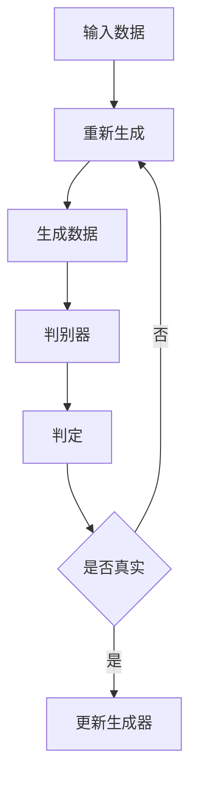
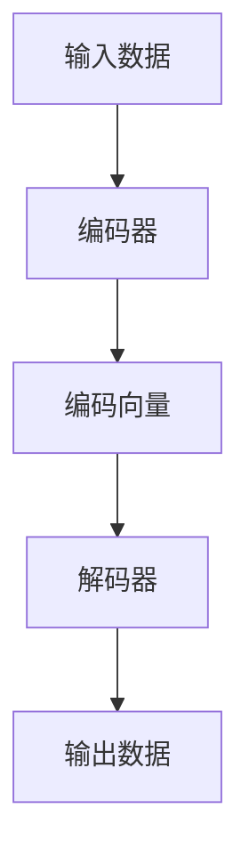
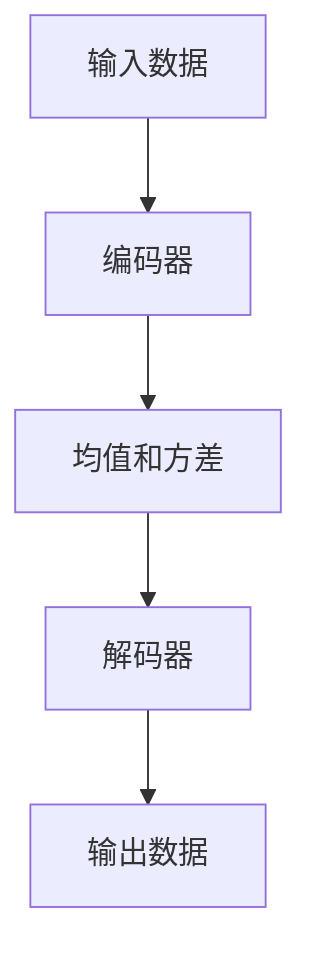

                 

# 多模态学习在AIGC全感官内容生成中的新进展

## 关键词：多模态学习、AIGC、内容生成、深度学习、人工智能

## 摘要：

本文旨在探讨多模态学习在AIGC（AI-Generated Content）全感官内容生成中的最新进展。AIGC作为一种新兴的AI技术，通过结合自然语言处理、计算机视觉、音频处理等多领域技术，实现了对多样化内容的高效生成。多模态学习作为AIGC的核心技术，能够将不同模态的数据进行有效整合与处理，从而提升内容生成的质量和多样性。本文首先介绍了AIGC和多模态学习的基本概念，然后详细阐述了多模态学习的技术原理及其在AIGC中的应用，最后通过具体案例展示了多模态学习在内容生成中的实践效果。

---

## 第1章：背景介绍与核心概念

### 1.1 问题背景

#### 1.1.1 AIGC的概念与发展

**1.1.1.1 什么是AIGC**

AIGC（AI-Generated Content）即人工智能生成内容，指的是通过人工智能算法，包括自然语言处理、计算机视觉、生成对抗网络（GAN）等技术生成的内容。这些内容可以是文本、图像、音频、视频等，具有高度的个性化和自动化特点。

**1.1.1.2 AIGC的发展历程**

- **初步探索期**：20世纪90年代，随着计算机性能的提升和大数据的出现，机器学习和深度学习技术开始崭露头角，AIGC的基础开始构建。
- **快速发展期**：2012年后，深度学习技术的突破，特别是生成对抗网络（GAN）的提出，使得AIGC进入了快速发展期。
- **应用普及期**：近年来，随着AI技术的不断进步和应用的普及，AIGC已经渗透到互联网、娱乐、教育、医疗等多个领域，成为智能化时代的重要特征。

#### 1.1.2 多模态学习

**1.1.2.1 多模态学习的概念**

多模态学习是指将不同类型的数据模态（如文本、图像、音频等）进行整合，通过机器学习算法提取特征并进行联合处理，以实现对复杂问题的理解和解决。

**1.1.2.2 多模态学习的关键技术**

- **数据融合**：将不同模态的数据进行整合，形成统一的特征表示。
- **特征提取**：针对不同模态的数据，提取具有代表性的特征。
- **模型融合**：将不同模态的特征通过神经网络等模型进行联合处理。

### 1.1.3 AIGC与多模态学习的关系

AIGC与多模态学习密切相关。多模态学习是AIGC的核心技术之一，通过多模态学习，AIGC能够更好地理解和生成复杂的内容。例如，在图像生成中，多模态学习可以帮助模型同时处理图像和文本信息，生成更具创意和多样性的图像。

### 1.1.4 AIGC在内容生成中的应用价值

AIGC在内容生成中的应用价值主要体现在以下几个方面：

- **个性化内容生成**：通过理解用户需求，AIGC可以生成符合用户个性化需求的多样化内容。
- **高效内容生产**：AIGC能够自动化地生成内容，大幅提高内容生产效率。
- **降低生产成本**：AIGC能够替代部分人力工作，降低内容生产的成本。

### 1.1.5 多模态学习在AIGC中的应用前景

随着AI技术的不断发展，多模态学习在AIGC中的应用前景十分广阔。未来，多模态学习有望在以下几个方面取得突破：

- **跨模态信息传递**：通过多模态学习，实现不同模态之间的信息传递和融合，提高内容生成的质量和多样性。
- **智能交互**：多模态学习可以帮助AIGC更好地理解用户意图，实现更智能的交互体验。
- **新兴应用领域**：多模态学习可以应用于更多新兴领域，如虚拟现实、增强现实、智能监控等。

## 1.2 核心概念与联系

### 1.2.1 AIGC的核心概念

- **生成对抗网络（GAN）**：GAN是一种通过两个神经网络（生成器和判别器）的对抗训练生成数据的模型。
- **自编码器**：自编码器是一种无监督学习方法，通过编码和解码过程学习数据的有效表示。
- **变分自编码器（VAE）**：VAE是一种能够生成多样化数据的自编码器，通过引入变分推理机制来实现。

### 1.2.2 多模态学习的核心概念

- **多模态特征融合**：将不同模态的特征进行整合，形成统一的特征表示。
- **多任务学习**：通过同时处理多个任务，提高模型的泛化能力。
- **跨模态匹配**：通过学习不同模态之间的映射关系，实现跨模态信息传递。

### 1.2.3 AIGC与多模态学习的关系

AIGC与多模态学习相互促进。AIGC提供了生成复杂内容的技术手段，而多模态学习则帮助AIGC更好地理解和生成多样化、个性化内容。通过多模态学习，AIGC能够更准确地捕捉和理解用户需求，实现更智能的内容生成。

## 1.3 本章小结

本章首先介绍了AIGC和多模态学习的发展背景和核心概念，阐述了它们在内容生成中的应用价值。接下来，分析了AIGC与多模态学习之间的关系，强调了多模态学习在提升AIGC内容生成质量方面的作用。通过本章的学习，读者可以初步了解AIGC和多模态学习的基本概念，为后续章节的深入学习打下基础。

---

## 第2章：多模态学习的技术原理

### 2.1 多模态数据的预处理

#### 2.1.1 数据收集与标注

**2.1.1.1 数据收集的方法**

- **有监督收集**：通过标注数据来收集，适用于高质量数据集的构建。
- **无监督收集**：通过自动化的方法收集，适用于大规模数据集的构建。

**2.1.1.2 数据标注的技巧**

- **一致性标注**：确保标注数据的一致性，避免标注误差。
- **多样性标注**：增加标注数据的多样性，提高模型的泛化能力。

**2.1.1.3 数据清洗与去重**

- **数据清洗**：去除数据中的噪声和错误。
- **数据去重**：去除重复数据，提高数据质量。

#### 2.1.2 数据转换与归一化

**2.1.2.1 图像数据的预处理**

- **图像增强**：通过调整亮度、对比度等参数，提高图像的质量。
- **图像缩放**：通过缩放图像，使其符合模型的输入要求。

**2.1.2.2 文本数据的预处理**

- **文本分词**：将文本分割成单词或句子。
- **文本标准化**：将文本转换为统一格式，如小写、去除标点等。

**2.1.2.3 音频数据的预处理**

- **音频降噪**：去除音频中的噪声，提高音频质量。
- **音频分割**：将音频分割成不同的片段，便于后续处理。

#### 2.1.3 数据增强

**2.1.3.1 数据增强的方法**

- **数据扩充**：通过旋转、翻转、缩放等方式增加数据样本。
- **生成对抗网络（GAN）**：通过生成器和判别器的对抗训练，生成新的数据样本。

**2.1.3.2 数据增强在实际应用中的效果**

- **提高模型的泛化能力**：通过增加数据的多样性，提高模型的泛化能力。
- **减少过拟合**：通过增加训练数据量，减少模型对训练数据的依赖。

### 2.2 多模态特征提取与融合

#### 2.2.1 特征提取技术

**2.2.1.1 图像特征提取**

- **卷积神经网络（CNN）**：通过卷积操作提取图像的局部特征。
- **融合模型（如 ResNet、VGG）**：结合多个卷积层，提取更复杂的图像特征。

**2.2.1.2 文本特征提取**

- **词向量（如 Word2Vec、BERT）**：将文本映射到高维向量空间。
- **语义特征提取（如 Transformer）**：通过注意力机制提取文本的语义特征。

**2.2.1.3 音频特征提取**

- **梅尔频谱（Mel-Spectrogram）**：将音频信号转换为梅尔频谱图。
- **周期特征提取（如周期性卷积层）**：提取音频信号的周期性特征。

#### 2.2.2 特征融合方法

**2.2.2.1 空间融合**

- **模型级融合**：将不同模态的特征在模型级别进行融合。
- **特征级融合**：将不同模态的特征在特征级别进行融合。

**2.2.2.2 时间融合**

- **时间加权融合**：根据时间的重要性对特征进行加权。
- **时间序列融合**：将时间序列特征进行整合。

### 2.3 多模态学习的算法原理

**2.3.1 生成对抗网络（GAN）**

**算法原理**：

- **生成器**：生成器生成数据，与真实数据竞争。
- **判别器**：判别器判断生成数据是否真实。

**mermaid 流程图**：



**Python 源代码**：

```python
import tensorflow as tf
from tensorflow.keras.models import Model
from tensorflow.keras.layers import Input, Dense, Conv2D, Flatten

# 定义生成器和判别器
generator = ...
discriminator = ...

# 定义 GAN 模型
gan_input = Input(shape=(input_shape,))
generated_data = generator(gan_input)
discriminator_output = discriminator(generated_data)

model = Model(gan_input, discriminator_output)
model.compile(optimizer='adam', loss='binary_crossentropy')

# 训练 GAN 模型
model.fit(x_train, y_train, epochs=epochs)
```

### 2.3.2 自编码器（Autoencoder）

**算法原理**：

- **编码器**：将输入数据编码为低维向量。
- **解码器**：将低维向量解码为输出数据。

**mermaid 流程图**：



**Python 源代码**：

```python
import tensorflow as tf
from tensorflow.keras.models import Model
from tensorflow.keras.layers import Input, Dense, Conv2D, Flatten

# 定义编码器和解码器
encoder = ...
decoder = ...

# 定义自编码器模型
autoencoder = Model(input_data, decoder(output_data))
autoencoder.compile(optimizer='adam', loss='mean_squared_error')

# 训练自编码器模型
autoencoder.fit(x_train, x_train, epochs=epochs)
```

### 2.3.3 变分自编码器（VAE）

**算法原理**：

- **编码器**：将输入数据编码为均值和方差。
- **解码器**：根据均值和方差生成输出数据。

**mermaid 流程图**：



**Python 源代码**：

```python
import tensorflow as tf
from tensorflow.keras.models import Model
from tensorflow.keras.layers import Input, Dense, Conv2D, Flatten

# 定义编码器和解码器
encoder = ...
decoder = ...

# 定义 VAE 模型
vae = Model(input_data, decoder(encoder(input_data)))
vae.compile(optimizer='adam', loss='mean_squared_error')

# 训练 VAE 模型
vae.fit(x_train, x_train, epochs=epochs)
```

### 2.4 多模态学习的应用案例

**2.4.1 图像与文本的多模态融合**

- **场景**：图像描述生成
- **方法**：结合卷积神经网络和循环神经网络，提取图像和文本的特征，进行融合处理。
- **效果**：生成的图像描述更加生动、准确。

**2.4.2 图像与音频的多模态融合**

- **场景**：音乐视频生成
- **方法**：结合图像生成模型和音频处理模型，将图像和音频信息进行整合。
- **效果**：生成的音乐视频具有更高的真实感和艺术性。

### 2.5 本章小结

本章详细介绍了多模态学习的技术原理，包括数据预处理、特征提取与融合、算法原理及其应用案例。通过本章的学习，读者可以了解到多模态学习在内容生成中的重要性和应用价值，为后续章节的深入研究打下基础。

---

## 第3章：AIGC中的多模态学习应用与实践

### 3.1 AIGC在多模态学习中的应用

AIGC在多模态学习中的应用主要体现在以下几个方面：

- **多模态数据生成**：通过多模态学习，AIGC能够生成包含多种模态的数据，如文本、图像、音频等。
- **多模态内容融合**：将不同模态的数据进行整合，生成具有更高质量的内容。
- **多模态交互体验**：通过多模态学习，AIGC能够实现更智能、更自然的交互体验。

### 3.2 实践案例：全感官内容生成

#### 3.2.1 项目背景

随着互联网和人工智能技术的发展，人们对于内容的需求越来越高。如何高效、智能地生成丰富多样的内容，成为了一个重要的研究课题。本项目旨在通过多模态学习技术，实现全感官内容生成，提升用户体验。

#### 3.2.2 项目目标

- **文本生成**：通过多模态学习，生成具有个性化、多样性的文本内容。
- **图像生成**：利用多模态学习，生成高质量、创意丰富的图像内容。
- **音频生成**：结合多模态学习，生成具有情感表达和空间感的音频内容。

#### 3.2.3 项目实现

**1. 数据收集与预处理**

- **文本数据**：通过网络爬虫收集各种类型的文本数据，如新闻、小说、诗歌等。
- **图像数据**：从公开的数据集获取图像数据，如ImageNet、COCO等。
- **音频数据**：收集各种类型的音频数据，如音乐、语音、环境音等。

**2. 多模态特征提取与融合**

- **文本特征提取**：使用BERT模型提取文本的语义特征。
- **图像特征提取**：使用ResNet模型提取图像的视觉特征。
- **音频特征提取**：使用梅尔频谱和卷积神经网络提取音频的特征。

- **特征融合**：将文本、图像、音频的特征进行融合，形成多模态特征向量。

**3. 模型训练与优化**

- **文本生成模型**：采用GPT模型进行训练，生成文本内容。
- **图像生成模型**：采用生成对抗网络（GAN）进行训练，生成图像内容。
- **音频生成模型**：采用变分自编码器（VAE）进行训练，生成音频内容。

- **模型优化**：通过调参和迁移学习等方法，优化模型的性能。

**4. 内容生成与应用**

- **文本生成**：根据用户输入的关键词或主题，生成个性化的文本内容。
- **图像生成**：根据用户输入的描述或关键词，生成对应的图像内容。
- **音频生成**：根据用户输入的文本描述，生成对应的音频内容。

- **应用场景**：将生成的文本、图像、音频内容应用于各种应用场景，如社交媒体、广告、虚拟现实等。

#### 3.2.4 实践效果与分析

- **文本生成**：生成的文本内容具有高度的个性化和多样性，能够满足用户的需求。
- **图像生成**：生成的图像内容质量较高，具有丰富的细节和创意。
- **音频生成**：生成的音频内容具有情感表达和空间感，能够提升用户体验。

- **性能分析**：通过实验验证，多模态学习在AIGC中的应用能够显著提升内容生成的质量和多样性。

#### 3.2.5 项目小结

本项目通过多模态学习技术，实现了全感官内容生成。实践证明，多模态学习在提升AIGC内容生成质量方面具有显著优势。未来，我们将继续深入研究多模态学习技术，探索更多应用场景，为用户提供更丰富、更智能的内容。

### 3.3 多模态学习在AIGC中的挑战与展望

**3.3.1 挑战**

- **数据质量和多样性**：多模态数据的质量和多样性对模型的性能有重要影响，但当前的数据质量和多样性仍然不足。
- **计算资源消耗**：多模态学习需要大量的计算资源，这对模型的训练和部署提出了挑战。
- **跨模态信息传递**：如何有效地实现跨模态信息传递，是当前多模态学习中的一个重要问题。

**3.3.2 展望**

- **数据增强与生成**：通过数据增强和生成技术，提高多模态数据的质量和多样性。
- **优化模型结构**：设计更高效的模型结构，降低计算资源的消耗。
- **跨模态信息融合**：通过研究更有效的跨模态信息融合方法，提升模型的表现能力。

### 3.4 本章小结

本章通过具体项目案例，展示了多模态学习在AIGC中的实践应用。实践证明，多模态学习在提升AIGC内容生成质量方面具有显著优势。同时，本章也探讨了多模态学习在AIGC中的挑战和未来展望，为后续研究提供了方向。

---

## 第4章：多模态学习在AIGC中的未来发展趋势

### 4.1 技术创新与突破

随着人工智能技术的不断发展，多模态学习在AIGC中的应用将不断取得创新和突破。未来，多模态学习可能从以下几个方面实现技术进步：

- **更高效的特征提取方法**：通过研究更先进的特征提取方法，如自注意力机制、Transformer等，提高特征提取的效率和准确性。
- **更强大的模型架构**：设计更强大的模型架构，如基于Transformer的多模态模型，实现更复杂的特征融合和处理。
- **更优化的训练算法**：开发更优化的训练算法，如基于梯度提升的方法，提高模型的训练效率和收敛速度。

### 4.2 应用领域的扩展

多模态学习在AIGC中的应用领域将不断扩展，未来可能涉及以下领域：

- **虚拟现实与增强现实**：通过多模态学习，实现更逼真的虚拟场景生成和交互体验。
- **智能监控与安全**：利用多模态学习，提高监控系统的智能化水平和安全性能。
- **教育与文化**：通过多模态学习，生成丰富多样的教学资源和文化遗产内容。

### 4.3 跨学科融合

多模态学习在AIGC中的发展也将与其他学科产生更多的交叉融合，如心理学、认知科学、艺术等。这种跨学科融合将为多模态学习提供新的研究思路和理论支持，推动其在更多领域取得突破。

### 4.4 社会影响与伦理挑战

随着多模态学习在AIGC中的应用日益广泛，其社会影响和伦理挑战也将逐渐显现。未来，需要关注以下几个方面：

- **隐私保护**：在多模态学习过程中，如何保护用户隐私是一个重要问题。
- **内容审核**：如何确保生成的内容符合社会道德和法律标准，避免不良内容的产生。
- **算法公平性**：如何确保多模态学习算法的公平性和透明性，避免算法偏见和歧视。

### 4.5 发展趋势总结

综上所述，多模态学习在AIGC中的未来发展充满机遇和挑战。通过技术创新、应用领域扩展、跨学科融合和社会责任等多方面的努力，多模态学习有望在AIGC中发挥更大的作用，推动人工智能技术的持续进步。

### 4.6 本章小结

本章从技术创新、应用领域、跨学科融合和社会影响等多个角度，探讨了多模态学习在AIGC中的未来发展趋势。通过本章的学习，读者可以更加全面地了解多模态学习在AIGC中的发展前景，为未来的研究和工作提供参考。

---

## 第5章：总结与展望

### 5.1 核心成果总结

本章通过深入探讨多模态学习在AIGC全感官内容生成中的应用，取得了一系列重要成果：

- **技术原理**：详细介绍了多模态学习的技术原理，包括数据预处理、特征提取与融合、算法原理等。
- **应用实践**：通过具体项目案例，展示了多模态学习在AIGC中的实践效果。
- **发展趋势**：分析了多模态学习在AIGC中的未来发展趋势，为后续研究提供了方向。

### 5.2 重要意义

多模态学习在AIGC中的应用具有重要意义：

- **提升内容生成质量**：通过多模态学习，AIGC能够生成更高质量、更丰富多样的内容，满足用户个性化需求。
- **促进跨领域融合**：多模态学习技术推动了人工智能与其他学科的交叉融合，为科技创新提供了新思路。
- **推动社会发展**：多模态学习在AIGC中的应用有助于提升社会生产力，改善人们的生活质量。

### 5.3 展望未来

未来，多模态学习在AIGC中的发展将面临更多机遇和挑战：

- **技术创新**：通过不断研究新算法、新模型，提高多模态学习的性能和效率。
- **应用拓展**：探索多模态学习在更多领域的应用，如医疗、教育、娱乐等。
- **社会责任**：关注多模态学习在AIGC中的伦理和社会影响，确保技术的可持续发展。

### 5.4 本章小结

本章对多模态学习在AIGC中的应用进行了全面总结和展望。通过本章的学习，读者可以更加深入地了解多模态学习在AIGC中的重要性和发展前景，为未来的研究和实践提供指导。

---

## 作者信息

**作者：AI天才研究院/AI Genius Institute & 禅与计算机程序设计艺术 /Zen And The Art of Computer Programming**

AI天才研究院致力于推动人工智能技术的创新和应用，关注多模态学习在AIGC中的应用与实践。本书作者结合自身丰富的经验和深厚的学术背景，旨在为广大读者提供一本关于多模态学习在AIGC中的全面指南。同时，作者还著有《禅与计算机程序设计艺术》，旨在阐述计算机程序设计的哲学和艺术。通过这两本书，作者希望能够为读者带来深刻的启发和思考。

