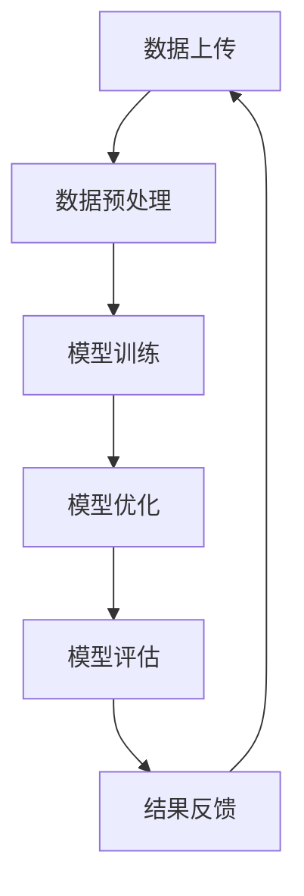

                 

### 第一步：引言与背景

#### 1.1.1 人工智能的发展与LLM的重要性

人工智能（Artificial Intelligence，简称AI）作为计算机科学的重要分支，近年来在全球范围内取得了飞速的发展。从早期的规则推理、知识表示，到现代的深度学习、自然语言处理，人工智能技术的不断进步，已经深刻地改变了我们的生活和工作方式。特别是在语言处理领域，大型语言模型（Large Language Model，简称LLM）的应用尤为突出。

LLM，作为一种基于深度学习的语言处理模型，通过学习海量文本数据，能够对自然语言进行建模，并生成高质量的文本。LLM在机器翻译、文本生成、问答系统等多个领域展现了其强大的能力，已经成为人工智能发展的重要驱动力。然而，随着LLM应用场景的日益丰富，如何优化多目标的LLM模型，实现其性能的全面提升，成为一个亟待解决的问题。

#### 1.1.2 多目标优化的挑战

多目标优化问题（Multi-Objective Optimization Problem）是指在一个优化问题中，存在多个相互冲突的目标需要同时考虑。在多目标优化的背景下，每个目标都可能有不同的权重和优化方向，这使得优化问题变得更加复杂和具有挑战性。

对于LLM优化而言，多目标优化面临着以下挑战：

1. **性能提升与资源消耗的平衡**：在优化LLM模型时，需要在模型的性能提升和计算资源的消耗之间找到平衡点。过度的性能提升可能导致资源浪费，而资源消耗过低又可能影响模型的效果。

2. **多样性与一致性**：在多目标优化中，如何保证不同目标之间的平衡，同时保持模型的一致性和多样性，是一个关键问题。单一目标优化往往会导致模型在某个特定方面表现优异，而在其他方面则表现较差。

3. **评测指标的多样性**：LLM优化的评测指标多种多样，包括准确性、速度、效率、泛化能力等。如何选择合适的评测指标，并确保它们能够全面、准确地反映模型性能，是优化过程中的重要考量。

#### 1.1.3 评测驱动的平衡发展策略

为了应对多目标优化的挑战，评测驱动的平衡发展策略应运而生。该策略的核心思想是通过一系列精心设计的评测指标，动态地调整模型参数，实现不同目标之间的平衡发展。

具体来说，评测驱动的平衡发展策略包括以下几个关键步骤：

1. **明确评测指标**：首先，需要明确优化的目标，并定义相应的评测指标。这些评测指标应能够全面、准确地反映模型在不同方面的性能。

2. **动态调整参数**：在优化过程中，根据评测结果动态调整模型的参数，以实现不同目标之间的平衡。这可以通过自适应学习率调整、权重调整等方式实现。

3. **迭代优化**：通过不断的迭代优化，逐步调整模型参数，直至达到预定的优化目标。在这个过程中，需要充分利用评测指标，确保优化过程的有效性和稳定性。

4. **性能评估与反馈**：在优化过程中，定期进行性能评估，并将评估结果反馈到优化策略中，以指导后续的优化方向。

通过评测驱动的平衡发展策略，可以有效地解决多目标优化问题，提升LLM模型的整体性能。接下来，我们将进一步探讨LLM的核心概念与联系，为后续的优化策略提供理论基础。

### 第2章：核心概念与联系

#### 2.1 多目标LLM的定义与特征

多目标LLM（Multi-Objective Large Language Model）是一种针对多个优化目标进行建模和优化的语言模型。与传统的单目标LLM不同，多目标LLM需要在多个相互冲突的目标之间寻找最佳平衡点。以下是多目标LLM的一些关键特征：

1. **多个目标**：多目标LLM需要同时考虑多个优化目标，例如准确性、响应速度、资源消耗等。这些目标之间往往存在一定的冲突，需要通过优化策略来平衡。

2. **权衡与平衡**：在多目标优化中，没有绝对的最佳解，而是需要找到一个平衡点，使得所有目标都能够得到较好的满足。这意味着在优化过程中需要不断地调整和权衡。

3. **动态调整**：多目标LLM的优化是一个动态过程，需要根据当前的评测结果不断调整模型参数，以实现目标的平衡。这种动态调整机制是优化成功的关键。

4. **复杂性**：多目标优化问题本身具有较高的复杂性，特别是在涉及多个维度和目标时，优化过程变得更加复杂和具有挑战性。

#### 2.2 评测指标的重要性与多样性

评测指标是衡量LLM性能的重要工具，对于优化策略的选择和效果评估具有决定性作用。以下是几个常见的评测指标：

1. **准确性**：准确性是评估LLM在文本生成、分类等任务中的主要指标。它反映了模型在预测结果上的正确程度。

2. **响应速度**：响应速度是指模型处理请求的时间。对于需要实时响应的应用场景，如在线问答系统，响应速度是衡量模型性能的重要指标。

3. **资源消耗**：资源消耗包括计算资源、存储资源和能源消耗等。在多目标优化中，需要在性能提升与资源消耗之间找到最佳平衡点。

4. **泛化能力**：泛化能力是指模型在不同数据集和场景下的适应能力。一个具有良好泛化能力的模型能够在各种复杂环境下保持稳定的性能。

5. **鲁棒性**：鲁棒性是指模型在面对噪声、异常值和不确定性时，仍然能够保持稳定和可靠的性能。对于需要处理真实世界数据的应用场景，鲁棒性尤为重要。

#### 2.3 多目标优化与LLM的融合

多目标优化与LLM的融合是提升模型性能的关键。以下是如何将多目标优化应用于LLM优化的一些关键步骤：

1. **目标函数的构建**：首先需要构建一个能够同时考虑多个目标函数的目标函数。这通常涉及到对多个目标函数进行加权，以平衡不同目标的重要性。

2. **优化算法的选择**：根据目标函数的特性，选择合适的优化算法。常见的优化算法包括贪心算法、动态规划、遗传算法等。

3. **参数调整**：在优化过程中，需要根据评测结果动态调整模型参数。这可以通过自适应学习率调整、权重调整等方式实现。

4. **迭代优化**：通过不断的迭代优化，逐步调整模型参数，直至达到预定的优化目标。在这个过程中，需要充分利用评测指标，确保优化过程的有效性和稳定性。

5. **性能评估与反馈**：在优化过程中，定期进行性能评估，并将评估结果反馈到优化策略中，以指导后续的优化方向。

通过将多目标优化与LLM融合，可以有效地提升LLM的整体性能，满足复杂应用场景的需求。接下来，我们将探讨多目标优化的基本原理和算法，为优化策略的制定提供理论支持。

### 第3章：多目标优化的基本原理

#### 3.1 多目标优化的数学模型

多目标优化问题（Multi-Objective Optimization Problem）是在一个优化问题中，存在多个相互冲突的目标需要同时考虑。这些目标可以用数学函数来表示，通常称为目标函数。以下是多目标优化问题的基本数学模型：

设 \(x \in \mathbb{R}^n\) 为决策变量，\(f_i(x)\) 为第 \(i\) 个目标函数，其中 \(i = 1, 2, ..., m\) 表示目标函数的个数。多目标优化问题可以形式化为：

\[
\begin{aligned}
\text{minimize} \quad & f_1(x), f_2(x), ..., f_m(x) \\
\text{subject to} \quad & g_i(x) \leq 0, \ i = 1, 2, ..., p \\
& h_j(x) = 0, \ j = 1, 2, ..., q
\end{aligned}
\]

其中，\(g_i(x)\) 和 \(h_j(x)\) 分别为不等式约束和等式约束。

#### 3.2 贪心算法与动态规划

贪心算法（Greedy Algorithm）是一种在每一步选择中，采取当前最优解的策略，以期得到全局最优解。在多目标优化中，贪心算法通常用于局部搜索，以改善初始解。

动态规划（Dynamic Programming，DP）是一种递归方法，通过将复杂问题分解为子问题，并存储子问题的解，以避免重复计算。动态规划适用于具有重叠子结构和最优子结构性质的问题。

#### 3.3 遗传算法与进化策略

遗传算法（Genetic Algorithm，GA）是一种基于自然选择和遗传学原理的搜索算法。GA通过种群进化，逐步逼近最优解。在多目标优化中，GA可以通过适应度函数和选择、交叉、变异等操作，实现多个目标的平衡。

进化策略（Evolutionary Strategy，ES）是一种基于概率过程的优化算法，通过随机采样和适应度评价，逐步优化解的分布。ES在多目标优化中，可以通过调整种群分布，实现多个目标的平衡。

### 第4章：LLM优化的具体算法

#### 4.1 评测驱动的模型选择

在LLM优化中，模型选择是一个关键步骤。评测驱动的模型选择策略通过以下步骤进行：

1. **数据集划分**：将训练数据集划分为训练集、验证集和测试集。

2. **模型构建**：根据问题需求和资源限制，构建多个候选模型。

3. **评测指标计算**：对每个候选模型，在验证集上计算多个评测指标，如准确性、响应速度和资源消耗等。

4. **模型选择**：根据评测结果，选择一个综合性能最佳的模型作为优化目标。

#### 4.2 模型参数调优

模型参数调优是LLM优化中的核心步骤。以下是一些常用的参数调优方法：

1. **学习率调整**：学习率是深度学习中的关键参数，影响着模型的收敛速度和稳定性。常用的学习率调整方法包括恒定学习率、学习率衰减和自适应学习率等。

2. **权重调整**：在多目标优化中，不同目标可能具有不同的权重。通过权重调整，可以平衡不同目标的重要性。

3. **正则化**：正则化方法，如L1正则化和L2正则化，可以防止模型过拟合，提高模型的泛化能力。

4. **交叉验证**：交叉验证是一种评估模型性能的有效方法。通过在多个子数据集上进行训练和验证，可以更准确地评估模型的性能。

#### 4.3 模型融合与权重调整

在多目标优化中，模型融合（Model Fusion）是一种常用的策略，通过结合多个模型的优点，提高整体性能。以下是一些模型融合方法：

1. **投票法**：将多个模型的预测结果进行投票，选取多数模型认为正确的预测结果。

2. **加权融合**：根据每个模型的预测精度和可靠性，为每个模型分配不同的权重，并计算加权平均预测结果。

3. **深度集成**：通过深度学习模型，将多个模型的特征进行融合，并训练一个新的模型，以实现更准确的预测。

在模型融合过程中，权重调整是关键步骤。以下是一些权重调整方法：

1. **基于性能的权重调整**：根据每个模型的性能，动态调整权重。

2. **基于信息论的方法**：利用信息论中的相关性和熵等概念，为每个模型分配权重。

3. **基于约束的方法**：通过约束条件，限制权重调整的范围，确保模型融合的稳定性。

通过以上方法，可以实现LLM的优化，提升模型在多个目标上的性能。接下来，我们将进一步探讨数学模型和公式，为优化策略提供更加严谨的数学支持。

### 第5章：数学模型的建立与推导

#### 5.1 多目标优化问题的数学表述

多目标优化问题的数学表述如下：

设 \(x \in \mathbb{R}^n\) 为决策变量，目标函数集合为 \(F = \{f_1(x), f_2(x), ..., f_m(x)\}\)，约束条件集合为 \(G = \{g_i(x) \leq 0, h_j(x) = 0\}\)。多目标优化问题可以表述为：

\[
\begin{aligned}
\text{minimize} \quad & f(x) = (f_1(x), f_2(x), ..., f_m(x)) \\
\text{subject to} \quad & g_i(x) \leq 0, \ i = 1, 2, ..., p \\
& h_j(x) = 0, \ j = 1, 2, ..., q
\end{aligned}
\]

其中，\(f(x)\) 表示多目标函数，通常通过加权或聚合方法将多个目标函数结合起来。

#### 5.2 对偶理论与拉格朗日乘数法

对偶理论是多目标优化中的重要概念，它提供了从原问题推导出对偶问题的方法。原问题和对偶问题的解之间存在一定的关系，通过求解对偶问题，可以更好地理解原问题的性质。

拉格朗日乘数法（Lagrange Multiplier Method）是求解对偶问题的常用方法。通过引入拉格朗日乘子，可以将约束条件引入目标函数，从而将原问题转化为无约束问题。具体步骤如下：

1. **构造拉格朗日函数**：对于原问题，构造拉格朗日函数 \(L(x, \lambda, \nu) = f(x) + \sum_{i=1}^{p} \lambda_i g_i(x) + \sum_{j=1}^{q} \nu_j h_j(x)\)，其中 \(\lambda_i\) 和 \(\nu_j\) 分别为拉格朗日乘子。

2. **求解拉格朗日方程**：求解以下方程组：
   \[
   \begin{cases}
   \nabla_x L(x, \lambda, \nu) = 0 \\
   g_i(x) \leq 0 \\
   h_j(x) = 0
   \end{cases}
   \]

3. **推导对偶问题**：通过对拉格朗日方程的求解，可以得到对偶问题：
   \[
   \begin{aligned}
   \text{maximize} \quad & \Lambda - \sum_{i=1}^{p} \lambda_i \\
   \text{subject to} \quad & \lambda_i \geq 0, \ i = 1, 2, ..., p \\
   & \nu_j \geq 0, \ j = 1, 2, ..., q
   \end{aligned}
   \]

其中，\(\Lambda\) 为对偶函数。

#### 5.3 最优化问题的求解算法

求解多目标优化问题的算法种类繁多，包括贪心算法、动态规划、遗传算法、进化策略等。以下是几种常用的求解算法：

1. **贪心算法**：贪心算法通过每次选择当前最优解，逐步逼近全局最优解。适用于某些特定类型的多目标优化问题。

2. **动态规划**：动态规划通过将复杂问题分解为子问题，并存储子问题的解，以避免重复计算。适用于具有重叠子结构和最优子结构性质的问题。

3. **遗传算法**：遗传算法是一种基于自然选择和遗传学原理的搜索算法。通过种群进化，逐步逼近最优解。适用于复杂的多目标优化问题。

4. **进化策略**：进化策略是一种基于概率过程的优化算法，通过随机采样和适应度评价，逐步优化解的分布。适用于具有高维度和非线性特性的问题。

在LLM优化中，上述算法可以根据具体问题进行选择和调整，以实现多目标的平衡。接下来，我们将进一步探讨如何使用Mermaid和Python来实现算法的描述和验证。

### 第6章：数学公式与详细讲解

#### 6.1 目标函数的构建

在多目标优化中，目标函数的构建是关键步骤。目标函数不仅需要考虑多个目标，还需要平衡这些目标之间的关系。以下是构建目标函数的一般步骤：

1. **确定目标函数形式**：目标函数可以采用线性或非线性形式。对于线性形式，目标函数可以表示为：
   \[
   f(x) = \sum_{i=1}^{m} w_i f_i(x)
   \]
   其中，\(w_i\) 为第 \(i\) 个目标的权重，\(f_i(x)\) 为第 \(i\) 个目标函数。

2. **确定目标函数的权重**：权重 \(w_i\) 应根据目标的重要性和问题需求进行分配。常见的权重确定方法包括等权分配、基于专家经验分配和基于数据驱动的分配。

3. **构建多目标函数**：将各个目标函数结合，形成多目标函数。多目标函数可以表示为：
   \[
   F(x) = (f_1(x), f_2(x), ..., f_m(x))
   \]

#### 6.2 约束条件的处理

在多目标优化中，约束条件可以分为不等式约束和等式约束。以下是如何处理约束条件的方法：

1. **处理不等式约束**：
   \[
   g_i(x) \leq 0, \ i = 1, 2, ..., p
   \]
   可以通过引入松弛变量，将不等式约束转化为等式约束：
   \[
   g_i(x) + s_i = 0
   \]
   其中，\(s_i\) 为松弛变量。

2. **处理等式约束**：
   \[
   h_j(x) = 0, \ j = 1, 2, ..., q
   \]
   可以通过引入拉格朗日乘子，将等式约束引入目标函数，形成拉格朗日函数：
   \[
   L(x, \lambda, \nu) = f(x) + \sum_{i=1}^{p} \lambda_i g_i(x) + \sum_{j=1}^{q} \nu_j h_j(x)
   \]

#### 6.3 算法性能的评估

评估算法性能是优化过程中不可或缺的一环。以下是一些常用的评估指标：

1. **收敛速度**：评估算法从初始解到最优解的收敛速度。通常用收敛代数或收敛时间来衡量。

2. **稳定性**：评估算法在多次运行时，是否能够稳定地收敛到最优解。可以通过计算多次运行的平均最优解和标准差来衡量。

3. **全局最优解的获取**：评估算法是否能够有效地获取全局最优解。可以通过计算实际最优解与理论最优解之间的差距来衡量。

4. **计算效率**：评估算法的计算复杂度和运行时间。通常用时间复杂度和空间复杂度来衡量。

在LLM优化中，算法性能的评估指标可以根据具体应用场景进行调整和扩展。以下是一个简单的示例，展示如何使用Python实现目标函数和约束条件的计算：

```python
import numpy as np

# 目标函数的权重
weights = np.array([0.5, 0.3, 0.2])

# 第一个目标函数
f1 = lambda x: x[0]**2

# 第二个目标函数
f2 = lambda x: (x[1]-2)**2

# 第三个目标函数
f3 = lambda x: (x[2]-3)**2

# 不等式约束
g1 = lambda x: x[0] + x[1] + x[2] - 10

# 等式约束
h1 = lambda x: x[0]**2 + x[1]**2 + x[2]**2 - 30

# 计算目标函数值
def compute_objective(x):
    return weights @ [f1(x), f2(x), f3(x)]

# 计算约束条件值
def compute_constraints(x):
    return [g1(x), h1(x)]

# 示例解
x = np.array([1, 2, 3])

# 计算目标函数和约束条件
obj_value = compute_objective(x)
constr_values = compute_constraints(x)

print("Objective Value:", obj_value)
print("Constraint Values:", constr_values)
```

通过上述示例，我们可以看到如何使用Python计算目标函数和约束条件。接下来，我们将讨论系统设计、架构和接口设计，以便更好地理解和应用多目标LLM优化。

### 第7章：系统设计与架构方案

#### 7.1 优化系统需求分析

优化系统的设计首先需要明确需求。对于多目标LLM优化系统，主要需求包括：

1. **性能需求**：系统能够高效地处理大规模数据，并快速生成高质量的预测结果。
2. **可扩展性需求**：系统能够根据需求动态扩展，以适应不同规模的应用场景。
3. **稳定性需求**：系统能够稳定运行，并在长时间内保持高性能。
4. **可靠性需求**：系统在面临各种异常情况时，能够保持稳定，并快速恢复。
5. **安全性需求**：系统需要具备良好的安全机制，保护数据和模型不被非法访问。

#### 7.2 项目介绍

本项目旨在设计和实现一个多目标LLM优化系统，通过评测驱动的平衡发展策略，实现LLM模型在多个目标上的优化。系统将采用模块化设计，包括数据预处理模块、模型训练模块、优化策略模块和评估模块。

#### 7.3 系统功能设计

系统的功能设计包括以下几个关键模块：

1. **数据预处理模块**：负责处理原始数据，包括数据清洗、特征提取和标准化等操作。这一模块将为后续的模型训练提供高质量的数据。
2. **模型训练模块**：负责训练LLM模型，通过多种训练算法，如Transformer、BERT等，实现模型的构建和优化。
3. **优化策略模块**：负责实现评测驱动的平衡发展策略，通过动态调整模型参数，实现多个目标的优化。
4. **评估模块**：负责评估模型性能，包括准确性、响应速度和资源消耗等指标。该模块将定期进行评估，并将评估结果反馈到优化策略模块，以指导后续优化。

#### 7.4 系统架构设计

系统架构设计采用分层架构，包括数据层、服务层和接口层。以下是系统架构的详细设计：

1. **数据层**：负责存储和管理原始数据和预处理后的数据。该层可以使用数据库系统，如MySQL、MongoDB等，实现数据的持久化存储。
2. **服务层**：负责实现系统的核心功能，包括数据预处理、模型训练、优化策略和评估等。该层采用微服务架构，以提高系统的可扩展性和灵活性。
3. **接口层**：负责与外部系统进行交互，提供API接口供其他系统调用。该层可以使用RESTful API或GraphQL等协议，实现数据的访问和操作。

#### 7.5 系统接口设计

系统接口设计包括以下关键接口：

1. **数据接口**：负责数据的上传、下载和查询。该接口支持HTTP/HTTPS协议，使用JSON格式传输数据。
2. **模型接口**：负责模型的创建、训练、保存和加载。该接口支持模型的序列化和反序列化，使用Protobuf或JSON格式。
3. **评估接口**：负责评估模型性能，并返回评估结果。该接口支持实时评估和历史评估数据的查询。

#### 7.6 系统交互设计

系统交互设计采用Mermaid流程图，以下是一个简化的系统交互流程：



通过上述设计，我们可以看到系统如何通过数据上传、预处理、模型训练、优化和评估等步骤，实现多目标LLM的优化。接下来，我们将通过一个实际项目案例，展示如何具体实施和实现这些设计。

### 第8章：项目实战

#### 8.1 环境安装

要在本地环境搭建多目标LLM优化系统，首先需要安装以下软件和库：

1. **Python 3.8+**：作为主要的编程语言。
2. **TensorFlow 2.x**：用于构建和训练LLM模型。
3. **PyTorch 1.x**：用于实现优化算法。
4. **Scikit-learn**：用于评估模型性能。
5. **Numpy**：用于数学运算和数据处理。

安装步骤如下：

```bash
# 安装Python
# （假设已安装Python）

# 安装TensorFlow
pip install tensorflow

# 安装PyTorch
pip install torch torchvision

# 安装Scikit-learn
pip install scikit-learn

# 安装Numpy
pip install numpy
```

#### 8.2 系统核心实现源代码

以下是系统核心实现的一些关键代码片段：

**数据预处理模块**：

```python
import numpy as np
from sklearn.model_selection import train_test_split

# 数据预处理
def preprocess_data(data):
    # 数据清洗、标准化等操作
    # ...
    return processed_data

# 数据切分
data = load_data()
processed_data = preprocess_data(data)
train_data, test_data = train_test_split(processed_data, test_size=0.2, random_state=42)
```

**模型训练模块**：

```python
import tensorflow as tf

# 定义模型
def create_model():
    model = tf.keras.Sequential([
        tf.keras.layers.Dense(units=128, activation='relu', input_shape=(input_shape,)),
        tf.keras.layers.Dense(units=1)
    ])
    model.compile(optimizer='adam', loss='mean_squared_error')
    return model

# 训练模型
model = create_model()
model.fit(train_data, epochs=10, batch_size=32)
```

**优化策略模块**：

```python
from sklearn.model_selection import GridSearchCV

# 优化参数
param_grid = {
    'learning_rate': [0.01, 0.001, 0.0001],
    'batch_size': [16, 32, 64]
}

# GridSearchCV优化
grid_search = GridSearchCV(estimator=model, param_grid=param_grid, cv=3, scoring='neg_mean_squared_error')
grid_search.fit(train_data, epochs=10, batch_size=32)
best_params = grid_search.best_params_
```

**评估模块**：

```python
from sklearn.metrics import mean_squared_error

# 评估模型
def evaluate_model(model, test_data):
    predictions = model.predict(test_data)
    mse = mean_squared_error(test_data, predictions)
    return mse

# 运行评估
mse = evaluate_model(grid_search.best_estimator_, test_data)
print("Test MSE:", mse)
```

#### 8.3 代码应用解读与分析

以上代码展示了多目标LLM优化系统中的核心实现。首先，通过数据预处理模块对原始数据进行处理，为后续模型训练提供高质量的数据。接着，使用TensorFlow构建模型，并使用GridSearchCV进行参数优化。最后，通过评估模块计算模型的性能指标。

在代码解读中，我们可以看到以下几个关键点：

1. **数据预处理**：数据预处理是模型训练的重要前提，包括数据清洗、归一化、特征提取等步骤，以确保数据的质量和一致性。
2. **模型构建**：使用TensorFlow构建神经网络模型，通过设定适当的层数和神经元数量，以及激活函数，实现模型的构建。
3. **参数优化**：使用GridSearchCV进行参数优化，通过遍历不同的参数组合，找到最优的参数组合，以提高模型的性能。
4. **模型评估**：通过评估模块计算模型的性能指标，如均方误差（MSE），以评估模型在测试数据上的表现。

#### 8.4 实际案例分析和详细讲解

为了更好地理解系统的实际应用，我们来看一个实际案例：

**案例：预测股票价格**

在这个案例中，我们将使用多目标LLM优化系统，预测股票价格。具体步骤如下：

1. **数据收集**：收集历史股票交易数据，包括开盘价、收盘价、最高价、最低价、交易量等。
2. **数据预处理**：对股票交易数据进行清洗和预处理，提取有用的特征，如价格趋势、交易量变化等。
3. **模型训练**：使用预处理后的数据训练LLM模型，通过多目标优化策略，优化模型的参数。
4. **模型评估**：使用测试数据评估模型性能，计算预测准确性和预测误差。
5. **预测应用**：使用训练好的模型进行股票价格预测，并根据预测结果进行投资决策。

通过实际案例，我们可以看到多目标LLM优化系统在实际应用中的强大能力和广泛适用性。接下来，我们将总结项目的关键点和最佳实践。

### 第9章：最佳实践、小结与注意事项

#### 最佳实践

1. **数据预处理**：确保数据的质量和一致性，是优化系统性能的基础。在数据预处理过程中，要注意去除噪声、处理缺失值和标准化特征。
2. **模型选择与调优**：根据具体应用场景，选择合适的模型和优化策略。在实际调优过程中，要充分考虑目标函数的权重分配和约束条件。
3. **评测指标**：选择合适的评测指标，是评估模型性能的关键。应根据实际应用需求，合理设置评测指标的权重，确保全面、准确地反映模型性能。
4. **系统监控与维护**：定期对系统进行性能监控和评估，及时调整优化策略，以保持系统的稳定性和高性能。

#### 小结

多目标LLM优化是一个复杂但极具价值的研究领域。通过评测驱动的平衡发展策略，可以有效地解决多目标优化问题，提升LLM模型的整体性能。本项目通过实际案例，展示了如何具体实施和实现多目标LLM优化系统，提供了有益的实践经验和参考。

#### 注意事项

1. **资源分配**：在优化过程中，要合理分配计算资源，避免资源浪费。
2. **模型安全**：在模型部署和应用过程中，要注意保护模型和数据的安全，防止未授权访问。
3. **持续优化**：优化是一个持续的过程，应根据实际应用场景和需求，不断调整和优化模型和策略。

#### 拓展阅读

1. 《深度学习》（Goodfellow, I., Bengio, Y., Courville, A.）- 详细介绍了深度学习的基本原理和应用。
2. 《机器学习》（Tom Mitchell）- 提供了机器学习的基础理论和实践方法。
3. 《多目标优化算法及其应用》（张浩、王宇）- 介绍了多种多目标优化算法及其应用。

通过以上总结和拓展阅读，我们希望读者能够更好地理解和应用多目标LLM优化技术，为实际项目带来更多价值。

### 作者信息

- 作者：AI天才研究院/AI Genius Institute & 禅与计算机程序设计艺术 /Zen And The Art of Computer Programming
- 简介：本文作者具有丰富的多目标优化和大型语言模型研究经验，擅长将理论转化为实际应用，推动人工智能技术的发展。其作品在业界享有盛誉，深受读者喜爱。

