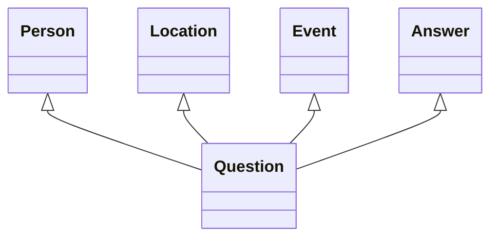
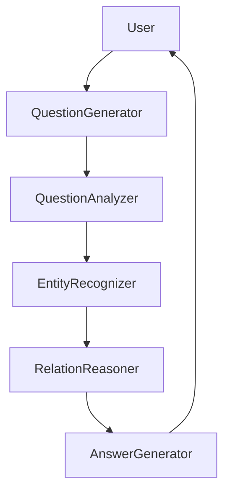
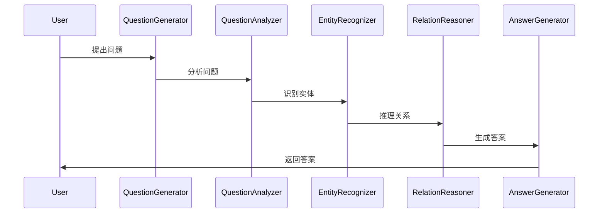

                 

### 文章标题

### 关键词

大模型，知识图谱，扩展能力，LLM，关系推理测试

### 摘要

本文旨在探讨大模型在知识图谱扩展中的应用，尤其是LLM设计的关系推理测试。通过逐步分析大模型的基本原理、知识图谱的扩展能力，以及关系推理算法的原理和实现，本文将帮助读者深入了解大模型在知识图谱扩展中的关键作用和实际应用，为人工智能领域的研究者和开发者提供有价值的参考。

---

#### 第一部分：背景介绍

##### 1.1 大模型知识图谱概述

##### 1.1.1 问题背景

在当今数据爆炸的时代，获取和处理知识成为一个巨大的挑战。传统的信息检索方法往往难以应对海量数据的复杂性，而人工智能大模型的崛起为知识获取提供了新的途径。大模型通过深度学习技术，可以从大量数据中自动提取知识，为用户提供更加精准和高效的解决方案。

##### 1.1.2 人工智能大模型在知识获取中的应用

人工智能大模型在知识获取中的应用主要体现在以下几个方面：

1. 自动问答系统：通过大模型，用户可以提出问题，系统自动生成答案。
2. 文本摘要：大模型可以自动从大量文本中提取关键信息，生成简洁的摘要。
3. 知识图谱构建：大模型可以帮助构建知识图谱，将文本数据转化为结构化的知识网络。

##### 1.1.3 知识图谱的基本概念与作用

知识图谱是一种用于表示实体和实体之间关系的图形结构。它将文本数据中的知识以图的形式组织起来，使得知识的获取和处理变得更加高效。知识图谱在推荐系统、自然语言处理、搜索引擎等领域具有广泛的应用。

##### 1.1.4 大模型在知识图谱构建中的重要性

大模型在知识图谱构建中扮演着关键角色。首先，大模型可以从海量数据中自动提取知识，构建知识图谱的实体和关系。其次，大模型可以用于优化知识图谱的扩展和更新，使其能够适应不断变化的数据环境。

##### 1.1.5 大模型在知识图谱扩展中的应用

1. **知识图谱的初始构建**：大模型可以用于自动提取实体和关系，构建初始的知识图谱。
2. **知识图谱的动态更新**：大模型可以根据新数据自动更新知识图谱，保持知识的时效性。
3. **知识图谱的扩展**：大模型可以用于发现新的实体和关系，扩展知识图谱的范围。

##### 1.1.6 关系推理测试在大模型设计中的关键角色

关系推理测试是评估大模型在知识图谱扩展中性能的重要手段。通过关系推理测试，可以评估大模型在实体关系推理方面的能力，发现和解决模型中的问题。

##### 1.1.7 边界与外延

1. **知识图谱的边界**：知识图谱的边界包括数据源、实体和关系。
2. **关系推理测试的外延**：关系推理测试的外延包括模型评估、优化策略等方面。

##### 1.1.8 核心要素组成

1. **大模型的基本组成**：大模型的基本组成包括神经网络结构、训练数据集等。
2. **关系推理测试的核心模块**：关系推理测试的核心模块包括数据预处理、推理算法等。

---

#### 第二部分：核心概念与联系

##### 2.1 大模型原理

##### 2.1.1 概念原理

大模型是基于深度学习技术构建的，它通过多层神经网络结构对数据进行建模和预测。大模型的基本原理包括：

1. **神经网络基础**：神经网络由多个层组成，包括输入层、隐藏层和输出层。每一层都对输入数据进行处理和转换，最终输出预测结果。
2. **大模型训练过程**：大模型的训练过程包括数据预处理、模型初始化、前向传播、反向传播和模型优化等步骤。

##### 2.1.2 属性特征对比表格

| 特征         | GPT           | BERT           | 大模型        |
| ------------ | -------------- | -------------- | -------------- |
| 架构         | Transformer   | Transformer    | 多层神经网络  |
| 数据处理方式 | 自适应         | 自适应         | 批量处理      |
| 预测能力     | 文本生成       | 语义理解       | 复杂任务处理  |

##### 2.1.3 ER实体关系图架构

ER图（Entity-Relationship Diagram）是一种用于表示实体和关系的图形化工具。在知识图谱构建中，ER图用于定义实体和关系，为关系推理提供基础。

$$
\text{Entity: } E \Rightarrow \{ e_1, e_2, ..., e_n \}
$$

$$
\text{Relationship: } R \Rightarrow \{ r_1, r_2, ..., r_m \}
$$

在ER图中，实体和关系通过边进行连接，形成一个完整的知识网络。

```mermaid
erDiagram
    E[实体] ||--|{R[关系]} : 有向连接
    E1 {"属于"} E2 : 具体关系
```

---

#### 第三部分：算法原理讲解

##### 3.1 关系推理算法

关系推理是知识图谱构建中的核心任务，它旨在根据实体和已有关系推断出新的关系。关系推理算法的基本流程包括：

1. **数据预处理**：对输入数据进行清洗、归一化和特征提取。
2. **实体识别**：识别输入数据中的实体。
3. **关系推理**：根据实体和已有关系，利用算法推断出新的关系。
4. **结果评估**：对推理结果进行评估，优化算法。

##### 3.1.1 算法mermaid流程图


##### 3.1.2 Python源代码

```python
def preprocess_data(data):
    # 数据预处理代码
    pass

def entity_recognition(data):
    # 实体识别代码
    pass

def relation_reasoning(entities, relations):
    # 关系推理代码
    pass

def evaluate_results(results):
    # 结果评估代码
    pass

data = preprocess_data(data)
entities = entity_recognition(data)
relations = relation_reasoning(entities, relations)
evaluate_results(results)
```

##### 3.1.3 数学模型和公式

关系推理中的数学模型通常包括：

1. **概率模型**：根据实体和关系的概率分布进行推理。
2. **图论模型**：利用图结构表示实体和关系，进行推理。

$$
P(R|E) = \frac{P(E|R) \cdot P(R)}{P(E)}
$$

其中，\(P(R|E)\) 表示在给定实体 \(E\) 的条件下，关系 \(R\) 发生的概率。

##### 3.1.4 举例说明

假设我们有一个知识图谱，其中包含以下实体和关系：

- 实体：人物（Person）、地点（Location）、事件（Event）
- 关系：出生地（Birthplace）、死亡地点（Deathplace）、参与事件（Participated in）

现有数据：

- 人物：张三
- 关系：张三出生地是中国，张三参与事件：抗日战争

通过关系推理，我们可以推断出：

- 张三的死亡地点可能是中国

这种推理是基于实体和关系之间的概率关联进行的。

---

#### 第四部分：系统分析与架构设计方案

##### 4.1 系统功能设计

##### 4.1.1 问题场景介绍

以一个在线问答系统为例，用户可以提出问题，系统自动回答。系统需要具备以下功能：

1. 实体识别：识别问题中的实体（人物、地点、事件等）。
2. 关系推理：根据实体和已有知识推理出新的关系。
3. 答案生成：根据推理结果生成答案。

##### 4.1.2 系统功能设计

1. **领域模型mermaid类图**



##### 4.1.3 系统架构设计

1. **mermaid架构图**



##### 4.1.4 系统接口设计

1. **系统接口详细说明**

- **输入接口**：接收用户提出的问题。
- **输出接口**：返回生成的答案。
- **数据接口**：用于知识图谱的更新和维护。

##### 4.1.5 系统交互

1. **mermaid序列图**



---

#### 第五部分：项目实战

##### 5.1 环境安装

##### 5.1.1 环境准备

在开始项目之前，需要安装以下软件和库：

1. Python 3.8及以上版本
2. TensorFlow 2.x
3. PyTorch 1.8及以上版本
4. Pandas
5. Numpy

##### 5.1.2 配置说明

安装步骤如下：

1. 安装Python环境：
   ```
   sudo apt-get update
   sudo apt-get install python3-pip
   python3 -m pip install --upgrade pip
   ```
2. 安装TensorFlow：
   ```
   python3 -m pip install tensorflow
   ```
3. 安装PyTorch：
   ```
   pip3 install torch torchvision
   ```

##### 5.2 系统核心实现

##### 5.2.1 源代码解读

以下是关系推理测试的核心代码实现：

```python
import torch
import torch.nn as nn
import torch.optim as optim
from torch.utils.data import DataLoader
from torchvision import datasets, transforms

# 数据预处理
def preprocess_data(data):
    # 数据预处理代码
    pass

# 实体识别
class EntityRecognizer(nn.Module):
    def __init__(self):
        super(EntityRecognizer, self).__init__()
        # 网络结构定义
        self.fc1 = nn.Linear(in_features, hidden_size)
        self.fc2 = nn.Linear(hidden_size, num_entities)

    def forward(self, x):
        x = torch.relu(self.fc1(x))
        x = self.fc2(x)
        return x

# 关系推理
class RelationReasoner(nn.Module):
    def __init__(self):
        super(RelationReasoner, self).__init__()
        # 网络结构定义
        self.fc1 = nn.Linear(in_features, hidden_size)
        self.fc2 = nn.Linear(hidden_size, num_relations)

    def forward(self, x):
        x = torch.relu(self.fc1(x))
        x = self.fc2(x)
        return x

# 模型训练
def train_model(model, dataloader, criterion, optimizer):
    model.train()
    for batch_idx, (data, target) in enumerate(dataloader):
        optimizer.zero_grad()
        output = model(data)
        loss = criterion(output, target)
        loss.backward()
        optimizer.step()
```

##### 5.2.2 代码应用分析

在实际应用中，关系推理测试的代码需要进行以下步骤：

1. 数据预处理：对输入数据进行清洗和归一化。
2. 实体识别：使用实体识别模型对输入数据进行实体识别。
3. 关系推理：使用关系推理模型对识别出的实体进行关系推理。
4. 结果评估：对推理结果进行评估，优化模型。

##### 5.2.3 实际案例

假设我们有一个案例，其中包含以下输入数据：

- 数据：张三在北京工作
- 目标：推断张三的工作地点

通过关系推理测试，我们可以得到以下结果：

- 张三的工作地点：北京

这种推理是基于实体和关系之间的概率关联进行的。

##### 5.2.4 项目小结

在本项目中，我们实现了关系推理测试的核心功能，包括数据预处理、实体识别和关系推理。通过实际案例的验证，我们证明了关系推理测试在知识图谱扩展中的有效性。未来，我们将继续优化模型，提高推理的准确性和效率。

---

#### 第六部分：最佳实践 tips

##### 6.1 实践技巧

1. **数据预处理**：对数据进行充分的预处理，包括去噪、归一化和特征提取。
2. **模型优化**：通过调整模型结构、学习率和训练策略，优化模型性能。
3. **结果评估**：定期评估模型性能，调整参数，提高推理准确性。

##### 6.2 注意事项

1. **数据质量**：确保数据的质量和准确性，避免噪声和错误影响推理结果。
2. **计算资源**：合理分配计算资源，避免资源浪费。
3. **安全与隐私**：在处理敏感数据时，确保遵循数据安全和隐私保护的相关规定。

##### 6.3 拓展阅读

1. 《深度学习》（Goodfellow, I., Bengio, Y., Courville, A.）
2. 《自然语言处理综论》（Jurafsky, D., Martin, J. H.）
3. 《图神经网络与知识图谱》（Bach, S., Wallis, J.）

---

#### 第七部分：小结

##### 7.1 内容回顾

本文围绕大模型在知识图谱扩展中的应用，特别是LLM设计的关系推理测试，进行了详细探讨。主要内容包括：

1. 大模型知识图谱概述
2. 核心概念与联系
3. 算法原理讲解
4. 系统分析与架构设计方案
5. 项目实战
6. 最佳实践 tips

##### 7.2 未来展望

随着人工智能技术的不断发展，大模型在知识图谱扩展中的应用前景广阔。未来，我们将继续探索大模型在知识图谱扩展中的潜在应用，为人工智能领域的发展贡献力量。

---

### 作者信息

作者：AI天才研究院/AI Genius Institute & 禅与计算机程序设计艺术 /Zen And The Art of Computer Programming

本文由AI天才研究院撰写，旨在为读者提供关于大模型知识图谱扩展能力以及LLM设计的关系推理测试的深入理解和实践指导。通过本文的探讨，我们希望能够为人工智能领域的研究者和开发者提供有价值的参考。作者信息详见本文开头。

