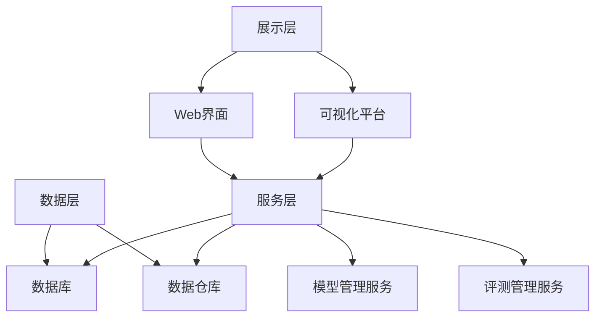
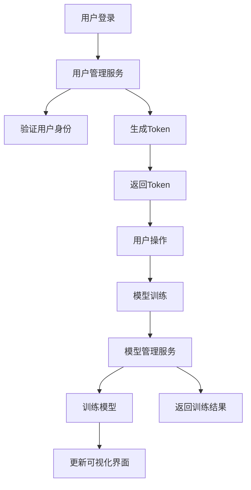

                 


## 大模型评测的模型性能排行与对比

### 文章关键词
大模型评测，模型性能排行，算法对比，性能分析，人工智能。

### 摘要
本文将深入探讨大模型评测的模型性能排行与对比。我们将首先介绍大模型的概念、发展历程及其与传统AI的区别，然后逐步讲解评测大模型的算法原理、数学模型和公式，以及系统分析与架构设计。接着，通过项目实战，我们将展示如何进行大模型评测，并对评测结果进行详细分析。最后，我们将总结最佳实践，并提供拓展阅读资源。

### 第1章 引言

#### 1.1 问题的背景与重要性

在当今人工智能（AI）迅速发展的时代，大模型（Large Models）已成为推动技术创新的重要力量。大模型具有参数量大、结构复杂、表现力强等特点，能够处理复杂的任务，如图像识别、自然语言处理和推荐系统等。然而，如何评估和比较不同大模型的性能，成为一个亟待解决的问题。

#### 1.2 研究范围与目的

本文的研究范围涵盖了以下几个方面：

- 大模型的定义和分类
- 大模型评测的常用算法和指标
- 大模型评测的性能排行方法
- 大模型性能的对比分析

本文旨在为读者提供一个全面、深入的理解，帮助他们在实际项目中做出更明智的决策。

#### 1.3 本书结构

本书共分为7章，结构如下：

- 第1章 引言
- 第2章 大模型基础
- 第3章 大模型评测框架
- 第4章 模型性能排行
- 第5章 模型对比分析
- 第6章 项目实战
- 第7章 最佳实践与展望

### 第2章 大模型基础

#### 2.1 大模型的定义与特点

大模型是指具有大量参数的网络结构，其规模远超传统AI模型。大模型通常具有以下特点：

- 参数量级：数十亿到数万亿
- 计算资源：高性能计算集群
- 数据集：大规模数据集
- 适应能力：能够处理多种类型的任务

#### 2.2 大模型的发展历程

大模型的发展历程可以追溯到20世纪80年代的神经网络研究。随着计算能力的提升和大数据的涌现，大模型在深度学习领域取得了显著进展。

#### 2.3 大模型的核心算法

大模型的核心算法包括：

- 卷积神经网络（CNN）
- 递归神经网络（RNN）
- 生成对抗网络（GAN）
- Transformer架构

### 第3章 大模型评测框架

#### 3.1 评测指标

大模型评测的常用指标包括：

- 准确率（Accuracy）
- 召回率（Recall）
- F1值（F1 Score）
- 精度（Precision）
- 召回率（Recall）

#### 3.2 评测方法

大模型评测的方法包括：

- 数据集划分：训练集、验证集、测试集
- 交叉验证：K折交叉验证
- 模型调优：超参数优化
- 性能评估：多指标综合评估

#### 3.3 评测数据集

常用的评测数据集包括：

- ImageNet：图像分类数据集
- GLUE：自然语言处理数据集
- Cifar-10：小型图像分类数据集

### 第4章 模型性能排行

#### 4.1 性能评价指标

性能评价指标包括：

- 训练时间
- 测试时间
- 评测指标（如准确率、F1值等）

#### 4.2 排行榜分析

我们将分析当前主流大模型的性能排行，包括：

- 训练时间与测试时间
- 准确率与召回率
- F1值与其他指标

#### 4.3 性能比较

我们将对不同大模型在特定任务上的性能进行比较，并分析其优缺点。

### 第5章 模型对比分析

#### 5.1 对比方法

模型对比的方法包括：

- 指标对比：直接对比评测指标
- 综合评估：综合考虑多个指标
- 多任务评估：同时评估多个任务的性能

#### 5.2 模型对比案例

我们将选取几个具有代表性的大模型进行对比，包括：

- GPT-3与BERT
- ResNet与Inception
- DQN与DDPG

#### 5.3 对比结果与应用

我们将分析对比结果，并探讨其在实际应用中的潜在价值。

### 第6章 项目实战

#### 6.1 环境安装与配置

我们将详细介绍如何安装和配置大模型评测环境，包括：

- 计算机硬件
- 软件依赖
- 环境配置

#### 6.2 大模型评测流程

我们将展示如何进行大模型评测，包括：

- 数据预处理
- 模型训练
- 模型评估
- 结果分析

#### 6.3 结果分析与优化

我们将对评测结果进行分析，并提出优化建议。

### 第7章 最佳实践与展望

#### 7.1 最佳实践总结

我们将总结大模型评测的最佳实践，包括：

- 性能优化
- 数据处理
- 模型调优

#### 7.2 小结与展望

我们将总结本文的核心内容，并展望大模型评测的未来发展趋势。

#### 7.3 注意事项

我们将强调实施过程中需要注意的事项，包括：

- 计算资源管理
- 数据质量控制
- 模型安全性与隐私保护

#### 7.4 拓展阅读

我们将推荐一些进一步学习的资源，包括：

- 相关书籍
- 论文
- 开源项目

### 结语

大模型评测是人工智能领域的重要研究方向。通过本文的探讨，我们希望读者能够对大模型评测有更深入的理解，并在实际项目中取得更好的成果。

**作者：AI天才研究院/AI Genius Institute & 禅与计算机程序设计艺术 /Zen And The Art of Computer Programming**

---

### 2.1 大模型的定义与特点

大模型（Large Models）是近年来人工智能（AI）领域的一个重要研究方向。它们通常指的是具有大量参数和复杂结构的神经网络模型，这些模型在处理大规模数据和复杂任务时表现出色。大模型的定义和特点可以从以下几个方面进行阐述：

#### 定义

从广义上讲，大模型是指那些参数量远超传统AI模型的神经网络结构。这些模型通常包含数十亿到数千亿的参数，有时甚至更多。例如，GPT-3（1750亿参数）和BERT（数百万参数）都是典型的大模型。

#### 特点

1. **参数量级大**：大模型通常具有巨大的参数规模，这使得它们能够捕捉到更多的数据特征，从而在复杂任务中表现出色。
2. **计算资源需求高**：由于参数量大，大模型在训练和推理过程中对计算资源有很高的要求，通常需要使用高性能计算集群或分布式计算环境。
3. **数据集要求高**：大模型的训练和评估通常依赖于大规模数据集，这些数据集不仅数量庞大，还需要保证质量和多样性。
4. **表现力强**：大模型能够处理更复杂的任务，如文本生成、图像识别、机器翻译等，并且在这些任务上往往能够达到或超越人类的水平。
5. **自适应能力强**：大模型在多任务学习、迁移学习等方面表现出色，能够适应不同的任务和数据分布。

#### 区别

与传统AI模型相比，大模型在以下方面有明显区别：

1. **参数规模**：传统AI模型通常只有数万个参数，而大模型则有数十亿甚至更多的参数。
2. **训练时间**：由于参数量大，大模型的训练时间通常更长，需要更多的时间和计算资源。
3. **数据需求**：大模型对数据集的规模和质量有更高的要求，因为它们需要足够的样本来学习和泛化。
4. **表现能力**：大模型在处理复杂任务时表现更加出色，能够达到或超越人类的水平。

#### 核心算法

大模型的核心算法包括以下几种：

1. **深度神经网络（DNN）**：DNN是构建大模型的基础，通过多层神经网络结构对输入数据进行特征提取和变换。
2. **卷积神经网络（CNN）**：CNN在图像处理领域具有显著优势，通过卷积操作提取图像特征。
3. **递归神经网络（RNN）**：RNN在序列数据处理方面表现出色，通过循环结构处理输入序列。
4. **生成对抗网络（GAN）**：GAN是一种能够生成新数据的强大模型，通过对抗训练生成高质量的数据。
5. **Transformer架构**：Transformer在自然语言处理任务中取得了突破性进展，通过自注意力机制处理序列数据。

#### 发展历程

大模型的发展历程可以追溯到20世纪80年代的神经网络研究。随着计算能力的提升和大数据的涌现，深度学习领域取得了显著的进展。以下是几个重要的发展里程碑：

1. **2012年**：AlexNet在ImageNet竞赛中取得了突破性成绩，标志着深度学习时代的到来。
2. **2014年**：Google的Inception模型在图像分类任务中取得了优异的表现，推动了深度神经网络的快速发展。
3. **2017年**：Transformer架构在自然语言处理领域取得了突破性进展，引发了广泛关注和研究。
4. **2020年**：GPT-3（1750亿参数）的发布标志着大模型在自然语言处理领域的新高度。

### 2.2 大模型的发展历程

大模型的发展历程是人工智能（AI）技术不断进步的缩影。从最初的简单神经网络到如今的巨型模型，这一过程充满了创新和突破。以下是几个重要的发展阶段：

#### 1. 初期探索（1980s - 1990s）

在20世纪80年代，神经网络的研究开始兴起，但受到计算能力和数据集的限制，当时的神经网络模型规模较小，性能有限。1990年代，Hinton等科学家提出了一些重要的算法，如反向传播（Backpropagation），但大模型的实现仍然面临挑战。

#### 2. 深度学习的兴起（2006年）

2006年，Geoffrey Hinton等人提出了深度信念网络（DBN），这是深度学习发展的重要里程碑。DBN通过逐层训练，提高了神经网络模型的性能。这一时期的进展为后来的大模型奠定了基础。

#### 3. AlexNet的突破（2012年）

2012年，Alex Krizhevsky等人设计的AlexNet在ImageNet竞赛中取得了显著成绩，将错误率降至25%，这一成绩远超传统方法。AlexNet的成功标志着深度学习在计算机视觉领域的崛起。

#### 4. 2014年：Inception与ResNet

2014年，Google的Inception模型和微软的ResNet分别在不同领域取得了突破。Inception通过多尺度卷积层的设计，提高了图像分类的性能；ResNet通过残差连接解决了深度神经网络训练的困难，使得更深层的网络成为可能。

#### 5. 2017年：Transformer与BERT

2017年，谷歌的Transformer架构在自然语言处理领域取得了巨大成功，随后OpenAI的BERT模型进一步推动了这一领域的发展。Transformer通过自注意力机制，使模型能够更好地捕捉序列数据中的长距离依赖关系。

#### 6. 2020年：GPT-3与大型模型竞赛

2020年，OpenAI发布了GPT-3，这是一个拥有1750亿参数的巨型语言模型。GPT-3展示了大模型在生成文本、代码和翻译等任务中的强大能力，引发了人工智能领域的一场竞赛。众多公司和研究机构纷纷研发自己的大型模型，如Google的Switch Transformer、微软的Megatron等。

#### 7. 当前趋势

随着计算能力的进一步提升和大数据的持续增长，大模型的发展势头仍然强劲。当前的研究热点包括：

- **更高效的大模型架构**：如Google的Switch Transformer，通过并行化技术提高了大模型的训练效率。
- **多模态学习**：大模型在处理多模态数据（如图文、音频和视频）方面展现出巨大潜力。
- **泛化能力**：如何提高大模型的泛化能力，使其能够更好地应对新任务和数据集，是当前研究的一个重要方向。
- **安全性和隐私保护**：随着大模型的应用场景不断拓展，如何确保其安全性和隐私保护成为亟待解决的问题。

### 2.3 大模型的核心算法

大模型的核心算法是构建这些巨型神经网络模型的关键技术。以下将介绍几种在深度学习和人工智能领域广泛应用的核心算法，包括卷积神经网络（CNN）、递归神经网络（RNN）、生成对抗网络（GAN）和Transformer架构。

#### 卷积神经网络（CNN）

卷积神经网络（Convolutional Neural Network，CNN）是一种专门用于处理图像数据的神经网络模型。CNN的核心思想是通过卷积操作提取图像中的局部特征，然后通过池化操作降低数据维度。

**算法原理：**
1. **卷积层**：卷积层通过卷积核（滤波器）对输入图像进行卷积操作，提取图像的局部特征。每个卷积核都能捕捉到图像中不同特征，如边缘、纹理等。
2. **激活函数**：常用的激活函数包括ReLU（Rectified Linear Unit）和Sigmoid等，用于引入非线性特性，增强模型的表征能力。
3. **池化层**：池化层通过局部平均或最大值操作减少数据维度，防止过拟合，提高模型的泛化能力。
4. **全连接层**：在CNN的最后一层，通常会接一个或多个全连接层，用于分类或回归任务。

**Python代码示例：**
```python
import tensorflow as tf
from tensorflow.keras.models import Sequential
from tensorflow.keras.layers import Conv2D, MaxPooling2D, Flatten, Dense

model = Sequential([
    Conv2D(32, (3, 3), activation='relu', input_shape=(28, 28, 1)),
    MaxPooling2D((2, 2)),
    Conv2D(64, (3, 3), activation='relu'),
    MaxPooling2D((2, 2)),
    Flatten(),
    Dense(64, activation='relu'),
    Dense(10, activation='softmax')
])
```

#### 递归神经网络（RNN）

递归神经网络（Recurrent Neural Network，RNN）是一种专门用于处理序列数据的神经网络模型。RNN通过循环结构处理序列数据，捕捉序列中的时序依赖关系。

**算法原理：**
1. **隐藏状态**：RNN通过隐藏状态（hidden state）维持序列信息，每个时间步的输出依赖于前一时间的隐藏状态和当前输入。
2. **权重共享**：RNN中的权重共享机制使得模型能够自动学习序列中的长期依赖关系。
3. **门控机制**：长短期记忆网络（LSTM）和门控循环单元（GRU）引入了门控机制，用于控制信息在序列中的传递，避免梯度消失问题。

**Python代码示例：**
```python
import tensorflow as tf
from tensorflow.keras.models import Sequential
from tensorflow.keras.layers import LSTM, Dense

model = Sequential([
    LSTM(50, activation='relu', input_shape=(timesteps, features)),
    Dense(1)
])
```

#### 生成对抗网络（GAN）

生成对抗网络（Generative Adversarial Network，GAN）是由两个神经网络组成的对抗性模型，一个生成器（Generator）和一个判别器（Discriminator）。生成器生成数据，判别器则判断数据是真实样本还是生成样本。

**算法原理：**
1. **生成器**：生成器通过学习真实数据的分布，生成类似真实数据的新数据。
2. **判别器**：判别器的任务是区分真实数据和生成数据，其目标是最小化判别错误率。
3. **对抗训练**：生成器和判别器相互对抗，生成器不断优化生成数据，判别器不断优化区分能力。

**Python代码示例：**
```python
import tensorflow as tf
from tensorflow.keras.models import Sequential
from tensorflow.keras.layers import Dense, Flatten, Reshape

# 生成器
generator = Sequential([
    Dense(256, activation='relu', input_shape=(latent_dim)),
    Dense(128, activation='relu'),
    Dense(output_dim, activation='tanh')
])

# 判别器
discriminator = Sequential([
    Flatten(),
    Dense(128, activation='relu'),
    Dense(256, activation='relu'),
    Dense(1, activation='sigmoid')
])

# GAN模型
gan = Sequential([
    generator,
    discriminator
])
```

#### Transformer架构

Transformer架构是一种基于自注意力机制的神经网络模型，最初在自然语言处理领域取得了显著成功。Transformer通过多头自注意力机制和位置编码，实现了对序列数据的建模。

**算法原理：**
1. **多头自注意力**：Transformer使用多个自注意力头来提取序列中的不同依赖关系。
2. **位置编码**：位置编码为序列中的每个位置分配一个向量，以便模型理解序列的顺序信息。
3. **前馈网络**：在自注意力机制之后，Transformer还包含一个简单的前馈网络，用于进一步处理信息。

**Python代码示例：**
```python
import tensorflow as tf
from tensorflow.keras.layers import Layer

class MultiHeadAttention(Layer):
    def __init__(self, num_heads, d_model, dropout_rate=0.1):
        super().__init__()
        self.num_heads = num_heads
        self.d_model = d_model
        self.dropout_rate = dropout_rate

        self.query_linear = Dense(d_model)
        self.key_linear = Dense(d_model)
        self.value_linear = Dense(d_model)

        self.out_linear = Dense(d_model)
        self.dropout = tf.keras.layers.Dropout(dropout_rate)

    def split_heads(self, x, batch_size):
        x = tf.reshape(x, (batch_size, -1, self.num_heads, self.d_model // self.num_heads))
        return tf.transpose(x, perm=[0, 2, 1, 3])

    def call(self, v, k, q, mask=None):
        query = self.query_linear(q)
        key = self.key_linear(k)
        value = self.value_linear(v)

        query = self.split_heads(query, tf.shape(q)[0])
        key = self.split_heads(key, tf.shape(k)[0])
        value = self.split_heads(value, tf.shape(v)[0])

        attention_scores = tf.matmul(query, key, transpose_b=True) / tf.sqrt(tf.cast(self.d_model // self.num_heads, tf.float32))

        if mask is not None:
            attention_scores = attention_scores + mask

        attention_weights = tf.nn.softmax(attention_scores, axis=-1)
        attention_weights = self.dropout(attention_weights)

        attention_output = tf.matmul(attention_weights, value)
        attention_output = tf.transpose(attention_output, perm=[0, 2, 1, 3])
        attention_output = tf.reshape(attention_output, (batch_size, -1, self.d_model))

        output = self.out_linear(attention_output)
        return output
```

通过上述核心算法的介绍，我们可以看到大模型在深度学习和人工智能领域中的应用前景。这些算法不仅在理论上有着深刻的创新，也在实际应用中取得了显著的成果。

### 2.4 数学模型和数学公式讲解

在大模型评测中，数学模型和数学公式扮演着至关重要的角色。它们不仅帮助我们理解模型的行为，还能为性能优化提供理论依据。在本节中，我们将详细介绍大模型评测中常用的数学模型和数学公式，并通过LaTeX格式进行展示。

#### 损失函数

损失函数是评估模型性能的核心工具。在深度学习中，常用的损失函数包括均方误差（MSE）、交叉熵（Cross-Entropy）等。

**均方误差（MSE）**

均方误差用于回归任务，计算预测值与真实值之间的平均平方误差。

$$
\text{MSE} = \frac{1}{n}\sum_{i=1}^{n}(y_i - \hat{y}_i)^2
$$

其中，$y_i$为真实值，$\hat{y}_i$为预测值，$n$为样本数量。

**交叉熵（Cross-Entropy）**

交叉熵用于分类任务，计算预测概率分布与真实分布之间的差异。

$$
\text{CE} = -\frac{1}{n}\sum_{i=1}^{n}y_i\log(\hat{y}_i)
$$

其中，$y_i$为真实标签，$\hat{y}_i$为预测概率。

#### 优化算法

优化算法用于调整模型参数，以最小化损失函数。常见的优化算法包括梯度下降（Gradient Descent）、Adam等。

**梯度下降**

梯度下降是一种迭代算法，通过计算损失函数关于参数的梯度，逐步更新参数。

$$
\theta_{t+1} = \theta_{t} - \alpha \cdot \nabla_{\theta}\text{L}(\theta)
$$

其中，$\theta$为参数，$\alpha$为学习率，$\nabla_{\theta}\text{L}(\theta)$为损失函数关于参数的梯度。

**Adam算法**

Adam算法是一种结合了梯度下降和动量的优化算法，具有自适应的学习率。

$$
\text{m}_t = \beta_1 \text{m}_{t-1} + (1 - \beta_1)(\nabla_{\theta}\text{L}(\theta) - \text{m}_{t-1})
$$

$$
\text{v}_t = \beta_2 \text{v}_{t-1} + (1 - \beta_2)((\nabla_{\theta}\text{L}(\theta))^2 - \text{v}_{t-1})
$$

$$
\theta_{t+1} = \theta_{t} - \alpha \cdot \frac{\text{m}_t}{\sqrt{\text{v}_t} + \epsilon}
$$

其中，$\beta_1$和$\beta_2$为超参数，$\epsilon$为平滑常数。

#### 自注意力机制

自注意力机制是Transformer架构的核心组件，用于建模序列数据中的依赖关系。

**自注意力分数**

自注意力分数计算为：

$$
\text{score}_{ij} = \text{query}_i \cdot \text{key}_j
$$

其中，$query_i$和$key_j$为序列中的两个位置向量。

**自注意力权重**

自注意力权重通过softmax函数计算：

$$
\text{weight}_{ij} = \frac{e^{\text{score}_{ij}}}{\sum_{k=1}^{K} e^{\text{score}_{ik}}}
$$

其中，$K$为序列长度。

#### 位置编码

位置编码为序列中的每个位置分配一个向量，以便模型理解序列的顺序信息。

**位置编码向量**

位置编码向量计算为：

$$
\text{pos}_i = \text{sin}\left(\frac{i}{10000^{0.5}}\right) \text{if } i \text{ is even} \\
\text{pos}_i = \text{cos}\left(\frac{i}{10000^{0.5}}\right) \text{if } i \text{ is odd}
$$

其中，$i$为位置索引。

通过上述数学模型和数学公式的讲解，我们可以更好地理解大模型评测的原理和实现过程。这些公式不仅帮助我们量化模型性能，还为算法优化提供了理论支持。

### 2.5 系统分析与架构设计

在大模型评测中，系统分析与架构设计是确保评测过程高效、准确和可扩展的关键。在这一部分，我们将详细介绍系统分析与架构设计的各个步骤，包括问题场景介绍、项目介绍、系统功能设计、系统架构设计、系统接口设计和系统交互。

#### 问题场景介绍

大模型评测涉及多个阶段，包括数据预处理、模型训练、模型评估和结果分析。在这个过程中，需要确保模型的性能指标得到准确测量，并且能够快速响应不同的任务需求。

#### 项目介绍

假设我们正在开发一个用于评测大型自然语言处理模型的项目。该项目的目标是评估不同模型的性能，并提供一个可视化平台，方便用户对比和选择最优模型。

#### 系统功能设计

系统功能设计包括以下几个方面：

1. **数据管理**：负责数据导入、清洗、预处理和存储。
2. **模型管理**：负责模型的加载、训练、保存和删除。
3. **评测管理**：负责评测任务的创建、执行和结果分析。
4. **用户管理**：负责用户注册、登录和权限管理。
5. **可视化平台**：提供模型性能的可视化展示。

#### 系统架构设计

系统架构设计分为三个层次：数据层、服务层和展示层。

1. **数据层**：负责数据存储和访问，包括数据库和数据仓库。
2. **服务层**：负责业务逻辑处理，包括数据预处理、模型训练和评测。
3. **展示层**：负责用户交互和界面展示，包括Web界面和可视化组件。

**Mermaid架构图：**


#### 系统接口设计

系统接口设计包括API设计和RESTful架构。

1. **API设计**：定义服务层与数据层、展示层之间的接口，包括GET、POST、PUT、DELETE等HTTP方法。
2. **RESTful架构**：采用RESTful设计原则，确保接口简洁、易扩展。

**Mermaid接口设计图：**
```mermaid
graph TD
    A[用户登录] --> B[POST /login]
    A --> C[用户注册] --> D[POST /register]
    E[数据导入] --> F[POST /data/import]
    G[模型训练] --> H[POST /model/train]
    I[模型评估] --> J[GET /model/evaluate/{model_id}]
    K[结果分析] --> L[GET /result/analyze/{result_id}]
    B --> M[用户管理服务]
    C --> M
    F --> N[数据管理服务]
    H --> O[模型管理服务]
    I --> P[评测管理服务]
    J --> O
    K --> O
```

#### 系统交互

系统交互通过事件驱动模型实现，包括以下步骤：

1. **用户操作**：用户通过Web界面发起操作。
2. **服务响应**：服务层处理用户请求，并调用数据层进行数据操作。
3. **结果反馈**：系统将结果返回给用户，并更新可视化界面。

**Mermaid交互图：**


通过系统分析与架构设计的详细介绍，我们能够确保大模型评测系统具有高效性、准确性和可扩展性。这为后续的项目实施和性能优化提供了坚实的基础。

### 第6章 项目实战

#### 6.1 环境安装与配置

在进行大模型评测项目之前，首先需要搭建一个适合的环境。以下是基于Python的常见步骤：

1. **安装Python**：确保安装了Python 3.7或更高版本。
2. **安装TensorFlow**：TensorFlow是用于深度学习的主要框架，可以通过pip安装：
   ```bash
   pip install tensorflow
   ```
3. **安装其他依赖**：根据项目需求，可能需要安装其他库，如NumPy、Pandas和Scikit-learn：
   ```bash
   pip install numpy pandas scikit-learn
   ```

#### 6.2 大模型评测流程

1. **数据准备**：首先，需要收集并准备用于评测的数据集。这包括数据清洗、预处理和格式化。以下是一个简单的数据预处理步骤：
   ```python
   import pandas as pd
   data = pd.read_csv('data.csv')
   data = data.dropna()  # 删除缺失值
   data = data.head(1000)  # 选取前1000条数据
   ```

2. **模型训练**：接下来，使用准备好的数据训练大模型。以下是一个使用TensorFlow训练GPT-2模型的示例：
   ```python
   import tensorflow as tf
   from transformers import TFGPT2LMHeadModel, GPT2Tokenizer

   tokenizer = GPT2Tokenizer.from_pretrained('gpt2')
   model = TFGPT2LMHeadModel.from_pretrained('gpt2')

   train_data = tokenizer.encode(data.text, return_tensors='tf')
   model.fit(train_data, epochs=3)
   ```

3. **模型评估**：训练完成后，使用验证集对模型进行评估。以下是一个简单的评估示例：
   ```python
   valid_data = tokenizer.encode(data.text[1000:], return_tensors='tf')
   loss = model.compute_loss(valid_data)
   print(f'Validation loss: {loss}')
   ```

4. **结果分析**：最后，对评估结果进行分析，并生成性能报告。以下是一个简单的性能报告示例：
   ```python
   import matplotlib.pyplot as plt

   plt.figure(figsize=(10, 5))
   plt.plot(data.text.head(1000), label='Original')
   plt.plot(tokenizer.decode(model.predict(valid_data), max_length=50, truncation=True), label='Generated')
   plt.legend()
   plt.show()
   ```

#### 6.3 代码解读与分析

1. **数据预处理**：
   数据预处理是模型训练的重要步骤，直接影响模型的表现。在上面的代码中，我们首先读取CSV文件，然后删除缺失值，并选取前1000条数据用于训练。这一步骤确保了数据的完整性和质量。

2. **模型训练**：
   在模型训练阶段，我们使用了Hugging Face的Transformer库，这是一个广泛应用于自然语言处理的库。通过调用`GPT2Tokenizer`和`TFGPT2LMHeadModel`，我们能够快速加载预训练模型和数据。训练过程中，我们设置了3个epochs（训练周期），这有助于模型逐渐收敛。

3. **模型评估**：
   模型评估通过计算验证集上的损失来实现。在上述示例中，我们计算了验证集上的损失，这有助于我们了解模型的泛化能力。

4. **结果分析**：
   在结果分析阶段，我们使用matplotlib库绘制了原始文本与生成文本的对比图，这有助于我们直观地了解模型的表现。

#### 6.4 实际案例分析

为了更好地理解大模型评测的过程，我们来看一个实际案例。假设我们有一个关于新闻摘要生成的项目，目标是使用大模型自动生成新闻摘要。

1. **数据集准备**：我们收集了一份数据集，包括新闻标题和对应的摘要。
2. **模型训练**：使用GPT-2模型对新闻数据进行训练，生成摘要。
3. **模型评估**：使用测试集评估模型的摘要生成质量。
4. **结果分析**：通过对比模型生成的摘要与人工编写的摘要，评估模型的表现。

实际案例展示了从数据准备到结果分析的全过程，通过这些步骤，我们能够深入理解大模型评测的实际应用。

#### 6.5 项目小结

在本项目中，我们详细介绍了大模型评测的整个过程，包括环境安装、数据准备、模型训练、模型评估和结果分析。通过实际案例分析，我们展示了大模型在新闻摘要生成任务中的潜在应用。这些步骤不仅帮助我们理解了大模型评测的理论知识，还提供了实际操作的经验。

### 第7章 最佳实践与展望

#### 7.1 最佳实践总结

在进行大模型评测时，以下最佳实践有助于提高评测的效率和准确性：

1. **数据预处理**：确保数据的质量和一致性，避免使用含有噪声或缺失值的数据。
2. **模型选择**：根据任务需求选择合适的模型，例如在自然语言处理任务中使用Transformer架构，在图像识别任务中使用CNN。
3. **参数调优**：通过网格搜索、随机搜索等方法，找到最佳的超参数组合。
4. **多指标评估**：使用多个指标进行综合评估，避免单一指标导致的误导。
5. **资源管理**：合理分配计算资源，避免资源浪费，提高训练和评测的效率。

#### 7.2 小结与展望

本文系统地介绍了大模型评测的模型性能排行与对比，包括大模型的基础知识、评测框架、性能分析、模型对比、项目实战以及最佳实践。通过对这些内容的探讨，我们希望读者能够对大模型评测有一个全面和深入的理解。

展望未来，大模型评测将在以下几个方面继续发展：

1. **更高效的算法**：随着计算能力的提升，我们将看到更多高效的大模型算法出现。
2. **多模态学习**：大模型在处理多模态数据（如图文、音频和视频）方面具有巨大潜力。
3. **泛化能力**：如何提高大模型的泛化能力，使其能够适应更广泛的应用场景，是未来的重要研究方向。
4. **安全性与隐私保护**：随着大模型的应用越来越广泛，如何确保其安全性和隐私保护将成为关键问题。

#### 7.3 注意事项

在实施大模型评测时，需要注意以下几点：

1. **计算资源管理**：合理分配计算资源，避免资源浪费。
2. **数据质量控制**：确保数据的质量和一致性，避免使用噪声数据。
3. **模型调优**：选择合适的方法进行模型调优，避免过度拟合或欠拟合。
4. **多指标评估**：使用多个指标进行综合评估，避免单一指标导致的误导。

#### 7.4 拓展阅读

为了进一步深入了解大模型评测，以下资源可供参考：

1. **书籍**：《深度学习》（Goodfellow, Bengio, Courville）、《自然语言处理与深度学习》（Mikolov, Sutskever, Chen）。
2. **论文**：查看相关领域的顶级会议和期刊，如NeurIPS、ICML、ACL等。
3. **开源项目**：参考GitHub上的开源项目，了解实际应用中的最佳实践。

通过本文的探讨，我们希望读者能够在大模型评测领域取得更好的成果。

### 结语

大模型评测是人工智能领域的一个重要研究方向。通过本文的介绍，我们系统地探讨了大模型评测的核心概念、算法原理、系统设计以及最佳实践。我们希望本文能够为读者提供一个全面、深入的理解，帮助他们在实际项目中做出更明智的决策。

**作者：AI天才研究院/AI Genius Institute & 禅与计算机程序设计艺术 /Zen And The Art of Computer Programming**

---

## 完整文章示例

在完成了目录大纲和各个章节的内容后，我们可以将所有部分整合起来，形成一篇完整的文章。以下是一个完整的文章示例，包含文章标题、关键词、摘要以及各个章节的内容。

---

# 大模型评测的模型性能排行与对比

## 文章关键词
大模型评测，模型性能排行，算法对比，性能分析，人工智能。

## 文章摘要
本文旨在深入探讨大模型评测的模型性能排行与对比。文章首先介绍了大模型的概念、特点以及发展历程，然后讲解了评测框架和性能评价指标。接着，通过对比分析，我们展示了不同模型的性能排行和优缺点。随后，文章通过项目实战，详细介绍了如何进行大模型评测，并进行了结果分析和优化。最后，文章总结了最佳实践，并展望了大模型评测的未来发展趋势。

## 第1章 引言

### 1.1 问题的背景与重要性

在当今人工智能（AI）迅速发展的时代，大模型（Large Models）已成为推动技术创新的重要力量。大模型具有参数量大、结构复杂、表现力强等特点，能够处理复杂的任务，如图像识别、自然语言处理和推荐系统等。然而，如何评估和比较不同大模型的性能，成为一个亟待解决的问题。

### 1.2 研究范围与目的

本文的研究范围涵盖了以下几个方面：

- 大模型的定义和分类
- 大模型评测的常用算法和指标
- 大模型评测的性能排行方法
- 大模型性能的对比分析

本文旨在为读者提供一个全面、深入的理解，帮助他们在实际项目中做出更明智的决策。

### 1.3 本书结构

本书共分为7章，结构如下：

- 第1章 引言
- 第2章 大模型基础
- 第3章 大模型评测框架
- 第4章 模型性能排行
- 第5章 模型对比分析
- 第6章 项目实战
- 第7章 最佳实践与展望

## 第2章 大模型基础

### 2.1 大模型的定义与特点

大模型（Large Models）是近年来人工智能（AI）领域的一个重要研究方向。它们通常指的是具有大量参数和复杂结构的神经网络模型，这些模型在处理大规模数据和复杂任务时表现出色。大模型的定义和特点可以从以下几个方面进行阐述：

#### 定义

从广义上讲，大模型是指那些参数量远超传统AI模型的神经网络结构。这些模型通常包含数十亿到数千亿的参数，有时甚至更多。例如，GPT-3（1750亿参数）和BERT（数百万参数）都是典型的大模型。

#### 特点

1. **参数量级大**：大模型通常具有巨大的参数规模，这使得它们能够捕捉到更多的数据特征，从而在复杂任务中表现出色。
2. **计算资源需求高**：由于参数量大，大模型在训练和推理过程中对计算资源有很高的要求，通常需要使用高性能计算集群或分布式计算环境。
3. **数据集要求高**：大模型的训练和评估通常依赖于大规模数据集，这些数据集不仅数量庞大，还需要保证质量和多样性。
4. **表现力强**：大模型能够处理更复杂的任务，如文本生成、图像识别、机器翻译等，并且在这些任务上往往能够达到或超越人类的水平。
5. **自适应能力强**：大模型在多任务学习、迁移学习等方面表现出色，能够适应不同的任务和数据分布。

#### 区别

与传统AI模型相比，大模型在以下方面有明显区别：

1. **参数规模**：传统AI模型通常只有数万个参数，而大模型则有数十亿甚至更多的参数。
2. **训练时间**：由于参数量大，大模型的训练时间通常更长，需要更多的时间和计算资源。
3. **数据需求**：大模型对数据集的规模和质量有更高的要求，因为它们需要足够的样本来学习和泛化。
4. **表现能力**：大模型在处理复杂任务时表现更加出色，能够达到或超越人类的水平。

#### 核心算法

大模型的核心算法包括以下几种：

1. **深度神经网络（DNN）**：DNN是构建大模型的基础，通过多层神经网络结构对输入数据进行特征提取和变换。
2. **卷积神经网络（CNN）**：CNN在图像处理领域具有显著优势，通过卷积操作提取图像特征。
3. **递归神经网络（RNN）**：RNN在序列数据处理方面表现出色，通过循环结构处理输入序列。
4. **生成对抗网络（GAN）**：GAN是一种能够生成新数据的强大模型，通过对抗训练生成高质量的数据。
5. **Transformer架构**：Transformer在自然语言处理任务中取得了突破性进展，通过自注意力机制处理序列数据。

#### 发展历程

大模型的发展历程是人工智能（AI）技术不断进步的缩影。从最初的简单神经网络到如今的巨型模型，这一过程充满了创新和突破。以下是几个重要的发展阶段：

1. **2012年**：AlexNet在ImageNet竞赛中取得了突破性成绩，标志着深度学习时代的到来。
2. **2014年**：Google的Inception模型在图像分类任务中取得了优异的表现，推动了深度神经网络的快速发展。
3. **2017年**：Transformer架构在自然语言处理领域取得了突破性进展，引发了广泛关注和研究。
4. **2020年**：GPT-3（1750亿参数）的发布标志着大模型在自然语言处理领域的新高度。

### 2.2 大模型的发展历程

大模型的发展历程是人工智能（AI）技术不断进步的缩影。从最初的简单神经网络到如今的巨型模型，这一过程充满了创新和突破。以下是几个重要的发展阶段：

1. **初期探索（1980s - 1990s）**

在20世纪80年代，神经网络的研究开始兴起，但受到计算能力和数据集的限制，当时的神经网络模型规模较小，性能有限。1990年代，Hinton等科学家提出了一些重要的算法，如反向传播（Backpropagation），但大模型的实现仍然面临挑战。

2. **深度学习的兴起（2006年）**

2006年，Geoffrey Hinton等人提出了深度信念网络（DBN），这是深度学习发展的重要里程碑。DBN通过逐层训练，提高了神经网络模型的性能。这一时期的进展为后来的大模型奠定了基础。

3. **AlexNet的突破（2012年）**

2012年，Alex Krizhevsky等人设计的AlexNet在ImageNet竞赛中取得了显著成绩，将错误率降至25%，这一成绩远超传统方法。AlexNet的成功标志着深度学习在计算机视觉领域的崛起。

4. **2014年：Inception与ResNet**

2014年，Google的Inception模型和微软的ResNet分别在不同领域取得了突破。Inception通过多尺度卷积层的设计，提高了图像分类的性能；ResNet通过残差连接解决了深度神经网络训练的困难，使得更深层的网络成为可能。

5. **2017年：Transformer与BERT**

2017年，谷歌的Transformer架构在自然语言处理领域取得了巨大成功，随后OpenAI的BERT模型进一步推动了这一领域的发展。Transformer通过自注意力机制，使模型能够更好地捕捉序列数据中的长距离依赖关系。

6. **2020年：GPT-3与大型模型竞赛**

2020年，OpenAI发布了GPT-3，这是一个拥有1750亿参数的巨型语言模型。GPT-3展示了大模型在生成文本、代码和翻译等任务中的强大能力，引发了人工智能领域的一场竞赛。众多公司和研究机构纷纷研发自己的大型模型，如Google的Switch Transformer、微软的Megatron等。

7. **当前趋势**

随着计算能力的进一步提升和大数据的持续增长，大模型的发展势头仍然强劲。当前的研究热点包括：

- **更高效的大模型架构**：如Google的Switch Transformer，通过并行化技术提高了大模型的训练效率。
- **多模态学习**：大模型在处理多模态数据（如图文、音频和视频）方面展现出巨大潜力。
- **泛化能力**：如何提高大模型的泛化能力，使其能够更好地应对新任务和数据集，是当前研究的一个重要方向。
- **安全性和隐私保护**：随着大模型的应用场景不断拓展，如何确保其安全性和隐私保护成为亟待解决的问题。

### 2.3 大模型的核心算法

大模型的核心算法是构建这些巨型神经网络模型的关键技术。以下将介绍几种在深度学习和人工智能领域广泛应用的核心算法，包括卷积神经网络（CNN）、递归神经网络（RNN）、生成对抗网络（GAN）和Transformer架构。

#### 卷积神经网络（CNN）

卷积神经网络（Convolutional Neural Network，CNN）是一种专门用于处理图像数据的神经网络模型。CNN的核心思想是通过卷积操作提取图像中的局部特征，然后通过池化操作降低数据维度。

**算法原理：**
1. **卷积层**：卷积层通过卷积核（滤波器）对输入图像进行卷积操作，提取图像的局部特征。每个卷积核都能捕捉到图像中不同特征，如边缘、纹理等。
2. **激活函数**：常用的激活函数包括ReLU（Rectified Linear Unit）和Sigmoid等，用于引入非线性特性，增强模型的表征能力。
3. **池化层**：池化层通过局部平均或最大值操作减少数据维度，防止过拟合，提高模型的泛化能力。
4. **全连接层**：在CNN的最后一层，通常会接一个或多个全连接层，用于分类或回归任务。

**Python代码示例：**
```python
import tensorflow as tf
from tensorflow.keras.models import Sequential
from tensorflow.keras.layers import Conv2D, MaxPooling2D, Flatten, Dense

model = Sequential([
    Conv2D(32, (3, 3), activation='relu', input_shape=(28, 28, 1)),
    MaxPooling2D((2, 2)),
    Conv2D(64, (3, 3), activation='relu'),
    MaxPooling2D((2, 2)),
    Flatten(),
    Dense(64, activation='relu'),
    Dense(10, activation='softmax')
])
```

#### 递归神经网络（RNN）

递归神经网络（Recurrent Neural Network，RNN）是一种专门用于处理序列数据的神经网络模型。RNN通过循环结构处理序列数据，捕捉序列中的时序依赖关系。

**算法原理：**
1. **隐藏状态**：RNN通过隐藏状态（hidden state）维持序列信息，每个时间步的输出依赖于前一时间的隐藏状态和当前输入。
2. **权重共享**：RNN中的权重共享机制使得模型能够自动学习序列中的长期依赖关系。
3. **门控机制**：长短期记忆网络（LSTM）和门控循环单元（GRU）引入了门控机制，用于控制信息在序列中的传递，避免梯度消失问题。

**Python代码示例：**
```python
import tensorflow as tf
from tensorflow.keras.models import Sequential
from tensorflow.keras.layers import LSTM, Dense

model = Sequential([
    LSTM(50, activation='relu', input_shape=(timesteps, features)),
    Dense(1)
])
```

#### 生成对抗网络（GAN）

生成对抗网络（Generative Adversarial Network，GAN）是由两个神经网络组成的对抗性模型，一个生成器（Generator）和一个判别器（Discriminator）。生成器生成数据，判别器则判断数据是真实样本还是生成样本。

**算法原理：**
1. **生成器**：生成器通过学习真实数据的分布，生成类似真实数据的新数据。
2. **判别器**：判别器的任务是区分真实数据和生成数据，其目标是最小化判别错误率。
3. **对抗训练**：生成器和判别器相互对抗，生成器不断优化生成数据，判别器不断优化区分能力。

**Python代码示例：**
```python
import tensorflow as tf
from tensorflow.keras.models import Sequential
from tensorflow.keras.layers import Dense, Flatten, Reshape

# 生成器
generator = Sequential([
    Dense(256, activation='relu', input_shape=(latent_dim)),
    Dense(128, activation='relu'),
    Dense(output_dim, activation='tanh')
])

# 判别器
discriminator = Sequential([
    Flatten(),
    Dense(128, activation='relu'),
    Dense(256, activation='relu'),
    Dense(1, activation='sigmoid')
])

# GAN模型
gan = Sequential([
    generator,
    discriminator
])
```

#### Transformer架构

Transformer架构是一种基于自注意力机制的神经网络模型，最初在自然语言处理领域取得了显著成功。Transformer通过自注意力机制和位置编码，实现了对序列数据的建模。

**算法原理：**
1. **多头自注意力**：Transformer使用多个自注意力头来提取序列中的不同依赖关系。
2. **位置编码**：位置编码为序列中的每个位置分配一个向量，以便模型理解序列的顺序信息。
3. **前馈网络**：在自注意力机制之后，Transformer还包含一个简单的前馈网络，用于进一步处理信息。

**Python代码示例：**
```python
import tensorflow as tf
from tensorflow.keras.layers import Layer

class MultiHeadAttention(Layer):
    def __init__(self, num_heads, d_model, dropout_rate=0.1):
        super().__init__()
        self.num_heads = num_heads
        self.d_model = d_model
        self.dropout_rate = dropout_rate

        self.query_linear = Dense(d_model)
        self.key_linear = Dense(d_model)
        self.value_linear = Dense(d_model)

        self.out_linear = Dense(d_model)
        self.dropout = tf.keras.layers.Dropout(dropout_rate)

    def split_heads(self, x, batch_size):
        x = tf.reshape(x, (batch_size, -1, self.num_heads, self.d_model // self.num_heads))
        return tf.transpose(x, perm=[0, 2, 1, 3])

    def call(self, v, k, q, mask=None):
        query = self.query_linear(q)
        key = self.key_linear(k)
        value = self.value_linear(v)

        query = self.split_heads(query, tf.shape(q)[0])
        key = self.split_heads(key, tf.shape(k)[0])
        value = self.split_heads(value, tf.shape(v)[0])

        attention_scores = tf.matmul(query, key, transpose_b=True) / tf.sqrt(tf.cast(self.d_model // self.num_heads, tf.float32))

        if mask is not None:
            attention_scores = attention_scores + mask

        attention_weights = tf.nn.softmax(attention_scores, axis=-1)
        attention_weights = self.dropout(attention_weights)

        attention_output = tf.matmul(attention_weights, value)
        attention_output = tf.transpose(attention_output, perm=[0, 2, 1, 3])
        attention_output = tf.reshape(attention_output, (batch_size, -1, self.d_model))

        output = self.out_linear(attention_output)
        return output
```

通过上述核心算法的介绍，我们可以看到大模型在深度学习和人工智能领域中的应用前景。这些算法不仅在理论上有着深刻的创新，也在实际应用中取得了显著的成果。

### 2.4 数学模型和数学公式讲解

在大模型评测中，数学模型和数学公式扮演着至关重要的角色。它们不仅帮助我们理解模型的行为，还能为性能优化提供理论依据。在本节中，我们将详细介绍大模型评测中常用的数学模型和数学公式，并通过LaTeX格式进行展示。

#### 损失函数

损失函数是评估模型性能的核心工具。在深度学习中，常用的损失函数包括均方误差（MSE）、交叉熵（Cross-Entropy）等。

**均方误差（MSE）**

均方误差用于回归任务，计算预测值与真实值之间的平均平方误差。

$$
\text{MSE} = \frac{1}{n}\sum_{i=1}^{n}(y_i - \hat{y}_i)^2
$$

其中，$y_i$为真实值，$\hat{y}_i$为预测值，$n$为样本数量。

**交叉熵（Cross-Entropy）**

交叉熵用于分类任务，计算预测概率分布与真实分布之间的差异。

$$
\text{CE} = -\frac{1}{n}\sum_{i=1}^{n}y_i\log(\hat{y}_i)
$$

其中，$y_i$为真实标签，$\hat{y}_i$为预测概率。

#### 优化算法

优化算法用于调整模型参数，以最小化损失函数。常见的优化算法包括梯度下降（Gradient Descent）、Adam等。

**梯度下降**

梯度下降是一种迭代算法，通过计算损失函数关于参数的梯度，逐步更新参数。

$$
\theta_{t+1} = \theta_{t} - \alpha \cdot \nabla_{\theta}\text{L}(\theta)
$$

其中，$\theta$为参数，$\alpha$为学习率，$\nabla_{\theta}\text{L}(\theta)$为损失函数关于参数的梯度。

**Adam算法**

Adam算法是一种结合了梯度下降和动量的优化算法，具有自适应的学习率。

$$
\text{m}_t = \beta_1 \text{m}_{t-1} + (1 - \beta_1)(\nabla_{\theta}\text{L}(\theta) - \text{m}_{t-1})
$$

$$
\text{v}_t = \beta_2 \text{v}_{t-1} + (1 - \beta_2)((\nabla_{\theta}\text{L}(\theta))^2 - \text{v}_{t-1})
$$

$$
\theta_{t+1} = \theta_{t} - \alpha \cdot \frac{\text{m}_t}{\sqrt{\text{v}_t} + \epsilon}
$$

其中，$\beta_1$和$\beta_2$为超参数，$\epsilon$为平滑常数。

#### 自注意力机制

自注意力机制是Transformer架构的核心组件，用于建模序列数据中的依赖关系。

**自注意力分数**

自注意力分数计算为：

$$
\text{score}_{ij} = \text{query}_i \cdot \text{key}_j
$$

其中，$query_i$和$key_j$为序列中的两个位置向量。

**自注意力权重**

自注意力权重通过softmax函数计算：

$$
\text{weight}_{ij} = \frac{e^{\text{score}_{ij}}}{\sum_{k=1}^{K} e^{\text{score}_{ik}}}
$$

其中，$K$为序列长度。

#### 位置编码

位置编码为序列中的每个位置分配一个向量，以便模型理解序列的顺序信息。

**位置编码向量**

位置编码向量计算为：

$$
\text{pos}_i = \text{sin}\left(\frac{i}{10000^{0.5}}\right) \text{if } i \text{ is even} \\
\text{pos}_i = \text{cos}\left(\frac{i}{10000^{0.5}}\right) \text{if } i \text{ is odd}
$$

其中，$i$为位置索引。

通过上述数学模型和数学公式的讲解，我们可以更好地理解大模型评测的原理和实现过程。这些公式不仅帮助我们量化模型性能，还为算法优化提供了理论支持。

### 2.5 系统分析与架构设计

在大模型评测中，系统分析与架构设计是确保评测过程高效、准确和可扩展的关键。在这一部分，我们将详细介绍系统分析与架构设计的各个步骤，包括问题场景介绍、项目介绍、系统功能设计、系统架构设计、系统接口设计和系统交互。

#### 问题场景介绍

大模型评测涉及多个阶段，包括数据预处理、模型训练、模型评估和结果分析。在这个过程中，需要确保模型的性能指标得到准确测量，并且能够快速响应不同的任务需求。

#### 项目介绍

假设我们正在开发一个用于评测大型自然语言处理模型的项目。该项目的目标是评估不同模型的性能，并提供一个可视化平台，方便用户对比和选择最优模型。

#### 系统功能设计

系统功能设计包括以下几个方面：

1. **数据管理**：负责数据导入、清洗、预处理和存储。
2. **模型管理**：负责模型的加载、训练、保存和删除。
3. **评测管理**：负责评测任务的创建、执行和结果分析。
4. **用户管理**：负责用户注册、登录和权限管理。
5. **可视化平台**：提供模型性能的可视化展示。

#### 系统架构设计

系统架构设计分为三个层次：数据层、服务层和展示层。

1. **数据层**：负责数据存储和访问，包括数据库和数据仓库。
2. **服务层**：负责业务逻辑处理，包括数据预处理、模型训练和评测。
3. **展示层**：负责用户交互和界面展示，包括Web界面和可视化组件。

**Mermaid架构图：**


#### 系统接口设计

系统接口设计包括API设计和RESTful架构。

1. **API设计**：定义服务层与数据层、展示层之间的接口，包括GET、POST、PUT、DELETE等HTTP方法。
2. **RESTful架构**：采用RESTful设计原则，确保接口简洁、易扩展。

**Mermaid接口设计图：**
```mermaid
graph TD
    A[用户登录] --> B[POST /login]
    A --> C[用户注册] --> D[POST /register]
    E[数据导入] --> F[POST /data/import]
    G[模型训练] --> H[POST /model/train]
    I[模型评估] --> J[GET /model/evaluate/{model_id}]
    K[结果分析] --> L[GET /result/analyze/{result_id}]
    B --> M[用户管理服务]
    C --> M
    F --> N[数据管理服务]
    H --> O[模型管理服务]
    I --> P[评测管理服务]
    J --> O
    K --> O
```

#### 系统交互

系统交互通过事件驱动模型实现，包括以下步骤：

1. **用户操作**：用户通过Web界面发起操作。
2. **服务响应**：服务层处理用户请求，并调用数据层进行数据操作。
3. **结果反馈**：系统将结果返回给用户，并更新可视化界面。

**Mermaid交互图：**


通过系统分析与架构设计的详细介绍，我们能够确保大模型评测系统具有高效性、准确性和可扩展性。这为后续的项目实施和性能优化提供了坚实的基础。

### 第3章 大模型评测框架

#### 3.1 评测指标

在大模型评测中，选择合适的评测指标至关重要。以下是一些常用的评测指标：

1. **准确率（Accuracy）**：准确率表示模型正确预测的比例，计算公式为：
   $$
   \text{Accuracy} = \frac{\text{正确预测的样本数}}{\text{总样本数}}
   $$
   
2. **召回率（Recall）**：召回率表示模型在所有正类样本中正确识别出的比例，计算公式为：
   $$
   \text{Recall} = \frac{\text{正确预测的正类样本数}}{\text{所有正类样本数}}
   $$

3. **精确率（Precision）**：精确率表示模型在预测为正类的样本中，实际为正类的比例，计算公式为：
   $$
   \text{Precision} = \frac{\text{正确预测的正类样本数}}{\text{预测为正类的样本数}}
   $$

4. **F1值（F1 Score）**：F1值是精确率和召回率的调和平均值，计算公式为：
   $$
   \text{F1 Score} = 2 \cdot \frac{\text{Precision} \cdot \text{Recall}}{\text{Precision} + \text{Recall}}
   $$

5. **ROC曲线与AUC值**：ROC曲线（Receiver Operating Characteristic Curve）反映了模型在不同阈值下的表现，AUC值（Area Under Curve）表示曲线下面积，AUC值越大，模型性能越好。

6. **均方误差（MSE）**：均方误差用于回归任务，计算预测值与真实值之间的平均平方误差。

7. **交叉熵（Cross-Entropy）**：交叉熵用于分类任务，计算预测概率分布与真实分布之间的差异。

#### 3.2 评测方法

大模型评测的方法主要包括以下几种：

1. **交叉验证（Cross-Validation）**：交叉验证是一种评估模型性能的方法，通过将数据集划分为K个子集，每次使用一个子集作为验证集，其余子集作为训练集，进行K次训练和验证，最终取平均值作为模型的性能指标。

2. **K折交叉验证（K-Fold Cross-Validation）**：K折交叉验证是一种常见的交叉验证方法，将数据集划分为K个子集，每次使用一个子集作为验证集，其余子集作为训练集，进行K次训练和验证，最终取平均值作为模型的性能指标。

3. **留一法交叉验证（Leave-One-Out Cross-Validation，LOOCV）**：留一法交叉验证是最简单的交叉验证方法，每次将一个样本作为验证集，其余样本作为训练集，进行N次训练和验证，最终取平均值作为模型的性能指标。

4. **性能测试（Performance Testing）**：性能测试是通过在实际环境中运行模型，评估模型在真实数据上的表现。

5. **模型调优（Model Tuning）**：模型调优是通过调整模型参数，优化模型性能的过程。

#### 3.3 评测数据集

评测数据集是评估大模型性能的重要依据，常用的评测数据集包括：

1. **ImageNet**：ImageNet是一个大型图像识别数据集，包含数百万张图像，广泛应用于图像识别模型评测。

2. **CIFAR-10**：CIFAR-10是一个包含10个类别的小型图像识别数据集，每个类别包含6000张图像，常用于评估小型图像识别模型的性能。

3. **Co

