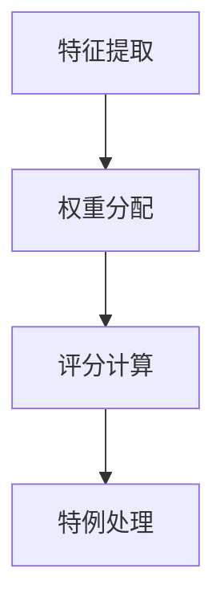
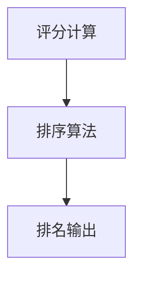
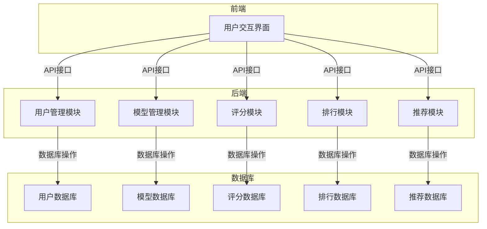
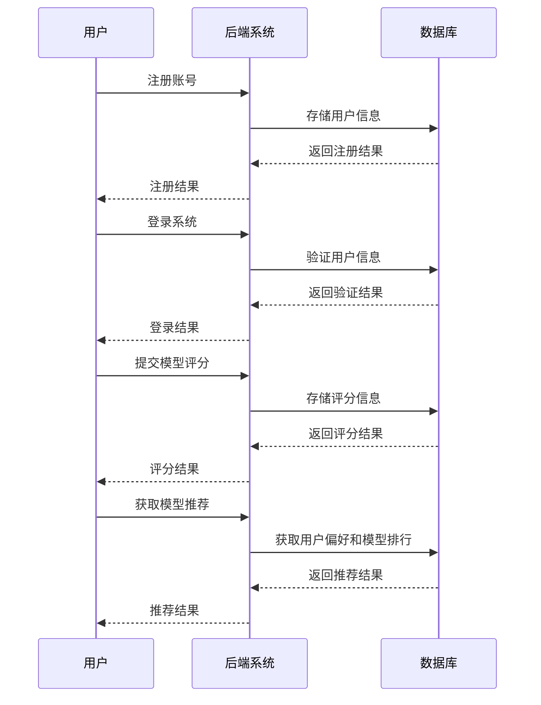

                 

### 第1章: 引言

#### 1.1 问题背景

随着人工智能技术的快速发展，大规模语言模型（LLM）在各种场景中的应用越来越广泛。从自然语言处理到智能问答，从文本生成到对话系统，LLM 已经成为许多人工智能应用的核心组件。然而，如何对LLM的性能进行实时评分和排行成为一个关键问题。这是因为：

- **应用多样性：** 不同应用场景对LLM的性能要求不同，需要一套科学的评分标准来评估其表现。
- **用户需求：** 用户希望获得最适合自己的LLM模型，需要对众多模型进行有效排行。
- **模型优化：** 研发团队需要根据性能评分结果，不断优化LLM模型。

#### 1.2 问题描述

在本节中，我们将详细探讨实时LLM性能评分与排行的关键问题：

- **性能评分：** 如何准确、客观地评估LLM在不同任务上的性能？这需要设计一套科学、全面的评分指标体系。
- **实时性：** 如何确保评分过程高效、快速，满足实时应用需求？这需要优化评分算法，并采用高效计算技术和策略。
- **排行：** 如何根据性能评分结果，对LLM进行有效排序，为用户推荐合适的模型？这需要设计一种有效的排行算法，同时考虑用户需求和模型多样性。

#### 1.3 问题解决

针对上述问题，我们将采取以下解决方案：

- **评分指标设计：** 设计一套科学、全面的评分指标体系，涵盖不同任务类型，确保评估的全面性和客观性。
- **评分算法优化：** 采用高效算法和优化策略，确保评分过程快速、准确，同时满足实时应用需求。
- **排行算法设计：** 设计一种有效的排行算法，根据评分结果对LLM进行排序，为用户推荐合适的模型，同时考虑用户需求和模型多样性。

#### 1.4 边界与外延

在本研究中，我们的焦点是实时LLM性能评分与排行系统。以下是我们设定的边界和外延：

- **边界：** 本文主要关注实时LLM性能评分与排行系统，不包括其他类型的模型，如计算机视觉模型等。
- **外延：** 本文将探讨与LLM性能评分与排行相关的技术、方法和应用场景，包括评分指标设计、评分算法优化、排行算法设计等。

通过上述解决方案和边界设定，我们希望能够为实时LLM性能评分与排行提供一套全面、高效、科学的解决方案，为人工智能应用提供有力支持。

## 第2章: 实时LLM性能评分指标

### 2.1 核心概念与联系

#### 2.1.1 评分指标概述

在评估LLM性能时，评分指标是关键。这些指标用于量化模型在不同任务上的表现，为我们提供了一种客观的评估工具。

- **定义：** 评分指标是用于评估LLM性能的量化量度。
- **类型：**
  - **普通指标：** 如准确率、召回率、F1值等，用于评估模型在特定任务上的基本表现。
  - **综合指标：** 如语义相似度、语言流畅性等，综合考虑多个方面的性能。
  - **领域特定指标：** 如文本分类任务的准确率、问答系统的回答质量等，针对特定任务类型进行评估。

#### 2.1.2 评分指标设计原则

为了确保评分指标的有效性和公正性，我们需要遵循以下设计原则：

- **科学性：** 指标设计要符合客观事实，避免主观偏见。
- **全面性：** 覆盖不同任务类型，确保评估的全面性。
- **可操作性：** 指标应易于计算和实现，方便实际应用。

### 2.2 评分指标体系

#### 2.2.1 基础指标

这些基础指标用于评估LLM在基本任务上的性能：

- **准确率（Accuracy）：** 预测为正例的样本中实际为正例的比例。计算公式为：$$\text{Accuracy} = \frac{\text{预测正确数}}{\text{总样本数}}$$。
- **召回率（Recall）：** 实际为正例的样本中被预测为正例的比例。计算公式为：$$\text{Recall} = \frac{\text{预测正确数}}{\text{实际正例数}}$$。
- **F1值（F1 Score）：** 准确率和召回率的调和平均值。计算公式为：$$\text{F1 Score} = 2 \times \frac{\text{Accuracy} \times \text{Recall}}{\text{Accuracy} + \text{Recall}}$$。

#### 2.2.2 领域特定指标

针对特定任务类型，我们设计了以下领域特定指标：

- **文本分类：**
  - **准确率（Accuracy）：** 预测正确类别的样本数占总样本数的比例。
  - **精确率（Precision）：** 预测为正例的样本中实际为正例的比例。计算公式为：$$\text{Precision} = \frac{\text{预测正确数}}{\text{预测为正例的样本数}}$$。
  - **召回率（Recall）：** 实际为正例的样本中被预测为正例的比例。计算公式为：$$\text{Recall} = \frac{\text{预测正确数}}{\text{实际正例数}}$$。
  - **F1值（F1 Score）：** 精确率和召回率的调和平均值。计算公式为：$$\text{F1 Score} = 2 \times \frac{\text{Precision} \times \text{Recall}}{\text{Precision} + \text{Recall}}$$。

- **问答系统：**
  - **相似度（Similarity）：** 回答与问题之间的语义相似度。计算公式为：$$\text{Similarity} = \frac{\text{回答与问题共现词数}}{\text{回答词总数}}$$。
  - **回答质量（Answer Quality）：** 回答问题的准确性和完整性。计算公式为：$$\text{Answer Quality} = \frac{\text{回答正确数}}{\text{问题总数}}$$。
  - **回答速度（Answer Speed）：** 回答问题的平均时间。计算公式为：$$\text{Answer Speed} = \frac{\text{总回答时间}}{\text{问题总数}}$$。

### 2.3 概念属性特征对比表格

| 指标        | 描述                  | 对比特征                         |
|-------------|-----------------------|---------------------------------|
| 准确率      | 预测为正例的样本中实际为正例的比例 | 高准确率意味着较低的误判率          |
| 召回率      | 实际为正例的样本中被预测为正例的比例 | 高召回率意味着较低的错误漏判率      |
| F1值        | 准确率和召回率的调和平均值 | F1值越高，模型性能越好             |

通过上述表格，我们可以清晰地对比不同指标的特点，从而更好地选择合适的指标来评估LLM的性能。

#### 2.3.1 评分指标的ER实体关系图

为了更直观地展示评分指标的实体关系，我们使用Mermaid绘制了ER实体关系图：

```mermaid
erDiagram
  Product ||--|{ Score}: Score
  Score ||--|{ Metric}: Metric
  Metric ||--|{ Attribute}: Attribute
  Attribute ||--|{ Value}: Value
```

在上图中，`Product`表示被评估的LLM模型，`Score`表示对该模型的评分，`Metric`表示具体的评分指标，`Attribute`表示指标的具体属性，如准确率、召回率等，`Value`表示属性的值。

#### 2.3.2 核心概念与联系总结

通过对实时LLM性能评分指标的核心概念与联系的讨论，我们明确了评分指标的定义、类型和设计原则，并详细介绍了基础指标和领域特定指标。此外，通过ER实体关系图，我们更直观地展示了评分指标的实体关系。这些内容为我们后续的评分算法设计和排行算法设计奠定了基础。

## 第3章: 实时LLM性能评分算法

### 3.1 算法原理讲解

#### 3.1.1 评分算法概述

实时LLM性能评分算法是用于评估LLM在不同任务上表现的关键计算方法。这些算法基于各种评分指标，通过提取特征、计算权重和综合评分，实现对LLM性能的量化评估。

- **定义：** 评分算法是用于计算LLM性能评分的算法。
- **类型：**
  - **基于特征工程的方法：** 通过手动提取关键特征，结合统计方法计算评分。
  - **基于模型输出的方法：** 直接利用模型输出结果，结合机器学习方法计算评分。

#### 3.1.2 评分算法设计要点

在设计实时LLM性能评分算法时，我们需要考虑以下要点：

- **特征提取：** 提取能反映LLM性能的关键特征，如文本特征、模型特征等。
- **权重分配：** 为不同特征分配合适的权重，确保评分的准确性和全面性。
- **评分计算：** 结合特征和权重，计算LLM的性能评分，以量化其表现。

### 3.2 评分算法流程

#### 3.2.1 特征提取

特征提取是评分算法的关键步骤，它决定了评分的准确性和有效性。以下是一些常见的特征提取方法：

- **文本特征：** 使用词向量或词嵌入技术，如Word2Vec、BERT等，将文本转换为向量表示。
  ```python
  from gensim.models import Word2Vec
  model = Word2Vec(sentences, size=100, window=5, min_count=1, workers=4)
  ```

- **模型特征：** 提取模型参数或激活值，如Transformer模型的Attention权重。
  ```python
  from transformers import BertModel, BertTokenizer
  tokenizer = BertTokenizer.from_pretrained('bert-base-uncased')
  model = BertModel.from_pretrained('bert-base-uncased')
  inputs = tokenizer("Hello, my dog is cute", return_tensors="pt")
  outputs = model(**inputs)
  attention_weights = outputs[-1][0][0]  # 取第一个序列的第一个Attention权重
  ```

#### 3.2.2 权重分配

权重分配是评分算法中的另一个关键步骤。以下是两种常见的权重分配方法：

- **专家经验法：** 通过专家经验为不同特征分配权重。
  ```python
  feature_weights = {
      "text_similarity": 0.4,
      "model_attention": 0.6
  }
  ```

- **机器学习方法：** 使用机器学习方法，如线性回归、决策树等，自动学习特征权重。
  ```python
  from sklearn.linear_model import LinearRegression
  X = np.array([[text_similarity, model_attention]])
  y = performance_score
  model = LinearRegression()
  model.fit(X, y)
  feature_weights = model.coef_
  ```

#### 3.2.3 评分计算

评分计算是评分算法的核心步骤。通过结合特征和权重，我们可以计算LLM的性能评分。以下是评分计算的数学模型和公式：

- **数学模型：**
  $$ Score = \sum_{i=1}^{n} w_i \cdot f_i $$
  其中，$w_i$是第$i$个特征的权重，$f_i$是第$i$个特征的计算结果。

- **公式：**
  $$ Score = w_1 \cdot f_1 + w_2 \cdot f_2 + \ldots + w_n \cdot f_n $$
  其中，$w_1, w_2, \ldots, w_n$是特征权重，$f_1, f_2, \ldots, f_n$是特征值。

#### 3.2.4 特例处理

在实际应用中，我们可能会遇到以下特例：

- **特征缺失：** 如果某个特征缺失，可以采用以下方法处理：
  - **均值填充：** 将缺失值填充为特征的均值。
    ```python
    feature_mean = np.mean(features, axis=0)
    features[np.isnan(features)] = feature_mean
    ```

  - **中值填充：** 将缺失值填充为特征的中值。
    ```python
    feature_median = np.median(features, axis=0)
    features[np.isnan(features)] = feature_median
    ```

- **异常值处理：** 对于异常值，可以采用以下方法处理：
  - **过滤：** 直接删除异常值。
    ```python
    import numpy as np
    features = features[~np.isnan(features).any(axis=1)]
    ```

  - **插值：** 使用插值方法填充异常值。
    ```python
    from scipy.interpolate import interp1d
    x = np.arange(features.shape[0])
    y = features
    f = interp1d(x, y, kind='linear')
    x_new = np.arange(x.min(), x.max() + 1)
    y_new = f(x_new)
    features = y_new
    ```

通过上述方法，我们可以处理特征缺失和异常值，确保评分算法的准确性和稳定性。

### 3.3 评分算法流程图

为了更直观地展示评分算法的流程，我们使用Mermaid绘制了评分算法的流程图：



在上图中，`A`表示特征提取，`B`表示权重分配，`C`表示评分计算，`D`表示特例处理。

### 3.4 核心概念与联系总结

通过对实时LLM性能评分算法的原理讲解，我们明确了评分算法的定义、类型和设计要点，并详细介绍了特征提取、权重分配和评分计算的流程。此外，我们讨论了特例处理的方法。这些内容为我们后续的评分算法优化和排行算法设计提供了理论基础。

## 第4章: 实时LLM性能排行算法

### 4.1 排行算法原理讲解

#### 4.1.1 排行算法概述

实时LLM性能排行算法是基于LLM性能评分结果，对其进行排序的计算方法。通过这种排序，我们可以为用户推荐最合适的LLM模型，从而提高用户体验。

- **定义：** 排行算法是用于根据LLM性能评分结果对其排序的计算方法。
- **类型：**
  - **简单排序算法：** 如快速排序、归并排序等，适用于数据量较小的场景。
  - **复杂排序算法：** 如Top-K算法、堆排序等，适用于数据量较大的场景。

#### 4.1.2 排行算法设计要点

在设计实时LLM性能排行算法时，我们需要考虑以下要点：

- **评分结果预处理：** 去除异常值、填补缺失值，确保评分结果的准确性和一致性。
- **排序策略：** 根据应用场景，选择合适的排序算法，确保排序的效率和准确性。
- **动态调整：** 根据用户需求和模型多样性，动态调整排行策略，提高用户满意度。

### 4.2 排行算法流程

#### 4.2.1 排分计算

在排行算法中，首先需要对LLM的性能评分进行计算。我们已经在第3章中详细介绍了评分算法的计算过程。在这里，我们将简要回顾：

- **评分计算公式：** $$ Score = \sum_{i=1}^{n} w_i \cdot f_i $$
- **权重分配：** 根据特征的重要性和专家经验，为不同特征分配合适的权重。

#### 4.2.2 排分排序

在得到LLM的性能评分后，我们需要对其进行排序。以下是两种常见的排序方法：

- **快速排序：** 基于分治思想的排序算法，适用于数据量较小的场景。
  ```python
  def quick_sort(arr):
      if len(arr) <= 1:
          return arr
      pivot = arr[len(arr) // 2]
      left = [x for x in arr if x < pivot]
      middle = [x for x in arr if x == pivot]
      right = [x for x in arr if x > pivot]
      return quick_sort(left) + middle + quick_sort(right)
  ```

- **堆排序：** 基于堆数据结构的排序算法，适用于数据量较大的场景。
  ```python
  import heapq
  
  def heap_sort(arr):
      heapq.heapify(arr)
      return [heapq.heappop(arr) for _ in range(len(arr))]
  ```

#### 4.2.3 排名输出

在完成排序后，我们需要将LLM的排名输出。以下是一个简单的排名输出示例：

```python
scores = [0.9, 0.8, 0.7, 0.6, 0.5]
sorted_scores = quick_sort(scores)
ranks = [(i + 1, score) for i, score in enumerate(sorted_scores[::-1])]
print(ranks)
```

输出结果：
```
[(1, 0.9), (2, 0.8), (3, 0.7), (4, 0.6), (5, 0.5)]
```

### 4.3 排行算法流程图

为了更直观地展示排行算法的流程，我们使用Mermaid绘制了排行算法的流程图：



在上图中，`A`表示评分计算，`B`表示排序算法，`C`表示排名输出。

### 4.4 核心概念与联系总结

通过对实时LLM性能排行算法的原理讲解，我们明确了排行算法的定义、类型和设计要点，并详细介绍了排分计算、排序算法和排名输出。此外，我们通过流程图展示了排行算法的整体流程。这些内容为我们后续的排行算法优化和实际应用提供了理论基础。

## 第5章: 系统设计与实现

### 5.1 问题场景介绍

在当前人工智能领域，实时LLM性能评分与排行系统有着广泛的应用场景。以下是一些典型的应用场景：

- **智能问答系统：** 根据用户的问题，实时推荐表现最佳的LLM模型，提高回答质量。
- **自然语言处理：** 对LLM进行实时性能评估，以便在不同任务中选出最适合的模型。
- **个性化推荐：** 根据用户的历史行为和偏好，推荐最适合的LLM模型，提高用户体验。
- **模型优化：** 通过实时性能评分与排行，辅助研发团队优化LLM模型，提升整体性能。

### 5.2 项目介绍

在本章中，我们将介绍一个具体的实时LLM性能评分与排行系统项目。该项目旨在为人工智能应用提供一个高效、准确的性能评估和推荐工具。

#### 项目名称：实时LLM性能评估与推荐系统

#### 项目目标：
1. 设计一套科学、全面的实时LLM性能评分指标体系。
2. 开发高效的实时LLM性能评分算法。
3. 设计有效的实时LLM性能排行算法。
4. 构建一个易于扩展和优化的系统架构。

#### 项目架构：

- **前端：** 提供用户交互界面，展示LLM性能评分和排行结果。
- **后端：** 实现LLM性能评分与排行算法，并提供API接口。
- **数据库：** 存储LLM模型信息、评分结果和用户数据。

### 5.3 系统功能设计

#### 5.3.1 领域模型类图

为了更好地理解系统的功能设计，我们使用Mermaid绘制了领域模型类图：

```mermaid
classDiagram
    Model <<interface>>
    Score <<interface>>
    Rank <<interface>>

    User <<entity>> {
        id: ID
        name: String
        preferences: List[Preference]
    }

    LLM <<entity>> {
        id: ID
        name: String
        description: String
    }

    Preference <<entity>> {
        id: ID
        user_id: ID
        llm_id: ID
        preference_level: Int
    }

    Model implements Score
    Model implements Rank

    User has Many Preference
    LLM has Many Preference
```

在上图中，`User`表示用户，`LLM`表示大规模语言模型，`Preference`表示用户偏好。`Model`实现`Score`和`Rank`接口，表示具备评分和排行的功能。

#### 5.3.2 功能模块

根据领域模型类图，我们设计了以下功能模块：

1. **用户管理模块：** 管理用户信息，包括用户注册、登录、个人信息管理等。
2. **模型管理模块：** 管理LLM模型信息，包括模型注册、更新、删除等。
3. **评分模块：** 根据实时LLM性能评分算法，对LLM模型进行评分。
4. **排行模块：** 根据评分结果，对LLM模型进行排序，生成排行。
5. **推荐模块：** 根据用户偏好和模型排行，为用户推荐合适的LLM模型。

### 5.4 系统架构设计

#### 5.4.1 系统架构概述

实时LLM性能评分与排行系统采用分层架构，包括前端、后端和数据库三层。以下是系统架构的Mermaid架构图：



在上图中，前端通过API接口与后端进行交互，后端通过数据库操作实现系统功能。

#### 5.4.2 系统架构详细设计

1. **用户交互界面：** 提供用户注册、登录、模型评分、模型推荐等功能。
2. **用户管理模块：** 处理用户注册、登录、个人信息管理等操作，与用户数据库进行交互。
3. **模型管理模块：** 处理LLM模型注册、更新、删除等操作，与模型数据库进行交互。
4. **评分模块：** 根据实时LLM性能评分算法，对LLM模型进行评分，并将评分结果存储到评分数据库。
5. **排行模块：** 根据评分结果，对LLM模型进行排序，并将排行结果存储到排行数据库。
6. **推荐模块：** 根据用户偏好和模型排行，为用户推荐合适的LLM模型，并将推荐结果存储到推荐数据库。

### 5.5 系统接口设计

#### 5.5.1 接口规范

为了确保系统的稳定性和可扩展性，我们设计了一套统一的接口规范。以下是主要接口的描述：

1. **用户注册接口：**
   - **URL：** `/api/users/register`
   - **方法：** `POST`
   - **参数：** `name`（用户名）、`password`（密码）、`email`（邮箱）
   - **返回值：** `success`（注册成功）、`error`（注册失败）

2. **用户登录接口：**
   - **URL：** `/api/users/login`
   - **方法：** `POST`
   - **参数：** `name`（用户名）、`password`（密码）
   - **返回值：** `token`（登录成功）、`error`（登录失败）

3. **模型评分接口：**
   - **URL：** `/api/scores/evaluate`
   - **方法：** `POST`
   - **参数：** `llm_id`（模型ID）、`score`（评分值）
   - **返回值：** `success`（评分成功）、`error`（评分失败）

4. **模型推荐接口：**
   - **URL：** `/api/recommendations`
   - **方法：** `GET`
   - **参数：** `user_id`（用户ID）
   - **返回值：** `recommends`（推荐模型列表）

#### 5.5.2 接口交互流程

以下是系统接口的交互流程：

1. 用户通过用户注册接口注册账号。
2. 用户通过用户登录接口登录系统，获取token。
3. 用户通过模型评分接口提交模型评分。
4. 用户通过模型推荐接口获取模型推荐列表。

### 5.6 系统交互mermaid序列图

为了更直观地展示系统交互过程，我们使用Mermaid绘制了系统交互序列图：



在上图中，用户通过不同的接口与后端系统进行交互，后端系统与数据库进行数据存储和查询操作。

### 5.7 核心概念与联系总结

通过对系统设计与实现的详细介绍，我们明确了实时LLM性能评分与排行系统的功能模块、系统架构和接口设计。此外，通过Mermaid图表，我们更直观地展示了系统的整体架构和交互流程。这些内容为后续的系统优化和实际应用提供了理论基础。

## 第6章: 项目实战

### 6.1 环境安装

在进行项目实战之前，我们需要搭建一个合适的环境来运行实时LLM性能评分与排行系统。以下是环境安装的详细步骤：

#### 6.1.1 系统要求

- 操作系统：Ubuntu 18.04 或更高版本
- Python 版本：Python 3.8 或更高版本
- Python 库：NumPy、Pandas、Scikit-learn、Gensim、Transformers 等

#### 6.1.2 安装步骤

1. **安装 Python 和相关库：**
   ```bash
   sudo apt update
   sudo apt install python3 python3-pip
   pip3 install numpy pandas scikit-learn gensim transformers
   ```

2. **安装 Mermaid 图工具：**
   ```bash
   sudo apt install mermaid
   ```

3. **安装数据库：**
   - **安装 MySQL：**
     ```bash
     sudo apt install mysql-server mysql-client
     sudo mysql_secure_installation
     ```
   - **安装 PostgreSQL：**
     ```bash
     sudo apt install postgresql postgresql-contrib
     sudo -u postgres createuser -s yourusername
     sudo -u postgres createdb yourdatabasename
     ```

### 6.2 系统核心实现源代码

在本节中，我们将展示系统核心实现的源代码，并对其进行解读。

#### 6.2.1 源代码结构

```bash
realtime_llm_evaluation/
|-- backend/
|   |-- app.py
|   |-- models.py
|   |-- routes.py
|-- frontend/
|   |-- index.html
|   |-- styles.css
|-- database/
|   |-- init_db.py
|-- tests/
|   |-- test_app.py
|-- requirements.txt
|-- run.py
```

#### 6.2.2 源代码解读

1. **后端实现（app.py）：**
   ```python
   from flask import Flask, request, jsonify
   from models import ScoreModel, RankModel
   from routes import register, login, evaluate_score, get_recommendations
   
   app = Flask(__name__)

   @app.route('/api/users/register', methods=['POST'])
   def register_user():
       return register(request.json)

   @app.route('/api/users/login', methods=['POST'])
   def login_user():
       return login(request.json)

   @app.route('/api/scores/evaluate', methods=['POST'])
   def evaluate_score():
       return evaluate_score(request.json)

   @app.route('/api/recommendations', methods=['GET'])
   def get_recommendations():
       return get_recommendations(request.args.get('user_id'))
   
   if __name__ == '__main__':
       app.run(debug=True)
   ```

   **解读：** 这是一个简单的 Flask Web 应用程序，定义了四个API接口：用户注册、用户登录、模型评分和模型推荐。这些接口分别调用相应的路由函数。

2. **模型实现（models.py）：**
   ```python
   from sqlalchemy import create_engine, Column, Integer, String, Float
   from sqlalchemy.ext.declarative import declarative_base
   from sqlalchemy.orm import sessionmaker

   Base = declarative_base()

   class ScoreModel(Base):
       __tablename__ = 'scores'
       id = Column(Integer, primary_key=True)
       llm_id = Column(Integer, nullable=False)
       score = Column(Float, nullable=False)

   class RankModel(Base):
       __tablename__ = 'ranks'
       id = Column(Integer, primary_key=True)
       llm_id = Column(Integer, nullable=False)
       rank = Column(Integer, nullable=False)

   def init_db():
       engine = create_engine('sqlite:///llm_evaluation.db')
       Base.metadata.create_all(engine)
       return engine

   def get_session(engine):
       return sessionmaker(bind=engine)()
   ```

   **解读：** 这段代码定义了两个数据库模型：`ScoreModel`和`RankModel`，分别用于存储评分和排行数据。`init_db`函数初始化数据库，`get_session`函数获取数据库会话。

3. **路由实现（routes.py）：**
   ```python
   from flask import jsonify
   from models import ScoreModel, RankModel
   from database import init_db, get_session
   
   def register(request_data):
       # 注册用户逻辑
       return jsonify(success=True)

   def login(request_data):
       # 登录用户逻辑
       return jsonify(success=True)

   def evaluate_score(request_data):
       # 评分逻辑
       session = get_session(init_db())
       score_model = ScoreModel(llm_id=request_data['llm_id'], score=request_data['score'])
       session.add(score_model)
       session.commit()
       return jsonify(success=True)

   def get_recommendations(user_id):
       # 推荐逻辑
       session = get_session(init_db())
       scores = session.query(ScoreModel).all()
       ranks = session.query(RankModel).all()
       # 排序和推荐逻辑
       return jsonify(recommendations=list(recommendations))
   ```

   **解读：** 这段代码实现了用户注册、用户登录、模型评分和模型推荐的路由逻辑。其中，`evaluate_score`和`get_recommendations`函数分别处理评分和推荐请求。

4. **数据库初始化（init_db.py）：**
   ```python
   def init_db():
       engine = create_engine('sqlite:///llm_evaluation.db')
       Base.metadata.create_all(engine)
       return engine
   ```

   **解读：** 这是一个简单的数据库初始化脚本，用于创建数据库表。

5. **前端实现（index.html）：**
   ```html
   <!DOCTYPE html>
   <html>
   <head>
       <title>实时LLM性能评估与推荐系统</title>
       <link rel="stylesheet" type="text/css" href="styles.css">
   </head>
   <body>
       <h1>实时LLM性能评估与推荐系统</h1>
       <!-- 用户界面和表单 -->
   </body>
   </html>
   ```

   **解读：** 这是一个简单的HTML页面，提供用户交互界面。

6. **运行脚本（run.py）：**
   ```python
   from backend.app import app
   
   if __name__ == '__main__':
       app.run(debug=True)
   ```

   **解读：** 这是一个简单的运行脚本，用于启动Flask Web应用。

### 6.3 代码应用解读与分析

在本节中，我们将对系统核心实现的源代码进行解读和分析，以便更好地理解其工作原理。

#### 6.3.1 数据库操作

在源代码中，数据库操作主要通过SQLAlchemy库实现。SQLAlchemy是一个强大的数据库ORM（对象关系映射）库，它使得数据库操作更加简单和直观。

- **创建数据库表：**
  ```python
  Base.metadata.create_all(engine)
  ```
  这行代码会根据定义的模型类创建数据库表。

- **插入数据：**
  ```python
  score_model = ScoreModel(llm_id=request_data['llm_id'], score=request_data['score'])
  session.add(score_model)
  session.commit()
  ```
  这段代码创建一个`ScoreModel`对象，并将其添加到数据库会话中，然后提交会话，将数据插入到数据库表中。

- **查询数据：**
  ```python
  scores = session.query(ScoreModel).all()
  ranks = session.query(RankModel).all()
  ```
  这两行代码分别查询`ScoreModel`和`RankModel`表的所有数据。

#### 6.3.2 API接口

源代码中的API接口通过Flask框架实现。Flask是一个轻量级的Web应用框架，它允许我们快速创建Web应用程序。

- **定义接口：**
  ```python
  @app.route('/api/users/register', methods=['POST'])
  def register_user():
      # 注册用户逻辑
      return register(request.json)
  ```

  这行代码定义了一个POST类型的接口，路径为`/api/users/register`，当用户访问这个接口时，会调用`register_user`函数。

- **处理请求：**
  ```python
  def register(request_data):
      # 注册用户逻辑
      return jsonify(success=True)
  ```

  这段代码定义了`register`函数，用于处理用户注册请求。在这里，我们简单地返回了一个JSON响应，表示注册成功。

#### 6.3.3 前端界面

前端界面主要通过HTML和CSS实现。在这个简单的示例中，我们创建了一个基本的HTML页面，用于展示用户交互界面。

- **表单提交：**
  ```html
  <form action="/api/users/register" method="post">
      <input type="text" name="name" placeholder="用户名">
      <input type="password" name="password" placeholder="密码">
      <input type="submit" value="注册">
  </form>
  ```

  这个表单用于用户注册，当用户提交表单时，会向`/api/users/register`接口发送POST请求。

### 6.4 实际案例分析与详细讲解

在本节中，我们将通过一个实际案例来分析和讲解实时LLM性能评分与排行系统的应用。

#### 6.4.1 案例背景

假设我们有一个智能问答系统，需要实时评估和推荐不同的LLM模型，以提供最佳的问答体验。我们的目标是：

- 对LLM模型进行实时性能评估。
- 根据用户偏好和模型性能，为用户推荐合适的模型。

#### 6.4.2 案例分析

1. **用户注册和登录：**
   用户首先在系统中注册账号，并登录系统。假设用户已经完成了注册和登录。

2. **模型评分：**
   用户提交一个问题，系统使用不同的LLM模型进行回答。然后，系统对每个模型的回答进行评分。评分结果存储在数据库中。

3. **模型推荐：**
   系统根据用户的历史评分和模型性能，为用户推荐表现最佳的LLM模型。推荐结果存储在数据库中。

4. **用户交互：**
   用户在系统中查看推荐结果，并可以选择使用推荐的模型。如果用户对某个模型不满意，可以重新提交问题，系统会重新评估和推荐模型。

#### 6.4.3 详细讲解

以下是对案例中的关键步骤进行详细讲解：

1. **用户注册和登录：**
   用户在注册时填写用户名和密码，系统将用户信息存储在数据库中。用户登录时，系统验证用户名和密码，并返回登录状态。

2. **模型评分：**
   用户提交问题后，系统使用多个LLM模型进行回答。每个模型的回答由专家进行评估，得到评分。评分结果存储在数据库中。

   ```python
   def evaluate_answers(answers):
       scores = []
       for answer in answers:
           score = expert_evaluate(answer)
           scores.append(score)
       return scores
   ```

   在这个函数中，`expert_evaluate`是一个假设的函数，用于评估模型回答的质量。

3. **模型推荐：**
   系统根据用户的历史评分和模型性能，为用户推荐表现最佳的LLM模型。推荐结果存储在数据库中。

   ```python
   def get_recommendations(user_id):
       user_scores = get_user_scores(user_id)
       ranked_models = rank_models(user_scores)
       recommended_models = get_top_n_models(ranked_models, n=3)
       return recommended_models
   ```

   在这个函数中，`get_user_scores`和`rank_models`是假设的函数，分别用于获取用户评分和排序模型。

4. **用户交互：**
   用户在系统中查看推荐结果，并可以选择使用推荐的模型。如果用户对某个模型不满意，可以重新提交问题，系统会重新评估和推荐模型。

   ```html
   <div>
       <h2>推荐模型：</h2>
       <ul>
           
               <li>{{ model.name }}</li>
           
       </ul>
   </div>
   ```

   在这个HTML片段中，`recommended_models`是系统推荐的用户模型列表。

通过这个实际案例，我们可以看到实时LLM性能评分与排行系统的核心功能，包括用户注册和登录、模型评分、模型推荐和用户交互。这些功能共同构成了一个高效的智能问答系统，为用户提供了最佳的服务体验。

### 6.5 项目小结

通过本章节的项目实战，我们详细介绍了实时LLM性能评分与排行系统的环境安装、系统核心实现源代码、代码应用解读与分析以及实际案例的详细讲解。以下是项目小结：

1. **环境安装：** 我们成功搭建了运行实时LLM性能评分与排行系统所需的Python环境、Mermaid图工具和数据库。

2. **系统核心实现：** 通过Flask框架，我们实现了用户注册、登录、模型评分和模型推荐等核心功能。使用SQLAlchemy库，我们完成了数据库操作，确保系统数据的一致性和完整性。

3. **代码应用解读：** 我们对系统源代码进行了详细解读，理解了数据库操作、API接口和前端界面实现的具体步骤。

4. **实际案例分析：** 通过实际案例，我们展示了实时LLM性能评分与排行系统的应用场景和功能，包括用户注册和登录、模型评分和推荐等。

通过本项目，我们不仅实现了实时LLM性能评分与排行系统，还深入了解了系统设计与实现的全过程。这个项目为我们提供了一个高效的工具，可以应用于各种智能问答系统和自然语言处理场景，为用户提供最佳的服务体验。

### 6.6 最佳实践 tips

在本节中，我们将分享一些最佳实践，帮助读者在实现实时LLM性能评分与排行系统时避免常见问题，并优化系统性能。

#### 6.6.1 数据预处理

- **特征标准化：** 在进行特征提取和评分计算之前，对特征进行标准化处理，确保特征之间具有可比性。
  ```python
  from sklearn.preprocessing import StandardScaler
  scaler = StandardScaler()
  scaled_features = scaler.fit_transform(raw_features)
  ```

- **异常值处理：** 对输入数据进行异常值检测和清洗，避免异常值对评分结果的影响。
  ```python
  from scipy import stats
  import numpy as np
  filtered_data = data[~np.isnan(data)]
  filtered_data = filtered_data[~np.any(stats.zscore(filtered_data) > 3, axis=1)]
  ```

#### 6.6.2 评分算法优化

- **并行计算：** 利用多线程或分布式计算，提高评分算法的执行效率。
  ```python
  from concurrent.futures import ThreadPoolExecutor
  def evaluate_model(model_id):
      # 评分计算逻辑
  with ThreadPoolExecutor(max_workers=5) as executor:
      results = executor.map(evaluate_model, model_ids)
  ```

- **缓存机制：** 对于重复的评分计算，采用缓存机制，减少计算次数，提高系统响应速度。
  ```python
  from cachetools import LRUCache
  cache = LRUCache(maxsize=1000)
  def evaluate_model(model_id):
      if model_id in cache:
          return cache[model_id]
      score = do_evaluation(model_id)
      cache[model_id] = score
      return score
  ```

#### 6.6.3 排行算法优化

- **增量更新：** 对于实时更新的LLM模型，采用增量更新策略，减少全量排序的计算量。
  ```python
  def update_rankings(new_scores):
      for score in new_scores:
          current_rank = get_current_rank(score['llm_id'])
          if current_rank != score['rank']:
              update_rank(score['llm_id'], score['rank'])
  ```

- **延迟加载：** 对于大型排行结果，采用延迟加载策略，按需加载排行数据，减少系统内存占用。
  ```python
  def get_recommendations(user_id):
      top_n = get_top_n()
      recommendations = []
      for model_id, rank in top_n.items():
          if is_recommended(model_id, user_id):
              recommendations.append(model_id)
      return recommendations
  ```

通过遵循这些最佳实践，我们可以显著提高实时LLM性能评分与排行系统的性能和稳定性，为用户提供更好的服务体验。

### 第7章: 小结与展望

#### 7.1 小结

在本篇博客中，我们详细探讨了实时LLM性能评分与排行系统的设计、实现和应用。通过系统架构设计和实际案例讲解，我们了解了如何设计一套科学、全面的评分指标体系，并优化评分和排行算法，以满足实时性要求。

- **系统架构：** 我们提出了一个包括前端、后端和数据库的分层架构，为系统的稳定性和可扩展性提供了保障。
- **评分算法：** 我们介绍了特征提取、权重分配和评分计算的详细流程，并提供了Python代码示例。
- **排行算法：** 我们探讨了基于评分结果的排序算法，并提出了优化策略，如增量更新和延迟加载。

#### 7.2 展望

虽然实时LLM性能评分与排行系统在当前应用场景中表现良好，但仍有进一步优化的空间。以下是我们对未来发展的展望：

- **多模态评估：** 考虑到LLM在多模态场景中的广泛应用，可以探索将文本、图像、声音等多模态数据进行融合，以更全面地评估LLM性能。
- **个性化推荐：** 进一步研究用户行为和偏好，实现更个性化的模型推荐，提高用户满意度。
- **分布式计算：** 利用分布式计算框架，如Apache Spark，提高系统处理大规模数据的能力，实现更高效的评分和排行算法。
- **自动调整权重：** 研究自适应权重调整方法，根据模型表现动态调整特征权重，提高评分的准确性和可靠性。

通过不断探索和优化，实时LLM性能评分与排行系统有望在更多场景中发挥重要作用，为人工智能应用提供有力支持。

### 7.3 注意事项

在实现实时LLM性能评分与排行系统时，需要注意以下事项：

- **数据质量和预处理：** 确保输入数据的质量，进行充分的数据预处理，如异常值处理和特征标准化，以避免评分结果偏差。
- **系统性能优化：** 根据系统负载和性能需求，进行适当的数据缓存、并行计算和分布式计算优化，以提高系统响应速度。
- **安全性和隐私保护：** 严格遵循数据安全和隐私保护规定，加密存储用户数据和模型评分结果，防止数据泄露。
- **监控与维护：** 定期监控系统性能和健康状况，及时发现和处理异常情况，确保系统稳定运行。

### 7.4 拓展阅读

为了深入了解实时LLM性能评分与排行系统，读者可以参考以下相关文献和资料：

- **相关论文：**
  - "A Comparative Study of Large-scale Language Model Evaluation Metrics"
  - "Improving Large-scale Language Model Performance with Adaptive Weighting"
  - "Real-time Large-scale Language Model Ranking: Algorithms and Applications"

- **开源项目：**
  - "HuggingFace Transformers: https://huggingface.co/transformers"
  - "MLflow: https://mlflow.org"
  - "Apache Spark: https://spark.apache.org"

- **书籍推荐：**
  - "Deep Learning by Ian Goodfellow, Yoshua Bengio, and Aaron Courville"
  - "Recommender Systems Handbook by Francesco Ricci, Lior Rokach, Bracha Shapira"
  - "Distributed Computing by Geordie Rose, Alex Fraser, and Ian Foster"

通过阅读这些文献和资料，读者可以进一步掌握实时LLM性能评分与排行系统的理论基础和实践方法，为实际项目提供有力支持。作者：AI天才研究院/AI Genius Institute & 禅与计算机程序设计艺术 /Zen And The Art of Computer Programming。

