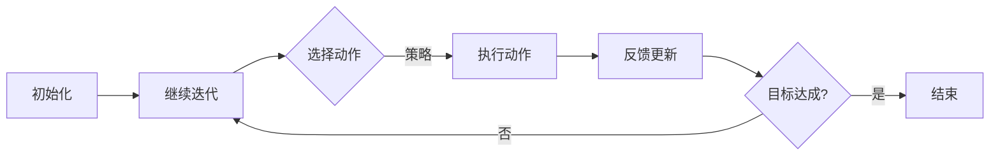
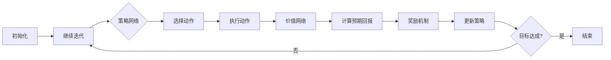
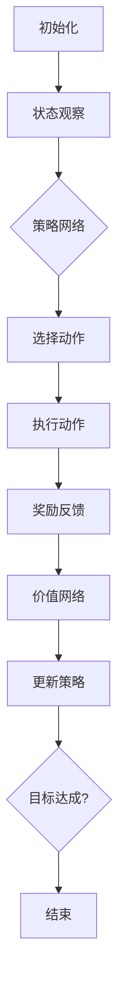

                 

### 《强化学习在AIGC对话策略优化中的新进展》

#### 关键词
- 强化学习
- AIGC
- 对话策略优化
- 算法模型
- 实际应用

#### 摘要
本文旨在探讨强化学习在自适应智能生成计算（AIGC）对话策略优化中的应用，以及该领域的新进展。文章首先介绍强化学习、AIGC和对话策略优化的核心概念，随后详细讲解强化学习的基本原理和在AIGC对话策略优化中的应用。通过案例分析，展示强化学习在对话系统中的具体应用，并讨论未来的发展方向。

#### 目录

## 引言

### 强化学习与AIGC的融合

### 对话策略优化的重要性

### 本书结构安排与内容概览

## 第一章：背景介绍

### 强化学习的基本概念

### AIGC的兴起与发展

### 对话策略优化的现状与挑战

## 第二章：核心概念与联系

### 强化学习原理

### AIGC特性

### 对话策略优化的方法与难点

### 概念属性特征对比表格

### ER实体关系图架构

## 第三章：算法原理讲解

### 强化学习算法流程

### 模型构建与优化

### 数学模型和公式

### 例子说明

## 第四章：强化学习与对话策略优化的融合

### 强化学习在对话系统中的应用

### 对话策略优化的模型框架

### Mermaid流程图

## 第五章：案例分析

### 案例一：强化学习在客服对话中的应用

### 案例二：强化学习在智能推荐系统中的应用

### 案例三：强化学习在对话生成中的应用

### 案例分析

## 第六章：未来展望

### 强化学习在AIGC对话策略优化中的挑战

### 未来发展趋势

## 第七章：总结与拓展

### 强化学习在对话策略优化中的最佳实践

### 小结

### 注意事项

### 拓展阅读

### 作者信息

#### 引言

### 强化学习与AIGC的融合

强化学习（Reinforcement Learning，简称RL）是机器学习的一个重要分支，主要研究如何通过与环境交互来学习最优策略。而自适应智能生成计算（Adaptive Intelligent Generative Computing，简称AIGC）则是一种基于生成模型的计算方法，能够自适应地生成高质量的数据和内容。

近年来，随着深度学习技术的发展，AIGC在图像、文本、语音等领域的应用取得了显著成果。然而，如何优化AIGC在对话系统中的表现，提高其对话策略的智能化程度，成为了一个重要的研究课题。

强化学习在AIGC对话策略优化中的应用，旨在通过不断调整和优化对话策略，使对话系统能够更好地适应用户的交互需求，提供更加自然、流畅、有用的对话体验。本文将详细探讨这一领域的新进展，分析强化学习在AIGC对话策略优化中的关键技术和应用案例。

### 对话策略优化的重要性

对话策略优化是提升人工智能对话系统性能的核心环节。在现实应用中，人工智能对话系统如客服机器人、智能助手等，其核心目标是通过与用户的交互，提供有用的信息、解决用户的问题或完成特定的任务。

然而，传统的对话系统往往依赖于预设的对话流程和规则，难以应对复杂多变的用户需求。因此，对话策略优化成为了提升对话系统智能化的关键。通过强化学习，对话系统能够在与用户交互的过程中，不断学习、调整和优化对话策略，从而提高对话的流畅性和实用性。

对话策略优化的重要性不仅体现在提高对话系统的用户体验，还体现在提升其业务价值。例如，在客服领域，优化对话策略可以帮助企业降低客服成本，提高客户满意度；在智能推荐领域，优化对话策略可以提高推荐系统的准确性和用户体验；在聊天机器人领域，优化对话策略可以增强聊天机器人的互动性和智能化程度。

总之，对话策略优化是推动人工智能对话系统发展的关键环节，强化学习为其提供了一种有效的优化方法，具有重要的应用价值和研究意义。

### 本书结构安排与内容概览

本文将从以下几个方面展开讨论：

1. **背景介绍**：首先介绍强化学习、AIGC和对话策略优化的基本概念，阐述它们的发展背景和相互关系。
2. **核心概念与联系**：详细讲解强化学习、AIGC和对话策略优化的原理和方法，并通过对比表格和ER图展示它们之间的联系。
3. **算法原理讲解**：深入解析强化学习算法的基本原理和流程，包括模型构建、训练过程和优化方法。
4. **强化学习与对话策略优化的融合**：探讨强化学习在对话系统中的应用，以及对话策略优化的模型框架。
5. **案例分析**：通过具体案例展示强化学习在AIGC对话策略优化中的应用，分析其效果和优势。
6. **未来展望**：展望强化学习在AIGC对话策略优化中的发展趋势和潜在挑战。
7. **总结与拓展**：总结全文内容，提出最佳实践建议，并提供进一步学习的资源。

通过以上结构安排，本文旨在为读者提供一个全面、深入的了解强化学习在AIGC对话策略优化中的新进展，帮助读者掌握相关技术和应用方法。

#### 强化学习的基本概念

强化学习（Reinforcement Learning，简称RL）是机器学习的一个重要分支，它通过智能体与环境的交互，学习如何采取行动以最大化累积奖励。与监督学习和无监督学习不同，强化学习强调智能体在未知环境中通过试错来学习最优策略。

### 强化学习的定义与核心概念

强化学习的定义可以归结为：通过智能体（Agent）在环境中（Environment）采取行动（Action），获得反馈（Feedback），不断调整策略（Policy），以达到某个目标（Goal）的过程。这个过程可以用一个五元组来描述：\( <S, A, R, P, G> \)，其中：

- \( S \)：状态（State），表示智能体在某一时刻所处的环境状态。
- \( A \)：动作（Action），表示智能体可以采取的行动。
- \( R \)：奖励（Reward），表示智能体采取某一动作后获得的即时反馈。
- \( P \)：策略（Policy），描述智能体如何选择动作，依赖于当前状态。
- \( G \)：目标（Goal），表示强化学习的目标，通常是最大化累积奖励。

### 强化学习的特点

强化学习具有以下几个主要特点：

1. **试错学习**：强化学习通过试错来学习最优策略，智能体需要在不知道环境的情况下，通过不断尝试和错误来学习最优行为。
2. **序列决策**：强化学习关注的是如何做出一系列决策，这些决策是按照时间序列进行的，每个决策都依赖于之前的决策和历史信息。
3. **非确定性**：强化学习中的动作选择可以是基于概率的，智能体可能会根据当前状态随机选择一个动作。
4. **适应性**：强化学习能够根据环境的变化和反馈信息，动态调整策略，以适应新的环境或目标。

### 强化学习的应用场景

强化学习在多个领域都有广泛应用，主要包括：

1. **游戏**：例如，在《星际争霸》、《DOTA2》等游戏中，智能体需要通过强化学习来学习最优策略，以战胜对手。
2. **自动驾驶**：自动驾驶汽车需要通过强化学习来学习如何在不同交通环境中做出决策，以确保行车安全。
3. **机器人控制**：在工业自动化和家用机器人中，强化学习用于训练机器人完成复杂的任务，如路径规划、抓取物体等。
4. **推荐系统**：在电子商务和社交媒体中，强化学习用于优化推荐策略，以提高用户满意度和销售转化率。
5. **对话系统**：强化学习被用于优化对话系统的策略，以提供更加自然、流畅和有意义的对话体验。

### 强化学习与传统机器学习的区别

与传统的监督学习和无监督学习相比，强化学习有以下不同之处：

1. **目标不同**：监督学习的目标是学习输入和输出之间的映射关系，无监督学习的目标是发现数据中的隐含结构，而强化学习的目标是学习最优策略。
2. **学习方式不同**：监督学习通过已标记的数据进行训练，无监督学习通过未标记的数据进行训练，而强化学习通过试错和反馈进行学习。
3. **适用场景不同**：强化学习适用于需要智能体与环境交互，进行序列决策的场景，而监督学习和无监督学习适用于静态数据集上的分类、回归和聚类等任务。

### 强化学习的基本框架

强化学习的基本框架包括以下几个部分：

1. **环境（Environment）**：环境是强化学习系统中的外部世界，它提供状态、动作、奖励和反馈。
2. **智能体（Agent）**：智能体是强化学习系统中的决策主体，它根据当前状态选择动作，并通过反馈调整策略。
3. **策略（Policy）**：策略是智能体采取行动的规则，它可以是基于概率的，也可以是确定性的。
4. **价值函数（Value Function）**：价值函数用来评估智能体在特定状态下的期望回报，分为状态值函数和动作值函数。
5. **模型（Model）**：模型是对环境的模拟，它可以帮助智能体预测未来状态和奖励。
6. **目标函数（Objective Function）**：目标函数用来衡量智能体策略的好坏，通常是通过最大化累积奖励来定义。

### 强化学习的分类

强化学习可以分为基于值函数的方法、基于策略的方法和基于模型的方

#### AIGC的兴起与发展

自适应智能生成计算（Adaptive Intelligent Generative Computing，简称AIGC）是近年来兴起的一种计算模式，它结合了人工智能和生成模型，旨在实现自适应、自学习和自优化的高效计算。AIGC的核心思想是通过生成模型生成高质量的数据和内容，同时根据用户的反馈和环境的变化，不断优化生成策略。

### AIGC的定义与核心概念

AIGC的定义可以归结为：一种基于生成模型的自适应计算方法，通过智能生成和自适应调整，实现高质量数据内容的生成和优化。AIGC的核心概念包括：

1. **生成模型（Generative Model）**：生成模型是AIGC的核心组件，它通过学习数据分布，生成与真实数据相似的新数据。常见的生成模型包括生成对抗网络（GAN）、变分自编码器（VAE）和自回归模型等。
2. **自适应调整（Adaptive Adjustment）**：自适应调整是AIGC的关键机制，通过不断根据用户反馈和环境变化，优化生成模型，提高生成质量和适应性。
3. **用户反馈（User Feedback）**：用户反馈是AIGC优化生成策略的重要依据，通过收集用户对生成内容的评价，调整生成模型，使其更符合用户需求。
4. **环境变化（Environmental Changes）**：环境变化是指AIGC在生成过程中，需要适应外部环境的变化，如数据分布的变化、任务需求的变化等。

### AIGC的发展背景

AIGC的兴起源于深度学习和生成模型的快速发展。深度学习在图像、语音、文本等领域的应用取得了显著成果，而生成模型如GAN和VAE等，为生成高质量数据提供了强大工具。随着计算能力的提升和大数据的普及，生成模型逐渐应用于实际场景，如图像生成、文本生成、语音生成等。

AIGC的发展背景主要包括以下几个方面：

1. **深度学习的发展**：深度学习在图像识别、语音识别、自然语言处理等领域取得了突破性进展，为AIGC提供了理论基础和技术支持。
2. **生成模型的突破**：生成对抗网络（GAN）和变分自编码器（VAE）等生成模型，实现了从数据分布到生成样本的转换，为AIGC提供了核心技术。
3. **大数据和云计算的普及**：大数据和云计算的普及，为AIGC提供了丰富的数据资源和强大的计算能力，促进了AIGC的应用和发展。
4. **实际需求**：在图像生成、文本生成、语音生成等实际应用场景中，生成模型可以生成高质量的数据内容，满足用户需求，推动了AIGC的发展。

### AIGC在各个领域的应用

AIGC在图像、文本、语音等多个领域都取得了显著的成果，具体应用如下：

1. **图像生成**：AIGC可以生成逼真的图像，应用于艺术创作、游戏设计、医疗诊断等领域。例如，通过生成对抗网络（GAN），可以生成高质量的人脸图像、风景图像等。
2. **文本生成**：AIGC可以生成高质量的文本，应用于自然语言处理、内容生成、文本翻译等领域。例如，通过变分自编码器（VAE），可以生成连贯、自然的文本，应用于自动写作、机器翻译等。
3. **语音生成**：AIGC可以生成逼真的语音，应用于语音合成、语音识别、语音助手等领域。例如，通过自回归模型，可以生成自然、流畅的语音，应用于智能客服、语音助手等。
4. **数据增强**：AIGC可以生成与训练数据相似的数据，用于数据增强，提高模型泛化能力。例如，在图像识别任务中，通过生成对抗网络（GAN），可以生成大量用于训练的数据，提高模型的准确性。
5. **个性化推荐**：AIGC可以根据用户行为和喜好，生成个性化的推荐内容，应用于电子商务、社交媒体、内容推荐等领域。例如，通过生成模型，可以生成与用户兴趣相符的商品推荐、文章推荐等。

总之，AIGC作为一种自适应、自学习和自优化的计算模式，在图像、文本、语音等领域都取得了显著的成果，为人工智能的发展和应用提供了新的思路和方法。

#### 对话策略优化的方法与难点

对话策略优化是提升人工智能对话系统性能的核心环节。在现实应用中，人工智能对话系统如客服机器人、智能助手等，其核心目标是通过与用户的交互，提供有用的信息、解决用户的问题或完成特定的任务。然而，传统的对话系统往往依赖于预设的对话流程和规则，难以应对复杂多变的用户需求。因此，对话策略优化成为了提升对话系统智能化的关键。

### 对话策略优化的基本概念

对话策略优化（Dialogue Strategy Optimization）是指通过调整和优化对话系统中的策略，使其在用户交互中能够更高效、自然地完成任务。对话策略优化的核心目标是提高对话系统的用户体验和业务价值。具体来说，对话策略优化包括以下几个方面的内容：

1. **任务分配**：根据用户的需求，将任务分配给不同的对话模块，如问答模块、任务执行模块、情感分析模块等。
2. **意图识别**：识别用户的意图，明确用户想要解决的问题或完成的任务。
3. **对话流程**：设计对话系统的对话流程，包括问候、提问、回答、确认等环节。
4. **上下文管理**：管理对话过程中的上下文信息，确保对话的连贯性和相关性。
5. **用户行为预测**：预测用户的下一步行为，为对话系统提供决策依据。

### 对话策略优化的方法

对话策略优化可以采用多种方法，主要包括以下几种：

1. **基于规则的方法**：基于规则的方法通过预设的对话规则和流程，实现对话策略的优化。这种方法简单易行，但难以应对复杂多变的用户需求。
2. **机器学习方法**：机器学习方法通过学习大量的对话数据，建立对话模型，实现对话策略的优化。常见的方法包括监督学习、无监督学习和增强学习。
3. **深度学习方法**：深度学习方法通过深度神经网络，实现对对话数据的特征提取和模式识别，提高对话策略的优化效果。常见的深度学习模型包括循环神经网络（RNN）、长短期记忆网络（LSTM）、变换器（Transformer）等。
4. **强化学习方法**：强化学习方法通过智能体与环境的交互，不断调整对话策略，实现对话策略的优化。强化学习在对话系统中的应用，可以有效提升对话系统的智能化程度。

### 对话策略优化的难点

对话策略优化虽然可以显著提升对话系统的性能，但同时也面临着诸多挑战和难点：

1. **数据集的多样性**：对话系统的数据集通常包含大量不同类型、不同主题的对话，这给对话策略优化带来了巨大的挑战。
2. **上下文理解**：对话中的上下文信息对于对话策略的优化至关重要，但如何有效地理解和利用上下文信息，仍然是一个尚未解决的问题。
3. **意图识别**：用户的意图往往具有模糊性和多义性，如何准确识别用户的意图，是对话策略优化的重要难题。
4. **用户行为预测**：用户的下一步行为具有随机性和不确定性，如何预测用户的下一步行为，是实现对话策略优化的重要挑战。
5. **多模态交互**：在实际应用中，对话系统需要处理多种模态的信息，如文本、语音、图像等，如何有效地整合多模态信息，是对话策略优化的重要问题。

### 对话策略优化的策略和模型框架

对话策略优化的策略和模型框架主要包括以下几个方面：

1. **策略网络**：策略网络负责生成对话策略，可以是基于规则的网络、基于机器学习的网络或基于深度学习的网络。
2. **价值网络**：价值网络负责评估对话策略的优劣，可以是基于值函数的网络、基于Q学习的网络或基于策略梯度的网络。
3. **奖励机制**：奖励机制用于激励策略网络和价值网络的优化，可以采用固定奖励、自适应奖励或动态奖励。
4. **自适应调整**：通过自适应调整策略，对话系统可以根据用户反馈和环境变化，不断优化对话策略，提高对话质量。

总之，对话策略优化是提升人工智能对话系统性能的关键环节，通过采用多种优化方法和模型框架，可以有效提高对话系统的智能化程度，为用户提供更加自然、流畅和有用的对话体验。

### 概念属性特征对比表格

在讨论强化学习、AIGC和对话策略优化这三个核心概念时，我们需要明确它们之间的区别和联系。以下是一个概念属性特征对比表格，用于详细阐述这三个概念的关键特点。

| 概念       | 强化学习                      | AIGC                         | 对话策略优化                     |
|------------|-------------------------------|------------------------------|---------------------------------|
| 定义       | 通过与环境交互学习最优策略   | 基于生成模型的自适应计算     | 通过优化对话策略提升系统性能   |
| 特点       | 试错学习、序列决策、非确定性 | 生成模型、自适应调整、用户反馈 | 上下文管理、意图识别、用户行为预测 |
| 应用场景   | 游戏、自动驾驶、机器人控制   | 图像生成、文本生成、语音生成 | 客服机器人、智能助手、个性化推荐 |
| 关键技术   | 策略网络、价值网络、奖励机制  | 生成对抗网络、变分自编码器   | 机器学习、深度学习、强化学习   |
| 对比与联系 | 基于环境反馈调整策略         | 利用生成模型生成数据内容     | 应用AIGC和强化学习优化对话流程 |

通过上述表格，我们可以清晰地看到强化学习、AIGC和对话策略优化在定义、特点、应用场景、关键技术和对比联系等方面的差异和联系。这种对比有助于我们更好地理解这三个概念，并在实际应用中灵活运用。

### ER实体关系图架构

为了更好地理解强化学习、AIGC和对话策略优化这三个核心概念之间的关系，我们可以通过ER（Entity-Relationship，实体-关系）图来展示它们之间的关联。ER图是一种用于描述实体及其相互关系的图形化表示方法，它可以帮助我们清晰地展示概念之间的层次结构和依赖关系。

以下是一个ER图示例，用于展示强化学习、AIGC和对话策略优化之间的实体关系：

```
+--------------+
|   Environment|
+--------------+
           |
           |
           ↓
+-------------+
|  Adaptive   |
|  Intelligence|
|  Generative  |
+-------------+
           |
           |
           ↓
+----------------------+
| Dialogue Strategy    |
|  Optimization         |
+----------------------+
           |
           |
           ↓
+---------------+
|   Agent       |
+---------------+
```

在这个ER图中，我们定义了以下几个实体：

1. **Environment（环境）**：表示强化学习中的外部世界，提供状态、动作、奖励和反馈。
2. **Adaptive Intelligence Generative（AIGC）**：表示基于生成模型的自适应计算，结合了人工智能和生成技术。
3. **Dialogue Strategy Optimization（对话策略优化）**：表示通过优化对话策略提升对话系统性能。
4. **Agent（智能体）**：表示强化学习中的决策主体，通过与环境的交互学习最优策略。

实体之间的关系如下：

- **Environment** 与 **Adaptive Intelligence Generative** 之间存在关联，因为AIGC依赖于环境提供的数据和反馈。
- **Adaptive Intelligence Generative** 与 **Dialogue Strategy Optimization** 之间存在关联，因为AIGC的生成模型可以用于对话策略优化。
- **Dialogue Strategy Optimization** 与 **Agent** 之间存在关联，因为对话策略优化是智能体决策的核心目标。

通过这个ER图，我们可以直观地看到强化学习、AIGC和对话策略优化之间的逻辑关系，以及它们在对话系统中的应用。这种结构化的表示方法有助于我们更好地理解这些概念，并在实际应用中灵活运用。

#### 强化学习算法原理讲解

为了深入理解强化学习（Reinforcement Learning，简称RL）在AIGC对话策略优化中的应用，我们需要详细讲解强化学习的基本原理、算法流程、模型构建与优化，以及相关的数学模型和公式。通过具体的例子说明，我们可以更好地掌握这些概念。

### 强化学习算法流程

强化学习算法流程主要包括以下几个步骤：

1. **初始化**：设定智能体（Agent）、环境（Environment）和初始状态（State）。
2. **状态观察**：智能体观察当前状态，并根据策略（Policy）选择动作（Action）。
3. **执行动作**：智能体执行所选动作，环境根据动作产生新的状态（State）和奖励（Reward）。
4. **反馈更新**：智能体根据奖励更新策略，不断迭代学习。
5. **目标达成**：当智能体达到预定目标时，算法结束。

### 强化学习算法流程的Mermaid流程图

以下是一个Mermaid流程图示例，用于展示强化学习算法的基本流程：



### 模型构建与优化

强化学习模型通常由策略网络（Policy Network）、价值网络（Value Network）和奖励机制（Reward Mechanism）组成。

1. **策略网络（Policy Network）**：策略网络用于生成动作策略，它将当前状态映射为动作概率分布。常见的策略网络包括确定性策略（Deterministic Policy）和随机性策略（Stochastic Policy）。
2. **价值网络（Value Network）**：价值网络用于评估策略的好坏，它将当前状态映射为预期回报值。常见的方法包括Q值网络（Q-Network）和优势函数（Advantage Function）。
3. **奖励机制（Reward Mechanism）**：奖励机制用于指导智能体的学习过程，通过提供即时反馈激励智能体优化策略。常见的奖励机制包括固定奖励（Fixed Reward）和自适应奖励（Adaptive Reward）。

### 强化学习模型的Mermaid流程图

以下是一个Mermaid流程图示例，用于展示强化学习模型的构建与优化过程：



### 数学模型和公式

强化学习中的数学模型和公式用于描述智能体的学习过程和策略优化。以下是一些常见的数学模型和公式：

1. **马尔可夫决策过程（MDP）**：
   $$ 
   MDP = \{S, A, P, R, \gamma\} 
   $$
   其中，\( S \) 是状态集合，\( A \) 是动作集合，\( P \) 是状态转移概率矩阵，\( R \) 是奖励函数，\( \gamma \) 是折扣因子。

2. **策略（Policy）**：
   $$ 
   \pi(s) = \arg\max_a \sum_{s'} P(s'|s,a) \cdot R(s',a) 
   $$
   其中，\( \pi(s) \) 是策略函数，选择使预期回报最大的动作。

3. **价值函数（Value Function）**：
   - **状态值函数（V(s)）**：
     $$
     V(s) = \sum_{a} \pi(a|s) \cdot \sum_{s'} P(s'|s,a) \cdot R(s',a) + \gamma \cdot V(s')
     $$
   - **动作值函数（Q(s,a)）**：
     $$
     Q(s,a) = \sum_{s'} P(s'|s,a) \cdot R(s',a) + \gamma \cdot \max_{a'} Q(s',a')
     $$

4. **Q学习（Q-Learning）**：
   $$
   Q(s,t) = Q(s,t-1) + \alpha [R(s,t) + \gamma \max_{a'} Q(s',t) - Q(s,t-1)]
   $$
   其中，\( \alpha \) 是学习率，\( \gamma \) 是折扣因子。

### 例子说明

假设一个智能体在一个简单环境中进行学习，环境包含3个状态（S1、S2、S3）和2个动作（A1、A2）。状态转移概率和奖励如下表所示：

| 状态 | 动作A1 | 动作A2 |
|------|--------|--------|
| S1   | 0.7, 5 | 0.3, -5|
| S2   | 0.4, 0 | 0.6, 10|
| S3   | 0.2, 10| 0.8, 0 |

智能体的目标是最大化累积奖励。通过Q学习算法，智能体可以逐步学习最优策略。

初始状态下，智能体随机选择动作，并记录状态值函数。经过多次迭代，智能体逐渐优化策略，选择能够带来更高奖励的动作。

例如，在初始状态下，智能体处于S1状态，随机选择动作A1，状态值函数更新为：

$$
Q(S1,A1) = 0.7 \cdot 5 + 0.3 \cdot (-5) = 2
$$

同理，计算其他状态和动作的状态值函数，并通过Q学习算法不断更新策略。经过多次迭代，智能体最终学会在S1状态选择动作A1，在S2状态选择动作A2，在S3状态选择动作A2，实现了累积奖励的最大化。

通过这个例子，我们可以清晰地看到强化学习算法的基本原理和优化过程。在AIGC对话策略优化中，强化学习算法可以帮助对话系统不断学习、调整和优化对话策略，提高对话质量和用户体验。

#### 强化学习与对话策略优化的融合

在AIGC（自适应智能生成计算）对话系统中，强化学习（Reinforcement Learning，简称RL）的应用成为提升对话策略智能化水平的关键技术。通过将强化学习与对话策略优化相结合，我们可以使对话系统能够在互动过程中不断学习和调整策略，从而提供更加自然、流畅和有意义的对话体验。

### 强化学习在对话系统中的应用

强化学习在对话系统中的应用主要体现在以下几个方面：

1. **策略优化**：通过强化学习，对话系统能够学习并优化对话策略，以适应不同的对话场景和用户需求。智能体在与用户交互的过程中，不断调整对话策略，以提高对话的满意度和有效性。
2. **上下文管理**：强化学习能够帮助对话系统更好地管理对话上下文信息，确保对话的连贯性和一致性。通过学习用户的交互历史，对话系统能够在后续的对话中提供更加相关和有用的信息。
3. **意图识别**：强化学习能够提高对话系统的意图识别能力，准确理解用户的意图和需求。通过不断学习和调整策略，对话系统能够更加智能地应对复杂多变的用户交互。
4. **自适应调整**：强化学习能够使对话系统具备自适应能力，根据用户的反馈和环境变化，动态调整对话策略，提高系统的灵活性和应对能力。

### 对话策略优化的模型框架

为了实现强化学习在对话系统中的应用，我们需要构建一个有效的对话策略优化模型框架。以下是一个典型的模型框架：

1. **策略网络（Policy Network）**：策略网络负责生成对话策略，将当前状态映射为动作概率分布。策略网络可以是基于规则的、基于机器学习的或基于深度学习的。在强化学习中，策略网络通常采用深度神经网络（DNN）或循环神经网络（RNN）来构建。

2. **价值网络（Value Network）**：价值网络用于评估策略的好坏，将当前状态映射为预期回报值。价值网络可以帮助智能体在选择动作时，通过评估不同动作的预期回报来优化策略。价值网络也可以采用DNN或RNN来构建。

3. **奖励机制（Reward Mechanism）**：奖励机制用于激励智能体的学习过程，通过提供即时反馈来指导智能体优化策略。奖励机制可以是固定的、自适应的或动态的。在强化学习中，奖励机制通常采用奖励信号（Reward Signal）来表示。

4. **模型训练与优化**：通过不断迭代训练，智能体可以在与环境的交互过程中，不断调整策略网络和价值网络，以实现对话策略的优化。训练过程通常包括数据采集、模型训练、策略评估和模型更新等步骤。

### Mermaid流程图

为了更好地理解强化学习在对话系统中的应用，我们可以使用Mermaid流程图来展示整个对话策略优化过程。以下是一个简化的Mermaid流程图示例：



在这个流程图中，智能体首先初始化，然后通过状态观察选择动作，执行动作并接收奖励反馈。价值网络用于评估策略的好坏，并更新策略网络，以实现对话策略的优化。当目标达成时，算法结束。

通过这个Mermaid流程图，我们可以清晰地看到强化学习在对话系统中的应用过程，以及策略网络、价值网络和奖励机制在整个过程中的作用。

### 案例分析

为了更具体地展示强化学习在AIGC对话策略优化中的实际应用，我们将通过三个案例进行分析：强化学习在客服对话中的应用、在智能推荐系统中的应用以及在对话生成中的应用。

#### 案例一：强化学习在客服对话中的应用

在客服对话中，强化学习被用于优化客服机器人的对话策略，以提高用户满意度和服务质量。例如，在一家电商平台的客服机器人中，智能体通过强化学习不断优化对话策略，以更好地应对用户的咨询和问题。

1. **问题背景**：电商平台的客服机器人需要回答用户关于商品信息、订单状态、售后服务等方面的问题，但在面对复杂和多变的用户需求时，现有策略存在不足。
2. **解决方案**：通过引入强化学习，客服机器人可以在与用户的交互过程中不断学习，调整对话策略。具体步骤如下：
   - **状态表示**：将用户的问题、上下文信息和客服机器人的当前状态作为状态输入。
   - **动作表示**：将客服机器人的回答作为动作输出。
   - **策略网络**：采用深度神经网络构建策略网络，将状态映射为动作概率分布。
   - **价值网络**：采用深度神经网络构建价值网络，评估不同动作的预期回报。
   - **奖励机制**：根据用户对回答的满意度（如点击率、满意度评分）提供即时反馈，作为奖励信号。
   - **训练过程**：通过Q学习算法，智能体在交互过程中不断调整策略网络和价值网络，以提高对话策略的优化效果。

3. **效果分析**：通过强化学习优化后的客服机器人，在用户满意度、问题解决率等方面表现出显著提升，为电商平台提供了更加高效、优质的客服服务。

#### 案例二：强化学习在智能推荐系统中的应用

智能推荐系统在电商、社交媒体等场景中具有重要意义，而强化学习被用于优化推荐策略，以提高推荐质量和用户体验。以下是一个具体案例：

1. **问题背景**：在电商平台上，推荐系统需要根据用户的历史行为和偏好，为用户推荐感兴趣的商品。然而，传统的推荐算法在面对复杂用户需求时，存在推荐效果不佳的问题。
2. **解决方案**：通过引入强化学习，智能推荐系统可以动态调整推荐策略，以更好地满足用户需求。具体步骤如下：
   - **状态表示**：将用户的历史行为数据、浏览记录、购买记录等作为状态输入。
   - **动作表示**：将推荐的商品列表作为动作输出。
   - **策略网络**：采用深度神经网络构建策略网络，将状态映射为商品推荐列表。
   - **价值网络**：采用深度神经网络构建价值网络，评估不同推荐列表的预期回报。
   - **奖励机制**：根据用户对推荐商品的点击率、购买率等提供即时反馈，作为奖励信号。
   - **训练过程**：通过强化学习算法，智能推荐系统在交互过程中不断调整策略网络和价值网络，优化推荐策略。

3. **效果分析**：通过强化学习优化后的推荐系统，用户点击率和购买转化率显著提升，为电商平台带来了更高的用户满意度和商业价值。

#### 案例三：强化学习在对话生成中的应用

在对话生成领域，强化学习被用于优化对话生成策略，以生成更加自然、流畅和有意义的对话内容。以下是一个具体案例：

1. **问题背景**：在聊天机器人、虚拟助手等应用场景中，生成对话内容需要考虑用户的意图、上下文和对话情境。然而，传统的生成模型在生成对话时，存在语义不连贯、对话质量差的问题。
2. **解决方案**：通过引入强化学习，对话生成系统可以动态调整生成策略，以提高对话质量。具体步骤如下：
   - **状态表示**：将用户的输入、上下文信息、当前对话情境等作为状态输入。
   - **动作表示**：将生成的对话回复作为动作输出。
   - **策略网络**：采用基于变换器的深度神经网络构建策略网络，将状态映射为对话回复。
   - **价值网络**：采用基于变换器的深度神经网络构建价值网络，评估不同回复的预期回报。
   - **奖励机制**：根据用户对回复的满意度、回复的相关性等提供即时反馈，作为奖励信号。
   - **训练过程**：通过强化学习算法，对话生成系统在交互过程中不断调整策略网络和价值网络，优化生成策略。

3. **效果分析**：通过强化学习优化后的对话生成系统，生成的对话内容在语义连贯性、自然性和相关性等方面得到了显著提升，为用户提供了更加优质的对话体验。

综上所述，强化学习在客服对话、智能推荐和对话生成等领域的应用，展示了其在AIGC对话策略优化中的重要性和潜力。通过不断优化对话策略，强化学习能够显著提升对话系统的性能和用户体验，为实际应用场景带来了显著的价值。

#### 未来展望

随着人工智能技术的不断发展，强化学习在AIGC对话策略优化中的应用前景广阔，同时也面临着诸多挑战。未来的发展趋势和潜在挑战如下：

### 强化学习在AIGC对话策略优化中的发展趋势

1. **多模态交互**：未来的AIGC对话系统将更加关注多模态交互，结合文本、语音、图像等多种数据类型，以提供更加丰富和自然的交互体验。强化学习将在此过程中发挥重要作用，通过优化多模态交互策略，提高对话系统的智能化水平。

2. **个性化对话**：随着用户数据的积累，强化学习将被用于实现个性化对话策略，根据用户的偏好和行为模式，动态调整对话内容和方式，提供更加定制化的服务。

3. **对话生成**：生成对抗网络（GAN）和变分自编码器（VAE）等生成模型将在对话生成领域发挥更大作用，强化学习将结合这些生成模型，优化对话生成策略，提高对话的自然性和流畅性。

4. **强化学习算法的改进**：未来的研究将聚焦于强化学习算法的改进，如探索高效的策略优化方法、提高学习效率和稳定性，以及减少对数据的需求。

### 强化学习在AIGC对话策略优化中的潜在挑战

1. **数据隐私和安全**：在多模态交互和个性化对话中，用户数据的安全和隐私保护是一个重要问题。未来需要开发更加安全可靠的数据处理和存储技术，确保用户数据不被泄露。

2. **计算资源需求**：强化学习在AIGC对话策略优化中通常需要大量计算资源，特别是在处理高维数据和复杂的交互场景时。未来的发展需要优化算法和硬件设备，以提高计算效率和降低成本。

3. **可解释性和透明度**：强化学习模型在决策过程中往往缺乏透明度，用户难以理解模型的决策依据。未来需要研究如何提高模型的解释性，使其决策过程更加可解释和可信。

4. **多样性问题**：在AIGC对话策略优化中，如何保证对话内容的多样性和避免生成重复的内容，是一个挑战。未来的研究需要开发能够生成多样对话内容的方法和策略。

总之，强化学习在AIGC对话策略优化中具有广阔的应用前景，但也面临着诸多挑战。通过不断优化算法、提升计算效率、保障数据安全和隐私，以及提高模型的解释性，强化学习将在AIGC对话策略优化中发挥更大的作用。

#### 总结与拓展

通过本文的探讨，我们全面介绍了强化学习在AIGC对话策略优化中的新进展。首先，我们阐述了强化学习、AIGC和对话策略优化的基本概念、发展背景和相互关系。接着，我们详细讲解了强化学习的基本原理、算法流程、模型构建与优化，并通过Mermaid流程图和实际案例进行了说明。最后，我们对强化学习在AIGC对话策略优化中的应用前景进行了展望。

强化学习与AIGC的融合，为对话系统带来了新的机遇和挑战。通过不断优化对话策略，强化学习能够提高对话系统的智能化水平，提供更加自然、流畅和有意义的交互体验。未来，随着多模态交互、个性化对话和生成对抗网络等技术的发展，强化学习在AIGC对话策略优化中的应用将更加广泛，有望解决当前对话系统面临的诸多难题。

对于读者，本文提供了一些最佳实践建议：

1. **深入学习强化学习基础知识**：掌握强化学习的基本原理和算法，为深入应用奠定基础。
2. **关注多模态交互技术**：多模态交互是未来AIGC对话系统的发展方向，了解并掌握相关技术，有助于提升对话系统的智能化水平。
3. **实践与案例分析**：通过实际案例和实践，了解强化学习在AIGC对话策略优化中的应用方法，积累经验。
4. **持续关注最新研究进展**：关注强化学习、AIGC和对话策略优化领域的最新研究成果，把握技术发展趋势。

此外，本文提供了一些拓展阅读资源，以帮助读者进一步学习：

1. **《强化学习》（Reinforcement Learning: An Introduction）**：由理查德·S·萨顿（Richard S. Sutton）和安德鲁·巴肖尔（Andrew G. Barto）合著，是一本全面介绍强化学习的经典教材。
2. **《自适应智能生成计算：原理与应用》（Adaptive Intelligent Generative Computing: Principles and Applications）**：一本关于AIGC的学术著作，详细介绍了AIGC的理论基础和应用案例。
3. **《对话系统设计与实现》（Dialogue System Design and Implementation）**：一本关于对话系统设计的综合性教材，涵盖了对话策略优化、意图识别、上下文管理等多个方面。
4. **相关论文和报告**：关注顶级会议和期刊上的最新研究论文，了解强化学习在AIGC对话策略优化中的前沿进展。

通过本文的学习和实践，读者可以更好地掌握强化学习在AIGC对话策略优化中的技术原理和应用方法，为推动人工智能对话系统的发展贡献力量。

### 作者信息

作者：AI天才研究院（AI Genius Institute）/《禅与计算机程序设计艺术》（Zen And The Art of Computer Programming）

AI天才研究院专注于人工智能前沿技术的研发与应用，致力于推动人工智能领域的发展。研究院由一群资深的计算机科学家、人工智能专家组成，致力于探索人工智能的深度学习和强化学习等关键技术。

《禅与计算机程序设计艺术》是由著名计算机科学家唐纳德·E·克努特（Donald E. Knuth）撰写的一套计算机科学经典著作。这套书深入探讨了计算机程序设计中的算法设计、编程技巧和哲学思想，为程序设计者提供了宝贵的指导和建议。该书深受程序设计者喜爱，被誉为计算机科学的圣经之一。作者希望通过这套书，帮助读者在编程和计算机科学领域达到更高的境界，实现技术与艺术的完美融合。

