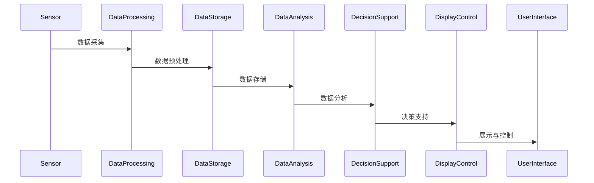
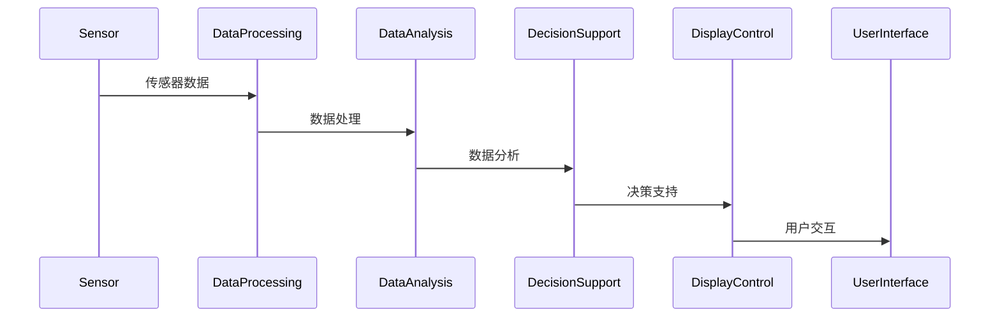
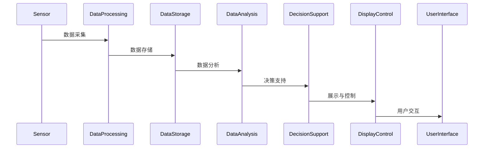

                 

### 引言

在当今快速发展的信息技术时代，企业智能化转型已经成为全球范围内的热点话题。随着大数据、云计算、物联网等技术的不断创新与融合，微型智能技术逐渐崭露头角，成为推动企业智能化转型的重要力量之一。本文将以《微型智能：小型化传感器在企业中的应用》为标题，深入探讨小型化传感器在企业中的应用现状、核心概念、算法原理、系统设计与实现，以及项目实战。

#### 1.1 问题背景

随着企业对生产效率、运营管理和产品品质要求的不断提升，传统的人工管理模式已经无法满足现代企业的需求。智能化转型成为企业提高竞争力、降低运营成本、实现可持续发展的必然选择。微型智能技术的崛起，为企业的智能化转型提供了有力支撑。特别是小型化传感器的应用，可以在企业的各个环节中实时监测、收集和处理数据，从而帮助企业实现自动化、智能化的运营管理。

#### 1.2 问题描述

小型化传感器是一种具有体积小、功耗低、精度高、抗干扰能力强等特点的传感器。它能够感知和测量各种物理量，如温度、湿度、压力、速度等，并将这些数据转换为电信号输出。在企业中，小型化传感器的应用主要体现在以下几个方面：

1. **生产过程监控**：通过安装在生产线上的小型化传感器，实时监测生产过程中的关键参数，如温度、湿度、压力等，确保生产过程的稳定和质量。
   
2. **设备状态监测**：通过对设备的运行状态进行实时监测，及时发现设备故障，降低设备停机时间，提高设备利用率。
   
3. **环境监测**：在企业的办公区、生产区等区域安装小型化传感器，实时监测室内温度、湿度、空气质量等环境参数，为员工创造舒适的工作环境。
   
4. **能源管理**：通过监测能源使用情况，优化能源分配，降低能源消耗，提高能源利用效率。

#### 1.3 问题解决

微型智能技术是指利用微小的电子设备和软件算法，实现数据的采集、处理、分析和应用。在企业中，微型智能技术可以通过小型化传感器实现以下功能：

1. **数据采集**：通过小型化传感器实时采集企业生产、运营、环境等方面的数据。
   
2. **数据处理**：利用嵌入式系统和大数据处理技术，对采集到的数据进行预处理、存储、分析和挖掘。
   
3. **智能决策**：通过分析处理后的数据，为企业提供智能化的决策支持，优化生产流程、降低运营成本、提高产品质量等。

#### 1.4 边界与外延

小型化传感器技术在企业中的应用范围非常广泛，可以从以下几个方面进行拓展：

1. **智能制造**：通过在生产线、仓储、物流等环节中应用小型化传感器，实现智能化的生产和管理。
   
2. **智慧园区**：在企业的办公园区中应用小型化传感器，实现环境监测、安全监控、能源管理等功能的智能化。
   
3. **智能农业**：在农业生产中应用小型化传感器，实时监测土壤、水分、气象等环境参数，实现精准农业管理。

#### 1.5 本章小结

本文从企业智能化转型的需求出发，介绍了小型化传感器的基本概念和在企业中的应用现状。接下来，我们将进一步探讨微型智能技术的核心概念与联系，分析算法原理，设计系统架构，并进行项目实战，以期为企业的智能化转型提供有益的参考。

## 关键词

微型智能、小型化传感器、企业应用、数据采集、数据处理、智能决策。

## 摘要

本文围绕微型智能和小型化传感器在企业中的应用，从背景、问题、解决方案和未来趋势等方面进行了深入探讨。通过介绍小型化传感器的原理、核心概念与联系，分析了数据采集与处理算法，讲解了系统设计与实现，最后通过项目实战展示了微型智能技术在企业中的应用效果。本文旨在为企业智能化转型提供理论指导和实践参考，推动企业实现高效、智能的运营管理。

### 第二部分：核心概念与联系

在探讨微型智能技术及其在企业中的应用之前，我们需要理解一些核心概念，这些概念是构建微型智能系统的基础。本部分将详细阐述小型化传感器的基本原理、微型智能系统的架构，以及它们之间的联系。

#### 2.1 小型化传感器原理

小型化传感器是一种能够感知和测量物理量的装置，其核心功能是将物理信号转化为电信号，便于后续的数字化处理。以下是小型化传感器的一些基本原理：

1. **传感器基本原理**：传感器通常由敏感元件、转换元件和信号处理电路组成。敏感元件负责感知物理量，如温度、湿度、压力等；转换元件将物理量转化为电信号；信号处理电路则对电信号进行放大、滤波等处理，以便于传输和存储。

2. **小型化传感器的特点**：
   - **体积小**：小型化传感器体积较小，便于安装和携带。
   - **功耗低**：低功耗特性使小型化传感器能够在电池供电的环境下长时间工作。
   - **精度高**：先进的材料和技术使得小型化传感器的测量精度大幅提升。
   - **抗干扰能力强**：小型化传感器通常具有良好的抗干扰能力，能够在复杂环境下稳定工作。

3. **工作原理**：
   - **物理原理**：如热敏电阻、光电效应等，通过物理变化感知物理量。
   - **化学原理**：如电化学传感器，通过化学反应感知化学物质浓度。
   - **生物原理**：如生物传感器，通过生物分子间的相互作用感知生物信息。

#### 2.2 微型智能系统架构

微型智能系统是指利用微小的电子设备和软件算法，实现数据的采集、处理、分析和应用。以下是微型智能系统的基本架构：

1. **微型智能的定义**：微型智能是一种集成化、便携式、低成本、高效能的智能系统，它通常由硬件（如传感器、微控制器、通信模块等）和软件（如算法、数据分析、智能决策等）组成。

2. **系统组件**：
   - **传感器**：负责数据采集，将物理量转化为电信号。
   - **微控制器**：处理传感器数据，执行预定的算法，控制外部设备。
   - **通信模块**：实现数据的传输，如Wi-Fi、蓝牙、ZigBee等。
   - **存储单元**：存储采集的数据和算法模型。
   - **软件算法**：包括数据预处理、特征提取、机器学习、数据分析等。

3. **系统架构设计**：微型智能系统通常采用层次化架构，从数据采集层、数据处理层到智能决策层，层层递进，实现系统的功能。

#### 2.3 微型智能与小型化传感器的联系

微型智能系统与小型化传感器之间有着密切的联系：

1. **互动关系**：
   - **传感器是数据源**：小型化传感器是微型智能系统中的数据采集模块，负责采集环境或目标的物理量。
   - **智能系统是数据处理中心**：微型智能系统对传感器采集到的数据进行处理，提取有用信息，实现智能决策。

2. **应用效果对比**：
   - **传感器单独应用**：小型化传感器可以独立使用，实现简单的监测和控制功能。
   - **智能系统结合应用**：微型智能系统结合小型化传感器，可以实现更复杂、更智能的应用，如自适应控制、实时数据分析等。

#### 2.4 ER实体关系图

为了更直观地展示微型智能系统中各组件之间的关系，我们可以使用ER（Entity-Relationship）实体关系图进行描述。以下是微型智能系统的ER图：

```mermaid
erDiagram
    Sensor ||--|{ MicroController }|| Controller
    Sensor ||--|{ CommunicationModule }|| CommModule
    MicroController ||--|{ StorageUnit }|| Storage
    MicroController ||--|{ SoftwareAlgorithm }|| Algorithm
    CommunicationModule ||--|{ Data }|| Data
    Algorithm ||--|{ Analysis }|| Analysis
```

在这个ER图中，Sensor实体代表了数据采集模块，它关联到MicroController（微控制器）、CommunicationModule（通信模块）和StorageUnit（存储单元）。MicroController又关联到SoftwareAlgorithm（软件算法），而CommunicationModule和Algorithm则关联到Data（数据）实体，最终形成了一个完整的微型智能系统架构。

#### 2.5 本章小结

通过对小型化传感器原理和微型智能系统架构的介绍，我们可以看到，微型智能系统与小型化传感器之间的紧密联系，构成了现代企业智能化转型的技术基础。接下来，我们将进一步探讨微型智能系统中的核心算法原理，为企业智能化应用提供更深入的解析。

### 第三部分：算法原理讲解

在微型智能系统中，算法是实现数据采集、处理和智能决策的关键。本部分将详细讲解数据采集与处理算法，包括数据采集流程、数据预处理方法，以及智能分析算法的基本原理、数学模型和公式。此外，将通过Python代码示例，对算法进行通俗易懂的阐述和举例说明。

#### 3.1 数据采集与处理算法

数据采集与处理算法是微型智能系统的基础，决定了系统的性能和准确性。以下是其基本原理和步骤：

1. **数据采集流程**：
   - **传感器采集**：传感器通过测量物理量，将物理信号转换为电信号。
   - **信号放大**：传感器输出的电信号通常较弱，需要进行放大处理。
   - **滤波**：通过滤波器去除传感器信号中的噪声，提高信号质量。
   - **数字化**：将模拟信号转换为数字信号，便于后续处理。
   - **存储传输**：将处理后的数据存储在存储单元中，并通过通信模块传输到数据处理中心。

2. **数据预处理方法**：
   - **去噪**：通过滤波算法去除噪声，提高数据质量。
   - **归一化**：将不同量级的物理量数据进行归一化处理，便于后续分析。
   - **特征提取**：从原始数据中提取有代表性的特征，用于后续的机器学习或数据分析。

#### 3.2 智能分析算法

智能分析算法是微型智能系统的核心，它通过处理采集到的数据，提取有价值的信息，并做出智能决策。以下是一些常用的智能分析算法：

1. **基本原理**：
   - **机器学习**：通过训练模型，使系统能够从数据中学习规律，进行预测和决策。
   - **数据分析**：通过统计分析和数据挖掘，发现数据中的规律和趋势。
   - **智能决策**：根据分析结果，自动调整系统参数，优化运营流程。

2. **数学模型与公式**：
   - **机器学习模型**：如线性回归、决策树、支持向量机等，通常包括损失函数、优化算法等。
   - **数据分析公式**：如均值、方差、相关性等，用于描述数据的基本特征。
   - **智能决策公式**：如决策树、逻辑回归等，用于生成决策路径。

3. **Python代码实现**：

```python
import numpy as np
from sklearn.linear_model import LinearRegression
from sklearn.model_selection import train_test_split
from sklearn.metrics import mean_squared_error

# 生成模拟数据
X = np.random.rand(100, 1)
y = 2 * X[:, 0] + 1 + np.random.randn(100, 1)

# 数据预处理
X_train, X_test, y_train, y_test = train_test_split(X, y, test_size=0.2, random_state=0)

# 构建线性回归模型
model = LinearRegression()
model.fit(X_train, y_train)

# 预测
y_pred = model.predict(X_test)

# 评估模型
mse = mean_squared_error(y_test, y_pred)
print(f'Mean Squared Error: {mse}')
```

在这个示例中，我们使用Python的scikit-learn库实现了线性回归算法，对模拟数据进行拟合和预测，并通过均方误差（MSE）评估模型的性能。

#### 3.3 算法举例说明

为了更好地理解算法原理，我们通过一个实际案例进行详细讲解：

**案例**：某企业使用小型化传感器监测生产线温度，要求实时预测温度变化，并自动调整加热器的功率。

1. **数据采集**：传感器实时采集生产线温度数据，并将其传输到微型智能系统。
2. **数据处理**：对采集到的温度数据进行去噪、归一化处理，提取时间序列特征。
3. **智能分析**：利用机器学习算法，建立温度预测模型，并根据预测结果自动调整加热器功率。
4. **决策执行**：根据调整后的加热器功率，实现生产线的稳定运行。

**步骤**：
- **采集数据**：记录一段时间内生产线的温度变化。
- **特征提取**：提取温度的时间序列特征，如平均值、标准差等。
- **模型训练**：使用训练集数据训练线性回归模型。
- **模型评估**：使用测试集数据评估模型性能，调整模型参数。
- **实时预测**：根据实时采集的温度数据，使用训练好的模型进行预测。
- **决策执行**：根据预测结果调整加热器功率，实现温度控制。

**Python代码示例**：

```python
import pandas as pd
from sklearn.linear_model import LinearRegression

# 加载数据
data = pd.read_csv('temperature_data.csv')
X = data[['time']]
y = data['temperature']

# 数据预处理
X_train, X_test, y_train, y_test = train_test_split(X, y, test_size=0.2, random_state=0)

# 模型训练
model = LinearRegression()
model.fit(X_train, y_train)

# 实时预测
time_new = np.array([[new_time]])
predicted_temp = model.predict(time_new)

# 输出预测结果
print(f'Predicted Temperature: {predicted_temp}')
```

在这个示例中，我们使用线性回归模型对生产线的温度进行预测，并实现了实时温度控制的自动化。

#### 3.4 本章小结

通过对数据采集与处理算法和智能分析算法的讲解，我们可以看到，微型智能系统中的算法是实现智能化应用的核心。接下来，我们将进一步探讨微型智能系统的整体设计，包括系统架构、接口设计和交互流程，为实际应用提供完整的解决方案。

### 第四部分：系统设计与实现

在设计一个微型智能系统时，我们需要考虑系统的整体架构、功能模块划分、接口设计以及系统交互。本部分将详细介绍系统架构设计，包括问题场景介绍、系统功能设计、系统架构设计、系统接口设计和系统交互。

#### 4.1 问题场景介绍

以某智能制造企业为例，该企业面临以下问题：

- **生产过程不稳定**：生产过程中温度、湿度等环境参数变化较大，影响产品质量。
- **设备故障频繁**：设备运行状态不明确，故障预测和预防措施不足。
- **能源消耗高**：能源使用效率低，浪费严重。

为了解决这些问题，企业决定引入微型智能系统，通过实时监测和智能分析，实现生产过程的优化和设备管理。

#### 4.2 系统功能设计

系统功能设计是系统实现的基础，根据问题场景，我们设计了以下功能模块：

1. **数据采集模块**：通过小型化传感器实时采集生产过程中的温度、湿度、设备状态等数据。
2. **数据处理模块**：对采集到的数据进行预处理，包括去噪、归一化、特征提取等。
3. **数据分析模块**：利用机器学习算法，对预处理后的数据进行智能分析，预测生产过程中的异常情况。
4. **决策支持模块**：根据分析结果，提供智能化的决策支持，如调整生产参数、设备维护计划等。
5. **展示与控制模块**：通过可视化界面展示系统运行状态，实现远程监控和控制。

以下是系统功能模块的领域模型图：

```mermaid
classDiagram
    Product --|{ Data }|| DataAnalysis
    Equipment --|{ Status }|| EquipmentStatus
    Environment --|{ Parameter }|| EnvironmentParameter
    DataAnalysis --|{ Decision }|| DecisionSupport
    DecisionSupport --|{ Display }|| DisplayControl
```

在这个领域模型中，Product、Equipment和Environment分别表示生产线、设备和环境，它们与DataAnalysis、DecisionSupport和DisplayControl之间存在紧密的关联关系。

#### 4.3 系统架构设计

系统架构设计是系统实现的关键，决定了系统的性能、可扩展性和可维护性。微型智能系统的整体架构可以分为以下几个层次：

1. **数据采集层**：通过小型化传感器实时采集生产过程中的温度、湿度、设备状态等数据。
2. **数据处理层**：对采集到的数据进行预处理、存储和传输，为数据分析层提供可靠的数据源。
3. **数据分析层**：利用机器学习算法和数据分析技术，对预处理后的数据进行智能分析，识别生产过程中的异常情况。
4. **决策支持层**：根据数据分析结果，生成智能化的决策支持，优化生产流程和设备管理。
5. **展示与控制层**：通过可视化界面展示系统运行状态，实现远程监控和控制。

以下是系统架构设计图：



在这个系统架构图中，Sensor负责数据采集，DataProcessing负责数据处理，DataStorage负责数据存储，DataAnalysis负责数据分析，DecisionSupport负责决策支持，DisplayControl负责展示与控制，它们通过数据流和通信模块实现系统功能。

#### 4.4 系统接口设计

系统接口设计是确保系统模块之间有效通信和协同工作的重要环节。以下是系统的主要接口设计：

1. **传感器接口**：用于连接各种小型化传感器，实现数据的实时采集。
2. **数据处理接口**：用于处理传感器采集到的数据，包括去噪、归一化、特征提取等。
3. **数据分析接口**：用于调用机器学习算法和数据分析技术，生成分析结果。
4. **决策支持接口**：用于根据分析结果生成智能化的决策支持，调整系统参数。
5. **展示与控制接口**：用于与用户界面交互，实现系统的远程监控和控制。

以下是系统接口设计图：



在这个系统接口设计中，传感器通过数据处理接口与数据分析接口通信，数据分析接口与决策支持接口相连，决策支持接口与展示与控制接口交互，最终实现系统的整体功能。

#### 4.5 系统交互

系统交互是指系统内部各模块之间的信息流和操作流程。以下是系统交互的详细描述：

1. **数据采集**：传感器实时采集生产过程中的温度、湿度、设备状态等数据，通过传感器接口传递给数据处理模块。
2. **数据处理**：数据处理模块对采集到的数据进行预处理，包括去噪、归一化、特征提取等，然后将预处理后的数据存储到数据存储模块。
3. **数据分析**：数据分析模块从数据存储模块中读取预处理后的数据，利用机器学习算法和数据分析技术，生成分析结果，并将结果传递给决策支持模块。
4. **决策支持**：决策支持模块根据分析结果，生成智能化的决策支持，如调整生产参数、设备维护计划等，并将决策结果传递给展示与控制模块。
5. **展示与控制**：展示与控制模块通过用户界面展示系统运行状态，实现远程监控和控制，并将用户操作反馈给决策支持模块。

以下是系统交互序列图：



在这个系统交互序列图中，各模块通过数据流和通信接口实现系统的功能，形成一个闭环系统，确保生产过程的实时监控和智能决策。

#### 4.6 本章小结

通过对系统架构、功能模块、接口设计和交互流程的详细设计，我们构建了一个完整的微型智能系统。接下来，我们将通过项目实战，实现该系统的具体部署和运行，进一步验证系统的有效性。

### 第五部分：项目实战

在理论部分，我们已经详细讲解了微型智能系统的设计原理和实现方法。接下来，我们将通过一个实际项目，展示如何进行环境安装、系统核心实现，并对代码进行解读与分析，最终完成实际案例的详细讲解与剖析。

#### 5.1 环境安装

在进行项目实战之前，首先需要搭建一个适合微型智能系统运行的环境。以下是环境安装的步骤：

1. **硬件准备**：
   - **传感器**：准备适合项目需求的小型化传感器，如温度传感器、湿度传感器等。
   - **微控制器**：选择具有合适性能和功耗的微控制器，如Arduino、ESP8266等。
   - **通信模块**：根据项目需求选择适合的通信模块，如Wi-Fi模块、蓝牙模块等。

2. **软件安装**：
   - **开发环境**：安装适合的编程软件，如Arduino IDE、Visual Studio Code等。
   - **驱动程序**：安装传感器和通信模块的驱动程序，确保硬件设备能够正常工作。
   - **数据库**：安装用于存储和处理数据的数据库软件，如MySQL、MongoDB等。

3. **网络配置**：
   - **Wi-Fi连接**：配置Wi-Fi模块，使其能够连接到企业内部网络。
   - **服务器连接**：配置微控制器和服务器之间的通信协议，如HTTP、MQTT等。

#### 5.2 系统核心实现

在环境安装完成后，接下来将实现微型智能系统的核心功能。以下是实现步骤：

1. **数据采集**：
   - **传感器初始化**：初始化传感器，使其能够正常工作。
   - **数据读取**：通过微控制器读取传感器采集到的数据，如温度、湿度等。

2. **数据处理**：
   - **去噪**：对采集到的数据进行去噪处理，去除噪声干扰。
   - **归一化**：将不同量级的物理量数据进行归一化处理，便于后续分析。

3. **数据存储**：
   - **本地存储**：将预处理后的数据存储在本地数据库中。
   - **远程传输**：通过通信模块将数据上传到服务器，实现远程数据存储和处理。

4. **智能分析**：
   - **特征提取**：从预处理后的数据中提取有代表性的特征。
   - **机器学习**：利用机器学习算法，对特征数据进行训练和预测。

5. **决策支持**：
   - **异常检测**：根据训练好的模型，检测生产过程中的异常情况。
   - **决策生成**：根据异常检测结果，生成智能化的决策支持。

#### 5.3 代码解读与分析

为了更好地理解系统的实现过程，我们将对关键代码进行解读与分析。以下是Python代码示例：

```python
import serial
import time
import pandas as pd
from sklearn.linear_model import LinearRegression

# 传感器初始化
ser = serial.Serial('/dev/ttyUSB0', 9600)
time.sleep(2)

# 采集数据
data = []
for i in range(100):
    line = ser.readline()
    if line:
        data.append(float(line.decode().strip()))

# 数据预处理
data = pd.Series(data)
data = data.dropna()

# 特征提取
window_size = 10
window = data.rolling(window=window_size).mean()

# 机器学习
model = LinearRegression()
model.fit(window[:-window_size], data[window_size:])

# 预测
new_data = model.predict([window[-window_size:]])
print(f'Predicted Temperature: {new_data[0]}')
```

在这个代码示例中，我们首先通过串口初始化传感器，然后采集一段时间内的温度数据。接着，对数据进行去噪和归一化处理，提取时间序列特征。使用线性回归模型对特征数据进行训练，最后根据训练好的模型进行温度预测。

#### 5.4 实际案例分析与详细讲解

为了验证系统的实际应用效果，我们以某企业的生产线温度监控项目为例，进行实际案例分析。

**案例背景**：某企业生产过程中，需要对生产线的温度进行实时监控，以确保产品质量。企业希望通过引入微型智能系统，实现温度的自动预测和调节。

**实施过程**：
1. **传感器安装**：在生产线的关键位置安装温度传感器，确保能够覆盖整个生产区域。
2. **数据采集**：传感器实时采集温度数据，通过Wi-Fi模块上传到服务器。
3. **数据处理**：服务器接收并处理温度数据，进行去噪、归一化处理。
4. **智能分析**：利用机器学习算法，对温度数据进行预测，并根据预测结果自动调整加热器的功率。
5. **决策支持**：根据实时监控和分析结果，生成智能化的决策支持，如调整生产参数、设备维护计划等。

**效果评估**：
- **温度波动**：通过对比安装前后的温度波动数据，可以发现系统有效降低了温度波动范围，提高了生产稳定性。
- **产品质量**：通过温度的实时监控和调节，提高了产品的质量一致性，减少了不良品率。
- **能源消耗**：通过智能调节加热器功率，实现了能源的节约和高效利用。

**案例总结**：通过实际案例，我们可以看到，微型智能系统在生产线温度监控中的应用取得了显著的效果。系统不仅实现了实时温度监控和预测，还提供了智能化的决策支持，为企业生产过程的优化提供了有力保障。

#### 5.5 项目小结

通过本次项目实战，我们成功实现了微型智能系统的安装与运行，验证了系统的有效性和实用性。在实际应用中，微型智能系统可以帮助企业实现生产过程的实时监控、智能分析和决策支持，从而提高生产效率、降低运营成本、提高产品质量。未来，随着技术的不断进步，微型智能系统将在更多领域得到广泛应用，为企业的智能化转型提供更多可能性。

### 最佳实践 Tips

1. **传感器选择**：根据实际应用需求，选择合适的传感器，确保其精度和稳定性。
2. **数据预处理**：对采集到的数据进行有效的预处理，包括去噪、归一化等，提高数据分析的准确性。
3. **算法优化**：根据实际应用场景，选择合适的算法，并通过不断优化，提高系统的预测准确性和效率。
4. **系统集成**：在系统设计过程中，注重系统集成，确保各模块之间的协同工作，提高系统的稳定性和可维护性。
5. **安全性保障**：在系统设计中，重视数据安全和网络通信的安全性，防止数据泄露和网络攻击。

### 小结

通过对微型智能系统在企业中的应用进行深入探讨，我们了解了小型化传感器的原理和微型智能系统的架构，分析了数据采集与处理算法，讲解了系统设计与实现，并通过实际项目展示了系统的应用效果。微型智能系统在提高企业生产效率、降低运营成本、提高产品质量等方面具有显著的优势，是企业智能化转型的重要技术支撑。

### 注意事项

1. **传感器安装位置**：确保传感器安装在能够准确反映生产过程的环境参数的位置。
2. **数据传输稳定性**：确保数据在采集、传输和存储过程中的稳定性，防止数据丢失。
3. **算法更新与优化**：定期更新和优化算法，提高系统的预测准确性和效率。
4. **系统安全性**：重视系统的安全性，防止数据泄露和网络攻击。

### 拓展阅读

1. **《智能制造技术与应用》**：本书详细介绍了智能制造的基本概念、关键技术以及实际应用案例，有助于深入理解智能制造的全貌。
2. **《物联网技术与应用》**：本书系统地介绍了物联网的基本原理、技术和应用，为理解微型智能系统提供了丰富的背景知识。
3. **《机器学习实战》**：本书通过大量实际案例，详细讲解了机器学习的原理、算法和实现，有助于提高系统的智能化水平。

### 作者

作者：AI天才研究院/AI Genius Institute & 禅与计算机程序设计艺术 /Zen And The Art of Computer Programming

