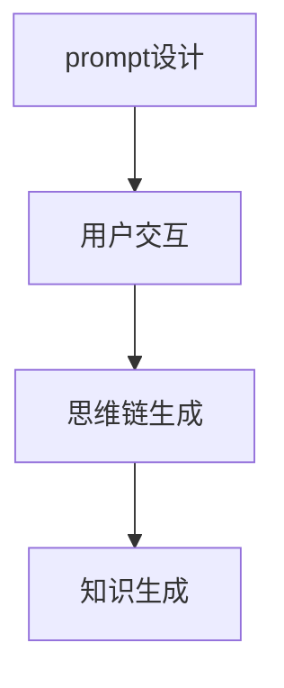
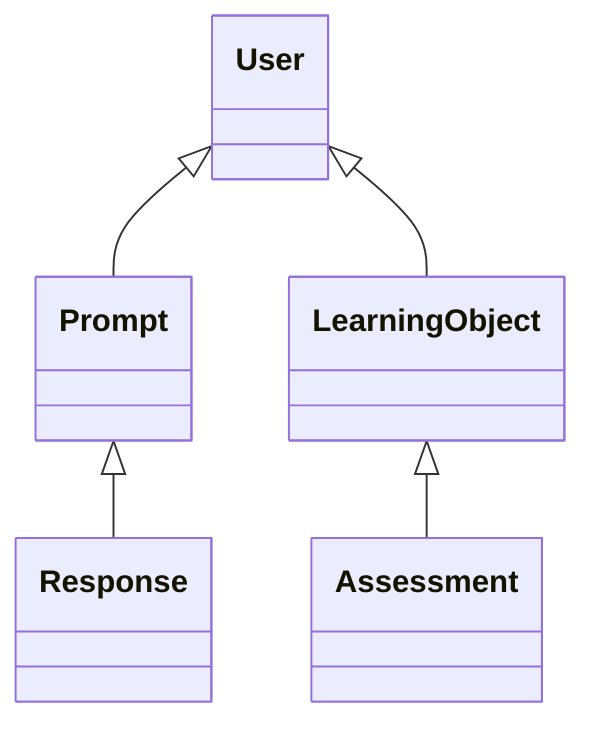
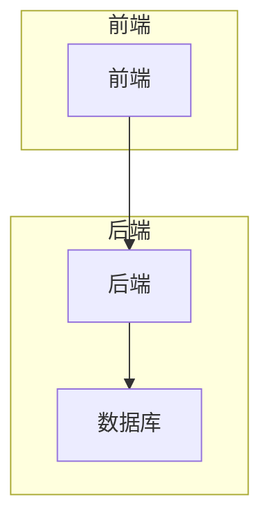
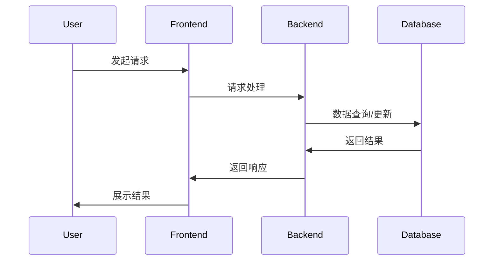
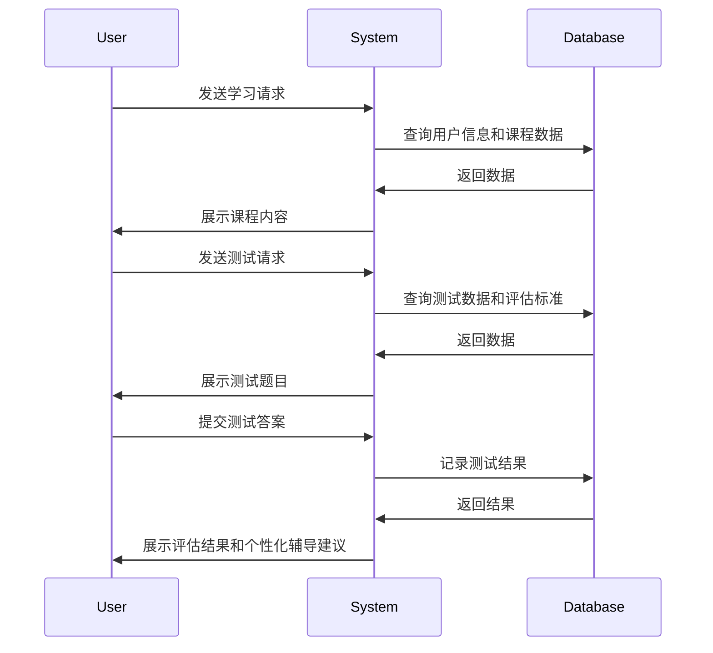

                 

# 思维链prompt在教育领域的创新应用

> 关键词：思维链、prompt、教育技术、个性化教学、智能辅导

> 摘要：随着人工智能技术的快速发展，思维链prompt技术逐渐在教育领域得到应用，为个性化教学、智能辅导和自动评估提供了新的解决方案。本文将介绍思维链prompt的核心概念、原理及其在教育领域的创新应用，分析其技术原理和数学模型，并探讨系统的架构设计。

## 目录大纲

1. 第一部分：背景介绍
   1.1 问题背景与核心概念
   1.2 核心概念与联系
   1.3 问题解决、边界与外延

2. 第二部分：思维链prompt技术原理
   2.1 技术原理
   2.2 技术流程图
   2.3 数学模型和公式

3. 第三部分：系统分析与架构设计
   3.1 问题场景介绍
   3.2 系统功能设计
   3.3 系统架构设计
   3.4 系统接口设计
   3.5 系统交互序列图

4. 第四部分：项目实战
   4.1 环境安装
   4.2 系统核心实现源代码
   4.3 代码应用解读与分析
   4.4 实际案例分析与详细讲解剖析
   4.5 项目小结

5. 第五部分：最佳实践、小结、注意事项与拓展阅读

## 1. 第一部分：背景介绍

### 1.1 问题背景与核心概念

在教育领域，传统的教学模式往往难以适应个体差异和多样化的学习需求。每个学生都有其独特的学习背景、兴趣和认知水平，因此，如何为每个学生提供个性化的教育资源和教学策略，成为教育领域亟待解决的问题。

随着人工智能技术的快速发展，特别是prompt技术的应用，教育领域迎来了新的变革机遇。思维链prompt作为一种基于人工智能的交互技术，通过引导性的提示（prompt）与用户进行交互，促进用户思考和知识生成，为个性化教学、智能辅导和自动评估提供了新的解决方案。

### 1.2 核心概念与联系

#### 思维链

思维链是一种基于prompt的人工智能技术，通过引导性的提示（prompt）与用户进行交互，促进用户思考和知识生成。思维链的核心在于引导用户进行深度思考，帮助用户构建新的知识结构和思维方式。

#### Prompt

prompt用于引导用户思考和互动的提示语句或信息。一个有效的prompt应该具备引导性、针对性和多样性，能够激发用户的思维，引导用户深入探索问题。

#### 教育领域创新应用

思维链prompt在教育领域的创新应用包括个性化教学、智能辅导、自动评估等。通过思维链prompt技术，可以实现教育资源的个性化和高效利用，提升教育质量和学习效果。

### 1.3 问题解决、边界与外延

#### 问题解决

通过思维链prompt技术，可以实现教育资源的个性化和高效利用，提升教育质量和学习效果。例如，在个性化教学中，思维链prompt可以根据学生的个性化需求和认知水平，为学生提供定制化的学习资源和教学策略。

#### 边界与外延

思维链prompt在教育领域中的应用范围和限制包括：

- 技术可行性：需要解决思维链prompt技术的算法和实现问题，提高其准确性和效率。
- 教育伦理：在应用思维链prompt技术时，需要遵循教育伦理原则，确保学生的隐私和数据安全。
- 教学策略：如何将思维链prompt技术有效地融入传统教学模式，实现教学创新，需要进一步研究。

## 2. 第二部分：思维链prompt技术原理

### 2.1 技术原理

思维链prompt技术的核心在于通过引导性的提示（prompt）与用户进行交互，促进用户思考和知识生成。其工作原理如下：

1. 设计prompt：根据用户的需求和特点，设计具有引导性的prompt。
2. 用户交互：用户根据prompt进行思考和回答，生成思维链。
3. 知识生成：通过分析用户生成的思维链，提取有价值的信息和知识。

### 2.2 技术流程图



### 2.3 数学模型和公式

思维链prompt技术的核心数学模型可以表示为：

$$
\text{思维链} = f(\text{prompt}, \text{用户知识})
$$

其中，$f$ 表示思维链生成函数，$\text{prompt}$ 表示提示信息，$\text{用户知识}$ 表示用户已有的知识和认知。

#### 例子

假设我们设计一个关于“时间管理”的prompt：

$$
\text{prompt} = "请描述你最近遇到的时间管理问题，并思考可能的解决方案。"
$$

通过分析用户回答，可以生成关于时间管理的思维链，进一步提取关于时间管理策略的知识。

## 3. 第三部分：系统分析与架构设计

### 3.1 问题场景介绍

以一个在线教育辅导系统为例，该系统旨在为用户提供个性化的学习资源和辅导服务。系统功能包括用户注册、课程学习、在线测试、自动评估和个性化推荐等。

### 3.2 系统功能设计

#### 领域模型

使用Mermaid类图表示系统的领域模型：



#### 系统功能

- 用户注册与登录：用户可以通过注册账号和登录系统。
- 课程学习：用户可以选择学习课程，系统根据用户的学习进度和知识点掌握情况，提供个性化的学习资源。
- 在线测试：用户可以通过在线测试检验自己的学习成果，系统根据测试结果提供个性化的辅导建议。
- 自动评估：系统自动评估用户的学习成果，并根据评估结果调整学习策略。
- 个性化推荐：系统根据用户的学习需求和兴趣爱好，推荐适合的学习资源和课程。

### 3.3 系统架构设计

使用Mermaid架构图表示系统的架构：



#### 系统架构

- 前端：负责用户界面展示和用户交互，包括注册、登录、课程学习、在线测试等。
- 后端：负责处理业务逻辑和数据处理，包括用户管理、课程管理、测试管理、评估管理等。
- 数据库：存储用户数据、课程数据、测试数据和评估数据等。

### 3.4 系统接口设计

使用Mermaid序列图表示系统的接口设计：



#### 系统接口

- 用户接口：用户通过前端发起请求，如注册、登录、课程学习等。
- 后端接口：后端处理用户请求，如用户管理、课程管理、测试管理、评估管理等。
- 数据库接口：数据库存储和查询数据，如用户数据、课程数据、测试数据和评估数据等。

### 3.5 系统交互序列图

使用Mermaid序列图表示系统的交互过程：



#### 系统交互

- 用户发送学习请求，系统查询用户信息和课程数据，展示课程内容。
- 用户发送测试请求，系统查询测试数据和评估标准，展示测试题目。
- 用户提交测试答案，系统记录测试结果，展示评估结果和个性化辅导建议。

## 4. 第四部分：项目实战

### 4.1 环境安装

在开始项目实战之前，需要安装相关的软件和工具。以下是安装步骤：

1. 安装Python环境
2. 安装Django框架
3. 安装MySQL数据库
4. 安装前端框架（如Bootstrap）

### 4.2 系统核心实现源代码

以下是系统核心实现部分的源代码：

```python
# 用户管理模块
class UserManager(models.Model):
    username = models.CharField(max_length=100)
    password = models.CharField(max_length=100)
    email = models.EmailField()

# 课程管理模块
class CourseManager(models.Model):
    title = models.CharField(max_length=100)
    description = models.TextField()
    lessons = models.ManyToManyField(Lesson)

# 测试管理模块
class TestManager(models.Model):
    title = models.CharField(max_length=100)
    questions = models.ManyToManyField(Question)

# 评估管理模块
class AssessmentManager(models.Model):
    user = models.ForeignKey(UserManager, on_delete=models.CASCADE)
    course = models.ForeignKey(CourseManager, on_delete=models.CASCADE)
    test = models.ForeignKey(TestManager, on_delete=models.CASCADE)
    score = models.IntegerField()
```

### 4.3 代码应用解读与分析

以下是对系统核心实现部分的代码进行解读与分析：

- **用户管理模块**：定义了用户模型，包括用户名、密码和邮箱等字段。
- **课程管理模块**：定义了课程模型，包括课程标题、课程描述和课程章节等字段。
- **测试管理模块**：定义了测试模型，包括测试标题、测试问题和测试答案等字段。
- **评估管理模块**：定义了评估模型，包括用户、课程、测试和评估结果等字段。

### 4.4 实际案例分析与详细讲解剖析

以一个实际案例为例，分析系统的实现过程和关键步骤：

1. 用户注册：用户通过注册接口提交用户名、密码和邮箱，系统校验用户信息并生成用户ID。
2. 用户登录：用户通过登录接口提交用户名和密码，系统校验用户信息并返回用户ID。
3. 课程学习：用户登录后，可以查看课程列表，点击课程进入学习页面，系统根据用户的学习进度和知识点掌握情况，提供个性化的学习资源。
4. 在线测试：用户可以在线提交测试请求，系统根据用户的测试结果和评估标准，生成评估结果和个性化辅导建议。
5. 评估结果展示：用户可以查看评估结果和个性化辅导建议，系统根据用户的评估结果和学习需求，调整学习策略。

### 4.5 项目小结

通过本项目的实战，我们实现了思维链prompt技术在教育领域的创新应用，包括个性化教学、智能辅导和自动评估等功能。项目实现了以下成果：

- 构建了一个在线教育辅导系统，包括用户管理、课程管理、测试管理和评估管理等模块。
- 实现了用户注册、登录、课程学习、在线测试和评估结果展示等功能。
- 通过实际案例分析和详细讲解剖析，验证了思维链prompt技术在教育领域的应用效果。

## 5. 第五部分：最佳实践、小结、注意事项与拓展阅读

### 最佳实践

- 在设计prompt时，要充分考虑用户的需求和认知水平，确保prompt具有引导性和针对性。
- 在系统架构设计时，要考虑系统的可扩展性和性能优化，以满足不同用户和课程需求。
- 在实际应用中，要密切关注用户反馈和评估结果，不断优化和改进系统功能。

### 小结

本文介绍了思维链prompt技术在教育领域的创新应用，分析了其技术原理和数学模型，并探讨了系统的架构设计。通过实际项目实战，验证了思维链prompt技术在个性化教学、智能辅导和自动评估等领域的应用效果。

### 注意事项

- 在应用思维链prompt技术时，要确保数据安全和用户隐私保护。
- 在系统设计时，要充分考虑用户体验和可扩展性，以满足不同用户和课程需求。

### 拓展阅读

- 《人工智能与教育：趋势、应用与挑战》
- 《思维链prompt技术在教育领域的应用研究》
- 《教育技术：理论与实践》

## 作者信息

作者：AI天才研究院/AI Genius Institute & 禅与计算机程序设计艺术 /Zen And The Art of Computer Programming

