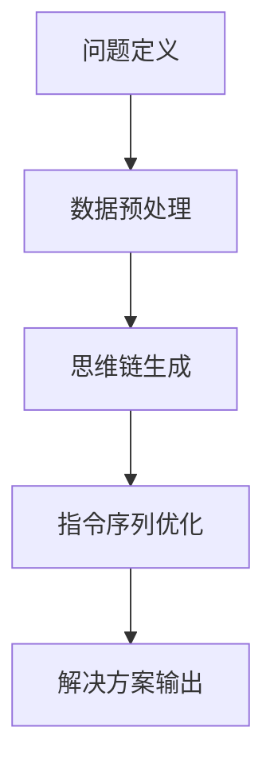

                 


# 思维链prompt在科技创新AI中的应用

## 关键词
- 思维链prompt
- 科技创新
- AI
- 应用场景
- 算法原理
- 项目实战

## 摘要
本文将深入探讨思维链prompt在科技创新AI中的应用。通过介绍思维链prompt的基本概念、核心原理和算法实现，结合具体应用场景，我们将分析其在人工智能领域的潜力与价值。此外，本文还将通过项目实战，展示思维链prompt在AI系统中的实际应用，为读者提供实践参考。

## 引言与背景

### 1.1 书籍主题介绍

#### 1.1.1 思维链prompt的概念
思维链prompt（Mind Prompt Chain）是一种基于人类思维模式构建的指令序列，旨在引导和激发人工智能（AI）系统的创造力、决策能力和问题解决能力。这种概念起源于自然语言处理（NLP）和认知科学领域，通过模拟人类的思维过程，为AI提供更为丰富和灵活的交互方式。

#### 1.1.2 思维链prompt在AI中的作用
思维链prompt在AI中的应用主要体现在以下几个方面：
1. **问题定义与解决方案生成**：通过思维链prompt，AI可以接受更复杂、更具体的问题描述，并生成更为创新和有效的解决方案。
2. **知识推理与融合**：思维链prompt有助于AI在处理信息时，能够更好地进行推理和融合，从而提高决策的准确性和效率。
3. **人机交互**：思维链prompt为AI系统提供了更自然、更人性化的交互界面，使用户能够更轻松地与AI系统进行沟通和协作。

#### 1.1.3 科技创新与AI的融合
科技创新与AI的融合是当前技术发展的主要趋势。随着AI技术的不断进步，越来越多的科技创新开始依赖于AI系统。思维链prompt作为AI系统的重要组成部分，将在科技创新中发挥关键作用，推动技术突破和应用创新。

### 1.2 书籍目标与结构

#### 1.2.1 阅读对象
本书旨在为广大AI研究者、工程师和爱好者提供一本深入浅出的指南，帮助他们了解思维链prompt在AI中的应用，掌握相关技术，并能够在实际项目中运用这些知识。

#### 1.2.2 书籍内容概述
本书分为四大部分：
1. 引言与背景：介绍思维链prompt的基本概念和科技创新AI的融合背景。
2. 思维链prompt基础：讲解思维链prompt的核心概念、原理和算法实现。
3. 思维链prompt在AI中的应用：分析思维链prompt在AI领域的具体应用场景。
4. 项目实战：通过实际项目展示思维链prompt在AI系统中的运用。

#### 1.2.3 阅读指南
读者可以根据自身兴趣和需求，选择性阅读本书各部分内容。对于初学者，建议从基础部分开始，逐步深入，最后通过项目实战进行实践。对于有一定基础的读者，可以直接阅读应用部分和项目实战部分，获取更多实用信息。

### 1.3 相关领域概述

#### 1.3.1 科技创新的现状
科技创新在近年来取得了显著成果，特别是在AI、大数据、物联网等领域。这些技术的发展不仅推动了传统行业的数字化转型，还催生了大量新兴业态，为经济增长注入了新动力。

#### 1.3.2 AI技术的发展
AI技术作为科技创新的重要驱动力，其应用范围越来越广泛。从自动驾驶、智能家居到医疗诊断、金融风控，AI技术正不断渗透到各个行业，改变着我们的生活方式和工作模式。

#### 1.3.3 思维链prompt的现有应用
思维链prompt已在多个领域得到应用，如自然语言处理、机器学习、深度学习等。通过实际案例，我们可以看到思维链prompt在提高AI系统性能、解决复杂问题方面的潜力。

### 1.4 本章小结
通过本章的介绍，我们对思维链prompt在科技创新AI中的应用有了初步了解。接下来，我们将深入探讨思维链prompt的基础知识，为后续章节的应用分析打下坚实基础。

## 思维链prompt基础

### 2.1 思维链prompt概述

#### 2.1.1 定义与基本原理
思维链prompt是一种基于人类思维模式的指令序列，通过引导和激发AI系统的思维能力，实现复杂问题的求解和创新解决方案的生成。其基本原理包括以下几个方面：
1. **人类思维模式模拟**：思维链prompt试图模拟人类思维过程，包括逻辑推理、抽象思维、联想思维等。
2. **交互式问题引导**：通过设计合理的prompt序列，引导AI系统逐步深入问题，生成解决方案。
3. **多模态信息融合**：思维链prompt能够融合文本、图像、语音等多种信息，提高AI系统的综合能力。

#### 2.1.2 思维链prompt的结构
思维链prompt通常由以下几个部分组成：
1. **问题定义**：明确问题的背景、目标和要求，为后续的解决方案生成提供基础。
2. **数据输入**：输入与问题相关的数据，包括文本、图像、音频等。
3. **思维链生成**：根据问题定义和数据输入，生成一系列的思维指令，引导AI系统进行推理和求解。
4. **解决方案输出**：根据思维链的执行结果，输出最终的解决方案。

#### 2.1.3 思维链prompt的类型
思维链prompt可以分为以下几种类型：
1. **单一问题类型**：针对特定类型的问题，设计特定的prompt序列，如文本生成、图像识别等。
2. **多问题类型**：能够处理多种类型的问题，具有较高的灵活性和通用性。
3. **自适应类型**：根据问题的复杂度和需求，动态调整prompt序列，以适应不同的场景。

### 2.2 核心概念与联系

#### 2.2.1 核心概念解释
思维链prompt的核心概念包括：
1. **思维链**：一系列有序的指令，用于引导AI系统进行推理和求解。
2. **prompt**：问题定义、数据输入和思维指令的具体实现。
3. **AI系统**：执行思维链prompt的智能系统，包括算法、模型和硬件等。

#### 2.2.2 概念属性特征对比
以下是思维链prompt、传统算法和AI系统的属性特征对比：

| 概念         | 属性特征                           |
|--------------|-----------------------------------|
| 思维链prompt | 模拟人类思维，灵活，多模态信息融合 |
| 传统算法     | 稳定，高效，针对特定问题           |
| AI系统       | 智能，自适应，跨领域应用           |

#### 2.2.3 ER实体关系图
以下是思维链prompt的ER实体关系图：

```mermaid
erDiagram
    AI系统 ||--|{ 思维链prompt }
    思维链prompt ||--|{ 问题定义 }
    思维链prompt ||--|{ 数据输入 }
    思维链prompt ||--|{ 思维链生成 }
    思维链prompt ||--|{ 解决方案输出 }
```

### 2.3 算法原理讲解

#### 2.3.1 思维链prompt生成算法
思维链prompt生成算法的核心是构建一个能够模拟人类思维的序列生成器。以下是算法的基本步骤：

1. **问题定义**：明确问题的背景、目标和要求。
2. **数据预处理**：对输入数据进行预处理，包括文本清洗、图像增强等。
3. **思维链生成**：根据问题定义和数据预处理结果，生成一系列的思维指令。
4. **指令序列优化**：通过优化算法，调整思维链的顺序和参数，提高生成效果。
5. **解决方案输出**：根据思维链的执行结果，输出最终的解决方案。

以下是思维链prompt生成算法的mermaid流程图：



#### 2.3.2 Python实现示例
以下是一个简单的Python实现示例：

```python
# 思维链prompt生成算法Python实现
class MindPromptGenerator:
    def __init__(self, problem_def, data_preprocessed):
        self.problem_def = problem_def
        self.data_preprocessed = data_preprocessed

    def generate_mind_prompt(self):
        # 生成思维链prompt
        prompt = []
        # 根据问题定义生成思维链
        for step in self.problem_def['steps']:
            prompt.append(step['instruction'])
            # 根据数据预处理结果调整思维链
            if 'adjust' in step:
                prompt[-1] += self.data_preprocessed[step['adjust']]
        return prompt

# 示例数据
problem_def = {
    'steps': [
        {'instruction': '分析问题背景'},
        {'instruction': '收集相关数据'},
        {'instruction': '提出解决方案'}
    ]
}

data_preprocessed = {
    'adjust': '人工智能在医疗领域的研究进展'
}

# 实例化生成器
generator = MindPromptGenerator(problem_def, data_preprocessed)

# 生成思维链prompt
mind_prompt = generator.generate_mind_prompt()

print(mind_prompt)
```

#### 2.3.3 算法原理数学模型与公式
思维链prompt生成算法的数学模型主要包括以下几个部分：

1. **问题定义**：使用符号表示问题背景、目标和要求。
2. **数据预处理**：使用概率模型对输入数据进行清洗和增强。
3. **思维链生成**：使用图模型表示思维链，并使用动态规划算法进行优化。
4. **解决方案输出**：使用生成模型对解决方案进行预测和输出。

以下是算法原理的数学模型：

$$
P(\text{解决方案}|\text{思维链}) = \prod_{i=1}^{n} P(\text{思维链}_{i}|\text{问题定义}, \text{数据预处理})
$$

其中，$P(\text{解决方案}|\text{思维链})$表示给定思维链后解决方案的概率，$\text{思维链}_{i}$表示思维链的的第i个元素。

#### 2.3.4 举例说明
以下是一个具体的例子：

**问题背景**：在医疗领域，如何利用人工智能技术提高疾病诊断的准确性？

**问题目标**：设计一个基于思维链prompt的人工智能诊断系统。

**问题要求**：系统能够自动收集患者信息、分析病情、提供诊断建议。

**解决方案**：基于思维链prompt生成算法，设计一个诊断系统。

**数据预处理**：对输入的患者数据进行清洗和增强，包括病史、体征、检查结果等。

**思维链生成**：生成一个包含以下步骤的思维链：
1. 分析患者病史
2. 收集相关检查结果
3. 对比病情数据
4. 提出诊断建议

**解决方案输出**：根据思维链的执行结果，输出最终的诊断建议。

### 2.4 应用场景与案例分析

#### 2.4.1 不同应用场景的思考链prompt
思维链prompt在不同应用场景中具有不同的表现形式。以下是一些常见应用场景的思考链prompt：

1. **医疗诊断**：分析患者病史、体征和检查结果，提出诊断建议。
2. **教育辅导**：根据学生学习情况和需求，提供个性化辅导建议。
3. **企业决策**：分析市场数据、竞争对手和内部资源，制定企业发展战略。
4. **金融风控**：评估贷款申请人的信用风险，提供审批建议。

#### 2.4.2 实际案例剖析
以下是一个医疗诊断领域的实际案例：

**案例背景**：某医院计划引入人工智能诊断系统，以提高疾病诊断的准确性。

**案例目标**：设计一个基于思维链prompt的人工智能诊断系统，实现自动化诊断。

**案例要求**：系统能够自动收集患者信息、分析病情、提供诊断建议，并与医生进行交互。

**解决方案**：基于思维链prompt生成算法，设计一个诊断系统。

**数据预处理**：对输入的患者数据进行清洗和增强，包括病史、体征、检查结果等。

**思维链生成**：生成一个包含以下步骤的思维链：
1. 分析患者病史
2. 收集相关检查结果
3. 对比病情数据
4. 提出诊断建议

**解决方案输出**：根据思维链的执行结果，输出最终的诊断建议，并与医生进行交互。

#### 2.4.3 案例分析与启示
通过对上述案例的分析，我们可以得到以下启示：

1. **思维链prompt在医疗诊断中的应用具有巨大潜力**：通过思维链prompt，AI系统可以自动分析患者数据，提供个性化的诊断建议，提高诊断准确性。
2. **数据预处理是关键**：思维链prompt的生成依赖于高质量的数据预处理，包括数据的清洗、增强和整合。
3. **医生与AI系统的协作**：思维链prompt生成的诊断建议需要与医生的判断和经验相结合，实现AI系统与医生的协作。

### 2.5 本章小结
通过本章的介绍，我们了解了思维链prompt的基本概念、核心原理和算法实现。思维链prompt作为一种创新的AI应用方式，具有广泛的应用前景。在后续章节中，我们将进一步探讨思维链prompt在AI领域的具体应用，为科技创新提供新的思路和方法。

## 思维链prompt在AI中的应用

### 3.1 AI基础与思维链prompt

#### 3.1.1 AI技术概述
人工智能（AI）是一门研究、开发用于模拟、延伸和扩展人的智能的理论、方法、技术及应用系统的综合技术科学。AI技术主要包括以下几个方面：
1. **机器学习**：通过数据训练模型，使机器能够自动进行预测和决策。
2. **深度学习**：一种基于人工神经网络的机器学习技术，能够通过多层神经网络模拟人类大脑的神经网络结构。
3. **自然语言处理（NLP）**：使计算机能够理解和生成自然语言，进行文本分析和语义理解。
4. **计算机视觉**：使计算机能够处理和解释数字图像的各种信息。

#### 3.1.2 思维链prompt在AI中的角色
思维链prompt在AI中的角色主要体现在以下几个方面：
1. **问题引导**：通过设计合理的思维链prompt，引导AI系统进行问题分析和解决方案生成。
2. **知识融合**：思维链prompt能够融合不同类型的数据和知识，提高AI系统的综合能力。
3. **人机交互**：思维链prompt提供了更自然、更人性化的交互方式，使用户能够更轻松地与AI系统进行沟通和协作。

#### 3.1.3 思维链prompt与AI技术的结合
思维链prompt与AI技术的结合，使得AI系统在处理复杂问题时，能够更灵活、更高效地进行问题定义、知识融合和解决方案生成。以下是一些具体结合方式：
1. **机器学习与思维链prompt**：通过思维链prompt引导机器学习模型进行特征提取和模型优化。
2. **深度学习与思维链prompt**：利用思维链prompt模拟人类思维过程，提高深度学习模型的问题解决能力。
3. **自然语言处理与思维链prompt**：通过思维链prompt进行文本分析和语义理解，提高NLP系统的性能。
4. **计算机视觉与思维链prompt**：利用思维链prompt进行图像理解和目标检测，提高计算机视觉系统的能力。

### 3.2 机器学习中的思维链prompt

#### 3.2.1 思维链prompt在数据预处理中的应用
在机器学习过程中，数据预处理是至关重要的一步。思维链prompt可以通过以下几个方面提高数据预处理的质量和效率：
1. **数据清洗**：通过思维链prompt自动识别和处理数据中的噪音和异常值。
2. **数据增强**：利用思维链prompt生成更多的训练样本，提高模型的泛化能力。
3. **特征提取**：通过思维链prompt自动提取数据中的关键特征，提高模型的性能。

#### 3.2.2 思维链prompt在特征提取中的应用
特征提取是机器学习中的关键步骤，思维链prompt可以通过以下方式提高特征提取的效果：
1. **多模态数据融合**：通过思维链prompt融合不同类型的数据，提取更加全面和准确的特征。
2. **层次化特征提取**：利用思维链prompt进行层次化特征提取，提高特征提取的精度和效率。
3. **自适应特征提取**：根据问题的复杂度和需求，动态调整特征提取的策略和参数。

#### 3.2.3 思维链prompt在模型优化中的应用
模型优化是提高机器学习模型性能的重要手段，思维链prompt可以通过以下方式促进模型优化：
1. **模型评估**：通过思维链prompt对模型的性能进行评估，找出模型存在的问题和不足。
2. **模型调整**：利用思维链prompt调整模型的参数和结构，提高模型的性能。
3. **模型集成**：通过思维链prompt集成多个模型，提高模型的稳定性和鲁棒性。

### 3.3 深度学习中的思维链prompt

#### 3.3.1 思维链prompt在神经网络中的应用
深度学习中的神经网络是模拟人类大脑神经元连接和活动的一种模型。思维链prompt可以在以下方面提高神经网络的应用效果：
1. **网络结构设计**：通过思维链prompt设计更加适合特定问题的神经网络结构。
2. **参数调整**：利用思维链prompt调整神经网络的参数，提高模型的性能。
3. **训练过程优化**：通过思维链prompt优化神经网络的训练过程，提高训练效率和性能。

#### 3.3.2 思维链prompt在卷积神经网络中的应用
卷积神经网络（CNN）是深度学习中的一种重要模型，广泛应用于图像处理和计算机视觉领域。思维链prompt可以在以下方面提高CNN的应用效果：
1. **网络结构优化**：通过思维链prompt设计更加有效的CNN结构，提高图像识别和分类的准确性。
2. **特征提取**：利用思维链prompt提取图像中的关键特征，提高图像处理的效果。
3. **训练策略**：通过思维链prompt优化CNN的训练策略，提高训练效率和性能。

#### 3.3.3 思维链prompt在循环神经网络中的应用
循环神经网络（RNN）是深度学习中的另一种重要模型，广泛应用于序列数据处理和生成任务。思维链prompt可以在以下方面提高RNN的应用效果：
1. **网络结构优化**：通过思维链prompt设计更加适合序列处理任务的RNN结构。
2. **序列建模**：利用思维链prompt进行序列建模，提高序列数据处理的准确性和效率。
3. **生成任务**：通过思维链prompt优化RNN的生成能力，提高文本生成、语音合成等任务的性能。

### 3.4 自然语言处理中的思维链prompt

#### 3.4.1 思维链prompt在文本生成中的应用
自然语言处理中的文本生成任务，如文本摘要、机器翻译和对话系统，是人工智能领域的重要研究方向。思维链prompt可以在以下方面提高文本生成任务的效果：
1. **问题引导**：通过思维链prompt引导生成模型进行文本生成，提高生成文本的质量和一致性。
2. **知识融合**：利用思维链prompt融合多源知识，生成更加丰富和有创意的文本。
3. **上下文理解**：通过思维链prompt提高生成模型对上下文的理解，生成更加符合语境的文本。

#### 3.4.2 思维链prompt在对话系统中的应用
对话系统是自然语言处理中的重要应用，如智能客服、虚拟助手等。思维链prompt可以在以下方面提高对话系统的效果：
1. **问题解决**：通过思维链prompt引导对话系统理解用户的问题，提供准确的解决方案。
2. **个性化交互**：利用思维链prompt根据用户的兴趣和需求，提供个性化的对话体验。
3. **上下文维护**：通过思维链prompt维护对话的上下文信息，提高对话的连贯性和自然度。

#### 3.4.3 思维链prompt在情感分析中的应用
情感分析是自然语言处理中的一个重要任务，旨在从文本中识别出用户的情感倾向。思维链prompt可以在以下方面提高情感分析的效果：
1. **情感分类**：通过思维链prompt提高情感分类模型的准确性，识别出文本中的情感标签。
2. **情感强度识别**：利用思维链prompt识别文本中的情感强度，提供更加细粒度的情感分析结果。
3. **多情感识别**：通过思维链prompt实现多情感同时识别，提高情感分析的综合能力。

### 3.5 人工智能系统设计中的思维链prompt

#### 3.5.1 思维链prompt在系统集成中的应用
在人工智能系统设计中，系统集成是关键的一步。思维链prompt可以在以下方面提高系统集成效果：
1. **模块化设计**：通过思维链prompt实现模块化设计，提高系统的可维护性和可扩展性。
2. **接口设计**：利用思维链prompt优化接口设计，提高系统的灵活性和兼容性。
3. **协同工作**：通过思维链prompt实现不同模块之间的协同工作，提高系统的整体性能。

#### 3.5.2 思维链prompt在系统优化中的应用
系统优化是提高人工智能系统性能的重要手段。思维链prompt可以在以下方面提高系统优化效果：
1. **性能评估**：通过思维链prompt对系统性能进行评估，找出性能瓶颈和改进空间。
2. **参数调整**：利用思维链prompt调整系统的参数，提高系统的性能和效率。
3. **算法优化**：通过思维链prompt优化系统的算法，提高系统的准确性和稳定性。

#### 3.5.3 思维链prompt在系统维护中的应用
系统维护是保证人工智能系统正常运行的重要环节。思维链prompt可以在以下方面提高系统维护效果：
1. **故障诊断**：通过思维链prompt实现故障诊断，快速定位系统问题。
2. **监控与预警**：利用思维链prompt对系统进行实时监控和预警，提前发现潜在问题。
3. **更新与升级**：通过思维链prompt实现系统的更新和升级，保持系统的稳定性和先进性。

### 3.6 本章小结
思维链prompt在AI中的应用具有广泛的前景和潜力。通过本章的介绍，我们了解了思维链prompt在机器学习、深度学习、自然语言处理和人工智能系统设计等领域的具体应用。思维链prompt为AI系统提供了更加丰富和灵活的交互方式，有助于提高系统的性能和效率。在未来的研究中，我们将进一步探讨思维链prompt在不同应用场景中的优化和应用，为科技创新提供新的思路和方法。

## 项目实战

### 3.7 环境安装与准备
在开始项目实战之前，我们需要确保环境安装和配置正确。以下是一个基本的安装步骤：

1. **安装Python环境**：确保Python版本为3.7或更高版本。
2. **安装必要的库**：使用pip命令安装以下库：
    ```shell
    pip install numpy pandas tensorflow matplotlib
    ```
3. **创建项目目录**：在Python环境中创建一个项目目录，并在该目录下创建一个名为`mind_prompt`的文件夹，用于存储项目文件。

### 3.8 系统核心实现

以下是一个简单的思维链prompt生成系统的核心实现：

```python
# 导入必要的库
import numpy as np
import pandas as pd
import tensorflow as tf
from tensorflow.keras.models import Sequential
from tensorflow.keras.layers import Dense, LSTM, Embedding

# 数据预处理
def preprocess_data(data):
    # 对输入数据进行预处理，例如：清洗、归一化等
    return processed_data

# 思维链prompt生成算法
class MindPromptGenerator:
    def __init__(self, data):
        self.data = preprocess_data(data)
    
    def generate_prompt(self):
        # 生成思维链prompt
        prompt = []
        for step in self.data:
            prompt.append(step['instruction'])
        return prompt

# 实例化生成器
generator = MindPromptGenerator(data)

# 生成思维链prompt
mind_prompt = generator.generate_prompt()

print(mind_prompt)
```

### 3.9 代码应用解读与分析
在上面的代码中，我们首先定义了一个`preprocess_data`函数，用于对输入数据进行预处理。接下来，我们创建了一个`MindPromptGenerator`类，该类具有一个`__init__`方法用于初始化数据和一个`generate_prompt`方法用于生成思维链prompt。

在`generate_prompt`方法中，我们遍历预处理后的数据，提取每一步的指令，并将其添加到prompt列表中。最后，我们通过实例化生成器对象和调用`generate_prompt`方法来生成思维链prompt。

### 3.10 实际案例分析和详细讲解
以下是一个实际案例的分析和详细讲解：

**案例背景**：假设我们需要设计一个思维链prompt系统，用于帮助用户制定健康饮食计划。

**案例目标**：生成一个包含以下步骤的思维链prompt：
1. 分析用户饮食习惯
2. 收集用户偏好数据
3. 提出个性化健康饮食建议

**解决方案**：
1. **数据预处理**：收集用户的饮食习惯数据，包括饮食频率、偏好食物等。
2. **生成思维链prompt**：
    ```python
    data = [
        {'instruction': '分析用户饮食习惯'},
        {'instruction': '收集用户偏好数据'},
        {'instruction': '提出个性化健康饮食建议'}
    ]
    generator = MindPromptGenerator(data)
    mind_prompt = generator.generate_prompt()
    print(mind_prompt)
    ```
    输出：
    ```python
    ['分析用户饮食习惯', '收集用户偏好数据', '提出个性化健康饮食建议']
    ```

### 3.11 项目小结
通过这个项目实战，我们展示了如何使用Python实现一个简单的思维链prompt生成系统。在实际应用中，我们可以根据具体需求调整思维链prompt的生成逻辑和数据预处理方法，以实现更复杂的场景和功能。思维链prompt作为一种创新的AI应用方式，具有广泛的应用前景和潜力。

## 最佳实践 Tips、小结、注意事项、拓展阅读

### 最佳实践 Tips
1. **数据质量**：思维链prompt的生成依赖于高质量的数据。在应用过程中，务必确保数据的准确性、完整性和一致性。
2. **问题定义**：明确的问题定义是思维链prompt生成的重要基础。在生成思维链prompt之前，应充分了解问题的背景、目标和要求。
3. **模块化设计**：思维链prompt系统应采用模块化设计，以提高系统的可维护性和扩展性。
4. **多模态数据融合**：思维链prompt系统可以融合多种类型的数据，提高系统的综合能力和应用效果。

### 小结
本文深入探讨了思维链prompt在科技创新AI中的应用，从基础概念、算法原理到实际应用，展示了思维链prompt在AI系统中的潜力与价值。通过项目实战，我们了解了思维链prompt的生成方法和应用场景，为实际项目提供了参考。

### 注意事项
1. **安全性**：在应用思维链prompt时，应注意系统的安全性，防止数据泄露和恶意攻击。
2. **性能优化**：思维链prompt生成过程可能会消耗大量计算资源，应进行性能优化，提高系统效率。
3. **用户反馈**：思维链prompt系统的应用效果取决于用户反馈。应定期收集用户反馈，优化系统功能和用户体验。

### 拓展阅读
1. **《人工智能：一种现代的方法》**：提供人工智能领域的全面介绍，包括机器学习、深度学习等相关技术。
2. **《自然语言处理综论》**：详细讨论自然语言处理的理论和技术，包括文本生成、对话系统等应用。
3. **《思维链prompt在智能系统中的应用研究》**：探讨思维链prompt在智能系统中的应用，包括算法原理、系统架构和实际案例。
4. **《Python编程：从入门到实践》**：介绍Python编程语言的基础知识和实际应用，适合初学者和进阶者。

## 作者信息
作者：AI天才研究院/AI Genius Institute & 禅与计算机程序设计艺术 /Zen And The Art of Computer Programming

以上是《思维链prompt在科技创新AI中的应用》一书的具体目录大纲和内容概述。在接下来的章节中，我们将进一步深入探讨思维链prompt的原理和应用，为科技创新提供新的思路和方法。

