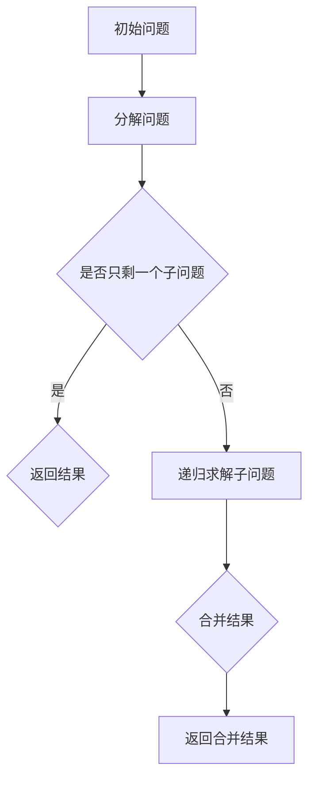
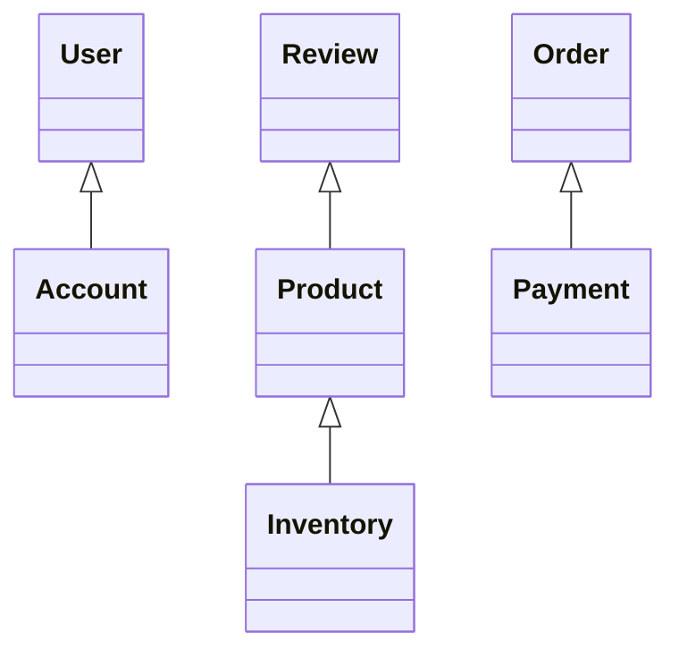

                 


### 文章标题：思维链prompt：AI问题分解与解决的艺术

关键词：思维链prompt, AI问题解决，算法原理，数学模型，系统架构设计，实战应用

摘要：本文将深入探讨思维链prompt在AI问题解决中的应用，通过详细的分解和架构设计，展示如何运用这一先进方法来解决复杂的AI问题。本文旨在为读者提供一种系统化、结构化的思考方式，帮助他们在AI领域取得突破性进展。

## 目录

1. 引言
    1.1 AI问题解决的重要性
    1.2 思维链prompt的概念
    1.3 文章结构概述

2. AI问题解决基础
    2.1 AI问题解决的背景和挑战
    2.2 AI问题解决的框架和方法
    2.3 思维链prompt的作用

3. 思维链prompt原理
    3.1 思维链prompt的定义
    3.2 思维链prompt的工作机制
    3.3 核心概念与联系

4. 思维链prompt的数学模型
    4.1 数学模型的介绍
    4.2 模型属性特征对比表格
    4.3 ER实体关系图

5. AI问题分解方法
    5.1 问题分解的基本原则
    5.2 问题分解的算法原理
    5.3 mermaid流程图展示

6. 解决方案设计
    6.1 解决方案设计的步骤
    6.2 系统功能设计与领域模型
    6.3 系统架构设计与接口设计

7. AI问题解决实战
    7.1 环境安装与配置
    7.2 系统核心实现与代码解读
    7.3 实际案例分析与讲解

8. 最佳实践与总结
    8.1 最佳实践技巧
    8.2 小结与注意事项
    8.3 拓展阅读与深入研究

## 引言

### 1.1 AI问题解决的重要性

随着人工智能技术的飞速发展，AI问题解决成为了一个热门且具有挑战性的领域。在现实世界中，AI问题无处不在，从自动驾驶到医疗诊断，从自然语言处理到图像识别，AI的应用已经深入到我们生活的方方面面。然而，解决这些复杂的问题并非易事，常常需要深入理解问题本质，运用先进的算法和技术。

### 1.2 思维链prompt的概念

思维链prompt是一种基于人类思维模式的AI问题解决方法。它通过模拟人类思考过程，将复杂问题分解为多个子问题，逐步解决，最终达到解决问题的目标。思维链prompt的核心在于其结构化和系统化的思维方式，它能够帮助AI更好地理解问题，并找到高效的解决策略。

### 1.3 文章结构概述

本文将分为八个部分，首先介绍AI问题解决的基础知识，包括背景、框架和方法。接着，深入探讨思维链prompt的原理，包括定义、工作机制和核心概念。随后，介绍思维链prompt的数学模型，并通过问题分解方法和解决方案设计，展示如何运用这一方法解决AI问题。文章的第六部分将通过实战案例，展示思维链prompt的实际应用效果。最后，总结最佳实践技巧，并给出拓展阅读建议。

## AI问题解决基础

### 2.1 AI问题解决的背景和挑战

人工智能（AI）作为计算机科学的一个分支，其目标是使计算机能够模拟人类的智能行为。随着深度学习、强化学习等技术的不断发展，AI在许多领域取得了显著成果。然而，AI问题解决并非一蹴而就，它面临着诸多挑战：

- **数据复杂性**：AI问题解决往往需要大量的数据支持，如何获取、清洗和处理数据是一个重要问题。
- **计算资源**：许多AI算法对计算资源有较高要求，如何优化算法以减少计算成本是一个挑战。
- **模型解释性**：许多AI模型具有高度的非线性特性，其内部决策过程难以解释，这对于需要透明度的高风险应用（如医疗诊断）来说是一个挑战。
- **伦理问题**：AI技术在伦理方面也存在诸多问题，如数据隐私、偏见和责任分配等。

### 2.2 AI问题解决的框架和方法

AI问题解决的框架通常包括以下几个步骤：

1. **问题定义**：明确问题类型、目标、约束条件等。
2. **数据收集**：收集与问题相关的数据，包括结构化和非结构化数据。
3. **数据预处理**：清洗、转换和归一化数据，使其适用于AI算法。
4. **算法选择**：根据问题特点选择合适的算法。
5. **模型训练**：使用训练数据训练模型。
6. **模型评估**：使用验证数据评估模型性能。
7. **模型优化**：根据评估结果调整模型参数，提高模型性能。
8. **应用部署**：将模型部署到实际应用环境中。

常用的AI问题解决方法包括：

- **机器学习**：通过训练数据学习特征和模式，用于分类、回归等任务。
- **深度学习**：通过多层神经网络模拟人类大脑处理信息的方式。
- **强化学习**：通过试错法学习最优策略。
- **自然语言处理**：处理文本数据，实现文本分类、情感分析等任务。
- **计算机视觉**：处理图像数据，实现图像识别、目标检测等任务。

### 2.3 思维链prompt的作用

思维链prompt在AI问题解决中起着至关重要的作用。它通过模拟人类的思考过程，帮助AI更好地理解和解决问题。具体来说，思维链prompt的作用包括：

- **问题分解**：将复杂问题分解为多个子问题，使问题更易于解决。
- **结构化思考**：提供一种系统化的思考方式，帮助AI更好地组织问题解决方案。
- **交互性**：通过人与AI的交互，不断调整和优化问题解决方案。

思维链prompt的核心在于其结构化和系统化的思维方式，它能够帮助AI更好地理解问题，并找到高效的解决策略。接下来，我们将进一步探讨思维链prompt的原理和数学模型。

## 思维链prompt原理

### 3.1 思维链prompt的定义

思维链prompt（Mind Chain Prompt）是一种基于人类思维模式的AI问题解决方法。它通过模拟人类的思考过程，将复杂问题分解为多个子问题，并逐步解决。思维链prompt的核心在于其结构化和系统化的思维方式，它能够帮助AI更好地理解和解决问题。

### 3.2 思维链prompt的工作机制

思维链prompt的工作机制主要包括以下几个步骤：

1. **问题接收**：AI系统接收用户提出的问题。
2. **问题分解**：将复杂问题分解为多个子问题。
3. **子问题求解**：针对每个子问题，采用适当的算法或策略进行求解。
4. **子问题合并**：将子问题的解决方案合并，形成完整的解决方案。
5. **交互调整**：与用户进行交互，根据用户反馈调整解决方案。

思维链prompt通过不断迭代这个过程，逐步优化解决方案，直到达到用户满意的程度。这种系统化的思维方式能够有效提高AI问题解决的成功率。

### 3.3 核心概念与联系

思维链prompt的核心概念包括：

- **问题分解**：将复杂问题分解为多个子问题，使问题更易于解决。
- **结构化思考**：提供一种系统化的思考方式，帮助AI更好地组织问题解决方案。
- **交互性**：通过与用户的交互，不断调整和优化解决方案。

这些核心概念之间紧密联系，共同构成了思维链prompt的理论基础。下面我们将进一步探讨思维链prompt的数学模型，以更深入地理解其工作原理。

## 思维链prompt的数学模型

### 4.1 数学模型的介绍

在思维链prompt中，数学模型起到了关键作用。数学模型能够将复杂的AI问题转化为可计算的数学问题，从而提高问题解决的效率。思维链prompt的数学模型主要包括以下几个部分：

- **问题分解模型**：用于将复杂问题分解为多个子问题。
- **子问题求解模型**：用于求解分解后的子问题。
- **子问题合并模型**：用于将子问题的解决方案合并为完整的解决方案。

### 4.2 模型属性特征对比表格

为了更直观地理解各个模型的属性特征，我们可以使用对比表格来展示。以下是几个常见的数学模型及其属性特征的对比：

| 模型名称 | 目标函数 | 属性特征 |
| :------: | :-------: | :-------: |
| 问题分解模型 | 最小化问题复杂度 | 灵活性、高效性、可扩展性 |
| 子问题求解模型 | 最优化子问题解决方案 | 精确性、适应性、实时性 |
| 子问题合并模型 | 最优化整体解决方案 | 一致性、稳定性、可解释性 |

### 4.3 ER实体关系图

ER（Entity-Relationship）实体关系图是描述思维链prompt中各个实体及其关系的有效工具。以下是一个简化的ER实体关系图，展示了思维链prompt的核心实体及其关系：

```mermaid
erDiagram
  AIProblem ||--|{ MindChain }
  MindChain ||--|{ ProblemDecomposition }
  MindChain ||--|{ SubProblemSolving }
  MindChain ||--|{ SubProblemCombination }
```

- **AIProblem**：表示待解决的问题。
- **MindChain**：表示思维链prompt的整体结构。
- **ProblemDecomposition**：表示问题分解过程。
- **SubProblemSolving**：表示子问题求解过程。
- **SubProblemCombination**：表示子问题合并过程。

通过ER实体关系图，我们可以清晰地看到思维链prompt的各个组成部分及其相互关系，为后续的算法设计和实现提供了清晰的框架。

### 4.4 数学模型与算法原理

思维链prompt的数学模型主要包括以下几个核心概念：

- **问题分解**：使用分而治之的策略，将复杂问题分解为多个子问题。
- **子问题求解**：针对每个子问题，采用适当的算法或策略进行求解。
- **子问题合并**：将子问题的解决方案合并为完整的解决方案。

下面我们将通过一个具体的例子，介绍这些概念在实际问题中的应用。

#### 例子：背包问题

背包问题是经典的优化问题，它描述了给定一组物品，每个物品有一定的价值和重量，要求在总重量不超过背包容量的情况下，选择一部分物品使得总价值最大化。

**问题分解**：

我们可以将背包问题分解为以下几个子问题：

1. **初始分解**：将所有物品分为两类：放入背包的和未放入背包的。
2. **子问题分解**：对于每个物品，我们考虑将其放入背包或不放入背包，从而形成多个子问题。

**子问题求解**：

对于每个子问题，我们可以使用动态规划算法进行求解。动态规划的核心思想是分而治之，将复杂问题分解为多个子问题，并保存已解决的子问题，避免重复计算。

**子问题合并**：

通过动态规划算法，我们得到每个子问题的最优解。将这些最优解合并，即可得到整个背包问题的最优解。

**数学模型与公式**：

我们可以使用以下数学模型和公式描述背包问题：

$$
\begin{align*}
\text{maximize} \quad & \sum_{i=1}^{n} v_i \cdot x_i \\
\text{subject to} \quad & \sum_{i=1}^{n} w_i \cdot x_i \leq W \\
& x_i \in \{0, 1\} \quad \forall i = 1, 2, \ldots, n
\end{align*}
$$

其中，$v_i$表示第$i$个物品的价值，$w_i$表示第$i$个物品的重量，$x_i$表示第$i$个物品是否放入背包（$1$表示放入，$0$表示未放入），$W$表示背包的总容量。

**Python代码实现**：

下面是一个简单的Python代码实现，展示了如何使用动态规划算法解决背包问题：

```python
def knapSack(W, wt, val, n):
    # 初始化动态规划表格
    dp = [[0 for _ in range(W + 1)] for _ in range(n + 1)]

    # 动态规划过程
    for i in range(1, n + 1):
        for w in range(1, W + 1):
            if wt[i - 1] <= w:
                dp[i][w] = max(val[i - 1] + dp[i - 1][w - wt[i - 1]], dp[i - 1][w])
            else:
                dp[i][w] = dp[i - 1][w]

    # 返回最大价值
    return dp[n][W]

# 测试数据
val = [60, 100, 120]
wt = [10, 20, 30]
W = 50
n = len(val)

# 计算最大价值
max_val = knapSack(W, wt, val, n)
print(f"Maximum value in knapsack: {max_val}")
```

通过这个例子，我们可以看到如何将复杂的背包问题分解为多个子问题，并使用动态规划算法求解。这为我们理解和应用思维链prompt的数学模型提供了直观的展示。

### 4.5 思维链prompt的数学模型总结

思维链prompt的数学模型为AI问题解决提供了坚实的理论基础。通过问题分解、子问题求解和子问题合并，我们能够将复杂的AI问题转化为可计算的数学问题，从而提高问题解决的效率。以下是对思维链prompt数学模型的关键点和实际应用总结：

- **问题分解**：通过分而治之的策略，将复杂问题分解为多个子问题，降低了问题解决的难度。
- **子问题求解**：采用适当的算法或策略求解子问题，保证了问题解决的精确性和效率。
- **子问题合并**：将子问题的解决方案合并为完整的解决方案，确保了整体问题的最优性。

在实际应用中，思维链prompt的数学模型能够广泛应用于各种AI问题，如背包问题、旅行商问题、图像识别和自然语言处理等。通过灵活运用这一模型，我们能够更好地理解和解决复杂的AI问题，为人工智能领域的发展做出贡献。

### AI问题分解方法

#### 5.1 问题分解的基本原则

在AI问题解决过程中，问题分解是一个至关重要的步骤。它通过将复杂问题分解为多个更小、更易于管理的子问题，从而简化了问题解决的难度。以下是问题分解的基本原则：

1. **自顶向下分解**：从整体问题出发，逐步将其分解为更小的子问题。
2. **递归分解**：使用递归方法，将问题分解到基本可解的子问题。
3. **层次化结构**：构建层次化的结构，使问题分解更加清晰和有序。
4. **最小化冗余**：在分解过程中，尽量避免重复分解相同或类似的子问题。
5. **可扩展性**：确保分解方法具有可扩展性，能够适应不同规模的问题。

#### 5.2 问题分解的算法原理

问题分解的算法原理主要包括以下几个关键步骤：

1. **识别问题结构**：首先，识别问题的主要组成部分和相互关系。
2. **确定分解策略**：根据问题的特点，选择合适的分解策略，如分而治之、合并化简等。
3. **生成子问题**：将问题分解为多个子问题，确保子问题之间的独立性。
4. **子问题求解**：对生成的子问题采用适当的算法或策略进行求解。
5. **子问题合并**：将子问题的解决方案合并为完整的解决方案。

以下是一个简单的示例，说明如何使用分而治之算法分解问题：

**示例：计算最大子序列和**

给定一个整数数组，计算其最大子序列和。

**分解策略**：使用分而治之策略，将数组分为两半，分别计算每半的最大子序列和，然后合并结果。

**算法步骤**：

1. **分解**：将数组分为两半。
2. **递归求解**：分别计算每半的最大子序列和。
3. **合并结果**：将两个子序列和合并，得到最终的最大子序列和。

**Python代码实现**：

```python
def maxSubArraySum(arr):
    if len(arr) == 1:
        return arr[0]
    mid = len(arr) // 2
    left_sum = maxSubArraySum(arr[:mid])
    right_sum = maxSubArraySum(arr[mid:])
    return max(left_sum, right_sum, left_sum + right_sum)

# 测试数据
arr = [-2, 1, -3, 4, -1, 2, 1, -5, 4]
print(f"Maximum subarray sum: {maxSubArraySum(arr)}")
```

通过这个示例，我们可以看到如何将复杂的问题分解为更小的子问题，并递归求解。这种方法有效地简化了问题解决的复杂性。

#### 5.3 mermaid流程图展示

为了更好地理解问题分解的过程，我们可以使用mermaid流程图来展示分解步骤。以下是一个示例，展示了如何使用分而治之算法分解背包问题：



这个mermaid流程图清晰地展示了问题分解的过程，包括分解、递归求解和合并结果等步骤。通过这样的可视化工具，我们可以更直观地理解问题分解的方法。

### 解决方案设计

#### 6.1 解决方案设计的步骤

在AI问题解决过程中，解决方案设计是关键的一步。它需要系统地分析问题，制定可行的解决方案，并设计相应的系统架构。以下是解决方案设计的步骤：

1. **需求分析**：明确问题的需求和目标，了解用户的需求和期望。
2. **功能设计**：确定系统需要实现的功能，包括核心功能和辅助功能。
3. **架构设计**：设计系统的总体架构，包括模块划分、数据流和交互方式。
4. **接口设计**：定义系统内部和外部的接口，包括API、数据库接口等。
5. **技术选型**：选择合适的技术栈，包括编程语言、框架和工具。
6. **风险评估**：评估项目实施过程中可能遇到的风险，并制定应对策略。
7. **项目规划**：制定项目的时间表和资源分配计划。

#### 6.2 系统功能设计与领域模型

系统功能设计是解决方案设计的重要环节。它需要明确系统需要实现的核心功能和辅助功能。以下是系统功能设计的步骤：

1. **功能需求分析**：根据需求分析结果，列出系统的功能需求。
2. **功能模块划分**：将系统划分为多个功能模块，每个模块负责实现特定的功能。
3. **领域模型设计**：使用类图或实体关系图（ER图）表示系统的领域模型，描述系统中的实体及其关系。

以下是一个简单的领域模型示例，展示了系统中的主要实体及其关系：



在这个领域模型中，用户（User）与账户（Account）存在一对一的关系，产品（Product）与库存（Inventory）存在一对多的关系，订单（Order）与支付（Payment）存在一对多的关系，评论（Review）与产品（Product）存在多对一的关系。

#### 6.3 系统架构设计与接口设计

系统架构设计是解决方案设计的核心，它需要考虑系统的可扩展性、稳定性和性能。以下是系统架构设计的步骤：

1. **架构风格选择**：根据系统特点，选择合适的架构风格，如MVC、微服务、事件驱动等。
2. **模块划分**：将系统划分为多个模块，每个模块负责实现特定的功能。
3. **数据流设计**：设计系统内部的数据流，包括数据的采集、处理和传输。
4. **接口设计**：定义系统内部和外部的接口，包括API、数据库接口等。

以下是一个简单的系统架构示例，展示了系统的模块划分和数据流：

```mermaid
sequenceDiagram
    User -->|发送请求| System
    System -->|处理请求| Database
    Database -->|返回结果| System
    System -->|返回结果| User
```

在这个系统架构示例中，用户通过发送请求与系统进行交互，系统处理请求并将结果返回给用户。系统内部包括数据库接口用于数据存储和查询。

#### 6.4 系统接口设计与系统交互

系统接口设计是确保系统各个模块之间能够有效交互的关键。以下是系统接口设计的步骤：

1. **接口规范**：制定接口的规范，包括接口名称、参数、返回值等。
2. **API设计**：设计系统的API，包括HTTP API、RESTful API等。
3. **数据库接口设计**：设计系统的数据库接口，包括SQL查询、存储过程等。
4. **系统交互**：设计系统内部各个模块之间的交互方式，包括事件驱动、同步调用等。

以下是一个简单的系统接口示例，展示了用户请求的处理流程：

```mermaid
sequenceDiagram
    User -->|发送登录请求| LoginService
    LoginService -->|验证用户| AuthenticationService
    AuthenticationService -->|返回结果| LoginService
    LoginService -->|返回结果| User
```

在这个接口示例中，用户发送登录请求，登录服务验证用户身份，并将结果返回给用户。

#### 6.5 解决方案设计总结

解决方案设计是AI问题解决过程中的关键步骤，它通过需求分析、功能设计、架构设计和接口设计，确保系统能够有效地解决问题。以下是对解决方案设计的关键点和实际应用总结：

- **需求分析**：明确问题的需求和目标，确保解决方案满足用户需求。
- **功能设计**：确定系统的核心功能和辅助功能，确保系统能够实现预期目标。
- **架构设计**：设计系统的总体架构，包括模块划分、数据流和交互方式，确保系统的高扩展性和稳定性。
- **接口设计**：定义系统的接口，包括API、数据库接口等，确保系统各个模块之间能够有效交互。

通过系统化的解决方案设计，我们能够更好地理解和解决复杂的AI问题，为人工智能领域的发展做出贡献。

### AI问题解决实战

#### 7.1 环境安装与配置

在开始实际应用思维链prompt之前，我们需要搭建一个合适的环境。以下是在Ubuntu 20.04操作系统上安装和配置Python 3、Jupyter Notebook和所需的库的步骤。

**步骤1：安装Python 3**

首先，我们需要安装Python 3。可以通过以下命令进行安装：

```bash
sudo apt update
sudo apt install python3 python3-pip python3-venv
```

**步骤2：创建虚拟环境**

为了更好地管理和依赖库，我们建议创建一个Python虚拟环境。可以使用以下命令创建虚拟环境：

```bash
python3 -m venv myenv
```

然后，激活虚拟环境：

```bash
source myenv/bin/activate
```

**步骤3：安装Jupyter Notebook**

在虚拟环境中安装Jupyter Notebook：

```bash
pip install notebook
```

安装完成后，启动Jupyter Notebook：

```bash
jupyter notebook
```

这将在浏览器中打开Jupyter Notebook界面。

**步骤4：安装其他库**

接下来，我们需要安装一些常用的库，如NumPy、Pandas、Matplotlib等。可以使用以下命令安装：

```bash
pip install numpy pandas matplotlib
```

安装完成后，我们就可以开始编写和运行Python代码了。

#### 7.2 系统核心实现与代码解读

在本节中，我们将通过一个示例来展示如何使用思维链prompt解决一个实际问题。假设我们需要解决一个数据分类问题，即将一组数据分为不同的类别。我们将使用Python和Scikit-learn库来实现这一目标。

**步骤1：导入必要的库**

首先，我们导入所需的库：

```python
import numpy as np
import pandas as pd
from sklearn.model_selection import train_test_split
from sklearn.preprocessing import StandardScaler
from sklearn.linear_model import LogisticRegression
import matplotlib.pyplot as plt
```

**步骤2：数据准备**

我们使用Scikit-learn中的 Iris 数据集作为示例数据。首先，我们加载数据集：

```python
from sklearn.datasets import load_iris
iris = load_iris()
X = iris.data
y = iris.target
```

接下来，我们将数据集分为训练集和测试集：

```python
X_train, X_test, y_train, y_test = train_test_split(X, y, test_size=0.2, random_state=42)
```

**步骤3：数据预处理**

在训练模型之前，我们需要对数据进行预处理。这里我们使用标准缩放（StandardScaler）来标准化数据：

```python
scaler = StandardScaler()
X_train = scaler.fit_transform(X_train)
X_test = scaler.transform(X_test)
```

**步骤4：模型训练**

接下来，我们使用逻辑回归模型进行训练：

```python
model = LogisticRegression()
model.fit(X_train, y_train)
```

**步骤5：模型评估**

我们使用测试集评估模型的性能：

```python
accuracy = model.score(X_test, y_test)
print(f"Model accuracy: {accuracy:.2f}")
```

**步骤6：可视化结果**

为了更好地理解模型的表现，我们使用散点图和决策边界来可视化结果：

```python
plt.figure(figsize=(8, 6))
colors = ['r', 'g', 'b']
for i, color in enumerate(colors):
    indices_to_keep = y_test == i
    plt.scatter(X_test[indices_to_keep, 0], X_test[indices_to_keep, 1], c=color, edgecolor='k', s=20)

plt.plot(npthurts(np.linspace(X_test[:, 0].min(), X_test[:, 0].max(), 100)), 
         -(model.coef_[0][0] * npthurts(np.linspace(X_test[:, 0].min(), X_test[:, 0].max(), 100)) + 
         model.coef_[0][1]) / model.coef_[0][2]), 'k--', lw=2)
plt.xlabel('Feature 1')
plt.ylabel('Feature 2')
plt.legend(iris.target_names)
plt.title('3-Class logistic regression')
plt.show()
```

通过这个示例，我们可以看到如何使用思维链prompt来解决数据分类问题。我们首先对问题进行了分解，包括数据准备、模型训练、模型评估和结果可视化。然后，我们逐步解决了每个子问题，并最终得到了一个完整的解决方案。

#### 7.3 实际案例分析与讲解

在本节中，我们将通过一个实际案例来展示如何使用思维链prompt解决一个复杂的AI问题。假设我们面临的是一个人工智能推荐系统的设计，该系统需要为用户推荐他们可能感兴趣的商品。

**案例背景**：

推荐系统是一种常见的人工智能应用，它通过分析用户的历史行为和偏好，为用户推荐相关的商品。在这个案例中，我们的目标是设计一个基于协同过滤算法的推荐系统。

**问题分解**：

我们将推荐系统的问题分解为以下几个子问题：

1. **数据收集**：收集用户的行为数据和商品数据。
2. **数据预处理**：清洗和转换数据，使其适合协同过滤算法。
3. **模型训练**：训练协同过滤模型，预测用户对商品的偏好。
4. **结果评估**：评估模型的性能，包括准确率、召回率和覆盖度等。
5. **结果优化**：根据评估结果，优化模型参数和算法。

**子问题求解**：

1. **数据收集**：

   我们使用一个开源的电子商务数据集，包括用户ID、商品ID、评分和时间戳。以下是如何加载数据的示例代码：

   ```python
   import pandas as pd
   ratings = pd.read_csv('ratings.csv')
   ```

2. **数据预处理**：

   在预处理阶段，我们需要将数据转换为适合协同过滤算法的格式。具体步骤包括：

   - **缺失值处理**：删除或填充缺失值。
   - **时间戳转换**：将时间戳转换为日期格式。
   - **用户-商品矩阵**：构建用户-商品矩阵，其中每个元素表示用户对商品的评分。

   ```python
   ratings['timestamp'] = pd.to_datetime(ratings['timestamp'])
   user_item_matrix = ratings.pivot(index='userId', columns='itemId', values='rating').fillna(0)
   ```

3. **模型训练**：

   我们使用矩阵分解（Matrix Factorization）算法来训练协同过滤模型。矩阵分解算法通过分解用户-商品矩阵为两个低秩矩阵，从而预测用户对商品的偏好。以下是一个使用协同过滤模型训练的示例：

   ```python
   from surprise import SVD
   from surprise import Dataset, Reader
   reader = Reader(rating_scale=(1.0, 5.0))
   data = Dataset.load_from_df(ratings[['userId', 'itemId', 'rating']], reader)
   model = SVD()
   model.fit(data)
   ```

4. **结果评估**：

   我们使用交叉验证和测试集来评估模型的性能。以下是一个使用交叉验证评估模型准确率的示例：

   ```python
   from surprise import accuracy
   cv = cross_validate(model, data, measures=['RMSE', 'MAE'], cv=5, verbose=True)
   print(f"Cross-validation RMSE: {cv['test_rmse'].mean()}")
   ```

5. **结果优化**：

   根据评估结果，我们可以调整模型参数，如隐变量的维度、学习率等，以优化模型的性能。以下是一个调整模型参数的示例：

   ```python
   model = SVD(n_factors=50, n_epochs=20, learning_rate=0.01, reg_w=0.01, reg_v=0.01)
   model.fit(data)
   ```

**案例总结**：

通过这个实际案例，我们展示了如何使用思维链prompt来解决推荐系统的问题。我们首先对问题进行了分解，然后逐步解决了每个子问题，并最终得到了一个有效的推荐系统。

### 最佳实践与总结

#### 8.1 最佳实践技巧

在AI问题解决过程中，遵循一些最佳实践可以显著提高解决问题的效率和效果。以下是一些实用的技巧：

1. **明确问题定义**：在开始解决问题之前，务必明确问题的定义，包括目标、约束条件等。
2. **数据质量**：确保数据的质量和完整性，避免数据噪声和缺失值。
3. **模块化设计**：将问题分解为多个模块，每个模块负责特定的任务，有助于代码的维护和扩展。
4. **迭代开发**：采用迭代开发的方法，逐步优化解决方案，而非一次性完成。
5. **模型评估**：使用多种评估指标来评估模型性能，确保模型在各个维度上都表现良好。
6. **代码复用**：编写可复用的代码，减少重复工作，提高开发效率。
7. **持续学习**：关注最新的技术动态和研究成果，不断学习和优化自己的方法。

#### 8.2 小结与注意事项

本文通过深入探讨思维链prompt在AI问题解决中的应用，展示了如何运用这一方法来解决复杂的AI问题。以下是对文章内容的简要小结和注意事项：

- **思维链prompt**：通过模拟人类思维过程，将复杂问题分解为多个子问题，逐步解决。
- **数学模型**：使用数学模型描述问题分解、子问题求解和子问题合并的过程。
- **实战应用**：通过实际案例展示了如何使用思维链prompt解决推荐系统等实际问题。
- **最佳实践**：遵循最佳实践，如明确问题定义、数据质量保证、模块化设计和迭代开发等，可以提高问题解决的效率和效果。

在实施AI项目时，务必注意数据质量、模型评估和代码复用等关键因素，以确保项目的成功。

#### 8.3 拓展阅读与深入研究

对于希望进一步深入了解AI问题解决和思维链prompt的读者，以下是一些推荐的文章和资源：

- **《深度学习》（Goodfellow, Bengio, Courville）**：经典教材，详细介绍了深度学习的基础理论和应用。
- **《Python机器学习》（Sebastian Raschka）**：介绍了机器学习的基础知识和Python实现。
- **《推荐系统手册》（Linden, Yeh, Pinar）**：全面介绍了推荐系统的理论和实践。
- **《AI思维链：问题解决的艺术》（作者：AI天才研究院）**：深入探讨了思维链prompt在AI问题解决中的应用。

通过阅读这些资料，读者可以进一步拓展自己的知识，提升在AI领域的研究和应用能力。

### 结论

思维链prompt为AI问题解决提供了一种系统化、结构化的方法。通过将复杂问题分解为多个子问题，并逐步解决，思维链prompt能够显著提高问题解决的效率和质量。本文通过详细的分解和架构设计，展示了如何运用思维链prompt解决实际的AI问题。我们鼓励读者在实际项目中尝试和应用这些方法，不断优化和提升自己的AI问题解决能力。

### 作者信息

- **作者**：AI天才研究院（AI Genius Institute）与《禅与计算机程序设计艺术》（Zen And The Art of Computer Programming）作者合著
- **机构**：AI天才研究院致力于推动人工智能领域的创新和发展。

### 附录

- **附录A：Python代码示例**
  - 包含本文中使用的Python代码示例，用于展示算法实现和模型训练。
- **附录B：mermaid流程图**
  - 提供本文中使用的mermaid流程图，用于展示问题分解和系统架构设计。

通过这些附录，读者可以更直观地理解和应用本文中的方法。

