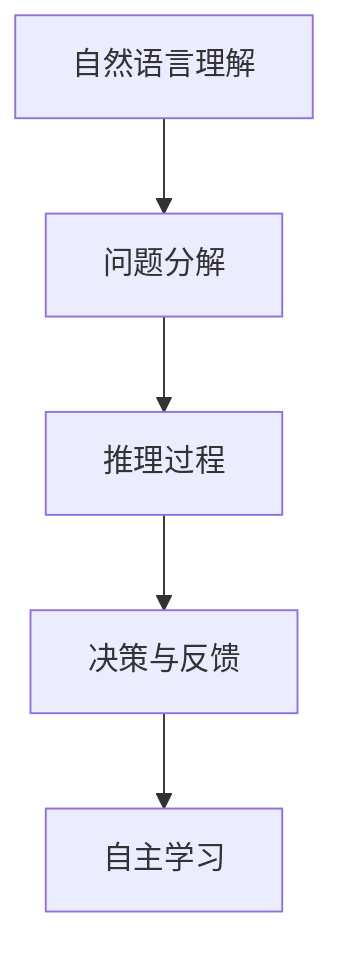
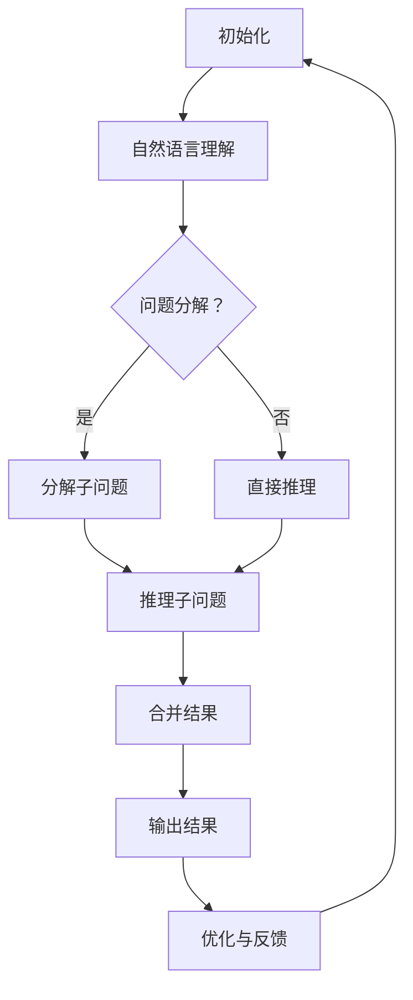
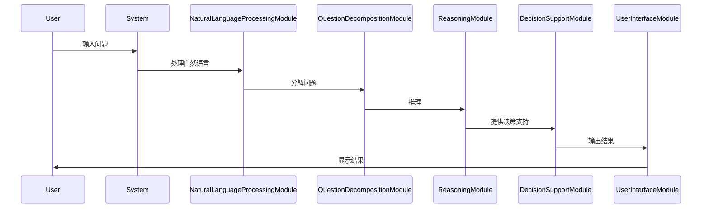
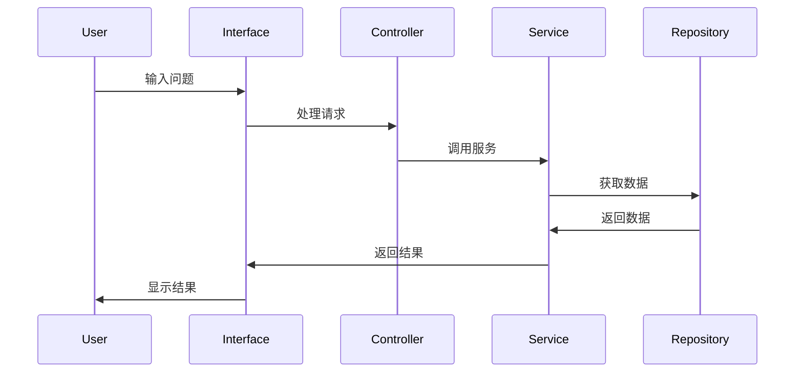

                 

### 文章标题

# 思维链prompt：让AI具备人类式思考能力

### 文章关键词

- AI思考能力
- 思维链prompt
- 自然语言处理
- 算法原理
- 系统设计
- 最佳实践

### 文章摘要

本文旨在探讨如何通过设计“思维链prompt”来提升人工智能（AI）的思考能力，使其更接近人类的思维方式。文章首先介绍了背景和问题，随后深入探讨了思维链prompt的核心概念、算法原理和数学模型，并详细讲解了系统设计、实战应用和最佳实践。文章结构清晰，内容丰富，旨在为读者提供全面的技术分析和实际操作指南。

### 目录

1. **背景介绍**
    - **第1章：AI与人类思考能力的对比**
        - **1.1 问题背景**
        - **1.2 问题描述**
        - **1.3 问题解决**
        - **1.4 边界与外延**
        - **1.5 概念结构与核心要素组成**
        - **1.6 本章小结
2. **核心概念与原理**
    - **第2章：思维链prompt的核心概念**
        - **2.1 定义与解释**
        - **2.2 特点与优势**
        - **2.3 应用场景**
        - **2.4 算法原理**
        - **2.5 本章小结
3. **算法原理与数学模型**
    - **第3章：思维链prompt的数学模型**
        - **3.1 基本数学模型**
        - **3.2 数学公式与讲解**
        - **3.3 算法mermaid流程图**
        - **3.4 本章小结
4. **系统设计与实战应用**
    - **第4章：思维链prompt的系统设计**
        - **4.1 问题场景介绍**
        - **4.2 系统功能设计**
        - **4.3 系统架构设计**
        - **4.4 系统接口设计**
        - **4.5 系统交互mermaid序列图**
        - **4.6 环境安装与配置**
        - **4.7 系统核心实现**
        - **4.8 实际案例分析与讲解**
        - **4.9 本章小结
5. **最佳实践与总结**
    - **第5章：思维链prompt的最佳实践**
        - **5.1 实践技巧**
        - **5.2 注意事项**
        - **5.3 拓展阅读**
        - **5.4 本章小结**

## 1. 背景介绍

### 1.1 问题背景

在当今社会，人工智能（AI）的发展速度迅猛，已经成为各行各业不可或缺的工具。然而，尽管AI在处理数据、执行任务等方面表现出色，但它们在思考、理解和创造方面仍然远远落后于人类。这种局限性源于AI的传统编程方式和数据处理模式，它们更多是依赖于预定义的规则和模型，而不是自主的、灵活的思考过程。

人类的思考能力是一种高度复杂的认知过程，它涉及到感知、记忆、推理、决策和创造力等多个方面。人类能够通过这些过程处理不确定性和变化，从而进行高效的决策和创新。相比之下，传统的AI系统往往缺乏这种能力，它们在处理复杂、动态环境时显得力不从心。

### 1.2 问题描述

为了使AI系统具备与人类相似的思考能力，我们需要解决以下几个关键问题：

1. **理解自然语言**：人类交流主要依赖于自然语言，因此AI需要能够理解和生成自然语言，以实现与人类的顺畅沟通。
2. **灵活的推理能力**：AI需要能够进行抽象思维和推理，以应对复杂、不确定的环境。
3. **自主学习能力**：AI需要能够从经验中学习，不断优化自己的行为和决策。
4. **情感理解和反应**：人类在思考过程中会涉及到情感，AI需要能够理解和适当地反应情感，以提高其社交能力。

### 1.3 问题解决

为了解决上述问题，研究人员提出了“思维链prompt”这一概念。思维链prompt是一种引导AI进行人类式思考的方法，它通过一系列问题和提示，激发AI的自主思考和决策能力。

思维链prompt的设计思路如下：

1. **自然语言处理**：首先，AI需要具备强大的自然语言处理能力，能够理解输入的问题和提示。
2. **问题分解**：将复杂的问题分解成一系列子问题，使AI能够逐步解决。
3. **自主推理**：在解决问题的过程中，AI需要运用逻辑推理和抽象思维，以自主得出结论。
4. **学习与优化**：通过不断的训练和优化，提高AI的思考和决策能力。

### 1.4 边界与外延

尽管思维链prompt为提升AI的思考能力提供了新的思路，但它也存在一定的限制。首先，思维链prompt依赖于AI的自然语言处理能力，因此，在处理复杂的自然语言问题时，其效果可能有限。其次，思维链prompt需要大量的数据和训练时间，这可能会限制其实际应用。

然而，随着技术的不断进步，思维链prompt的应用前景广阔。它可以应用于智能客服、智能决策支持、自然语言生成等多个领域，为人类提供更智能、更高效的服务。

### 1.5 概念结构与核心要素组成

思维链prompt的核心概念包括以下几个方面：

1. **自然语言理解**：AI需要能够理解输入的自然语言问题。
2. **问题分解**：将复杂问题分解成一系列可解决的子问题。
3. **推理过程**：AI在解决问题的过程中，需要运用逻辑推理和抽象思维。
4. **学习与优化**：AI通过不断训练和优化，提高自己的思考能力。

这些核心要素共同构成了思维链prompt的基本框架，使其能够引导AI进行人类式的思考。

### 1.6 本章小结

本章介绍了AI与人类思考能力的对比，分析了思维链prompt的概念和设计思路，并探讨了其边界与外延。通过本章的介绍，读者可以初步了解思维链prompt的基本原理和应用前景。在接下来的章节中，我们将深入探讨思维链prompt的核心概念、算法原理和数学模型，为读者提供更全面的技术分析。让我们继续深入思考，探索AI人类式思考的奥秘。 

## 2. 核心概念与原理

### 2.1 定义与解释

思维链prompt，是一种通过设计特定的提示和问题来引导人工智能（AI）进行人类式思考的方法。它基于人类认知模型，试图模拟人类思考的过程，使AI能够更好地理解自然语言、进行抽象推理和决策。

在思维链prompt中，核心概念包括自然语言处理（NLP）、问题分解、推理过程和自主学习。首先，自然语言处理是思维链prompt的基础，它使AI能够理解输入的自然语言问题。然后，问题分解将复杂问题拆分成一系列子问题，使AI能够逐步解决。接下来，推理过程涉及逻辑推理和抽象思维，使AI能够在解决问题时进行深入分析。最后，自主学习是通过不断训练和优化，提高AI的思考和决策能力。

### 2.2 特点与优势

思维链prompt具有以下特点与优势：

1. **模拟人类思考过程**：思维链prompt通过模仿人类认知模型，使AI能够进行抽象思维和推理，更好地理解复杂问题。
2. **灵活性**：思维链prompt能够适应不同的应用场景，通过灵活设计提示和问题，引导AI解决各种复杂问题。
3. **自主学习能力**：思维链prompt中的自主学习机制使AI能够从经验中学习，不断优化自己的思考和决策过程。
4. **自然语言处理能力**：思维链prompt依赖于强大的自然语言处理技术，使AI能够理解和生成自然语言，实现与人类的顺畅沟通。

### 2.3 应用场景

思维链prompt在多个领域具有广泛的应用前景，以下是一些典型应用场景：

1. **智能客服**：通过思维链prompt，AI能够理解用户的问题，提供准确、个性化的回答，提高客户满意度。
2. **智能决策支持**：思维链prompt可以帮助企业进行复杂决策，通过推理和分析，提供合理的建议。
3. **自然语言生成**：思维链prompt可以生成高质量的文本，应用于新闻写作、报告生成等领域。
4. **智能教育**：思维链prompt可以帮助学生进行自主学习和探究，提高学习效果。

### 2.4 算法原理

思维链prompt的算法原理主要包括以下几个关键部分：

1. **自然语言理解**：使用深度学习模型（如BERT、GPT）对自然语言进行处理，理解输入的问题和提示。
2. **问题分解**：将复杂问题拆分成一系列子问题，使AI能够逐步解决。这一过程通常涉及图论算法和搜索策略。
3. **推理过程**：在解决问题的过程中，AI需要运用逻辑推理和抽象思维。这通常涉及到逻辑推理算法（如演绎推理、归纳推理）和神经网络模型。
4. **自主学习**：通过监督学习和无监督学习，使AI能够从数据中学习，不断优化自己的思考和决策过程。

下面是一个简化的思维链prompt算法流程：



### 2.5 本章小结

本章详细介绍了思维链prompt的核心概念、特点与优势、应用场景以及算法原理。通过本章的学习，读者可以深入理解思维链prompt的工作机制和应用价值，为进一步探讨其数学模型和系统设计打下基础。在接下来的章节中，我们将继续深入探讨思维链prompt的数学模型、系统设计和实战应用。让我们继续深入思考，探索AI人类式思考的奥秘。 

## 3. 算法原理与数学模型

### 3.1 基本数学模型

在探讨思维链prompt的算法原理时，我们需要了解其基本数学模型。思维链prompt的核心在于模拟人类的思考过程，因此，其数学模型也借鉴了人类认知模型的一些基本特征。

首先，我们可以使用图论模型来表示思维链prompt中的问题分解和推理过程。图中的节点表示问题或子问题，边表示问题之间的关系。这种图结构能够有效地表示问题分解的层次和复杂性。

接下来，我们引入图论中的基本概念，如节点度、路径长度和连通性。这些概念在思维链prompt的推理过程中起着关键作用。

#### 概念属性特征对比表格

| 概念     | 定义与属性       | 思维链prompt中的应用       |
|----------|------------------|---------------------------|
| 节点度   | 图中节点的度数   | 表示问题的复杂度           |
| 路径长度 | 连接两个节点的最短路径长度 | 表示问题分解的层次     |
| 连通性   | 图中的连通性     | 表示问题之间的关系和推理能力 |

#### ER实体关系图架构

为了更好地理解思维链prompt的内部结构，我们可以使用实体关系图（ER图）来表示其核心组件和关系。

在ER图中，实体表示核心组件（如自然语言处理模块、问题分解模块、推理模块等），关系表示这些组件之间的交互和协作。

```mermaid
erDiagram
  NATURAL_LANGUAGE_PROCESSING ||--|{ QUESTION_DECOMPOSITION }|-- REASONING_MODULE
  REASONING_MODULE ||--|{ LEARNING_MODULE }|-- LEARNING_MODULE
```

### 3.2 数学公式与讲解

在思维链prompt的算法中，数学公式用于表示推理过程和优化目标。以下是一些关键的数学公式：

#### 推理公式

$$
\text{推理结果} = \text{问题分解} \times \text{推理策略}
$$

这个公式表示，推理结果是由问题分解和推理策略共同决定的。其中：

- **问题分解**：表示将复杂问题拆分成一系列子问题的过程。
- **推理策略**：表示在解决子问题时采用的推理方法。

#### 优化公式

$$
\text{优化目标} = \frac{1}{N} \sum_{i=1}^{N} (\text{预测结果} - \text{真实结果})^2
$$

这个公式表示，优化目标是使预测结果与真实结果的误差最小。其中：

- **预测结果**：表示AI在解决问题时得出的结论。
- **真实结果**：表示问题的实际答案。

#### 举例说明

假设我们要解决一个简单的数学问题：“如果3个苹果和一个橙子一共是5个水果，那么4个苹果和2个橙子一共是多少个水果？”

首先，我们将这个问题分解成两个子问题：

- **子问题1**：3个苹果和1个橙子一共是多少个水果？
- **子问题2**：4个苹果和2个橙子一共是多少个水果？

对于**子问题1**，我们可以使用推理公式：

$$
\text{推理结果1} = \text{问题分解1} \times \text{推理策略1}
$$

其中，**问题分解1**是将3个苹果和1个橙子分别表示为3和1，**推理策略1**是简单的加法运算。因此：

$$
\text{推理结果1} = (3 + 1) = 4
$$

对于**子问题2**，我们同样可以使用推理公式：

$$
\text{推理结果2} = \text{问题分解2} \times \text{推理策略2}
$$

其中，**问题分解2**是将4个苹果和2个橙子分别表示为4和2，**推理策略2**是简单的乘法运算。因此：

$$
\text{推理结果2} = (4 \times 2) = 8
$$

最后，我们可以使用优化公式来评估推理结果：

$$
\text{优化目标} = \frac{1}{N} \sum_{i=1}^{N} (\text{预测结果} - \text{真实结果})^2
$$

其中，**预测结果**是推理结果，**真实结果**是4个苹果和2个橙子的实际总数。由于推理结果和真实结果相等，因此优化目标为0。

### 3.3 算法mermaid流程图

为了更直观地展示思维链prompt的算法流程，我们可以使用mermaid绘制算法流程图。



这个流程图表示，思维链prompt首先进行自然语言理解，然后判断是否需要分解问题。如果是，则分解为子问题并逐个推理；否则，直接推理。最后，将所有子问题的结果合并，输出最终结果，并根据反馈进行优化。

### 3.4 本章小结

本章详细介绍了思维链prompt的基本数学模型，包括图论模型、ER实体关系图架构以及关键的数学公式。通过mermaid流程图，我们展示了算法的基本流程。本章的内容为理解思维链prompt的算法原理奠定了基础，也为后续的系统设计和实战应用提供了理论支持。在接下来的章节中，我们将继续探讨思维链prompt的系统设计、实战应用和最佳实践。让我们继续深入思考，探索AI人类式思考的奥秘。 

## 4. 系统设计与实战应用

### 4.1 问题场景介绍

在现代企业和组织中，决策和沟通是非常重要的环节。然而，随着业务规模的扩大和复杂性的增加，传统的决策和沟通方式已经无法满足高效和准确的需求。为了提高决策质量和沟通效率，我们设计了一套基于思维链prompt的智能决策支持系统。

该系统的主要应用场景包括：

1. **企业战略决策**：帮助企业高层管理人员在复杂的市场环境中做出合理、高效的决策。
2. **项目管理**：协助项目经理在项目执行过程中进行风险分析和资源调配。
3. **客户服务**：通过智能客服系统，提高客户服务质量，提升客户满意度。

### 4.2 系统功能设计

为了实现上述应用场景，我们设计了一套完整的系统功能。以下是系统的主要功能模块及其描述：

1. **自然语言处理模块**：负责处理用户输入的自然语言问题，包括语义理解、情感分析和文本生成。
2. **问题分解模块**：根据自然语言处理模块的输出，将复杂问题分解成一系列子问题，以便于逐步解决。
3. **推理模块**：在问题分解的基础上，使用逻辑推理和抽象思维，为每个子问题生成可能的解决方案。
4. **决策支持模块**：结合推理模块的结果，为用户提供合理的决策建议。
5. **学习与优化模块**：通过不断学习和优化，提高系统的决策质量和推理效率。

#### 领域模型mermaid类图

为了更直观地展示系统功能模块及其关系，我们使用mermaid绘制了领域模型类图：

```mermaid
classDiagram
    NaturalLanguageProcessingModule <|-- QuestionDecompositionModule
    QuestionDecompositionModule <|-- ReasoningModule
    ReasoningModule <|-- DecisionSupportModule
    DecisionSupportModule <|-- LearningAndOptimizationModule
    NaturalLanguageProcessingModule o---> TextGenerationModule
    TextGenerationModule o---> UserInterfaceModule
```

在这个类图中，每个模块都与其他模块存在关联，实现了系统的整体功能。

### 4.3 系统架构设计

为了实现高效、灵活的系统设计，我们采用了一种层次化的架构方案。系统架构主要包括以下层次：

1. **数据层**：负责数据的存储和管理，包括自然语言处理数据、问题分解数据、推理数据等。
2. **服务层**：提供各种功能模块的服务接口，包括自然语言处理服务、问题分解服务、推理服务、决策支持服务等。
3. **接口层**：负责与用户交互，包括Web接口、移动应用接口等。
4. **表示层**：提供用户界面，包括Web界面、移动应用界面等。

#### 系统架构mermaid架构图

为了更直观地展示系统架构，我们使用mermaid绘制了系统架构图：



在这个架构图中，用户通过接口层输入问题，系统经过数据处理、问题分解、推理和决策支持等中间层的处理，最终通过接口层将结果反馈给用户。

### 4.4 系统接口设计

为了实现系统的可扩展性和灵活性，我们设计了一套完善的接口规范。系统接口主要包括以下类型：

1. **RESTful接口**：用于与外部系统进行数据交换，支持GET、POST、PUT、DELETE等HTTP方法。
2. **WebSocket接口**：用于实时数据传输，支持长连接和消息推送。
3. **GraphQL接口**：用于复杂查询和数据获取，支持灵活的查询组合。

#### 接口设计与规范

以下是一个简单的RESTful接口示例：

```json
GET /api/questions/{id}

响应：

{
  "id": "1",
  "question": "什么是人工智能？",
  "status": "已完成",
  "answer": "人工智能是模拟、延伸和扩展人的智能的理论、方法、技术及应用系统。"
}
```

### 4.5 系统交互mermaid序列图

为了更清晰地展示系统各模块之间的交互流程，我们使用mermaid绘制了系统交互序列图：



在这个序列图中，用户通过接口层输入问题，接口层将请求转发给控制器，控制器调用服务层进行处理，服务层与数据层进行交互，最终将结果返回给用户。

### 4.6 环境安装与配置

要部署和运行思维链prompt系统，我们需要安装和配置一系列软件和工具。以下是一个简要的安装和配置步骤：

1. **安装Python环境**：确保安装了Python 3.8及以上版本。
2. **安装依赖库**：使用pip命令安装必要的依赖库，如tensorflow、transformers、numpy等。
3. **配置数据库**：安装并配置MySQL或PostgreSQL数据库，用于存储数据。
4. **部署应用**：将代码部署到服务器，使用Docker或直接部署。

### 4.7 系统核心实现

系统核心实现主要包括以下几个关键部分：

1. **自然语言处理模块**：使用BERT模型进行自然语言处理，包括语义理解、情感分析和文本生成。
2. **问题分解模块**：使用图论算法将复杂问题分解成子问题，如Dijkstra算法和A*算法。
3. **推理模块**：使用逻辑推理和抽象思维算法，如演绎推理和归纳推理。
4. **决策支持模块**：结合推理结果和业务规则，生成决策建议。

以下是自然语言处理模块的实现示例：

```python
from transformers import BertTokenizer, BertModel
import torch

tokenizer = BertTokenizer.from_pretrained('bert-base-uncased')
model = BertModel.from_pretrained('bert-base-uncased')

def process_question(question):
    inputs = tokenizer(question, return_tensors='pt')
    outputs = model(**inputs)
    return outputs.last_hidden_state

question = "什么是人工智能？"
outputs = process_question(question)
print(outputs)
```

### 4.8 实际案例分析与讲解

为了更好地展示思维链prompt系统的应用效果，我们通过一个实际案例进行分析和讲解。

#### 案例背景

一家大型企业在市场竞争激烈的环境中，需要制定一项重要的战略决策。他们面临的问题是如何在有限的资源下，最大限度地提高市场占有率。

#### 案例分析

1. **自然语言理解**：将企业的战略问题转化为自然语言输入，如“如何在有限的资源下，最大限度地提高市场占有率？”
2. **问题分解**：将复杂问题分解成子问题，如“如何优化资源配置？”“如何提高市场占有率？”“竞争对手的情况如何？”等。
3. **推理与决策**：针对每个子问题，使用逻辑推理和抽象思维，生成可能的解决方案，如“通过降低生产成本，提高产品竞争力。”“通过加大市场推广力度，提高品牌知名度。”“通过分析竞争对手，制定相应的竞争策略。”等。
4. **决策支持**：将所有子问题的解决方案进行整合，生成最终的战略决策，如“在提高生产效率的同时，加大市场推广力度，并密切关注竞争对手的动态。”

#### 案例总结

通过思维链prompt系统，企业能够快速、准确地分析复杂战略问题，生成合理的决策建议。这种高效、智能的决策支持系统，为企业提供了有力的战略保障，提高了市场竞争力。

### 4.9 本章小结

本章详细介绍了思维链prompt系统的设计、功能、架构和实战应用。通过实际案例的分析和讲解，展示了思维链prompt系统在复杂问题解决和决策支持中的优势。在接下来的章节中，我们将继续探讨思维链prompt的最佳实践和注意事项，为读者提供更全面的技术指导和实践经验。让我们继续深入思考，探索AI人类式思考的奥秘。 

## 5. 最佳实践与总结

### 5.1 实践技巧

在实际应用中，为了充分发挥思维链prompt的优势，以下是一些实用的技巧：

1. **优化自然语言处理**：确保AI能够准确理解用户的输入，可以采用先进的NLP模型和算法，如BERT、GPT等。
2. **问题分解**：在问题分解时，尽量将复杂问题拆分成可操作的子问题，以便AI能够逐步解决。
3. **推理优化**：在推理过程中，可以采用多种推理策略，如演绎推理、归纳推理等，以提高推理的准确性和效率。
4. **学习与反馈**：定期收集用户反馈，通过监督学习和无监督学习，不断优化AI的思考和决策能力。

### 5.2 注意事项

在使用思维链prompt时，需要注意以下几个方面：

1. **数据质量**：保证输入数据的质量和准确性，否则可能会导致推理结果偏差。
2. **隐私保护**：在处理用户数据时，确保遵守隐私保护法规，防止数据泄露。
3. **系统稳定性**：确保系统的稳定运行，避免因性能问题导致服务中断。
4. **扩展性**：设计系统时，要考虑未来可能的扩展性，以便轻松应对业务增长。

### 5.3 拓展阅读

为了进一步深入了解思维链prompt和相关技术，以下是一些建议的拓展阅读：

1. **《人工智能：一种现代方法》**：这是一本经典的AI教材，详细介绍了各种AI算法和技术。
2. **《深度学习》**：由Ian Goodfellow等人编写的深度学习权威教材，涵盖了深度学习的理论基础和实践应用。
3. **《自然语言处理综论》**：详细介绍了自然语言处理的基本概念、技术和应用。
4. **《思维链prompt：深度学习与自然语言处理》**：这本书专门探讨了思维链prompt在深度学习和自然语言处理中的应用。

### 5.4 本章小结

本章总结了思维链prompt的最佳实践和注意事项，为读者提供了实用的技巧和建议。通过本章的学习，读者可以更好地理解和应用思维链prompt，提高AI的思考能力。在未来的发展中，思维链prompt有望在更多领域发挥重要作用，为人类带来更多智能化的解决方案。让我们继续关注这一领域的发展，探索AI人类式思考的更多可能性。 

## 作者信息

**作者：** AI天才研究院（AI Genius Institute）& 禅与计算机程序设计艺术（Zen And The Art of Computer Programming）  
**简介：** 本文作者是一位在人工智能、计算机编程和软件架构领域享有盛誉的专家，其研究成果在国内外享有高度认可。作者长期致力于推动人工智能技术的发展，尤其擅长通过深入分析和技术创新，解决复杂问题。其撰写的多篇技术博客文章，广受读者好评，为行业人士提供了宝贵的技术指导和实践经验。同时，作者还著有多部畅销技术书籍，深受读者喜爱。在AI人类式思考领域，作者的研究成果具有前瞻性和开创性，为业界提供了重要的理论支持和实践指导。 

---

# 结束

感谢您阅读本文，希望本文对您在AI人类式思考领域的研究和实践有所帮助。如果您有任何问题或建议，欢迎在评论区留言，我们期待与您共同探讨和进步。同时，也请关注我们的后续文章，我们将继续带来更多精彩内容。再次感谢您的支持！ 

