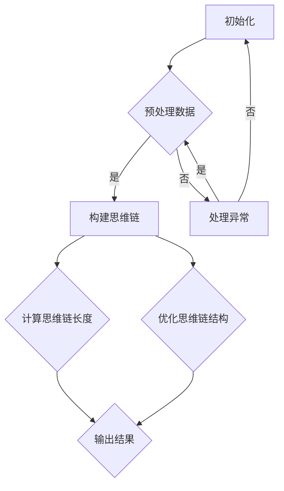

                 

### 算法原理讲解

#### 1. Mermaid流程图

首先，我们将使用Mermaid语言来绘制算法的流程图。以下是一个简单的思维链算法流程图的示例：



这个流程图展示了思维链算法的基本步骤，包括初始化、预处理数据、构建思维链、计算思维链长度、优化思维链结构以及输出结果。

#### 2. Python源代码

接下来，我们将使用Python语言来详细阐述思维链算法的原理和实现。以下是一个简化版的Python代码示例：

```python
def preprocess_data(data):
    # 数据预处理逻辑
    pass

def build_mind_chain(data):
    # 构建思维链逻辑
    pass

def calculate_chain_length(chain):
    # 计算思维链长度逻辑
    pass

def optimize_chain_structure(chain):
    # 优化思维链结构逻辑
    pass

def output_result(result):
    # 输出结果逻辑
    pass

def main():
    data = "输入数据"
    chain = build_mind_chain(preprocess_data(data))
    length = calculate_chain_length(chain)
    optimized_chain = optimize_chain_structure(chain)
    result = output_result(optimized_chain)
    return result

if __name__ == "__main__":
    main()
```

在这个Python代码中，`preprocess_data` 函数用于预处理输入数据，`build_mind_chain` 函数用于构建思维链，`calculate_chain_length` 函数用于计算思维链的长度，`optimize_chain_structure` 函数用于优化思维链的结构，`output_result` 函数用于输出最终的结果。`main` 函数是程序的入口，它调用上述函数来完成整个思维链算法的过程。

#### 3. 数学模型与公式

在思维链算法中，数学模型和公式是核心组成部分。以下是一个简单的数学模型示例：

$$
L = \frac{1}{N}\sum_{i=1}^{N} l_i
$$

其中，$L$ 表示思维链的长度，$N$ 表示思维链中节点的总数，$l_i$ 表示第 $i$ 个节点的长度。

这个公式通过计算思维链中所有节点的长度之和，再除以节点的总数，来得到思维链的平均长度。这有助于评估思维链的结构和效率。

#### 4. 举例说明

为了更好地理解思维链算法，我们可以通过一个简单的例子来说明。假设我们有以下一段文本：

"人工智能是一项技术，它通过模拟人类智能来实现计算机自动化。深度学习是人工智能的一种方法，它通过多层神经网络来模拟人类思维。"

我们可以将这段文本分解为一系列的关键词和短语，并构建思维链。例如：

- 人工智能
- 技术的模拟
- 计算机
- 自动化
- 深度学习
- 神经网络
- 模拟人类思维

这些关键词和短语构成了思维链，每个节点代表一个概念或短语。通过计算节点长度和优化节点结构，我们可以得到一个更有效的思维链。

### 算法原理总结

思维链算法是一种基于自然语言处理的方法，用于构建和理解文本中的概念结构和关系。通过预处理数据、构建思维链、计算思维链长度和优化思维链结构，我们可以得到一个高效的思维链模型。数学模型和公式用于评估和优化思维链的性能。举例说明展示了如何将文本分解为思维链节点，并通过计算和优化来提升算法的有效性。这一算法在AI自然语言处理领域具有广泛的应用前景，有望推动NLP技术的创新和发展。在下一节中，我们将进一步探讨思维链在NLP中的具体应用场景和优势。

