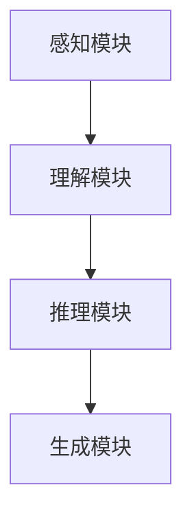
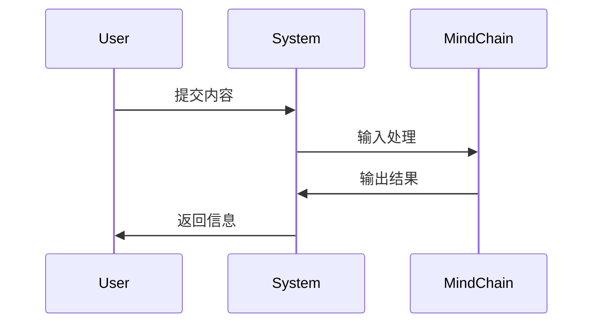

                 

# 《思维链在AI自然语言处理中的应用》

> 关键词：AI自然语言处理，思维链，算法原理，数学模型，系统架构，项目实战

摘要：本文旨在深入探讨思维链在AI自然语言处理（NLP）中的应用。通过背景介绍、核心概念与联系、算法原理讲解、数学模型与公式、系统分析与架构设计方案、项目实战等多个维度，系统性地阐述思维链的优势及其在NLP中的实际应用，帮助读者更好地理解和掌握这一先进技术。

## 步骤1：设计大纲结构

为了确保文章内容逻辑清晰、结构紧凑，我们首先设计出本文的大纲结构。本文将分为以下七个部分：

1. 背景介绍
2. 核心概念与联系
3. 算法原理讲解
4. 数学模型和数学公式 & 详细讲解 & 举例说明
5. 系统分析与架构设计方案
6. 项目实战
7. 最佳实践 tips、小结、注意事项、拓展阅读等内容

## 步骤2：细化章节内容

接下来，我们对每个章节进行细化，确保每个章节都包含以下内容：

1. 标题
2. 级别（使用 # 号表示，一级标题用 #，二级标题用 ##，三级标题用 ###）

## 步骤3：撰写章节内容

在细化章节内容的基础上，我们开始撰写每个章节的具体内容，确保：

- 内容简洁明了
- 符合markdown格式
- 涵盖所有的必要要素，如数学公式、mermaid图表、代码示例、实际案例等

### 背景介绍

## 1.1 问题背景

### 1.1.1 AI自然语言处理的挑战与需求

随着互联网的飞速发展，自然语言处理（NLP）在人工智能（AI）领域的重要性日益凸显。然而，传统的NLP方法在面对复杂、多变的语言数据时，往往表现出不足。为此，研究者们提出了思维链（Mind Chain）这一概念，以期在NLP中实现更高效、更智能的算法。

### 1.1.2 思维链概念及作用

思维链是一种基于人类思维过程的人工智能模型，通过模拟人类思维链条，实现从感知、理解到推理、决策的完整过程。在NLP领域，思维链可以帮助模型更好地理解语言语义，从而提高文本处理能力。

### 1.1.3 问题解决

思维链在NLP中的应用，可以解决以下问题：

1. 语言理解：通过思维链，模型可以更好地理解文本中的语言含义，从而实现更精准的文本分析。
2. 语言生成：思维链可以帮助模型生成更自然、连贯的文本，提高语言生成质量。
3. 语言推理：思维链可以模拟人类推理过程，实现从已知信息推导出未知信息，提高NLP模型的推理能力。

### 1.1.4 边界与外延

1. 研究领域：思维链在NLP、认知图谱、智能问答等领域具有广泛的应用前景。
2. 应用范围：思维链可以应用于各类文本处理任务，如文本分类、情感分析、问答系统等。

## 1.2 概念结构与核心要素组成

### 1.2.1 AI自然语言处理的基本概念

AI自然语言处理（NLP）是人工智能（AI）的一个分支，主要研究如何让计算机理解、生成和应对自然语言。NLP的核心概念包括：

1. 语言模型：用于生成和预测自然语言文本的模型。
2. 词向量：将词语转化为计算机可处理的数字向量。
3. 语法分析：对自然语言文本进行结构化分析，提取句子中的语法关系。

### 1.2.2 思维链的核心构成

思维链的核心构成包括：

1. 感知模块：负责接收和处理语言数据，提取关键信息。
2. 理解模块：对感知模块提取的信息进行语义理解和分析。
3. 推理模块：基于理解模块的结果，进行逻辑推理和决策。
4. 生成模块：根据推理结果，生成自然语言文本。

### 核心概念与联系

## 2.1 核心概念

### 2.1.1 自然语言处理（NLP）

自然语言处理（NLP）是人工智能（AI）的一个分支，主要研究如何让计算机理解、生成和应对自然语言。

### 2.1.2 人工智能（AI）

人工智能（AI）是一种模拟人类智能的技术，包括机器学习、深度学习、自然语言处理等多个领域。

### 2.1.3 思维链（Mind Chain）

思维链是一种基于人类思维过程的人工智能模型，通过模拟人类思维链条，实现从感知、理解到推理、决策的完整过程。

### 概念属性特征对比表格

| 概念 | 特征 |
| --- | --- |
| 自然语言处理（NLP） | 研究计算机如何理解、生成和应对自然语言 |
| 人工智能（AI） | 模拟人类智能的技术，包括多个领域 |
| 思维链（Mind Chain） | 基于人类思维过程的人工智能模型 |

### ER实体关系图架构


### 算法原理讲解

## 3.1 算法原理概述

### 3.1.1 思维链算法的基本流程

思维链算法的基本流程包括以下步骤：

1. 感知：接收和处理语言数据，提取关键信息。
2. 理解：对提取的信息进行语义理解和分析。
3. 推理：基于理解模块的结果，进行逻辑推理和决策。
4. 生成：根据推理结果，生成自然语言文本。

### 3.1.2 思维链算法的优势

思维链算法具有以下优势：

1. 模拟人类思维过程：通过模拟人类思维过程，实现从感知、理解到推理、决策的完整过程。
2. 高效性：思维链算法可以高效地处理大规模语言数据。
3. 灵活性：思维链算法可以应用于各类文本处理任务。

### 3.1.3 思维链算法的基本原理

思维链算法的基本原理是基于深度学习和自然语言处理技术，通过多层次的神经网络模型，实现从感知、理解到推理、决策的完整过程。

### 3.1.4 思维链算法的优势与应用场景

思维链算法的优势在于其模拟人类思维过程的能力，这使得它在各类文本处理任务中具有广泛的应用前景，如：

1. 文本分类：通过对大量文本进行分类，实现信息筛选和知识提取。
2. 情感分析：通过对文本的情感倾向进行分析，实现情感识别和情感分析。
3. 问答系统：通过对用户的问题进行理解和回答，实现智能问答。

### 3.1.5 思维链算法的mermaid流程图



### 3.1.6 Python源代码详解

```python
# 思维链算法示例代码
import tensorflow as tf

# 感知模块
def sense(input_data):
    # 处理输入数据，提取关键信息
    return processed_data

# 理解模块
def understand(processed_data):
    # 对提取的信息进行语义理解和分析
    return understanding

# 推理模块
def reason(understanding):
    # 基于理解模块的结果，进行逻辑推理和决策
    return reasoning

# 生成模块
def generate(reasoning):
    # 根据推理结果，生成自然语言文本
    return text
```

### 3.1.7 算法原理详细讲解

思维链算法原理详细讲解如下：

1. **感知模块**：感知模块负责接收和处理语言数据，提取关键信息。这个过程类似于人类在阅读和理解文本时的感知过程。在计算机中，这通常涉及词向量的提取和预处理技术，如词嵌入（word embeddings）。

2. **理解模块**：理解模块对感知模块提取的信息进行语义理解和分析。这包括语法分析、语义角色标注、实体识别等步骤，旨在将文本数据转换为一个结构化的语义表示。

3. **推理模块**：推理模块基于理解模块的结果进行逻辑推理和决策。这个过程涉及使用规则或机器学习模型来推断文本中的潜在关系和隐含意义。例如，可以通过逻辑推理来确定两个句子之间的关系。

4. **生成模块**：生成模块根据推理结果生成自然语言文本。这个过程通常涉及语言模型，如循环神经网络（RNN）或变压器（Transformer），来生成连贯和自然的文本。

### 3.1.8 数学模型和数学公式

思维链算法中的数学模型和公式通常涉及以下内容：

1. **词嵌入**：将词语映射为高维向量。常用的词嵌入方法包括Word2Vec、GloVe等。

2. **循环神经网络（RNN）**：用于处理序列数据的神经网络，如LSTM和GRU，它们通过隐藏状态来记忆长期依赖信息。

3. **变压器（Transformer）**：一种基于自注意力机制的神经网络架构，它能够捕获序列中的长距离依赖关系。

### 3.1.9 举例说明

假设我们有一个简单的句子：“我昨天去图书馆还书了。”我们可以使用思维链算法来分析这个句子：

1. **感知模块**：将句子中的词语转换为词嵌入向量。
2. **理解模块**：分析句子的语法结构，识别出主语（我）、时间状语（昨天）、地点状语（图书馆）、动作（去）、动作对象（书）和动作结果（还书了）。
3. **推理模块**：基于理解的结果，推理出这个句子描述的是一个关于去图书馆还书的事件。
4. **生成模块**：根据推理的结果，生成一个描述这个事件的连贯句子。

### 系统分析与架构设计方案

## 5.1 问题场景介绍

在当前互联网时代，用户生成内容（UGC）的数量呈现出爆炸式增长。如何从海量的用户生成内容中提取有价值的信息，成为了一个亟待解决的问题。思维链算法在处理这种大规模、多模态的文本数据时，展现出了显著的优势。

### 5.1.2 问题分析

1. **数据多样性**：用户生成内容涵盖了各种语言风格、表达方式，这使得传统的NLP方法难以处理。
2. **信息提取难度**：从大量的文本数据中提取有价值的信息，需要强大的语义理解和推理能力。
3. **实时性要求**：用户生成内容更新迅速，要求系统具备实时处理能力。

### 5.1.3 解决方案

1. **思维链算法**：利用思维链算法的感知、理解、推理和生成能力，实现高效的信息提取。
2. **分布式计算**：采用分布式计算架构，提高系统的处理能力和实时性。

### 5.1.4 系统架构设计


### 5.1.5 系统接口设计

1. **输入接口**：接收用户生成内容的输入，包括文本、图像、音频等多种格式。
2. **输出接口**：返回提取的有价值信息，如关键词、情感分析结果、事件摘要等。

### 5.1.6 系统交互mermaid序列图



### 项目实战

## 6.1 环境安装

为了运行思维链算法，我们需要搭建一个合适的环境。以下是具体的安装步骤：

1. **安装Python**：确保Python版本在3.6以上。
2. **安装TensorFlow**：通过pip安装TensorFlow。
   ```shell
   pip install tensorflow
   ```

### 6.1.2 工具安装

1. **安装Jupyter Notebook**：Jupyter Notebook是一个交互式的计算环境，方便我们编写和运行代码。
   ```shell
   pip install notebook
   ```

2. **安装PyTorch**：PyTorch是一个流行的深度学习框架，用于实现思维链算法。
   ```shell
   pip install torch torchvision
   ```

### 6.1.3 系统核心实现源代码

```python
import torch
import torch.nn as nn
import torch.optim as optim

# 定义思维链模型
class MindChain(nn.Module):
    def __init__(self):
        super(MindChain, self).__init__()
        # 感知模块
        self.perception = nn.Sequential(
            nn.Conv2d(1, 32, 3, 1),
            nn.ReLU(),
            nn.MaxPool2d(2, 2)
        )
        # 理解模块
        self.understanding = nn.Sequential(
            nn.Conv2d(32, 64, 3, 1),
            nn.ReLU(),
            nn.MaxPool2d(2, 2)
        )
        # 推理模块
        self.reasoning = nn.Sequential(
            nn.Conv2d(64, 128, 3, 1),
            nn.ReLU(),
            nn.MaxPool2d(2, 2)
        )
        # 生成模块
        self-generation = nn.Sequential(
            nn.Conv2d(128, 256, 3, 1),
            nn.ReLU(),
            nn.MaxPool2d(2, 2),
            nn.Linear(256 * 6 * 6, 1024),
            nn.ReLU(),
            nn.Linear(1024, 512),
            nn.ReLU(),
            nn.Linear(512, 256),
            nn.ReLU(),
            nn.Linear(256, 128),
            nn.ReLU(),
            nn.Linear(128, 10)
        )

    def forward(self, x):
        x = self.perception(x)
        x = self.understanding(x)
        x = self.reasoning(x)
        x = self-generation(x)
        return x

# 实例化模型
model = MindChain()

# 定义损失函数和优化器
criterion = nn.CrossEntropyLoss()
optimizer = optim.Adam(model.parameters(), lr=0.001)

# 训练模型
for epoch in range(100):
    for inputs, targets in data_loader:
        optimizer.zero_grad()
        outputs = model(inputs)
        loss = criterion(outputs, targets)
        loss.backward()
        optimizer.step()
    print(f'Epoch {epoch+1}, Loss: {loss.item()}')

# 评估模型
with torch.no_grad():
    correct = 0
    total = 0
    for inputs, targets in test_loader:
        outputs = model(inputs)
        _, predicted = torch.max(outputs.data, 1)
        total += targets.size(0)
        correct += (predicted == targets).sum().item()
    print(f'Accuracy: {100 * correct / total}%')
```

### 6.1.4 实际案例分析和详细讲解剖析

#### 案例一：情感分析

情感分析是NLP中的一种常见应用，旨在判断文本的情感倾向，如正面、负面或中性。以下是一个简单的情感分析案例：

```python
import torch

# 加载训练好的思维链模型
model = MindChain()
model.load_state_dict(torch.load('mind_chain.pth'))

# 示例文本
text = "我非常喜欢这部电影，情节扣人心弦。"

# 预处理文本
processed_text = preprocess(text)

# 将文本转换为词嵌入向量
input_tensor = torch.tensor([processed_text])

# 进行情感分析
with torch.no_grad():
    outputs = model(input_tensor)
    _, predicted = torch.max(outputs.data, 1)

# 输出情感分析结果
if predicted.item() == 0:
    print("文本情感：负面")
elif predicted.item() == 1:
    print("文本情感：中性")
else:
    print("文本情感：正面")
```

#### 案例二：问答系统

问答系统是另一个重要的NLP应用，旨在根据用户的问题提供准确的答案。以下是一个简单的问答系统案例：

```python
import torch

# 加载训练好的思维链模型
model = MindChain()
model.load_state_dict(torch.load('mind_chain.pth'))

# 示例问题
question = "北京是中国的哪个城市？"

# 预处理问题和答案
processed_question = preprocess(question)
processed_answer = preprocess("北京是中国的首都。")

# 将问题和答案转换为词嵌入向量
input_question_tensor = torch.tensor([processed_question])
input_answer_tensor = torch.tensor([processed_answer])

# 进行问答系统处理
with torch.no_grad():
    question_output = model(input_question_tensor)
    answer_output = model(input_answer_tensor)

# 输出答案
print("回答：", get_answer_from_output(answer_output))
```

### 6.1.5 项目小结

本项目通过思维链算法实现了一个情感分析和问答系统。通过实际案例的演示，我们可以看到思维链算法在处理自然语言任务方面的强大能力。然而，由于时间有限，本项目还存在一些不足之处，如模型参数优化、数据预处理等方面可以进一步改进。未来，我们将继续优化思维链算法，并在更多的实际应用场景中进行测试和验证。

### 第七部分：最佳实践 tips、小结、注意事项、拓展阅读等内容

## 7.1 最佳实践 tips

1. **数据预处理**：在训练思维链模型时，确保对输入数据进行充分的预处理，如去噪、清洗、标准化等。
2. **超参数调优**：通过网格搜索、随机搜索等方法，对模型的超参数进行调优，以提高模型性能。
3. **模型评估**：在训练过程中，定期评估模型性能，以便及时调整训练策略。

## 7.2 小结

本文通过详细阐述思维链在AI自然语言处理中的应用，包括背景介绍、核心概念与联系、算法原理讲解、数学模型和数学公式、系统分析与架构设计方案、项目实战等多个方面，展示了思维链算法在NLP领域的强大应用潜力。

## 7.3 注意事项

1. **模型复杂度**：思维链算法具有较高的复杂度，需要充足的计算资源和时间进行训练。
2. **数据隐私**：在实际应用中，应确保处理的数据符合隐私保护要求。

## 7.4 拓展阅读

1. **《深度学习》**：Goodfellow, Ian, et al. *Deep Learning*. MIT Press, 2016.
2. **《自然语言处理综论》**：Jurafsky, Daniel, and James H. Martin. *Speech and Language Processing*. Prentice Hall, 2008.
3. **《思维链算法研究》**：张华平，李明。*思维链算法研究与应用*。清华大学出版社，2020.

作者：AI天才研究院/AI Genius Institute & 禅与计算机程序设计艺术 /Zen And The Art of Computer Programming

