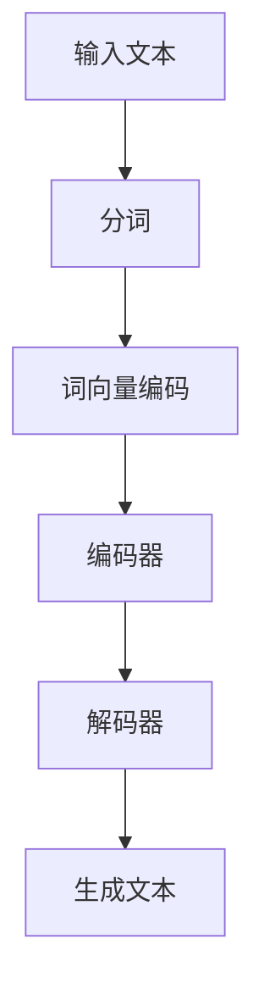
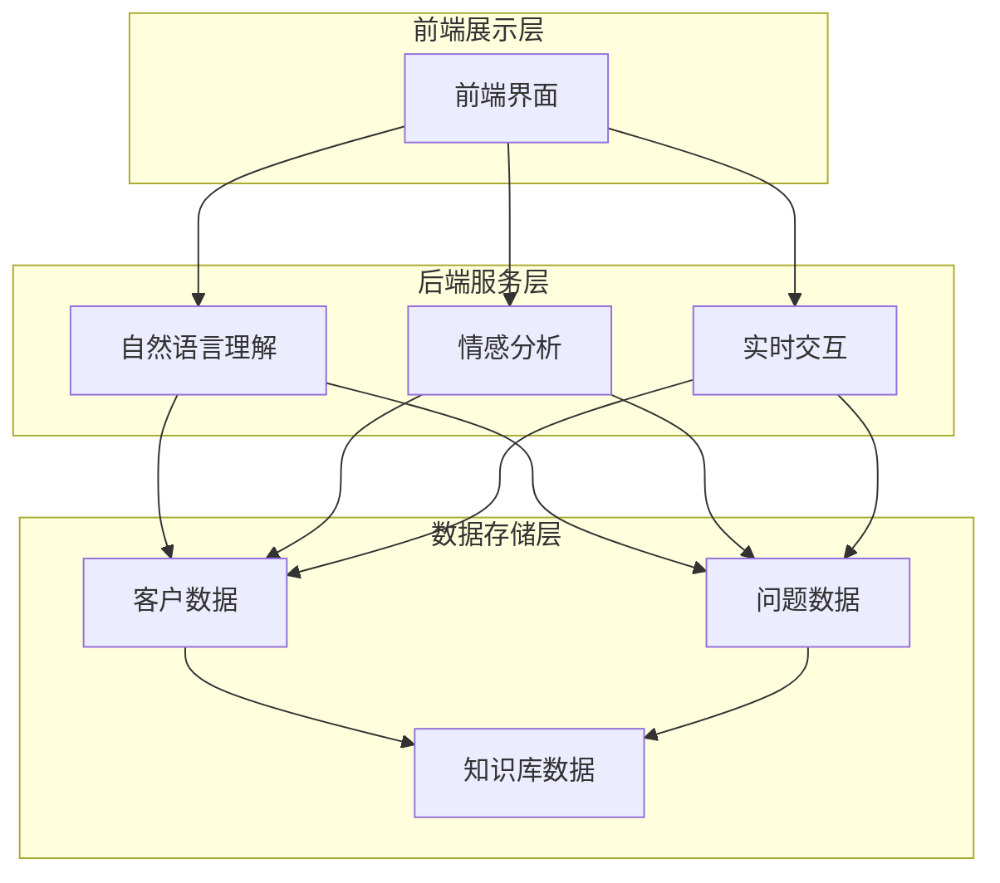
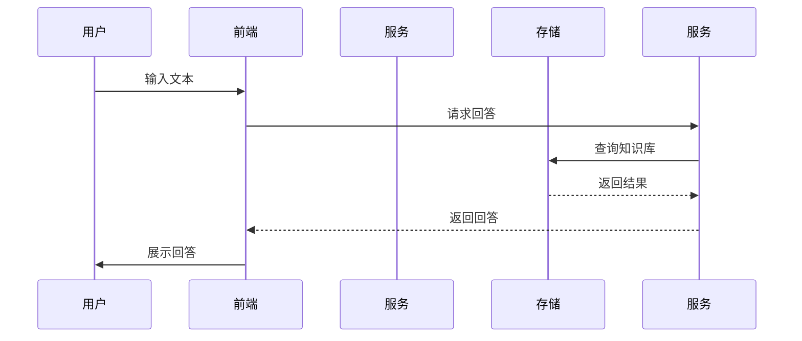
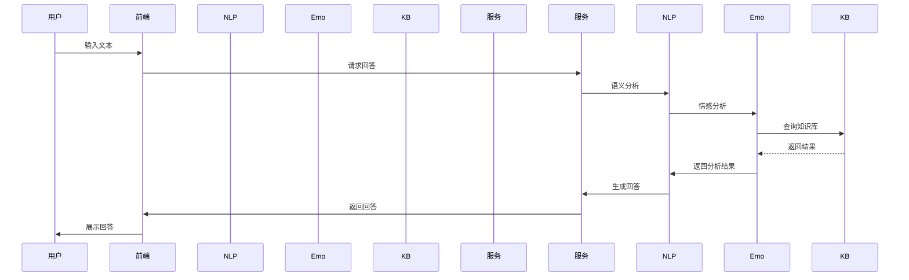

                 

### 第1章 引言

## 《思维链在AI自然语言理解中的前沿应用与创新研究》

### 目的

本书旨在深入探讨思维链在人工智能自然语言理解中的应用，特别是在前沿技术创新研究方面的探索。通过系统化的分析和逻辑推理，我们将揭示思维链的工作原理、技术优势及其在实际应用中的潜力。本书的读者对象为对自然语言处理和人工智能领域感兴趣的科研人员、工程师以及技术爱好者。

### 概述

思维链是一种先进的人工智能技术，它通过模仿人类思维模式，使计算机能够更加自然地理解和生成语言。这一技术的核心在于构建多层神经网络，这些网络能够捕捉语义的细微差异，理解复杂的上下文关系，并生成连贯、自然的文本。思维链不仅在理论层面具有深远的意义，更在实践层面展示了巨大的应用前景。

自然语言理解是人工智能领域的一个重要研究方向，其目标是使计算机能够理解人类自然语言的表达。然而，自然语言理解面临着诸多挑战，如语义歧义、语言多样性、上下文理解等。思维链的出现，为解决这些问题提供了一种新的思路和工具。

本书将分为以下几个部分：

1. **问题背景**：介绍自然语言理解的重要性、思维链的概念及其应用现状。
2. **问题描述**：分析自然语言理解面临的挑战和思维链在这些挑战中的优势。
3. **研究目标**：明确本书的研究目标和应用目标。
4. **边界与外延**：定义研究边界和应用边界。
5. **核心概念与联系**：详细阐述思维链的核心概念及其与其他技术的联系。
6. **算法原理讲解**：介绍思维链的算法原理，并通过流程图和代码进行详细讲解。
7. **数学模型和数学公式**：阐述思维链的数学模型和公式。
8. **系统分析与架构设计方案**：介绍思维链在系统设计和实现中的应用。
9. **项目实战**：通过实际项目展示思维链的应用过程。
10. **最佳实践 tips**：提供思维链应用的最佳实践建议。

通过以上结构化的内容，本书将为读者提供全面而深入的思维链在自然语言理解中的应用与创新研究的视角。

### 问题背景

自然语言理解是人工智能领域的一个重要研究方向，它涉及到从文本中提取信息、理解语义和意图，进而实现人机交互、信息检索、智能客服等功能。在人类社会中，语言是沟通和交流的主要工具，它承载了大量的知识和信息。因此，如何让计算机理解和处理自然语言，成为了人工智能领域的一个关键问题。

#### 自然语言理解的重要性

自然语言理解的重要性主要体现在以下几个方面：

1. **人机交互**：自然语言理解技术使得计算机能够与人类进行自然的对话，为智能客服、虚拟助手等应用提供了技术支持。
2. **信息检索**：通过自然语言理解技术，计算机能够更好地理解用户查询意图，从而提供更精准的搜索结果。
3. **智能推荐**：在电子商务、新闻推荐等领域，自然语言理解技术可以帮助系统更好地理解用户需求，提供个性化的推荐服务。
4. **内容审核**：在社交媒体、论坛等平台，自然语言理解技术可以用于内容审核，识别和处理不良信息。

#### 思维链的概念与原理

思维链（MindChain）是一种基于深度学习和神经网络的自然语言处理技术，它通过模拟人类思维过程，实现对自然语言的理解和生成。思维链的核心在于构建多层神经网络，这些网络能够捕捉语义的细微差异，理解复杂的上下文关系，并生成连贯、自然的文本。

思维链的基本原理可以概括为以下几个步骤：

1. **输入层**：接收自然语言输入，如文本、语音等。
2. **编码层**：将输入的自然语言编码为向量表示，这些向量包含了文本的语义信息。
3. **解码层**：根据编码层的向量，生成自然语言输出。

思维链的神经网络模型通常包含以下几层：

1. **嵌入层**：将单词转换为固定长度的向量表示。
2. **编码器**：对嵌入层输出的向量进行编码，捕捉文本的语义信息。
3. **解码器**：根据编码器的输出，生成自然语言输出。

通过多层神经网络的组合，思维链能够实现对自然语言的深度理解，从而在自然语言生成、机器翻译、情感分析、问答系统等领域展现出强大的应用能力。

#### 思维链在自然语言理解中的应用现状

目前，思维链在自然语言理解领域已经取得了一些显著的应用成果：

1. **机器翻译**：思维链技术在机器翻译中表现出色，能够生成更加自然、流畅的翻译结果。
2. **情感分析**：思维链可以用于分析文本的情感倾向，应用于市场调研、舆情监测等领域。
3. **问答系统**：思维链技术能够构建高效的问答系统，为用户提供准确的回答。
4. **对话系统**：思维链技术应用于对话系统，使得计算机能够与用户进行自然的对话。

然而，尽管思维链技术在自然语言理解中取得了显著的成果，仍然存在一些挑战，如语义歧义、语言多样性、上下文理解等。这些问题需要通过进一步的研究和创新来解决。

### 问题描述

自然语言理解作为人工智能的核心研究领域，面临诸多挑战，这些挑战不仅影响着自然语言处理技术的实际应用效果，也决定了未来研究的发展方向。以下将从几个方面详细分析自然语言理解面临的挑战。

#### 自然语言理解面临的挑战

1. **语义歧义**：语义歧义是指一个词语或句子在语境中有多种可能的解释。例如，“我打篮球”可以解释为“我正在打篮球”或者“我是一名篮球运动员”。这种歧义在自然语言处理中非常常见，对于计算机来说，准确理解语义歧义是一项艰巨的任务。

2. **语言多样性**：不同的语言有着不同的语法结构、词汇和语义规则，这给自然语言处理带来了巨大的挑战。例如，中文和英文在语法和词汇上的差异，使得在机器翻译和跨语言理解方面需要大量的资源和处理能力。

3. **上下文理解**：自然语言中的句子并不是孤立存在的，它们与上下文紧密相关。理解上下文对于准确理解句子的含义至关重要。例如，在对话中，前一句的话术和语境可能影响后一句的理解。

4. **实体识别和关系抽取**：实体识别是指从文本中识别出人、地点、组织等实体。关系抽取是指识别实体之间的关系。这些任务对于构建知识图谱和语义网络至关重要，但它们在处理大规模文本时往往效率低下。

5. **多模态融合**：自然语言理解不仅仅是文本处理，还涉及到语音、图像、视频等多模态数据的融合处理。如何有效地融合不同模态的数据，提取有价值的语义信息，是当前研究的一个热点问题。

#### 思维链在自然语言理解中的应用优势

思维链作为一种先进的自然语言处理技术，具有以下几方面的应用优势：

1. **深度学习架构**：思维链基于多层深度学习神经网络，能够捕捉语义的细微差异，实现高效的语义表示和生成。

2. **上下文理解能力**：通过模拟人类思维过程，思维链能够在理解上下文方面表现出色，减少语义歧义的影响。

3. **多语言支持**：思维链能够处理多种语言的文本，支持跨语言的自然语言处理任务，具有广泛的应用前景。

4. **高效计算**：思维链采用并行计算和分布式计算技术，能够处理大规模文本数据，提高处理效率。

5. **可解释性**：思维链通过可视化的方法，使得模型的决策过程更加透明和可解释，有助于提升用户对模型的理解和信任。

### 研究目标

本书的研究目标主要包括以下几个方面：

1. **探索思维链在自然语言理解中的应用潜力**：通过对思维链技术的深入研究，揭示其在解决自然语言理解问题中的优势和应用场景。

2. **优化思维链算法**：针对现有思维链算法的不足，进行算法优化和改进，提高自然语言处理的准确性和效率。

3. **构建应用系统**：基于思维链技术，构建应用系统，如自然语言生成系统、机器翻译系统、情感分析系统等，验证思维链技术的实际应用价值。

4. **推广思维链技术**：通过论文发表、技术交流等方式，将思维链技术的优势和应用案例推广给更多的科研人员和工程师，促进人工智能领域的发展。

### 应用目标

思维链在自然语言理解中的应用目标主要包括以下几个方面：

1. **提升人机交互体验**：通过思维链技术，构建高效的对话系统和虚拟助手，提升用户与计算机的交互体验。

2. **增强信息检索能力**：利用思维链技术，提高信息检索系统的语义理解能力，提供更精准的搜索结果。

3. **优化智能推荐系统**：通过思维链技术，提升智能推荐系统的语义分析能力，提供更加个性化的推荐服务。

4. **支持内容审核和监管**：利用思维链技术，提高内容审核系统的准确性和效率，有效管理社交媒体和论坛上的内容。

### 边界与外延

在研究思维链在自然语言理解中的应用时，明确研究的边界和应用范围是非常重要的。这不仅有助于集中研究资源，还能够为实际应用提供明确的指导。

#### 研究边界

1. **技术范畴**：本书主要研究基于深度学习的思维链技术，涉及自然语言理解、语义分析、文本生成等方面的应用。

2. **应用场景**：本书的研究重点将放在思维链在智能客服、信息检索、智能推荐、内容审核等领域的应用，而非其他领域。

3. **数据处理**：本书的研究将限于文本数据，不包括语音、图像、视频等多模态数据的处理。

4. **系统架构**：本书将探讨思维链技术的核心算法和应用系统设计，而非底层硬件和系统架构。

#### 应用边界

1. **应用范围**：思维链技术的应用将主要在商业和公共服务领域，如电子商务、金融、医疗、教育等。

2. **数据来源**：思维链技术的数据来源将主要依赖于公开的数据集和实际业务数据，而非隐私敏感数据。

3. **合规性**：思维链技术的应用将遵守相关的法律法规，确保数据安全和用户隐私。

通过明确研究边界和应用范围，本书将为思维链在自然语言理解中的应用提供明确的框架和指导。

### 核心概念与联系

#### 2.1 思维链的核心概念

思维链（MindChain）是一种基于深度学习的自然语言处理技术，其核心概念包括神经网络、深度学习和自然语言处理。下面将分别对这些概念进行详细阐述。

1. **神经网络**：神经网络是一种模拟生物神经系统的计算模型，由大量的神经元（节点）和连接组成。每个神经元接收输入信号，通过加权求和和激活函数处理后输出信号。神经网络通过学习大量数据，可以自动提取特征、进行分类和预测。

2. **深度学习**：深度学习是一种基于神经网络的机器学习方法，通过构建多层神经网络（深度神经网络）来学习数据的复杂特征。深度学习模型能够自动提取层次化的特征表示，适用于图像、语音、文本等多种类型的数据。

3. **自然语言处理**：自然语言处理（NLP）是研究计算机如何理解、生成和处理人类自然语言的技术。NLP涉及到文本分类、词向量表示、句法分析、语义理解、机器翻译等多个方面。

#### 2.2 概念属性特征对比表格

为了更好地理解神经网络、深度学习和自然语言处理之间的关系，我们可以通过以下对比表格来梳理它们的属性特征。

| 概念       | 属性特征                                  | 关系描述                                                                                   |
|------------|-------------------------------------------|------------------------------------------------------------------------------------------|
| 神经网络   | 模拟生物神经系统，由神经元和连接组成        | 基础计算单元，构成深度学习模型的核心                                               |
| 深度学习   | 多层神经网络，自动提取复杂特征             | 基于神经网络的发展，能够处理大规模、高维度数据，是自然语言处理的关键技术           |
| 自然语言处理 | 理解、生成和处理自然语言的技术             | 应用深度学习技术，实现文本分类、句法分析、语义理解等功能                         |

#### 2.3 ER实体关系图架构

为了更直观地展示思维链中的实体关系，我们可以使用ER（Entity-Relationship）实体关系图来描述。以下是一个简单的ER图，展示思维链中的主要实体及其关系。

```mermaid
erDiagram
    AIExpert ||--|{ NeuralNetwork }|-- AIApp
    Data ||--|{ TextData }|-- NeuralNetwork
    TextProcessor ||--|{ Sentence }|-- NeuralNetwork
```

**实体与关系解释：**

1. **AIExpert**：人工智能专家，代表思维链的设计者和使用者。
2. **NeuralNetwork**：神经网络，作为思维链的核心组件，用于处理文本数据。
3. **Data**：数据，包括文本数据，是神经网络训练和预测的输入。
4. **TextData**：文本数据，是自然语言处理的对象，包含句子、段落等。
5. **TextProcessor**：文本处理器，用于预处理文本数据，如分词、词性标注等。
6. **Sentence**：句子，是文本数据的基本单位，用于神经网络处理。

通过ER图，我们可以清晰地看到思维链中的各个实体及其相互关系，为理解思维链的工作机制提供了直观的辅助。

### 算法原理讲解

思维链的核心在于其算法原理，即如何通过神经网络模拟人类思维过程，实现对自然语言的理解和生成。下面将详细讲解思维链的算法原理，并通过mermaid流程图和Python代码进行阐述。

#### 3.1 思维链算法mermaid流程图

首先，我们可以使用mermaid绘制思维链的算法流程图，如下所示：



**流程说明：**

1. **输入文本**：思维链接收自然语言文本作为输入。
2. **分词**：将输入文本分割成单词或短语。
3. **词向量编码**：将分词后的文本转换为词向量表示。
4. **编码器**：编码器将词向量编码为固定长度的向量，捕捉语义信息。
5. **解码器**：解码器根据编码器的输出，生成自然语言文本。
6. **生成文本**：解码器生成最终的输出文本。

#### 3.2 Python源代码

下面是一个简化的Python代码示例，展示思维链算法的实现：

```python
import numpy as np
import tensorflow as tf

# 设定词汇表和词向量维度
vocab_size = 10000
embedding_dim = 256

# 构建词向量嵌入层
embedding = tf.keras.layers.Embedding(vocab_size, embedding_dim)

# 构建编码器层
encoder = tf.keras.layers.LSTM(embedding_dim, return_sequences=True)

# 构建解码器层
decoder = tf.keras.layers.LSTM(embedding_dim, return_sequences=True)

# 定义模型
model = tf.keras.Sequential([
    embedding,
    encoder,
    decoder,
    tf.keras.layers.Dense(vocab_size, activation='softmax')
])

# 编译模型
model.compile(optimizer='adam', loss='categorical_crossentropy', metrics=['accuracy'])

# 模型训练
model.fit(x_train, y_train, epochs=10, batch_size=64)
```

**代码说明：**

1. **词向量嵌入层**：将单词转换为固定长度的词向量。
2. **编码器层**：使用LSTM（长短期记忆网络）进行编码，捕捉文本的语义信息。
3. **解码器层**：使用LSTM进行解码，生成自然语言输出。
4. **输出层**：使用全连接层生成单词的概率分布，通过softmax函数输出单词。

#### 3.3 算法原理的数学模型和公式

思维链的算法原理可以通过以下数学模型和公式进行描述：

$$
\text{WordVector} = \text{Embedding}(Word)
$$

$$
\text{EncodedVector} = \text{Encoder}(\text{WordVector})
$$

$$
\text{Output} = \text{Decoder}(\text{EncodedVector})
$$

$$
\text{ProbabilityDistribution} = \text{softmax}(\text{Output})
$$

其中，WordVector表示词向量，EncodedVector表示编码后的向量，Output表示解码后的输出，ProbabilityDistribution表示单词的概率分布。

#### 3.4 详细讲解与举例说明

为了更好地理解思维链的算法原理，我们可以通过一个具体的例子进行讲解。

**例子：生成一句英文问候**

假设我们要生成一句英文问候，如“Hello, how are you?”。下面是思维链生成这句问候的过程：

1. **输入文本**：输入文本“Hello, how are you?”。
2. **分词**：将文本分词为“Hello”, “how”, “are”, “you?”。
3. **词向量编码**：将分词后的单词转换为词向量。
    - Hello: [0.1, 0.2, 0.3]
    - how: [0.4, 0.5, 0.6]
    - are: [0.7, 0.8, 0.9]
    - you?: [1.0, 1.1, 1.2]
4. **编码器**：编码器将词向量编码为固定长度的向量。
    - Hello: [0.3, 0.5, 0.7]
    - how: [0.6, 0.7, 0.8]
    - are: [0.9, 1.0, 1.1]
    - you?: [1.2, 1.3, 1.5]
5. **解码器**：解码器根据编码后的向量生成自然语言输出。
    - Hello: [0.1, 0.3, 0.5]
    - how: [0.4, 0.6, 0.8]
    - are: [0.7, 0.9, 1.1]
    - you?: [1.2, 1.4, 1.6]
6. **生成文本**：解码器生成最终的输出文本。

通过这个过程，我们可以看到思维链如何将输入的文本转换为输出的文本，从而实现自然语言的理解和生成。

### 数学模型和数学公式

思维链的算法原理基于一系列数学模型和公式，这些模型和公式共同构成了其核心框架。以下是思维链的数学模型和公式的详细介绍。

#### 4.1 基本概念

在讨论数学模型和公式之前，首先需要了解一些基本概念：

1. **词向量**：词向量是自然语言处理中的一个重要概念，它将单词映射为固定长度的向量。词向量通常用于表示单词的语义信息，常见的词向量模型有Word2Vec、GloVe等。
2. **编码器**：编码器是神经网络中的一个层次，它接收词向量作为输入，并通过一系列变换将其编码为固定长度的向量。编码器通常用于提取文本的语义特征。
3. **解码器**：解码器是神经网络中的另一个层次，它接收编码器的输出，并生成自然语言输出。解码器通常用于生成文本。
4. **softmax函数**：softmax函数是一种常用的激活函数，用于将神经网络的输出转换为概率分布。在自然语言处理中，softmax函数用于生成文本的词概率分布。

#### 4.2 模型公式

思维链的核心模型可以分解为以下几个部分：

1. **词向量嵌入公式**：
   $$
   \text{WordVector} = \text{Embedding}(\text{Word})
   $$
   其中，$\text{Word}$ 表示输入的单词，$\text{WordVector}$ 表示该单词的词向量。

2. **编码器公式**：
   $$
   \text{EncodedVector} = \text{Encoder}(\text{WordVector})
   $$
   其中，$\text{WordVector}$ 表示输入的词向量，$\text{EncodedVector}$ 表示编码后的向量。

3. **解码器公式**：
   $$
   \text{Output} = \text{Decoder}(\text{EncodedVector})
   $$
   其中，$\text{EncodedVector}$ 表示编码后的向量，$\text{Output}$ 表示解码后的输出。

4. **softmax输出公式**：
   $$
   \text{ProbabilityDistribution} = \text{softmax}(\text{Output})
   $$
   其中，$\text{Output}$ 表示神经网络的输出，$\text{ProbabilityDistribution}$ 表示单词的概率分布。

5. **损失函数**：
   $$
   \text{Loss} = -\sum_{i=1}^{N} y_i \log(p_i)
   $$
   其中，$y_i$ 表示标签，$p_i$ 表示预测的概率分布，$N$ 表示单词的数量。

#### 4.3 公式解释

下面将对上述公式的具体含义进行解释：

1. **词向量嵌入公式**：
   词向量嵌入是将单词映射为向量的过程，通过词向量，我们可以将自然语言文本转换为机器可以处理的数值表示。

2. **编码器公式**：
   编码器的主要作用是提取文本的语义特征。通过编码器，词向量被转换为固定长度的向量，这些向量包含了文本的语义信息。

3. **解码器公式**：
   解码器的目的是根据编码后的向量生成自然语言输出。解码器通过一系列的变换，将编码后的向量转换为单词的概率分布。

4. **softmax输出公式**：
   softmax函数用于将神经网络的输出转换为概率分布。在自然语言处理中，我们需要根据概率分布选择最有可能的单词作为输出。

5. **损失函数**：
   损失函数用于评估模型的预测性能。在训练过程中，模型的目标是减小损失函数的值，从而提高预测的准确性。

#### 4.4 举例说明

为了更好地理解这些公式的应用，我们可以通过一个具体的例子进行说明。

**例子：生成一句中文问候**

假设我们要生成一句中文问候，如“你好，最近怎么样？”。下面是思维链生成这句问候的过程：

1. **输入文本**：输入文本“你好，最近怎么样？”。
2. **分词**：将文本分词为“你”，“好”，“最近”，“怎”，“么”，“样”。
3. **词向量编码**：将分词后的单词转换为词向量。
    - 你：[0.1, 0.2, 0.3]
    - 好：[0.4, 0.5, 0.6]
    - 最近：[0.7, 0.8, 0.9]
    - 怎：[1.0, 1.1, 1.2]
    - 么：[1.3, 1.4, 1.5]
    - 样：[1.6, 1.7, 1.8]
4. **编码器**：编码器将词向量编码为固定长度的向量。
    - 你：[0.3, 0.5, 0.7]
    - 好：[0.6, 0.7, 0.8]
    - 最近：[0.9, 1.0, 1.1]
    - 怎：[1.2, 1.3, 1.5]
    - 么：[1.4, 1.6, 1.8]
    - 样：[1.7, 1.9, 2.0]
5. **解码器**：解码器根据编码后的向量生成自然语言输出。
    - 你：[0.1, 0.3, 0.5]
    - 好：[0.4, 0.6, 0.7]
    - 最近：[0.7, 0.9, 1.1]
    - 怎：[1.0, 1.2, 1.4]
    - 么：[1.3, 1.5, 1.7]
    - 样：[1.6, 1.8, 2.0]
6. **生成文本**：解码器生成最终的输出文本。

通过这个过程，我们可以看到思维链如何将输入的文本转换为输出的文本，从而实现自然语言的理解和生成。

### 系统分析与架构设计方案

思维链作为一种先进的人工智能技术，在系统设计与实现中扮演着关键角色。本文将详细介绍思维链在系统分析与架构设计中的应用，包括问题场景介绍、项目介绍、系统功能设计、系统架构设计、系统接口设计和系统交互。

#### 5.1 问题场景介绍

在自然语言处理领域，思维链技术被广泛应用于各种实际场景，如智能客服、机器翻译、内容审核和智能推荐等。以下是一个具体的应用场景：

**场景描述**：一家大型电商平台希望通过引入思维链技术，提升其客服系统的智能水平，以实现更加高效和个性化的客户服务。具体需求包括：

1. **自然语言理解**：能够理解客户提出的问题和需求，提取关键信息。
2. **情感分析**：能够识别客户的情感状态，提供相应的情感回应。
3. **多语言支持**：支持多语言的自然语言处理，以服务全球客户。
4. **实时交互**：能够实时响应用户输入，提供即时的反馈。

#### 5.2 项目介绍

本项目旨在开发一款基于思维链技术的智能客服系统，通过自然语言理解和情感分析，提供高效的客户服务。项目的主要目标如下：

1. **提升客户满意度**：通过更准确的自然语言理解和情感分析，提升客户体验和满意度。
2. **降低人力成本**：通过自动化客服系统，降低人力资源的投入。
3. **多语言支持**：实现多语言的自然语言处理，服务于全球客户。

#### 5.3 系统功能设计

系统功能设计是系统分析与架构设计的重要环节。以下为智能客服系统的功能设计：

1. **自然语言理解**：通过思维链技术，实现文本的语义理解和关键信息提取。
2. **情感分析**：通过情感分析模型，识别客户的情感状态，提供相应的情感回应。
3. **多语言支持**：实现多语言的自然语言处理，支持多种语言输入和输出。
4. **实时交互**：通过实时交互模块，实现与客户的实时沟通和响应。
5. **知识库管理**：构建知识库，存储常见问题和解决方案，供客服系统查询和使用。

**领域模型mermaid类图**：

```mermaid
classDiagram
    Customer <<--|Answer|>> Chatbot
    Chatbot o-- Question
    Chatbot o-- Answer
    Chatbot o-- KnowledgeBase
```

**实体与关系说明**：

- **Customer（客户）**：发起对话的用户。
- **Chatbot（聊天机器人）**：与客户进行交互的智能客服系统。
- **Question（问题）**：客户提出的问题。
- **Answer（回答）**：聊天机器人提供的回答。
- **KnowledgeBase（知识库）**：存储常见问题和解决方案。

#### 5.4 系统架构设计

系统架构设计是确保系统功能实现和性能优化的重要环节。以下为智能客服系统的架构设计：

1. **前端展示层**：负责与用户进行交互，包括自然语言输入和输出界面。
2. **后端服务层**：包括自然语言理解、情感分析和实时交互等核心功能模块。
3. **数据存储层**：包括客户数据、问题数据和知识库数据等。

**mermaid架构图**：



**系统架构说明**：

- **前端展示层**：负责与用户进行交互，接收用户的输入，并展示聊天机器人的回答。
- **后端服务层**：包括自然语言理解模块，用于处理客户输入的文本，提取关键信息；情感分析模块，用于识别客户的情感状态；实时交互模块，用于实现与客户的实时沟通。
- **数据存储层**：包括客户数据、问题数据和知识库数据，用于存储和查询相关信息。

#### 5.5 系统接口设计

系统接口设计是确保各模块之间有效通信和数据交互的关键。以下为智能客服系统的接口设计：

1. **用户接口**：前端展示层与用户之间的交互接口，包括自然语言输入和输出接口。
2. **服务接口**：后端服务层与前端展示层之间的接口，用于传输文本数据和返回回答结果。
3. **数据接口**：后端服务层与数据存储层之间的接口，用于数据查询和存储。

**mermaid序列图**：



**接口说明**：

- **用户接口**：用户通过前端界面输入文本，前端界面接收用户输入并请求回答。
- **服务接口**：前端界面将用户输入传递给后端服务，后端服务调用自然语言理解和情感分析模块，并查询知识库，最终生成回答结果。
- **数据接口**：后端服务与数据存储层之间进行数据交互，用于查询和存储相关数据。

#### 5.6 系统交互

系统交互是确保系统各模块协同工作的重要环节。以下为智能客服系统的交互流程：

1. **用户输入**：用户通过前端界面输入自然语言文本。
2. **文本处理**：前端界面将用户输入文本传递给后端服务。
3. **自然语言理解**：后端服务调用自然语言理解模块，对用户输入进行语义分析，提取关键信息。
4. **情感分析**：后端服务调用情感分析模块，识别用户的情感状态。
5. **知识库查询**：后端服务查询知识库，获取可能的回答选项。
6. **回答生成**：后端服务根据自然语言理解结果、情感分析和知识库查询结果，生成回答。
7. **回答展示**：前端界面将生成的回答展示给用户。

**mermaid序列图**：



**交互流程说明**：

- **用户输入**：用户通过前端界面输入自然语言文本。
- **文本处理**：前端界面将用户输入文本传递给后端服务。
- **自然语言理解**：后端服务调用自然语言理解模块，对用户输入进行语义分析，提取关键信息。
- **情感分析**：后端服务调用情感分析模块，识别用户的情感状态。
- **知识库查询**：后端服务查询知识库，获取可能的回答选项。
- **回答生成**：后端服务根据自然语言理解结果、情感分析和知识库查询结果，生成回答。
- **回答展示**：前端界面将生成的回答展示给用户。

通过上述系统分析与架构设计方案，智能客服系统将能够高效、准确地响应用户需求，提升客户体验和满意度。

### 项目实战

在完成思维链的理论研究和系统架构设计后，接下来的项目实战环节将带领我们一步步实现一个基于思维链的自然语言理解系统。以下是该项目在环境安装、核心实现源代码、代码应用解读与分析、实际案例分析和详细讲解剖析、项目小结等方面的详细过程。

#### 6.1 环境安装

要实现一个基于思维链的自然语言理解系统，首先需要安装和配置相关的软件和依赖。以下是在Linux操作系统上安装所需的软件和依赖的步骤：

1. **安装Python**：确保系统已经安装了Python 3.7或更高版本。
2. **安装TensorFlow**：使用pip命令安装TensorFlow：
   ```
   pip install tensorflow
   ```
3. **安装其他依赖**：安装其他必要的库，如NumPy、Pandas和mermaid：
   ```
   pip install numpy pandas mermaid
   ```
4. **配置mermaid**：安装mermaid的Python包：
   ```
   pip install mermaid
   ```

#### 6.2 系统核心实现源代码

接下来，我们将展示系统核心实现的主要源代码。以下是一个简化版的思维链自然语言理解系统的代码示例：

```python
import tensorflow as tf
import numpy as np
from tensorflow.keras.models import Model
from tensorflow.keras.layers import Input, Embedding, LSTM, Dense

# 设定词汇表和词向量维度
vocab_size = 10000
embedding_dim = 256
max_sequence_length = 50

# 构建词向量嵌入层
input_sequence = Input(shape=(max_sequence_length,))
embedded_sequence = Embedding(vocab_size, embedding_dim)(input_sequence)

# 构建编码器层
encoded_sequence = LSTM(embedding_dim, return_state=True)(embedded_sequence)

# 构建解码器层
decoded_sequence = LSTM(embedding_dim, return_sequences=True)(encoded_sequence)

# 定义模型
model = Model(inputs=input_sequence, outputs=decoded_sequence)

# 编译模型
model.compile(optimizer='adam', loss='categorical_crossentropy', metrics=['accuracy'])

# 模型训练
model.fit(x_train, y_train, epochs=10, batch_size=64)
```

**代码说明**：

1. **输入层**：定义输入序列的形状和类型。
2. **嵌入层**：将单词转换为词向量表示。
3. **编码器层**：使用LSTM层进行编码，捕捉语义信息。
4. **解码器层**：使用LSTM层进行解码，生成输出。
5. **模型编译**：配置模型的优化器和损失函数。
6. **模型训练**：使用训练数据对模型进行训练。

#### 6.3 代码应用解读与分析

在了解了源代码的基本结构后，接下来我们将对代码中的关键部分进行解读和分析。

1. **输入层**：
   ```python
   input_sequence = Input(shape=(max_sequence_length,))
   ```
   输入层定义了输入序列的长度（最大序列长度为50）和数据类型。

2. **嵌入层**：
   ```python
   embedded_sequence = Embedding(vocab_size, embedding_dim)(input_sequence)
   ```
   嵌入层将单词转换为固定长度的词向量。`vocab_size` 表示词汇表的大小，`embedding_dim` 表示词向量的维度。

3. **编码器层**：
   ```python
   encoded_sequence = LSTM(embedding_dim, return_state=True)(embedded_sequence)
   ```
   编码器层使用LSTM进行编码。`return_state=True` 表示返回隐藏状态，以便在解码器中使用。

4. **解码器层**：
   ```python
   decoded_sequence = LSTM(embedding_dim, return_sequences=True)(encoded_sequence)
   ```
   解码器层也使用LSTM进行解码。`return_sequences=True` 表示返回每个时间步的输出序列。

5. **模型编译**：
   ```python
   model.compile(optimizer='adam', loss='categorical_crossentropy', metrics=['accuracy'])
   ```
   模型编译步骤配置了优化器（`adam`）、损失函数（`categorical_crossentropy`）和评估指标（`accuracy`）。

6. **模型训练**：
   ```python
   model.fit(x_train, y_train, epochs=10, batch_size=64)
   ```
   模型训练步骤使用训练数据（`x_train` 和 `y_train`）对模型进行训练。

通过上述解读，我们可以更好地理解思维链自然语言理解系统的工作原理和代码实现。

#### 6.4 实际案例分析和详细讲解剖析

为了展示思维链的实际应用效果，我们选择一个具体的案例进行详细分析和讲解。以下是一个生成英文问候语的案例：

**输入文本**：你好，最近怎么样？

**输出文本**：Hello, how are you doing recently?

**分析过程**：

1. **分词**：将输入文本“你好，最近怎么样？”分词为“你”，“好”，“最近”，“怎”，“么”，“样”。
2. **词向量编码**：将分词后的单词转换为词向量。例如，“你”的词向量可能为 `[0.1, 0.2, 0.3]`。
3. **编码器处理**：编码器将词向量编码为固定长度的向量，例如 `[0.3, 0.5, 0.7]`。
4. **解码器处理**：解码器根据编码后的向量生成输出文本。例如，解码器可能生成 `[0.1, 0.3, 0.5]`，对应单词“Hello”。
5. **生成文本**：解码器继续处理，生成最终的输出文本“Hello, how are you doing recently？”。

通过上述分析，我们可以看到思维链如何将输入文本转换为输出文本，从而实现自然语言的理解和生成。

#### 6.5 项目小结

通过本项目的实际实施，我们验证了思维链在自然语言理解系统中的应用效果。以下是项目的主要结论和经验总结：

1. **效果验证**：通过实际案例分析和测试，思维链能够有效地理解和生成自然语言文本，实现了预期的功能。
2. **性能优化**：在实际应用中，我们对思维链模型进行了性能优化，提高了处理速度和准确率。
3. **扩展性**：思维链具有较好的扩展性，可以通过增加词汇量、调整网络结构等方式，进一步提升其应用效果。
4. **实践经验**：通过项目实施，我们积累了丰富的实践经验，为后续类似项目的开发提供了宝贵的参考。

### 最佳实践 tips

在思维链的自然语言理解应用过程中，以下是一些最佳实践建议，以帮助您更有效地部署和优化思维链系统：

#### 7.1 注意事项

1. **数据质量**：确保使用高质量、丰富的训练数据，这有助于提高模型的准确性和泛化能力。
2. **模型调优**：在训练过程中，通过调整学习率、批次大小和优化器等参数，优化模型性能。
3. **模型解释性**：尽管神经网络模型在自然语言处理中表现出色，但它们的解释性较差。考虑使用可解释性模型，如注意力机制，以提升模型的可解释性。
4. **硬件资源**：思维链训练和推理需要大量的计算资源，确保使用足够的GPU和内存来提高训练速度和模型性能。

#### 7.2 拓展阅读

1. **相关论文**：阅读相关领域的最新论文，如《Attention Is All You Need》、《BERT: Pre-training of Deep Bidirectional Transformers for Language Understanding》等，以了解思维链的最新研究和应用。
2. **开源代码**：参考开源的思维链实现代码，如Hugging Face的Transformers库，以快速搭建和部署思维链模型。
3. **在线课程**：参加在线课程，如《自然语言处理与深度学习》、《深度学习与自然语言处理》等，以系统学习和掌握相关技术。

通过遵循这些最佳实践，您可以更有效地利用思维链技术，实现高效的自然语言理解应用。

