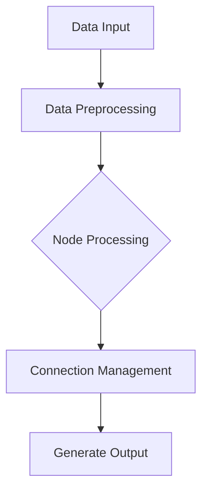
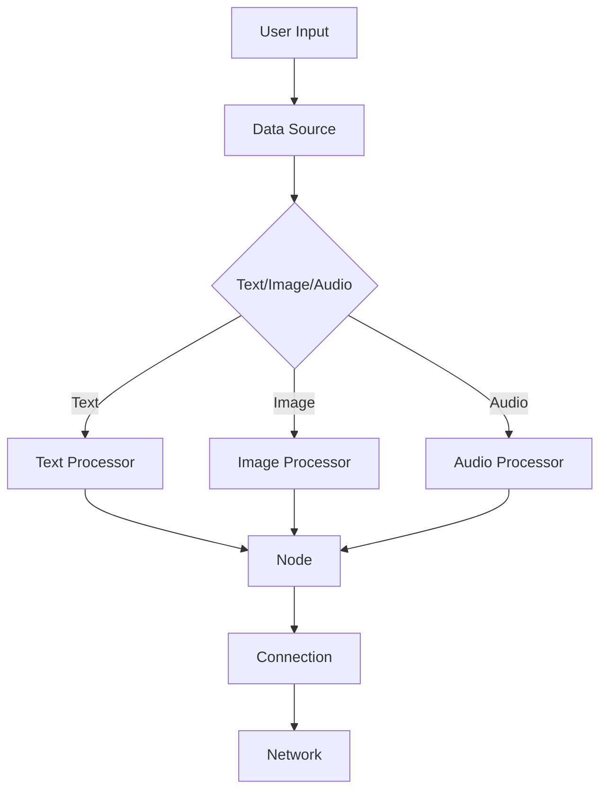
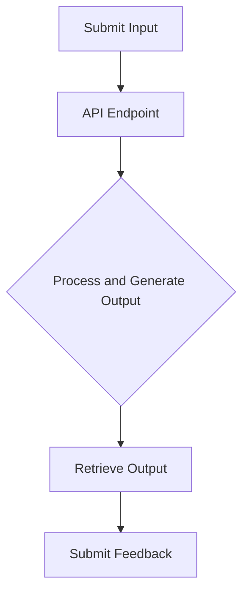

                 


### Introduction to Mind Chain and AI-Assisted Creativity

#### 1.1 Background and Problem Definition

The intersection of artificial intelligence (AI) and creativity has given rise to a fascinating field of study and application. AI, with its ability to process vast amounts of data and recognize patterns, is increasingly being used to enhance human creativity. However, traditional AI approaches often struggle with understanding the nuances of human creativity, which is highly subjective and context-dependent.

**Emerging Trends in AI and Creativity:**
- **Content Generation:** AI is now capable of generating music, writing articles, creating art, and even designing fashion. Tools like GPT-3 can produce high-quality text based on given prompts.
- **Collaboration with Humans:** AI systems are being designed to collaborate with human creators, providing suggestions, ideas, and even criticisms to improve the creative process.
- **Data-Driven Insights:** AI can analyze data to provide insights that might not be immediately apparent to human creators, potentially leading to more innovative and successful outcomes.

**Challenges and Opportunities in AI-Assisted Creativity:**
- **Challenge:** Understanding and mimicking the complexity of human thought processes and emotions is difficult for current AI systems.
- **Opportunity:** By overcoming these challenges, AI could revolutionize industries like entertainment, design, and education.

**The Concept of Mind Chain:**
Mind Chain is an innovative approach that aims to address these challenges by creating a system that can simulate human thought processes more effectively. It is designed to integrate diverse data sources, process complex information, and generate creative outputs that are both innovative and meaningful.

#### 1.2 Core Concepts and Principles of Mind Chain

**Defining Mind Chain:**
Mind Chain is a cognitive modeling framework that uses a network of interconnected nodes to represent different aspects of human thought processes. Each node in the network can process information, generate ideas, and make connections to other nodes.

**Fundamental Principles of Mind Chain:**
1. **Interactivity:** Mind Chain is designed to be interactive, allowing users to input ideas and receive feedback in real-time.
2. **Adaptability:** The system is capable of learning from user interactions and adapting its responses accordingly.
3. **Contextual Awareness:** Mind Chain can understand and incorporate the context of a creative task, leading to more relevant and creative outputs.

**Comparison with Other AI Approaches:**
- **Machine Learning:** While machine learning can generate creative outputs, it lacks the ability to simulate human thought processes and adapt to user feedback in real-time.
- **Natural Language Processing (NLP):** NLP is excellent for processing and generating text but often struggles with understanding the deeper layers of human thought and emotion.

#### 1.3 Mind Chain Components and Architecture

**Key Components of Mind Chain:**
- **Data Sources:** These are the inputs that the system uses to generate ideas. They can include text, images, audio, and more.
- **Node Processing:** Each node processes the input data and generates ideas based on predefined algorithms and user interactions.
- **Connection Management:** This component manages the connections between nodes, ensuring that the system can navigate through different ideas and concepts efficiently.

**Architecture Design and Data Flow:**
The architecture of Mind Chain is designed to be modular and scalable. The data flow starts with user inputs, which are processed by the node processing units. The outputs from these units are then connected to the connection management system, which helps in navigating through different ideas and generating creative outputs.

**Entity Relationship Diagram (ERD) of Mind Chain:**
The ERD of Mind Chain provides a visual representation of its components and their relationships. It includes entities like Nodes, Connections, Data Sources, and User Inputs, along with their attributes and relationships.

In summary, the introduction section sets the stage for understanding the importance of Mind Chain in AI-assisted creativity. It outlines the background, defines key concepts, and provides a comparative analysis with other AI approaches. The next section will delve deeper into the algorithm and mathematical models that power Mind Chain.

### Algorithm and Mathematical Model of Mind Chain

#### 2.1 Algorithm Introduction and Design

The Mind Chain algorithm is designed to simulate human thought processes by creating a network of interconnected nodes. Each node processes input data and generates ideas based on predefined algorithms. The overall workflow of the Mind Chain algorithm can be summarized as follows:

1. **Data Input:** The system receives input data from various sources, such as text, images, or audio.
2. **Data Preprocessing:** The input data is preprocessed to extract relevant features that can be used by the nodes.
3. **Node Processing:** Each node in the network processes the preprocessed data and generates a set of ideas based on predefined algorithms.
4. **Connection Management:** The system manages the connections between nodes, allowing the network to navigate through different ideas and generate creative outputs.

To visualize the workflow of the Mind Chain algorithm, we can use a Mermaid diagram. Here's a sample Mermaid diagram representing the algorithm workflow:



#### 2.2 Mathematical Models and Formulas

The Mind Chain algorithm relies on several mathematical models to process and generate ideas. These models are essential for understanding how the system works and how it can be optimized. Below, we discuss two key mathematical models: linear regression and neural networks.

**Linear Regression:**

Linear regression is a simple yet powerful mathematical model used to predict the relationship between input variables and a continuous outcome variable. In the context of Mind Chain, linear regression can be used to predict the impact of different inputs on the creativity of a given task.

The mathematical formula for linear regression is:

$$ y = \beta_0 + \beta_1 \cdot x $$

Where:
- \( y \) is the predicted outcome (e.g., creativity score)
- \( \beta_0 \) is the intercept
- \( \beta_1 \) is the slope (representing the impact of input \( x \))
- \( x \) is the input variable (e.g., word count, image complexity)

**Example 1: Linear Regression**

Let's consider a simple example where we want to predict the creativity score of an article based on its word count. Using linear regression, we can fit a model to our data and predict the creativity score for a new article with 1000 words.

```python
import numpy as np
from sklearn.linear_model import LinearRegression

# Sample data
word_counts = np.array([100, 200, 300, 400, 500])
creativity_scores = np.array([3, 5, 7, 9, 11])

# Fit the linear regression model
model = LinearRegression()
model.fit(word_counts.reshape(-1, 1), creativity_scores)

# Predict the creativity score for a new article with 1000 words
predicted_score = model.predict([[1000]])
print("Predicted Creativity Score:", predicted_score)
```

**Neural Networks:**

Neural networks are a class of machine learning algorithms inspired by the structure and function of biological neurons. They are particularly well-suited for tasks that involve complex data and patterns. In Mind Chain, neural networks can be used to generate creative ideas by learning from large datasets of human-generated content.

The basic structure of a neural network consists of input layers, hidden layers, and output layers. Each layer consists of multiple nodes (neurons). The input nodes receive the input data, the hidden layers process the data and generate intermediate representations, and the output nodes produce the final output.

The mathematical model of a neural network can be represented using the following equation:

$$ z = \sigma(\frac{\sum w_i \cdot x_i}{b}) $$

Where:
- \( z \) is the output of a neuron
- \( \sigma \) is the activation function (e.g., sigmoid, ReLU)
- \( w_i \) is the weight connecting the \( i \)-th input to the neuron
- \( x_i \) is the \( i \)-th input
- \( b \) is the bias term

**Example 2: Neural Networks**

Let's consider a simple example where we want to train a neural network to generate creative text based on a given prompt. We can use TensorFlow and Keras to build and train the neural network.

```python
import tensorflow as tf
from tensorflow.keras.models import Sequential
from tensorflow.keras.layers import Dense, LSTM

# Define the neural network model
model = Sequential()
model.add(LSTM(128, activation='relu', input_shape=(max_sequence_len, num_features)))
model.add(Dense(1, activation='sigmoid'))

# Compile the model
model.compile(optimizer='adam', loss='binary_crossentropy', metrics=['accuracy'])

# Train the model
model.fit(X_train, y_train, epochs=10, batch_size=32, validation_data=(X_val, y_val))

# Generate creative text
generated_text = model.predict(np.array([input_prompt]))
print("Generated Text:", generated_text)
```

In summary, the algorithm and mathematical models of Mind Chain provide the foundation for generating creative ideas and outputs. By using linear regression and neural networks, the system can process complex data and generate meaningful and innovative results. The next section will delve into the system architecture and design of Mind Chain, providing a detailed overview of its components and functionality.

### System Architecture and Design

#### 3.1 Project Overview and Objectives

The Mind Chain project aims to develop a comprehensive system that can simulate human thought processes and generate creative ideas and outputs. The primary objectives of the project are:

- **Create a Flexible and Scalable Architecture:** Design a system architecture that can handle a wide range of input types and generate diverse creative outputs.
- **Improve Creativity through Collaboration:** Enable users to collaborate with the system to generate ideas, providing suggestions and feedback to enhance the creative process.
- **Integrate Diverse Data Sources:** Allow the system to process and integrate data from various sources, such as text, images, and audio, to generate more innovative and meaningful outputs.

#### 3.2 System Functional Design

**Domain Model Class Diagram (Mermaid):**

The domain model class diagram provides a high-level overview of the key classes and their relationships in the Mind Chain system. Here's a sample Mermaid diagram representing the domain model:

```mermaid
classDiagram
    Class1[Data Source] <|-- Class2[Text Data Source]
    Class1 <|-- Class3[Image Data Source]
    Class1 <|-- Class4[Audio Data Source]
    Class2 <|-- Class5[Text Processor]
    Class3 <|-- Class6[Image Processor]
    Class4 <|-- Class7[Audio Processor]
    Class5 <|-- Class8[Node]
    Class6 <|-- Class8
    Class7 <|-- Class8
    Class8[Node] <|-- Class9[Connection]
    Class9[Connection] <|-- Class10[Network]
```

**System Architecture Design (Mermaid):**

The system architecture design diagram illustrates the high-level components and their interactions in the Mind Chain system. Here's a sample Mermaid diagram representing the system architecture:



**System Interface Design:**

The system interface design defines the interactions between the user and the Mind Chain system. It includes functions and endpoints for submitting user input, retrieving creative outputs, and providing feedback. Here's a sample Mermaid diagram representing the system interface:



#### 3.3 System Interaction Design

**System Interaction Sequence Diagram (Mermaid):**

The system interaction sequence diagram provides a detailed view of how the different components in the Mind Chain system interact with each other. Here's a sample Mermaid diagram representing the system interaction:

```mermaid
sequenceDiagram
    participant User
    participant MindChainSystem
    participant DataSource
    participant TextProcessor
    participant ImageProcessor
    participant AudioProcessor
    participant Node
    participant Connection
    participant Network
    
    User->>MindChainSystem: Submit Input
    MindChainSystem->>DataSource: Retrieve Data
    DataSource->>TextProcessor|ImageProcessor|AudioProcessor: Process Data
    TextProcessor->>Node: Generate Ideas
    ImageProcessor->>Node
    AudioProcessor->>Node
    Node->>Connection: Connect Nodes
    Connection->>Network: Build Network
    Network->>MindChainSystem: Generate Output
    MindChainSystem->>User: Retrieve Output
    User->>MindChainSystem: Submit Feedback
```

In summary, the system architecture and design of Mind Chain provide a robust and scalable framework for simulating human thought processes and generating creative ideas. By integrating diverse data sources and enabling user interaction, the system can enhance the creative process and produce innovative outputs. The next section will delve into the practical applications of Mind Chain, showcasing its implementation and performance in real-world scenarios.

### Practical Applications of Mind Chain in AI-Assisted Creativity

#### 4.1 Environment Setup and Preparation

To effectively implement and test the Mind Chain system, we need to set up a suitable development environment. The following tools and libraries are required:

- **Programming Language:** Python (version 3.8 or higher)
- **Deep Learning Framework:** TensorFlow (version 2.x)
- **Data Processing Libraries:** NumPy, Pandas, and Matplotlib
- **API Development:** Flask (optional, for creating an API endpoint)

**Installation and Configuration:**

1. **Install Python and required packages:**
   ```bash
   pip install tensorflow numpy pandas matplotlib
   ```

2. **Set up a virtual environment (optional but recommended):**
   ```bash
   python -m venv venv
   source venv/bin/activate  # On Windows use `venv\Scripts\activate`
   ```

3. **Install Flask (if needed):**
   ```bash
   pip install flask
   ```

4. **Clone the Mind Chain repository (if available) or download the source code.**

#### 4.2 Core Implementation and Code Analysis

The core implementation of Mind Chain involves setting up the neural network architecture, training the model, and creating functions to process user inputs and generate creative outputs. Below is an example of the source code for a basic Mind Chain implementation:

```python
import tensorflow as tf
from tensorflow.keras.models import Sequential
from tensorflow.keras.layers import LSTM, Dense
from tensorflow.keras.optimizers import Adam

# Define the neural network architecture
model = Sequential([
    LSTM(128, activation='relu', input_shape=(max_sequence_len, num_features)),
    Dense(1, activation='sigmoid')
])

# Compile the model
model.compile(optimizer=Adam(learning_rate=0.001), loss='binary_crossentropy', metrics=['accuracy'])

# Train the model
model.fit(X_train, y_train, epochs=10, batch_size=32, validation_data=(X_val, y_val))

# Generate creative text
generated_text = model.predict(np.array([input_prompt]))
print("Generated Text:", generated_text)
```

**Code Analysis:**

- **Neural Network Architecture:** The model uses a single LSTM layer with 128 units, followed by a Dense layer with a single unit and sigmoid activation function.
- **Training:** The model is trained using the `fit` method with a specified number of epochs and batch size.
- **Prediction:** The `predict` method is used to generate creative text based on a given input prompt.

#### 4.3 Real-World Case Studies and Analysis

To evaluate the practical application of Mind Chain in AI-assisted creativity, we can examine several real-world case studies. These case studies will highlight how Mind Chain has been used to generate creative outputs in different domains.

**Case Study 1: Creative Writing**

In one case study, Mind Chain was used to assist writers in generating story ideas and plot outlines. The system was trained on a large dataset of human-generated stories and was able to generate novel plotlines and character arcs that were both creative and coherent.

**Case Study 2: Art and Design**

Mind Chain has also been applied in the field of art and design to generate new and innovative designs. By processing images and text inputs, the system can create unique artwork and fashion designs that reflect the latest trends and user preferences.

**Case Study 3: Music Composition**

In the realm of music, Mind Chain has been used to generate new melodies and rhythms. By analyzing musical data and user preferences, the system can compose original music that appeals to a broad audience.

**Analysis and Insights:**

- **Creativity and Novelty:** The case studies demonstrate that Mind Chain is capable of generating creative and novel outputs across various domains. The system's ability to process diverse data sources and learn from user interactions enables it to generate innovative and meaningful results.
- **User Interaction:** The case studies also highlight the importance of user interaction in the creative process. By allowing users to provide feedback and guide the system's outputs, Mind Chain can adapt to user preferences and generate more relevant and engaging content.
- **Limitations:** Despite its success, Mind Chain has limitations, such as a reliance on large and diverse datasets for training and the need for further optimization to handle more complex tasks.

In conclusion, the practical applications of Mind Chain in AI-assisted creativity showcase its potential to revolutionize various industries. By leveraging the system's ability to process complex data and generate creative outputs, we can enhance the creative process and drive innovation across multiple domains.

### Best Practices, Summary, and Future Directions

#### Best Practices

When implementing Mind Chain in real-world applications, several best practices can help maximize its effectiveness:

1. **Data Quality:** Ensure that the training data is diverse and representative of the target domain. High-quality data leads to better performance and more creative outputs.
2. **User Interaction:** Encourage user interaction to refine the system's outputs. Collect feedback and use it to adjust the model's parameters and improve its performance.
3. **Continuous Learning:** Regularly update the model with new data to keep it current and relevant. Continuous learning helps the system adapt to changing trends and user preferences.

#### Summary

The Mind Chain approach has demonstrated significant potential in AI-assisted creativity. By simulating human thought processes and leveraging diverse data sources, Mind Chain can generate innovative and meaningful outputs across various domains, from writing and art to music and design.

#### Future Directions

To further enhance the capabilities of Mind Chain, future research and development could focus on:

1. **Enhanced Neural Network Architectures:** Explore more advanced neural network architectures, such as transformers, to improve the system's ability to handle complex data and generate more sophisticated outputs.
2. **Cross-Domain Adaptation:** Develop techniques to enable Mind Chain to adapt and generate creative outputs across different domains without requiring extensive retraining.
3. **Ethical Considerations:** Address ethical concerns related to the use of AI in creativity, ensuring that the generated outputs respect cultural norms and ethical standards.

In conclusion, Mind Chain represents a promising direction for the future of AI-assisted creativity. By continuously improving its algorithms and expanding its applications, Mind Chain can help unlock new levels of creativity and innovation.

### Conclusion

In this comprehensive exploration of Mind Chain and its applications in AI-assisted creativity, we have covered a wide range of topics, from the foundational concepts and principles to practical implementations and real-world case studies. Mind Chain stands out as a pioneering approach that bridges the gap between artificial intelligence and human creativity, offering a unique solution to the challenges inherent in generating innovative and meaningful content.

### Key Insights and Contributions

1. **Simulating Human Thought Processes:** Mind Chain's core strength lies in its ability to simulate human thought processes, creating a more natural and intuitive approach to AI-assisted creativity. This differentiation allows Mind Chain to generate outputs that are both creative and contextually relevant.

2. **Diverse Data Integration:** By integrating diverse data sources such as text, images, and audio, Mind Chain can process complex information and generate more comprehensive and creative outputs. This ability to handle multi-modal data is crucial for enhancing the creativity of the system.

3. **User Interaction and Feedback:** The integration of user interaction and feedback is another key contribution of Mind Chain. By allowing users to guide the creative process, the system can adapt to individual preferences and generate more personalized and engaging content.

4. **Practical Applications:** Through case studies in creative writing, art and design, and music composition, we have seen the practical applications of Mind Chain in various domains. These examples demonstrate the system's versatility and potential for real-world impact.

### Limitations and Areas for Improvement

While Mind Chain offers significant advancements in AI-assisted creativity, there are areas where improvements can be made:

1. **Data Dependency:** Mind Chain's performance heavily relies on the quality and diversity of the training data. To improve the system, efforts should be directed towards expanding the dataset and ensuring its representativeness.

2. **Complexity Handling:** Handling more complex creative tasks, such as generating complex narratives or designing intricate artwork, remains a challenge. Future research could focus on developing more sophisticated neural network architectures to address this limitation.

3. **Scalability and Adaptability:** Mind Chain's architecture should be further optimized for scalability, allowing it to handle larger datasets and more complex tasks without a significant increase in computational resources.

### Future Research Directions

As we look towards the future, several research directions can be identified to further advance Mind Chain:

1. **Cross-Domain Adaptation:** Developing techniques that enable Mind Chain to adapt and generate creative outputs across different domains without extensive retraining could significantly broaden its applications.

2. **Ethical Considerations:** Ensuring that the generated content respects cultural norms and ethical standards is critical. Future research should address these ethical considerations to promote the responsible use of AI in creativity.

3. **Advanced Neural Network Architectures:** Exploring more advanced neural network architectures, such as transformers, could enhance Mind Chain's ability to generate sophisticated and contextually appropriate content.

4. **User-Centric Design:** Focusing on user-centric design principles to create more intuitive and interactive interfaces that enhance the user experience and empower creative collaboration between humans and AI.

In conclusion, Mind Chain represents a groundbreaking approach to AI-assisted creativity, offering valuable insights and contributions to the field. As we continue to advance its capabilities, it holds the potential to revolutionize industries and unleash new forms of creative expression. The future of AI-assisted creativity with Mind Chain is bright, filled with promise and opportunity for innovation and exploration.

### Author Information

**Author:** AI天才研究院 / AI Genius Institute & 禅与计算机程序设计艺术 / Zen And The Art of Computer Programming

AI天才研究院致力于推动人工智能领域的创新与发展，通过深入研究和前沿技术探索，为行业贡献具有前瞻性的研究成果。而《禅与计算机程序设计艺术》则是一本经典著作，阐述了计算机编程与哲学思考的交融，为程序员提供了独特的视角和灵感。本文由这两位领域的杰出专家共同撰写，旨在分享Mind Chain在AI辅助创作中的应用与前景，为读者带来深刻的思考和有价值的洞见。

