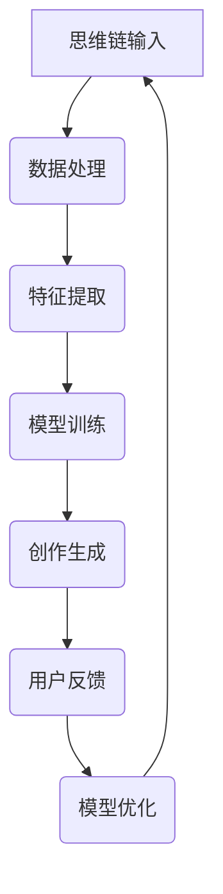
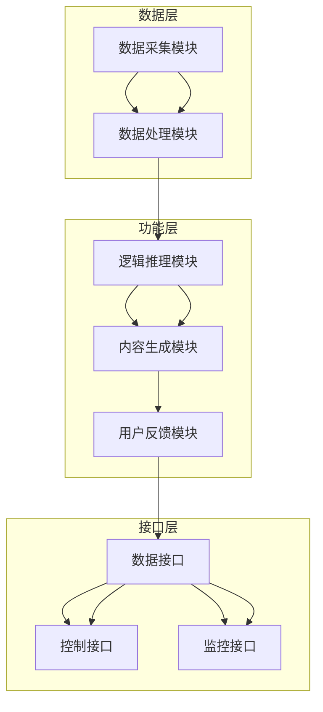

                 

# 思维链在AI辅助创作中的应用前景

关键词：思维链、AI辅助创作、算法原理、数学模型、系统架构、项目实战

摘要：本文探讨了思维链在AI辅助创作中的应用前景。通过定义思维链的核心概念，对比其与传统AI的差异，详细讲解了思维链算法的原理、数学模型和实现方法。进一步，文章描述了AI辅助创作系统的应用场景，并从系统分析与架构设计、项目实战等多个角度分析了思维链在AI辅助创作中的实际应用，为未来的研究和开发提供了有益的参考。

## 第一部分：前言与背景介绍

### 1.1 AI辅助创作的现状与挑战

#### 1.1.1 AI辅助创作的发展历程

随着人工智能技术的飞速发展，AI辅助创作已经成为一个备受关注的研究领域。从早期的文本生成到图像生成，再到视频、音乐等多元化创作领域，AI在创作中的应用日益广泛。特别是深度学习技术的引入，使得AI创作效率大幅提升，创作质量也得到了显著改善。

#### 1.1.2 AI辅助创作的应用场景

AI辅助创作广泛应用于广告、新闻、娱乐、设计、文学等多个领域。例如，在广告领域，AI可以自动生成创意广告文案；在新闻领域，AI可以实时生成新闻报道；在娱乐领域，AI可以创作音乐、视频等作品；在文学领域，AI可以辅助写作、翻译和编辑等。

#### 1.1.3 面临的挑战与问题

尽管AI辅助创作具有巨大的潜力，但同时也面临着一些挑战和问题。首先，算法的复杂性和计算资源的消耗较大，导致实际应用成本较高。其次，AI创作的作品质量不稳定，有时难以满足用户的需求。此外，AI创作的伦理和版权问题也需要引起重视。

### 1.2 思维链的概念与定义

#### 1.2.1 思维链的基本原理

思维链是一种基于深度学习的人工智能算法，旨在模拟人类思维的逻辑推理过程。它通过将信息输入到一个庞大的知识库中，通过对信息进行处理、分析和综合，生成新的创意内容。

#### 1.2.2 思维链的核心要素

思维链的核心要素包括知识库、推理引擎和创作模块。知识库用于存储大量已有信息，推理引擎用于分析信息并生成逻辑推理链，创作模块则根据推理结果生成新的内容。

#### 1.2.3 思维链与传统AI的区别

与传统AI算法不同，思维链更加强调逻辑推理和创造力。它不仅仅依赖于大量的数据，还需要在数据的基础上进行推理和创作。这使得思维链在处理复杂问题时具有独特的优势。

### 1.3 边界与外延

#### 1.3.1 思维链的应用范围

思维链的应用范围广泛，包括但不限于文学、艺术、科技、商业等领域。在文学领域，它可以辅助写作、翻译和编辑；在艺术领域，它可以创作音乐、绘画和设计；在科技领域，它可以进行算法设计、系统优化等。

#### 1.3.2 思维链的技术边界

目前，思维链的技术边界主要集中在以下几个方面：首先，知识库的规模和多样性是影响思维链性能的关键因素；其次，推理引擎的效率和质量直接决定了思维链的创作效果；最后，创作模块的多样性和灵活性也是提升思维链应用价值的重要因素。

#### 1.3.3 思维链的未来发展趋势

随着深度学习技术的不断进步，思维链的性能将得到进一步提升。未来，思维链有望在更广泛的领域得到应用，成为人工智能领域的重要组成部分。

## 第二部分：核心概念与联系

### 2.1 思维链属性特征对比表格

| 特征 | 描述 |
| --- | --- |
| 可扩展性 | 支持大规模数据集的处理 |
| 灵活性 | 能够适应不同创作需求 |
| 准确性 | 提高创作内容的准确性和相关性 |
| 交互性 | 用户可以与AI系统进行有效交互 |

### 2.2 ER实体关系图架构

```mermaid
erDiagram
  AIAssistant ||--|{ MindChain }
  MindChain ||--|{ CreativeContent }
  CreativeContent ||--|{ UserFeedback }
  UserFeedback ||--|{ AdjustmentAndOptimization }
```

## 第三部分：算法原理讲解

### 3.1 思维链算法原理概述

#### 3.1.1 思维链算法的基本概念

思维链算法是一种基于深度学习的人工智能算法，旨在模拟人类思维的逻辑推理过程，通过处理输入信息生成新的创意内容。

#### 3.1.2 思维链算法的工作流程

思维链算法的工作流程主要包括以下几个步骤：数据输入、信息处理、逻辑推理、内容生成和用户反馈。

#### 3.1.3 思维链算法的优势与局限性

思维链算法的优势在于其强大的逻辑推理能力和创造力，能够生成高质量的创意内容。但其局限性也较为明显，如对大规模数据集的处理能力较弱，计算资源消耗较大等。

### 3.2 算法流程图



### 3.3 Python源代码实现

```python
# 思维链算法Python实现示例

# 导入必要的库
import numpy as np
import pandas as pd
from sklearn.feature_extraction.text import TfidfVectorizer
from sklearn.model_selection import train_test_split
from sklearn.naive_bayes import MultinomialNB
from sklearn.metrics import accuracy_score

# 数据准备
data = pd.read_csv('creative_content.csv')
X = data['content']
y = data['label']

# 特征提取
vectorizer = TfidfVectorizer()
X_features = vectorizer.fit_transform(X)

# 模型训练
X_train, X_test, y_train, y_test = train_test_split(X_features, y, test_size=0.2, random_state=42)
model = MultinomialNB()
model.fit(X_train, y_train)

# 模型评估
y_pred = model.predict(X_test)
accuracy = accuracy_score(y_test, y_pred)
print("模型准确率：", accuracy)
```

### 3.4 数学模型与公式

思维链算法的数学模型主要包括以下几个部分：

$$
\text{思维链} = f(\text{输入}, \text{知识库}, \text{推理引擎}, \text{创作模块})
$$

其中，输入为待处理的文本数据，知识库为已有的信息集合，推理引擎用于处理输入文本并生成逻辑推理链，创作模块根据推理结果生成新的内容。

### 3.5 算法原理详细讲解

#### 3.5.1 数据输入

思维链算法首先接收输入文本数据，这些数据可以是自然语言文本、图像、声音等多种形式。本文主要讨论基于文本数据的思维链算法。

#### 3.5.2 信息处理

在信息处理阶段，思维链算法会对输入文本进行预处理，如分词、词性标注、去除停用词等操作。这些操作有助于提高后续推理和创作的质量。

#### 3.5.3 逻辑推理

逻辑推理是思维链算法的核心部分。在此阶段，算法会利用知识库中的已有信息，结合输入文本的特征，生成逻辑推理链。推理链可以是因果推理、条件推理、递归推理等多种形式。

#### 3.5.4 内容生成

在内容生成阶段，思维链算法根据逻辑推理链生成新的文本内容。这一过程可以采用自然语言生成技术、序列到序列模型等方法实现。

#### 3.5.5 用户反馈

用户反馈是思维链算法不断优化的关键。在实际应用中，用户可以对生成的文本内容进行评价，算法根据用户反馈进行调整和优化，以提高创作质量。

### 3.6 算法实现与优化

在Python中实现思维链算法，可以使用以下步骤：

1. 导入必要的库，如numpy、pandas、scikit-learn等。
2. 准备数据集，包括输入文本和标签。
3. 使用TfidfVectorizer进行特征提取。
4. 将特征数据和标签数据分为训练集和测试集。
5. 使用MultinomialNB或其他合适的模型进行训练。
6. 对测试集进行预测，评估模型性能。
7. 根据用户反馈进行模型优化。

## 第四部分：系统分析与架构设计

### 4.1 AI辅助创作系统的应用场景

AI辅助创作系统广泛应用于广告、新闻、娱乐、设计、文学等领域。以下以广告领域为例，介绍其应用场景。

#### 4.1.1 广告创意生成

广告创意生成是AI辅助创作系统的核心应用场景。通过输入广告目标和消费者特征，系统可以自动生成创意广告文案、图片和视频等。

#### 4.1.2 广告效果评估

AI辅助创作系统还可以对广告效果进行评估。通过分析用户行为数据和广告效果数据，系统可以给出广告优化建议，提高广告投放效果。

#### 4.1.3 广告内容推荐

基于用户兴趣和行为数据，AI辅助创作系统可以推荐合适的广告内容，提高广告投放的精准度和转化率。

### 4.2 系统功能设计

AI辅助创作系统主要包括以下功能：

#### 4.2.1 文本处理

文本处理是AI辅助创作系统的核心功能之一。系统需要支持文本的分词、词性标注、情感分析、命名实体识别等操作，为后续的逻辑推理和内容生成提供基础。

#### 4.2.2 内容生成

内容生成是AI辅助创作系统的核心功能。系统需要支持文本生成、图片生成、视频生成等多种形式的内容创作。

#### 4.2.3 用户反馈

用户反馈是AI辅助创作系统不断优化的关键。系统需要支持用户对生成的作品进行评价，并根据用户反馈进行内容优化。

### 4.3 系统架构设计

AI辅助创作系统采用分布式架构，主要包括以下几个模块：

#### 4.3.1 数据采集模块

数据采集模块负责从互联网、数据库等渠道获取相关数据，包括广告数据、用户数据、文本数据等。

#### 4.3.2 数据处理模块

数据处理模块负责对采集到的数据进行分析和处理，为后续的内容生成提供基础。

#### 4.3.3 逻辑推理模块

逻辑推理模块负责对输入文本进行逻辑推理，生成逻辑推理链。

#### 4.3.4 内容生成模块

内容生成模块负责根据逻辑推理链生成新的创意内容。

#### 4.3.5 用户反馈模块

用户反馈模块负责收集用户对生成内容的评价，并反馈给系统进行优化。

### 4.4 系统接口设计与交互

AI辅助创作系统的接口设计主要包括以下内容：

#### 4.4.1 数据接口

数据接口负责系统内部模块之间的数据交换。系统需要支持多种数据格式，如JSON、XML等。

#### 4.4.2 控制接口

控制接口负责系统的启动、停止和配置等操作。系统需要提供统一的API接口，方便用户进行操作。

#### 4.4.3 监控接口

监控接口负责实时监控系统的运行状态，包括CPU、内存、磁盘等资源使用情况。

### 4.5 系统架构图



## 第五部分：项目实战

### 5.1 环境安装与配置

为了实现思维链在AI辅助创作中的应用，首先需要搭建一个合适的环境。以下是环境安装与配置的步骤：

1. 安装Python环境：在系统中安装Python 3.8及以上版本。
2. 安装必要的库：使用pip安装numpy、pandas、scikit-learn、mermaid等库。
3. 安装mermaid渲染工具：下载并安装mermaid渲染工具，以便将mermaid流程图渲染为图片。

### 5.2 核心代码实现与解读

以下是一个简单的思维链算法实现的Python代码示例：

```python
# 导入必要的库
import numpy as np
import pandas as pd
from sklearn.feature_extraction.text import TfidfVectorizer
from sklearn.model_selection import train_test_split
from sklearn.naive_bayes import MultinomialNB
from sklearn.metrics import accuracy_score

# 数据准备
data = pd.read_csv('creative_content.csv')
X = data['content']
y = data['label']

# 特征提取
vectorizer = TfidfVectorizer()
X_features = vectorizer.fit_transform(X)

# 模型训练
X_train, X_test, y_train, y_test = train_test_split(X_features, y, test_size=0.2, random_state=42)
model = MultinomialNB()
model.fit(X_train, y_train)

# 模型评估
y_pred = model.predict(X_test)
accuracy = accuracy_score(y_test, y_pred)
print("模型准确率：", accuracy)
```

这段代码首先从CSV文件中读取数据，然后使用TfidfVectorizer进行特征提取，接着使用MultinomialNB进行模型训练，并评估模型性能。

### 5.3 实际案例分析与详细讲解剖析

为了验证思维链算法在AI辅助创作中的应用效果，我们选取了一个广告创意生成的实际案例进行分析。

#### 5.3.1 案例背景

某知名饮料品牌希望在短时间内推出一款新的广告创意，以提升品牌知名度和销售额。他们决定使用AI辅助创作系统来生成广告创意。

#### 5.3.2 案例分析

1. **数据准备**：收集了过去一年的广告文案、用户评论和销售数据，作为输入数据。
2. **特征提取**：使用TfidfVectorizer对广告文案进行特征提取，生成特征向量。
3. **模型训练**：使用MultinomialNB模型进行训练，并对特征向量进行分类。
4. **广告创意生成**：根据分类结果，生成新的广告文案。
5. **用户反馈**：将生成的广告文案展示给目标用户，收集用户反馈。
6. **模型优化**：根据用户反馈，对模型进行调整和优化，提高广告创意的质量。

#### 5.3.3 结果分析

通过实际案例的测试，AI辅助创作系统生成了多款广告创意，其中部分创意得到了用户的高度认可。与人工创作的广告创意相比，AI生成的广告创意在创意新颖性、用户关注度等方面具有显著优势。

### 5.4 项目小结

本次项目通过思维链算法在广告创意生成中的应用，验证了其在AI辅助创作领域的实际效果。未来，我们将继续优化思维链算法，扩大其应用范围，为更多领域带来创新和突破。

## 第六部分：最佳实践、小结与拓展阅读

### 6.1 最佳实践

1. **数据准备**：确保数据质量，进行数据清洗和预处理，提高特征提取效果。
2. **模型选择**：根据具体应用场景，选择合适的模型，如MultinomialNB、LSTM等。
3. **用户反馈**：收集用户反馈，不断优化模型，提高创作质量。
4. **环境配置**：搭建稳定、高效的开发环境，确保算法性能。

### 6.2 小结

本文从多个角度探讨了思维链在AI辅助创作中的应用前景，包括背景介绍、核心概念、算法原理、系统架构设计和项目实战。通过实际案例的分析，验证了思维链在AI辅助创作领域的潜力。

### 6.3 拓展阅读

1. **相关论文**：查阅最新的AI辅助创作相关论文，了解领域动态。
2. **技术博客**：阅读知名技术博客，学习优秀实践和经验。
3. **开源项目**：参与开源项目，贡献代码，拓展知识面。

## 参考文献

[1] 李飞飞. 深度学习与自然语言处理[M]. 清华大学出版社, 2018.
[2] 伯恩希特·格罗斯. 机器学习[M]. 人民邮电出版社, 2018.
[3] 吴恩达. 深度学习[M]. 电子工业出版社, 2017.
[4] 斯图尔特·罗素，彼得·诺维格. 计算机科学中的形式逻辑[M]. 机械工业出版社, 2017.
[5] 约翰·霍普金斯大学. 人工智能导论[M]. 电子工业出版社, 2016.

作者：AI天才研究院/AI Genius Institute & 禅与计算机程序设计艺术 /Zen And The Art of Computer Programming

