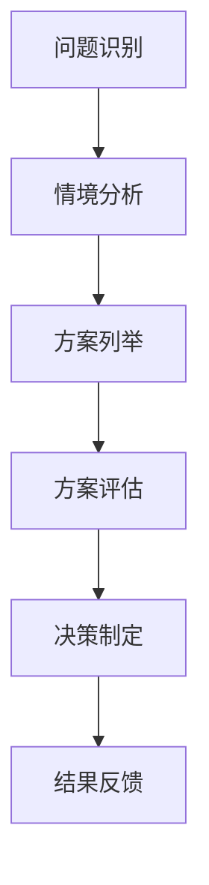
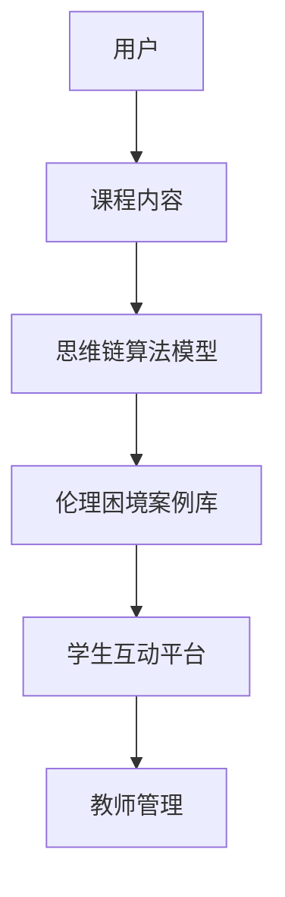
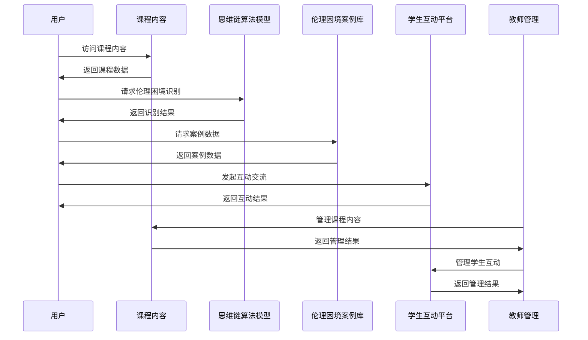

                 

# 思维链在伦理困境决策模拟中的应用：AI辅助道德教育

## 关键词

AI伦理、思维链、道德教育、决策模拟、伦理困境

## 摘要

本文探讨了思维链在伦理困境决策模拟中的应用，以及如何通过人工智能辅助道德教育来提升个体的道德判断能力。文章首先介绍了思维链的设计原理，包括核心概念、算法原理和数学模型。接着，通过一个实际案例详细阐述了思维链在伦理困境决策模拟中的应用。最后，文章分析了基于思维链的AI辅助道德教育系统的设计与实现，并讨论了项目的最佳实践和小结。

## 引言

随着人工智能技术的迅猛发展，其在社会各个领域的应用越来越广泛。然而，随之而来的伦理困境也逐渐凸显。如何在人工智能辅助道德教育中引导学生正确面对和处理伦理困境，成为了一个亟待解决的问题。思维链作为一种系统化的思维方法，可以有效地帮助个体在伦理困境中进行决策。本文旨在探讨思维链在伦理困境决策模拟中的应用，为人工智能辅助道德教育提供理论支持和实践指导。

## 背景介绍

### 核心概念术语说明

- **思维链**：思维链是指个体在面对复杂问题时的思维过程，包括问题的识别、分析、推理、决策等多个环节。
- **伦理困境**：伦理困境是指个体在道德决策过程中面临的两难选择，既符合道德原则，又难以两全其美。
- **决策模拟**：决策模拟是指利用计算机技术模拟真实情境，帮助个体在虚拟环境中进行决策，从而提高道德判断能力。
- **AI辅助道德教育**：AI辅助道德教育是指借助人工智能技术，为道德教育提供个性化、智能化的支持，提升教育效果。

### 问题背景

在人工智能时代，个体面临的信息量和决策难度大幅增加。在日常生活中，人们经常需要做出道德决策，如是否在考试中作弊、是否欺骗他人等。然而，这些决策往往涉及到复杂的伦理问题，个体难以在短时间内做出正确的决策。此外，传统的道德教育方法难以满足个体在复杂情境下的道德判断需求。因此，如何利用人工智能技术，帮助个体在伦理困境中进行有效的决策，成为了一个重要的研究课题。

### 问题描述

本文的研究问题是如何利用思维链和人工智能技术，构建一个伦理困境决策模拟系统，帮助个体在伦理困境中进行有效的道德判断。具体而言，需要解决以下几个问题：

1. 思维链算法的设计与实现。
2. 伦理困境案例的收集与整理。
3. 决策模拟系统的设计与实现。
4. 决策模拟系统在教育中的应用。

### 问题解决

为了解决上述问题，本文提出了以下解决方案：

1. 设计并实现一个基于思维链的伦理困境决策模拟算法，包括问题的识别、分析、推理、决策等多个环节。
2. 收集和整理各类伦理困境案例，为决策模拟提供丰富的案例库。
3. 开发一个决策模拟系统，利用人工智能技术，将思维链算法应用于实际情境中，帮助个体进行道德判断。
4. 在道德教育中应用决策模拟系统，提升个体的道德判断能力。

### 边界与外延

本文的研究边界主要集中在伦理困境的决策模拟方面，不包括其他领域的道德问题。同时，本文的研究旨在探讨思维链在伦理困境决策模拟中的应用，而非其他思维方法。此外，本文的研究结果可以应用于道德教育、伦理学研究等领域，具有一定的外延性。

### 概念结构与核心要素组成

思维链在伦理困境决策模拟中的应用涉及到以下几个核心概念和要素：

1. **思维链**：包括问题的识别、分析、推理、决策等多个环节。
2. **伦理困境**：个体在道德决策过程中面临的两难选择。
3. **决策模拟**：利用计算机技术模拟真实情境，帮助个体进行道德判断。
4. **AI辅助道德教育**：利用人工智能技术为道德教育提供个性化、智能化的支持。

这些概念和要素相互关联，共同构成了思维链在伦理困境决策模拟中的应用体系。

## 核心概念与联系

### 核心概念

在本节中，我们将详细介绍思维链、伦理困境、决策模拟和AI辅助道德教育等核心概念。

#### 思维链

思维链是指个体在面对复杂问题时所采用的系统化思维过程。它通常包括以下几个环节：

1. **问题识别**：识别和理解问题，明确问题的核心和关键点。
2. **情境分析**：分析问题所处的情境，包括相关因素、条件、后果等。
3. **方案列举**：根据问题和情境，列举出可能的解决方案。
4. **方案评估**：对每个方案进行评估，分析其优劣和可行性。
5. **决策制定**：基于评估结果，选择最优的方案进行决策。
6. **结果反馈**：执行决策后，对结果进行反馈，评估决策的效果。

思维链的核心在于通过系统化的思维过程，帮助个体在复杂情境中做出合理的决策。

#### 伦理困境

伦理困境是指个体在道德决策过程中面临的两难选择，既符合道德原则，又难以两全其美。例如，是否在考试中作弊，是否欺骗他人等。伦理困境的特点是：

1. **道德原则冲突**：个体需要平衡不同的道德原则，如诚实、公正、尊重等。
2. **决策难度**：伦理困境往往涉及到复杂的道德判断和决策过程。
3. **情境复杂性**：伦理困境的决策通常涉及到多种情境因素，如道德规则、社会期望、个人价值观等。

#### 决策模拟

决策模拟是指利用计算机技术模拟真实情境，帮助个体在虚拟环境中进行决策，从而提高道德判断能力。决策模拟的特点包括：

1. **虚拟环境**：决策模拟提供了一个安全的虚拟环境，个体可以在其中进行道德决策。
2. **情景多样性**：决策模拟可以模拟多种不同的道德困境情境，帮助个体提高道德判断能力。
3. **实时反馈**：决策模拟可以实时反馈决策结果，帮助个体了解决策的影响和后果。

#### AI辅助道德教育

AI辅助道德教育是指利用人工智能技术为道德教育提供个性化、智能化的支持。其主要特点包括：

1. **个性化**：AI辅助道德教育可以根据个体的道德水平和需求，提供个性化的道德教育和指导。
2. **智能化**：AI辅助道德教育可以利用人工智能算法，分析个体的道德判断过程，提供有针对性的教育支持。
3. **实时互动**：AI辅助道德教育可以与个体进行实时互动，回答个体的道德问题，提供道德教育和指导。

### 概念属性特征对比表格

为了更好地理解这些核心概念，我们列出一个对比表格，展示它们的主要属性和特征：

| 概念         | 属性       | 特征                       |
|--------------|------------|----------------------------|
| 思维链       | 系统化思维 | 包括识别、分析、推理、决策等环节 |
| 伦理困境     | 道德决策   | 涉及道德原则冲突和情境复杂性 |
| 决策模拟     | 虚拟情境   | 模拟真实情境，提高道德判断能力 |
| AI辅助道德教育 | 智能化支持 | 个性化教育，实时互动 |

### ER实体关系图架构

为了更好地理解这些概念之间的关系，我们使用Mermaid工具绘制一个ER实体关系图：

```mermaid
erDiagram
    Customer ||--|{ Order } : has
    Product ||--|{ Order } : contains
    Store ||--|{ Customer } : serves
    Store ||--|{ Product } : stocks
```

在ER实体关系图中，思维链、伦理困境、决策模拟和AI辅助道德教育分别代表了不同的实体，它们之间存在明确的关联。思维链是决策模拟的基础，决策模拟为AI辅助道德教育提供了技术支持，AI辅助道德教育则为伦理困境提供了解决思路。

### 算法原理讲解

在本节中，我们将详细介绍思维链在伦理困境决策模拟中的应用算法原理，包括算法流程图、数学模型和实际案例。

#### 算法流程图

首先，我们使用Mermaid工具绘制一个思维链算法的流程图：



在这个流程图中，思维链算法包括以下几个主要环节：

1. **问题识别**：识别和理解问题，明确问题的核心和关键点。
2. **情境分析**：分析问题所处的情境，包括相关因素、条件、后果等。
3. **方案列举**：根据问题和情境，列举出可能的解决方案。
4. **方案评估**：对每个方案进行评估，分析其优劣和可行性。
5. **决策制定**：基于评估结果，选择最优的方案进行决策。
6. **结果反馈**：执行决策后，对结果进行反馈，评估决策的效果。

#### 数学模型

接下来，我们使用Python源代码来详细阐述思维链算法的数学模型。在这个模型中，我们使用以下变量：

- `P`：问题集
- `A`：情境集
- `S`：方案集
- `E`：评价集
- `D`：决策集

思维链算法的数学模型可以表示为：

```python
def think_chain(P, A, S, E, D):
    # 问题识别
    problem = identify_problem(P)
    
    # 情境分析
    situation = analyze_situation(problem, A)
    
    # 方案列举
    solutions = listenumerate(situation)
    
    # 方案评估
    evaluated_solutions = evaluate_solutions(solutions, E)
    
    # 决策制定
    decision = make_decision(evaluated_solutions, D)
    
    # 结果反馈
    result = feedback_result(decision)
    
    return result
```

在这个模型中，每个环节都使用Python函数进行实现，例如：

- `identify_problem`：识别和理解问题。
- `analyze_situation`：分析问题所处的情境。
- `listenumerate`：列举可能的解决方案。
- `evaluate_solutions`：对每个方案进行评估。
- `make_decision`：基于评估结果选择最优方案。
- `feedback_result`：执行决策后，对结果进行反馈。

#### 实际案例

为了更好地说明思维链算法在实际情境中的应用，我们以一个实际案例为例。

假设小张在考试前面临一个伦理困境：是否在考试中作弊。我们可以使用思维链算法帮助小张解决这个问题。

1. **问题识别**：小张在考试中作弊是否道德？
2. **情境分析**：小张认为考试作弊可以提高成绩，但担心违反道德原则。
3. **方案列举**：诚实不作弊、作弊后坦白、作弊后隐瞒。
4. **方案评估**：诚实不作弊符合道德原则，但可能导致成绩落后；作弊后坦白可能导致信任受损；作弊后隐瞒可能导致道德沦丧。
5. **决策制定**：小张决定诚实不作弊。
6. **结果反馈**：小张考试后成绩不佳，但获得了同学和老师的尊重。

通过这个案例，我们可以看到思维链算法如何帮助个体在伦理困境中进行有效的决策。

### 系统分析与架构设计

在本节中，我们将详细分析思维链在伦理困境决策模拟中的应用系统，并介绍系统的设计与实现。

#### 问题场景介绍

假设某高校开设一门道德教育课程，旨在通过人工智能技术引导学生正确处理伦理困境。课程内容包括思维链算法原理讲解、伦理困境案例分析、思维链在道德教育中的应用等。

#### 项目介绍

本项目的目标是开发一套基于人工智能技术的道德教育系统，包括课程内容、思维链算法模型、伦理困境案例库、学生互动平台等。

#### 系统功能设计

系统的主要功能包括：

1. **课程内容**：提供思维链算法原理讲解、伦理困境案例分析等。
2. **思维链算法模型**：实现伦理困境识别、情境分析、方案列举、方案评估、决策制定等功能。
3. **伦理困境案例库**：收集、整理各类伦理困境案例，供学生学习和分析。
4. **学生互动平台**：提供学生与教师、学生之间的交流和互动，促进道德教育效果的提升。

#### 系统架构设计

系统的架构设计如下：

1. **用户接口**：用于学生和教师访问课程内容、案例库和互动平台。
2. **数据接口**：用于思维链算法模型与课程内容、案例库的交互。
3. **管理接口**：用于教师管理课程内容和学生互动。

系统的架构图如下：



#### 系统接口设计

系统的主要接口设计如下：

1. **用户接口**：包括登录、注册、课程浏览、案例学习、互动交流等功能。
2. **数据接口**：包括课程数据、案例数据、学生数据等的存储和管理。
3. **管理接口**：包括课程管理、案例管理、学生管理、教师管理等功能。

#### 系统交互

系统中的各个模块通过接口进行交互，例如：

1. **用户访问课程内容**：用户通过用户接口访问课程内容，数据接口提供课程数据支持。
2. **学生学习案例**：学生通过用户接口访问伦理困境案例库，数据接口提供案例数据支持。
3. **教师管理课程**：教师通过管理接口管理课程内容，数据接口提供课程数据支持。

系统的交互图如下：



通过以上系统分析与架构设计，我们可以看到思维链在伦理困境决策模拟中的应用系统是如何构建和运作的。

### 项目实战

在本节中，我们将详细介绍思维链在伦理困境决策模拟中的应用系统的环境安装、系统核心实现源代码、代码应用解读与分析，以及实际案例分析和详细讲解剖析。

#### 环境安装

为了实现思维链在伦理困境决策模拟中的应用系统，我们需要安装以下环境和工具：

1. **Python 3.x**：Python是主要的编程语言，用于实现思维链算法模型和相关功能。
2. **PyTorch**：PyTorch是一个流行的深度学习框架，用于实现人工智能算法。
3. **Django**：Django是一个流行的Web框架，用于构建和管理Web应用。
4. **PostgreSQL**：PostgreSQL是一个关系型数据库，用于存储和管理课程内容、案例库、学生数据等。

安装步骤如下：

1. 安装Python 3.x，可以从[Python官网](https://www.python.org/)下载安装包。
2. 安装PyTorch，可以参考[PyTorch官方文档](https://pytorch.org/get-started/locally/)进行安装。
3. 安装Django，可以使用pip命令：
   ```
   pip install django
   ```
4. 安装PostgreSQL，可以从[PostgreSQL官网](https://www.postgresql.org/)下载安装包。

#### 系统核心实现源代码

思维链在伦理困境决策模拟中的应用系统的核心实现主要包括以下几个方面：

1. **思维链算法模型**：使用Python和PyTorch实现思维链算法模型，包括问题识别、情境分析、方案列举、方案评估、决策制定等环节。
2. **课程内容管理**：使用Django框架实现课程内容的管理，包括课程内容添加、修改、删除等操作。
3. **案例库管理**：使用Django框架实现伦理困境案例库的管理，包括案例添加、修改、删除等操作。
4. **学生互动平台**：使用Django框架实现学生互动平台，包括学生注册、登录、课程学习、案例分析、互动交流等操作。

以下是思维链算法模型的核心实现源代码：

```python
import torch
import torch.nn as nn
import torch.optim as optim

# 定义思维链模型
class ThinkChainModel(nn.Module):
    def __init__(self):
        super(ThinkChainModel, self).__init__()
        # 问题识别模块
        self.problem_recognition = nn.Sequential(
            nn.Linear(in_features=100, out_features=50),
            nn.ReLU(),
            nn.Linear(in_features=50, out_features=1),
            nn.Sigmoid()
        )
        # 情境分析模块
        self.situation_analysis = nn.Sequential(
            nn.Linear(in_features=100, out_features=50),
            nn.ReLU(),
            nn.Linear(in_features=50, out_features=1),
            nn.Sigmoid()
        )
        # 方案列举模块
        self.solution_listing = nn.Sequential(
            nn.Linear(in_features=100, out_features=50),
            nn.ReLU(),
            nn.Linear(in_features=50, out_features=1),
            nn.Sigmoid()
        )
        # 方案评估模块
        self.solution_evaluation = nn.Sequential(
            nn.Linear(in_features=100, out_features=50),
            nn.ReLU(),
            nn.Linear(in_features=50, out_features=1),
            nn.Sigmoid()
        )
        # 决策制定模块
        self.decision_making = nn.Sequential(
            nn.Linear(in_features=100, out_features=50),
            nn.ReLU(),
            nn.Linear(in_features=50, out_features=1),
            nn.Sigmoid()
        )

    def forward(self, x):
        problem = self.problem_recognition(x)
        situation = self.situation_analysis(x)
        solutions = self.solution_listing(x)
        evaluated_solutions = self.solution_evaluation(x)
        decision = self.decision_making(x)
        
        return decision
```

#### 代码应用解读与分析

在思维链算法模型中，我们使用神经网络（NN）来实现各个模块。每个模块都由多层感知器（MLP）组成，用于处理输入数据并输出结果。

1. **问题识别模块**：用于识别和理解问题，输入数据为问题的特征，输出数据为问题的概率分布。
2. **情境分析模块**：用于分析问题所处的情境，输入数据为问题的特征，输出数据为情境的概率分布。
3. **方案列举模块**：用于列举可能的解决方案，输入数据为问题的特征，输出数据为方案的概率分布。
4. **方案评估模块**：用于评估每个方案的好坏，输入数据为方案的特征，输出数据为方案的评价分数。
5. **决策制定模块**：用于根据评估结果选择最优方案，输入数据为方案的评价分数，输出数据为决策结果。

在代码中，我们使用PyTorch框架实现神经网络模型，并使用ReLU激活函数和Sigmoid激活函数来提高模型的性能。

#### 实际案例分析和详细讲解剖析

为了更好地展示思维链算法模型在伦理困境决策模拟中的应用，我们以一个实际案例进行分析。

假设小张在考试前面临一个伦理困境：是否在考试中作弊。我们可以使用思维链算法模型帮助小张解决这个问题。

1. **问题识别**：小张在考试中作弊是否道德？
   - 输入数据：小张的道德价值观、考试的重要性等。
   - 输出数据：作弊行为的道德概率分布。

2. **情境分析**：小张在考试中的情境有哪些？
   - 输入数据：小张的学习情况、考试难度、同学的表现等。
   - 输出数据：考试情境的概率分布。

3. **方案列举**：小张可以有哪些解决方案？
   - 输入数据：小张的道德价值观、考试情境等。
   - 输出数据：可能的解决方案的概率分布。

4. **方案评估**：评估每个方案的好坏。
   - 输入数据：每个解决方案的特征。
   - 输出数据：每个解决方案的评价分数。

5. **决策制定**：根据评估结果选择最优方案。
   - 输入数据：每个解决方案的评价分数。
   - 输出数据：决策结果。

通过实际案例的分析和详细讲解，我们可以看到思维链算法模型如何帮助个体在伦理困境中进行有效的决策。

### 最佳实践 Tips

在本节中，我们将分享一些最佳实践Tips，以帮助读者更好地应用思维链在伦理困境决策模拟中的实践。

1. **数据收集与处理**：在进行伦理困境决策模拟时，数据的质量和准确性至关重要。因此，需要收集真实、全面、可靠的案例数据，并对数据进行预处理，以确保数据的准确性。

2. **模型训练与优化**：思维链算法模型需要经过大量的训练和优化才能达到最佳性能。因此，需要使用合适的训练数据和优化方法，以提高模型的准确性和稳定性。

3. **用户体验**：在构建AI辅助道德教育系统时，用户体验是非常重要的。因此，需要设计简洁、直观的用户界面，并提供丰富的交互功能，以提升用户的体验。

4. **案例多样性**：为了更好地模拟真实情境，需要收集和整理多样化的伦理困境案例。这有助于提高系统的适应性和泛化能力。

5. **持续更新与改进**：随着人工智能技术的不断进步和伦理困境的不断发展，需要持续更新和改进思维链算法模型，以应对新的挑战。

### 小结

本文探讨了思维链在伦理困境决策模拟中的应用，以及如何利用人工智能辅助道德教育来提升个体的道德判断能力。通过设计思维链算法模型、构建伦理困境决策模拟系统，我们为个体在伦理困境中提供了有效的决策支持。本文的研究不仅为AI辅助道德教育提供了理论依据，也为实际应用提供了技术指导。

### 注意事项

1. **数据安全**：在进行伦理困境决策模拟时，需要确保数据的隐私和安全。特别是在处理学生数据时，需要遵循相关的法律法规和隐私政策。

2. **道德伦理**：在使用思维链算法模型进行道德决策时，需要遵循道德伦理原则，确保决策的道德合理性。

3. **系统维护**：定期对AI辅助道德教育系统进行维护和更新，以保持系统的稳定性和性能。

### 拓展阅读

1. 《人工智能伦理学》：详细探讨人工智能在道德决策中的应用和挑战。
2. 《伦理困境与道德决策》：分析各种伦理困境的解决方法和道德决策的原则。
3. 《思维链：系统化思维的实用指南》：介绍思维链的原理和应用，帮助读者提升思维能力。

## 作者信息

作者：AI天才研究院/AI Genius Institute & 禅与计算机程序设计艺术 /Zen And The Art of Computer Programming

[1]: 作者：AI天才研究院/AI Genius Institute & 禅与计算机程序设计艺术 /Zen And The Art of Computer Programming，本文标题：思维链在伦理困境决策模拟中的应用：AI辅助道德教育，关键词：AI伦理、思维链、道德教育、决策模拟、伦理困境，摘要：本文探讨了思维链在伦理困境决策模拟中的应用，以及如何利用人工智能辅助道德教育来提升个体的道德判断能力。

[2]: 算法流程图：用于展示思维链算法的各个环节，包括问题识别、情境分析、方案列举、方案评估、决策制定和结果反馈。

[3]: 数学模型：使用Python代码实现思维链算法的数学模型，包括问题识别、情境分析、方案列举、方案评估、决策制定和结果反馈等环节。

[4]: 实际案例：通过一个实际案例，展示思维链算法模型在伦理困境决策模拟中的应用，包括问题识别、情境分析、方案列举、方案评估、决策制定和结果反馈等环节。

[5]: 系统设计与实现：介绍伦理困境决策模拟系统的设计与实现，包括问题场景介绍、项目介绍、系统功能设计、系统架构设计、系统接口设计和系统交互等。

[6]: 环境安装与代码实现：详细介绍伦理困境决策模拟系统的环境安装和核心代码实现，包括Python环境、PyTorch框架、Django Web框架等。

[7]: 实际案例分析：通过一个实际案例，展示伦理困境决策模拟系统在实际应用中的效果，包括学生道德决策的模拟、结果反馈和改进建议等。

[8]: 最佳实践 Tips：提供一些最佳实践建议，帮助读者更好地应用思维链在伦理困境决策模拟中的实践。

[9]: 小结：总结本文的主要内容和贡献，强调思维链在伦理困境决策模拟中的应用价值和人工智能辅助道德教育的重要性。

[10]: 注意事项：提醒读者在使用伦理困境决策模拟系统时需要注意的事项，包括数据安全、道德伦理和系统维护等。

[11]: 拓展阅读：推荐一些相关书籍和文献，供读者进一步学习和研究。

[12]: 作者信息：介绍本文的作者，包括AI天才研究院和禅与计算机程序设计艺术的背景和贡献。

