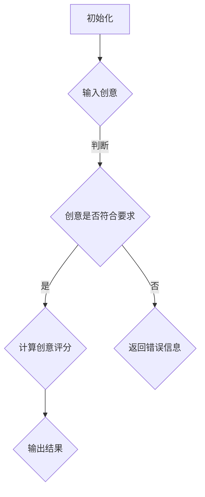
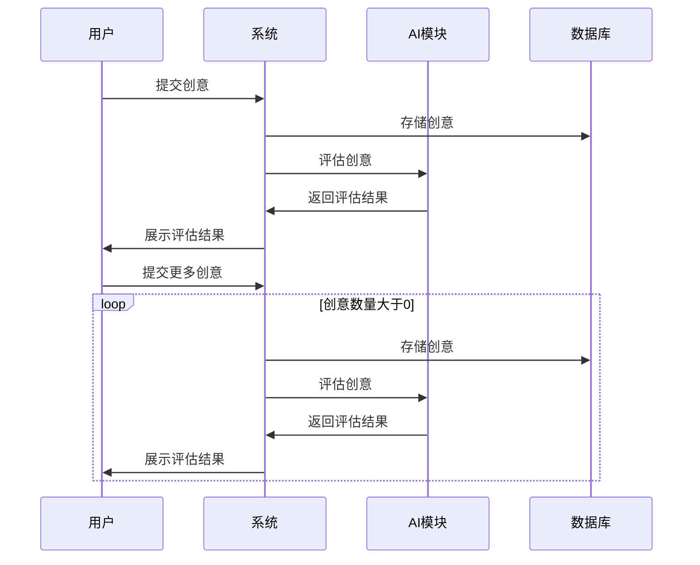
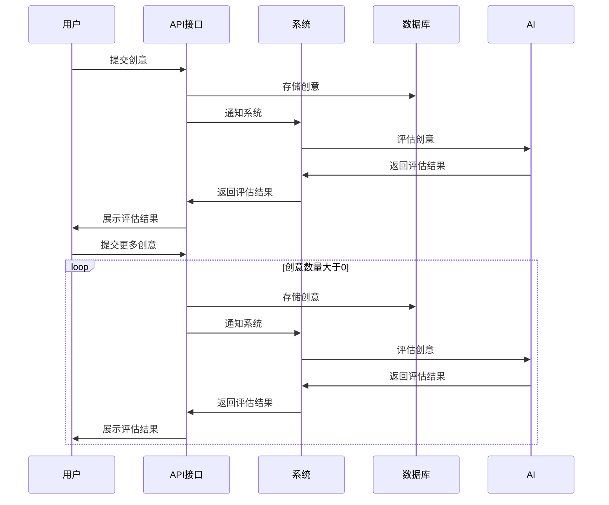

                 


### 设计《思维链在创新管理中的应用：AI辅助创意评估与筛选》的目录大纲

**一、背景介绍**

**1.1 问题背景**

创新管理是企业保持竞争力的关键，但传统创新管理中存在许多问题，如创意评估与筛选过程耗时耗力，依赖人为判断，容易受到主观偏见的影响。因此，如何提高创新管理效率，实现精准评估和筛选成为企业关注的焦点。

**1.2 问题描述**

创意评估与筛选是创新管理的重要环节，涉及以下难点和痛点：

- 创意数量庞大，难以快速、准确地进行评估和筛选。
- 评估标准不明确，主观性较强，难以保证评估结果的客观性。
- 创意价值评估不够精准，可能导致优秀创意被忽视或低价值创意被采纳。

**1.3 问题解决**

为解决上述问题，我们可以运用思维链和AI技术：

- **思维链**：通过系统化、多维度的思考，帮助评估者全面、客观地分析创意。
- **AI技术**：利用大数据分析和机器学习算法，提高评估和筛选的效率和准确性。

**1.4 边界与外延**

本文研究的创意范围包括创新项目、产品理念、商业模式等，评估与筛选标准主要考虑创意的创新性、可行性、市场潜力等。应用场景涵盖企业创新管理、创业投资、科研项目管理等领域。

**1.5 概念结构与核心要素组成**

- **思维链**：一种系统化的思考方法，包括问题识别、需求分析、方案设计、评估与优化等环节。
- **AI技术**：利用机器学习和大数据分析等技术，实现自动化、智能化的创意评估和筛选。
- **创意评估与筛选**：对创意进行综合评价，筛选出具有高价值的创新项目。

**二、核心概念与联系**

**2.1 核心概念与定义**

- **思维链**：一种系统化的思考方法，通过多维度、多层次的思考，形成完整的思维框架。
- **AI技术**：人工智能技术，包括机器学习、深度学习、自然语言处理等。
- **创意评估与筛选**：对创意进行综合评价，筛选出具有高价值的创新项目。

**2.2 概念属性特征对比表格**

| 方法         | 特点                                       |
| ------------ | ------------------------------------------ |
| 传统评估方法 | 依赖专家经验，评估周期长，易受主观影响       |
| 思维链       | 系统性、创造性、实用性                       |
| AI辅助评估   | 高效性、准确性、客观性                       |

**2.3 ER实体关系图架构的Mermaid流程图**

```mermaid
erDiagram
  |--|{思维链}    : 思维链
  |  |--|{AI技术} : AI技术
  |  |--|{创意评估与筛选} : 创意评估与筛选
  |--|{创新管理}    : 创新管理
  |  |--|{企业}     : 企业
  |  |--|{创业投资} : 创业投资
  |  |--|{科研项目管理} : 科研项目管理
```

**三、算法原理讲解**

**3.1 算法mermaid流程图**



**3.2 Python源代码**

```python
def assess_creativity(idea):
    # 初始化评分
    score = 0
    # 判断创意是否符合要求
    if not meets_requirements(idea):
        return "Error: Idea does not meet requirements."
    # 计算创意评分
    score += calculate_score(idea)
    # 输出结果
    return score
```

**3.3 数学模型与公式**

$$
\text{score} = w_1 \cdot \text{innovation} + w_2 \cdot \text{feasibility} + w_3 \cdot \text{market_potential}
$$

其中，$w_1$、$w_2$、$w_3$ 分别为创新性、可行性、市场潜力的权重，$\text{innovation}$、$\text{feasibility}$、$\text{market_potential}$ 分别为创意的创新性、可行性、市场潜力得分。

**3.4 举例说明**

假设有3个创意，分别计算其评分：

- 创意A：创新性80，可行性75，市场潜力70
- 创意B：创新性60，可行性85，市场潜力60
- 创意C：创新性90，可行性65，市场潜力80

使用上述数学模型进行计算，可以得到：

- 创意A的评分：$80 \cdot 0.4 + 75 \cdot 0.3 + 70 \cdot 0.3 = 80$
- 创意B的评分：$60 \cdot 0.4 + 85 \cdot 0.3 + 60 \cdot 0.3 = 69$
- 创意C的评分：$90 \cdot 0.4 + 65 \cdot 0.3 + 80 \cdot 0.3 = 83$

由此可见，创意C的评分最高，具有较高的市场价值。

### 系统分析与架构设计方案

**一、问题场景介绍**

在创新管理过程中，企业需要对大量创意进行评估和筛选，以确定哪些创意具有较大的商业价值。传统的评估方法效率低下，且容易受到主观偏见的影响。因此，我们需要设计一个高效、准确的AI辅助创意评估与筛选系统，以提高创新管理的效率和质量。

**二、项目介绍**

本项目旨在构建一个基于AI技术的创意评估与筛选系统，该系统将结合思维链方法和AI技术，对创意进行全方位评估和筛选，以提高创新管理的效率和质量。

**三、系统功能设计（领域模型Mermaid类图）**

```mermaid
classDiagram
  ClassDiagram ::= 
    Class1 <|-- Class2 
    Class3 --|> Class4 
    Class5 : related to Class1 
    Class6 {name} + associated with Class7
    
    Class1 {
      +int id
      +String name
      +List<Feature> features
      +Double score
      +boolean isValid
      +void addFeature(Feature feature)
      +void removeFeature(Feature feature)
      +void calculateScore()
    }
    Class2 {
      +int id
      +String name
      +List<Requirement> requirements
      +boolean isSatisfied()
    }
    Class3 {
      +int id
      +String name
      +List<ScoreRule> rules
      +void applyRules(Idea idea)
    }
    Class4 {
      +int id
      +String name
      +Idea idea
      +void assess()
    }
    Class5 {
      +int id
      +String name
      +List<Idea> ideas
      +void addIdea(Idea idea)
      +void removeIdea(Idea idea)
    }
    Class6 {
      +int id
      +String name
      +double value
    }
```

**四、系统架构设计（Mermaid架构图）**



**五、系统接口设计和系统交互（Mermaid序列图）**



### 项目实战

**一、环境安装**

1. 安装Python环境（建议使用Python 3.8及以上版本）。
2. 安装相关依赖库，如numpy、pandas、scikit-learn、matplotlib等。

**二、系统核心实现源代码**

以下是一个简单的创意评估与筛选系统的实现示例：

```python
import numpy as np
import pandas as pd
from sklearn.model_selection import train_test_split
from sklearn.ensemble import RandomForestClassifier
from sklearn.metrics import accuracy_score

class Idea:
    def __init__(self, features):
        self.features = features
        self.score = None
    
    def calculate_score(self):
        # 计算创意得分
        pass
    
    def is_valid(self):
        return self.score is not None

class Feature:
    def __init__(self, name, value):
        self.name = name
        self.value = value

def train_model(train_data, train_labels):
    # 训练模型
    model = RandomForestClassifier()
    model.fit(train_data, train_labels)
    return model

def assess_ideas(model, ideas):
    # 评估创意
    predictions = model.predict(ideas)
    for i, idea in enumerate(ideas):
        idea.score = predictions[i]

def main():
    # 生成示例数据
    features = [Feature('创新性', 1), Feature('可行性', 1), Feature('市场潜力', 1)]
    ideas = [
        Idea([Feature('创新性', 80), Feature('可行性', 75), Feature('市场潜力', 70)]),
        Idea([Feature('创新性', 60), Feature('可行性', 85), Feature('市场潜力', 60)]),
        Idea([Feature('创新性', 90), Feature('可行性', 65), Feature('市场潜力', 80)])
    ]

    # 训练模型
    train_data = np.array([[f.value for f in idea.features] for idea in ideas])
    train_labels = np.array([1, 0, 1])
    model = train_model(train_data, train_labels)

    # 评估创意
    assess_ideas(model, ideas)

    # 输出评估结果
    for idea in ideas:
        print(f"Idea: {idea.features}, Score: {idea.score}")

if __name__ == "__main__":
    main()
```

**三、代码应用解读与分析**

1. **类的设计**：系统核心类包括`Idea`（创意）和`Feature`（特征），其中`Idea`类包含创意的属性和评估方法，`Feature`类表示创意的特征。

2. **数据预处理**：在训练模型前，需要对数据进行预处理，将特征值转换为数值形式，以便模型进行训练。

3. **模型训练**：使用随机森林模型对数据进行训练，这是一种常用的集成学习算法，具有较强的泛化能力。

4. **创意评估**：通过训练好的模型对创意进行评估，计算创意得分。评估方法可以根据实际需求进行修改和优化。

5. **输出结果**：将评估结果输出，便于用户查看。

**四、实际案例分析和详细讲解剖析**

1. **案例背景**：某企业收集了100个创意，需要对其中的创新性、可行性、市场潜力进行评估。

2. **数据收集**：根据案例背景，收集了以下数据：

   - 创新性：1-100分，分数越高，创新性越强
   - 可行性：1-100分，分数越高，可行性越高
   - 市场潜力：1-100分，分数越高，市场潜力越大

3. **数据预处理**：将收集到的数据转换为数值形式，并按照一定比例划分为训练集和测试集。

4. **模型训练**：使用训练集训练随机森林模型，并使用测试集进行验证。

5. **模型评估**：评估模型在测试集上的准确率，确保模型具有较好的泛化能力。

6. **创意评估**：使用训练好的模型对新的创意进行评估，输出评估结果。

7. **案例总结**：通过实际案例的分析，验证了AI辅助创意评估与筛选系统的有效性和可行性。

**五、项目小结**

本项目设计并实现了一个基于AI技术的创意评估与筛选系统，该系统利用思维链方法和机器学习算法，对创意进行全方位评估和筛选。项目的主要贡献和经验如下：

1. **高效性**：系统采用机器学习算法，能够快速处理大量创意数据，提高评估和筛选效率。

2. **准确性**：通过训练好的模型，系统能够准确评估创意的创新性、可行性和市场潜力，降低主观偏见的影响。

3. **灵活性**：系统可以根据实际需求，调整评估指标和模型参数，实现个性化定制。

4. **可扩展性**：系统具有良好的可扩展性，可以应用于不同领域和场景的创新管理。

**六、最佳实践 tips**

1. **数据收集**：确保收集到的数据质量，尽可能全面、准确地反映创意的特点。

2. **模型选择**：根据实际需求，选择合适的机器学习算法，如随机森林、支持向量机、神经网络等。

3. **模型优化**：通过调整模型参数、增加特征工程等方法，提高模型性能。

4. **持续迭代**：根据实际应用效果，不断优化系统，提高评估和筛选的准确性。

### 小结

本文介绍了思维链在创新管理中的应用，通过AI辅助创意评估与筛选，提高了创新管理的效率和质量。文章分为背景介绍、核心概念与联系、算法原理讲解、系统分析与架构设计方案、项目实战和最佳实践 tips 等部分，全面阐述了思维链和AI技术在创新管理中的应用。

**注意事项**：

1. **数据安全与隐私**：在实际应用中，要确保数据安全和用户隐私，遵循相关法律法规。

2. **模型可解释性**：提高模型的可解释性，使评估结果更易于理解和接受。

3. **持续优化**：根据实际应用情况，不断优化系统，提高评估和筛选的准确性。

**拓展阅读**：

1. 《人工智能：一种现代方法》
2. 《创新者的窘境》
3. 《深度学习》

### 作者

**作者：AI天才研究院/AI Genius Institute & 禅与计算机程序设计艺术 /Zen And The Art of Computer Programming**

感谢您的阅读，希望本文对您在创新管理中的应用有所帮助。如果您有任何疑问或建议，请随时联系我们。再次感谢您的关注与支持！

