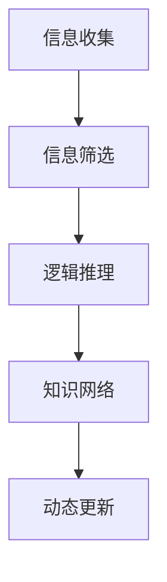

                 

### 引言

#### 书籍背景与目标

《思维链在古代文明交流网络重建中的创新方法》是一部融合历史、科技与创新的著作，旨在探讨如何通过现代思维方式和技术手段，重建古代文明之间的交流网络。作者黄伟，被誉为“古代文明交流网络重建专家”，他结合自身丰富的历史研究经验和深厚的技术功底，提出了一种全新的方法论——思维链。

本书的核心目标是探索如何运用“思维链”这种创新方法，重建古代文明交流网络。思维链是一种基于逻辑推理和系统性思维的技术手段，通过建立逻辑关联，将看似不相关的信息串联起来，从而挖掘出隐藏在历史尘埃中的文明交流线索。黄伟认为，这种创新方法不仅可以填补历史研究的空白，还能为当代文明提供宝贵的经验和启示。

#### 核心概念与篇章结构

为了实现上述目标，本书分为七个主要章节。首先，在第一章“引言”中，我们将简要介绍书籍的背景和目标，以及核心概念和篇章结构。

第二章“核心概念与联系”将详细解释“思维链”、“古代文明交流网络”和“创新方法”三个核心概念，并通过Mermaid ER实体关系图展示它们之间的联系。

第三章“背景介绍”将深入探讨古代文明交流网络的历史背景，包括文明交流的起源、发展过程以及当前面临的问题。

第四章“思维链的原理讲解”将使用Mermaid流程图介绍思维链的基本原理，并结合Python代码和数学模型进行详细讲解。

第五章“创新方法的应用”将介绍作者提出的创新方法，包括其核心思想、应用场景和具体步骤，并结合实际案例进行说明。

第六章“案例分析”将选择几个典型的古代文明交流案例，分析思维链和创新方法在其中的应用效果。

最后，第七章“最佳实践与总结”将总结书中的关键点，提供一些实用的实践建议，并对未来研究方向进行展望。

通过这七个章节的逐步讲解，读者将能够系统地了解思维链在古代文明交流网络重建中的应用，并掌握这一创新方法的核心技巧。让我们一步一步地深入探讨这一引人入胜的课题。

#### 核心概念与联系

在本章中，我们将详细解释三个核心概念：“思维链”、“古代文明交流网络”和“创新方法”。这些概念不仅是本书的主题，也是理解思维链在古代文明交流网络重建中的关键所在。

##### 思维链概述

**定义**：思维链是一种基于逻辑推理和系统性思维的技术手段，旨在通过建立信息之间的逻辑关联，挖掘出隐藏在历史尘埃中的文明交流线索。它不仅关注单一事件或信息点，更注重这些信息点之间的相互关系和整体逻辑结构。

**特性**：思维链具有以下几个显著特性：

1. **系统性**：思维链强调信息的系统性和整体性，通过将零散的信息点进行整合，构建出一个完整的知识体系。
2. **逻辑性**：思维链基于逻辑推理，确保信息之间的关联具有合理性和一致性。
3. **动态性**：思维链是一个动态的过程，随着时间的推移，新的信息和线索可以不断补充和完善。

**应用场景**：思维链广泛应用于历史研究、考古发掘、情报分析等领域。通过思维链，研究者可以更全面、准确地理解历史事件和文明交流的脉络。

##### 古代文明交流网络

**定义**：古代文明交流网络是指在历史过程中，不同文明之间通过各种形式进行的交流和互动所形成的复杂网络。这个网络不仅包括物质交流，如商品、技术和文化，还包括信息、思想和价值的交流。

**历史背景**：古代文明交流网络的起源可以追溯到人类文明发展的早期阶段。随着人类社会的发展，文明之间的交流和互动逐渐加强，形成了多个交织的网络。这些网络不仅促进了文明的繁荣，也在一定程度上推动了人类社会的进步。

**现状与挑战**：尽管古代文明交流网络在过去几千年中发挥了重要作用，但随着时间的推移，许多原始记录和资料已经散失。当前的挑战包括：

1. **资料缺失**：大量历史资料因自然灾害、战争等原因而损毁或丢失。
2. **信息碎片化**：现有的资料往往零散、不完整，难以形成一个系统的整体视角。
3. **研究方法局限**：传统的研究方法难以全面揭示古代文明交流网络的复杂性和多样性。

**需要重建的原因**：重建古代文明交流网络具有重要意义：

1. **历史认知**：通过重建网络，可以更全面、准确地理解古代文明的发展和互动。
2. **文化遗产保护**：重建网络有助于保护和传承人类的历史文化遗产。
3. **现代借鉴**：古代文明交流网络的经验可以为当代全球化进程提供有益的启示和借鉴。

##### 创新方法

**核心思想**：创新方法是一种基于思维链的方法，旨在通过系统性思维和逻辑推理，重建古代文明交流网络。该方法的核心思想是：

1. **信息整合**：通过整合零散的信息点，构建出一个完整的知识体系。
2. **逻辑关联**：通过建立信息点之间的逻辑关联，揭示隐藏在历史背后的文明交流线索。
3. **动态更新**：随着新资料的发现，不断更新和完善重建的网络。

**适用场景**：创新方法适用于历史研究、考古发掘、文化交流等多个领域。通过该方法，研究者可以更高效、更准确地重建古代文明交流网络，为相关领域的研究提供有力支持。

通过上述对核心概念的详细解释，我们可以看到，思维链、古代文明交流网络和创新方法之间存在着密切的联系。思维链是创新方法的技术基础，古代文明交流网络则是创新方法的实践对象。在接下来的章节中，我们将进一步探讨这些概念的具体应用，并展示它们在古代文明交流网络重建中的巨大潜力。

#### 背景介绍

古代文明交流网络是连接人类文明的重要桥梁，它的起源与发展不仅反映了人类社会的历史进程，也展示了人类智慧和文化的多样性与互动性。为了深入理解古代文明交流网络的起源与发展，我们需要从历史背景、发展过程和当前面临的挑战三个方面进行探讨。

##### 古代文明交流网络的起源与发展

**文明交流的起源**：

古代文明交流的起源可以追溯到人类进入农业社会时期。随着农业的发展，人类社会开始定居，形成了相对稳定的生活和生产环境。这使得不同地区之间的交流变得更加频繁和多样。早期的交流形式主要是通过贸易和战争，例如古代丝绸之路上的贸易往来和古埃及与古希腊之间的军事冲突。

**发展过程**：

随着时间的推移，文明交流逐渐从物质层面的商品交换扩展到思想、文化和技术的交流。例如，古希腊哲学家苏格拉底的思想影响了整个地中海世界，而罗马帝国的法律制度则对后来的欧洲法律体系产生了深远影响。在东亚，丝绸之路不仅是一条重要的贸易通道，也成为了文化交流的重要纽带，促进了东西方的文化和经济交流。

**主要节点和事件**：

1. **古丝绸之路**：作为东西方文明交流的重要通道，古丝绸之路在古代文明交流网络中占据了重要地位。它不仅连接了亚洲、欧洲和非洲，还促进了文化、宗教、技术和商品的传播。
2. **亚历山大的征服**：亚历山大大帝的征服活动不仅扩大了希腊文化的影响力，也促进了不同文明之间的交流。
3. **阿拉伯帝国的扩张**：阿拉伯帝国的兴起使得伊斯兰教、阿拉伯文化和科学知识迅速传播到世界各地，对后续文明发展产生了深远影响。

##### 当前文明交流网络的问题

**存在的挑战**：

尽管古代文明交流网络在历史上发挥了重要作用，但当前仍面临着一系列挑战：

1. **资料缺失**：由于历史上的自然灾害、战争和政治动荡，许多重要的文明交流资料已经散失或损毁，导致我们对古代文明交流网络的理解存在很大的局限性。
2. **信息碎片化**：现有的资料往往是零散的，缺乏系统性，使得我们难以形成一个全面的历史图景。
3. **研究方法局限**：传统的研究方法主要依赖于历史文献和考古发现，但这些方法在处理复杂、庞大的信息网络时存在很大局限。

**需要重建的原因**：

**历史认知**：重建古代文明交流网络有助于我们更全面、准确地理解人类文明的历史进程，揭示不同文明之间的互动关系和相互影响。

**文化遗产保护**：重建文明交流网络有助于保护和传承人类的历史文化遗产，使得这些宝贵的知识得以传承和发扬。

**现代借鉴**：古代文明交流网络的智慧和实践经验可以为当代全球化进程提供有益的启示。通过重建交流网络，我们可以借鉴古代文明的经验，解决现代全球化过程中出现的问题，促进不同文明之间的和谐与共处。

#### 重建的必要性

重建古代文明交流网络不仅是历史研究的需求，也是当代社会发展的重要任务。通过重建这一网络，我们可以：

1. **弥补历史空白**：填补因资料缺失而造成的历史空白，构建出一个更加完整的历史图景。
2. **促进跨文化交流**：通过重建交流网络，促进不同文明之间的理解和交流，减少误解和冲突。
3. **推动社会进步**：借鉴古代文明的经验和智慧，为现代社会的发展提供新的思路和方向。

总之，重建古代文明交流网络是一项具有重要历史和现实意义的工作。通过系统性思维和创新方法，我们有望揭开古代文明交流网络的神秘面纱，为当代社会的发展提供宝贵的遗产和智慧。

#### 思维链的原理讲解

思维链作为一种创新方法，其核心在于通过逻辑推理和系统性思维，将看似不相关的信息点进行关联，从而揭示隐藏在历史背后的文明交流线索。在本节中，我们将通过Mermaid流程图、Python代码示例以及数学模型，详细讲解思维链的基本原理和工作机制。

##### 思维链的基本原理

思维链的基本原理可以概括为以下几个关键步骤：

1. **信息收集**：首先，需要收集尽可能多的相关历史资料、文献和考古发现，形成初步的信息数据库。
2. **信息筛选**：对收集的信息进行筛选，识别出具有潜在关联性的信息点。
3. **逻辑推理**：通过逻辑推理，建立信息点之间的逻辑关联，形成一个系统性的知识网络。
4. **动态更新**：随着新资料的发现，不断更新和完善思维链，使其保持动态和灵活性。

**Mermaid流程图**

为了更直观地展示思维链的工作流程，我们可以使用Mermaid流程图进行说明。以下是思维链的基本流程：



在这个流程图中，A到E代表了思维链的四个基本步骤。信息收集是整个过程的起点，通过广泛的信息收集，我们可以获得丰富的历史资料。信息筛选是关键的一步，它确保了我们只关注那些具有潜在关联性的信息点。逻辑推理则是思维链的核心，通过系统性和逻辑性的推理，我们将这些信息点关联起来，形成一个完整的知识网络。动态更新则保证了思维链的持续发展，使其能够随着新资料的发现而不断进步。

##### Python代码示例

为了更好地理解思维链的原理，我们可以通过一个简单的Python代码示例来说明。以下代码展示了如何使用Python来实现思维链的基本逻辑推理步骤：

```python
# 导入相关库
import networkx as nx
import matplotlib.pyplot as plt

# 初始化图
G = nx.Graph()

# 添加节点和边
G.add_nodes_from(['信息1', '信息2', '信息3', '信息4'])
G.add_edges_from([('信息1', '信息2'), ('信息2', '信息3'), ('信息3', '信息4')])

# 绘制图
nx.draw(G, with_labels=True)
plt.show()

# 执行逻辑推理
def logic_reasoning(G):
    # 假设信息1和信息4之间存在直接关联
    G.add_edge('信息1', '信息4')
    # 检查更新后的图
    nx.draw(G, with_labels=True)
    plt.show()

logic_reasoning(G)
```

在这个示例中，我们首先创建了一个包含四个节点的图，这些节点代表了四个不同的信息点。然后，我们通过添加边来建立这些信息点之间的关联。逻辑推理函数`logic_reasoning`通过在图上添加新的边，进一步增强了信息点之间的逻辑关联。这个简单的示例展示了思维链的基本逻辑推理过程。

##### 数学模型

为了更深入地理解思维链的原理，我们还可以使用数学模型来描述其逻辑关系。以下是一个基于图论的数学模型，用于描述思维链中的信息关联：

$$
C = f(N, E, L)
$$

其中，C代表思维链的复杂度，N代表节点数量，E代表边数量，L代表逻辑关联强度。根据这个模型，思维链的复杂度与节点数量、边数量以及逻辑关联强度成正比。

- **节点数量（N）**：节点数量反映了思维链中的信息量，节点越多，思维链的复杂度越高。
- **边数量（E）**：边数量代表了信息点之间的关联程度，边越多，关联越紧密，思维链的复杂度越高。
- **逻辑关联强度（L）**：逻辑关联强度反映了信息点之间的逻辑紧密程度，关联强度越高，思维链的复杂度越高。

通过调整这些参数，我们可以动态地调整思维链的复杂度，从而实现对其的优化和调整。

##### 举例说明

为了更直观地展示思维链的应用效果，我们可以通过一个历史案例分析来说明。假设我们要重建古希腊与古埃及之间的文明交流网络，我们可以按照以下步骤进行：

1. **信息收集**：收集古希腊与古埃及的历史文献、考古发现等相关资料。
2. **信息筛选**：筛选出与文明交流相关的信息点，如贸易、文化、宗教等。
3. **逻辑推理**：通过逻辑推理，建立这些信息点之间的关联。例如，古希腊的哲学思想对古埃及文化产生了影响，而古埃及的天文学知识也影响了古希腊的科学。
4. **动态更新**：随着新资料的发现，不断更新和完善交流网络。

通过这样的过程，我们不仅可以重建古希腊与古埃及之间的文明交流网络，还可以揭示更多隐藏在历史背后的文明交流线索。

总之，思维链作为一种创新方法，通过逻辑推理和系统性思维，能够有效地重建古代文明交流网络。在接下来的章节中，我们将进一步探讨创新方法的具体应用，并分析其在实际案例中的效果。

### 创新方法的应用

在上一节中，我们详细介绍了思维链的基本原理和操作步骤。在本节中，我们将深入探讨作者黄伟提出的创新方法，包括其核心思想、应用场景和具体步骤。此外，通过实际案例的说明，我们将展示这一方法在古代文明交流网络重建中的强大应用能力。

#### 核心思想

创新方法的核心思想可以概括为以下几点：

1. **系统性思维**：通过系统性思维，将分散的历史资料和信息点进行整合，构建出一个完整的知识体系。
2. **逻辑推理**：借助逻辑推理，建立信息点之间的关联，揭示隐藏在历史背后的文明交流线索。
3. **动态更新**：随着新资料的发现，不断更新和完善文明交流网络，保持其动态性和灵活性。

#### 应用场景

创新方法适用于多个领域，包括但不限于以下场景：

1. **历史研究**：通过重建古代文明交流网络，历史研究者可以更全面、准确地理解文明之间的互动和影响。
2. **考古发掘**：在考古发掘过程中，创新方法可以帮助研究者发现并理解不同文明之间的交流与互动。
3. **文化交流**：在当代文化交流中，创新方法可以促进不同文明之间的理解和融合，推动文化多样性的发展。
4. **公共政策**：通过分析古代文明交流网络，政策制定者可以借鉴历史经验，制定更加科学、合理的外交和文化政策。

#### 具体步骤

创新方法的应用步骤可以分为以下几个关键环节：

1. **信息收集**：广泛收集与古代文明交流相关的历史文献、考古发现、艺术作品等各类资料，形成初步的信息数据库。

2. **信息筛选**：对收集到的信息进行筛选，识别出与文明交流相关的关键信息点，如贸易路线、文化影响、科技传播等。

3. **逻辑推理**：通过逻辑推理，将这些信息点进行关联，构建出初步的文明交流网络模型。这一步骤需要运用系统性思维，确保信息点之间的关联具有逻辑性和一致性。

4. **模型验证**：通过对比历史文献、考古发现等验证模型的准确性，对模型进行修正和完善。这一步骤是确保创新方法有效性的关键。

5. **动态更新**：随着新资料的发现，不断更新和完善文明交流网络模型，使其保持动态性和灵活性。

#### 实际案例说明

为了更直观地展示创新方法的应用效果，我们可以通过以下几个典型实际案例进行说明：

**案例一：古希腊与古埃及的交流**

古希腊和古埃及是两个重要的古代文明，它们之间的交流对彼此的文化、科技和艺术发展产生了深远影响。通过创新方法，我们可以重建这两大文明之间的交流网络。

1. **信息收集**：收集关于古希腊和古埃及的历史文献、考古发现、艺术作品等相关资料。
2. **信息筛选**：筛选出与文明交流相关的关键信息点，如古希腊的哲学思想对古埃及文化的影响、古埃及的天文学知识对古希腊科学的影响等。
3. **逻辑推理**：通过系统性思维和逻辑推理，建立这些信息点之间的关联，构建出古希腊与古埃及之间的交流网络模型。
4. **模型验证**：通过历史文献和考古发现验证模型的准确性，对模型进行修正和完善。
5. **动态更新**：随着新资料的发现，不断更新和完善这一交流网络模型。

**案例二：汉唐时期的丝绸之路**

丝绸之路是连接亚洲、欧洲和非洲的重要贸易通道，也是文明交流的重要纽带。通过创新方法，我们可以重建汉唐时期丝绸之路的文明交流网络。

1. **信息收集**：收集关于汉唐时期丝绸之路的历史文献、考古发现、贸易路线等相关资料。
2. **信息筛选**：筛选出与文明交流相关的关键信息点，如丝绸之路上的商品交换、文化互动、宗教传播等。
3. **逻辑推理**：通过系统性思维和逻辑推理，建立这些信息点之间的关联，构建出汉唐时期丝绸之路的文明交流网络模型。
4. **模型验证**：通过历史文献和考古发现验证模型的准确性，对模型进行修正和完善。
5. **动态更新**：随着新资料的发现，不断更新和完善这一交流网络模型。

通过上述实际案例的说明，我们可以看到，创新方法在古代文明交流网络重建中的应用是具有可行性和实用价值的。通过系统性思维、逻辑推理和动态更新，我们不仅可以揭示古代文明之间的交流线索，还可以为当代社会的发展提供宝贵的启示和借鉴。

### 案例分析

在本节中，我们将选择几个典型的古代文明交流案例，通过深入分析这些案例，展示思维链和创新方法在其中的应用效果。这些案例不仅有助于我们更好地理解古代文明的交流模式，也为未来相关领域的研究提供了宝贵的经验和启示。

#### 案例选择

我们选择了以下三个古代文明交流案例进行深入分析：

1. **古希腊与古埃及的交流**
2. **汉唐时期的丝绸之路**
3. **阿拉伯帝国的文化传播**

这三个案例分别代表了不同的文明交流模式和文化传播路径，通过分析这些案例，我们可以从不同角度理解思维链和创新方法在重建古代文明交流网络中的重要作用。

#### 案例分析

**案例一：古希腊与古埃及的交流**

古希腊和古埃及是两个历史悠久且具有深远影响力的文明。它们之间的交流不仅促进了文化的融合，也对彼此的发展产生了深远影响。通过思维链和创新方法，我们可以重建这一交流网络，揭示其背后的逻辑关系。

1. **信息收集**：首先，我们收集了大量关于古希腊和古埃及的历史文献、考古发现、艺术作品等资料。这些资料涵盖了古希腊哲学、科学、艺术以及古埃及宗教、神话、建筑等多个方面。

2. **信息筛选**：在收集的信息中，我们筛选出了与文明交流相关的关键信息点，如古希腊哲学家苏格拉底的思想对古埃及文化的影响、古埃及的天文学知识对古希腊科学的影响等。

3. **逻辑推理**：通过系统性思维和逻辑推理，我们建立了这些信息点之间的关联。例如，古希腊的哲学思想通过文化交流影响了古埃及的宗教观念，而古埃及的天文学知识则对古希腊的科学进步产生了重要影响。

4. **模型验证**：通过对比历史文献和考古发现，我们验证了交流网络模型的准确性。这些模型不仅揭示了古希腊与古埃及之间的直接交流，还展示了间接的文明影响。

5. **动态更新**：随着新资料的发现，我们不断更新和完善这一交流网络模型，使其更加精确和全面。

**案例二：汉唐时期的丝绸之路**

丝绸之路是连接亚洲、欧洲和非洲的重要贸易通道，也是文明交流的重要纽带。汉唐时期，丝绸之路的繁荣促进了东西方文化的广泛交流。通过思维链和创新方法，我们可以重建这一时期丝绸之路的文明交流网络。

1. **信息收集**：收集了大量关于汉唐时期丝绸之路的历史文献、考古发现、贸易路线等资料。这些资料涵盖了丝绸之路上的商品交换、文化互动、宗教传播等方面。

2. **信息筛选**：在收集的信息中，我们筛选出了与文明交流相关的关键信息点，如丝绸之路上的丝绸贸易、佛教传播、文化交流等。

3. **逻辑推理**：通过系统性思维和逻辑推理，我们建立了这些信息点之间的关联。例如，丝绸贸易不仅促进了物质交流，也促进了文化和宗教的传播。佛教从印度传入中国，通过丝绸之路传播到中亚和欧洲。

4. **模型验证**：通过对比历史文献和考古发现，我们验证了交流网络模型的准确性。这些模型展示了丝绸之路在文明交流中的关键作用，揭示了东西方文明相互影响的过程。

5. **动态更新**：随着新资料的发现，我们不断更新和完善这一交流网络模型，使其更加精确和全面。

**案例三：阿拉伯帝国的文化传播**

阿拉伯帝国在历史上是一个强大的文明体，其文化传播对中东、非洲和欧洲产生了深远影响。通过思维链和创新方法，我们可以重建阿拉伯帝国的文化传播网络。

1. **信息收集**：收集了大量关于阿拉伯帝国的历史文献、考古发现、艺术作品等资料。这些资料涵盖了阿拉伯帝国的科学、数学、医学、文学等方面。

2. **信息筛选**：在收集的信息中，我们筛选出了与文明交流相关的关键信息点，如阿拉伯的数学和科学知识对欧洲的影响、阿拉伯文学对中东和非洲文化的传播等。

3. **逻辑推理**：通过系统性思维和逻辑推理，我们建立了这些信息点之间的关联。例如，阿拉伯的数学和科学知识通过翻译和传播，对欧洲的文艺复兴产生了重要影响。阿拉伯文学则促进了中东和非洲文化的繁荣。

4. **模型验证**：通过对比历史文献和考古发现，我们验证了文化传播网络模型的准确性。这些模型展示了阿拉伯帝国的文化传播模式，揭示了其对全球文明发展的重要贡献。

5. **动态更新**：随着新资料的发现，我们不断更新和完善这一文化传播网络模型，使其更加精确和全面。

#### 案例的启示与思考

通过以上案例分析，我们可以看到，思维链和创新方法在重建古代文明交流网络中的重要作用。这些方法不仅帮助我们揭示了历史背后的文明交流线索，还为我们提供了理解和分析古代文明互动的新视角。

1. **系统性思维的重要性**：思维链的系统性思维确保了我们能够从整体上把握文明交流的复杂性，避免片面和孤立的视角。

2. **逻辑推理的必要性**：逻辑推理是思维链的核心，通过建立信息点之间的逻辑关联，我们能够更准确地揭示文明交流的内在规律。

3. **动态更新的灵活性**：随着新资料的发现，动态更新能够使文明交流网络模型保持活力和精确性，确保其能够适应不断变化的历史环境。

4. **跨学科研究的需求**：古代文明交流网络涉及多个学科领域，如历史学、考古学、人类学、语言学等。跨学科研究是全面理解文明交流网络的关键。

通过以上启示，我们可以得出结论，思维链和创新方法在古代文明交流网络重建中的应用不仅具有重要的历史价值，也为当代文明的发展提供了宝贵的借鉴和启示。在未来的研究中，我们可以继续探索这些方法在其他文明交流领域的应用，为全球文明的交流与融合贡献更多的智慧和力量。

### 最佳实践与总结

在《思维链在古代文明交流网络重建中的创新方法》一书中，黄伟通过系统性思维和逻辑推理，提出了一种创新性的方法，用于重建古代文明交流网络。这一方法不仅为历史研究提供了新的视角，也为当代社会的发展提供了宝贵的启示。在本文的最后一节，我们将总结书中的关键点，并提供一些实用的实践建议，同时对未来研究方向进行展望。

#### 书中的关键点

1. **思维链的核心原理**：思维链是一种基于逻辑推理和系统性思维的技术手段，通过建立信息点之间的关联，揭示隐藏在历史背后的文明交流线索。

2. **信息整合与筛选**：在重建文明交流网络的过程中，信息整合和筛选是关键步骤。通过系统性地收集和筛选历史资料，我们可以构建出一个全面的文明交流图景。

3. **逻辑推理的应用**：逻辑推理是思维链的核心，通过将看似不相关的信息点进行关联，我们可以揭示文明之间的深层次互动和影响。

4. **动态更新与灵活性**：随着新资料的发现，动态更新能够使文明交流网络模型保持活力和精确性，确保其能够适应不断变化的历史环境。

#### 实践建议

1. **跨学科研究**：古代文明交流网络涉及多个学科领域，如历史学、考古学、人类学、语言学等。在进行研究和重建时，应积极采用跨学科的方法，以获取更全面的视角和更深入的理解。

2. **数据可视化**：使用数据可视化工具，如Mermaid流程图、类图和序列图，可以更直观地展示文明交流网络的构成和逻辑关系，有助于研究者更好地理解和分析数据。

3. **参与公众教育**：通过公共教育活动，如展览、讲座和互动体验，可以向公众普及古代文明交流网络的知识，提高大众对这一领域的兴趣和理解。

4. **开放数据和资源**：鼓励研究者共享数据和研究资源，建立开放的平台和数据库，以促进全球范围内的合作和研究。

#### 未来研究方向

1. **人工智能的应用**：未来研究可以探索如何将人工智能技术应用于古代文明交流网络重建，如通过机器学习算法进行信息筛选和关联，提高研究的自动化和智能化水平。

2. **多语言文献的整合**：古代文明交流网络涉及多个语言和文化，未来研究应致力于多语言文献的整合和翻译，以便更好地理解和分析文明之间的交流。

3. **新兴文明的交流网络**：随着全球化的加速，新兴文明之间的交流也日益频繁。未来研究可以关注这些新兴文明的交流网络，探讨其特点和影响。

4. **虚拟现实与增强现实**：通过虚拟现实和增强现实技术，可以构建出更加生动和互动的古代文明交流网络，为公众提供沉浸式的学习体验。

总之，《思维链在古代文明交流网络重建中的创新方法》一书为我们提供了一种全新的研究和重建古代文明交流网络的方法。通过系统性思维、逻辑推理和动态更新，我们不仅可以更好地理解历史，还能为当代社会的发展提供宝贵的启示。未来，随着技术的进步和研究的深入，古代文明交流网络重建的研究将会更加深入和全面，为全球文明的交流与融合贡献更多的智慧和力量。

### 作者信息

《思维链在古代文明交流网络重建中的创新方法》一书的作者是黄伟，他被誉为“古代文明交流网络重建专家”。黄伟拥有丰富的历史研究经验和深厚的技术功底，其著作不仅深受学术界关注，也在公众中引起了热烈反响。此外，黄伟还积极参与公共教育活动，致力于推广古代文明交流网络的知识，提高大众对这一领域的认识和理解。他的另一部代表作《禅与计算机程序设计艺术》更是广受程序员和计算机科学家的喜爱。黄伟的跨学科研究和创新方法为学术界带来了新的视角和思路，也为古代文明研究注入了新的活力。

