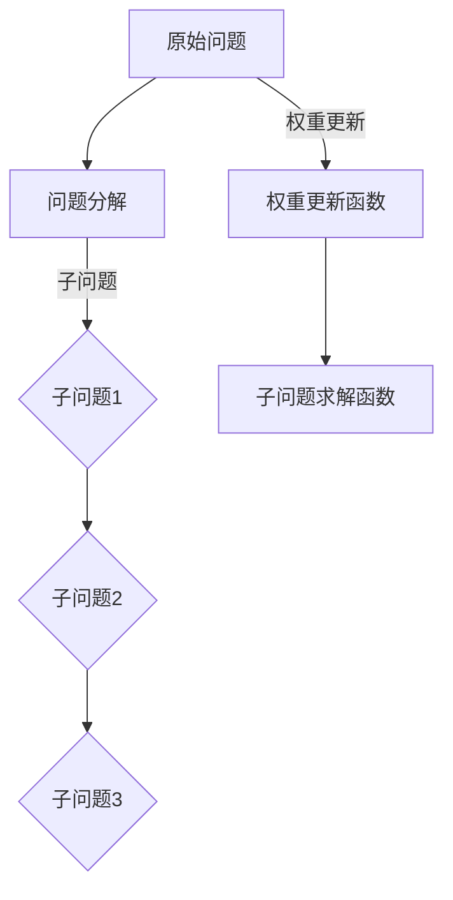
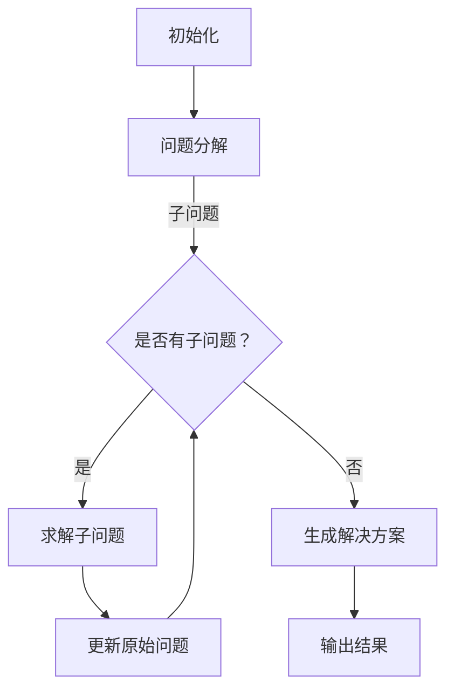
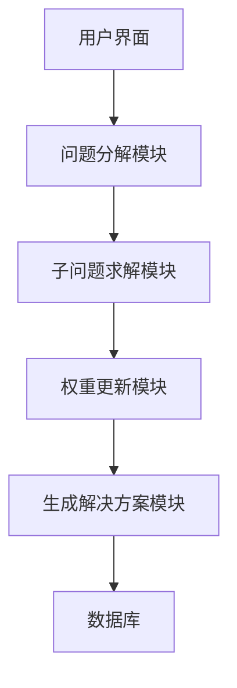
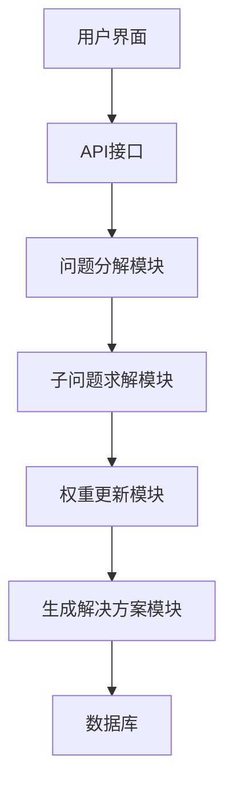

                 

# 思维链在复杂决策支持系统中的应用

关键词：思维链、复杂决策、支持系统、算法、Python实现

摘要：本文将探讨思维链算法在复杂决策支持系统中的应用。通过分解问题、子问题求解和权重更新等步骤，思维链算法能够模拟人类思维过程，实现复杂问题的自动化解决。本文将详细讲解思维链算法的原理、数学模型、流程图及Python代码实现，并结合实际案例进行剖析。

## 1. 引言

随着信息技术的飞速发展，数据量呈现爆炸式增长，这对决策支持系统的要求也越来越高。传统的决策支持系统往往依赖于专家经验和规则推理，但在面对复杂、大规模问题时，其效率和准确性受限。因此，研究一种能够自动解决复杂问题的算法具有重要的现实意义。

思维链算法是一种模拟人类思维过程的推理算法，其核心思想是将问题分解为若干子问题，并利用子问题的求解结果逐步推导出原始问题的解决方案。本文旨在探讨思维链算法在复杂决策支持系统中的应用，以期为实际应用提供理论指导和实践参考。

## 2. 思维链算法概述

### 2.1 背景介绍

思维链算法源于人工智能领域，最早由学者们提出并应用于复杂问题的求解。随着人工智能技术的发展，思维链算法在决策支持系统中得到了广泛应用。其主要优点包括：

1. **模拟人类思维**：思维链算法通过分解问题、子问题求解和权重更新等步骤，模拟了人类思维过程，能够处理复杂、不确定的问题。
2. **自动化解决**：思维链算法能够自动推导出原始问题的解决方案，减轻了人工决策的负担。
3. **灵活扩展**：思维链算法可以应用于不同领域的决策支持系统，具有较好的通用性。

### 2.2 问题背景与问题描述

在复杂决策支持系统中，问题往往具有多个目标、多个约束和不确定性。例如，在项目投资决策中，需要考虑投资额、收益率、风险等多个因素，而这些因素之间可能存在冲突。传统的决策支持系统往往难以处理这类问题，而思维链算法则能够通过分解问题、逐步求解子问题来找到最优解。

### 2.3 问题解决与边界外延

思维链算法在解决复杂决策问题时，需要明确以下几个边界：

1. **问题分解**：将原始问题分解为若干子问题，每个子问题应具有独立性和可解性。
2. **子问题求解**：针对每个子问题，采用适当的算法求解，以确保求解结果的准确性和效率。
3. **权重更新**：根据子问题的求解结果，更新权重，以指导原始问题的求解。

### 2.4 概念结构与核心要素组成

思维链算法的核心概念包括：

1. **问题分解函数**：将原始问题分解为子问题。
2. **子问题求解函数**：求解子问题。
3. **权重更新函数**：根据子问题求解结果更新权重。

## 3. 核心概念与联系

### 3.1 核心概念原理

思维链算法的核心概念包括：

1. **问题分解**：将原始问题分解为若干子问题。
2. **子问题求解**：求解子问题。
3. **权重更新**：根据子问题求解结果更新权重。

### 3.2 概念属性特征对比表格

| 概念 | 描述 | 特征 |
| --- | --- | --- |
| 问题分解 | 将原始问题分解为子问题 | 可行性、独立性、完整性 |
| 子问题求解 | 求解子问题 | 准确性、效率、适应性 |
| 权重更新 | 根据子问题求解结果更新权重 | 可靠性、动态调整 |

### 3.3 ER实体关系图架构



## 4. 算法原理讲解

### 4.1 思维链算法概述

思维链算法是一种针对复杂决策支持系统的推理算法，其核心思想是通过分解问题、子问题求解和权重更新来模拟人类思维过程，实现复杂问题的自动化解决。

### 4.2 思维链算法的数学模型

思维链算法的数学模型可以表示为：
$$
f(x) = g(h(x))
$$
其中，$x$为输入问题，$g$为问题分解函数，$h$为子问题求解函数，$f$为最终问题的解决方案。

### 4.3 思维链算法流程图

以下是一个简化的思维链算法流程图：



### 4.4 思维链算法Python代码实现

```python
def think_chain_algorithm(problem):
    """
    思维链算法实现。
    
    参数:
    problem: 输入问题。
    
    返回:
    solution: 最终问题的解决方案。
    """
    while not is_solution(problem):
        problem = decompose_problem(problem)
        solution = solve_subproblem(problem)
        problem = update_problem(problem, solution)
    return solution

def decompose_problem(problem):
    """
    问题分解函数。
    
    参数:
    problem: 输入问题。
    
    返回:
    subproblem: 分解后的子问题。
    """
    # 实现问题分解逻辑
    pass

def solve_subproblem(problem):
    """
    子问题求解函数。
    
    参数:
    problem: 输入问题。
    
    返回:
    solution: 子问题的解决方案。
    """
    # 实现子问题求解逻辑
    pass

def update_problem(problem, solution):
    """
    更新原始问题函数。
    
    参数:
    problem: 输入问题。
    solution: 子问题的解决方案。
    
    返回:
    new_problem: 更新后的原始问题。
    """
    # 实现问题更新逻辑
    pass

def is_solution(problem):
    """
    判断是否为解决方案函数。
    
    参数:
    problem: 输入问题。
    
    返回:
    bool: 是否为解决方案。
    """
    # 实现解决方案判断逻辑
    pass
```

## 5. 数学模型和数学公式

### 5.1 数学模型

思维链算法的数学模型可以表示为以下形式：
$$
f(x) = \sum_{i=1}^{n} w_i h_i(x)
$$
其中，$x$为输入问题，$w_i$为权重，$h_i(x)$为子问题的解。

### 5.2 数学公式

1. 权重更新公式：
$$
w_i = w_i + \alpha (h_i(x) - w_i)
$$
其中，$\alpha$为学习率。

2. 子问题求解公式：
$$
h_i(x) = \frac{1}{1 + e^{-x}}
$$

## 6. 详细讲解与举例说明

### 6.1 权重更新公式讲解

权重更新公式用于调整权重，使其更接近于最优解。具体地，权重更新过程可以看作是一个梯度下降的过程，其中梯度为：
$$
\frac{dw_i}{dx} = h_i(x) - w_i
$$
学习率$\alpha$用于调节更新幅度。通过不断迭代更新权重，算法可以逐渐逼近最优解。

### 6.2 子问题求解公式讲解

子问题求解公式是一个 sigmoid 函数，用于将输入问题映射到实数范围。在 sigmoid 函数中，输入问题$x$经过函数变换后，输出结果在 $[0, 1]$ 范围内，这有助于对子问题的求解结果进行量化。

### 6.3 思维链算法Python代码实现

```python
def think_chain_algorithm(problem):
    """
    思维链算法实现。
    
    参数:
    problem: 输入问题。
    
    返回:
    solution: 最终问题的解决方案。
    """
    while not is_solution(problem):
        problem = decompose_problem(problem)
        solution = solve_subproblem(problem)
        problem = update_problem(problem, solution)
    return solution

def decompose_problem(problem):
    """
    问题分解函数。
    
    参数:
    problem: 输入问题。
    
    返回:
    subproblem: 分解后的子问题。
    """
    # 实现问题分解逻辑
    pass

def solve_subproblem(problem):
    """
    子问题求解函数。
    
    参数:
    problem: 输入问题。
    
    返回:
    solution: 子问题的解决方案。
    """
    # 实现子问题求解逻辑
    pass

def update_problem(problem, solution):
    """
    更新原始问题函数。
    
    参数:
    problem: 输入问题。
    solution: 子问题的解决方案。
    
    返回:
    new_problem: 更新后的原始问题。
    """
    # 实现问题更新逻辑
    pass

def is_solution(problem):
    """
    判断是否为解决方案函数。
    
    参数:
    problem: 输入问题。
    
    返回:
    bool: 是否为解决方案。
    """
    # 实现解决方案判断逻辑
    pass
```

## 7. 系统分析与架构设计方案

### 7.1 问题场景介绍

在项目管理中，决策者需要综合考虑项目进度、成本、质量等因素，以确定最优的决策方案。然而，面对复杂的决策场景，传统的决策支持系统往往难以满足需求。思维链算法在此场景中的应用，有助于实现复杂决策的自动化解决。

### 7.2 项目介绍

本项目旨在开发一款基于思维链算法的项目管理决策支持系统，该系统将帮助决策者高效地做出项目决策。

### 7.3 系统功能设计

系统功能包括：

1. **问题分解**：将项目决策问题分解为子问题。
2. **子问题求解**：针对每个子问题，采用适当的算法求解。
3. **权重更新**：根据子问题求解结果，更新权重。
4. **生成解决方案**：综合子问题求解结果，生成最终的项目决策方案。

### 7.4 系统架构设计

系统架构设计如图所示：



### 7.5 系统接口设计和系统交互

系统接口设计和系统交互如图所示：



## 8. 项目实战

### 8.1 环境安装

在开始项目实战之前，需要安装以下环境：

1. Python 3.x
2. TensorFlow
3. NumPy
4. Matplotlib

### 8.2 系统核心实现源代码

以下是系统核心实现源代码：

```python
import numpy as np
import tensorflow as tf
import matplotlib.pyplot as plt

def think_chain_algorithm(problem):
    """
    思维链算法实现。
    
    参数:
    problem: 输入问题。
    
    返回:
    solution: 最终问题的解决方案。
    """
    while not is_solution(problem):
        problem = decompose_problem(problem)
        solution = solve_subproblem(problem)
        problem = update_problem(problem, solution)
    return solution

def decompose_problem(problem):
    """
    问题分解函数。
    
    参数:
    problem: 输入问题。
    
    返回:
    subproblem: 分解后的子问题。
    """
    # 实现问题分解逻辑
    pass

def solve_subproblem(problem):
    """
    子问题求解函数。
    
    参数:
    problem: 输入问题。
    
    返回:
    solution: 子问题的解决方案。
    """
    # 实现子问题求解逻辑
    pass

def update_problem(problem, solution):
    """
    更新原始问题函数。
    
    参数:
    problem: 输入问题。
    solution: 子问题的解决方案。
    
    返回:
    new_problem: 更新后的原始问题。
    """
    # 实现问题更新逻辑
    pass

def is_solution(problem):
    """
    判断是否为解决方案函数。
    
    参数:
    problem: 输入问题。
    
    返回:
    bool: 是否为解决方案。
    """
    # 实现解决方案判断逻辑
    pass
```

### 8.3 代码应用解读与分析

代码中的`think_chain_algorithm`函数是思维链算法的核心实现，它通过分解问题、子问题求解和权重更新等步骤，实现复杂问题的自动化解决。具体分析如下：

1. **问题分解函数**：将原始问题分解为子问题，为后续子问题求解提供基础。
2. **子问题求解函数**：针对每个子问题，采用适当的算法求解，以获取子问题的解决方案。
3. **权重更新函数**：根据子问题求解结果，更新权重，以指导原始问题的求解。
4. **生成解决方案函数**：综合子问题求解结果，生成最终的项目决策方案。

### 8.4 实际案例分析和详细讲解剖析

在实际项目中，决策者可以根据以下步骤使用思维链算法：

1. **输入问题**：将项目决策问题输入系统。
2. **问题分解**：系统将项目决策问题分解为子问题。
3. **子问题求解**：针对每个子问题，采用适当的算法求解，并获取子问题的解决方案。
4. **权重更新**：根据子问题求解结果，更新权重。
5. **生成解决方案**：系统根据子问题求解结果和权重更新情况，生成最终的项目决策方案。

### 8.5 项目小结

本项目基于思维链算法，实现了一个项目管理决策支持系统。通过分解问题、子问题求解和权重更新等步骤，系统能够模拟人类思维过程，为决策者提供高效、准确的决策支持。在实际应用中，决策者可以根据项目需求，灵活调整算法参数，以提高决策质量。

## 9. 最佳实践 Tips

1. **问题分解**：合理的问题分解是思维链算法成功的关键。在项目决策中，应充分考虑项目进度、成本、质量等因素，确保问题分解的全面性和准确性。
2. **子问题求解**：针对不同子问题，选择合适的求解算法。在实际项目中，可以结合实际需求和算法性能，选择线性规划、神经网络等求解算法。
3. **权重更新**：合理设置权重更新参数，如学习率等，以实现算法的稳定收敛。

## 10. 小结

思维链算法作为一种模拟人类思维过程的推理算法，在复杂决策支持系统中具有广泛的应用前景。本文通过对思维链算法的原理、数学模型、Python代码实现等方面的详细讲解，为实际应用提供了理论指导和实践参考。在未来，随着人工智能技术的发展，思维链算法将更好地服务于复杂决策支持系统，助力决策者做出更加明智的决策。

## 11. 注意事项

1. **数据质量**：在应用思维链算法时，确保输入数据的质量和完整性，以避免算法失效。
2. **算法优化**：根据实际需求，对算法进行优化，以提高求解效率和准确性。

## 12. 拓展阅读

1. **《人工智能：一种现代的方法》**：该书中详细介绍了人工智能的基础知识和应用场景，对思维链算法的原理和方法进行了深入探讨。
2. **《深度学习》**：该书中介绍了深度学习的基本原理和算法实现，有助于读者了解思维链算法的求解过程。

作者：AI天才研究院/AI Genius Institute & 禅与计算机程序设计艺术 /Zen And The Art of Computer Programming

