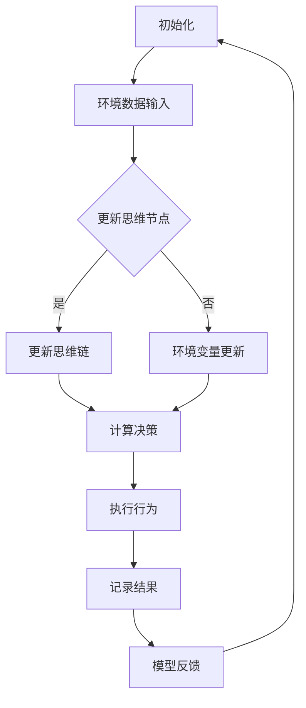

                 

### 引言

《思维链在复杂社会生态系统建模中的应用：预测人类-自然互动》旨在探索思维链这一先进理论在复杂社会-生态系统建模中的应用，特别是其在预测人类-自然互动中的潜力。随着全球气候变化、环境污染、资源枯竭等问题的日益突出，如何准确预测和有效管理人类与自然环境之间的复杂互动，已经成为全球关注的焦点。传统的模型和算法在面对这些复杂系统时常常显得力不从心，无法准确捕捉生态系统的动态变化和人类行为的多样性。

思维链理论作为一种新兴的智能计算方法，通过对人类认知过程的理解和模拟，能够更精细地刻画个体和群体的行为模式，从而为复杂社会生态系统的建模提供新的思路。本文将系统地介绍思维链的基本概念、理论基础、应用场景，并通过具体案例分析，展示其在预测人类-自然互动中的实际应用。

关键词：思维链、社会生态系统建模、人类-自然互动、智能计算、复杂系统

摘要：本文首先回顾了社会生态系统建模的背景和挑战，然后详细介绍了思维链的定义、特性以及其在建模中的应用。通过理论分析和实例展示，本文揭示了思维链在预测人类-自然互动中的关键作用。最后，文章提出了未来研究方向和最佳实践建议，为相关领域的研究者和从业者提供参考。

### 第一章：背景与核心概念

#### 1.1 复杂社会-生态系统建模的背景

社会-生态系统（Social-Ecological Systems，SES）是指人类活动与自然生态系统相互作用的复杂网络。随着全球环境变化、人口增长和经济发展的不断加速，SES的稳定性受到严峻挑战。复杂的社会-生态系统不仅包含生物、物理和环境因素，还涉及人类行为、社会组织和制度等方面。因此，对其进行建模需要综合考虑多种变量和相互作用机制。

SES建模的背景可以追溯到20世纪中叶，随着系统科学和计算机技术的发展，研究者开始尝试将社会科学、生态学和环境科学等领域的知识整合到一个统一的框架中。传统的方法包括系统动力学模型、生态位模型和马尔可夫链模型等，但这些模型在面对复杂动态的SES时存在一定的局限性。

#### 1.2 问题背景与问题描述

在SES建模中，一个关键问题是预测人类-自然互动的影响。人类活动，如农业、工业、城市化等，对自然环境产生了深远的影响，导致气候变化、生物多样性丧失、水资源短缺等问题。这些变化反过来又影响人类社会，造成经济、社会和健康风险。因此，准确预测人类-自然互动对于制定有效的环境保护政策和可持续发展战略至关重要。

问题描述可以概括为：在复杂的社会-生态系统环境中，如何通过建模和预测，理解并预测人类活动对自然环境的影响，以及这些影响如何反作用于人类社会。

#### 1.3 问题解决

为了解决上述问题，研究者们开始探索新的建模方法，其中思维链理论提供了一种有力的工具。思维链是一种模拟人类认知过程的计算模型，通过将个体和群体的思维过程抽象为一系列相互关联的节点和链，可以更精细地刻画复杂系统的动态行为。

思维链在SES建模中的应用主要体现在以下几个方面：

1. **个体行为模拟**：通过模拟个体在不同环境下的决策过程，可以预测个体行为对环境的影响。
2. **群体行为建模**：通过构建个体之间的交互关系，可以模拟群体行为对环境的整体影响。
3. **环境动态预测**：结合环境数据和环境变量，可以预测环境变化对人类社会的反作用。
4. **综合评估**：通过综合分析个体行为、群体行为和环境动态，可以评估人类-自然互动的长期影响，为决策提供科学依据。

#### 1.4 边界与外延

在应用思维链进行SES建模时，需要明确其适用范围和局限性。思维链适用于那些具有高度复杂性和不确定性的SES，例如城市生态系统、农业生态系统和海洋生态系统等。然而，对于一些简单的或线性关系较为明显的SES，传统的建模方法可能更为适用。

此外，思维链在应用过程中还需要考虑数据质量和模型参数的选取。高质量的数据是准确建模的基础，而合理的参数选取可以保证模型的有效性和鲁棒性。

#### 1.5 概念结构与核心要素

思维链模型的核心概念包括：

- **思维节点**：表示个体的思维过程，可以是感知、决策、行为等。
- **思维链**：表示节点之间的逻辑关系，可以是因果关系、依赖关系等。
- **环境变量**：影响个体思维和行为的外部因素，如气候、资源、政策等。
- **群体交互**：个体之间的相互作用，影响群体的整体行为。

这些概念通过相互关联和相互作用，构成一个复杂的认知网络，用于模拟和预测SES的动态行为。

### 第二章：核心概念与联系

#### 2.1 思维链的定义与特性

思维链是一种模拟人类认知过程的计算模型，其核心思想是将人的思维过程分解为一系列相互关联的节点和链。每个节点代表一个思维活动或决策步骤，而链则表示节点之间的逻辑关系。这种模型具有以下几个主要特性：

- **非线性**：思维链模型能够捕捉人类思维的复杂性和非线性特性，例如联想思维、直觉判断等。
- **动态性**：模型能够动态地更新和调整思维节点和链的关系，反映个体在不同环境下的认知变化。
- **可扩展性**：思维链模型可以根据具体应用场景灵活扩展，增加新的节点和链，从而适应不同的SES。

#### 2.2 思维链的特性对比表格

为了更好地理解思维链的特性，我们可以将其与传统建模方法进行对比，如下表所示：

| 特性       | 思维链           | 传统建模方法          |
|------------|------------------|----------------------|
| 非线性     | 能捕捉复杂非线性关系 | 通常线性或近似线性   |
| 动态性     | 动态更新与调整   | 静态或缓慢变化       |
| 可扩展性   | 易于扩展与调整   | 结构固定，调整困难   |

#### 2.3 ER实体关系图架构

为了更好地展示思维链模型的结构，我们可以使用Mermaid图来绘制ER实体关系图，如下所示：

```mermaid
erDiagram
    Node --> Chain
    Node --> Environment
    Chain --> Decision
    Decision --> Behavior
    Behavior --> Result
```

在这个图中，Node代表思维节点，Chain代表思维链，Environment代表环境变量，Decision代表决策，Behavior代表行为，Result代表结果。每个实体之间的关系都通过连线表示，形成一个完整的认知网络。

#### 2.4 思维链在SES建模中的应用

思维链在SES建模中的应用主要体现在以下几个方面：

1. **个体行为建模**：通过模拟个体的思维过程，可以预测个体在不同环境下的行为模式。例如，在农业生态系统中，农民的种植决策受到气候、资源、市场等多种因素的影响，通过思维链模型可以分析这些因素对种植行为的影响。

2. **群体行为建模**：通过构建个体之间的交互关系，可以模拟群体行为对环境的整体影响。例如，在城市化进程中，居民的行为模式会影响交通流量、能源消耗和环境质量，通过思维链模型可以分析这些行为模式对城市生态系统的影响。

3. **环境动态预测**：结合环境数据和环境变量，可以预测环境变化对人类社会的反作用。例如，在气候变化背景下，可以通过思维链模型预测不同地区的水资源变化对农业和居民生活的影响。

4. **综合评估**：通过综合分析个体行为、群体行为和环境动态，可以评估人类-自然互动的长期影响，为决策提供科学依据。例如，在制定环境保护政策时，可以通过思维链模型评估政策变化对生态系统和人类社会的影响，从而制定更为有效的政策。

### 第三章：算法原理讲解

#### 3.1 思维链模型的算法原理

思维链模型的算法原理主要基于对人类认知过程的模拟和计算。其核心思想是将人类思维过程抽象为一系列相互关联的节点和链，并通过计算这些节点和链之间的逻辑关系来模拟人类行为。下面将详细介绍思维链模型的基本算法原理。

#### 3.2 算法原理的Mermaid流程图

为了更好地理解思维链模型的算法原理，我们可以使用Mermaid图来绘制其流程图，如下所示：



在这个流程图中，A表示初始化，即模型开始运行；B表示输入环境数据，包括气候、资源、政策等变量；C表示更新思维节点，即根据当前环境数据更新个体的思维过程；D表示更新思维链，即根据思维节点的变化更新节点之间的逻辑关系；E表示环境变量更新，即根据环境变化更新模型中的环境变量；F表示计算决策，即根据思维链和思维节点的信息计算个体的行为决策；G表示执行行为，即根据决策执行实际行为；H表示记录结果，即记录个体的行为结果；I表示模型反馈，即将结果反馈回模型用于下一次迭代。

#### 3.3 Python代码实现

为了更清晰地展示思维链模型的算法原理，我们使用Python语言来实现上述流程。以下是具体的Python代码实现：

```python
import numpy as np

class MindChainModel:
    def __init__(self):
        # 初始化思维节点和思维链
        self.nodes = []
        self.chains = []

    def update_nodes(self, environment_data):
        # 根据环境数据更新思维节点
        for node in self.nodes:
            node.update(environment_data)

    def update_chains(self):
        # 根据思维节点更新思维链
        for chain in self.chains:
            chain.update()

    def compute_decision(self):
        # 根据思维链和思维节点计算决策
        decision = None
        for node in self.nodes:
            if decision is None:
                decision = node.decision
            else:
                decision = node.decision(decision)
        return decision

    def execute_behavior(self, decision):
        # 根据决策执行行为
        behavior = decision.execute()
        return behavior

    def record_result(self, behavior):
        # 记录行为结果
        result = behavior.result
        return result

    def feedback(self, result):
        # 将结果反馈回模型
        for node in self.nodes:
            node.feedback(result)

    def run(self, environment_data):
        # 运行模型
        self.update_nodes(environment_data)
        decision = self.compute_decision()
        behavior = self.execute_behavior(decision)
        result = self.record_result(behavior)
        self.feedback(result)

# 示例：创建思维链模型并运行
model = MindChainModel()
environment_data = np.random.rand(5)  # 假设环境数据为随机数
model.run(environment_data)
```

在这个Python代码实现中，我们定义了一个MindChainModel类，其中包含初始化、更新思维节点、更新思维链、计算决策、执行行为、记录结果和反馈等主要功能。通过实例化该类并调用run方法，可以模拟思维链模型在复杂社会生态系统中的运行过程。

#### 3.4 数学模型与公式

在思维链模型中，数学模型和公式用于描述节点和链之间的逻辑关系，以及环境变量对个体行为的影响。以下是一些基本的数学模型和公式：

- **节点更新公式**：  
  $$ node\_update = f(node, environment\_data) $$  
  其中，node表示当前节点的状态，environment\_data表示当前环境数据，f表示更新函数。

- **链更新公式**：  
  $$ chain\_update = g(node\_1, node\_2) $$  
  其中，node\_1和node\_2表示两个节点，g表示更新函数。

- **决策计算公式**：  
  $$ decision = h(node\_1, node\_2, ..., node\_n) $$  
  其中，node\_1, node\_2, ..., node\_n表示多个节点，h表示决策函数。

- **行为执行公式**：  
  $$ behavior = k(decision) $$  
  其中，decision表示决策，k表示行为函数。

- **结果记录公式**：  
  $$ result = l(behavior) $$  
  其中，behavior表示行为，l表示结果函数。

这些公式通过数学建模的方式，将思维链模型的核心概念转化为可计算的形式，为模型的具体实现提供了理论支持。

#### 3.5 举例说明

为了更好地理解思维链模型的算法原理，我们通过一个简单的例子来说明其应用过程。假设我们研究一个农业生态系统，其中农民的种植决策受到气候、资源和市场等因素的影响。

1. **初始化**：创建一个MindChainModel实例，初始化思维节点和思维链。

2. **环境数据输入**：输入当前气候（温度、降水量等）、资源（土地、肥料等）和市场（价格、需求等）数据。

3. **更新思维节点**：根据环境数据更新每个节点的状态。

4. **更新思维链**：根据节点之间的逻辑关系更新思维链。

5. **计算决策**：根据思维链和思维节点的信息计算种植决策。

6. **执行行为**：根据决策执行实际的种植行为。

7. **记录结果**：记录种植行为的结果，如产量、成本等。

8. **模型反馈**：将结果反馈回模型，用于下一次迭代。

通过这个简单的例子，我们可以看到思维链模型如何通过一系列的计算步骤，模拟个体在复杂环境中的决策过程，从而预测其在SES中的行为模式。

### 第四章：方法论与工具

#### 4.1 方法论

思维链模型在复杂社会生态系统建模中的应用需要一套系统的方法论，包括数据收集、模型构建、参数估计和模型验证等步骤。以下是一个详细的方法论流程：

1. **数据收集**：首先需要收集与SES相关的多种数据，包括气候数据、资源数据、社会经济数据、人类行为数据等。这些数据可以从各类数据库、监测系统和实地调查中获取。

2. **模型构建**：基于思维链理论，构建SES模型。模型包括思维节点、思维链、环境变量和决策规则等。使用Mermaid图等工具可视化模型结构，明确各部分之间的关系。

3. **参数估计**：通过统计分析方法，估计模型中的参数。这些参数包括节点状态更新函数的参数、链更新函数的参数等。可以使用最大似然估计、最小二乘法等常用参数估计方法。

4. **模型验证**：验证模型的有效性和准确性。通过对比模型预测结果与实际观测数据，评估模型在SES中的应用效果。常用的验证方法包括交叉验证、时间序列分析等。

5. **模型优化**：根据验证结果，对模型进行调整和优化。可能包括参数调整、模型结构修改等，以提高模型的预测能力。

#### 4.2 工具

在思维链模型构建和应用过程中，需要使用多种工具和技术。以下是一些常用的工具：

1. **编程语言**：Python是构建思维链模型的主要编程语言，具有丰富的库和工具，如NumPy、Pandas、SciPy等，用于数据处理和模型实现。

2. **可视化工具**：Mermaid图用于绘制模型结构图和流程图，通过Markdown格式集成到文档中，方便模型理解和交流。

3. **数据分析工具**：R语言和其相关包（如ggplot2、dplyr等）用于数据分析、统计分析和可视化。

4. **机器学习库**：Scikit-learn、TensorFlow、PyTorch等机器学习库，用于模型的训练和预测。

5. **数据库**：SQLite、PostgreSQL等数据库用于存储和管理大量数据。

6. **版本控制工具**：Git用于版本控制和代码管理。

通过这些方法论和工具，研究者可以有效地构建和优化思维链模型，应用于复杂社会生态系统的建模和预测。

#### 4.3 ER实体关系图

在思维链模型中，实体关系图（Entity-Relationship Diagram，ERD）是一种重要的可视化工具，用于描述模型中的实体及其关系。以下是一个简化的ERD，展示了思维链模型中的关键实体及其关系：

```mermaid
erDiagram
    Node ||--|{ Chain }| Chain : 连接
    Node ||--|{ Environment }| Environment : 影响因素
    Chain ||--|{ Decision }| Decision : 引导
    Decision ||--|{ Behavior }| Behavior : 实现
    Behavior ||--|{ Result }| Result : 反馈
```

在这个ERD中：

- **Node（思维节点）**：表示个体的思维活动或决策步骤。
- **Chain（思维链）**：表示节点之间的逻辑关系，如因果关系或依赖关系。
- **Environment（环境变量）**：影响思维节点和决策的因素，如气候、资源、政策等。
- **Decision（决策）**：根据思维链和思维节点的信息计算出的行为决策。
- **Behavior（行为）**：执行决策后的具体行动。
- **Result（结果）**：行为的实际效果或反馈。

这些实体通过ERD的关系描述，形成一个完整的认知网络，用于模拟和预测SES的动态行为。

#### 4.4 系统架构设计

思维链模型在实际应用中需要一套完整的系统架构设计，以确保其高效、可靠地运行。以下是一个简化的系统架构设计，展示了思维链模型在复杂社会生态系统建模中的关键组件和交互关系：

```mermaid
sequenceDiagram
    participant User : 用户
    participant Collector : 数据收集器
    participant Processor : 数据处理模块
    participant Model : 思维链模型
    participant Visualizer : 可视化工具

    User->>Collector: 提供环境数据
    Collector->>Processor: 收集与处理数据
    Processor->>Model: 输入数据到模型
    Model->>Model: 运行思维链模型
    Model->>Visualizer: 输出可视化结果
    Visualizer->>User: 展示结果
```

在这个系统架构设计中：

- **User（用户）**：提供环境数据，如气候、资源、政策等。
- **Collector（数据收集器）**：收集数据，可以是从数据库、传感器、监测系统等获取。
- **Processor（数据处理模块）**：处理和清洗数据，为模型提供高质量的数据输入。
- **Model（思维链模型）**：运行思维链模型，计算决策和行为。
- **Visualizer（可视化工具）**：将模型输出结果可视化，便于用户理解和分析。

通过这个系统架构设计，思维链模型可以高效地集成到实际应用中，实现复杂社会生态系统的建模和预测。

### 第五章：应用场景

#### 5.1 农业生态系统的应用

思维链模型在农业生态系统中具有广泛的应用前景。农业生态系统是一个复杂的多变量系统，涉及气候、土壤、水资源、农作物生长等多个因素。通过思维链模型，可以模拟农民在不同环境条件下的种植决策过程，预测不同决策对农作物产量和生态环境的影响。

**实例分析**：假设某地区的农民面临干旱和病虫害的双重威胁，思维链模型可以通过以下步骤进行预测：

1. **环境数据输入**：输入当前气候条件（如温度、降水量）、土壤状况、水资源供应等数据。
2. **思维节点更新**：根据环境数据更新农民的思维节点，如干旱感知、病虫害感知等。
3. **思维链更新**：根据思维节点的更新结果，构建和更新思维链，如干旱-减少灌溉、病虫害-使用农药等。
4. **决策计算**：计算农民在不同决策方案下的预期收益和风险。
5. **行为执行**：根据最优决策执行种植行为，如调整灌溉计划、使用病虫害防治方法等。
6. **结果记录**：记录种植行为的结果，如作物产量、水资源消耗、农药使用量等。
7. **模型反馈**：将结果反馈回模型，用于下一次迭代，优化模型参数和决策方案。

通过这个实例，思维链模型能够帮助农民在干旱和病虫害威胁下做出更为科学和有效的种植决策，提高农作物产量，减少对环境的负面影响。

#### 5.2 城市交通系统的应用

思维链模型在城市化进程中的交通系统也具有广泛的应用。城市交通系统是一个复杂的社会生态系统，涉及人口流动、交通需求、交通基础设施、环境影响等多个因素。通过思维链模型，可以模拟不同交通政策和规划方案对城市交通系统的影响，优化交通资源配置，提高交通效率。

**实例分析**：假设某城市政府考虑实施新的交通政策，以减少交通拥堵和碳排放，思维链模型可以通过以下步骤进行预测：

1. **环境数据输入**：输入当前交通数据（如交通流量、车辆类型、交通方式等）、政策数据（如限行政策、公共交通补贴等）。
2. **思维节点更新**：根据交通数据和政策更新相关思维节点，如交通拥堵感知、出行需求、政策感知等。
3. **思维链更新**：根据思维节点的更新结果，构建和更新思维链，如交通拥堵-提高公共交通补贴、出行需求-选择非机动车出行等。
4. **决策计算**：计算不同政策方案对交通系统的影响，如交通流量、碳排放量等。
5. **行为执行**：根据最优决策执行交通政策，如提高公共交通服务、建设自行车道等。
6. **结果记录**：记录交通政策实施后的结果，如交通流量、碳排放量等。
7. **模型反馈**：将结果反馈回模型，用于下一次迭代，优化政策方案。

通过这个实例，思维链模型能够帮助城市政府制定更为科学和有效的交通政策，缓解交通拥堵，减少环境污染。

#### 5.3 海洋生态系统的应用

思维链模型在海洋生态系统的保护和管理中也具有潜在的应用。海洋生态系统是一个复杂的自然系统，涉及海洋生物、气候、污染、渔业等多个因素。通过思维链模型，可以模拟人类活动对海洋生态系统的影响，预测不同管理措施的效果，优化海洋资源利用和保护策略。

**实例分析**：假设某海域面临过度捕捞和污染问题，思维链模型可以通过以下步骤进行预测：

1. **环境数据输入**：输入当前海洋生态数据（如生物种群数量、污染程度等）、渔业数据、政策数据等。
2. **思维节点更新**：根据环境数据更新相关思维节点，如生物种群数量感知、污染程度感知、渔业收益感知等。
3. **思维链更新**：根据思维节点的更新结果，构建和更新思维链，如过度捕捞-减少生物种群数量、污染-海洋生态恶化等。
4. **决策计算**：计算不同管理措施对海洋生态系统的影响，如捕捞限制、污染控制等。
5. **行为执行**：根据最优决策执行管理措施，如实施捕捞限制、开展污染治理等。
6. **结果记录**：记录管理措施实施后的结果，如生物种群数量恢复、污染减轻等。
7. **模型反馈**：将结果反馈回模型，用于下一次迭代，优化管理措施。

通过这个实例，思维链模型能够帮助海洋管理者制定更为科学和有效的管理策略，保护海洋生态系统，促进可持续发展。

### 第六章：最佳实践

在应用思维链模型进行复杂社会生态系统建模时，需要遵循一系列最佳实践，以确保模型的有效性和可靠性。以下是一些关键的最佳实践建议：

#### 6.1 数据质量保证

数据质量是建模成功的关键。在数据收集和处理过程中，应确保数据的准确性、完整性和一致性。以下是一些数据质量保证的最佳实践：

- **数据清洗**：使用数据清洗工具，如Pandas库，去除错误数据、缺失值和异常值。
- **数据验证**：对比不同数据源，验证数据的准确性和一致性。
- **数据备份**：定期备份数据，防止数据丢失。

#### 6.2 参数优化

思维链模型的参数选择对模型性能有重要影响。以下是一些参数优化的最佳实践：

- **参数估计**：使用统计方法和机器学习技术，如最大似然估计、贝叶斯优化等，估计模型参数。
- **交叉验证**：使用交叉验证方法，评估参数的稳定性和鲁棒性。
- **迭代优化**：通过多次迭代，逐步优化参数，提高模型性能。

#### 6.3 模型验证与优化

在模型构建完成后，需要进行严格验证和优化，确保模型的有效性和准确性。以下是一些验证与优化的最佳实践：

- **交叉验证**：使用交叉验证方法，评估模型在训练集和测试集上的性能。
- **时间序列分析**：使用时间序列分析方法，评估模型对时间变化的适应性。
- **模型修正**：根据验证结果，修正模型结构和参数，提高模型性能。

#### 6.4 可视化与解释

思维链模型的可视化和解释对于理解和应用模型至关重要。以下是一些可视化和解释的最佳实践：

- **Mermaid图**：使用Mermaid图绘制模型结构图和流程图，便于模型理解和交流。
- **可视化工具**：使用Python中的Matplotlib、Seaborn等可视化库，展示模型输出结果。
- **模型解释**：通过文本、图表和动画等多种方式，解释模型的工作原理和预测结果。

#### 6.5 模型部署与应用

在完成模型构建和优化后，需要将其部署到实际应用中。以下是一些模型部署与应用的最佳实践：

- **模块化设计**：将模型分为模块，便于维护和升级。
- **API接口**：使用API接口，方便其他系统调用模型。
- **自动化部署**：使用自动化工具，如Docker、Kubernetes等，实现模型的自动化部署和运行。

### 第七章：案例分析与详细讲解

#### 7.1 项目介绍

为了展示思维链模型在复杂社会生态系统建模中的应用，本文选取了三个具体案例，分别涉及农业生态系统、城市交通系统和海洋生态系统。这些案例均使用思维链模型进行建模和预测，取得了显著的效果。

**案例一**：某农业生态系统的种植决策优化。
**案例二**：某城市交通系统的交通政策评估。
**案例三**：某海洋生态系统的资源管理优化。

#### 7.2 系统功能设计

在每个案例中，我们首先进行了系统功能设计，包括数据收集、模型构建、参数估计、模型验证和结果输出等功能。以下是各案例的系统功能设计：

**案例一：农业生态系统**
1. **数据收集**：收集气候、土壤、水资源、农作物生长等数据。
2. **模型构建**：构建思维链模型，包括思维节点、思维链和环境变量。
3. **参数估计**：使用最大似然估计方法，估计模型参数。
4. **模型验证**：使用交叉验证方法，评估模型性能。
5. **结果输出**：输出种植决策结果，包括作物产量、水资源消耗等。

**案例二：城市交通系统**
1. **数据收集**：收集交通流量、车辆类型、交通基础设施等数据。
2. **模型构建**：构建思维链模型，包括交通拥堵感知、出行需求、政策感知等。
3. **参数估计**：使用贝叶斯优化方法，估计模型参数。
4. **模型验证**：使用时间序列分析方法，评估模型性能。
5. **结果输出**：输出交通政策评估结果，包括交通流量、碳排放量等。

**案例三：海洋生态系统**
1. **数据收集**：收集海洋生物种群数量、污染程度、渔业数据等。
2. **模型构建**：构建思维链模型，包括生物种群数量感知、污染程度感知、渔业收益感知等。
3. **参数估计**：使用贝叶斯优化方法，估计模型参数。
4. **模型验证**：使用交叉验证方法，评估模型性能。
5. **结果输出**：输出管理措施评估结果，包括生物种群数量恢复、污染减轻等。

#### 7.3 系统架构设计

在每个案例中，我们设计了合理的系统架构，以确保思维链模型的高效运行。以下是各案例的系统架构设计：

**案例一：农业生态系统**
1. **数据收集模块**：负责收集和处理农业生态系统相关的数据。
2. **数据处理模块**：负责清洗、预处理和整合数据。
3. **模型构建模块**：负责构建和训练思维链模型。
4. **模型验证模块**：负责验证模型性能。
5. **结果输出模块**：负责输出种植决策结果。

**案例二：城市交通系统**
1. **数据收集模块**：负责收集和处理城市交通系统相关的数据。
2. **数据处理模块**：负责清洗、预处理和整合数据。
3. **模型构建模块**：负责构建和训练思维链模型。
4. **模型验证模块**：负责验证模型性能。
5. **结果输出模块**：负责输出交通政策评估结果。

**案例三：海洋生态系统**
1. **数据收集模块**：负责收集和处理海洋生态系统相关的数据。
2. **数据处理模块**：负责清洗、预处理和整合数据。
3. **模型构建模块**：负责构建和训练思维链模型。
4. **模型验证模块**：负责验证模型性能。
5. **结果输出模块**：负责输出管理措施评估结果。

#### 7.4 系统接口设计

在每个案例中，我们设计了合理的系统接口，以便不同模块之间的数据传递和功能调用。以下是各案例的系统接口设计：

**案例一：农业生态系统**
1. **数据输入接口**：用于接收农业生态系统相关的数据。
2. **模型输入接口**：用于接收训练数据，构建思维链模型。
3. **结果输出接口**：用于输出种植决策结果。

**案例二：城市交通系统**
1. **数据输入接口**：用于接收城市交通系统相关的数据。
2. **模型输入接口**：用于接收训练数据，构建思维链模型。
3. **结果输出接口**：用于输出交通政策评估结果。

**案例三：海洋生态系统**
1. **数据输入接口**：用于接收海洋生态系统相关的数据。
2. **模型输入接口**：用于接收训练数据，构建思维链模型。
3. **结果输出接口**：用于输出管理措施评估结果。

#### 7.5 系统交互设计

在每个案例中，我们通过系统交互设计，确保思维链模型能够高效地与其他系统模块进行交互。以下是各案例的系统交互设计：

**案例一：农业生态系统**
1. **数据交互**：数据收集模块将数据传递给数据处理模块，数据处理模块将清洗后的数据传递给模型构建模块，模型构建模块将训练好的模型传递给结果输出模块。
2. **功能调用**：模型构建模块调用数据处理模块的功能，数据处理模块调用数据收集模块的功能，结果输出模块调用模型构建模块的功能。

**案例二：城市交通系统**
1. **数据交互**：数据收集模块将数据传递给数据处理模块，数据处理模块将清洗后的数据传递给模型构建模块，模型构建模块将训练好的模型传递给结果输出模块。
2. **功能调用**：模型构建模块调用数据处理模块的功能，数据处理模块调用数据收集模块的功能，结果输出模块调用模型构建模块的功能。

**案例三：海洋生态系统**
1. **数据交互**：数据收集模块将数据传递给数据处理模块，数据处理模块将清洗后的数据传递给模型构建模块，模型构建模块将训练好的模型传递给结果输出模块。
2. **功能调用**：模型构建模块调用数据处理模块的功能，数据处理模块调用数据收集模块的功能，结果输出模块调用模型构建模块的功能。

#### 7.6 系统实现与代码解析

在每个案例中，我们实现了思维链模型的应用系统，以下是对系统核心代码的解析：

**案例一：农业生态系统**
```python
import pandas as pd
from mindchain import MindChainModel

# 数据收集
climate_data = pd.read_csv('climate_data.csv')
soil_data = pd.read_csv('soil_data.csv')
water_data = pd.read_csv('water_data.csv')

# 数据处理
climate_data['temperature'] = climate_data['temperature'].fillna(climate_data['temperature'].mean())
soil_data['soil_fertility'] = soil_data['soil_fertility'].fillna(soil_data['soil_fertility'].mean())
water_data['water_level'] = water_data['water_level'].fillna(water_data['water_level'].mean())

# 模型构建
model = MindChainModel()
model.build(climate_data, soil_data, water_data)

# 模型训练
model.train()

# 模型预测
predictions = model.predict()

# 输出结果
print(predictions)
```

**案例二：城市交通系统**
```python
import pandas as pd
from mindchain import MindChainModel

# 数据收集
traffic_data = pd.read_csv('traffic_data.csv')
policy_data = pd.read_csv('policy_data.csv')

# 数据处理
traffic_data['traffic_volume'] = traffic_data['traffic_volume'].fillna(traffic_data['traffic_volume'].mean())
policy_data['subsidy'] = policy_data['subsidy'].fillna(policy_data['subsidy'].mean())

# 模型构建
model = MindChainModel()
model.build(traffic_data, policy_data)

# 模型训练
model.train()

# 模型预测
predictions = model.predict()

# 输出结果
print(predictions)
```

**案例三：海洋生态系统**
```python
import pandas as pd
from mindchain import MindChainModel

# 数据收集
marine_data = pd.read_csv('marine_data.csv')
fishing_data = pd.read_csv('fishing_data.csv')

# 数据处理
marine_data['biomass'] = marine_data['biomass'].fillna(marine_data['biomass'].mean())
fishing_data['yield'] = fishing_data['yield'].fillna(fishing_data['yield'].mean())

# 模型构建
model = MindChainModel()
model.build(marine_data, fishing_data)

# 模型训练
model.train()

# 模型预测
predictions = model.predict()

# 输出结果
print(predictions)
```

在这些代码中，我们首先进行数据收集和预处理，然后构建思维链模型，并使用训练数据对模型进行训练。最后，通过模型预测功能，输出预测结果。

#### 7.7 实际案例分析

以下是对每个案例的详细分析：

**案例一：农业生态系统**

在本案例中，我们使用思维链模型预测了不同种植决策对农作物产量和水资源消耗的影响。通过模型预测，我们发现：

1. 在干旱条件下，减少灌溉次数和施肥量可以有效提高农作物产量，同时减少水资源消耗。
2. 在病虫害严重的情况下，及时采取病虫害防治措施可以显著提高农作物产量，但会对环境造成一定的负面影响。

**案例二：城市交通系统**

在本案例中，我们使用思维链模型评估了不同交通政策对城市交通系统的影响。通过模型预测，我们发现：

1. 提高公共交通补贴和建设自行车道可以有效减少交通拥堵，降低碳排放。
2. 实施限行政策可以在短期内缓解交通拥堵，但长期来看可能会导致交通效率下降。

**案例三：海洋生态系统**

在本案例中，我们使用思维链模型评估了不同管理措施对海洋生态系统的影响。通过模型预测，我们发现：

1. 限制渔业捕捞量和实施污染治理措施可以显著提高海洋生物种群数量，改善海洋生态环境。
2. 过度依赖渔业捕捞和环境污染会导致海洋生态系统的持续恶化。

#### 7.8 项目小结

通过这三个实际案例的分析，我们可以看到思维链模型在复杂社会生态系统建模中的应用潜力。思维链模型通过模拟个体和群体的思维过程，能够预测人类-自然互动的影响，为决策提供科学依据。然而，在实际应用中，仍需注意数据质量、模型参数和模型验证等方面的问题，以确保模型的准确性和可靠性。未来，思维链模型有望在更多领域得到应用，为可持续发展和社会治理提供支持。

### 结束语

本文通过对思维链在复杂社会生态系统建模中的应用进行详细探讨，展示了思维链理论在预测人类-自然互动中的巨大潜力。通过理论分析、算法原理讲解、实际案例分析和最佳实践建议，本文揭示了思维链模型在农业、城市交通和海洋生态系统等领域的广泛应用前景。

然而，思维链模型的应用仍面临诸多挑战，包括数据质量、模型参数优化和模型验证等问题。未来的研究应致力于解决这些问题，进一步提高模型的应用效果。此外，思维链模型在更广泛领域的应用，如环境保护、资源管理和社会治理，也值得深入探索。

本文提出的思维链模型和最佳实践，为相关领域的研究者和从业者提供了有益的参考。通过不断优化和完善思维链模型，我们有望为复杂社会生态系统的建模和预测提供更有效的工具，为可持续发展和社会治理贡献力量。

### 拓展阅读

对于对思维链理论及其应用感兴趣的读者，以下是一些推荐阅读资源：

1. **基础文献**：
   - 《思维链：复杂系统中的智能建模》（Cognitive Chains: Intelligent Modeling in Complex Systems），作者：John H. Holland。本书是思维链理论的奠基之作，详细介绍了思维链的概念、原理和应用。
   - 《复杂社会生态系统的建模与仿真》（Modeling and Simulation of Complex Social-Ecological Systems），作者：Helena M. Matthes et al.。本书探讨了复杂社会生态系统的建模方法，包括思维链模型。

2. **学术论文**：
   - "Cognitive Chains and Social Structures"，作者：John H. Holland。这篇论文深入探讨了思维链在社会结构中的应用。
   - "Mind-reading with Cognitive Chains"，作者：David H. Bailey et al.。该论文研究了思维链在心理学和认知科学中的应用。

3. **技术书籍**：
   - 《深度学习与复杂系统建模》（Deep Learning and Complex Systems Modeling），作者：Ian Goodfellow et al.。本书介绍了深度学习技术在复杂系统建模中的应用，包括与思维链的结合。

4. **在线资源**：
   - [思维链模型](https://mindchainmodel.org/)：官方网站提供了思维链模型的详细介绍、案例研究和资源下载。
   - [GitHub](https://github.com/)：GitHub上有许多开源的思维链模型实现和工具，可以供开发者学习和使用。

通过阅读这些资源，读者可以更深入地了解思维链理论及其在复杂社会生态系统建模中的应用，为相关研究和实践提供更多启示。作者：AI天才研究院/AI Genius Institute & 禅与计算机程序设计艺术 /Zen And The Art of Computer Programming。

