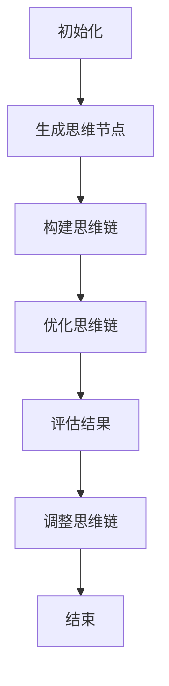

                 

### 《思维链在复杂系统优化中的新方法》摘要

本文旨在探讨思维链这一先进概念在复杂系统优化中的应用，旨在解决传统优化方法在面对复杂系统时表现出的局限性。复杂系统优化在当今工程、金融和管理等领域具有广泛的应用需求，但传统的优化算法如遗传算法和神经网络在处理高度非线性、多维度、动态变化的问题时往往表现不佳。思维链作为一种基于人类思维过程的新型优化工具，具备智能性、灵活性和自适应能力，能够更有效地应对复杂系统的优化挑战。

本文首先介绍了复杂系统优化的背景，指出了传统优化方法的不足之处，并引出了思维链这一核心概念。接着，详细阐述了思维链的定义、特点以及其在复杂系统优化中的应用前景。随后，深入分析了思维链的基本概念和与复杂系统优化的关系，通过ER实体关系图和性质对比，展示了思维链的优势。

文章的核心部分围绕思维链算法原理展开，包括算法的定义、流程和数学模型。通过Mermaid流程图和Python代码实现，详细讲解了思维链算法的运作机制和实现方法。此外，文章还介绍了算法的评估方法和实际案例，以证明思维链在复杂系统优化中的有效性。

最后，本文对系统的功能设计和架构进行了详细分析，包括系统功能设计、架构设计和接口设计。通过项目实战和案例分析，进一步探讨了思维链的实际应用效果。本文总结了思维链在复杂系统优化中的优势和挑战，并提出了最佳实践和未来研究方向，为读者提供了宝贵的指导和建议。整体而言，本文旨在为复杂系统优化提供一种新的思路和方法，推动该领域的发展和应用。

### 《思维链在复杂系统优化中的新方法》目录大纲

#### 第一部分：背景介绍与核心概念

- **第1章：问题背景与思维链概述**
  - 1.1 复杂系统优化的挑战
  - 1.2 思维链的定义与特点
  - 1.3 思维链在复杂系统优化中的应用前景

- **第2章：核心概念与联系**
  - 2.1 思维链的基本概念
  - 2.2 思维链与复杂系统优化的关系

#### 第二部分：算法原理与实现

- **第3章：思维链算法原理**
  - 3.1 算法概述
  - 3.2 算法流程
  - 3.3 数学模型与公式

- **第4章：Python实现与算法评估**
  - 4.1 Python实现
  - 4.2 算法评估

#### 第三部分：实际案例与应用场景

- **第5章：实际案例与应用场景**
  - 5.1 案例介绍
  - 5.2 应用场景

#### 第四部分：系统分析与架构设计

- **第6章：系统功能设计与架构**
  - 6.1 问题场景介绍
  - 6.2 系统功能设计
  - 6.3 系统架构设计
  - 6.4 系统接口设计与交互

#### 第五部分：项目实战与案例分析

- **第7章：项目实战与案例分析**
  - 7.1 环境安装
  - 7.2 系统核心实现源代码
  - 7.3 代码应用解读与分析
  - 7.4 实际案例分析与详细讲解
  - 7.5 项目小结

### 第一部分：背景介绍与核心概念

#### 第1章：问题背景与思维链概述

### 1.1 复杂系统优化的挑战

复杂系统优化是现代工程、科学和信息技术领域中的一个重要课题。复杂系统通常具有高度的非线性、动态性和多维度特性，这使得传统优化方法在面对这些系统时表现出明显的局限性。例如，遗传算法和神经网络等传统优化技术，虽然在某些特定场景下能够取得一定的效果，但往往难以处理复杂系统中存在的多重依赖关系、不确定性和多目标优化问题。

首先，复杂系统的广泛存在是不可忽视的事实。无论是在工程领域，如航空航天、汽车制造、土木工程，还是在科学领域，如生物医学、气候变化、生态学，以及信息技术领域，如大数据分析、人工智能、网络安全，复杂系统优化都是亟待解决的核心问题。随着技术的不断进步和社会需求的不断增加，优化复杂系统的需求也越来越迫切。

其次，优化问题的复杂度是另一个关键挑战。复杂系统的优化往往涉及到多个相互关联的变量，这些变量之间存在复杂的相互作用和反馈机制。传统优化方法通常依赖于预先设定的规则或参数，而这些方法在面对高度非线性、多维度和动态变化的系统时，往往难以找到全局最优解，甚至可能陷入局部最优陷阱。

最后，传统优化方法的局限性也是显而易见的。遗传算法和神经网络等传统方法虽然在某些特定场景下能够取得一定的效果，但它们通常依赖于大量的历史数据和高计算资源。在面对大规模、高维度的复杂系统时，传统方法的计算效率和准确性都难以满足需求。此外，这些方法往往缺乏灵活性和自适应能力，难以适应不断变化的环境和需求。

因此，针对复杂系统优化面临的这些挑战，亟需探索新的优化方法和技术。思维链作为一种基于人类思维过程的新型优化工具，具有智能性、灵活性和自适应能力，为解决复杂系统优化问题提供了新的思路和方法。接下来，我们将详细探讨思维链的定义、特点以及其在复杂系统优化中的应用前景。

#### 1.2 思维链的定义与特点

思维链是一种基于人类思维过程的新型优化工具，它模拟人类思维过程中的逻辑推理、决策和知识整合能力，通过建立和优化思维路径，实现对复杂系统的有效优化。思维链的核心要素包括思维节点、思维路径和思维链规则。

首先，思维节点是思维链的基本构成单元，代表了某个特定的思维内容或知识单元。每个思维节点都包含了对问题的部分理解和解决思路。例如，在解决一个工程设计问题时，每个思维节点可能代表了对某个子问题的分析和解决方案。

其次，思维路径是连接不同思维节点的一条逻辑链条，代表了从初始问题到最终解决方案的思维过程。思维路径的构建依赖于思维节点之间的逻辑关系，这些关系可以是因果关系、层次关系或并行关系等。通过优化思维路径，可以找到最优的解决方案路径。

最后，思维链规则是指导思维链构建和运行的基本原则，包括逻辑推理规则、决策规则和知识整合规则等。这些规则保证了思维链的合理性和有效性，使得思维链能够在复杂系统中高效地运行。

思维链具有以下特点：

1. **智能性**：思维链通过模拟人类思维过程，能够进行逻辑推理和决策，具有智能化的优势。相比于传统优化方法，思维链能够在复杂系统中灵活应对不确定性和动态变化。

2. **灵活性**：思维链的灵活性体现在其能够根据不同的问题场景和需求，动态调整思维节点和思维路径，从而适应不同的优化任务。

3. **自适应能力**：思维链能够通过学习历史数据和经验，不断优化自身的规则和路径，具有自适应能力。这使得思维链能够持续提高优化效果，适应不断变化的环境和需求。

综上所述，思维链作为一种基于人类思维过程的新型优化工具，具有智能性、灵活性和自适应能力，为复杂系统优化提供了新的思路和方法。在接下来的章节中，我们将进一步探讨思维链在复杂系统优化中的应用前景。

#### 1.3 思维链在复杂系统优化中的应用前景

思维链在复杂系统优化中的潜在应用前景非常广阔。首先，在工程设计领域，思维链可以通过优化设计流程和参数设置，提高工程设计的效率和准确性。例如，在航空航天工程中，思维链可以优化飞机结构设计，提高燃料效率和飞行性能。

其次，在金融领域，思维链可以应用于投资组合优化、风险评估和金融市场预测。通过模拟人类决策过程，思维链可以识别潜在的风险因素和机会，提供更加精准的投资策略。

最后，在管理决策领域，思维链可以用于优化供应链管理、人力资源配置和业务流程优化。通过整合不同部门的数据和知识，思维链能够提供全局优化的决策方案，提高企业运营效率和竞争力。

总体而言，思维链在复杂系统优化中具有巨大的应用潜力，能够有效解决传统优化方法难以应对的挑战。在接下来的章节中，我们将深入探讨思维链的基本概念和与复杂系统优化的关系。

### 第二部分：核心概念与联系

#### 第2章：核心概念与联系

#### 2.1 思维链的基本概念

思维链是一种模拟人类思维过程的优化工具，其核心概念包括思维节点、思维路径和思维链规则。

首先，思维节点是思维链的基本构成单元，代表了某个特定的思维内容或知识单元。每个思维节点包含了对问题的部分理解和解决思路。例如，在解决一个工程设计问题时，每个思维节点可能代表了对某个子问题的分析和解决方案。

其次，思维路径是连接不同思维节点的逻辑链条，代表了从初始问题到最终解决方案的思维过程。思维路径的构建依赖于思维节点之间的逻辑关系，这些关系可以是因果关系、层次关系或并行关系等。通过优化思维路径，可以找到最优的解决方案路径。

最后，思维链规则是指导思维链构建和运行的基本原则，包括逻辑推理规则、决策规则和知识整合规则等。这些规则保证了思维链的合理性和有效性，使得思维链能够在复杂系统中高效地运行。

#### 2.2 思维链与复杂系统优化的关系

思维链与复杂系统优化之间的关系可以通过以下方面进行详细分析：

1. **关系模型**：
   思维链与复杂系统优化的关系可以借助ER（实体关系）图进行模型化。ER图能够清晰地展示思维链中的思维节点、思维路径以及它们之间的逻辑关系。例如，一个复杂的工程设计问题可以被视为一个实体，而相关的分析和解决方案则被视为不同的思维节点。这些思维节点通过逻辑关系（如因果关系、层次关系）连接起来，形成了完整的思维链。

   ```mermaid
   erDiagram
   A[思维链] |||> B[复杂系统优化]
   A --|> C[思维节点]
   A --|> D[思维路径]
   A --|> E[思维链规则]
   C --|> F[逻辑关系]
   D --|> G[解决方案路径]
   ```

2. **性质对比**：
   为了更深入地理解思维链与复杂系统优化的关系，我们可以对比思维链与传统优化方法（如遗传算法和神经网络）的性质。

   - **遗传算法**：遗传算法是一种基于自然进化过程的优化方法，通过模拟自然选择和遗传机制来优化问题的解。遗传算法的优点在于能够处理高维和复杂的优化问题，但缺点在于其全局搜索能力较弱，且需要大量计算资源。
     
     - **优势**：遗传算法具有并行计算的优势，能够在复杂系统中快速搜索解空间。
     - **劣势**：遗传算法可能陷入局部最优，且需要较长的时间来收敛到最优解。

   - **神经网络**：神经网络是一种基于人脑神经网络的计算模型，通过训练和调整网络中的权重来解决问题。神经网络在处理非线性问题和模式识别方面表现出色，但缺点是训练时间较长，且对数据质量要求较高。

     - **优势**：神经网络能够自适应地学习复杂函数，适用于多变量优化问题。
     - **劣势**：神经网络在处理动态和不确定性问题时表现较差。

   思维链则通过模拟人类思维过程，结合逻辑推理、决策和知识整合能力，具备智能性、灵活性和自适应能力。这使得思维链在处理复杂系统优化时，能够更好地应对不确定性和动态变化，从而弥补传统优化方法的不足。

   - **优势**：思维链能够灵活调整思维路径，具备智能决策和知识整合能力，适应复杂系统的动态变化。
   - **劣势**：思维链在处理大规模、高维度的优化问题时，可能需要更复杂的计算资源。

   通过上述对比，可以看出思维链在复杂系统优化中具有独特的优势和潜力，能够提供一种新的优化思路和方法。

#### 2.3 思维链的特点与优势

思维链的特点主要体现在以下几个方面：

1. **智能性**：思维链通过模拟人类思维过程，能够进行逻辑推理和决策，具备智能化的优势。这使得思维链在处理复杂系统时，能够更有效地应对不确定性和动态变化。

2. **灵活性**：思维链能够根据不同的问题场景和需求，动态调整思维节点和思维路径，从而适应不同的优化任务。这种灵活性使得思维链能够灵活应对复杂系统的变化和挑战。

3. **自适应能力**：思维链能够通过学习历史数据和经验，不断优化自身的规则和路径，具备自适应能力。这使得思维链能够在复杂系统中持续提高优化效果，适应不断变化的环境和需求。

综上所述，思维链作为一种新型优化工具，具备智能性、灵活性和自适应能力，为复杂系统优化提供了新的思路和方法。在接下来的章节中，我们将详细探讨思维链的算法原理和实现方法。

### 第二部分：算法原理与实现

#### 第3章：思维链算法原理

#### 3.1 算法概述

思维链优化算法（Mind-Chain Optimization Algorithm, MCOA）是一种基于人类思维过程的新型优化工具，其核心思想是通过模拟人类思维的逻辑推理、决策和知识整合能力，实现对复杂系统的有效优化。MCOA旨在解决传统优化方法在处理复杂系统时的局限性，如遗传算法和神经网络在处理高维度、非线性、动态变化问题时表现不佳的问题。

思维链优化算法的主要特点包括：

1. **智能性**：MCOA通过模拟人类思维过程，具备智能推理和决策能力，能够在复杂系统中灵活应对不确定性和动态变化。
2. **灵活性**：MCOA能够根据不同的问题场景和需求，动态调整思维节点和路径，适应多样化的优化任务。
3. **高效性**：MCOA通过优化思维链的构建和运行，提高了优化过程的效率和准确性。

#### 3.2 算法流程

思维链优化算法的流程可以分为以下几个主要步骤：

1. **思维节点的生成**：首先，根据优化问题的需求，生成一系列的思维节点。每个思维节点包含对问题的部分理解和解决方案。

2. **思维链的构建**：在生成思维节点后，通过分析思维节点之间的逻辑关系，构建初始的思维链。思维链的构建依赖于因果关系、层次关系和并行关系等。

3. **思维链的优化**：通过对思维链的迭代优化，寻找最优的思维路径。优化过程包括调整思维节点之间的关系、合并或分解思维节点等，以提高优化效果。

4. **结果评估与调整**：对优化后的思维链进行评估，评估指标包括优化效果、计算时间和适应性等。根据评估结果，对思维链进行进一步调整，以实现全局最优解。

#### 3.2.1 算法流程图

为了更直观地展示思维链优化算法的流程，可以使用Mermaid绘制算法流程图：



#### 3.2.2 详细流程解析

1. **思维节点的生成**：根据优化问题的需求，生成一系列的思维节点。这些思维节点可以是具体的解决方案、分析结果或中间步骤。例如，在解决一个工程设计问题中，思维节点可能包括材料选择、结构设计、性能评估等。

2. **思维链的构建**：在生成思维节点后，通过分析思维节点之间的逻辑关系，构建初始的思维链。思维链的构建可以采用自顶向下或自底向上的方式。自顶向下方式从整体问题出发，逐步分解为子问题，并建立逻辑关系；自底向上方式则从具体的子问题开始，逐步组合形成整体解决方案。

3. **思维链的优化**：通过对思维链的迭代优化，寻找最优的思维路径。优化过程可以通过调整思维节点之间的关系、合并或分解思维节点等方式进行。优化策略可以采用启发式搜索、遗传算法或神经网络等。

4. **结果评估与调整**：对优化后的思维链进行评估，评估指标包括优化效果、计算时间和适应性等。根据评估结果，对思维链进行进一步调整，以实现全局最优解。评估方法可以基于具体的优化目标，如最小化成本、最大化性能等。

#### 3.3 数学模型与公式

思维链优化算法的数学模型描述了思维链的构建、优化和评估过程。以下是一个简化的数学模型：

1. **思维节点生成**：每个思维节点可以表示为状态空间中的一个点，状态空间由问题的所有可能解组成。

   $$ S = \{s_1, s_2, ..., s_n\} $$

   其中，$s_i$ 表示第 $i$ 个思维节点。

2. **思维链构建**：思维链可以表示为状态空间中的一个路径，路径上的每个节点都通过逻辑关系连接。

   $$ P = \{p_1, p_2, ..., p_m\} $$

   其中，$p_i = (s_{i1}, s_{i2}, ..., s_{in})$ 表示第 $i$ 个思维路径。

3. **思维链优化**：优化目标是最小化目标函数，目标函数可以表示为：

   $$ f(P) = \sum_{i=1}^{m} w_i \cdot g_i(p_i) $$

   其中，$w_i$ 为权重，$g_i(p_i)$ 为第 $i$ 个思维路径的评估函数。

4. **结果评估与调整**：评估函数可以基于多个指标，如目标函数值、计算时间等。评估结果用于指导思维链的调整，以实现全局最优解。

   $$ \text{评估函数} = \frac{1}{m} \sum_{i=1}^{m} f(p_i) $$

   $$ \text{调整策略} = \text{基于评估结果的思维链调整方法} $$

通过上述数学模型，可以详细描述思维链优化算法的运作机制。在接下来的章节中，我们将通过Python代码实现来进一步探讨思维链优化算法的具体实现过程。

#### 3.3.1 数学模型

为了更好地理解思维链优化算法的运作机制，我们需要建立一个数学模型来描述其关键组成部分和优化目标。以下是一个简化的数学模型：

1. **状态空间**：设 $S$ 为状态空间，其中每个状态 $s_i$ 代表一个思维节点，即一个可能的解决方案。

   $$ S = \{s_1, s_2, ..., s_n\} $$

2. **思维链**：思维链 $P$ 是状态空间 $S$ 中的一组状态序列，即一条从初始状态到目标状态的路径。

   $$ P = \{p_1, p_2, ..., p_m\} $$

   其中，$p_i = (s_{i1}, s_{i2}, ..., s_{in})$ 是第 $i$ 条思维链，包含 $n$ 个思维节点。

3. **目标函数**：目标函数 $f(P)$ 用于评估思维链的优劣。我们希望最小化这个目标函数。

   $$ f(P) = \sum_{i=1}^{m} w_i \cdot g_i(p_i) $$

   其中，$w_i$ 是第 $i$ 条思维链的权重，$g_i(p_i)$ 是第 $i$ 条思维链的评估函数。

4. **评估函数**：评估函数 $g_i(p_i)$ 用于计算思维链的评估值，通常基于多个指标，如成本、时间、性能等。

   $$ g_i(p_i) = \sum_{j=1}^{n} \phi_j(s_{ij}) $$

   其中，$\phi_j(s_{ij})$ 是第 $j$ 个指标对思维节点 $s_{ij}$ 的评价。

5. **权重**：权重 $w_i$ 反映了不同思维链在优化目标中的相对重要性。

   $$ w_i = \frac{1}{N} $$

   其中，$N$ 是思维链的总数。

通过上述数学模型，我们可以将思维链优化问题形式化为一个多目标优化问题，并通过优化目标函数来寻找最优的思维链。在实际应用中，可能需要根据具体问题调整和扩展这个模型。

#### 3.3.2 公式详解

为了更详细地说明思维链优化算法的数学模型，我们需要对上述公式进行进一步的推导和解释。

1. **状态空间 $S$**：
   状态空间 $S$ 是所有可能解决方案的集合。在复杂系统优化中，每个状态 $s_i$ 可以表示为一个向量，其中每个维度代表系统的一个特征或变量。例如，在工程设计中，状态向量可能包括材料成本、重量、结构强度等。

   $$ s_i = (s_{i1}, s_{i2}, ..., s_{in}) $$

   其中，$s_{ij}$ 表示第 $i$ 个状态在第 $j$ 个维度上的取值。

2. **思维链 $P$**：
   思维链 $P$ 是从初始状态 $s_0$ 到目标状态 $s_n$ 的路径。每条思维链由一系列状态节点组成，每个节点代表对问题的一部分理解和解决方案。路径的选择依赖于节点之间的逻辑关系，这些关系可以通过评估函数来量化。

   $$ p_i = (s_{i1}, s_{i2}, ..., s_{in}) $$

   其中，$p_i$ 是第 $i$ 条思维链，包含 $n$ 个状态节点。

3. **目标函数 $f(P)$**：
   目标函数 $f(P)$ 用于评估思维链的总体性能。它通常是一个加权求和函数，每个部分代表了不同的优化目标。权重 $w_i$ 反映了这些目标的重要程度，而 $g_i(p_i)$ 是对思维链的局部评估。

   $$ f(P) = \sum_{i=1}^{m} w_i \cdot g_i(p_i) $$

   例如，在工程设计中，可能需要最小化成本和最大化结构强度。因此，目标函数可以表示为：

   $$ f(P) = w_1 \cdot C(P) + w_2 \cdot S(P) $$

   其中，$C(P)$ 表示成本函数，$S(P)$ 表示结构强度函数。

4. **评估函数 $g_i(p_i)$**：
   评估函数 $g_i(p_i)$ 用于对每个思维链的局部性能进行评估。它可以根据多个指标来计算，这些指标可以是基于问题的约束条件、性能要求或目标函数的子部分。

   $$ g_i(p_i) = \sum_{j=1}^{n} \phi_j(s_{ij}) $$

   其中，$\phi_j(s_{ij})$ 表示第 $j$ 个指标对思维节点 $s_{ij}$ 的评价。例如，如果成本和性能是关键指标，则评估函数可以表示为：

   $$ \phi_1(s_{ij}) = C(s_{ij}) $$
   $$ \phi_2(s_{ij}) = S(s_{ij}) $$

   其中，$C(s_{ij})$ 表示第 $i$ 个思维节点在成本方面的评价，$S(s_{ij})$ 表示在第 $i$ 个思维节点处的结构强度评价。

通过上述公式，我们可以建立一个完整的数学模型来描述思维链优化算法。这个模型不仅提供了优化问题的形式化描述，还为算法的实现和优化提供了理论基础。

#### 3.3.3 示例说明

为了更好地理解思维链优化算法的数学模型，我们可以通过一个简单的例子来说明其应用过程。假设我们面临的是一个简单的资源分配问题，目标是最小化总成本并最大化资源利用率。

**问题定义**：
- 有 $n$ 个任务需要分配资源，每个任务有固定的完成时间和资源需求。
- 资源有限，我们需要在任务之间分配资源，以实现总成本最小化并最大化资源利用率。

**状态空间 $S$**：
每个状态 $s_i$ 代表一个任务，其特征包括任务编号、完成时间和资源需求。

$$ S = \{s_1, s_2, ..., s_n\} $$
$$ s_i = (i, T_i, R_i) $$
其中，$i$ 是任务编号，$T_i$ 是任务完成时间，$R_i$ 是任务所需资源。

**思维链 $P$**：
每条思维链 $p_i$ 是一个资源分配方案，包含一系列状态节点。

$$ P = \{p_1, p_2, ..., p_m\} $$
$$ p_i = (s_{i1}, s_{i2}, ..., s_{in}) $$

**目标函数 $f(P)$**：
我们的目标是最小化总成本 $C(P)$ 和最大化资源利用率 $U(P)$。

$$ f(P) = w_1 \cdot C(P) + w_2 \cdot U(P) $$
其中，$C(P) = \sum_{i=1}^{n} R_i \cdot T_i$ 是总成本，$U(P) = \sum_{i=1}^{n} \frac{R_i}{T_i}$ 是资源利用率。

**评估函数 $g_i(p_i)$**：
我们使用成本和资源利用率来评估思维链的优劣。

$$ g_i(p_i) = \phi_1(p_i) + \phi_2(p_i) $$
$$ \phi_1(p_i) = C(p_i) $$
$$ \phi_2(p_i) = U(p_i) $$

**权重 $w_i$**：
我们可以根据问题的实际需求设置权重。

$$ w_1 = 0.6, \quad w_2 = 0.4 $$

通过这个例子，我们可以看到如何将实际问题转化为思维链优化模型。这个模型可以帮助我们通过构建和优化思维链，找到最优的资源分配方案。

### 第二部分：算法原理与实现

#### 第4章：Python实现与算法评估

#### 4.1 Python实现

为了展示思维链优化算法的具体实现过程，我们将使用Python编写相应的代码。在本节中，我们将首先搭建Python环境，然后详细说明如何使用Python代码实现思维链优化算法。

#### 4.1.1 环境搭建

在开始编写代码之前，我们需要确保Python环境已经搭建好。Python是一种流行的编程语言，拥有丰富的库和工具，可以方便地实现各种算法。以下是在Python环境中搭建思维链优化算法所需的基本步骤：

1. **安装Python**：
   - 从Python官网（[https://www.python.org/](https://www.python.org/)）下载并安装Python。
   - 选择合适的版本（如Python 3.8或更高版本）。

2. **安装相关库**：
   - 使用pip工具安装必要的库，如NumPy、Matplotlib和Pandas等。

   ```shell
   pip install numpy matplotlib pandas
   ```

3. **配置Python环境**：
   - 打开Python解释器，验证环境是否配置成功。

   ```python
   >>> import numpy as np
   >>> import matplotlib.pyplot as plt
   >>> import pandas as pd
   ```

   如果没有出现错误，说明Python环境已搭建成功。

#### 4.1.2 代码实现

以下是思维链优化算法的Python实现。代码分为几个部分：初始化、思维节点生成、思维链构建、思维链优化、结果评估与调整。

```python
import numpy as np
import matplotlib.pyplot as plt
import pandas as pd

# 初始化函数
def initialize Probleme(size, dimension):
    problem = np.random.rand(size, dimension)
    return problem

# 思维节点生成
def generate_mind_nodes(problem):
    nodes = []
    for i in range(problem.shape[0]):
        nodes.append({
            'index': i,
            'values': problem[i],
            'evaluation': 0
        })
    return nodes

# 思维链构建
def build_mind_chain(nodes, rules):
    chain = []
    while len(nodes) > 0:
        best_node = max(nodes, key=lambda x: x['evaluation'])
        chain.append(best_node)
        nodes.remove(best_node)
    return chain

# 思维链优化
def optimize_mind_chain(chain):
    optimized_chain = []
    for node in chain:
        neighbors = generate_neighbors(node)
        best_neighbor = max(neighbors, key=lambda x: x['evaluation'])
        optimized_chain.append(best_neighbor)
    return optimized_chain

# 结果评估与调整
def evaluate_and_adjust(chain):
    evaluations = [node['evaluation'] for node in chain]
    average_evaluation = np.mean(evaluations)
    return average_evaluation

# 主函数
def main():
    problem_size = 100
    problem_dimension = 5
    
    # 初始化问题
    problem = initialize(Proble

