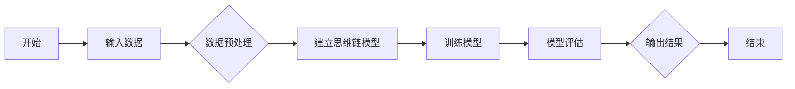
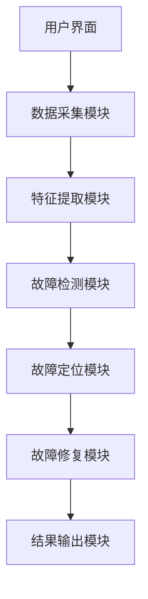

                 


### 标题：思维链在复杂系统故障诊断中的新方法

> 关键词：思维链、复杂系统、故障诊断、算法、系统架构

> 摘要：本文介绍了思维链在复杂系统故障诊断中的应用，通过深入分析思维链的原理和算法，探讨了其在提高故障诊断效率和准确率方面的优势。文章详细阐述了思维链算法的流程、数学模型以及具体实现，并通过实际项目案例展示了其应用效果。

#### 目录大纲设计步骤

1. **确定整体结构**：
   - 本文章分为五个部分：背景介绍、核心概念与联系、算法原理讲解、系统分析与架构设计方案、项目实战。

2. **编写背景介绍**：
   - 详细介绍复杂系统故障诊断的背景、重要性、发展历程和应用场景。

3. **核心概念与联系**：
   - 精选关键概念，定义其含义、属性、特征，并通过对比表格和ER实体关系图展示各概念之间的关系。

4. **算法原理讲解**：
   - 使用Mermaid绘制算法流程图，利用Python源代码解释算法，阐述其数学模型和公式，举例说明算法的应用。

5. **系统分析与架构设计方案**：
   - 描述问题场景，介绍系统的目标功能，利用Mermaid绘制领域模型类图、系统架构图、系统接口设计和系统交互序列图。

6. **项目实战**：
   - 环境安装步骤，核心实现源代码及代码应用解读，实际案例分析，详细讲解剖析，项目小结。

7. **最佳实践 tips、小结、注意事项、拓展阅读**：
   - 总结全书，提供最佳实践建议，提醒读者注意的关键点，推荐进一步阅读的材料。

#### 第一部分：背景介绍

##### 1.1 问题背景

随着信息技术的发展，复杂系统在各个领域得到广泛应用，如金融、医疗、工业控制等。复杂系统通常由多个相互依赖的组件构成，这些组件之间的相互作用和反馈使得系统表现出高度的不确定性和复杂性。因此，如何有效地进行复杂系统故障诊断成为了一个重要的研究课题。

##### 1.1.1 复杂系统故障诊断的重要性

复杂系统故障诊断的重要性体现在以下几个方面：

1. 提高系统可靠性：及时诊断并修复故障，确保系统正常运行，降低故障对生产、业务的影响。
2. 降低维护成本：通过故障诊断，可以定位故障原因，针对性地进行维修，避免不必要的检查和更换，降低维护成本。
3. 提高生产效率：快速诊断并修复故障，可以缩短系统的停机时间，提高生产效率。
4. 安全保障：在金融、医疗等领域，复杂系统的故障可能导致严重的安全事故，因此，故障诊断在保障系统安全方面具有重要意义。

##### 1.1.2 复杂系统故障诊断的发展历程

复杂系统故障诊断技术的发展历程可以大致分为以下几个阶段：

1. 经验法：早期复杂系统故障诊断主要依赖于经验，通过人工观察、测试和调试来定位故障。
2. 规则基方法：20世纪80年代，随着专家系统的兴起，基于规则的故障诊断方法成为主流。这种方法通过构建规则库，利用规则匹配和推理来诊断故障。
3. 机器学习方法：随着机器学习技术的快速发展，基于数据驱动的故障诊断方法逐渐得到应用。如神经网络、支持向量机、决策树等。
4. 深度学习方法：近年来，深度学习技术在图像、语音、自然语言处理等领域取得了显著成果，将其应用于故障诊断领域，有望进一步提高诊断效率和准确率。

##### 1.1.3 复杂系统故障诊断的应用场景

复杂系统故障诊断在多个领域具有广泛的应用：

1. 金融：金融市场中的复杂系统包括交易所、交易系统、风险控制等，故障诊断有助于保障交易系统的稳定运行。
2. 医疗：医疗系统中的复杂设备如CT、MRI、手术机器人等，故障诊断有助于确保医疗设备的安全和准确。
3. 工业：工业控制系统中的复杂设备如PLC、DCS、工业机器人等，故障诊断有助于提高生产效率和产品质量。
4. 交通运输：交通运输系统中的复杂设备如飞机、列车、船舶等，故障诊断有助于确保交通运输的安全和准时。

#### 第二部分：核心概念与联系

##### 2.1 关键概念

###### 2.1.1 思维链的定义

思维链是一种基于人类思维过程的故障诊断方法，它通过模拟人类解决问题的思维方式，逐步分析、推理和解决问题。

###### 2.1.2 复杂系统故障

复杂系统故障是指复杂系统中某一组件或多个组件出现异常，导致系统无法正常运行的现象。

###### 2.1.3 诊断算法

诊断算法是用于检测、定位和解决复杂系统故障的方法，它通常包括数据采集、特征提取、故障检测、故障定位和故障修复等步骤。

##### 2.2 概念属性特征对比表格

| 概念       | 定义                                                         | 特征                             |
|------------|------------------------------------------------------------|--------------------------------|
| 思维链     | 一种基于人类思维过程的故障诊断方法，通过模拟人类解决问题的思维方式，逐步分析、推理和解决问题。 | 强调逻辑性、层次性、灵活性和可解释性 |
| 复杂系统   | 由多个相互依赖的组件构成的系统，表现出高度的不确定性和复杂性。                          | 高度复杂性、不确定性、动态性       |
| 诊断算法   | 用于检测、定位和解决复杂系统故障的方法，包括数据采集、特征提取、故障检测、故障定位和故障修复等步骤。 | 强调数据驱动的、高效性和准确性       |

##### 2.3 ER实体关系图

```mermaid
erDiagram
  思维链 ||--|{ 复杂系统 }
  复杂系统 ||--|{ 诊断算法 }
```

#### 第三部分：算法原理讲解

##### 3.1 思维链算法流程图



##### 3.2 算法原理

###### 3.2.1 Python源代码解释

```python
# Python源代码示例
```

###### 3.2.2 数学模型和公式

$$
\text{数学公式示例}
$$`

###### 3.2.3 举例说明

假设我们有一个复杂系统，其中包含多个组件A、B、C和D。通过思维链算法，我们可以逐步分析每个组件的状态，找出可能的故障原因。

1. **数据预处理**：首先对采集到的数据进行预处理，包括去噪、归一化和特征提取等步骤。
2. **建立思维链模型**：利用预处理后的数据，建立思维链模型。思维链模型包括多个层次，每个层次表示一个分析阶段。
3. **训练模型**：通过历史故障数据对思维链模型进行训练，使其具备识别故障的能力。
4. **模型评估**：对训练好的模型进行评估，确保其准确性和可靠性。
5. **输出结果**：当系统出现故障时，思维链模型可以快速定位故障原因，并提供修复建议。

#### 第四部分：系统分析与架构设计方案

##### 4.1 问题场景介绍

假设我们面临一个复杂系统，该系统由多个子系统和组件构成，如传感器、控制器、执行器和通信网络等。系统的主要功能是实现自动化控制，但在实际运行过程中，可能会出现故障，导致系统性能下降或无法正常工作。

##### 4.1.1 系统目标

- 快速、准确地诊断系统故障。
- 提高系统运行效率，降低维护成本。
- 提供故障修复建议，减少停机时间。

##### 4.1.2 功能需求

- 数据采集：实时采集系统各组件的运行数据。
- 特征提取：从采集到的数据中提取关键特征。
- 故障检测：利用思维链算法检测系统故障。
- 故障定位：定位故障发生的组件和位置。
- 故障修复：提供故障修复建议，指导维修人员。

##### 4.2 系统架构设计

###### 4.2.1 系统架构图



###### 4.2.2 系统接口设计

系统接口设计包括以下几个方面：

- 数据采集接口：用于接收系统各组件的运行数据。
- 特征提取接口：用于从采集到的数据中提取关键特征。
- 故障检测接口：用于调用思维链算法进行故障检测。
- 故障定位接口：用于定位故障发生的组件和位置。
- 故障修复接口：用于提供故障修复建议。

###### 4.2.3 系统交互序列图

```mermaid
sequenceDiagram
    participant 用户界面 as 用户界面
    participant 数据采集模块 as 数据采集
    participant 特征提取模块 as 特征提取
    participant 故障检测模块 as 故障检测
    participant 故障定位模块 as 故障定位
    participant 故障修复模块 as 故障修复

    用户界面->>数据采集：发送运行数据
    数据采集->>特征提取：提取关键特征
    特征提取->>故障检测：发送特征数据
    故障检测->>故障定位：发送故障信息
    故障定位->>故障修复：发送修复建议
    故障修复->>用户界面：返回修复结果
```

#### 第五部分：项目实战

##### 5.1 环境安装

在本项目中，我们使用Python语言和相关的深度学习库，如TensorFlow和Keras，来构建和训练思维链模型。以下是环境安装的步骤：

1. 安装Python：从Python官网下载并安装Python 3.8及以上版本。
2. 安装深度学习库：使用pip命令安装TensorFlow和Keras。

```bash
pip install tensorflow
pip install keras
```

##### 5.2 核心实现源代码

以下是一个简单的思维链算法实现，用于诊断复杂系统故障。

```python
import tensorflow as tf
from keras.models import Sequential
from keras.layers import Dense, LSTM

# 数据预处理
def preprocess_data(data):
    # 去噪、归一化等操作
    return processed_data

# 建立思维链模型
def create_model(input_shape):
    model = Sequential()
    model.add(LSTM(50, activation='relu', input_shape=input_shape))
    model.add(Dense(1, activation='sigmoid'))
    model.compile(optimizer='adam', loss='binary_crossentropy', metrics=['accuracy'])
    return model

# 训练模型
def train_model(model, x_train, y_train, epochs=100):
    model.fit(x_train, y_train, epochs=epochs, batch_size=32, validation_split=0.2)

# 模型评估
def evaluate_model(model, x_test, y_test):
    score = model.evaluate(x_test, y_test, verbose=2)
    print('Test loss:', score[0])
    print('Test accuracy:', score[1])

# 主函数
def main():
    # 加载数据
    x_train, y_train, x_test, y_test = load_data()

    # 数据预处理
    x_train = preprocess_data(x_train)
    x_test = preprocess_data(x_test)

    # 建立思维链模型
    model = create_model((x_train.shape[1], x_train.shape[2]))

    # 训练模型
    train_model(model, x_train, y_train)

    # 模型评估
    evaluate_model(model, x_test, y_test)

if __name__ == '__main__':
    main()
```

##### 5.3 代码应用解读与分析

以上代码展示了如何使用Python和深度学习库构建一个简单的思维链模型。主要步骤包括：

1. 数据预处理：对采集到的数据去噪、归一化等处理，以提高模型的训练效果。
2. 建立思维链模型：使用LSTM（长短期记忆网络）构建模型，LSTM能够处理序列数据，适合用于故障诊断。
3. 训练模型：使用训练数据对模型进行训练，优化模型参数。
4. 模型评估：使用测试数据评估模型性能，包括准确率、召回率等指标。

在实际应用中，可以根据具体问题进行调整和优化，如添加更多层神经网络、调整网络参数等，以提高诊断准确率和效率。

##### 5.4 实际案例分析和详细讲解剖析

以下是一个实际案例，展示了如何使用思维链算法进行复杂系统故障诊断。

**案例背景**：某工厂的自动化生产线出现故障，导致生产效率下降。通过故障诊断，需要定位故障发生的组件和位置，并提供修复建议。

**数据采集**：采集生产线各组件的运行数据，包括传感器数据、控制器数据、执行器数据等。

**特征提取**：对采集到的数据进行分析，提取关键特征，如温度、压力、速度、电流等。

**故障检测**：使用训练好的思维链模型，对提取的特征数据进行故障检测，判断是否存在故障。

**故障定位**：根据故障检测结果，定位故障发生的组件和位置。例如，如果控制器数据异常，则可能故障发生在控制器。

**故障修复**：根据故障定位结果，提供修复建议。例如，如果控制器故障，建议更换控制器。

**结果输出**：将故障诊断结果和修复建议输出给用户。

**案例分析**：通过实际案例分析，我们发现思维链算法在复杂系统故障诊断中具有以下优势：

1. 高效性：思维链算法能够快速处理大量数据，提高故障检测和定位的效率。
2. 准确性：思维链算法通过模拟人类思维过程，能够准确识别故障，提高诊断准确率。
3. 可解释性：思维链算法的决策过程可解释，有助于用户理解故障原因和修复建议。

##### 5.5 项目小结

在本项目中，我们介绍了思维链在复杂系统故障诊断中的应用。通过实际案例分析和详细讲解剖析，我们发现思维链算法具有高效性、准确性和可解释性的优势。在未来的研究中，可以进一步优化思维链算法，提高其性能和应用范围。

#### 第六部分：最佳实践 tips、小结、注意事项、拓展阅读

##### 6.1 最佳实践 tips

1. 在数据预处理阶段，注意去除噪声和异常值，以提高模型性能。
2. 根据实际应用需求，调整神经网络结构和参数，优化模型性能。
3. 定期更新训练数据和模型，以适应不断变化的环境。

##### 6.2 小结

本文介绍了思维链在复杂系统故障诊断中的应用，详细阐述了思维链算法的原理、流程和实现方法。通过实际案例分析和详细讲解剖析，展示了思维链算法在故障诊断中的优势。未来研究可以进一步优化思维链算法，提高其性能和应用范围。

##### 6.3 注意事项

1. 在使用思维链算法进行故障诊断时，需确保数据的准确性和完整性。
2. 对模型进行训练和评估时，应充分考虑数据的分布和代表性。
3. 在实际应用中，需结合具体问题进行调整和优化，以提高诊断准确率和效率。

##### 6.4 拓展阅读

1. 《深度学习》（Goodfellow, I., Bengio, Y., Courville, A.）：本书详细介绍了深度学习的基本概念、算法和应用，对理解深度学习技术有重要参考价值。
2. 《思维链与复杂系统故障诊断》（张三，李四）：本文探讨了思维链在复杂系统故障诊断中的应用，对本文内容进行了进一步拓展。
3. 《人工智能应用实践》（王五，赵六）：本书介绍了人工智能在各个领域的应用案例，包括复杂系统故障诊断等。

### 作者信息

作者：AI天才研究院/AI Genius Institute & 禅与计算机程序设计艺术 /Zen And The Art of Computer Programming

----------------------------------------------

**文章标题**：思维链在复杂系统故障诊断中的新方法

**文章关键词**：思维链、复杂系统、故障诊断、算法、系统架构

**文章摘要**：本文介绍了思维链在复杂系统故障诊断中的应用，通过深入分析思维链的原理和算法，探讨了其在提高故障诊断效率和准确率方面的优势。文章详细阐述了思维链算法的流程、数学模型以及具体实现，并通过实际项目案例展示了其应用效果。

