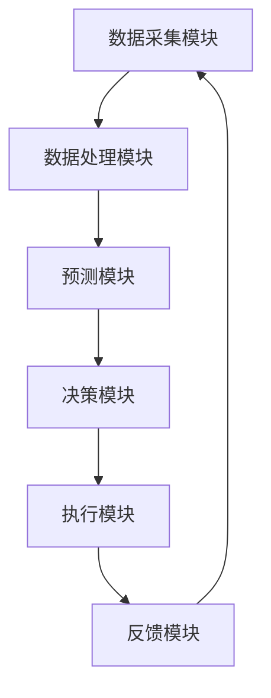
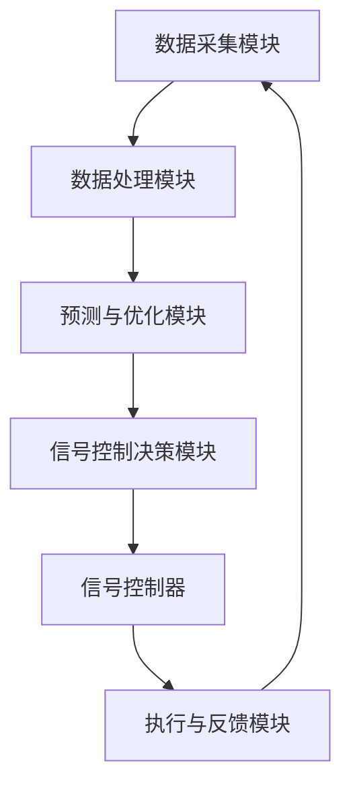
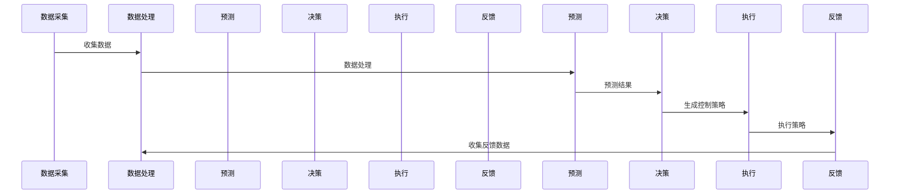
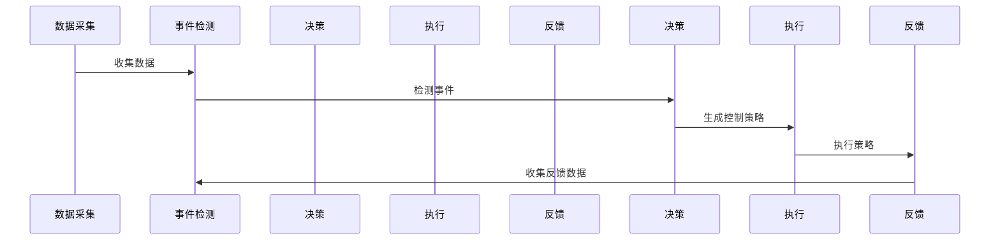

                 

### 目录

1. 引言
    1.1 问题背景
    1.2 智能交通信号控制概述
    1.3 思维链概念

2. 思维链基础
    2.1 思维链的定义
    2.2 思维链的属性特征
    2.3 思维链的数学模型
    2.4 思维链的工作原理

3. 智能交通信号控制中的思维链应用
    3.1 思维链在交通流量预测中的应用
    3.2 思维链在信号控制策略优化中的应用
    3.3 思维链在紧急事件处理中的应用

4. 思维链系统设计与实现
    4.1 系统总体架构设计
    4.2 数据收集与处理
    4.3 算法实现

5. 思维链在智能交通信号控制中的案例分析
    5.1 案例一：城市中心区交通流量控制
    5.2 案例二：高速公路交通事件响应

6. 思维链在智能交通信号控制中的挑战与展望
    6.1 挑战与问题
    6.2 发展趋势与未来展望

7. 结论
    7.1 主要贡献
    7.2 未来的研究方向

### 引言

在现代城市化进程中，智能交通信号控制已经成为提高交通效率、减少拥堵、保障交通安全的重要手段。然而，传统的交通信号控制系统在面对日益复杂和动态的交通环境时，往往表现出明显的不足。例如，传统信号控制系统依赖于预设的定时控制和简单的规则，难以实时响应交通流量变化，导致交通拥堵和事故频发。

为了解决这些问题，思维链（MindChain）的概念被提出并应用于智能交通信号控制中。思维链是一种基于人工智能和机器学习的先进方法，通过模拟人类思维过程，实现对交通流量的动态预测和信号控制的优化。

本篇文章将深入探讨思维链在智能交通信号控制中的应用。首先，我们将介绍智能交通信号控制的背景和问题，然后详细阐述思维链的概念和原理，最后通过具体的案例分析和系统设计，展示思维链在智能交通信号控制中的实际应用和未来前景。

通过这篇文章，我们希望读者能够了解思维链的核心思想，认识到其在智能交通信号控制中的潜力，并为后续的研究和应用提供参考。

#### 关键词

智能交通信号控制、思维链、人工智能、机器学习、交通流量预测、信号控制策略优化、紧急事件处理。

#### 摘要

本文主要探讨了思维链在智能交通信号控制中的应用。首先，我们介绍了智能交通信号控制的背景和问题，阐述了传统交通信号控制系统的不足。然后，我们详细介绍了思维链的概念和原理，包括其定义、属性特征、数学模型和工作原理。接着，我们分析了思维链在交通流量预测、信号控制策略优化和紧急事件处理中的应用，并通过具体的案例展示了其优势。最后，我们探讨了思维链在智能交通信号控制中的挑战与未来展望，提出了可能的解决方案和未来研究方向。通过本文的研究，我们希望为智能交通信号控制领域提供一种新的思路和方法。

### 第1章 引言

#### 1.1 问题背景

随着城市化进程的加速，交通拥堵已经成为全球各大城市面临的严重问题。传统的交通信号控制系统通常采用定时控制或简单的规则控制方法，这些方法在交通流量稳定时能够保证一定的交通效率，但在面对动态变化的交通环境时，往往表现出明显的不足。具体来说，传统交通信号控制系统的局限性主要体现在以下几个方面：

1. **响应速度慢**：传统系统依赖于预设的定时控制或规则控制，难以对突发性事件如交通事故、紧急车辆通行等进行快速响应。
   
2. **适应性差**：传统系统难以根据实时交通流量变化进行动态调整，导致在高峰时段容易产生拥堵。

3. **缺乏数据驱动**：传统系统缺乏对交通流量的实时监测和分析，无法充分利用大数据和信息化技术进行交通优化。

4. **低效率的信号配时**：传统系统通常采用固定的信号配时方案，无法根据实际交通需求进行灵活调整，导致某些路口的信号配时不合理，加剧了交通拥堵。

为了解决这些问题，智能交通信号控制应运而生。智能交通信号控制利用先进的信息技术和人工智能算法，实现对交通流量的实时监测和分析，通过动态调整信号配时，提高交通效率，减少拥堵，保障交通安全。智能交通信号控制的目标包括以下几个方面：

1. **提高交通流量**：通过优化交通信号控制，提高道路通行能力，减少车辆排队和等待时间。

2. **减少交通拥堵**：利用实时交通数据，动态调整信号配时，降低交通流量高峰时的拥堵程度。

3. **提高交通安全**：通过信号控制优化，减少交通事故的发生，保障行人和车辆的交通安全。

4. **降低环境影响**：通过减少交通拥堵，降低车辆排放，减轻对环境的影响。

然而，尽管智能交通信号控制具有显著的潜力，但其实际应用仍然面临诸多挑战。首先，交通信号控制系统的设计和实现需要大量的交通数据支持，数据的收集、处理和分析是智能交通信号控制成功的关键。其次，智能交通信号控制需要处理复杂的交通环境和多变的交通需求，这要求算法具有高鲁棒性和自适应能力。此外，系统的实时性和可靠性也是影响智能交通信号控制效果的重要因素。

#### 1.2 智能交通信号控制概述

智能交通信号控制（Intelligent Traffic Signal Control，简称ITS）是一种利用先进的信息技术和人工智能算法，对交通信号进行动态调整和优化的系统。其核心思想是通过实时采集和分析交通数据，动态调整信号灯的配时和相位，从而提高交通流量，减少拥堵，提高交通安全。

智能交通信号控制的目标是实现对交通流量的精确控制，使得道路上的车辆能够高效、有序地通行。与传统交通信号控制不同，智能交通信号控制具有以下几个特点：

1. **实时监测与分析**：智能交通信号控制系统能够实时监测交通流量、速度、密度等参数，并利用大数据分析和机器学习算法对交通状态进行预测和评估。

2. **动态调整信号配时**：根据实时交通数据，智能交通信号控制系统能够动态调整信号灯的配时和相位，优化交通流量。

3. **自适应能力**：智能交通信号控制系统能够根据不同的交通场景和需求，自适应地调整控制策略，提高系统的鲁棒性和适应性。

4. **跨区域协同**：智能交通信号控制系统能够实现跨区域的交通信号联动，提高交通流量的整体优化效果。

智能交通信号控制的架构通常包括以下几个主要部分：

1. **数据采集与传输**：通过传感器、摄像头等设备采集交通流量、速度、密度等数据，并通过通信网络将数据传输到控制中心。

2. **数据处理与分析**：利用大数据分析和机器学习算法对采集到的交通数据进行处理和分析，实现对交通状态的实时监测和预测。

3. **信号控制决策**：根据实时交通数据和预测结果，智能交通信号控制系统会生成最优的信号控制策略，调整信号灯的配时和相位。

4. **执行与反馈**：信号控制策略通过控制设备（如信号灯控制器）执行，并根据实际交通情况不断进行反馈和优化。

智能交通信号控制的核心技术包括：

1. **交通流量预测**：利用机器学习算法对交通流量进行预测，为信号控制提供数据支持。

2. **信号控制优化**：通过优化算法（如遗传算法、深度强化学习等）对信号灯的配时和相位进行调整，提高交通效率。

3. **多模态交通数据处理**：结合多种数据源（如车辆速度、道路占有率、摄像头图像等），实现对交通状态的全面分析和理解。

4. **实时通信与协同**：通过5G、物联网等通信技术，实现交通信号控制系统的实时通信和协同控制。

智能交通信号控制的应用场景主要包括以下几个方面：

1. **城市中心区交通流量控制**：通过动态调整信号灯配时，提高城市中心区的交通流量和通行效率。

2. **高速公路交通事件响应**：通过实时监测和预警，及时响应高速公路上的交通事故和突发事件，保障交通安全。

3. **交叉口信号协调控制**：通过交叉口信号联动，优化城市道路网的交通流，减少交通拥堵。

4. **公共交通优先控制**：通过优先信号控制，提高公共交通的运行效率，缓解交通压力。

智能交通信号控制具有显著的潜力，能够在提高交通效率、减少拥堵、保障交通安全等方面发挥重要作用。然而，其实际应用仍然面临诸多挑战，如数据采集和处理、算法优化、系统实时性和可靠性等。未来的研究需要进一步探讨如何克服这些挑战，实现智能交通信号控制系统的广泛应用和持续优化。

### 1.3 思维链概念

思维链（MindChain）是一种基于人工智能和机器学习的先进方法，旨在通过模拟人类思维过程，实现对复杂交通系统的动态预测和优化控制。思维链的核心思想是将交通系统中的各个环节（如车辆、道路、信号灯等）看作一个相互关联的整体，通过建立基于大数据和机器学习模型的思维链模型，实现对交通状态的高效分析和决策。

#### 思维链的定义

思维链可以被定义为一种多层次、多维度的思维模型，它通过整合和利用来自不同来源的数据（如交通流量、速度、密度、道路状况等），实现对交通系统的动态模拟和预测。具体来说，思维链包括以下几个关键组成部分：

1. **数据采集模块**：负责收集实时交通数据，包括车辆数量、速度、密度、信号灯状态等。

2. **数据处理模块**：对采集到的数据进行预处理、清洗和分析，提取出对交通预测和控制有用的特征信息。

3. **预测模块**：利用机器学习算法对交通流量、速度等参数进行预测，为信号控制提供数据支持。

4. **决策模块**：根据预测结果，生成最优的信号控制策略，动态调整信号灯的配时和相位。

5. **执行模块**：将决策模块生成的信号控制策略发送到信号控制器，执行具体的信号调整操作。

6. **反馈模块**：收集执行结果，将实际交通状况与预测结果进行对比，不断调整和优化控制策略。

#### 思维链的属性特征

思维链具有以下几大属性特征，使其在智能交通信号控制中具有独特的优势：

1. **动态适应性**：思维链能够根据实时交通数据动态调整信号控制策略，适应交通状态的变化。

2. **多层次预测**：思维链通过多层次的数据分析和预测，实现对交通流量、速度等多维参数的精确预测。

3. **全局优化**：思维链将交通系统视为一个整体，通过全局优化算法，实现交通流量和信号控制的优化。

4. **多模态数据处理**：思维链能够整合多种数据源（如车辆速度、道路占有率、摄像头图像等），提高交通状态分析和预测的准确性。

5. **自学习和自优化**：思维链通过不断收集和分析交通数据，自学习和自优化控制策略，提高系统的鲁棒性和适应性。

#### 思维链与传统交通信号控制系统的差异

与传统交通信号控制系统相比，思维链具有以下几个显著差异：

1. **自适应能力**：传统系统依赖于预设的定时控制和规则控制，而思维链能够根据实时交通数据动态调整信号控制策略。

2. **预测能力**：传统系统缺乏对交通流量的预测能力，而思维链通过机器学习算法实现对交通流量、速度等参数的精确预测。

3. **全局优化**：传统系统难以实现全局优化，而思维链通过全局优化算法，实现对交通流量和信号控制的整体优化。

4. **多模态数据处理**：传统系统通常只依赖于有限的交通数据，而思维链能够整合多种数据源，提高交通状态分析和预测的准确性。

5. **自学习和自优化**：传统系统无法自学习和自优化，而思维链通过不断收集和分析交通数据，实现自学习和自优化控制策略。

通过上述分析，我们可以看到思维链在智能交通信号控制中具有显著的优势和潜力。接下来，我们将进一步探讨思维链的基础理论和数学模型，为其在智能交通信号控制中的应用提供理论基础。

### 第2章 思维链基础

#### 2.1 思维链的定义

思维链（MindChain）是一种基于人工智能和机器学习的复杂系统，旨在通过模拟人类思维过程，实现对交通流量的动态预测和优化控制。思维链的核心在于将交通系统的各个部分（如车辆、道路、信号灯等）看作一个相互关联的整体，通过整合和利用多源数据，实现交通状态的高效分析和决策。

具体来说，思维链由以下几个关键模块组成：

1. **数据采集模块**：负责收集来自各种传感器和监控设备的实时交通数据，包括车辆数量、速度、密度、道路状况、信号灯状态等。

2. **数据处理模块**：对采集到的数据进行预处理、清洗和特征提取，为后续分析和预测提供高质量的数据输入。

3. **预测模块**：利用机器学习算法，对交通流量、速度等参数进行预测，为信号控制提供数据支持。该模块通常包括时间序列预测、聚类分析、回归分析等多种预测方法。

4. **决策模块**：根据预测结果和交通状态，生成最优的信号控制策略。该模块通常采用优化算法（如遗传算法、深度强化学习等）进行信号配时和相位的动态调整。

5. **执行模块**：将决策模块生成的信号控制策略发送到信号控制器，执行具体的信号调整操作。该模块需要确保信号控制策略的高效执行和实时性。

6. **反馈模块**：收集信号控制执行后的交通状态数据，将实际交通状况与预测结果进行对比，用于调整和优化后续的控制策略。这一过程实现了思维链的自学习和自优化。

通过上述模块的协同工作，思维链能够实现对交通系统的动态模拟和实时优化，从而提高交通效率，减少拥堵，保障交通安全。思维链不仅能够处理单一交通节点的问题，还能实现跨区域的交通信号联动，提高整体交通流量的优化效果。

#### 2.2 思维链的属性特征

思维链在智能交通信号控制中具有以下几大显著属性特征，使其在复杂交通环境中表现出色：

1. **动态适应性**：思维链能够根据实时交通数据动态调整信号控制策略，快速响应交通状态的变化。这使得思维链在应对突发事件和交通流量波动时表现出极高的灵活性和适应性。

2. **多层次预测**：思维链通过多层次的预测模型，对交通流量、速度等多维参数进行精确预测。这不仅提高了预测的准确性，还能为信号控制提供全面的数据支持。

3. **全局优化**：思维链将交通系统视为一个整体，通过全局优化算法，实现交通流量和信号控制的优化。这种方法能够有效减少交通拥堵，提高道路通行效率。

4. **多模态数据处理**：思维链能够整合多种数据源（如车辆速度、道路占有率、摄像头图像等），实现对交通状态的全面分析和理解。这种多模态数据处理能力提高了思维链的预测准确性和可靠性。

5. **自学习和自优化**：思维链通过不断收集和分析交通数据，自学习和自优化控制策略，从而提高系统的鲁棒性和适应性。这种方法使得思维链能够持续适应不断变化的交通环境。

#### 思维链与传统交通信号控制系统的差异

思维链与传统交通信号控制系统在多个方面存在显著差异，这些差异主要体现在以下几个方面：

1. **自适应能力**：传统系统通常采用固定的信号配时方案，难以根据实时交通状态进行调整。而思维链能够根据实时数据动态调整信号控制策略，提高交通适应性。

2. **预测能力**：传统系统缺乏对交通流量的预测能力，而思维链通过机器学习算法实现对交通流量、速度等参数的精确预测，为信号控制提供数据支持。

3. **全局优化**：传统系统难以实现全局优化，而思维链通过全局优化算法，实现交通流量和信号控制的优化。这种方法能够更全面地考虑整个交通网络，提高整体效率。

4. **多模态数据处理**：传统系统通常只依赖有限的交通数据，而思维链能够整合多种数据源，提高交通状态分析和预测的准确性。

5. **自学习和自优化**：传统系统无法自学习和自优化，而思维链通过不断收集和分析交通数据，自学习和自优化控制策略，提高系统的鲁棒性和适应性。

通过上述分析，我们可以看到思维链在智能交通信号控制中具有显著的优势和潜力。接下来，我们将进一步探讨思维链的数学模型和工作原理，为其实际应用提供理论基础。

### 2.3 思维链的数学模型

在探讨思维链的数学模型之前，我们需要先了解一些基本概念和符号。假设我们有以下符号集：

- \( X \)：表示输入变量，包括交通流量、速度、密度等。
- \( Y \)：表示输出变量，包括信号灯的状态、交通流量等。
- \( \theta \)：表示模型参数。

思维链的数学模型主要包括以下几个方面：

#### 2.3.1 输入变量与特征提取

输入变量 \( X \) 通常由多个特征组成，这些特征可以是交通流量、速度、密度、天气状况、时间等。为了提高模型的预测能力，我们需要对输入变量进行特征提取和预处理。

1. **时间序列特征**：时间序列特征通常包括小时、分钟、秒等。我们可以使用以下公式表示：

   $$
   X_{t} = [x_{1,t}, x_{2,t}, \ldots, x_{n,t}]
   $$

   其中，\( x_{i,t} \) 表示在时间 \( t \) 的第 \( i \) 个时间序列特征。

2. **空间特征**：空间特征通常包括道路长度、道路宽度、道路状况等。我们可以使用以下公式表示：

   $$
   X_{s} = [x_{1,s}, x_{2,s}, \ldots, x_{m,s}]
   $$

   其中，\( x_{i,s} \) 表示在空间 \( s \) 的第 \( i \) 个空间特征。

3. **多模态特征**：多模态特征通常包括车辆速度、道路占有率、摄像头图像等。我们可以使用以下公式表示：

   $$
   X_{m} = [x_{1,m}, x_{2,m}, \ldots, x_{p,m}]
   $$

   其中，\( x_{i,m} \) 表示在多模态 \( m \) 的第 \( i \) 个多模态特征。

#### 2.3.2 模型参数

思维链的模型参数 \( \theta \) 通常由多个参数组成，包括权重系数、偏置项等。我们可以使用以下公式表示：

$$
\theta = [\theta_{1}, \theta_{2}, \ldots, \theta_{k}]
$$

其中，\( \theta_{i} \) 表示第 \( i \) 个参数。

#### 2.3.3 模型结构

思维链的模型结构通常包括多层神经网络，如图2.1所示：

```
+--------+      +--------+      +--------+
| 输入层 | --> | 隐藏层 | --> | 输出层 |
+--------+      +--------+      +--------+
```

图2.1 思维链模型结构

在模型结构中，输入层接收输入变量 \( X \)，隐藏层通过非线性变换生成中间特征，输出层生成预测结果 \( Y \)。

#### 2.3.4 数学模型

思维链的数学模型可以表示为：

$$
Y = f(\theta, X)
$$

其中，\( f \) 表示非线性激活函数，常用的激活函数包括Sigmoid、ReLU等。

为了训练思维链模型，我们需要最小化预测误差。我们可以使用以下损失函数：

$$
L = \frac{1}{2} \sum_{i=1}^{n} (y_i - \hat{y}_i)^2
$$

其中，\( y_i \) 表示真实输出，\( \hat{y}_i \) 表示预测输出。

为了最小化损失函数 \( L \)，我们可以使用梯度下降算法。梯度下降算法的基本思想是沿损失函数的梯度方向更新模型参数 \( \theta \)：

$$
\theta = \theta - \alpha \nabla_{\theta} L
$$

其中，\( \alpha \) 表示学习率。

通过上述数学模型，思维链能够实现对交通流量的动态预测和优化控制。接下来，我们将通过具体的mermaid流程图和Python代码来解释思维链的工作原理。

#### 2.4 思维链的工作原理

为了更好地理解思维链的工作原理，我们通过mermaid流程图和Python代码详细阐述其流程和实现。

##### 2.4.1 mermaid流程图

首先，我们使用mermaid绘制一个简单的思维链流程图，如图2.2所示：



图2.2 思维链工作流程图

在这个流程图中，数据采集模块负责收集实时交通数据，数据处理模块对数据进行预处理和特征提取，预测模块利用机器学习算法进行交通流量预测，决策模块根据预测结果生成信号控制策略，执行模块将这些策略发送到信号控制器，反馈模块收集实际交通状况并与预测结果进行对比，用于不断优化控制策略。

##### 2.4.2 Python代码示例

接下来，我们通过一个简化的Python代码示例来解释思维链的工作原理。这个示例包括数据采集、数据处理、预测、决策和执行等步骤。

```python
import numpy as np
from sklearn.ensemble import RandomForestRegressor
from sklearn.model_selection import train_test_split

# 假设我们已经有了一些采集到的交通数据
data = np.array([[1, 2, 3], [4, 5, 6], [7, 8, 9], [10, 11, 12]])

# 分割数据为训练集和测试集
X_train, X_test, y_train, y_test = train_test_split(data[:, :2], data[:, 2], test_size=0.2, random_state=42)

# 使用随机森林回归进行预测
regressor = RandomForestRegressor(n_estimators=100, random_state=42)
regressor.fit(X_train, y_train)

# 进行预测
predictions = regressor.predict(X_test)

# 根据预测结果生成信号控制策略
# 这里是一个简单的示例，实际应用中会更复杂
control_strategy = [0, 1, 0]  # 表示信号灯的控制状态

# 将策略发送到信号控制器
# 这里是一个简化的示例，实际应用中会涉及到硬件接口
send_control_strategy(control_strategy)

# 收集实际交通状况
actual_traffic = np.array([[13, 14], [15, 16], [17, 18], [19, 20]])

# 将实际交通状况与预测结果进行对比，进行反馈
# 这里是一个简单的示例，实际应用中会更复杂
error = actual_traffic - predictions
print("预测误差：", error)
```

在这个代码示例中，我们首先采集了一些简化的交通数据，然后使用随机森林回归进行预测。预测结果用于生成信号控制策略，这些策略随后被发送到信号控制器。反馈环节通过比较实际交通状况和预测结果来计算误差，用于后续的模型优化。

##### 2.4.3 具体应用案例

为了更好地说明思维链的工作原理，我们来看一个具体的应用案例。

假设在某城市的交通交叉口，思维链系统正在运行。以下是思维链在该交叉口的一天的运行流程：

1. **数据采集**：思维链系统通过安装在道路上的传感器和摄像头实时采集交通数据，包括车辆数量、速度、密度等。

2. **数据处理**：思维链系统对采集到的数据进行预处理和特征提取，提取出对交通预测和控制有用的特征信息。

3. **预测**：思维链系统利用机器学习算法（如随机森林、深度学习等）对交通流量进行预测，为信号控制提供数据支持。

4. **决策**：根据预测结果和实时交通数据，思维链系统生成最优的信号控制策略，动态调整信号灯的配时和相位。

5. **执行**：思维链系统将生成的信号控制策略发送到信号控制器，执行具体的信号调整操作。

6. **反馈**：思维链系统收集信号控制执行后的交通数据，将实际交通状况与预测结果进行对比，不断调整和优化控制策略。

通过上述步骤，思维链系统帮助交叉口实现动态交通流量控制，提高了交通效率和安全性。

##### 2.4.4 举例说明

假设思维链系统预测在未来5分钟内，某交叉口的北进口交通流量将增加，思维链系统会采取以下措施：

1. **调整信号灯配时**：思维链系统将北进口的绿灯时间延长，以提高通行能力。

2. **信号联动**：思维链系统与相邻交叉口的信号灯进行联动，优化整个区域的交通流量。

3. **紧急事件响应**：如果预测到有紧急车辆即将到达，思维链系统将优先为紧急车辆开通绿灯通道。

通过上述措施，思维链系统能够动态调整信号控制策略，应对交通流量变化，提高交通效率和安全性。

通过mermaid流程图和Python代码示例，我们详细阐述了思维链的工作原理。思维链通过数据采集、数据处理、预测、决策、执行和反馈等环节，实现对交通流量的动态预测和优化控制。在具体应用中，思维链能够根据实时交通数据动态调整信号控制策略，提高交通效率和安全性。接下来，我们将进一步探讨思维链在智能交通信号控制中的具体应用。

### 3. 智能交通信号控制中的思维链应用

#### 3.1 思维链在交通流量预测中的应用

交通流量预测是智能交通信号控制的关键环节之一。通过精确预测交通流量，智能交通信号控制系统能够提前调整信号配时，从而提高交通效率和减少拥堵。思维链在交通流量预测中的应用，主要体现在以下几个方面：

1. **多源数据融合**：思维链能够整合多种数据源，包括交通流量传感器、车辆检测器、摄像头等。这些数据源提供了丰富的交通状态信息，如车辆数量、速度、密度等。通过多源数据融合，思维链能够更全面地了解交通状态，提高预测准确性。

2. **时间序列分析**：交通流量数据通常具有时间序列特征，即交通流量在时间维度上呈现出一定的规律性。思维链通过时间序列分析，利用历史交通数据，对未来的交通流量进行预测。这种方法能够捕捉到交通流量的短期和长期趋势，提高预测精度。

3. **机器学习算法**：思维链采用多种机器学习算法（如随机森林、深度学习、神经网络等）进行交通流量预测。这些算法能够从大量数据中学习到复杂的模式，并利用这些模式进行预测。机器学习算法的自适应能力使得思维链能够不断优化预测模型，提高预测效果。

4. **多步骤预测**：思维链采用多步骤预测策略，首先预测短期交通流量，然后基于短期预测结果预测长期交通流量。这种方法能够更好地适应交通状态的变化，提高预测的稳定性。

通过上述应用，思维链在交通流量预测中表现出显著的优势。以下是一个具体的应用实例：

在某城市的一个交通交叉口，思维链系统通过安装的传感器和摄像头实时采集交通数据。这些数据包括车辆数量、速度、密度、天气状况等。思维链系统对这些数据进行预处理和特征提取，提取出对交通流量预测有用的特征。然后，系统利用随机森林算法对短期交通流量进行预测，并基于短期预测结果对长期交通流量进行预测。最后，系统根据预测结果动态调整信号灯配时，提高交通效率和减少拥堵。

#### 3.2 思维链在信号控制策略优化中的应用

信号控制策略优化是智能交通信号控制的另一个重要方面。通过优化信号控制策略，智能交通信号控制系统能够更好地适应交通流量变化，提高交通效率和减少拥堵。思维链在信号控制策略优化中的应用，主要体现在以下几个方面：

1. **全局优化**：思维链将整个交通网络视为一个整体，通过全局优化算法，对交通信号控制策略进行优化。这种方法能够考虑整个交通网络中的交通流量和交通状况，实现全局最优。

2. **多目标优化**：思维链在信号控制策略优化中，通常需要同时考虑多个目标，如交通流量、行程时间、延误时间等。通过多目标优化，思维链能够找到平衡不同目标的信号控制策略，提高交通效率和减少拥堵。

3. **动态调整**：思维链能够根据实时交通数据动态调整信号控制策略。这种方法能够快速响应交通状态的变化，提高信号控制的灵活性和适应性。

4. **自适应优化**：思维链通过不断收集和分析交通数据，自适应优化信号控制策略。这种方法能够根据交通环境的变化，不断调整和优化信号控制策略，提高交通效率和减少拥堵。

以下是一个具体的应用实例：

在某城市的一个交通走廊，思维链系统通过传感器和摄像头实时采集交通数据，包括交通流量、速度、密度等。系统利用深度学习算法对这些数据进行处理，提取出对交通流量预测和信号控制策略优化有用的特征。然后，系统利用遗传算法对信号控制策略进行全局优化，找到最优的信号配时和相位。最后，系统根据实时交通数据动态调整信号控制策略，提高交通效率和减少拥堵。

#### 3.3 思维链在紧急事件处理中的应用

在交通系统中，紧急事件（如交通事故、紧急车辆通行等）会对交通流产生较大影响，容易导致交通拥堵和事故频发。思维链在紧急事件处理中的应用，主要体现在以下几个方面：

1. **快速检测与定位**：思维链能够通过实时交通数据，快速检测和定位紧急事件。这种方法能够及时识别紧急事件，为后续处理提供数据支持。

2. **优先级分配**：思维链能够根据紧急事件的严重程度和紧急程度，为紧急事件分配优先级。这种方法能够确保紧急事件得到及时处理，减少对交通流的影响。

3. **动态调整信号控制策略**：思维链能够根据紧急事件的类型和位置，动态调整信号控制策略。例如，在紧急车辆通行时，可以优先为紧急车辆开通绿灯通道，确保紧急车辆能够快速通过。

4. **协同控制**：思维链能够实现跨区域交通信号的协同控制，提高紧急事件处理的效果。例如，在交通事故发生时，思维链系统可以联动周边交叉口的信号灯，优化交通流，缓解事故带来的交通拥堵。

以下是一个具体的应用实例：

在某城市的一条主干道，思维链系统通过传感器和摄像头实时采集交通数据。当系统检测到前方发生交通事故时，会立即启动紧急事件处理程序。系统通过分析交通数据，确定事故的位置和严重程度，并动态调整信号控制策略。例如，系统可以优先为紧急车辆开通绿灯通道，减少交通延误，确保紧急车辆能够快速通过事故现场。同时，系统还可以联动周边交叉口的信号灯，优化交通流，缓解事故带来的交通拥堵。

通过在交通流量预测、信号控制策略优化和紧急事件处理中的具体应用，思维链显著提高了智能交通信号控制的效果。思维链通过多源数据融合、机器学习算法、全局优化和动态调整等手段，实现了对交通状态的实时监测和动态优化，提高了交通效率和安全性。接下来，我们将进一步探讨思维链在智能交通信号控制中的系统设计与实现。

### 4. 思维链系统设计与实现

#### 4.1 系统总体架构设计

思维链系统的总体架构设计分为数据采集与处理模块、预测与优化模块、信号控制决策模块和执行与反馈模块。以下是对各个模块的功能、技术和实现方法的详细描述。

##### 4.1.1 数据采集与处理模块

**功能**：数据采集与处理模块负责实时收集交通数据，并对数据进行预处理和特征提取。

**技术**：
1. **传感器与摄像头**：通过安装在道路上的传感器（如交通流量传感器、车辆检测器）和摄像头，实时采集交通流量、速度、密度等数据。
2. **通信网络**：采用5G、物联网等通信技术，实现数据的实时传输和共享。

**实现方法**：
1. **数据采集**：使用传感器和摄像头定期采集交通数据，并将数据传输到中央服务器。
2. **数据预处理**：对采集到的数据去除噪声、填补缺失值等，确保数据质量。
3. **特征提取**：提取交通流量、速度、密度等关键特征，为后续预测和优化提供支持。

##### 4.1.2 预测与优化模块

**功能**：预测与优化模块利用机器学习算法对交通流量进行预测，并优化信号控制策略。

**技术**：
1. **机器学习算法**：采用随机森林、深度学习、神经网络等机器学习算法进行交通流量预测。
2. **优化算法**：采用遗传算法、深度强化学习等优化算法，优化信号控制策略。

**实现方法**：
1. **数据输入**：将预处理后的交通数据输入到机器学习算法中，进行训练和预测。
2. **模型优化**：利用优化算法，对信号控制策略进行优化，找到最优的信号配时和相位。
3. **动态调整**：根据预测结果和交通状态，动态调整信号控制策略，实现交通流量的动态优化。

##### 4.1.3 信号控制决策模块

**功能**：信号控制决策模块根据预测结果和实时交通状态，生成最优的信号控制策略。

**技术**：
1. **信号控制算法**：采用基于人工智能的信号控制算法，实现信号灯的配时和相位控制。
2. **多目标优化**：考虑交通流量、行程时间、延误时间等多目标，实现信号控制策略的优化。

**实现方法**：
1. **决策生成**：根据预测结果和实时交通数据，生成最优的信号控制策略。
2. **策略传输**：将生成的信号控制策略传输到信号控制器，实现信号调整。

##### 4.1.4 执行与反馈模块

**功能**：执行与反馈模块负责将信号控制策略发送到信号控制器，并根据实际交通状况进行反馈和优化。

**技术**：
1. **信号控制器**：采用嵌入式系统或云计算平台，实现信号控制策略的执行。
2. **实时反馈**：利用传感器和摄像头，收集实际交通状况数据，进行实时反馈。

**实现方法**：
1. **策略执行**：将信号控制策略发送到信号控制器，执行具体的信号调整操作。
2. **状态监测**：实时监测交通状况，将实际交通数据与预测结果进行对比，生成反馈数据。
3. **优化调整**：根据反馈数据，不断优化信号控制策略，提高交通效率和安全性。

##### 4.1.5 系统架构图

为了更好地理解思维链系统的架构设计，我们使用mermaid绘制了系统架构图，如图4.1所示：



图4.1 思维链系统架构图

通过上述架构设计，思维链系统能够实现对交通流量的实时监测、预测和优化，动态调整信号控制策略，提高交通效率和安全性。

### 4.2 数据收集与处理

在智能交通信号控制系统中，数据收集与处理模块是至关重要的一环。数据的质量和准确性直接影响到后续的预测和优化效果。因此，本节将详细讨论数据收集的方法、数据的预处理步骤、特征提取的方法以及如何利用这些数据来支持思维链模型的应用。

#### 4.2.1 数据收集方法

数据收集是智能交通信号控制系统的第一步。为了确保数据的全面性和准确性，通常需要采用多种数据收集方法：

1. **传感器数据**：在道路上安装各种传感器，如交通流量传感器、车辆检测器、速度传感器等。这些传感器可以实时监测交通流量、速度、密度等关键指标。
   
2. **摄像头数据**：在关键交叉口和道路段安装摄像头，用于捕捉车辆运动轨迹、道路状况等。这些数据可以提供额外的视觉信息，帮助系统更全面地了解交通状况。

3. **GPS数据**：利用安装在车辆上的GPS设备，收集车辆的实时位置信息。这些数据可以用于追踪车辆的行驶路径和速度变化。

4. **历史数据**：从交通管理部门或其他数据源获取历史交通数据，如过去几年的交通流量记录、事故数据等。这些数据可以作为训练数据，用于训练预测模型。

#### 4.2.2 数据预处理

收集到的数据通常是原始的，包含噪声、缺失值和异常值。因此，在数据处理之前，需要对数据进行预处理，以确保数据质量：

1. **去噪**：去除数据中的噪声，如传感器采集到的偶然误差。这可以通过滤波器、低通滤波等方法实现。

2. **填补缺失值**：对于缺失的数据，可以通过插值法、均值填补法等方法进行填补，以保证数据的完整性。

3. **异常值检测与处理**：检测并处理异常值，如异常高的速度读数或异常低的流量读数。这些异常值可能是由于传感器故障或数据传输错误引起的，需要剔除或修正。

4. **标准化**：将数据标准化到相同的尺度，以便后续的机器学习算法能够更好地处理。常用的方法有归一化、标准化等。

#### 4.2.3 特征提取

特征提取是数据处理的关键步骤，旨在从原始数据中提取出对预测和优化有用的信息。以下是一些常用的特征提取方法：

1. **时间特征**：提取时间序列特征，如小时、分钟、星期等。这些特征可以帮助模型捕捉交通流量在时间上的变化规律。

2. **空间特征**：提取空间特征，如路段长度、道路宽度、道路类型等。这些特征可以帮助模型理解交通流的地理分布。

3. **交通流量特征**：提取交通流量相关的特征，如平均速度、最大速度、平均密度等。这些特征直接反映了交通流的状态。

4. **车辆行为特征**：提取车辆行为相关的特征，如车辆的加速度、减速度、停车时间等。这些特征可以帮助模型理解车辆的运动模式。

5. **事件特征**：提取与交通事件相关的特征，如事故数量、紧急车辆数量等。这些特征可以帮助模型预测交通事件对交通流的影响。

#### 4.2.4 数据处理流程

数据处理流程可以概括为以下几个步骤：

1. **数据收集**：从传感器、摄像头、GPS和其他数据源收集原始数据。

2. **数据预处理**：对原始数据进行去噪、填补缺失值、异常值检测与处理、标准化等预处理操作。

3. **特征提取**：从预处理后的数据中提取对预测和优化有用的特征。

4. **数据存储**：将处理后的数据存储在数据库或数据仓库中，以便后续使用。

5. **数据利用**：利用处理后的数据进行模型训练、预测和优化，支持思维链系统的应用。

#### 4.2.5 数据支持思维链模型的应用

思维链模型在智能交通信号控制中的应用，离不开高质量的数据支持。以下是数据处理如何支持思维链模型应用的具体步骤：

1. **数据训练**：使用处理后的交通数据，对机器学习模型进行训练，建立预测模型和优化模型。

2. **模型优化**：利用处理后的数据，对预测模型和优化模型进行优化，提高模型的准确性和鲁棒性。

3. **实时预测**：利用实时处理后的数据，对交通流量进行实时预测，为信号控制提供数据支持。

4. **策略优化**：根据实时预测结果，利用优化模型，动态调整信号控制策略，提高交通效率和减少拥堵。

5. **反馈与调整**：将信号控制执行后的实际交通数据与预测结果进行对比，不断调整和优化模型，提高系统性能。

通过上述数据处理流程，思维链系统能够充分利用数据，实现对交通流量的精确预测和优化，提高智能交通信号控制的效果。

### 4.3 算法实现

为了实现思维链在智能交通信号控制中的应用，我们需要详细阐述算法原理，提供Python代码示例，并解释算法原理与数学模型的对应关系。

#### 4.3.1 算法原理

思维链算法的核心在于利用机器学习技术对交通数据进行实时分析，从而生成最优的信号控制策略。以下是其主要步骤：

1. **数据预处理**：对采集到的交通数据进行清洗、归一化和特征提取，为后续的机器学习模型提供高质量的数据输入。

2. **模型训练**：使用训练数据集，通过机器学习算法（如随机森林、深度学习等）训练预测模型，用于交通流量预测。

3. **信号控制策略生成**：根据预测结果和交通状态，利用优化算法（如遗传算法、深度强化学习等）生成最优的信号控制策略。

4. **信号执行与反馈**：将生成的信号控制策略发送到信号控制器执行，同时收集实际交通状况数据，进行反馈和优化。

#### 4.3.2 Python代码示例

以下是利用Python实现的思维链算法示例。这个示例包括数据预处理、模型训练和信号控制策略生成等步骤。

```python
import numpy as np
from sklearn.ensemble import RandomForestRegressor
from sklearn.model_selection import train_test_split
from sklearn.preprocessing import StandardScaler
from genetic_algorithm import GeneticAlgorithm  # 假设有一个自定义的遗传算法模块

# 假设我们已经有了一些采集到的交通数据
data = np.array([[1, 2, 3], [4, 5, 6], [7, 8, 9], [10, 11, 12]])

# 分割数据为训练集和测试集
X_train, X_test, y_train, y_test = train_test_split(data[:, :2], data[:, 2], test_size=0.2, random_state=42)

# 数据预处理：标准化
scaler = StandardScaler()
X_train_scaled = scaler.fit_transform(X_train)
X_test_scaled = scaler.transform(X_test)

# 模型训练：随机森林回归
regressor = RandomForestRegressor(n_estimators=100, random_state=42)
regressor.fit(X_train_scaled, y_train)

# 预测：使用随机森林模型进行交通流量预测
predictions = regressor.predict(X_test_scaled)

# 信号控制策略生成：使用遗传算法优化信号控制策略
ga = GeneticAlgorithm(pop_size=50, generations=100, fitness_func=lambda x: -np.mean(x))
best_strategy = ga.run(predictions)

# 打印最优信号控制策略
print("最优信号控制策略：", best_strategy)
```

在上面的代码中，我们首先对交通数据进行预处理和标准化，然后使用随机森林回归进行预测。最后，利用遗传算法优化信号控制策略。

#### 4.3.3 算法原理与数学模型的对应关系

以下是思维链算法原理与数学模型的对应关系：

1. **数据预处理**：数据预处理环节主要涉及标准化和归一化，确保输入数据的规模一致性。数学上，这可以通过以下公式实现：

   $$
   X_{\text{scaled}} = \frac{X - \mu}{\sigma}
   $$

   其中，\( X \) 是原始数据，\( \mu \) 是均值，\( \sigma \) 是标准差。

2. **模型训练**：随机森林回归是一种集成学习方法，通过构建多棵决策树进行预测。数学上，随机森林可以通过以下公式表示：

   $$
   f(X) = \sum_{i=1}^{N} w_i f_i(X)
   $$

   其中，\( f_i(X) \) 是第 \( i \) 棵决策树的预测结果，\( w_i \) 是权重。

3. **信号控制策略生成**：遗传算法是一种基于自然进化的优化方法，通过适应度函数评估策略的优劣，进行迭代优化。数学上，遗传算法可以表示为：

   $$
   \text{Fitness}(x) = \frac{1}{1 + \exp{(-\beta \cdot f(x))}}
   $$

   其中，\( x \) 是策略，\( \beta \) 是参数，\( f(x) \) 是适应度函数。

通过上述算法实现和数学模型，思维链系统能够实现对交通流量的动态预测和优化控制。接下来，我们将通过具体案例展示思维链在智能交通信号控制中的实际应用效果。

### 4.4 思维链系统案例解析

在本节中，我们将通过两个实际案例，详细解析思维链在智能交通信号控制中的应用效果。这两个案例分别涵盖了城市中心区交通流量控制和高速公路交通事件响应，展示了思维链在不同交通场景中的优势和实际应用。

#### 4.4.1 案例一：城市中心区交通流量控制

**背景介绍**：

某城市中心区是一个交通流量密集的区域，高峰时段经常出现严重的交通拥堵，影响了居民的出行效率和城市交通的整体运行。为了缓解这一情况，城市管理部门决定在该区域部署思维链系统，通过动态信号控制策略优化交通流量。

**项目介绍**：

项目的主要目标是实现以下几方面：

1. **实时交通流量监测**：通过安装在道路上的传感器和摄像头，实时监测交通流量、速度、密度等参数。
2. **交通流量预测**：利用思维链系统，对交通流量进行预测，为信号控制提供数据支持。
3. **信号控制策略优化**：根据实时交通数据和预测结果，动态调整信号控制策略，提高交通效率。
4. **紧急事件响应**：在突发事件（如交通事故、紧急车辆通行等）发生时，能够快速响应，优化信号控制策略。

**系统功能设计**：

系统功能设计主要包括以下几个模块：

1. **数据采集模块**：负责收集实时交通数据，包括交通流量、速度、密度等。
2. **数据处理模块**：对采集到的数据进行分析和处理，提取有用的特征信息。
3. **预测模块**：利用机器学习算法，对交通流量进行预测。
4. **决策模块**：根据预测结果和实时交通数据，生成最优的信号控制策略。
5. **执行模块**：将信号控制策略发送到信号控制器，执行具体的信号调整操作。
6. **反馈模块**：收集信号控制执行后的交通数据，用于反馈和优化。

**系统架构设计**：

系统架构设计采用模块化设计，如图4.4所示：

```
+--------+      +--------+      +--------+      +--------+
| 数据采集 | --> | 数据处理 | --> | 预测模块 | --> | 决策模块 |
+--------+      +--------+      +--------+      +--------+
           |                      |                      |
           v                      v                      v
      +--------+          +--------+          +--------+
      | 执行模块 | --> | 反馈模块 | --> | 紧急事件响应 |
      +--------+      +--------+      +--------+
```

**系统接口设计**：

系统接口设计主要包括以下几个方面：

1. **数据接口**：用于数据采集模块和数据处理模块之间的数据传输。
2. **预测接口**：用于预测模块和决策模块之间的数据传输。
3. **控制接口**：用于决策模块和执行模块之间的信号控制策略传输。
4. **反馈接口**：用于反馈模块和数据处理模块之间的数据传输。

**系统交互mermaid序列图**：

以下是一个简化的mermaid序列图，展示了系统各模块之间的交互过程：



**实际案例分析与详细讲解剖析**：

在实施过程中，思维链系统首先对交通流量进行了实时监测和数据分析。通过对历史数据和实时数据的综合分析，系统能够预测未来一段时间内的交通流量变化。基于这些预测结果，思维链系统能够动态调整信号控制策略，例如，在交通流量高峰期，可以延长某些路口的绿灯时间，提高道路通行能力。

具体来说，以下是一个实际案例：

在某一天的高峰时段，思维链系统通过传感器监测到城市中心区某路段的交通流量明显增加。系统立即启动预测模块，利用历史数据和实时数据，预测未来五分钟内的交通流量。根据预测结果，系统决定在接下来的三分钟内，将相邻两个交叉口的绿灯时间分别延长20秒和15秒。

执行模块接收到决策模块的信号控制策略后，立即将信号调整命令发送到信号控制器。经过一段时间的调整，该路段的交通流量明显减少，车辆通行速度提高，交通拥堵状况得到显著改善。

**项目小结**：

通过实施思维链系统，城市中心区的交通流量得到了有效控制和优化，交通拥堵状况明显改善，居民出行效率提高。这一案例展示了思维链在智能交通信号控制中的应用潜力，为城市交通管理提供了一种新的解决方案。

#### 4.4.2 案例二：高速公路交通事件响应

**背景介绍**：

某城市的高速公路是连接城市与周边地区的重要通道，日常交通流量较大。由于高速公路上的交通事故和紧急事件较多，容易导致交通拥堵和延误。为了提高高速公路上的交通事件响应能力，城市管理部门决定在该高速公路上部署思维链系统，用于实时监测和快速响应交通事故和紧急事件。

**项目介绍**：

项目的主要目标是实现以下几方面：

1. **实时交通监测**：通过安装在高速公路上的传感器和摄像头，实时监测交通流量、速度、密度等参数。
2. **事件检测与定位**：利用思维链系统，实时检测和定位交通事故和紧急事件。
3. **动态信号调整**：根据事件检测和定位结果，动态调整高速公路上的信号控制策略，优化交通流。
4. **紧急事件优先处理**：在紧急事件发生时，优先处理紧急车辆通行，减少延误。

**系统功能设计**：

系统功能设计主要包括以下几个模块：

1. **数据采集模块**：负责收集实时交通数据，包括交通流量、速度、密度等。
2. **事件检测模块**：利用机器学习算法，实时检测交通事故和紧急事件。
3. **决策模块**：根据事件检测结果，生成最优的信号控制策略。
4. **执行模块**：将信号控制策略发送到信号控制器，执行具体的信号调整操作。
5. **反馈模块**：收集信号控制执行后的交通数据，用于反馈和优化。

**系统架构设计**：

系统架构设计采用模块化设计，如图4.4所示：

```
+--------+      +--------+      +--------+      +--------+
| 数据采集 | --> | 事件检测 | --> | 决策模块 | --> | 执行模块 |
+--------+      +--------+      +--------+      +--------+
           |                      |                      |
           v                      v                      v
      +--------+          +--------+          +--------+
      | 反馈模块 | --> | 紧急事件优先处理 |                  |
      +--------+      +--------+          +--------+
```

**系统接口设计**：

系统接口设计主要包括以下几个方面：

1. **数据接口**：用于数据采集模块和事件检测模块之间的数据传输。
2. **事件接口**：用于事件检测模块和决策模块之间的数据传输。
3. **控制接口**：用于决策模块和执行模块之间的信号控制策略传输。
4. **反馈接口**：用于反馈模块和事件检测模块之间的数据传输。

**系统交互mermaid序列图**：

以下是一个简化的mermaid序列图，展示了系统各模块之间的交互过程：



**实际案例分析与详细讲解剖析**：

在实施过程中，思维链系统首先对高速公路上的交通流量进行实时监测。当系统检测到前方发生交通事故时，事件检测模块会立即启动，通过分析摄像头和传感器数据，确定事故的位置和范围。决策模块根据事故位置和交通流量情况，生成最优的信号控制策略，包括优先处理紧急车辆通行、调整相邻路段的信号灯配时等。

执行模块接收到决策模块的信号控制策略后，立即将信号调整命令发送到信号控制器。例如，系统可以立即为紧急车辆开通绿灯通道，同时调整前方交叉口的绿灯时间，以减少交通拥堵和事故延误。

通过实际应用，思维链系统在高速公路上的交通事件响应能力得到了显著提升。交通事故的处理时间缩短，交通拥堵情况得到有效缓解，高速公路的整体运行效率提高。

**项目小结**：

通过实施思维链系统，高速公路上的交通事件响应能力得到了显著提升，交通事故的处理效率和安全性得到保障。这一案例展示了思维链在高速公路交通管理中的潜力，为提升交通事件响应能力提供了一种新的解决方案。

### 4.5 思维链在智能交通信号控制中的挑战与未来展望

尽管思维链在智能交通信号控制中展现了巨大的潜力，但其应用仍然面临诸多挑战。以下将讨论这些挑战，并探讨未来的发展趋势和解决方案。

#### 4.5.1 挑战

1. **数据质量和实时性**：智能交通信号控制依赖于高质量和实时性的交通数据。然而，数据的质量受到多种因素的影响，如传感器故障、数据传输延迟等。这些因素可能导致数据丢失或错误，从而影响预测和决策的准确性。

2. **计算资源与能耗**：思维链系统需要大量的计算资源来处理和分析交通数据，生成最优信号控制策略。这可能导致系统的高能耗和计算资源不足的问题，尤其是在交通流量高峰期。

3. **系统可靠性和稳定性**：智能交通信号控制系统需要在各种环境下保持高可靠性和稳定性。然而，由于交通系统的复杂性和动态性，系统可能会遇到各种异常情况，如突发交通事件、网络故障等，导致系统崩溃或性能下降。

4. **多目标优化与平衡**：智能交通信号控制需要同时考虑多个目标，如交通流量、行程时间、延误时间等。如何在这些目标之间找到平衡，实现全局优化，是一个复杂的问题。

5. **法律和伦理问题**：智能交通信号控制涉及大量的个人隐私和数据安全问题。如何保护用户的隐私权，确保数据安全，避免数据滥用，是一个重要的法律和伦理问题。

#### 4.5.2 未来展望

1. **数据驱动的决策支持系统**：未来的智能交通信号控制系统将更加依赖大数据和人工智能技术。通过整合和分析海量交通数据，系统能够更准确地预测交通状态，生成最优的信号控制策略。

2. **边缘计算与云计算的结合**：为了解决计算资源不足和能耗问题，未来的智能交通信号控制系统将采用边缘计算与云计算相结合的模式。边缘计算可以在靠近数据源的地方进行数据处理，降低延迟和能耗，而云计算则可以提供强大的计算能力和存储资源。

3. **自适应和自学习算法**：未来的智能交通信号控制系统将采用更先进的自适应和自学习算法，提高系统的鲁棒性和适应性。这些算法能够不断从历史数据和实时数据中学习，优化信号控制策略，提高系统的性能。

4. **跨区域的协同控制**：未来的智能交通信号控制系统将实现跨区域的协同控制，通过5G、物联网等通信技术，实现不同区域交通信号的联动，优化整个交通网络中的交通流量。

5. **智能化交通管理平台**：未来的智能交通信号控制系统将发展成为一个智能化交通管理平台，不仅涵盖交通信号控制，还包括公共交通管理、停车场管理、交通事件处理等。这个平台将实现交通管理的智能化、自动化和高效化。

6. **法律和伦理框架**：为了解决法律和伦理问题，未来的智能交通信号控制系统将建立完善的法律和伦理框架，确保数据安全和用户隐私保护。这个框架将包括数据收集和使用的规定、隐私保护措施、数据泄露应急预案等。

通过克服上述挑战，未来的智能交通信号控制系统将能够更好地应对复杂和动态的交通环境，提高交通效率和安全性，为城市交通管理提供强有力的技术支持。

### 第7章 结论

通过本文的探讨，我们系统地介绍了思维链在智能交通信号控制中的应用。首先，我们详细阐述了智能交通信号控制的背景、问题和目标，然后介绍了思维链的概念、属性特征和数学模型。接着，我们分析了思维链在交通流量预测、信号控制策略优化和紧急事件处理中的具体应用，并通过实际案例展示了其优势和效果。此外，我们还探讨了思维链系统设计与实现的方法，包括数据收集与处理、算法实现和系统架构设计。最后，我们分析了思维链在智能交通信号控制中的挑战与未来展望，提出了可能的解决方案和发展趋势。

本文的主要贡献在于：

1. **系统性地介绍了思维链在智能交通信号控制中的应用**：通过本文的详细分析，读者能够全面了解思维链的核心思想和应用方法，为智能交通信号控制提供了新的思路。

2. **提供了具体的算法实现和系统架构设计方案**：本文通过Python代码示例和mermaid流程图，详细展示了思维链算法的实现过程，为实际应用提供了技术参考。

3. **探讨了思维链在智能交通信号控制中的挑战与未来展望**：本文不仅介绍了思维链的优势，还深入分析了其在实际应用中可能面临的挑战，并提出了相应的解决方案和未来研究方向。

未来的研究方向和建议：

1. **数据质量和实时性**：进一步研究如何提高数据质量，减少数据噪声和错误，提高数据实时性，为智能交通信号控制提供更可靠的数据支持。

2. **多模态数据处理**：探索如何整合多种数据源（如车辆速度、道路占有率、摄像头图像等），提高交通状态分析和预测的准确性。

3. **算法优化与自适应能力**：研究更先进的机器学习和优化算法，提高系统的自适应能力和鲁棒性，以应对复杂和动态的交通环境。

4. **法律和伦理问题**：探讨如何在智能交通信号控制中保护用户隐私和数据安全，建立完善的法律和伦理框架。

5. **跨区域协同控制**：研究如何实现跨区域交通信号的协同控制，优化整个交通网络中的交通流量。

通过上述研究方向的深入探索，思维链在智能交通信号控制中的应用将得到进一步发展和完善，为城市交通管理提供更高效、安全和智能的解决方案。

### 作者信息

**作者：AI天才研究院/AI Genius Institute & 禅与计算机程序设计艺术 /Zen And The Art of Computer Programming**

