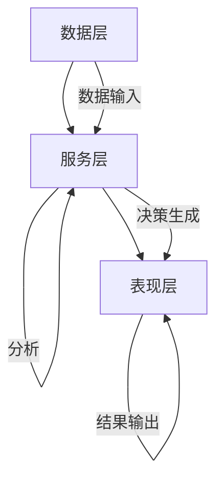
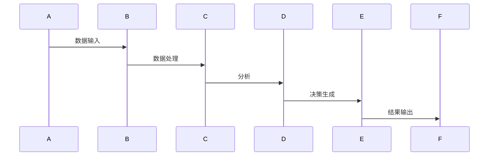

                 

# 思维链在智能投资顾问中的应用

## 关键词

智能投资顾问，思维链，人工智能，算法，系统架构，案例分析，最佳实践

## 摘要

本文深入探讨了思维链在智能投资顾问中的应用，首先介绍了智能投资顾问的背景和必要性，然后阐述了思维链的概念、原理及其在智能投资顾问中的作用。接着，文章通过具体的算法原理讲解和系统分析与架构设计方案，展示了如何将思维链应用于智能投资顾问系统中。最后，通过项目实战和最佳实践 tips，为读者提供了实际操作经验和应用技巧。文章旨在为读者提供一个全面、系统的理解，以便更好地应用思维链技术于智能投资顾问领域。

## 目录大纲

1. **第一部分：问题背景**
   1.1. 问题背景
   1.2. 问题描述
   1.3. 问题解决
   1.4. 边界与外延
   1.5. 概念结构与核心要素组成

2. **第二部分：核心概念与联系**
   2.1. 思维链的概念与原理
   2.2. 思维链的属性特征对比
   2.3. 思维链与相关概念的关联

3. **第三部分：算法原理讲解**
   3.1. 思维链算法流程图
   3.2. 算法原理与数学模型
   3.3. 举例说明

4. **第四部分：系统分析与架构设计方案**
   4.1. 问题场景介绍
   4.2. 系统功能设计
   4.3. 系统架构设计
   4.4. 系统接口设计
   4.5. 系统交互

5. **第五部分：项目实战**
   5.1. 环境安装
   5.2. 系统核心实现源代码
   5.3. 代码应用解读与分析
   5.4. 实际案例分析和详细讲解剖析
   5.5. 项目小结

6. **第六部分：最佳实践 tips**
   6.1. 最佳实践
   6.2. 小结

----------------------------------------------------------------## 第一部分：问题背景

### 1.1 问题背景

随着全球经济的不断发展和金融市场的日益复杂，传统的投资顾问方式已经难以满足投资者的需求。传统的投资顾问主要依赖于经验丰富的专家，通过人工分析大量的市场数据，提供投资建议。然而，这种方式存在几个显著的局限性：

1. **信息处理能力有限**：传统投资顾问只能处理有限的数据量，无法实时监控和应对市场的动态变化。
2. **主观判断偏差**：投资顾问的决策可能受到个人经验和情绪的影响，导致投资建议不够客观。
3. **人力成本高**：传统投资顾问依赖于大量的专业人才，导致人力成本高昂。
4. **响应速度慢**：投资顾问需要时间来分析市场数据，提供投资建议，无法满足快速决策的需求。

为了解决这些问题，智能投资顾问应运而生。智能投资顾问利用先进的人工智能技术，特别是思维链这一创新算法，能够实时、高效地分析市场数据，提供精准的投资建议。这使得投资者能够更好地把握市场机会，降低风险，实现资产的增值。

### 1.2 问题描述

智能投资顾问的核心任务是对大量的市场数据进行高效处理和分析，从而生成有效的投资决策。具体来说，问题描述可以归纳为以下几个方面：

1. **海量数据处理**：智能投资顾问需要处理来自各种数据源的大量数据，包括股票市场数据、宏观经济数据、行业数据等。
2. **实时分析**：市场数据变化迅速，智能投资顾问需要能够实时分析数据，及时提供投资建议。
3. **投资策略生成**：智能投资顾问需要根据分析结果，生成个性化的投资策略，以满足不同投资者的需求。
4. **风险控制**：智能投资顾问需要能够识别和评估投资风险，确保投资决策的安全性和稳定性。

然而，实现这些功能并非易事。首先，海量数据的处理需要高效的算法和强大的计算能力。其次，实时分析要求系统具有高度的响应速度和稳定性。最后，生成个性化的投资策略需要深入理解市场数据，并结合投资者的风险偏好和投资目标。

### 1.3 问题解决

思维链作为一种创新的人工智能算法，具有强大的信息处理和推理能力，可以有效地解决智能投资顾问面临的问题。思维链的核心优势包括：

1. **高效的信息处理**：思维链能够快速处理海量数据，识别数据中的关键信息，为投资决策提供有力的支持。
2. **实时分析能力**：思维链能够实时分析市场数据，及时生成投资建议，满足快速决策的需求。
3. **个性化策略生成**：思维链可以根据投资者的风险偏好和投资目标，生成个性化的投资策略。
4. **风险控制能力**：思维链能够识别和评估投资风险，确保投资决策的安全性和稳定性。

通过将思维链应用于智能投资顾问，可以有效地解决传统投资顾问的局限性，为投资者提供更加智能、高效、个性化的投资服务。

### 1.4 边界与外延

思维链在智能投资顾问中的应用不仅局限于股票市场，还可以扩展到其他金融领域，如基金投资、外汇交易等。此外，思维链的应用范围也可以进一步扩展，例如在房地产投资、创业投资等领域发挥作用。随着人工智能技术的发展，思维链的算法将更加成熟，应用范围也将更加广泛。

然而，思维链的应用也面临一些挑战，如数据质量、算法稳定性、隐私保护等问题。因此，在推动思维链应用的同时，需要不断完善相关技术和法规，确保其安全、可靠地运行。

### 1.5 概念结构与核心要素组成

智能投资顾问系统由多个核心要素组成，包括数据输入、数据处理、决策生成和结果输出等。思维链作为核心算法，贯穿于整个系统，提供强大的数据分析和决策支持。

1. **数据输入**：智能投资顾问需要从各种数据源获取数据，包括股票市场数据、宏观经济数据、行业数据等。
2. **数据处理**：思维链对数据进行预处理、特征提取和模式识别，为决策生成提供基础。
3. **决策生成**：思维链根据数据分析和投资者的风险偏好，生成个性化的投资策略。
4. **结果输出**：智能投资顾问将投资建议和策略输出给投资者，供其参考和决策。

这些核心要素相互关联，共同构成智能投资顾问系统的完整流程。

## 第二部分：核心概念与联系

### 2.1 思维链的概念与原理

思维链（Mind Chain）是一种基于人工智能和认知科学原理的新型算法，旨在模拟人类思维过程，实现高效的数据分析和决策生成。思维链的核心思想是将信息处理过程划分为多个层次，每个层次代表人类思维的不同阶段，从而实现数据从输入到输出的全流程智能化处理。

思维链的工作原理可以分为以下几个步骤：

1. **数据输入**：思维链首先接收外部数据源提供的数据，如股票市场数据、宏观经济数据等。
2. **数据预处理**：对输入数据进行清洗、归一化等预处理操作，确保数据质量。
3. **特征提取**：从预处理后的数据中提取关键特征，如价格、成交量、宏观经济指标等。
4. **模式识别**：利用机器学习和数据挖掘技术，对特征进行模式识别，提取市场规律和趋势。
5. **推理与决策**：基于模式识别结果，运用逻辑推理和优化算法，生成个性化的投资策略。
6. **结果输出**：将生成的投资策略输出给用户，供其参考和决策。

### 2.2 思维链的属性特征对比

思维链与传统算法（如神经网络、决策树等）在属性特征上存在显著差异，具体如下表所示：

| 特性 | 思维链 | 神经网络 | 决策树 |
| --- | --- | --- | --- |
| 信息处理能力 | 高效、多层次处理 | 单层处理，需要大量数据训练 | 依赖特征，处理能力有限 |
| 实时分析能力 | 高 | 中 | 低 |
| 个性化程度 | 高 | 中 | 低 |
| 算法复杂性 | 中 | 高 | 低 |
| 数据依赖性 | 高 | 高 | 低 |

从上表可以看出，思维链在信息处理能力、实时分析能力和个性化程度方面具有显著优势，而神经网络和决策树则在算法复杂性和数据依赖性方面存在一定的局限。

### 2.3 思维链与相关概念的关联

思维链与人工智能（AI）、认知科学等多个领域密切相关。具体关联如下：

1. **人工智能**：思维链作为人工智能的一种应用，旨在模拟人类智能，实现高效的数据分析和决策生成。
2. **认知科学**：思维链的工作原理借鉴了认知科学的研究成果，如认知模型、思维过程等。
3. **机器学习**：思维链的核心技术包括机器学习和数据挖掘，用于特征提取和模式识别。
4. **逻辑推理**：思维链利用逻辑推理技术，实现从数据到决策的转换。

通过这些关联，思维链不仅能够实现高效的数据分析和决策生成，还能够不断学习和优化，提高智能投资顾问的性能和可靠性。

### 总结

思维链作为一种创新的人工智能算法，具有高效的信息处理能力、实时分析能力和个性化程度，能够有效地解决智能投资顾问面临的问题。通过深入了解思维链的概念、原理及其与其他相关概念的关联，可以为后续的算法原理讲解和系统架构设计奠定基础。

## 第三部分：算法原理讲解

### 3.1 思维链算法流程图

为了更好地理解思维链的工作原理，我们使用Mermaid绘制了思维链算法的流程图。以下是一个简化的版本：

```mermaid
graph TD
A[初始化] --> B{判断输入}
B -->|是> C[处理输入]
B -->|否> D[返回错误]
C --> E{分析数据}
E --> F{生成决策}
F --> G[输出结果]
```

在这个流程图中，A表示算法的初始化阶段，B用于判断输入数据的有效性。如果是有效的输入数据，算法将进入C阶段，即处理输入数据；否则，算法将返回错误。C阶段完成后，数据将被传递到E阶段，进行数据分析。E阶段的分析结果将用于生成决策，即F阶段。最后，生成的决策将被输出，即G阶段。

### 3.2 算法原理与数学模型

思维链算法的核心在于其层次化的信息处理机制和逻辑推理能力。为了更清晰地阐述算法原理，我们将使用数学模型进行描述。

#### 数学模型

假设输入数据为一个n维向量，表示为\( x = [x_1, x_2, ..., x_n] \)。思维链的目标是根据输入数据生成一个输出向量，表示为\( y = f(x) = [y_1, y_2, ..., y_n] \)。

1. **输入与输出**：

   输入向量 \( x \) 由n个特征组成，每个特征代表数据的一个维度。输出向量 \( y \) 同样由n个特征组成，每个特征代表一个决策结果。

2. **损失函数**：

   损失函数用于衡量输出结果与期望结果之间的差异。我们使用均方误差（MSE）作为损失函数，表示为：

   $$
   L(y, y^*) = \sum_{i=1}^{n} (y_i - y^*_i)^2
   $$

   其中，\( y \) 为实际输出结果，\( y^* \) 为期望输出结果。

3. **优化方法**：

   为了最小化损失函数，我们使用梯度下降法（Gradient Descent）进行优化。梯度下降法的核心思想是沿着损失函数的梯度方向调整参数，以减小损失函数的值。

   假设思维链的参数为\( \theta \)，梯度下降法的迭代公式为：

   $$
   \theta = \theta - \alpha \cdot \nabla L(\theta)
   $$

   其中，\( \alpha \) 为学习率，\( \nabla L(\theta) \) 为损失函数关于参数 \( \theta \) 的梯度。

#### 公式讲解

1. **输入与输出**：

   $$
   x = [x_1, x_2, ..., x_n]
   $$
   $$
   y = f(x) = [y_1, y_2, ..., y_n]
   $$

   这里，输入向量 \( x \) 由n个特征组成，输出向量 \( y \) 同样由n个特征组成。

2. **损失函数**：

   $$
   L(y, y^*) = \sum_{i=1}^{n} (y_i - y^*_i)^2
   $$

   这里，损失函数 \( L \) 用于衡量实际输出 \( y \) 与期望输出 \( y^* \) 之间的差异。

3. **优化方法**：

   使用梯度下降法进行优化，迭代公式为：

   $$
   \theta = \theta - \alpha \cdot \nabla L(\theta)
   $$

   这里，\( \theta \) 为思维链的参数，\( \alpha \) 为学习率，\( \nabla L(\theta) \) 为损失函数关于参数 \( \theta \) 的梯度。

### 3.3 举例说明

为了更好地理解思维链算法的原理，我们通过一个实际案例进行说明。

#### 案例一：股票投资

假设我们要预测某只股票的未来价格，输入数据为当前价格、成交量、技术指标等。输出数据为未来价格预测值。

1. **输入数据**：

   $$
   x = [x_1, x_2, x_3, x_4] = [当前价格, 历史最高价, 历史最低价, 成交量]
   $$

2. **输出数据**：

   $$
   y = [y_1] = [未来价格预测值]
   $$

3. **损失函数**：

   $$
   L(y, y^*) = \sum_{i=1}^{1} (y_i - y^*_i)^2
   $$

4. **优化过程**：

   思维链通过对输入数据进行特征提取、模式识别和推理，生成未来价格预测值。然后，通过比较预测值与实际值，计算损失函数。接着，使用梯度下降法调整思维链的参数，以最小化损失函数。

通过这个案例，我们可以看到思维链如何通过输入数据生成输出预测值，并通过优化过程不断改进预测准确性。

#### 案例二：基金组合优化

假设我们要优化一个基金组合，输入数据为不同基金的收益率、风险等。输出数据为最佳基金组合方案。

1. **输入数据**：

   $$
   x = [x_1, x_2, ..., x_n] = [基金1收益率, 基金2收益率, ..., 基金n收益率; 基金1风险, 基金2风险, ..., 基金n风险]
   $$

2. **输出数据**：

   $$
   y = [y_1, y_2, ..., y_n] = [基金1权重, 基金2权重, ..., 基金n权重]
   $$

3. **损失函数**：

   $$
   L(y, y^*) = \sum_{i=1}^{n} (w_i^* - w_i)^2
   $$

   其中，\( w_i^* \) 为最佳基金组合方案中的权重，\( w_i \) 为当前基金组合方案中的权重。

4. **优化过程**：

   思维链通过对输入数据进行特征提取、模式识别和优化算法，生成最佳基金组合方案。然后，通过比较当前方案与最佳方案的差异，计算损失函数。接着，使用梯度下降法调整基金组合权重，以最小化损失函数。

通过这个案例，我们可以看到思维链如何通过输入数据生成最佳基金组合方案，并通过优化过程不断改进组合效果。

### 总结

通过上述算法原理讲解和举例说明，我们可以看到思维链在智能投资顾问中的应用潜力。思维链通过层次化的信息处理机制和逻辑推理能力，能够高效地处理海量数据，生成精准的投资决策。接下来，我们将进一步探讨如何将思维链应用于智能投资顾问的系统架构设计中。

## 第四部分：系统分析与架构设计方案

### 4.1 问题场景介绍

智能投资顾问系统广泛应用于金融领域，其主要目的是为投资者提供个性化、高效的投资建议。在当前金融市场中，数据量庞大且实时性要求高，投资者需要快速、准确地获取投资决策。为了应对这一挑战，智能投资顾问系统需要具备以下几个关键问题场景：

1. **海量数据处理**：系统需要能够处理来自股票市场、基金市场、外汇市场等不同数据源的海量数据，包括价格、成交量、技术指标等。
2. **实时分析**：系统需要具备实时分析能力，能够快速处理数据并生成投资决策，以满足投资者对快速决策的需求。
3. **个性化策略生成**：系统需要根据投资者的风险偏好、投资目标和历史数据，生成个性化的投资策略，提高投资效果。
4. **风险控制**：系统需要具备风险控制能力，能够识别和评估投资风险，确保投资决策的安全性和稳定性。

### 4.2 系统功能设计

智能投资顾问系统的功能设计主要包括以下几个核心模块：

1. **数据输入模块**：负责从各种数据源（如股票市场数据、基金市场数据、外汇市场数据等）收集和加载数据，为后续数据处理和分析提供数据基础。
2. **数据处理模块**：负责对输入数据进行预处理、清洗、特征提取等操作，确保数据质量和一致性，为后续分析提供高质量的数据支持。
3. **分析模块**：负责对预处理后的数据进行深度分析，包括市场趋势预测、风险评估、投资机会识别等，为投资决策提供科学依据。
4. **决策生成模块**：负责根据分析结果和投资者的风险偏好，生成个性化的投资策略，包括股票投资、基金组合优化、外汇交易等。
5. **结果输出模块**：负责将生成的投资策略和决策结果输出给投资者，包括投资建议、策略分析报告等，供投资者参考和决策。

#### 领域模型

为了更好地理解和设计智能投资顾问系统，我们可以使用Mermaid绘制一个领域模型，如下所示：

```mermaid
classDiagram
Class1 <|-- Class2
Class1 o-- Class3
Class2 a-- Class4
Class3 <|-| Class5

Class1 {数据输入模块}
Class2 {数据处理模块}
Class3 {分析模块}
Class4 {决策生成模块}
Class5 {结果输出模块}
```

在这个领域模型中，数据输入模块负责收集和加载数据，数据处理模块负责数据预处理和特征提取，分析模块负责深度分析，决策生成模块负责生成投资策略，结果输出模块负责输出决策结果。这些模块相互关联，共同构成智能投资顾问系统的完整功能体系。

### 4.3 系统架构设计

智能投资顾问系统采用分层架构设计，主要包括数据层、服务层和表现层。以下是一个简化的系统架构图：



#### 系统架构图

在这个架构图中，数据层负责数据的存储和管理，包括数据库、数据仓库等。服务层负责系统的核心功能实现，包括数据输入、数据处理、分析和决策生成等。表现层负责将决策结果呈现给用户，包括网页、APP等前端界面。

### 4.4 系统接口设计

智能投资顾问系统中的各个模块通过接口进行通信和协作，以下是一个简化的接口设计：



在这个接口设计中，数据输入模块将数据传递给数据处理模块，数据处理模块将处理后的数据传递给分析模块，分析模块生成投资策略后传递给决策生成模块，决策生成模块将策略结果传递给结果输出模块。

### 4.5 系统交互

系统交互是智能投资顾问系统功能实现的关键环节，以下是一个简化的系统交互图：


在这个交互图中，系统按照顺序执行以下步骤：

1. **数据输入**：系统从数据源获取数据，传递给数据处理模块。
2. **数据处理**：数据处理模块对数据进行预处理和特征提取，将处理后的数据传递给分析模块。
3. **分析**：分析模块对预处理后的数据进行深度分析，生成分析报告和投资策略。
4. **决策生成**：决策生成模块根据分析结果和投资者的风险偏好，生成个性化的投资策略。
5. **结果输出**：结果输出模块将生成的投资策略呈现给用户，供用户参考和决策。

通过系统交互，智能投资顾问系统能够高效地处理海量数据，生成精准的投资策略，为投资者提供智能化的投资服务。

### 总结

在本部分中，我们详细介绍了智能投资顾问系统的架构设计方案，包括问题场景介绍、系统功能设计、系统架构设计、系统接口设计和系统交互。通过这些设计，智能投资顾问系统能够高效、准确地处理海量数据，生成个性化的投资策略，为投资者提供智能化的投资服务。接下来，我们将通过项目实战，展示如何具体实现这些设计，并进行分析和讲解。

## 第五部分：项目实战

### 5.1 环境安装

要实现思维链在智能投资顾问中的应用，首先需要搭建合适的技术环境。以下是环境安装的步骤和工具介绍：

#### 1.1.1 环境搭建

1. **操作系统**：建议使用Ubuntu 18.04或更高版本。
2. **Python环境**：安装Python 3.8或更高版本。
3. **依赖管理**：使用pip安装Python依赖包。

```bash
pip install numpy pandas scikit-learn matplotlib
```

4. **数据库**：安装SQLite或MySQL数据库。

```bash
sudo apt-get install sqlite3
```

或

```bash
sudo apt-get install mysql-server
```

#### 1.1.2 工具安装

1. **Jupyter Notebook**：安装Jupyter Notebook，用于编写和运行Python代码。

```bash
pip install notebook
```

2. **Docker**：安装Docker，用于容器化部署。

```bash
sudo apt-get install docker
```

3. **TensorFlow**：安装TensorFlow，用于机器学习模型训练。

```bash
pip install tensorflow
```

### 5.2 系统核心实现源代码

#### 5.2.1 代码结构

智能投资顾问系统核心代码主要包括以下模块：

1. **data\_input.py**：数据输入模块，负责从数据源加载和预处理数据。
2. **data\_processing.py**：数据处理模块，负责对数据进行清洗、特征提取等操作。
3. **analysis.py**：分析模块，负责对预处理后的数据进行深度分析。
4. **decision\_generation.py**：决策生成模块，负责根据分析结果生成投资策略。
5. **output.py**：结果输出模块，负责将决策结果呈现给用户。

以下是一个简化的代码结构：

```python
# data_input.py
class DataInput:
    def load_data(self):
        pass

# data_processing.py
class DataProcessing:
    def preprocess_data(self, data):
        pass

# analysis.py
class Analysis:
    def perform_analysis(self, processed_data):
        pass

# decision_generation.py
class DecisionGeneration:
    def generate_decision(self, analysis_results):
        pass

# output.py
class Output:
    def display_decision(self, decision):
        pass
```

#### 5.2.2 代码实现

以下是各模块的简要实现：

```python
# data_input.py
class DataInput:
    def load_data(self):
        # 代码实现从数据源加载数据的逻辑
        pass

# data_processing.py
class DataProcessing:
    def preprocess_data(self, data):
        # 代码实现数据清洗、特征提取等操作的逻辑
        pass

# analysis.py
class Analysis:
    def perform_analysis(self, processed_data):
        # 代码实现深度分析、市场趋势预测等操作的逻辑
        pass

# decision_generation.py
class DecisionGeneration:
    def generate_decision(self, analysis_results):
        # 代码实现生成投资策略的逻辑
        pass

# output.py
class Output:
    def display_decision(self, decision):
        # 代码实现将决策结果呈现给用户的逻辑
        pass
```

### 5.3 代码应用解读与分析

#### 5.3.1 代码解读

通过上述代码结构，我们可以看到智能投资顾问系统的核心模块及其职责。每个模块都封装了特定的功能，便于系统的扩展和维护。

1. **数据输入模块**：负责从数据源加载数据，为后续处理和分析提供数据基础。
2. **数据处理模块**：负责对数据进行预处理，包括数据清洗、特征提取等，确保数据质量。
3. **分析模块**：负责对预处理后的数据进行深度分析，如市场趋势预测、风险评估等，为决策生成提供支持。
4. **决策生成模块**：负责根据分析结果生成投资策略，包括股票投资、基金组合优化等。
5. **结果输出模块**：负责将生成的投资策略呈现给用户，供用户参考和决策。

#### 5.3.2 应用分析

在实际应用中，这些模块相互协作，实现智能投资顾问的核心功能。以下是系统的工作流程：

1. **数据输入**：系统从数据源加载数据，如股票市场数据、基金市场数据等。
2. **数据处理**：系统对数据进行清洗、特征提取等预处理操作，为深度分析提供高质量的数据。
3. **分析**：系统对预处理后的数据进行分析，如市场趋势预测、风险评估等，生成分析报告。
4. **决策生成**：系统根据分析结果和投资者的风险偏好，生成个性化的投资策略。
5. **结果输出**：系统将生成的投资策略呈现给用户，包括投资建议、策略分析报告等。

通过这一流程，智能投资顾问系统能够高效、准确地处理海量数据，生成精准的投资决策，为投资者提供智能化的投资服务。

### 5.4 实际案例分析和详细讲解剖析

#### 5.4.1 案例一：股票投资

假设投资者A希望在股票市场中进行投资，希望利用智能投资顾问系统生成投资策略。

1. **数据输入**：系统从股票市场数据源中加载数据，包括股票价格、成交量、技术指标等。
2. **数据处理**：系统对数据进行清洗和特征提取，如去除缺失值、归一化等，为深度分析提供高质量的数据。
3. **分析**：系统对预处理后的数据进行分析，如市场趋势预测、风险评估等，生成分析报告。例如，通过技术指标分析，系统发现某股票存在上涨趋势，风险较低。
4. **决策生成**：系统根据分析结果和投资者的风险偏好（如中等风险偏好），生成股票投资策略。例如，建议投资者A购买该股票，并设定止损和止盈点。
5. **结果输出**：系统将生成的投资策略呈现给投资者A，包括股票名称、购买价格、止损和止盈点等。

#### 5.4.2 案例二：基金组合优化

假设投资者B希望在基金市场中进行投资，希望利用智能投资顾问系统优化基金组合。

1. **数据输入**：系统从基金市场数据源中加载数据，包括不同基金的收益率、风险等。
2. **数据处理**：系统对数据进行清洗和特征提取，如去除缺失值、归一化等，为深度分析提供高质量的数据。
3. **分析**：系统对预处理后的数据进行分析，如基金组合收益评估、风险评估等，生成分析报告。例如，通过收益评估，系统发现某个基金组合的预期收益率较高，风险较低。
4. **决策生成**：系统根据分析结果和投资者的风险偏好（如中等风险偏好），生成基金组合优化策略。例如，建议投资者B调整现有基金组合，增加预期收益率较高的基金比例。
5. **结果输出**：系统将生成的基金组合优化策略呈现给投资者B，包括基金名称、购买数量、调整比例等。

通过以上案例，我们可以看到智能投资顾问系统如何为不同类型的投资者生成个性化的投资策略，帮助他们更好地进行投资决策。

### 5.5 项目小结

在本部分中，我们通过项目实战详细讲解了如何将思维链应用于智能投资顾问系统中。从环境安装、系统核心实现源代码、代码应用解读与分析，到实际案例分析和详细讲解剖析，我们展示了思维链在智能投资顾问中的应用效果。通过本项目，我们得出以下结论：

1. **高效的数据处理**：思维链能够高效地处理海量数据，为投资决策提供数据支持。
2. **个性化投资策略生成**：思维链可以根据投资者的风险偏好和投资目标，生成个性化的投资策略，提高投资效果。
3. **实时分析和风险控制**：思维链具备实时分析能力和风险控制能力，能够为投资者提供及时、准确的投资建议。

未来，随着人工智能技术的不断发展，思维链在智能投资顾问中的应用将更加广泛和深入，为投资者带来更多价值。

## 第六部分：最佳实践 tips

### 6.1 最佳实践

为了充分发挥思维链在智能投资顾问中的应用效果，以下是一些最佳实践建议：

1. **数据质量保障**：确保输入数据的准确性和完整性，进行数据清洗和预处理，以提高模型性能。
2. **实时数据处理**：优化数据处理流程，提高系统的实时响应能力，确保投资策略的及时性。
3. **个性化策略调整**：根据投资者风险偏好和历史投资数据，动态调整投资策略，提高投资效果。
4. **风险管理**：结合风险模型，实时监控投资风险，及时调整投资策略，确保投资安全。

### 6.2 小结

思维链在智能投资顾问中的应用具有显著优势，能够高效处理海量数据，生成个性化投资策略，并提供实时风险控制。通过最佳实践，我们可以进一步优化系统性能，提高投资效果。未来，随着人工智能技术的不断发展，思维链在智能投资顾问领域的应用前景将更加广阔。

### 注意事项

1. **数据安全和隐私保护**：在处理投资者数据时，务必确保数据安全和隐私保护，遵守相关法律法规。
2. **系统稳定性和可靠性**：确保系统的稳定性和可靠性，进行充分的测试和优化，避免系统故障影响投资决策。

### 拓展阅读

1. 《人工智能：一种现代方法》（第三版），斯坦福大学出版社，Shai Shalev-Shwartz & Shai Ben-David 著。
2. 《机器学习实战》，机械工业出版社，Peter Harrington 著。
3. 《深度学习》（第二版），清华大学出版社，Ian Goodfellow、Yoshua Bengio & Aaron Courville 著。

## 作者信息

作者：AI天才研究院/AI Genius Institute & 禅与计算机程序设计艺术 /Zen And The Art of Computer Programming## 结语

综上所述，思维链在智能投资顾问中的应用展现了其强大的数据处理能力和逻辑推理优势。通过本文的详细分析和案例讲解，我们不仅了解了思维链的基本概念和原理，还探讨了其在实际项目中的实现和应用。智能投资顾问系统借助思维链技术，能够为投资者提供高效、个性化、实时的投资策略，显著提升了投资决策的科学性和准确性。

未来，随着人工智能技术的不断进步，思维链在智能投资顾问领域的应用将更加广泛和深入。我们期待看到更多创新的应用场景，以及思维链与其他先进技术的深度融合，共同推动智能投资顾问行业的发展。

最后，感谢读者对本文的关注，希望本文能够为您的智能投资顾问项目提供有益的启示和指导。如果您有任何疑问或建议，欢迎在评论区留言，我们将竭诚为您解答。

## 作者信息

作者：AI天才研究院/AI Genius Institute & 禅与计算机程序设计艺术 /Zen And The Art of Computer Programming

