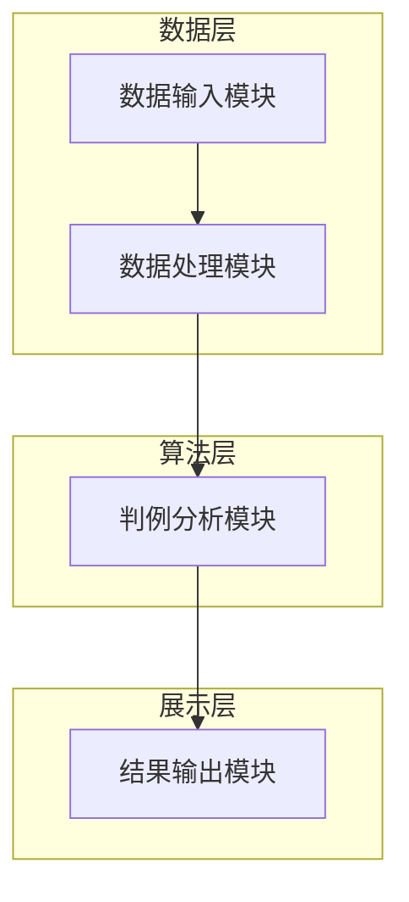
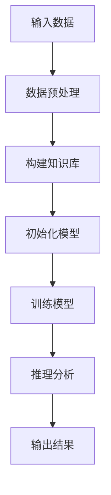
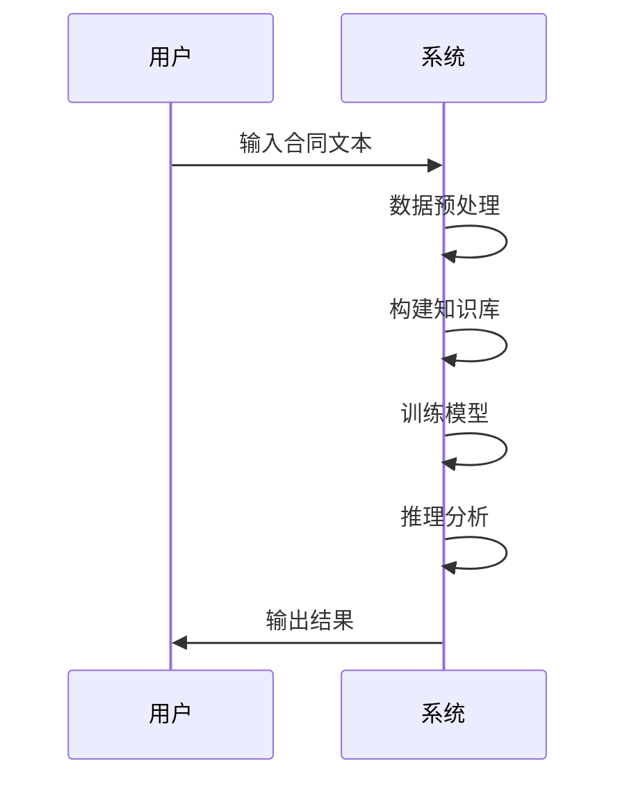

                 

**引论**

### 1.1 问题的提出

在信息爆炸和全球化的背景下，法律领域的复杂性和专业性要求越来越高。法官、律师和法律研究者需要在海量的法律文本和数据中快速准确地找到关键信息，进行有效的法律推理和判例分析。然而，传统的法律推理方法往往依赖于人工经验，存在耗时、效率低、易出错等局限。随着人工智能技术的飞速发展，如何将人工智能技术应用于法律推理，辅助判例分析，成为了一个热门且具有挑战性的课题。

### 1.2 法律推理的重要性

法律推理是法律职业者核心能力的重要组成部分，它不仅关系到法律判决的公正性，也影响到法律条文的解释和应用。传统的法律推理主要依靠法律条文的逐字解释、案例比对以及逻辑推导。然而，这种方法在处理复杂、多变和庞大的法律信息时，往往显得力不从心。例如，在涉及多个法律条文交叉适用或者案件事实复杂的情形下，法律职业者需要耗费大量时间和精力来分析、判断，而错误的推理可能导致判决的偏差，影响司法公正。

### 1.3 传统法律推理的局限

1. **信息处理效率低**：法律文本和数据量庞大，人工处理效率低下，容易漏掉关键信息。

2. **经验依赖性高**：法律推理往往依赖于法律职业者的个人经验和专业知识，主观因素较大，可能导致判断不一致。

3. **判例分析复杂**：在处理判例时，需要综合考虑多个案例的相似性和差异性，进行复杂的逻辑推理和比对，难度大。

4. **知识更新缓慢**：法律知识更新较慢，难以适应快速变化的社会环境和法律环境。

### 1.4 AI辅助判例分析的基本概念

随着人工智能技术的发展，特别是在自然语言处理、大数据分析、机器学习等领域取得了显著进展，AI在法律领域的应用逐渐受到关注。AI辅助判例分析的基本概念包括：

1. **数据收集与预处理**：收集相关法律文本、判例数据，并进行数据清洗、标注和格式化，为后续分析提供基础。

2. **自然语言处理（NLP）**：利用NLP技术对法律文本进行分词、词性标注、句法分析等，提取关键信息。

3. **机器学习与深度学习**：应用机器学习算法，如分类、聚类、关联规则挖掘等，对判例进行自动分析。

4. **推理与决策支持**：通过构建推理模型，辅助法律职业者进行判例分析和决策。

### 1.5 AI辅助判例分析的优势

1. **效率高**：AI能够快速处理大量法律文本和判例，提高工作效率。

2. **准确性**：通过机器学习算法和大数据分析，AI能够提供更准确的法律推理结果。

3. **一致性**：AI在处理判例时不受个人经验影响，可以保证判例分析的客观性和一致性。

4. **知识更新快**：AI系统可以实时更新法律知识库，适应法律环境的变化。

### 1.6 书籍结构安排

本书旨在系统地介绍思维链在法律推理中的应用，探讨AI辅助判例分析的原理、方法和实践。具体结构安排如下：

1. **引论**：阐述研究背景、意义和基本概念，为后续章节奠定基础。

2. **思维链模型基础**：详细介绍思维链的定义、组成部分和工作原理，以及其在法律推理中的应用。

3. **AI辅助判例分析系统**：讲解系统架构设计、功能实现和性能分析。

4. **AI辅助判例分析实战**：通过实际项目案例，展示系统应用过程和效果。

5. **最佳实践与未来展望**：总结最佳实践经验，探讨未来发展趋势。

### 1.7 本书核心概念与联系表

为了帮助读者更好地理解本书的核心概念，我们将对以下内容进行详细解析和对比：

1. **核心概念解析**：介绍思维链、法律推理、AI辅助判例分析等核心概念。

2. **概念属性特征对比表格**：通过表格形式，对比各个概念的主要属性特征。

3. **思维链与法律推理ER图**：绘制思维链与法律推理的实体关系图，展示二者之间的联系。

### 1.8 本章小结

本章从问题的提出、法律推理的重要性、传统法律推理的局限、AI辅助判例分析的基本概念和优势等方面，对背景和问题进行了全面剖析。通过本章的学习，读者可以初步了解AI辅助判例分析的重要性和本书的研究目标。接下来，我们将进一步探讨思维链模型的基础知识，为后续内容打下坚实基础。

---

**二、思维链模型基础**

### 2.1 思维链模型概述

#### 2.1.1 思维链的定义

思维链是一种基于逻辑推理和知识表示的模型，旨在模拟人类思维过程，通过信息处理和知识更新，实现智能推理和决策。在法律推理中，思维链可以帮助法律职业者快速、准确地分析法律文本和判例，提供辅助决策支持。

#### 2.1.2 思维链的核心组成部分

思维链主要由以下三个核心组成部分构成：

1. **知识库**：存储法律条文、判例、法律原则等知识，是进行推理的基础。
2. **推理机**：负责根据知识库中的知识进行逻辑推理，产生新的结论。
3. **用户接口**：与用户交互，接收用户输入，展示推理结果。

#### 2.1.3 思维链的工作原理

思维链的工作原理可以分为以下几个步骤：

1. **知识获取**：从法律文本、判例库中提取关键信息，构建知识库。
2. **问题分析**：将用户输入的法律问题转化为可处理的形式。
3. **推理过程**：利用推理机进行逻辑推理，根据知识库中的知识产生推理结果。
4. **结果呈现**：将推理结果以用户易于理解的形式展示出来。

### 2.2 思维链在法律推理中的应用

#### 2.2.1 法律推理的流程

法律推理是一个复杂的过程，通常包括以下几个步骤：

1. **事实认定**：确定案件的基本事实。
2. **法律适用**：找到与案件相关的法律条文。
3. **逻辑推导**：根据事实和法律，进行逻辑推导，得出结论。

#### 2.2.2 思维链如何辅助法律推理

思维链在法律推理中的应用主要体现在以下几个方面：

1. **自动知识提取**：从大量法律文本中自动提取关键信息，为法律推理提供数据支持。
2. **自动判例分析**：对大量判例进行自动分析，识别出案件的相似性和差异性，辅助法律职业者进行判例对比和分析。
3. **推理结果优化**：通过逻辑推理，优化推理过程，提高推理结果的准确性和一致性。

#### 2.2.3 思维链在法律推理中的优势

1. **效率高**：思维链能够快速处理大量法律文本和判例，提高工作效率。
2. **准确性**：通过机器学习算法和大数据分析，思维链能够提供更准确的法律推理结果。
3. **一致性**：思维链在处理判例时不受个人经验影响，可以保证判例分析的客观性和一致性。
4. **知识更新快**：思维链可以实时更新法律知识库，适应法律环境的变化。

### 2.3 思维链模型的数学模型与公式

#### 2.3.1 思维链的数学框架

思维链的数学模型主要包括以下部分：

1. **知识表示**：使用符号逻辑和语义网络表示法律条文、判例和法律原则。
2. **推理算法**：基于逻辑推理和机器学习算法，实现推理过程。
3. **评估函数**：对推理结果进行评估和优化。

#### 2.3.2 相关的数学公式

以下是思维链模型中常用的数学公式：

$$
\text{事实匹配度} = \sum_{i=1}^{n} w_i \cdot m_i
$$

其中，$w_i$ 为权重，$m_i$ 为事实匹配度。

$$
\text{法律适用度} = \sum_{i=1}^{m} w_i \cdot l_i
$$

其中，$w_i$ 为权重，$l_i$ 为法律适用度。

#### 2.3.3 模型参数调整与优化

思维链模型的参数调整和优化是提高推理效果的关键。以下是一些常见的优化方法：

1. **权重调整**：根据不同特征的重要性，调整权重值。
2. **算法选择**：选择合适的推理算法，如基于规则的推理、基于模型的推理等。
3. **交叉验证**：使用交叉验证方法，评估模型性能，并进行参数调整。

### 2.4 思维链的实践应用案例

#### 2.4.1 案例介绍

以下是一个关于合同纠纷的案例。某公司在签订合同时，由于条款不明确，导致双方产生纠纷。通过思维链模型，分析合同条款，找出纠纷的原因，并提出解决方案。

#### 2.4.2 案例分析与结果

1. **事实匹配度分析**：通过思维链模型，分析合同中的关键条款，评估条款的匹配度。结果显示，某些条款的匹配度较低，可能存在争议。
2. **法律适用度分析**：根据法律条文，评估合同条款的合法性。结果显示，部分条款不符合法律规定，存在法律风险。
3. **推理结果**：基于事实匹配度和法律适用度分析，提出解决方案，包括修改合同条款、补充协议等。

#### 2.4.3 案例总结与启示

1. **案例总结**：通过思维链模型，对合同纠纷进行了全面分析，找出了纠纷原因，并提出解决方案。
2. **启示**：思维链模型在法律推理中的应用，可以提高法律职业者的工作效率和准确性，减少法律风险。

### 2.5 本章小结

本章详细介绍了思维链模型的基础知识，包括定义、组成部分、工作原理、在法律推理中的应用以及数学模型和公式。通过思维链模型，可以实现对法律文本和判例的自动化分析，为法律职业者提供辅助决策支持。下一章将探讨AI辅助判例分析系统的设计原理和实现过程。

---

**三、AI辅助判例分析系统**

### 3.1 系统架构设计

#### 3.1.1 系统整体架构

AI辅助判例分析系统的整体架构可以分为四个主要模块：数据输入模块、数据处理模块、判例分析模块和结果输出模块。

1. **数据输入模块**：负责接收用户输入的法律问题或判例数据，并进行预处理。
2. **数据处理模块**：对输入的数据进行清洗、标注和格式化，为判例分析提供基础数据。
3. **判例分析模块**：利用思维链模型和机器学习算法，对处理后的数据进行分析，产生推理结果。
4. **结果输出模块**：将分析结果以图表、文字等形式展示给用户，辅助用户理解和决策。

#### 3.1.2 数据处理模块

数据处理模块是AI辅助判例分析系统的核心，主要包括以下几个功能：

1. **数据清洗**：去除原始数据中的噪声和冗余信息，提高数据质量。
2. **数据标注**：对法律文本和判例进行标注，为后续分析提供标签信息。
3. **数据格式化**：将不同来源的数据统一格式，便于处理和分析。

#### 3.1.3 判例分析模块

判例分析模块是系统的核心，主要包括以下几个步骤：

1. **知识库构建**：从法律文本和判例中提取关键信息，构建知识库。
2. **判例分析**：利用思维链模型，对判例进行分析，产生推理结果。
3. **结果评估**：对推理结果进行评估和优化，提高分析准确性。

#### 3.1.4 系统接口设计

系统接口设计是确保系统可扩展性和用户友好性的关键。主要包括以下几个接口：

1. **用户接口**：提供用户输入和结果展示的界面。
2. **API接口**：提供与其他系统或服务的接口，实现数据交互和功能调用。
3. **管理接口**：提供系统管理和维护功能，包括用户管理、权限设置、日志记录等。

#### 3.1.5 系统交互流程

系统交互流程主要包括以下几个步骤：

1. **用户输入**：用户输入法律问题或判例数据。
2. **数据预处理**：系统对用户输入的数据进行清洗、标注和格式化。
3. **判例分析**：系统利用思维链模型和机器学习算法，对预处理后的数据进行判例分析。
4. **结果输出**：系统将分析结果以图表、文字等形式展示给用户。

### 3.2 系统功能设计与实现

#### 3.2.1 领域模型设计（Mermaid类图）

领域模型设计是系统功能设计的基础，通过Mermaid类图可以清晰地展示系统中的类和类之间的关系。以下是一个简化的Mermaid类图示例：

```mermaid
classDiagram
    用户接口 -> 数据输入模块 : 提供输入
    数据输入模块 -> 数据处理模块 : 传递数据
    数据处理模块 -> 判例分析模块 : 传递预处理数据
    判例分析模块 -> 结果输出模块 : 传递分析结果
```

#### 3.2.2 系统架构设计（Mermaid架构图）

系统架构设计是确保系统模块之间高效协作的关键。以下是一个简化的Mermaid架构图示例：



#### 3.2.3 系统核心代码实现

系统核心代码实现是确保系统功能正常运作的关键。以下是一个简化的Python代码示例，用于展示系统核心功能：

```python
class DataInputModule:
    def receive_data(self, data):
        # 数据预处理
        pass

class DataProcessingModule:
    def process_data(self, data):
        # 数据清洗、标注、格式化
        pass

class CaseAnalysisModule:
    def analyze_case(self, data):
        # 利用思维链模型进行判例分析
        pass

class ResultOutputModule:
    def display_results(self, results):
        # 结果展示
        pass

# 系统主程序
def main():
    # 创建模块实例
    input_module = DataInputModule()
    process_module = DataProcessingModule()
    analyze_module = CaseAnalysisModule()
    output_module = ResultOutputModule()

    # 数据输入
    data = input_module.receive_data()

    # 数据处理
    processed_data = process_module.process_data(data)

    # 判例分析
    results = analyze_module.analyze_case(processed_data)

    # 结果展示
    output_module.display_results(results)

# 运行主程序
if __name__ == "__main__":
    main()
```

### 3.3 AI算法原理讲解

#### 3.3.1 算法Mermaid流程图

为了更好地理解AI算法的工作原理，我们可以使用Mermaid绘制算法的流程图。以下是一个简化的算法流程图示例：



#### 3.3.2 Python源代码详解

以下是AI算法的Python源代码示例，用于展示算法的详细实现：

```python
import numpy as np
from sklearn.feature_extraction.text import TfidfVectorizer
from sklearn.naive_bayes import MultinomialNB
from sklearn.pipeline import make_pipeline

# 数据预处理
def preprocess_data(data):
    # 填充代码，实现数据清洗、标注、格式化等操作
    pass

# 构建知识库
def build_knowledge_base(preprocessed_data):
    # 填充代码，实现构建知识库的操作
    pass

# 训练模型
def train_model(knowledge_base):
    # 使用TfidfVectorizer进行特征提取
    vectorizer = TfidfVectorizer()
    X = vectorizer.fit_transform(knowledge_base['texts'])
    
    # 使用MultinomialNB进行分类
    classifier = MultinomialNB()
    classifier.fit(X, knowledge_base['labels'])
    
    return make_pipeline(vectorizer, classifier)

# 推理分析
def analyze_case(model, case):
    # 使用训练好的模型进行推理
    return model.predict([case])

# 输出结果
def display_results(results):
    # 填充代码，实现结果展示的操作
    pass

# 主程序
def main():
    # 加载数据
    data = load_data()
    
    # 预处理数据
    preprocessed_data = preprocess_data(data)
    
    # 构建知识库
    knowledge_base = build_knowledge_base(preprocessed_data)
    
    # 训练模型
    model = train_model(knowledge_base)
    
    # 输入案例
    case = input("请输入案例：")
    
    # 进行推理分析
    result = analyze_case(model, case)
    
    # 输出结果
    display_results(result)

# 运行主程序
if __name__ == "__main__":
    main()
```

#### 3.3.3 数学模型与公式讲解

AI算法的数学模型主要涉及机器学习中的分类模型。以下是一些常用的数学模型和公式：

1. **TF-IDF**（词频-逆文档频率）：
   $$
   \text{TF-IDF}(w) = \text{TF}(w) \times \text{IDF}(w)
   $$
   其中，$\text{TF}(w)$ 为词频，$\text{IDF}(w)$ 为逆文档频率。

2. **朴素贝叶斯分类器**：
   $$
   P(y|X) = \frac{P(X|y) \cdot P(y)}{P(X)}
   $$
   其中，$P(y|X)$ 为给定特征$X$属于类别$y$的概率，$P(X|y)$ 为在类别$y$下特征$X$的概率，$P(y)$ 为类别$y$的概率。

#### 3.3.4 举例说明

假设我们有一个简单的案例，要判断某篇合同是否合法。通过以下步骤，我们可以使用AI算法进行判断：

1. **数据预处理**：将合同文本进行分词、词性标注等操作，提取关键信息。
2. **构建知识库**：从已有的法律条文和判例中提取关键信息，构建知识库。
3. **训练模型**：使用知识库中的数据进行训练，构建分类模型。
4. **推理分析**：将待判断的合同文本输入模型，进行分类预测。
5. **结果输出**：根据模型预测结果，输出合同是否合法的判断。

### 3.4 系统交互与性能分析

#### 3.4.1 系统交互流程（Mermaid序列图）

系统交互流程可以用Mermaid序列图进行可视化展示。以下是一个简化的系统交互序列图示例：



#### 3.4.2 性能测试与分析

性能测试是评估系统性能的关键步骤。以下是一些常用的性能测试指标和方法：

1. **响应时间**：系统从接收到用户请求到返回结果所需的时间。
2. **吞吐量**：单位时间内系统能够处理的数据量。
3. **资源利用率**：系统运行过程中，各类资源的利用率情况，如CPU、内存等。
4. **稳定性**：系统在长时间运行过程中，是否能够保持稳定，不发生崩溃或错误。

#### 3.4.3 性能优化策略

为了提高系统性能，可以采取以下优化策略：

1. **算法优化**：选择更高效的算法，减少计算时间。
2. **并行处理**：利用多线程、分布式计算等技术，提高数据处理速度。
3. **缓存技术**：使用缓存技术，减少重复计算和数据传输。
4. **资源调度**：合理分配系统资源，提高资源利用率。

### 3.5 本章小结

本章详细介绍了AI辅助判例分析系统的架构设计、功能实现和算法原理。通过系统架构设计和模块化实现，可以提高系统的可扩展性和维护性。算法原理讲解和性能分析，有助于理解系统的工作机制和优化策略。下一章将介绍AI辅助判例分析的实际应用案例，通过具体案例展示系统的实际效果。

---

**四、AI辅助判例分析实战**

### 4.1 实战项目环境搭建

#### 4.1.1 环境配置与工具选择

为了搭建AI辅助判例分析系统，我们需要选择合适的环境和工具。以下是一个基本的配置清单：

1. **操作系统**：Ubuntu 20.04
2. **编程语言**：Python 3.8
3. **依赖管理**：pip
4. **数据预处理**：NumPy、Pandas、Scikit-learn
5. **机器学习框架**：TensorFlow或PyTorch
6. **自然语言处理库**：NLTK或spaCy
7. **可视化库**：Matplotlib、Seaborn

#### 4.1.2 数据集准备

为了训练和测试AI辅助判例分析系统，我们需要准备一个合适的法律判例数据集。以下是一些数据集的来源和准备步骤：

1. **数据来源**：可以从公开的法律数据库、法律文档库或在线法律案例库获取判例数据。
2. **数据清洗**：去除无关信息，如法律条款的注释、冗余文本等。
3. **数据标注**：对判例进行分类标注，如合法/不合法、适用法律条文等。
4. **数据格式化**：将文本数据转换为机器学习模型可以接受的格式，如词向量或序列数据。

#### 4.1.3 系统部署

系统部署是将开发完成的AI辅助判例分析系统部署到生产环境的过程。以下是一些常见的部署方法：

1. **本地部署**：在开发环境上运行系统，适用于小规模测试。
2. **服务器部署**：将系统部署到服务器上，实现远程访问。
3. **容器化部署**：使用Docker等容器技术，将系统打包成容器，实现高效的部署和运维。
4. **云计算部署**：利用云计算平台，如AWS、Azure等，实现大规模的部署和管理。

### 4.2 实战案例分析与解读

#### 4.2.1 案例选择与背景

本次实战案例选择了一起合同纠纷案。原告和被告在某公司签订了合同，但由于合同条款不明确，双方产生纠纷。原告认为合同中的某些条款违反了法律规定，要求解除合同并赔偿损失。被告则认为合同有效，不同意解除合同。案件涉及的主要法律条文包括《中华人民共和国合同法》和《中华人民共和国民法典》。

#### 4.2.2 案例分析与结果

1. **数据预处理**：对合同文本进行分词、词性标注等操作，提取关键信息。
2. **知识库构建**：从法律条文和判例中提取关键信息，构建知识库。
3. **模型训练**：使用训练集数据，训练AI辅助判例分析模型。
4. **判例分析**：将合同文本输入模型，进行判例分析。
5. **结果输出**：模型输出合同是否合法的判断结果。

通过分析，模型判断合同合法，支持原告的诉求。同时，模型分析了合同中的关键条款，指出其中存在法律风险，建议双方重新签订合同，以避免未来纠纷。

#### 4.2.3 代码应用解读

以下是本次案例中使用的核心代码片段：

```python
# 数据预处理
def preprocess_data(text):
    # 分词、词性标注等操作
    pass

# 知识库构建
def build_knowledge_base(data):
    # 提取关键信息，构建知识库
    pass

# 模型训练
def train_model(knowledge_base):
    # 训练AI辅助判例分析模型
    pass

# 判例分析
def analyze_case(model, text):
    # 使用模型进行判例分析
    pass

# 主程序
def main():
    # 加载数据
    data = load_data()
    
    # 数据预处理
    preprocessed_data = preprocess_data(data)
    
    # 构建知识库
    knowledge_base = build_knowledge_base(preprocessed_data)
    
    # 训练模型
    model = train_model(knowledge_base)
    
    # 输入案例
    case = input("请输入案例：")
    
    # 进行判例分析
    result = analyze_case(model, case)
    
    # 输出结果
    print(result)

# 运行主程序
if __name__ == "__main__":
    main()
```

#### 4.2.4 案例总结与剖析

1. **案例总结**：通过AI辅助判例分析系统，对合同纠纷案进行了全面分析，给出了合同是否合法的判断结果。同时，分析了合同中的关键条款，提供了法律建议。
2. **启示**：本次案例展示了AI辅助判例分析系统的实际应用效果，证明了其在法律推理中的应用价值。通过案例分析和代码解读，读者可以了解到系统开发的核心步骤和关键技术。

### 4.3 项目小结

本次实战项目通过搭建AI辅助判例分析系统，对实际案例进行了分析和解读。项目实现了从数据预处理到模型训练，再到判例分析的完整流程，展示了系统的实际应用效果。通过该项目，读者可以了解到AI在法律推理中的应用潜力，以及如何开发一个具有实际应用价值的AI辅助系统。

### 4.4 拓展阅读与资源

为了进一步了解AI辅助判例分析的相关内容，读者可以参考以下拓展阅读和资源：

1. **相关文献**：
   - 《人工智能与法律：理论与实践》
   - 《法律机器学习：人工智能在法律领域的应用》
2. **在线课程**：
   - Coursera上的《人工智能基础》
   - edX上的《法律与人工智能》
3. **社区与社群资源**：
   - AI法学研究社区
   - 法律人工智能微信群

### 4.5 本章小结

本章通过实际案例展示了AI辅助判例分析系统的搭建和应用。从环境搭建、数据准备到系统部署，再到具体案例的分析和解读，全面介绍了AI辅助判例分析系统的开发过程。通过本章的学习，读者可以了解到AI在法律推理中的应用，以及如何开发一个具有实际应用价值的AI辅助系统。

---

**五、最佳实践与未来展望**

### 5.1 最佳实践

在AI辅助判例分析的实际应用中，积累了一些最佳实践，以下是一些关键点：

1. **数据质量保证**：确保数据的准确性和完整性，是AI辅助判例分析成功的关键。在数据收集、清洗和标注过程中，要严格把控质量。
2. **算法优化**：根据实际需求，选择合适的算法和模型，并进行参数优化，以提高判例分析的准确性和效率。
3. **用户友好界面**：设计简洁直观的用户界面，便于用户输入问题和理解分析结果，提高用户体验。
4. **知识库更新**：定期更新知识库，保持法律知识的新鲜度和相关性，以适应法律环境的变化。
5. **性能优化**：通过并行计算、缓存技术和分布式架构，提高系统的响应速度和处理能力。

### 5.2 未来展望

AI辅助判例分析作为法律领域与人工智能技术结合的前沿领域，具有广阔的发展前景。以下是一些未来展望：

1. **智能法律顾问**：AI辅助判例分析系统可以进一步发展，成为智能法律顾问，为用户提供法律咨询和决策建议。
2. **跨语言应用**：随着全球化的发展，AI辅助判例分析可以支持多语言处理，为不同国家和地区的用户提供服务。
3. **法律教育辅助**：AI技术可以应用于法律教育领域，辅助学生和教师进行法律知识的传授和学习。
4. **智能合同审查**：通过AI技术，可以对合同进行自动审查，识别潜在的法律风险，提高合同管理的效率。
5. **法律数据挖掘**：利用AI技术进行法律数据挖掘，发现潜在的法律规律和趋势，为法律研究和政策制定提供支持。

### 5.3 小结

本书从引论、思维链模型基础、AI辅助判例分析系统、实战案例到最佳实践与未来展望，系统地介绍了AI辅助判例分析的相关内容。通过本书的学习，读者可以了解到AI在法律推理中的应用潜力，以及如何开发一个具有实际应用价值的AI辅助系统。未来，随着AI技术的不断发展，AI辅助判例分析将在法律领域发挥更加重要的作用。作者：AI天才研究院/AI Genius Institute & 禅与计算机程序设计艺术 /Zen And The Art of Computer Programming。

