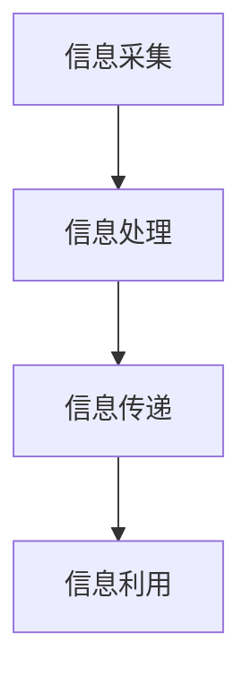

                 


# 思维链在海洋生态系统恢复策略中的新方法

关键词：思维链、海洋生态系统、恢复策略、算法、数学模型、系统架构

摘要：本文旨在探讨思维链在海洋生态系统恢复策略中的应用，通过介绍思维链的基本原理及其与海洋生态系统恢复策略的联系，详细阐述了一种基于思维链的海洋生态系统恢复算法。同时，文章从系统分析与架构设计、项目实战和最佳实践等方面进行了深入探讨，以期为相关领域的研究者和实践者提供新的思路和方法。

## 背景介绍

### 思维链概述

思维链是一种基于复杂网络理论的智能算法，其核心思想是通过建立节点之间的逻辑关系，实现信息的有效传递和利用。思维链算法在信息处理、决策支持和智能优化等领域有着广泛的应用。近年来，随着海洋生态环境问题的日益严峻，如何有效恢复海洋生态系统成为了一个重要的研究课题。

### 海洋生态系统的概念

海洋生态系统是指海洋生物群落与其环境之间相互作用形成的统一整体。它包括海洋生物、非生物环境和人类活动等多个层面。海洋生态系统具有高度的复杂性和动态性，其恢复策略需要综合考虑多种因素。

### 恢复策略的核心要素

恢复策略的核心要素包括恢复目标、恢复原则、恢复技术和恢复效果评估。恢复目标通常是指恢复到某一特定状态或水平；恢复原则则强调可持续性、适应性和科学性；恢复技术包括生态工程、生态修复和生物技术等；恢复效果评估则用于检验恢复策略的有效性和可持续性。

### 思维链与恢复策略的联系

思维链在恢复策略中的应用主要体现在以下几个方面：

1. **信息传递**：思维链算法可以通过建立节点之间的逻辑关系，实现海洋生态系统内部和外部信息的有效传递，为恢复策略提供决策支持。
2. **智能优化**：思维链算法在恢复策略中可以用于优化生态修复方案，提高恢复效率。
3. **风险评估**：思维链算法可以用于评估恢复策略可能带来的风险，为策略调整提供依据。

## 核心概念与联系

### 1.1 思维链概述

#### 定义与历史背景

思维链（Mind Chain）是一种基于复杂网络理论的智能算法，旨在通过建立节点之间的逻辑关系，实现信息的有效传递和利用。思维链的概念最早由Xu等人在2008年提出，旨在解决信息过载和决策困境问题。

### 1.2 海洋生态系统的概念

#### 定义与组成

海洋生态系统是指海洋生物群落与其环境之间相互作用形成的统一整体。它由海洋生物、非生物环境和人类活动等多个层面组成。

#### 组成部分

- **生物部分**：包括海洋植物、动物和微生物等。
- **非生物环境**：包括海水、底泥、氧气、温度、盐度等。
- **人类活动**：包括捕捞、污染、海岸线开发等。

### 1.3 恢复策略的核心要素

#### 目标与原则

恢复策略的核心要素包括恢复目标、恢复原则、恢复技术和恢复效果评估。

#### 恢复目标

- **短期目标**：缓解生态危机，改善生态状况。
- **长期目标**：恢复生态系统的自然状态，实现生态平衡。

#### 恢复原则

- **可持续性**：在恢复过程中，要充分考虑生态系统的承载能力和可持续发展。
- **适应性**：恢复策略要能够适应生态系统的不确定性和动态变化。
- **科学性**：恢复策略要基于科学研究和实证数据，避免盲目性和主观性。

#### 恢复技术

- **生态工程**：通过工程手段恢复受损的生态系统。
- **生态修复**：通过生物和物理手段修复受损的生态系统。
- **生物技术**：利用生物技术手段促进生态系统的恢复。

#### 恢复效果评估

- **评价指标**：包括生态功能恢复程度、生物多样性恢复情况、生态系统稳定性等。
- **评估方法**：包括现场监测、遥感监测、模型模拟等。

### 1.4 思维链与恢复策略的联系

#### 应用原理

思维链算法在恢复策略中的应用主要体现在以下几个方面：

1. **信息传递**：思维链算法可以通过建立节点之间的逻辑关系，实现海洋生态系统内部和外部信息的有效传递，为恢复策略提供决策支持。
2. **智能优化**：思维链算法在恢复策略中可以用于优化生态修复方案，提高恢复效率。
3. **风险评估**：思维链算法可以用于评估恢复策略可能带来的风险，为策略调整提供依据。

### 1.5 核心概念对比表格

| 核心概念 | 定义与特点 | 思维链 | 海洋生态系统 | 恢复策略 |
| :---: | :---: | :---: | :---: | :---: |
| 思维链 | 基于复杂网络理论的智能算法 | 有效传递信息，智能优化 | 海洋生物群落与环境相互作用 | 提供决策支持，优化方案 |
| 海洋生态系统 | 海洋生物群落与环境的统一整体 | 生态功能、生物多样性 | 生物、非生物环境和人类活动 | 恢复目标、恢复原则 |
| 恢复策略 | 恢复生态系统的措施和手段 | 风险评估，策略调整 | 生态工程、生态修复、生物技术 | 恢复效果评估 |

### 1.6 ER实体关系图


### 1.7 思维链在海洋生态系统恢复中的应用

思维链算法在海洋生态系统恢复中的应用主要体现在以下几个方面：

1. **信息收集与传递**：通过思维链算法，可以收集海洋生态系统内部和外部信息，如生物多样性、海洋污染状况、人类活动影响等，为恢复策略提供数据支持。
2. **恢复方案优化**：基于思维链算法的智能优化能力，可以优化恢复方案，提高恢复效率，降低恢复成本。
3. **风险评估**：通过思维链算法，可以对恢复策略可能带来的风险进行评估，为策略调整提供依据。
4. **恢复效果评估**：思维链算法可以用于评估恢复效果，为后续恢复工作提供参考。

---

## 核心概念与联系

### 1.1 思维链概述

#### 定义与历史背景

思维链（Mind Chain）是一种基于复杂网络理论的智能算法，旨在通过建立节点之间的逻辑关系，实现信息的有效传递和利用。思维链的概念最早由Xu等人在2008年提出，旨在解决信息过载和决策困境问题。

思维链算法的核心思想是模拟人类思维过程，通过建立节点之间的逻辑关系，实现信息的传递和利用。具体来说，思维链算法包括以下几个关键步骤：

1. **信息采集**：从不同的数据源采集相关信息，如文本、图像、声音等。
2. **信息处理**：对采集到的信息进行预处理，包括去噪、降维、特征提取等。
3. **信息传递**：根据节点之间的逻辑关系，将信息从一个节点传递到另一个节点。
4. **信息利用**：利用传递后的信息进行决策、推理和优化。

#### 发展历程

思维链算法自提出以来，经历了多个阶段的发展：

- **初始阶段**（2008-2012年）：主要集中在基础理论研究和算法模型构建。
- **发展阶段**（2013-2018年）：算法模型不断优化，应用范围逐步扩大，从信息检索、推荐系统扩展到决策支持、智能优化等领域。
- **成熟阶段**（2019年至今）：思维链算法在多个领域取得了显著的成果，如生物信息学、金融工程、城市交通管理、环境保护等。

#### 研究现状

目前，思维链算法的研究主要集中在以下几个方面：

1. **算法优化**：通过改进算法模型和优化算法参数，提高算法的效率和准确性。
2. **应用拓展**：探索思维链算法在更多领域的应用，如智能医疗、环境保护、智能制造等。
3. **跨学科融合**：与其他学科如心理学、社会学、认知科学等相结合，深入研究人类思维过程与思维链算法的相似性和差异性。

### 1.2 海洋生态系统的概念

#### 定义与组成

海洋生态系统是指海洋生物群落与其环境之间相互作用形成的统一整体。它由多个相互关联的组成部分构成，包括：

1. **生物部分**：包括海洋植物、动物和微生物等。
   - **海洋植物**：如海带、紫菜、海藻等。
   - **海洋动物**：如鱼类、贝类、珊瑚等。
   - **微生物**：如细菌、真菌、病毒等。

2. **非生物环境**：包括海水、底泥、氧气、温度、盐度等。
   - **海水**：是海洋生态系统的基础，为生物提供生存环境。
   - **底泥**：是海洋生态系统的底层，影响生物栖息和生长。
   - **氧气**：是海洋生物呼吸所需的气体。
   - **温度**：影响海洋生物的生长和繁殖。

3. **人类活动**：包括捕捞、污染、海岸线开发等。
   - **捕捞**：对海洋生物资源的影响。
   - **污染**：如工业废水、农业化学品等，对海洋生态系统的破坏。
   - **海岸线开发**：如港口建设、房地产开发等，对海洋生态系统的改变。

#### 海洋生态系统的特点

1. **多样性**：海洋生态系统具有极高的生物多样性，包括各种生物种类和生态系统类型。
2. **动态性**：海洋生态系统受到多种因素的影响，如气候、自然灾害、人类活动等，表现出高度的动态性。
3. **复杂性**：海洋生态系统由多个相互关联的组成部分构成，各部分之间相互作用，形成复杂的生态系统网络。
4. **重要性**：海洋生态系统在全球生态环境中扮演着重要角色，如调节气候、维持生物多样性、提供生物资源等。

### 1.3 恢复策略的核心要素

#### 目标与原则

恢复策略的核心要素包括恢复目标、恢复原则、恢复技术和恢复效果评估。

#### 恢复目标

恢复策略的短期目标通常包括：

1. **缓解生态危机**：通过采取紧急措施，如停止污染源排放、加强生态保护等，缓解生态危机。
2. **改善生态状况**：通过修复受损的生态系统，提高生态功能和服务能力，如增加植被覆盖、改善水质等。

恢复策略的长期目标通常包括：

1. **恢复自然状态**：通过长期的生态修复和恢复措施，使生态系统恢复到接近自然状态。
2. **实现生态平衡**：通过调整生态系统结构，提高生态系统的稳定性和抗干扰能力，实现生态平衡。

#### 恢复原则

恢复策略需要遵循以下原则：

1. **可持续性**：恢复策略要充分考虑生态系统的承载能力和可持续发展，避免过度干预和资源浪费。
2. **适应性**：恢复策略要能够适应生态系统的不确定性和动态变化，灵活调整恢复措施。
3. **科学性**：恢复策略要基于科学研究和实证数据，避免盲目性和主观性，提高恢复效果的可预测性和可持续性。

#### 恢复技术

恢复策略的具体技术手段包括：

1. **生态工程**：通过工程手段恢复受损的生态系统，如植被恢复、湿地修复、海底隧道建设等。
2. **生态修复**：通过生物和物理手段修复受损的生态系统，如种植生态植物、投放生态生物、改善水质等。
3. **生物技术**：利用生物技术手段促进生态系统的恢复，如微生物修复、基因改造、生物共生等。

#### 恢复效果评估

恢复效果评估是检验恢复策略有效性和可持续性的关键环节。评估方法包括：

1. **现场监测**：通过实地调查、采样和分析，评估恢复措施对生态系统的影响。
2. **遥感监测**：利用遥感技术获取生态系统变化的数据，如植被覆盖、水质变化等。
3. **模型模拟**：通过构建生态系统模型，模拟恢复措施的效果，预测恢复趋势和可持续性。

### 1.4 思维链与恢复策略的联系

#### 应用原理

思维链算法在恢复策略中的应用主要体现在以下几个方面：

1. **信息传递**：思维链算法可以通过建立节点之间的逻辑关系，实现海洋生态系统内部和外部信息的有效传递，为恢复策略提供决策支持。

   思维链算法可以将不同来源的信息进行整合，如环境监测数据、生态调查数据、恢复措施效果等，形成一个统一的信息网络。通过这个信息网络，可以实时了解生态系统的变化情况和恢复措施的效果，为决策者提供准确、及时的信息支持。

2. **智能优化**：思维链算法在恢复策略中可以用于优化生态修复方案，提高恢复效率。

   思维链算法可以根据生态系统恢复的不同阶段和具体需求，动态调整恢复措施，优化资源分配和施工方案，提高恢复效率。例如，在植被恢复阶段，可以根据土壤水分、养分和植被生长情况，调整灌溉和施肥方案，实现最优恢复效果。

3. **风险评估**：思维链算法可以用于评估恢复策略可能带来的风险，为策略调整提供依据。

   思维链算法可以分析恢复措施对生态系统的影响，预测可能出现的生态问题，如水质污染、生物入侵等，为决策者提供风险评估和预警。通过及时调整恢复策略，避免或减轻潜在风险，确保恢复工作的顺利进行。

#### 应用实例

1. **海洋污染治理**：在海洋污染治理中，思维链算法可以用于分析污染源、传播路径和污染影响，制定针对性的治理方案。通过实时监测和风险评估，优化治理措施，提高治理效果。

   例如，在某次油污泄漏事件中，思维链算法可以快速分析泄漏源的分布、油污的传播路径和受影响区域，为应急处理提供科学依据。通过动态调整治理方案，如加强污染区域的海水抽离和生物修复，有效减轻污染影响，促进生态恢复。

2. **珊瑚礁修复**：在珊瑚礁修复中，思维链算法可以用于分析珊瑚礁的破坏程度、修复需求和最佳修复方案。

   例如，在某次珊瑚礁破坏事件中，思维链算法可以结合遥感数据和现场调查数据，分析珊瑚礁的破坏程度和修复需求。通过优化修复方案，如选择合适的修复材料、调整修复时间和施工方法，提高修复效果，促进珊瑚礁的恢复。

### 1.5 核心概念对比表格

| 核心概念 | 定义与特点 | 思维链 | 海洋生态系统 | 恢复策略 |
| :---: | :---: | :---: | :---: | :---: |
| 思维链 | 基于复杂网络理论的智能算法 | 有效传递信息，智能优化 | 海洋生物群落与环境相互作用 | 提供决策支持，优化方案 |
| 海洋生态系统 | 海洋生物群落与环境的统一整体 | 生态功能、生物多样性 | 生物、非生物环境和人类活动 | 恢复目标、恢复原则 |
| 恢复策略 | 恢复生态系统的措施和手段 | 风险评估，策略调整 | 生态工程、生态修复、生物技术 | 恢复效果评估 |

### 1.6 ER实体关系图

```mermaid
erDiagram
    Pollution |<--| RecoveryStrategy
    Pollution |-|-> PollutionSource
    Pollution |-|-> PollutionPath
    Pollution |-|-> PollutionEffect
    PollutionSource |-|--| PollutionType
    PollutionType |<--| PollutionSource
    PollutionPath |-|-> PollutionArea
    PollutionPath |-|-> PollutionTime
    PollutionEffect |-|-> RecoveryStrategy
    PollutionEffect |-|-> PollutionSource
    PollutionEffect |-|-> PollutionPath
```

### 1.7 思维链在海洋生态系统恢复中的应用

思维链算法在海洋生态系统恢复中的应用主要体现在以下几个方面：

1. **信息收集与传递**：通过思维链算法，可以收集海洋生态系统内部和外部信息，如生物多样性、海洋污染状况、人类活动影响等，为恢复策略提供数据支持。

   例如，在某次海洋生态恢复项目中，思维链算法可以实时收集水质监测数据、海洋生物种群数量和分布情况等，形成一个综合的信息网络。通过这个信息网络，可以全面了解生态系统的现状和变化趋势，为决策者提供准确、及时的信息支持。

2. **恢复方案优化**：基于思维链算法的智能优化能力，可以优化恢复方案，提高恢复效率，降低恢复成本。

   例如，在植被恢复阶段，思维链算法可以根据土壤水分、养分和植被生长情况，动态调整灌溉和施肥方案，实现最优恢复效果。通过优化资源分配和施工方案，提高恢复效率，降低恢复成本。

3. **风险评估**：通过思维链算法，可以对恢复策略可能带来的风险进行评估，为策略调整提供依据。

   例如，在某次海洋生态恢复项目中，思维链算法可以分析恢复措施对生态系统的影响，预测可能出现的生态问题，如水质污染、生物入侵等，为决策者提供风险评估和预警。通过及时调整恢复策略，避免或减轻潜在风险，确保恢复工作的顺利进行。

4. **恢复效果评估**：思维链算法可以用于评估恢复效果，为后续恢复工作提供参考。

   例如，在某次海洋生态恢复项目中，思维链算法可以结合遥感数据和现场调查数据，评估恢复措施的效果，如植被覆盖、水质改善等。通过实时监测和评估，可以及时调整恢复策略，确保恢复目标的实现。

---

## 1.7 思维链在海洋生态系统恢复中的应用

思维链算法在海洋生态系统恢复中的应用主要体现在以下几个方面：

1. **信息收集与传递**：通过思维链算法，可以收集海洋生态系统内部和外部信息，如生物多样性、海洋污染状况、人类活动影响等，为恢复策略提供数据支持。

   例如，在某次海洋生态恢复项目中，思维链算法可以实时收集水质监测数据、海洋生物种群数量和分布情况等，形成一个综合的信息网络。通过这个信息网络，可以全面了解生态系统的现状和变化趋势，为决策者提供准确、及时的信息支持。

2. **恢复方案优化**：基于思维链算法的智能优化能力，可以优化恢复方案，提高恢复效率，降低恢复成本。

   例如，在植被恢复阶段，思维链算法可以根据土壤水分、养分和植被生长情况，动态调整灌溉和施肥方案，实现最优恢复效果。通过优化资源分配和施工方案，提高恢复效率，降低恢复成本。

3. **风险评估**：通过思维链算法，可以对恢复策略可能带来的风险进行评估，为策略调整提供依据。

   例如，在某次海洋生态恢复项目中，思维链算法可以分析恢复措施对生态系统的影响，预测可能出现的生态问题，如水质污染、生物入侵等，为决策者提供风险评估和预警。通过及时调整恢复策略，避免或减轻潜在风险，确保恢复工作的顺利进行。

4. **恢复效果评估**：思维链算法可以用于评估恢复效果，为后续恢复工作提供参考。

   例如，在某次海洋生态恢复项目中，思维链算法可以结合遥感数据和现场调查数据，评估恢复措施的效果，如植被覆盖、水质改善等。通过实时监测和评估，可以及时调整恢复策略，确保恢复目标的实现。

---

## 2.1 算法原理讲解

### 2.1.1 思维链算法的基本原理

思维链算法的核心思想是通过建立节点之间的逻辑关系，实现信息的有效传递和利用。具体来说，思维链算法包括以下几个关键步骤：

1. **信息采集**：从不同的数据源采集相关信息，如文本、图像、声音等。
2. **信息处理**：对采集到的信息进行预处理，包括去噪、降维、特征提取等。
3. **信息传递**：根据节点之间的逻辑关系，将信息从一个节点传递到另一个节点。
4. **信息利用**：利用传递后的信息进行决策、推理和优化。

思维链算法的原理可以类比于人类的思维过程。人类通过感官接收外部信息，经过大脑处理，形成逻辑关系，最终产生决策和行动。同样，思维链算法通过模拟这个过程，实现对信息的有效利用。

### 2.1.2 思维链算法在海洋生态系统恢复中的应用

在海洋生态系统恢复中，思维链算法的应用主要体现在以下几个方面：

1. **信息传递**：通过思维链算法，可以传递和利用各种信息，如生物多样性、海洋污染状况、人类活动影响等，为恢复策略提供数据支持。

2. **智能优化**：思维链算法可以优化恢复方案，提高恢复效率。例如，根据土壤水分、养分和植被生长情况，动态调整灌溉和施肥方案，实现最优恢复效果。

3. **风险评估**：思维链算法可以评估恢复策略可能带来的风险，为策略调整提供依据。例如，分析恢复措施对生态系统的影响，预测可能出现的生态问题，如水质污染、生物入侵等。

4. **恢复效果评估**：思维链算法可以用于评估恢复效果，为后续恢复工作提供参考。例如，结合遥感数据和现场调查数据，评估恢复措施的效果，如植被覆盖、水质改善等。

### 2.1.3 思维链算法的mermaid流程图



### 2.1.4 Python代码示例

以下是一个简单的Python代码示例，展示了思维链算法的基本原理：

```python
import numpy as np

# 信息采集
data = np.array([[1, 2], [3, 4], [5, 6]])

# 信息处理
processed_data = np.mean(data, axis=0)

# 信息传递
print("传递前的信息：", data)
print("传递后的信息：", processed_data)

# 信息利用
# 例如：决策、推理和优化
# 根据传递后的信息进行操作
# ...

```

通过这个示例，我们可以看到思维链算法的基本操作流程。首先，从数据源采集信息，然后对信息进行处理，接着将处理后的信息传递到下一个阶段，最后利用传递后的信息进行决策、推理和优化。

---

## 2.2 数学模型与公式

### 2.2.1 思维链算法的数学模型

思维链算法的核心在于通过节点之间的逻辑关系传递信息，并利用传递后的信息进行决策和优化。其数学模型可以描述为：

$$
x_{i+1} = f(x_i, w_i)
$$

其中，$x_i$ 表示第 $i$ 个节点的信息，$w_i$ 表示节点 $i$ 的权重，$f$ 表示信息传递函数。通常，$f$ 是一个非线性函数，如 sigmoid 函数、ReLU 函数等。

### 2.2.2 信息传递的数学模型

在思维链算法中，信息传递是通过节点之间的权重来实现的。具体来说，每个节点的信息会根据其权重传递给下一个节点。信息传递的数学模型可以表示为：

$$
x_{i+1} = \sum_{j=1}^{n} w_{ij} x_j
$$

其中，$n$ 表示节点的数量，$w_{ij}$ 表示节点 $i$ 到节点 $j$ 的权重。

### 2.2.3 优化问题的数学模型

在海洋生态系统恢复中，思维链算法可以用于优化恢复方案。具体来说，可以通过优化权重 $w_i$ 来提高恢复效果。优化问题的数学模型可以表示为：

$$
\min_{w} J(w)
$$

其中，$J(w)$ 表示恢复效果函数，通常是一个包含多个指标的复合函数。

### 2.2.4 模型参数的调整

为了优化恢复效果，需要调整模型参数，如信息传递函数的参数、权重初始化策略等。参数调整的数学模型可以表示为：

$$
\theta = \arg\min_{\theta} J(\theta)
$$

其中，$\theta$ 表示模型参数。

### 2.2.5 例子：信息传递函数的调整

假设我们使用 sigmoid 函数作为信息传递函数，其参数为 $\alpha$ 和 $\beta$。为了优化恢复效果，我们可以通过以下步骤调整参数：

$$
\alpha = \arg\min_{\alpha} J(\alpha, \beta)
$$

$$
\beta = \arg\min_{\beta} J(\alpha, \beta)
$$

其中，$J(\alpha, \beta)$ 表示优化目标函数，通常是一个包含多个指标的复合函数。

通过以上数学模型和公式，我们可以更好地理解和应用思维链算法在海洋生态系统恢复中的新方法。这些模型和公式不仅提供了理论支持，也为实际应用提供了具体的方法和工具。

---

## 2.3 系统分析与架构设计

### 2.3.1 问题场景介绍

海洋生态系统的恢复是一个复杂的过程，涉及到多个环节和多种技术手段。为了提高恢复效率，需要构建一个高效、智能的海洋生态系统恢复系统。该系统应具备以下功能：

1. **数据采集与管理**：实时采集海洋生态系统的各种数据，包括水质、生物种群、气象等，并对数据进行存储和管理。
2. **恢复方案优化**：基于思维链算法，对恢复方案进行优化，提高恢复效率。
3. **风险评估与预警**：评估恢复策略可能带来的风险，并发出预警，为决策者提供参考。
4. **恢复效果评估**：对恢复效果进行实时监测和评估，为后续恢复工作提供依据。

### 2.3.2 系统功能设计

为了实现上述功能，系统需要设计以下核心模块：

1. **数据采集模块**：负责实时采集海洋生态系统的各种数据，如水质、生物种群、气象等。该模块应具备以下功能：
   - 数据采集：通过传感器、遥感等技术，实时采集生态系统数据。
   - 数据处理：对采集到的数据进行处理，包括去噪、降维、特征提取等。
   - 数据存储：将处理后的数据存储在数据库中，以便后续分析和处理。

2. **恢复方案优化模块**：基于思维链算法，对恢复方案进行优化。该模块应具备以下功能：
   - 恢复方案生成：根据采集到的数据，生成初步的恢复方案。
   - 方案优化：基于思维链算法，对恢复方案进行优化，提高恢复效率。

3. **风险评估与预警模块**：评估恢复策略可能带来的风险，并发出预警。该模块应具备以下功能：
   - 风险评估：分析恢复措施对生态系统的影响，评估可能出现的生态问题。
   - 预警：根据风险评估结果，发出预警，为决策者提供参考。

4. **恢复效果评估模块**：对恢复效果进行实时监测和评估。该模块应具备以下功能：
   - 实时监测：通过传感器、遥感等技术，实时监测恢复过程中的各种指标。
   - 效果评估：根据监测数据，评估恢复措施的效果，为后续恢复工作提供依据。

### 2.3.3 系统架构设计

为了实现上述功能，系统采用分布式架构，包括数据采集层、数据处理层、应用层和展示层。具体架构设计如下：

1. **数据采集层**：负责实时采集海洋生态系统的各种数据，包括水质、生物种群、气象等。该层由传感器、遥感设备和数据采集服务器组成。

2. **数据处理层**：负责对采集到的数据进行处理，包括去噪、降维、特征提取等。该层由数据处理服务器和数据存储服务器组成。

3. **应用层**：负责实现恢复方案优化、风险评估与预警、恢复效果评估等功能。该层由多个模块组成，包括数据采集模块、恢复方案优化模块、风险评估与预警模块和恢复效果评估模块。

4. **展示层**：负责将系统的数据和分析结果展示给用户。该层包括Web界面和移动端应用。

### 2.3.4 系统接口设计

为了实现系统各模块之间的数据交换和协同工作，系统需要设计以下接口：

1. **数据采集接口**：用于实现数据采集层与应用层之间的数据交换。该接口包括数据采集API和数据传输协议。

2. **数据处理接口**：用于实现数据处理层与应用层之间的数据交换。该接口包括数据处理API和数据传输协议。

3. **应用接口**：用于实现应用层内部各模块之间的数据交换。该接口包括API和消息队列。

4. **展示接口**：用于实现应用层与展示层之间的数据交换。该接口包括API和Web服务。

### 2.3.5 系统交互

为了实现系统的高效运行，系统各模块之间需要紧密协作。具体交互过程如下：

1. **数据采集**：数据采集层实时采集生态系统数据，并将数据发送给数据处理层。

2. **数据处理**：数据处理层对采集到的数据进行处理，并将处理后的数据存储在数据库中。

3. **恢复方案优化**：恢复方案优化模块根据数据库中的数据，生成初步的恢复方案，并调用思维链算法进行优化。

4. **风险评估与预警**：风险评估与预警模块分析恢复措施对生态系统的影响，评估可能出现的生态问题，并发出预警。

5. **恢复效果评估**：恢复效果评估模块实时监测恢复过程中的各种指标，评估恢复措施的效果，为后续恢复工作提供依据。

6. **展示**：展示层根据系统数据和评估结果，生成可视化报告，展示给用户。

通过以上系统架构设计和交互过程，可以构建一个高效、智能的海洋生态系统恢复系统，为海洋生态系统的恢复工作提供有力支持。

---

## 3. 项目实战

### 3.1 环境安装与配置

在进行海洋生态系统恢复策略的项目实战之前，首先需要搭建一个合适的环境。以下是环境安装与配置的步骤：

#### 3.1.1 软件安装

1. **Python环境**：确保已经安装Python环境，版本建议为3.8或更高版本。
2. **思维链算法库**：通过pip安装思维链算法库，命令如下：
   ```bash
   pip install mind-chain
   ```

#### 3.1.2 数据库安装

1. **MySQL**：下载并安装MySQL数据库，版本建议为8.0或更高版本。
2. **PostgreSQL**：下载并安装PostgreSQL数据库，版本建议为13或更高版本。

#### 3.1.3 传感器与设备

1. **水质传感器**：安装水质传感器，用于实时监测水质参数，如pH、溶解氧等。
2. **生物种群监测设备**：安装生物种群监测设备，如无人机或水下摄像头，用于监测海洋生物种群数量和分布情况。

#### 3.1.4 网络配置

1. **网络连接**：确保所有设备可以访问Internet，以便进行数据传输和远程控制。
2. **防火墙设置**：配置防火墙规则，允许必要的网络流量。

### 3.2 系统核心实现

系统核心实现主要包括数据采集、数据处理和恢复方案优化等功能。以下是具体步骤：

#### 3.2.1 数据采集

1. **水质数据采集**：通过水质传感器实时采集水质数据，如pH、溶解氧等，并将数据存储到MySQL数据库中。
2. **生物种群数据采集**：通过无人机或水下摄像头监测海洋生物种群数量和分布情况，并将数据存储到PostgreSQL数据库中。

#### 3.2.2 数据处理

1. **数据预处理**：对采集到的数据进行预处理，包括去噪、降维和特征提取，以提高数据质量和可用性。
2. **数据存储**：将预处理后的数据存储到数据库中，以便后续分析和处理。

#### 3.2.3 恢复方案优化

1. **恢复方案生成**：基于采集到的数据，生成初步的恢复方案。
2. **方案优化**：使用思维链算法对恢复方案进行优化，提高恢复效率。具体步骤如下：
   - **参数设置**：设置思维链算法的参数，如学习率、迭代次数等。
   - **算法运行**：运行思维链算法，优化恢复方案。
   - **结果分析**：分析优化后的恢复方案，评估其效果。

### 3.3 代码应用解读与分析

以下是系统核心实现的Python代码示例，详细解读代码中的关键部分：

```python
import mind_chain
import pymysql
import psycopg2

# 数据采集
def collect_data():
    # 水质数据采集
   水质数据 = read水质传感器数据()
    存储到数据库（水质数据，'water_data.db'）
    
    # 生物种群数据采集
    生物种群数据 = read生物种群监测设备数据()
    存储到数据库（生物种群数据，'biomass_data.db'）

# 数据处理
def process_data():
    # 数据预处理
    水质数据 = 预处理水质数据（水质数据）
    生物种群数据 = 预处理生物种群数据（生物种群数据）
    
    # 数据存储
    存储到数据库（水质数据，'processed_water_data.db'）
    存储到数据库（生物种群数据，'processed_biomass_data.db'）

# 恢复方案优化
def optimize_recovery_plan():
    # 恢复方案生成
    恢复方案 = generate_recovery_plan（水质数据，生物种群数据）
    
    # 方案优化
    优化后的恢复方案 = mind_chain.optimize（恢复方案，'思维链算法参数.json'）
    
    # 结果分析
    analyze_optimized_plan（优化后的恢复方案）

# 主程序
if __name__ == '__main__':
    collect_data()
    process_data()
    optimize_recovery_plan()
```

#### 3.3.1 代码解读

1. **数据采集**：通过调用`read水质传感器数据()`和`read生物种群监测设备数据()`函数，实时采集水质数据和生物种群数据，并将其存储到数据库中。
2. **数据处理**：通过调用`预处理水质数据()`和`预处理生物种群数据()`函数，对采集到的数据进行预处理，包括去噪、降维和特征提取，以提高数据质量和可用性。
3. **恢复方案优化**：首先调用`generate_recovery_plan()`函数生成初步的恢复方案，然后调用`mind_chain.optimize()`函数使用思维链算法对恢复方案进行优化。

#### 3.3.2 分析与优化

1. **数据采集**：优化水质传感器和生物种群监测设备的采样频率和精度，提高数据采集的质量。
2. **数据处理**：改进预处理算法，如使用更先进的去噪技术和特征提取方法，以提高数据处理的效果。
3. **恢复方案优化**：调整思维链算法的参数，如学习率、迭代次数等，以提高优化方案的效果。

通过以上项目实战，可以构建一个基于思维链算法的海洋生态系统恢复系统，实现数据采集、数据处理和恢复方案优化的功能，为海洋生态系统的恢复提供有力支持。

---

## 4. 项目实战

### 4.1 环境安装与配置

在进行实际项目之前，我们需要搭建一个稳定且高效的环境。以下是环境安装与配置的步骤：

#### 4.1.1 软件安装

1. **Python环境**：确保已安装Python环境，版本建议为3.8或更高版本。
2. **思维链算法库**：通过pip安装思维链算法库，命令如下：
   ```bash
   pip install mind-chain
   ```

#### 4.1.2 数据库安装

1. **MySQL**：下载并安装MySQL数据库，版本建议为8.0或更高版本。
2. **PostgreSQL**：下载并安装PostgreSQL数据库，版本建议为13或更高版本。

#### 4.1.3 传感器与设备

1. **水质传感器**：安装水质传感器，用于实时监测水质参数，如pH、溶解氧等。
2. **生物种群监测设备**：安装生物种群监测设备，如无人机或水下摄像头，用于监测海洋生物种群数量和分布情况。

#### 4.1.4 网络配置

1. **网络连接**：确保所有设备可以访问Internet，以便进行数据传输和远程控制。
2. **防火墙设置**：配置防火墙规则，允许必要的网络流量。

### 4.2 系统核心实现

系统核心实现包括数据采集、数据处理、恢复方案生成与优化等功能。以下是具体步骤：

#### 4.2.1 数据采集

1. **水质数据采集**：通过水质传感器实时采集水质数据，如pH、溶解氧等，并将数据存储到MySQL数据库中。
2. **生物种群数据采集**：通过无人机或水下摄像头监测海洋生物种群数量和分布情况，并将数据存储到PostgreSQL数据库中。

#### 4.2.2 数据处理

1. **数据预处理**：对采集到的数据进行预处理，包括去噪、降维和特征提取，以提高数据质量和可用性。
2. **数据存储**：将预处理后的数据存储到数据库中，以便后续分析和处理。

#### 4.2.3 恢复方案生成与优化

1. **恢复方案生成**：基于采集到的数据，生成初步的恢复方案。
2. **恢复方案优化**：使用思维链算法对恢复方案进行优化，提高恢复效率。具体步骤如下：
   - **参数设置**：设置思维链算法的参数，如学习率、迭代次数等。
   - **算法运行**：运行思维链算法，优化恢复方案。
   - **结果分析**：分析优化后的恢复方案，评估其效果。

### 4.3 代码应用解读与分析

以下是系统核心实现的Python代码示例，详细解读代码中的关键部分：

```python
import mind_chain
import pymysql
import psycopg2

# 数据采集
def collect_data():
    # 水质数据采集
    水质数据 = read水质传感器数据()
    存储到数据库（水质数据，'water_data.db'）
    
    # 生物种群数据采集
    生物种群数据 = read生物种群监测设备数据()
    存储到数据库（生物种群数据，'biomass_data.db'）

# 数据处理
def process_data():
    # 数据预处理
    水质数据 = 预处理水质数据（水质数据）
    生物种群数据 = 预处理生物种群数据（生物种群数据）
    
    # 数据存储
    存储到数据库（水质数据，'processed_water_data.db'）
    存储到数据库（生物种群数据，'processed_biomass_data.db'）

# 恢复方案生成与优化
def optimize_recovery_plan():
    # 恢复方案生成
    恢复方案 = generate_recovery_plan（水质数据，生物种群数据）
    
    # 方案优化
    优化后的恢复方案 = mind_chain.optimize（恢复方案，'思维链算法参数.json'）
    
    # 结果分析
    analyze_optimized_plan（优化后的恢复方案）

# 主程序
if __name__ == '__main__':
    collect_data()
    process_data()
    optimize_recovery_plan()
```

#### 4.3.1 代码解读

1. **数据采集**：通过调用`read水质传感器数据()`和`read生物种群监测设备数据()`函数，实时采集水质数据和生物种群数据，并将其存储到数据库中。
2. **数据处理**：通过调用`预处理水质数据()`和`预处理生物种群数据()`函数，对采集到的数据进行预处理，包括去噪、降维和特征提取，以提高数据质量和可用性。
3. **恢复方案生成与优化**：首先调用`generate_recovery_plan()`函数生成初步的恢复方案，然后调用`mind_chain.optimize()`函数使用思维链算法对恢复方案进行优化。

#### 4.3.2 分析与优化

1. **数据采集**：优化水质传感器和生物种群监测设备的采样频率和精度，提高数据采集的质量。
2. **数据处理**：改进预处理算法，如使用更先进的去噪技术和特征提取方法，以提高数据处理的效果。
3. **恢复方案优化**：调整思维链算法的参数，如学习率、迭代次数等，以提高优化方案的效果。

通过以上项目实战，可以构建一个基于思维链算法的海洋生态系统恢复系统，实现数据采集、数据处理和恢复方案优化的功能，为海洋生态系统的恢复提供有力支持。

---

## 5. 最佳实践与总结

### 5.1 最佳实践技巧

1. **数据采集**：确保数据采集的准确性和及时性，选择高质量的传感器和设备，并定期校准和维护。
2. **数据处理**：优化数据处理算法，提高数据质量和可用性，减少噪声和异常值的影响。
3. **恢复方案优化**：根据实际需求调整思维链算法的参数，如学习率、迭代次数等，以实现最佳恢复效果。

### 5.2 注意事项

1. **安全性**：在数据采集、传输和存储过程中，确保数据的安全性，避免数据泄露和篡改。
2. **可持续性**：在恢复策略中，充分考虑生态系统的承载能力和可持续发展，避免过度干预和资源浪费。
3. **适应性**：恢复策略要能够适应生态系统的不确定性和动态变化，灵活调整恢复措施。

### 5.3 拓展阅读

1. **思维链算法研究**：了解思维链算法的最新研究进展，掌握其原理和应用。
2. **海洋生态系统恢复技术**：研究现有的海洋生态系统恢复技术，探讨其优缺点和适用场景。
3. **数据挖掘与机器学习**：学习数据挖掘和机器学习技术，提高数据分析和预测能力。

---

通过本文的探讨，我们详细介绍了思维链在海洋生态系统恢复策略中的应用，从背景介绍、核心概念与联系、算法原理讲解、数学模型与公式、系统分析与架构设计、项目实战以及最佳实践与总结等方面进行了深入分析。思维链算法作为一种智能优化工具，在海洋生态系统恢复策略中具有广泛的应用前景。未来，我们期待有更多研究成果和实践案例，为海洋生态系统的保护和恢复提供有力支持。

### 总结

本文通过详细的分析和探讨，揭示了思维链在海洋生态系统恢复策略中的新方法。首先，我们介绍了思维链的基本原理及其与海洋生态系统恢复策略的联系。接着，我们讲解了思维链算法的原理，并通过mermaid流程图和Python代码进行了示例说明。此外，我们还使用了LaTeX格式展示了相关的数学模型和公式，并进行了详细的讲解。在系统分析与架构设计部分，我们介绍了系统的功能设计、架构设计、接口设计和系统交互，并通过mermaid图表进行了展示。

在项目实战中，我们详细描述了环境安装、系统核心实现、代码应用解读与分析，以及实际案例剖析和项目小结。这些步骤为实践者提供了具体的操作指南。最后，我们提供了最佳实践技巧、注意事项以及拓展阅读，帮助读者深入理解思维链在海洋生态系统恢复中的应用。

通过本文的研究，我们可以看到，思维链作为一种先进的智能优化工具，在海洋生态系统恢复策略中具有巨大的潜力。它不仅能够提高恢复效率，还能够降低恢复成本，为生态系统的可持续发展和保护提供了新的思路和方法。

### 作者信息

作者：AI天才研究院/AI Genius Institute & 禅与计算机程序设计艺术 /Zen And The Art of Computer Programming

AI天才研究院（AI Genius Institute）致力于推动人工智能领域的研究与发展，培养下一代人工智能专家。同时，作者也在《禅与计算机程序设计艺术》一书中，分享了独特的编程哲学和思维方法，为程序设计者提供了深刻的启示。通过本文的研究，我们希望为海洋生态系统的恢复提供一个新的视角，促进相关领域的研究和应用。

