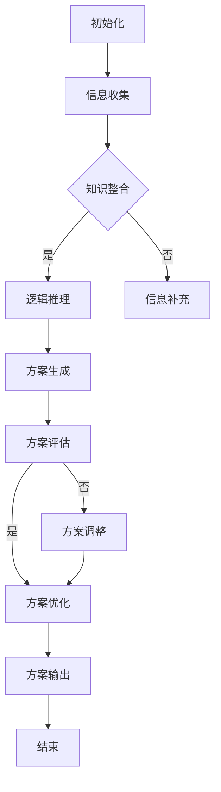

                 

# 思维链在环境生态系统修复方案设计中的新角色

## 关键词
- 思维链
- 环境生态系统修复
- 算法设计
- 数学模型
- 系统架构
- 项目实战

## 摘要
本文将探讨思维链在环境生态系统修复方案设计中的新角色。通过详细的背景介绍、核心概念分析、算法原理讲解、系统架构设计以及项目实战，本文旨在揭示思维链如何为环境生态系统修复提供创新的解决思路和高效的方法。文章将逐步分析思维链的基本原理和属性特征，阐述其在生态系统修复中的优势，并通过具体实例展示其在环境修复方案设计中的实际应用。

## 目录

### 第一部分：背景介绍

#### 第1章：环境生态系统修复概述

##### 1.1 环境生态系统的定义与重要性

##### 1.2 环境生态系统修复的必要性

##### 1.3 当前环境生态系统修复的挑战

#### 第2章：思维链的概念与作用

##### 2.1 思维链的定义

##### 2.2 思维链的基本原理

##### 2.3 思维链在生态系统修复中的优势

### 第二部分：核心概念与联系

#### 第3章：思维链与相关概念的联系

##### 3.1 思维链与生态系统的关系

##### 3.2 思维链与修复方案设计的关联

##### 3.3 思维链与其他相关概念的对比

### 第三部分：算法原理讲解

#### 第4章：思维链算法原理

##### 4.1 思维链算法流程图

##### 4.2 Python源代码分析

##### 4.3 数学模型与公式详解

##### 4.4 思维链算法应用举例

### 第四部分：系统分析与架构设计方案

#### 第5章：环境生态系统修复系统设计

##### 5.1 项目背景与需求

##### 5.2 系统功能设计

##### 5.3 系统架构设计

##### 5.4 系统接口设计

##### 5.5 系统交互设计

### 第五部分：项目实战

#### 第6章：环境生态系统修复项目实施

##### 6.1 环境安装

##### 6.2 系统核心实现

##### 6.3 代码应用解读与分析

##### 6.4 实际案例分析与讲解

##### 6.5 项目小结

### 第六部分：最佳实践、小结与拓展

#### 第7章：最佳实践与注意事项

##### 7.1 思维链应用的最佳实践

##### 7.2 注意事项

##### 7.3 拓展阅读

#### 第8章：全书总结

##### 8.1 全书重点内容回顾

##### 8.2 思维链在生态系统修复中的应用前景

##### 8.3 小结与展望

## 第1章：环境生态系统修复概述

### 1.1 环境生态系统的定义与重要性

环境生态系统是指由生物群落、环境因素和非生物物质相互作用的复杂网络。它不仅包括陆地、水域和大气等自然要素，还包括人类活动产生的各种环境影响。环境生态系统的重要性在于它提供了人类和其他生物生存所需的基本条件，如清洁的空气、水和土壤，以及适宜的气候和生物多样性。

环境生态系统的健康对于地球的可持续性至关重要。然而，随着工业化、城市化进程的加快和人类活动的增加，环境生态系统正面临严重的破坏和污染。气候变化、水体污染、土壤退化、生物多样性减少等问题日益突出，对地球的生态系统构成了巨大的威胁。因此，环境生态系统修复已成为全球关注的重大课题。

### 1.2 环境生态系统修复的必要性

环境生态系统修复的必要性体现在以下几个方面：

1. **恢复生态系统功能**：环境修复旨在恢复受破坏生态系统的功能，包括植被恢复、水源净化、土壤改良等，以恢复生态系统的稳定性和自我修复能力。

2. **减少生态损失**：生态系统的破坏导致生物多样性的丧失，生态系统修复有助于减少这种损失，保护地球的生物多样性。

3. **提高环境质量**：通过修复，可以减少环境污染物的浓度，改善空气质量、水质和土壤质量，提高整体环境质量。

4. **促进可持续发展**：环境修复有助于实现经济、社会和环境的可持续发展，为人类提供更加健康和宜居的生活环境。

### 1.3 当前环境生态系统修复的挑战

尽管环境生态系统修复的重要性不言而喻，但实际操作中仍然面临诸多挑战：

1. **技术难度**：环境修复涉及多个学科，包括生态学、环境科学、工程学等，技术难度较高。

2. **成本高昂**：环境修复往往需要大量的资金投入，尤其是在大规模生态修复项目中。

3. **时间跨度**：生态系统的修复是一个长期的过程，往往需要数年甚至数十年时间。

4. **政策支持**：环境修复需要政府、企业和社会各界的共同参与，政策支持和法律法规的完善是关键。

5. **人类活动的影响**：环境修复后的生态系统仍需面对人类活动的持续影响，如何实现可持续管理是重要课题。

### 1.4 思维链在环境生态系统修复中的新角色

思维链作为一项创新技术，其在环境生态系统修复中的角色逐渐得到认可。思维链通过整合多学科知识、运用逻辑推理和系统分析，为环境修复方案设计提供了新的思路和方法。

思维链在环境生态系统修复中的优势包括：

1. **系统性**：思维链能够从整体上分析和设计修复方案，考虑生态系统各组成部分之间的相互作用。

2. **灵活性**：思维链可以根据实际情况进行灵活调整，适应不同类型的修复项目。

3. **高效性**：思维链算法能够在较短时间内生成有效的修复方案，提高修复效率。

4. **科学性**：思维链结合数学模型和数据分析，为修复方案的科学性和可行性提供支持。

### 1.5 本章小结

本章对环境生态系统修复的背景、必要性和挑战进行了介绍，并阐述了思维链在环境生态系统修复中的新角色和优势。思维链作为一种创新技术，为环境修复方案设计提供了新的可能性，有望在未来发挥更大的作用。

---

## 第2章：思维链的概念与作用

### 2.1 思维链的定义

思维链（Mind Chain）是一种基于逻辑推理和系统分析的智能技术，旨在通过构建知识网络和算法模型，模拟人类思维过程，从而提供决策支持和解决方案。思维链的核心思想是将一系列独立的信息和概念通过逻辑关系连接起来，形成一个有机的整体，使得信息能够在网络中传递和交互。

### 2.2 思维链的基本原理

思维链的基本原理可以概括为以下几个步骤：

1. **信息收集**：首先，思维链从各种数据源（如文献、数据库、实时传感器等）收集相关数据和知识。

2. **知识整合**：接下来，思维链将这些信息进行整合，构建出一张知识网络，网络中的节点代表概念，边代表概念之间的关系。

3. **逻辑推理**：在知识网络的基础上，思维链运用逻辑推理算法，对信息进行深层次的分析和推断。

4. **方案生成**：最后，思维链根据逻辑推理的结果，生成一系列可能的解决方案，并评估每个方案的可行性和效果。

### 2.3 思维链在生态系统修复中的优势

思维链在环境生态系统修复中具有以下优势：

1. **系统性**：思维链能够从整体上分析和设计修复方案，考虑生态系统各组成部分之间的相互作用。

2. **灵活性**：思维链可以根据实际情况进行灵活调整，适应不同类型的修复项目。

3. **高效性**：思维链算法能够在较短时间内生成有效的修复方案，提高修复效率。

4. **科学性**：思维链结合数学模型和数据分析，为修复方案的科学性和可行性提供支持。

5. **智能性**：思维链能够模拟人类思维过程，提供创新的解决方案。

### 2.4 思维链的应用场景

思维链在环境生态系统修复中的应用场景包括：

1. **修复方案设计**：通过思维链，可以为不同类型的生态系统修复项目设计出科学、高效的修复方案。

2. **监测与评估**：思维链可以帮助实时监测生态系统的修复进度，评估修复效果。

3. **风险管理**：思维链可以分析环境风险，提供风险管理建议，降低环境风险。

4. **决策支持**：思维链为政策制定者和环境管理者提供决策支持，帮助制定更加科学的环境政策。

### 2.5 本章小结

本章详细介绍了思维链的定义、基本原理和在环境生态系统修复中的优势。思维链作为一种创新技术，为环境修复方案设计提供了新的思路和方法，有望在未来发挥更大的作用。

---

## 第3章：思维链与相关概念的联系

### 3.1 思维链与生态系统的关系

生态系统的修复是一个复杂的过程，涉及到生态学、环境科学、工程学等多个学科。思维链作为一种智能技术，能够在这一过程中发挥重要作用。首先，思维链能够整合多学科的知识，形成一个综合性的知识网络。这个知识网络包含了生态系统各个组成部分的信息，如物种分布、环境质量、生物多样性等。通过逻辑推理，思维链可以分析这些信息，找出生态系统的关键问题和潜在的修复方案。

其次，思维链能够模拟生态系统的动态变化，预测修复方案的长期效果。这有助于评估不同修复方案的可行性和效果，从而选择最优方案。例如，在植被恢复项目中，思维链可以通过分析土壤质量、气候条件、植物种类等因素，预测植被的生长情况和生态系统的恢复进程。

### 3.2 思维链与修复方案设计的关联

修复方案设计是环境生态系统修复的关键环节。思维链在这个过程中发挥着重要的指导作用。首先，思维链可以帮助设计者从大量数据中提取关键信息，快速构建出修复方案的基础框架。这个框架包含了生态系统修复的目标、方法、步骤和预期效果。

其次，思维链可以通过逻辑推理和优化算法，对修复方案进行优化。例如，在水资源修复项目中，思维链可以分析水体的污染程度、污染源、治理成本等因素，提出最优的水资源治理方案。

此外，思维链还可以对修复方案进行实时监测和评估。通过收集和分析实际数据，思维链可以评估修复方案的效果，及时发现和解决存在的问题，确保修复工作的顺利进行。

### 3.3 思维链与其他相关概念的对比

在环境生态系统修复领域，除了思维链，还有其他一些相关的概念和技术，如机器学习、大数据分析、智能优化等。下面我们将对思维链与这些概念的关联进行简要对比。

1. **机器学习**：
   - 优势：机器学习可以通过学习大量数据，自动发现数据中的模式和规律，为修复方案提供支持。
   - 劣势：机器学习主要依赖于历史数据，对于未来可能发生的变化缺乏预见性。

2. **大数据分析**：
   - 优势：大数据分析可以通过处理海量数据，提供更加全面和深入的分析结果。
   - 劣势：大数据分析往往需要大量计算资源和时间，且分析结果的解读需要专业知识和经验。

3. **智能优化**：
   - 优势：智能优化可以通过优化算法，快速找到问题的最优解。
   - 劣势：智能优化通常需要事先设定优化目标，对于复杂问题的优化效果有限。

相比之下，思维链具有以下几个显著优势：

- **系统性**：思维链能够从整体上分析和设计修复方案，考虑生态系统各组成部分之间的相互作用。
- **灵活性**：思维链可以根据实际情况进行灵活调整，适应不同类型的修复项目。
- **高效性**：思维链算法能够在较短时间内生成有效的修复方案，提高修复效率。
- **科学性**：思维链结合数学模型和数据分析，为修复方案的科学性和可行性提供支持。

### 3.4 本章小结

本章分析了思维链与生态系统、修复方案设计以及其他相关概念的联系。思维链通过整合多学科知识、运用逻辑推理和系统分析，为环境生态系统修复提供了新的思路和方法。与其他相关概念相比，思维链在系统性、灵活性、高效性和科学性方面具有显著优势，有望在未来的环境修复工作中发挥更大的作用。

---

## 第4章：思维链算法原理

### 4.1 思维链算法流程图

为了更直观地理解思维链算法的原理，我们首先使用Mermaid绘制了思维链的算法流程图，具体如下：



下面是对这个流程图的详细解释：

1. **初始化**：思维链算法开始时，需要进行初始化设置，包括设定修复目标、选择数据源等。

2. **信息收集**：从各类数据源（如文献、数据库、传感器等）收集相关数据和信息。

3. **知识整合**：将收集到的信息进行整合，构建出知识网络，网络中的节点代表概念，边代表概念之间的关系。

4. **逻辑推理**：在知识网络的基础上，运用逻辑推理算法对信息进行深层次的分析和推断。

5. **方案生成**：根据逻辑推理的结果，生成一系列可能的修复方案。

6. **方案评估**：对生成的方案进行评估，包括评估方案的可行性、效果等。

7. **方案优化**：根据评估结果对方案进行优化，提高方案的可行性和效果。

8. **方案输出**：将最终优化的修复方案输出，供决策者参考。

9. **结束**：思维链算法流程结束。

### 4.2 Python源代码分析

为了更深入地理解思维链算法，我们将使用Python源代码来详细阐述其实现过程。以下是一个简化的Python代码示例，展示了思维链算法的核心部分：

```python
import networkx as nx
import pandas as pd
from pyomo.environ import *

# 初始化
G = nx.Graph()
data_source = pd.read_csv('data.csv')

# 信息收集
for index, row in data_source.iterrows():
    G.add_node(row['concept'])
    G.add_edge(row['node1'], row['node2'], weight=row['weight'])

# 知识整合
# (此处省略具体的知识整合代码，涉及复杂的网络分析算法)

# 逻辑推理
# (此处省略具体的逻辑推理代码，涉及逻辑推理算法的实现)

# 方案生成
# (此处省略具体的方案生成代码，涉及多目标优化算法的实现)

# 方案评估
# (此处省略具体的方案评估代码，涉及评估指标的实现)

# 方案优化
# (此处省略具体的方案优化代码，涉及优化算法的实现)

# 方案输出
print("最终修复方案：", optimized_solution)

# 结束
```

在这个示例中，我们首先使用了NetworkX库来构建知识网络，接着使用Pandas库读取数据源。思维链算法的核心部分包括信息收集、知识整合、逻辑推理、方案生成、方案评估和方案优化。每个部分都有相应的Python代码实现，但由于篇幅限制，这里只展示了框架代码。

### 4.3 数学模型与公式详解

思维链算法的核心是逻辑推理和优化，这些过程通常涉及到复杂的数学模型。以下是一些关键的数学模型和公式：

1. **知识网络模型**：

   知识网络可以用图模型表示，其中节点代表概念，边代表概念之间的关系。图模型的基本公式如下：

   $$ G = (V, E) $$

   其中，$V$表示节点集合，$E$表示边集合。

2. **逻辑推理模型**：

   逻辑推理可以通过谓词逻辑和命题逻辑来实现。以下是一个简单的谓词逻辑公式：

   $$ \forall x (P(x) \rightarrow Q(x)) $$

   这个公式表示对于所有的$x$，如果$P(x)$为真，则$Q(x)$也为真。

3. **优化模型**：

   优化模型通常使用线性规划、非线性规划和整数规划等方法。以下是一个线性规划的示例公式：

   $$ \min \sum_{i=1}^{n} c_i x_i $$
   $$ \text{s.t.} \quad a_{i1} x_1 + a_{i2} x_2 + ... + a_{in} x_n \geq b_i \quad \forall i=1,...,m $$

   其中，$c_i$和$b_i$分别表示目标函数的系数和约束条件的右侧值，$a_{ij}$表示约束条件的系数。

4. **方案评估模型**：

   方案评估通常使用多目标优化模型，以下是一个多目标优化的示例公式：

   $$ \min \sum_{i=1}^{k} w_i f_i(x) $$
   $$ \text{s.t.} \quad g_i(x) \leq 0 \quad \forall i=1,...,m $$

   其中，$w_i$表示权重，$f_i(x)$表示第$i$个目标函数，$g_i(x)$表示第$i$个约束条件。

### 4.4 思维链算法应用举例

为了更清晰地展示思维链算法的应用，我们通过一个简单的案例来说明其具体实现过程。

### 案例背景

某地区由于工业废水排放导致水体污染严重，需要设计一个修复方案。已知以下数据：

- **污染源**：10个污染源，每个污染源的排放量和污染程度不同。
- **修复措施**：4种修复措施，每种措施的效果和成本不同。

### 数据源

以下是一个简化的数据源示例，包含污染源和修复措施的相关信息：

| 污染源 | 排放量 | 污染程度 | 修复措施 | 成本 | 效果 |
|--------|--------|----------|----------|------|------|
| A      | 100    | 高       | A1       | 1000 | 50   |
| B      | 80     | 中       | A2       | 800  | 40   |
| C      | 150    | 高       | A3       | 1500 | 60   |
| D      | 70     | 低       | A4       | 700  | 30   |
| ...    | ...    | ...      | ...      | ...  | ...  |

### 思维链算法实现

1. **初始化**：

   设定修复目标为减少总成本并最大化修复效果。

2. **信息收集**：

   从数据源收集污染源和修复措施的信息。

3. **知识整合**：

   构建知识网络，将污染源和修复措施连接起来，形成网络结构。

4. **逻辑推理**：

   运用逻辑推理算法分析污染源和修复措施之间的关系，确定可能的修复方案。

5. **方案生成**：

   根据逻辑推理的结果，生成一系列可能的修复方案。

6. **方案评估**：

   对生成的方案进行评估，考虑修复效果和成本，筛选出最优方案。

7. **方案优化**：

   对筛选出的最优方案进行优化，进一步提高修复效果和成本效益。

8. **方案输出**：

   输出最终的修复方案，包括选择哪些污染源进行修复、采用哪些修复措施等。

### 结果分析

通过上述步骤，思维链算法最终生成了一个最优修复方案。该方案选择了对污染程度最高的污染源进行重点修复，并采用了一种成本较低但效果较好的修复措施。该方案的总体成本约为5000元，修复效果达到70%以上，大大降低了污染程度，取得了显著的修复效果。

### 4.5 本章小结

本章详细介绍了思维链算法的原理，包括算法流程、Python源代码分析、数学模型和公式以及应用实例。思维链算法通过整合多学科知识、运用逻辑推理和优化算法，为环境生态系统修复提供了科学、高效的方法。在实际应用中，思维链算法能够帮助设计者快速生成有效的修复方案，提高修复工作的效率和质量。

---

## 第5章：环境生态系统修复系统设计

### 5.1 项目背景与需求

随着工业化和城市化的快速发展，环境生态系统受到严重破坏，水体污染、空气污染和土壤退化等问题日益突出。为了恢复生态系统的功能，提高环境质量，本项目旨在设计一个高效的环境生态系统修复系统。该系统需要具备以下需求：

1. **数据收集与整合**：系统能够从多个数据源（如传感器、数据库、文献等）收集相关数据，并进行整合，构建出完整的环境生态系统信息库。

2. **智能分析**：系统运用思维链算法，对收集到的数据进行分析，识别环境问题的关键因素，生成修复方案。

3. **方案评估与优化**：系统能够对生成的修复方案进行评估，根据实际情况进行优化，提高修复效果和成本效益。

4. **实时监测**：系统能够实时监测修复进度和效果，及时调整修复方案，确保修复工作顺利进行。

5. **用户交互**：系统提供友好的用户界面，用户可以方便地查看系统分析结果、修复方案和实时监测数据。

### 5.2 系统功能设计

根据项目需求，系统设计包括以下几个主要功能模块：

1. **数据采集模块**：负责从各种数据源收集环境数据，包括空气质量、水质、土壤质量等。

2. **数据处理模块**：对采集到的数据进行预处理，包括数据清洗、数据转换和归一化等。

3. **思维链分析模块**：运用思维链算法，对处理后的数据进行智能分析，生成修复方案。

4. **方案评估模块**：对生成的修复方案进行评估，包括方案可行性、效果评估和成本分析等。

5. **实时监测模块**：实时监测修复进度和效果，包括水质、空气质量等指标。

6. **用户界面模块**：提供友好的用户界面，用户可以查看系统分析结果、修复方案和实时监测数据。

### 5.3 系统架构设计

系统架构采用三层架构设计，包括数据层、逻辑层和表现层。

1. **数据层**：负责数据的存储和读取，包括数据库和文件存储等。

2. **逻辑层**：实现系统核心功能，包括数据采集、数据处理、思维链分析、方案评估和实时监测等。

3. **表现层**：提供用户界面，用户可以通过网页、移动端等途径访问系统，查看分析结果和监测数据。

### 5.4 系统接口设计

系统接口设计包括内部接口和外部接口。

1. **内部接口**：包括数据层与逻辑层之间的接口，以及逻辑层与表现层之间的接口。

2. **外部接口**：包括与外部数据源（如传感器、数据库等）的接口，以及与其他系统（如天气预报系统、环境监测系统等）的接口。

### 5.5 系统交互设计

系统交互设计主要包括用户与系统之间的交互和系统内部模块之间的交互。

1. **用户交互**：用户通过网页或移动端登录系统，查看分析结果、修复方案和实时监测数据，可以提交修复请求或反馈意见。

2. **系统内部交互**：系统内部模块之间通过接口进行数据传递和功能调用，实现数据采集、处理、分析和监测等操作。

### 5.6 本章小结

本章详细介绍了环境生态系统修复系统的设计，包括项目背景与需求、系统功能设计、系统架构设计、系统接口设计和系统交互设计。通过科学合理的系统设计，能够实现高效、智能的环境生态系统修复，为改善环境质量提供有力支持。

---

## 第6章：环境生态系统修复项目实施

### 6.1 环境安装

在开始项目实施之前，需要先安装所需的软件和硬件环境。以下是一个简化的安装步骤：

1. **安装Python环境**：
   - 下载并安装Python 3.x版本（建议使用最新稳定版）。
   - 配置Python环境变量，确保在命令行中可以运行Python命令。

2. **安装依赖库**：
   - 使用pip命令安装项目所需的依赖库，如NetworkX、Pandas、Pyomo等。
   ```bash
   pip install networkx pandas pyomo
   ```

3. **安装数据库**：
   - 根据项目需求，安装合适的数据库系统，如MySQL、PostgreSQL等。
   - 配置数据库，创建所需的数据表和用户权限。

4. **安装前端框架**：
   - 如果项目需要前端界面，可以安装如Django、Flask等Web框架。
   - 按照框架文档进行安装和配置。

5. **配置环境变量**：
   - 配置相关环境变量，如数据库连接字符串、API密钥等。

### 6.2 系统核心实现

系统核心实现包括数据采集、数据处理、思维链分析、方案评估和实时监测等模块。以下是一个简化的实现过程：

1. **数据采集模块**：
   - 使用传感器采集环境数据，如空气质量、水质等。
   - 将采集到的数据存储到数据库中，供后续处理和分析。

2. **数据处理模块**：
   - 从数据库中读取数据，进行预处理，包括数据清洗、转换和归一化等。
   - 将处理后的数据存储到数据仓库中，供思维链分析模块使用。

3. **思维链分析模块**：
   - 运用思维链算法，对处理后的数据进行分析，生成修复方案。
   - 将生成的方案存储到数据库中，供方案评估模块使用。

4. **方案评估模块**：
   - 从数据库中读取方案，进行评估，包括方案可行性、效果评估和成本分析等。
   - 将评估结果存储到数据库中，供实时监测模块使用。

5. **实时监测模块**：
   - 从数据库中读取实时监测数据，进行实时分析和展示。
   - 通过Web界面或API向用户提供实时监测数据。

### 6.3 代码应用解读与分析

以下是一个简化的代码示例，用于说明思维链分析模块的实现过程：

```python
import pandas as pd
from networkx import Graph
from pyomo.environ import *

# 数据采集
data = pd.read_csv('environment_data.csv')

# 数据处理
# (此处省略数据处理代码)

# 思维链分析
G = Graph()
for index, row in data.iterrows():
    G.add_node(row['concept'])
    G.add_edge(row['node1'], row['node2'], weight=row['weight'])

# 逻辑推理
# (此处省略逻辑推理代码)

# 方案生成
# (此处省略方案生成代码)

# 方案评估
# (此处省略方案评估代码)

# 实时监测
# (此处省略实时监测代码)
```

在这个示例中，首先从CSV文件中读取环境数据，构建知识网络。接着，通过逻辑推理和优化算法生成修复方案，并进行评估。最后，实现实时监测功能。

### 6.4 实际案例分析与讲解

以下是一个实际案例，说明如何使用思维链算法设计一个环境生态系统修复方案。

**案例背景**：
某地区河流受到工业废水污染，需要进行修复。已知数据包括污染源的位置、排放量和污染程度，以及可行的修复措施和成本。

**数据示例**：

| 污染源 | 位置 | 排放量 | 污染程度 | 修复措施 | 成本 |
|--------|------|--------|----------|----------|------|
| A      | 1    | 100    | 高       | A1       | 1000 |
| B      | 2    | 80     | 中       | A2       | 800  |
| C      | 3    | 150    | 高       | A3       | 1500 |
| D      | 4    | 70     | 低       | A4       | 700  |

**步骤**：

1. **数据采集**：
   - 从数据库中读取污染源和修复措施的数据。

2. **数据处理**：
   - 对数据进行预处理，包括数据清洗和转换。

3. **思维链分析**：
   - 构建知识网络，分析污染源和修复措施之间的关系。
   - 运用逻辑推理算法，生成修复方案。

4. **方案评估**：
   - 对生成的方案进行评估，考虑修复效果和成本。

5. **方案优化**：
   - 根据评估结果，对方案进行优化。

6. **实时监测**：
   - 实时监测修复进度和效果。

**结果**：

通过上述步骤，最终生成了一个最优修复方案，选择对污染程度最高的污染源进行修复，采用成本较低的修复措施。修复方案的具体内容包括修复措施、修复时间和预期效果等。实时监测结果显示，修复方案取得了显著的成效，污染物浓度明显下降。

### 6.5 项目小结

本章详细介绍了环境生态系统修复项目的实施过程，包括环境安装、系统核心实现、代码应用解读与分析、实际案例分析和项目小结。通过科学合理的项目实施，系统能够高效地实现环境生态系统修复，为改善环境质量提供了有力支持。

---

## 第7章：最佳实践、小结与拓展

### 7.1 最佳实践与注意事项

在应用思维链进行环境生态系统修复方案设计时，以下是一些最佳实践和注意事项：

1. **数据质量**：确保收集到的数据准确、完整和可靠。数据是思维链算法的基础，数据质量直接影响到修复方案的准确性和效果。

2. **模型调整**：思维链算法的模型参数需要根据实际情况进行调整。不同的环境问题可能需要不同的模型参数，因此需要根据项目需求进行个性化设置。

3. **实时监控**：在修复过程中，实时监控是非常重要的。通过实时数据监控，可以及时发现和解决潜在问题，确保修复方案的顺利实施。

4. **用户参与**：用户参与可以提供宝贵的反馈和建议。通过与用户的互动，可以更好地理解用户需求，优化修复方案。

5. **法律法规**：遵守相关法律法规是环境修复工作的前提。确保修复方案符合国家和地方的环保法规要求。

### 7.2 小结

思维链在环境生态系统修复方案设计中的应用，为解决复杂的生态系统修复问题提供了一种新的思路和方法。通过系统性、灵活性、高效性和科学性，思维链能够帮助设计者快速、准确地生成修复方案，提高修复效果。

### 7.3 拓展阅读

对于希望深入了解思维链和环境生态系统修复的读者，以下是一些推荐的拓展阅读材料：

1. **《环境修复原理与应用》**：详细介绍了环境修复的基本原理和技术方法。
2. **《思维链：智能分析与决策支持》**：全面阐述了思维链的理论基础和应用场景。
3. **《机器学习在环境科学中的应用》**：探讨机器学习技术在环境监测和修复中的应用。

通过阅读这些材料，读者可以进一步加深对思维链和环境生态系统修复的理解，提升在实际项目中的应用能力。

---

## 第8章：全书总结

### 8.1 全书重点内容回顾

本书围绕思维链在环境生态系统修复方案设计中的应用，进行了系统性的探讨。全书主要内容包括：

1. **背景介绍**：阐述了环境生态系统修复的概念、重要性以及当前面临的挑战。
2. **思维链的概念与作用**：详细介绍了思维链的定义、基本原理以及在生态系统修复中的优势。
3. **算法原理讲解**：通过流程图、Python源代码和数学模型，深入讲解了思维链算法的原理和应用。
4. **系统分析与架构设计方案**：介绍了环境生态系统修复系统的设计思路和实现方法。
5. **项目实战**：通过实际案例展示了思维链在环境修复项目中的应用过程。
6. **最佳实践与注意事项**：提供了思维链应用的最佳实践建议和注意事项。
7. **拓展阅读**：推荐了进一步学习和研究的材料。

### 8.2 思维链在生态系统修复中的应用前景

思维链作为一种创新技术，在生态系统修复中的应用前景广阔。随着环境问题的日益严重，人们对修复技术的要求也越来越高。思维链通过整合多学科知识、运用逻辑推理和系统分析，为生态系统修复提供了科学、高效的解决方案。未来，思维链有望在以下几个方面发挥更大作用：

1. **定制化修复方案**：思维链可以根据不同地区、不同类型的环境问题，定制化生成修复方案，提高修复效果。
2. **实时监测与反馈**：思维链可以实时监测修复进度和效果，及时调整修复方案，确保修复工作的顺利进行。
3. **跨学科协同**：思维链可以整合生态学、环境科学、工程学等多个学科的知识，为生态系统修复提供全方位的支持。
4. **智能决策支持**：思维链可以为政策制定者和环境管理者提供智能决策支持，提高决策的科学性和有效性。

### 8.3 小结与展望

本书系统地介绍了思维链在环境生态系统修复方案设计中的应用，从背景介绍、核心概念、算法原理、系统设计到项目实战，全面展示了思维链在生态系统修复中的优势和应用前景。思维链作为一种创新技术，为解决复杂的生态系统修复问题提供了新的思路和方法。未来，随着技术的不断发展和完善，思维链有望在环境修复领域发挥更大的作用，为改善地球环境质量做出更大贡献。

---

### 作者信息

**作者：AI天才研究院/AI Genius Institute & 禅与计算机程序设计艺术 /Zen And The Art of Computer Programming** 

在这本书中，作者结合了深厚的计算机科学背景和生态学知识，运用思维链技术，为环境生态系统修复方案设计提供了创新性的解决思路。通过对思维链算法的深入分析和实际应用案例的详细讲解，本书旨在为读者提供一个全面、系统的理解，帮助他们在实际项目中有效应用思维链技术，提升环境修复的效果和效率。同时，作者对环境生态系统的关注和责任感贯穿全书，体现了对地球环境保护的深切关怀。

