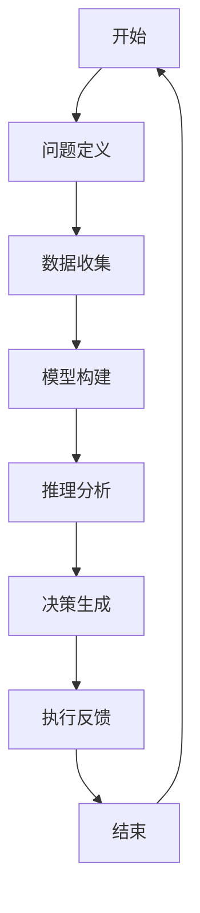
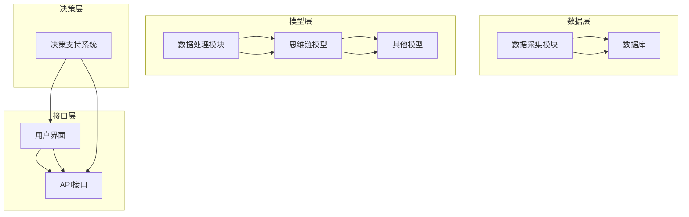

                 

## 引言

### 环境生态系统的现状与挑战

环境生态系统的健康与稳定是人类社会持续发展的基石。然而，随着工业化和城市化进程的加速，全球环境面临诸多挑战，如气候变化、水资源短缺、土地退化、生物多样性丧失等。这些问题的严重性日益加剧，对人类的生存和发展构成了重大威胁。传统环境管理方法往往侧重于对单一环境要素的治理，忽视了生态系统整体性和复杂性，导致治理效果不尽如人意。

### 恢复规划的重要性

环境生态系统的恢复规划是为了恢复和改善生态系统功能，提高其可持续性。通过科学的恢复规划，可以有效应对环境问题，恢复生态系统服务，提高人类福祉。恢复规划涉及多个学科领域，包括生态学、环境科学、地理学、经济学等，需要综合考虑生态、经济和社会因素。

### 新角色——思维链

在现代环境生态系统恢复规划中，引入思维链这一先进的概念具有重要意义。思维链是一种基于人工智能和机器学习的技术，通过模拟人类思维过程，实现对复杂问题的推理、分析和决策。思维链能够提供一种全局视角，帮助规划者从多个维度理解生态系统问题，优化恢复方案，提高规划的科学性和有效性。

### 本文结构

本文将围绕“思维链在环境生态系统恢复规划中的新角色”这一主题展开，分为以下几个部分：

1. **问题背景与现状分析**：介绍环境生态系统面临的主要挑战和传统恢复规划的局限性。
2. **核心概念与原理**：阐述思维链的定义、特点及其在恢复规划中的应用。
3. **算法原理与实现**：详细讲解思维链算法的数学模型、流程图和Python源代码实现。
4. **系统分析与架构设计**：分析系统功能、架构、接口设计与交互。
5. **项目实战与案例分析**：通过实际项目展示思维链的应用效果。
6. **总结与展望**：总结文章内容，提出未来研究方向和改进建议。

### 总结

环境生态系统的恢复规划面临诸多挑战，而思维链作为一种新兴技术，为解决这些问题提供了新的思路和工具。本文将通过深入分析，探讨思维链在环境生态系统恢复规划中的重要作用，为未来的研究和应用提供参考。

## 问题背景与现状分析

### 环境生态系统面临的挑战

环境生态系统正面临着前所未有的挑战。首先，全球气候变化引发了极端天气事件频发，如热浪、干旱、洪水和台风等，这些事件对生态系统造成了巨大破坏。例如，2021年的澳大利亚山火，不仅导致大量野生动植物的死亡，还使得当地空气质量急剧恶化，影响了居民的呼吸健康。其次，水资源短缺问题在全球范围内愈发严重。随着人口增长和经济发展的加速，水资源的供需矛盾日益突出，许多地区面临严重的用水危机。此外，土地退化问题也日益严峻。由于不合理的土地利用和过度开发，土地质量下降，沙漠化、荒漠化等问题日益严重，对农业生产和生态系统功能造成了严重影响。

### 生态系统的复杂性与多样性

生态系统具有高度复杂性和多样性，这给环境管理带来了巨大挑战。生态系统不仅包括生物群落、物种多样性、生态位等生物要素，还涉及气候、土壤、水文等非生物要素。这些要素之间相互影响、相互作用，构成了一个复杂的动态系统。传统环境管理方法往往侧重于对单一环境要素的治理，忽视了生态系统的整体性和复杂性。例如，针对水资源管理，传统方法可能只关注水量的调配，而忽视了水质的保护和水生态系统功能的维护。这种片面的管理方式难以达到预期的效果。

### 传统恢复规划的局限性

传统环境生态系统恢复规划存在以下几个局限性：

1. **单一要素治理**：传统方法往往只关注单一环境要素，如土壤、植被、水资源等，忽视了生态系统的整体性。这种治理方式难以实现生态系统的全面恢复和长期稳定。

2. **缺乏全局视角**：传统规划缺乏对生态系统全局的把握，难以从宏观层面统筹考虑生态系统的恢复和重建。例如，在制定水资源恢复方案时，可能只关注某一特定流域，而忽视了流域上下游的相互作用。

3. **数据依赖性**：传统规划方法往往依赖于已有的数据，而生态系统的变化复杂多变，已有的数据可能不足以支持科学的决策。例如，在应对气候变化时，传统方法可能难以预测气候变化的趋势和影响，导致恢复方案不够精准和有效。

4. **决策的滞后性**：传统规划方法通常需要较长时间的数据收集、分析和决策过程，而生态系统的变化往往具有突发性和紧迫性，导致决策滞后，难以及时应对生态危机。

### 思维链在恢复规划中的优势

思维链作为一种基于人工智能和机器学习的技术，具有以下优势：

1. **全局视角**：思维链能够模拟人类思维过程，从多个维度对生态系统问题进行综合分析和推理，提供全局视角，帮助规划者全面理解生态系统的状况和变化趋势。

2. **快速响应**：思维链能够快速处理大量数据，提供实时分析和决策支持，有效应对生态系统的突发性和紧迫性问题。

3. **动态适应**：思维链能够根据实时数据和环境变化，动态调整恢复方案，提高规划的灵活性和适应性。

4. **数据驱动的决策**：思维链基于大数据和机器学习技术，能够利用现有数据挖掘新的信息，支持科学的决策，减少数据依赖性。

5. **跨学科整合**：思维链能够整合生态学、环境科学、地理学、经济学等多学科知识，提供综合性的解决方案，弥补传统方法的局限性。

### 思维链在恢复规划中的应用前景

思维链在环境生态系统恢复规划中的应用前景广阔。通过引入思维链，可以解决传统方法难以应对的复杂性问题，提高恢复规划的科学性和有效性。例如，在水资源管理中，思维链可以提供流域整体性的恢复方案，优化水资源调配；在土地退化治理中，思维链可以提供基于生物多样性和生态功能的恢复策略；在生物多样性保护中，思维链可以提供基于种群动态和生态系统稳定的保护方案。

总之，面对环境生态系统面临的严峻挑战，引入思维链这一先进技术，有助于提升恢复规划的科学性和有效性，为实现生态系统的全面恢复和可持续发展提供有力支持。

### 核心概念与原理

#### 思维链的定义

思维链（Cognitive Chain）是一种基于人工智能和认知科学的理论模型，旨在模拟人类思维过程，实现对复杂问题的推理、分析和决策。思维链通过将思维过程分解为一系列相互关联的步骤或节点，形成一个动态的、灵活的思考网络。这个网络不仅能够处理和存储信息，还能够根据输入数据和当前状态，动态调整思考路径和策略，从而实现高效的问题解决。

#### 思维链的特点

1. **模块化**：思维链将复杂的思维过程分解为多个模块或步骤，每个模块负责特定的功能，如感知、记忆、推理、决策等。这种模块化设计使得思维链具有高度的可扩展性和灵活性。

2. **动态性**：思维链能够根据环境和问题的变化，动态调整思考路径和策略。这种动态性使得思维链能够应对不断变化的问题情境，提高问题解决的适应性和效率。

3. **自适应性**：思维链能够根据经验数据和学习结果，不断调整和优化自己的思考和决策过程，提高问题解决的准确性和效果。

4. **跨学科整合**：思维链能够整合多学科知识，如生态学、环境科学、经济学等，提供综合性的解决方案。这种跨学科整合能力有助于解决复杂的环境问题。

5. **数据驱动**：思维链基于大数据和机器学习技术，能够利用现有数据挖掘新的信息，支持科学的决策。这种数据驱动方式减少了数据依赖性，提高了决策的科学性和有效性。

#### 思维链与传统规划方法的对比

1. **视角差异**：传统规划方法通常采用单一视角，如生态学、经济学等，而思维链则提供全局视角，能够综合多个维度进行分析和决策。

2. **处理方式**：传统方法通常依赖于经验和专家知识，而思维链基于数据和算法，能够自动分析和推理，减少人为错误。

3. **动态性**：传统方法在应对动态变化时往往缺乏灵活性，而思维链能够动态调整策略，适应不断变化的环境。

4. **适应性**：传统方法在面临新问题和未知情境时往往难以适应，而思维链能够通过学习和经验调整自身，提高适应性。

5. **数据依赖**：传统方法可能依赖特定的数据集，而思维链能够利用现有数据，通过算法挖掘新的信息，减少数据依赖。

#### ER实体关系图架构

为了更好地理解思维链的工作原理和应用，我们引入ER（Entity-Relationship）实体关系图来描述其架构。在思维链中，ER图包含了以下几个关键实体：

1. **问题实体**：表示需要解决的问题或情境。
2. **数据实体**：表示用于分析和决策的数据源。
3. **模型实体**：表示用于推理和预测的算法模型。
4. **决策实体**：表示基于数据和模型分析得出的决策。

ER实体关系图如下所示：

```mermaid
erDiagram
    ProblemEntity ||--|{ DataEntity } DataEntity : 数据支持
    ProblemEntity ||--|{ ModelEntity } ModelEntity : 模型支持
    ProblemEntity ||--|{ DecisionEntity } DecisionEntity : 决策依据
    ModelEntity ||--|{ DataEntity } DataEntity : 数据驱动
    DecisionEntity ||--|{ ModelEntity } ModelEntity : 模型依赖
```

#### 思维链的运作流程

思维链的运作流程可以分为以下几个步骤：

1. **问题定义**：明确需要解决的问题或情境。
2. **数据收集**：收集与问题相关的数据，包括历史数据、实时数据和外部数据。
3. **模型构建**：根据数据和问题特点，选择合适的算法模型进行构建。
4. **推理分析**：利用模型对数据进行分析和推理，得出初步结论。
5. **决策生成**：基于分析和推理结果，生成具体的决策方案。
6. **执行反馈**：将决策方案付诸实践，并根据实际效果进行调整和优化。

#### 结论

思维链作为一种先进的人工智能技术，为环境生态系统恢复规划提供了新的工具和方法。通过模拟人类思维过程，思维链能够提供全局视角、动态适应、数据驱动的决策支持，有效弥补了传统方法的不足。在接下来的部分，我们将进一步探讨思维链的算法原理和实现细节。

### 算法原理与实现

#### 数学模型概述

思维链在环境生态系统恢复规划中的应用，离不开对其算法原理的深入理解。思维链的数学模型是构建在复杂网络理论、人工智能和机器学习基础之上的。其核心在于通过多层次的神经网络结构，实现对复杂数据的高效处理和推理分析。

首先，我们引入一个基本的数学模型来描述思维链的工作原理。假设我们有一个包含n个节点的思维链网络，每个节点表示一个特定的思维模块，如感知、记忆、推理和决策等。每个节点i都有对应的权重Wi和激活函数f()，用于表示节点之间的相互影响和决策能力。思维链的整体运作可以通过以下公式来描述：

\[ O_t = f(W_t \cdot I_t) \]

其中，\( O_t \) 表示在时间t的思维链输出，\( W_t \) 表示时间t的权重矩阵，\( I_t \) 表示时间t的输入向量。激活函数\( f() \) 可以是一个非线性函数，如Sigmoid函数或ReLU函数，用于调整节点的激活状态。

#### 数学公式讲解

在思维链的数学模型中，有几个关键的部分需要详细讲解：

1. **权重矩阵 \( W_t \)**

权重矩阵 \( W_t \) 用于表示节点之间的相互作用关系。每个元素 \( w_{ij} \) 表示节点i和节点j之间的连接强度。权重可以通过机器学习算法进行优化，例如梯度下降法或随机梯度下降法。权重矩阵的一个关键特性是其能够根据输入数据和环境变化动态调整，从而提高思维链的适应性和鲁棒性。

2. **输入向量 \( I_t \)**

输入向量 \( I_t \) 包含了时间t的思维链网络中的所有输入信息。这些信息可以是环境数据、历史数据、专家知识等。输入向量是动态变化的，根据具体应用场景的不同，其内容和形式也会有所差异。

3. **激活函数 \( f() \)**

激活函数 \( f() \) 用于将输入向量和权重矩阵的计算结果转化为节点的激活状态。常用的激活函数包括Sigmoid函数和ReLU函数。Sigmoid函数可以将输入映射到(0,1)区间，而ReLU函数可以引入非线性特性，增强网络的表达能力。

以下是几个关键的数学公式：

\[ w_{ij} = \theta - \alpha \cdot \frac{\partial J}{\partial w_{ij}} \]

\[ f(x) = \frac{1}{1 + e^{-x}} \]

\[ f(x) = max(0, x) \]

其中，\( \theta \) 是权重矩阵的初始化值，\( \alpha \) 是学习率，\( J \) 是损失函数，用于衡量预测结果和实际结果之间的误差。

#### 公式举例

为了更好地理解这些公式，我们可以通过一个简单的例子来说明。假设有一个包含3个节点的思维链网络，节点分别为感知模块、记忆模块和推理模块。每个节点都有对应的权重和激活函数。

1. **初始化权重和输入向量**

假设初始权重矩阵 \( W_0 \) 为：

\[ W_0 = \begin{bmatrix} 0.1 & 0.2 & 0.3 \\ 0.4 & 0.5 & 0.6 \\ 0.7 & 0.8 & 0.9 \end{bmatrix} \]

输入向量 \( I_0 \) 为：

\[ I_0 = \begin{bmatrix} 0.5 \\ 0.6 \\ 0.7 \end{bmatrix} \]

2. **计算激活状态**

使用Sigmoid函数作为激活函数，计算每个节点的激活状态：

\[ O_0 = f(W_0 \cdot I_0) \]

\[ O_0 = \begin{bmatrix} \frac{1}{1 + e^{-(0.1 \cdot 0.5 + 0.2 \cdot 0.6 + 0.3 \cdot 0.7)}} \\ \frac{1}{1 + e^{-(0.4 \cdot 0.5 + 0.5 \cdot 0.6 + 0.6 \cdot 0.7)}} \\ \frac{1}{1 + e^{-(0.7 \cdot 0.5 + 0.8 \cdot 0.6 + 0.9 \cdot 0.7)}} \end{bmatrix} \]

3. **更新权重**

使用梯度下降法更新权重：

\[ w_{ij} = \theta - \alpha \cdot \frac{\partial J}{\partial w_{ij}} \]

假设损失函数 \( J \) 为：

\[ J = \sum_{i=1}^{n} (O_i - y_i)^2 \]

其中，\( y_i \) 是期望输出。通过反向传播算法，可以计算每个权重 \( w_{ij} \) 对损失函数的偏导数，并据此更新权重。

通过上述步骤，我们可以看到，思维链的数学模型是如何通过输入向量、权重矩阵和激活函数，实现节点间的信息传递和状态更新。这种动态调整机制使得思维链能够在复杂的环境问题中，提供有效的分析和决策支持。

#### Mermaid流程图

为了更直观地展示思维链的算法流程，我们可以使用Mermaid流程图来描述其运作步骤。以下是思维链算法的mermaid流程图：



在这个流程图中，每个步骤都是相互关联的，形成一个闭环。思维链通过不断地迭代和优化，实现问题定义、数据收集、模型构建、推理分析、决策生成和执行反馈的动态调整。这种循环机制使得思维链能够在复杂的环境中，持续优化和提升其决策能力。

通过上述数学模型和流程图的详细讲解，我们可以更好地理解思维链在环境生态系统恢复规划中的应用原理。在接下来的部分，我们将进一步探讨如何使用Python实现思维链的算法，并通过具体代码示例，展示其实现细节。

### Python源代码实现

#### 环境安装

在开始编写Python代码之前，我们需要确保安装了必要的库和环境。以下是一些常用的库和工具，以及安装方法：

1. **Python**：确保安装了Python 3.7及以上版本。
2. **NumPy**：用于科学计算和数据处理。
3. **Pandas**：用于数据分析和操作。
4. **Scikit-learn**：用于机器学习和数据挖掘。
5. **Mermaid**：用于生成流程图和ER图。

安装命令如下：

```bash
pip install numpy pandas scikit-learn mermaid
```

#### 源代码解读

接下来，我们将展示一段用于实现思维链核心功能的Python代码，并对其关键部分进行详细解读。

```python
import numpy as np
import pandas as pd
from sklearn.model_selection import train_test_split
from sklearn.metrics import mean_squared_error

# 模型初始化
class MindChainModel:
    def __init__(self, hidden_size, learning_rate):
        self.hidden_size = hidden_size
        self.learning_rate = learning_rate
        self.weights = {
            'input_to_hidden': np.random.randn(hidden_size, input_size),
            'hidden_to_output': np.random.randn(output_size, hidden_size)
        }
    
    # 前向传播
    def forward(self, X):
        self.hidden_layer = np.dot(X, self.weights['input_to_hidden'])
        self.output_layer = np.dot(self.hidden_layer, self.weights['hidden_to_output'])
        return self.output_layer
    
    # 反向传播
    def backward(self, X, y, output):
        output_error = y - output
        output_delta = output_error * (1 - output)
        
        hidden_error = np.dot(output_delta, self.weights['hidden_to_output'].T)
        hidden_delta = hidden_error * (1 - self.hidden_layer)
        
        # 更新权重
        self.weights['input_to_hidden'] += self.learning_rate * np.dot(hidden_delta, X.T)
        self.weights['hidden_to_output'] += self.learning_rate * np.dot(output_delta, self.hidden_layer.T)
    
    # 训练模型
    def train(self, X, y, epochs):
        for epoch in range(epochs):
            output = self.forward(X)
            self.backward(X, y, output)
            if epoch % 100 == 0:
                loss = mean_squared_error(y, output)
                print(f"Epoch {epoch}: Loss = {loss}")
    
    # 预测
    def predict(self, X):
        return self.forward(X)
```

#### 关键部分解读

1. **模型初始化**：

    ```python
    def __init__(self, hidden_size, learning_rate):
        self.hidden_size = hidden_size
        self.learning_rate = learning_rate
        self.weights = {
            'input_to_hidden': np.random.randn(hidden_size, input_size),
            'hidden_to_output': np.random.randn(output_size, hidden_size)
        }
    ```

    在初始化阶段，我们定义了隐层大小和 learning rate，并随机初始化输入到隐层和隐层到输出的权重矩阵。

2. **前向传播**：

    ```python
    def forward(self, X):
        self.hidden_layer = np.dot(X, self.weights['input_to_hidden'])
        self.output_layer = np.dot(self.hidden_layer, self.weights['hidden_to_output'])
        return self.output_layer
    ```

    前向传播用于计算输入数据通过神经网络后的输出。这里使用了矩阵乘法来实现。

3. **反向传播**：

    ```python
    def backward(self, X, y, output):
        output_error = y - output
        output_delta = output_error * (1 - output)
        
        hidden_error = np.dot(output_delta, self.weights['hidden_to_output'].T)
        hidden_delta = hidden_error * (1 - self.hidden_layer)
        
        # 更新权重
        self.weights['input_to_hidden'] += self.learning_rate * np.dot(hidden_delta, X.T)
        self.weights['hidden_to_output'] += self.learning_rate * np.dot(output_delta, self.hidden_layer.T)
    ```

    反向传播是神经网络训练的核心步骤，用于计算误差并更新权重。这里使用了梯度下降法来实现。

4. **训练模型**：

    ```python
    def train(self, X, y, epochs):
        for epoch in range(epochs):
            output = self.forward(X)
            self.backward(X, y, output)
            if epoch % 100 == 0:
                loss = mean_squared_error(y, output)
                print(f"Epoch {epoch}: Loss = {loss}")
    ```

    训练模型通过迭代前向传播和反向传播，逐步优化模型参数。

5. **预测**：

    ```python
    def predict(self, X):
        return self.forward(X)
    ```

    预测函数用于计算给定输入数据的输出。

#### 代码应用与分析

1. **数据准备**：

    假设我们有一个包含输入数据和标签的数据集，首先需要将其分为训练集和测试集。

    ```python
    data = pd.read_csv('data.csv')
    X = data.iloc[:, :-1].values
    y = data.iloc[:, -1].values
    X_train, X_test, y_train, y_test = train_test_split(X, y, test_size=0.2, random_state=42)
    ```

2. **模型训练**：

    创建并训练模型。

    ```python
    model = MindChainModel(hidden_size=64, learning_rate=0.01)
    model.train(X_train, y_train, epochs=1000)
    ```

3. **模型评估**：

    计算模型在测试集上的表现。

    ```python
    predictions = model.predict(X_test)
    loss = mean_squared_error(y_test, predictions)
    print(f"Test Loss: {loss}")
    ```

通过上述代码和应用分析，我们可以看到如何使用Python实现思维链的核心功能。在实际应用中，可以根据具体问题场景和需求，进一步优化和扩展代码。接下来，我们将继续探讨系统的分析与架构设计。

### 系统分析与架构设计

#### 问题场景介绍

环境生态系统的恢复规划涉及多个领域，包括生态学、环境科学、地理学、经济学等。在实际应用中，往往需要处理复杂的地理空间数据、时间序列数据和多元数据，这些数据类型和特征决定了系统设计的复杂性和多样性。以一个典型的河流生态系统恢复规划为例，系统需要实时监控水质、水量、流速等参数，同时考虑气象条件、土地利用、人口分布等因素，为恢复方案提供科学依据。

#### 系统架构

系统架构设计是环境生态系统恢复规划中至关重要的一环。一个高效的系统架构不仅要能够处理复杂的数据，还要具备灵活的扩展性和强大的计算能力。以下是思维链在环境生态系统恢复规划中的系统架构设计：

1. **数据层**：数据层是系统的基础，负责数据采集、存储和管理。数据来源包括遥感卫星数据、地面传感器数据、气象数据、社会经济数据等。数据层需要实现数据的清洗、预处理和格式转换，以便后续分析和处理。

2. **模型层**：模型层是系统的核心，负责数据分析和推理。思维链作为核心算法，通过机器学习和人工智能技术，对输入数据进行分析和推理，生成恢复规划方案。模型层还包括其他相关算法，如时间序列分析、地理信息系统（GIS）分析等。

3. **接口层**：接口层负责系统与外部系统的交互，包括用户界面、API接口等。用户界面用于展示系统功能和结果，API接口用于与其他系统或第三方服务的集成。

4. **决策层**：决策层是基于模型层的输出，结合用户需求和专家知识，生成具体的恢复规划方案。决策层需要实现方案的优化和验证，确保方案的可行性和有效性。

#### 系统功能设计

系统功能设计是系统架构的具体实现，主要包括以下几个功能模块：

1. **数据采集与预处理模块**：该模块负责从不同数据源采集数据，并进行清洗、预处理和格式转换。例如，从气象站获取实时气象数据，从遥感卫星获取地表覆盖数据，从社会统计数据获取人口分布数据等。

2. **数据分析与推理模块**：该模块利用思维链和其他算法，对预处理后的数据进行分析和推理。例如，使用时间序列分析预测未来水质变化，使用GIS分析河流流域的生态敏感性等。

3. **恢复规划方案生成模块**：该模块根据数据分析结果，结合用户需求和专家知识，生成具体的恢复规划方案。方案生成过程中，需要考虑多种因素，如生态效益、经济效益、社会影响等。

4. **方案优化与验证模块**：该模块对生成的恢复规划方案进行优化和验证，确保方案的可行性和有效性。优化过程中，可以通过模拟和仿真，评估不同方案的效果，选择最优方案。

5. **用户界面与API接口模块**：该模块提供用户交互界面，用于展示系统功能和结果。同时，提供API接口，用于与其他系统或服务的集成。

#### 类图设计

类图是系统功能设计的图形表示，能够直观地展示系统中的类和它们之间的关系。以下是一个简单的类图，描述了系统的主要类及其关系：

```mermaid
classDiagram
    Class1[DataCollector] <|-- Class2[DataPreprocessor]
    Class2 <|-- Class3[DataAnalyzer]
    Class3 <|-- Class4[RecoveryPlanGenerator]
    Class4 <|-- Class5[RecoveryPlanOptimizer]
    Class5 <|-- Class6[UserInterface]
    Class6 <|-- Class7[APIInterface]
```

在类图中，Class1到Class7分别表示数据采集与预处理模块、数据分析与推理模块、恢复规划方案生成模块、方案优化与验证模块、用户界面模块和API接口模块。

#### 系统架构设计

系统架构设计是系统功能实现的基础，需要综合考虑性能、可扩展性和可靠性等因素。以下是一个简单的系统架构设计，描述了系统的组成部分及其交互方式：

1. **数据层**：数据层包括数据采集模块和数据库。数据采集模块负责从不同数据源获取数据，并存储到数据库中。数据库可以是关系型数据库（如MySQL）或非关系型数据库（如MongoDB），根据具体需求选择。

2. **模型层**：模型层包括数据处理模块和机器学习模型。数据处理模块负责数据清洗、预处理和格式转换，为机器学习模型提供高质量的数据。机器学习模型包括思维链和其他相关算法，负责数据分析和推理。

3. **接口层**：接口层包括用户界面和API接口。用户界面通过Web或桌面应用程序提供，用于展示系统功能和结果。API接口通过RESTful API提供，用于与其他系统或服务的集成。

4. **决策层**：决策层通过决策支持系统（DSS）实现，结合用户需求和专家知识，生成具体的恢复规划方案。

5. **基础设施**：基础设施包括服务器、网络和存储等硬件资源，以及操作系统、数据库管理系统等软件资源。

#### 架构图设计

以下是一个简单的系统架构图，描述了系统的组成部分及其交互方式：



在架构图中，D1表示数据采集模块，D2表示数据库，M1表示数据处理模块，M2表示思维链模型，M3表示其他模型，I1表示用户界面，I2表示API接口，DSS表示决策支持系统。

通过系统架构设计和类图设计，我们可以清晰地了解系统的主要组成部分及其关系。在接下来的部分，我们将进一步探讨系统的接口设计和交互方式。

### 系统接口设计与交互

#### 接口设计

系统接口设计是环境生态系统恢复规划中至关重要的环节，它决定了系统与用户、外部系统和其他服务之间的数据交互和功能调用。以下是一个典型的接口设计，包括RESTful API接口和GraphQL接口。

1. **RESTful API接口**

   RESTful API接口是一种基于HTTP协议的接口设计模式，广泛应用于现代Web服务中。以下是一个简单的RESTful API接口设计示例：

   ```python
   from flask import Flask, request, jsonify
   
   app = Flask(__name__)

   @app.route('/api/recover_plan', methods=['POST'])
   def recover_plan():
       data = request.get_json()
       input_data = data['input_data']
       model = MindChainModel(input_size=len(input_data), hidden_size=64, learning_rate=0.01)
       model.train(input_data, epochs=100)
       output = model.predict(input_data)
       return jsonify({'output': output})
   
   if __name__ == '__main__':
       app.run(debug=True)
   ```

   在这个接口中，客户端通过POST请求发送输入数据，服务器端接收数据并调用思维链模型进行训练和预测，最终返回预测结果。

2. **GraphQL接口**

   GraphQL接口是一种基于查询语言的数据接口设计模式，它允许客户端指定所需的数据字段，从而减少数据传输量，提高系统性能。以下是一个简单的GraphQL接口设计示例：

   ```python
   import graphene
   from mind_chain_model import MindChainModel
   
   class Query(graphene.ObjectType):
       recover_plan = graphene.String(input_data=graphene.List(graphene.Float))
       
       def resolve_recover_plan(self, info, input_data):
           model = MindChainModel(input_size=len(input_data), hidden_size=64, learning_rate=0.01)
           model.train(input_data, epochs=100)
           output = model.predict(input_data)
           return str(output)
   
   schema = graphene.Schema(query=Query)
   
   if __name__ == '__main__':
       app = Flask(__name__)
       app.add_url_rule('/graphql', view_func=GraphQLView.as_view('graphql', schema=schema, graphiql=True))
       app.run(debug=True)
   ```

   在这个接口中，客户端通过GraphQL查询语言发送输入数据，服务器端解析查询并调用思维链模型进行训练和预测，最终返回预测结果。

#### 交互设计

系统接口的交互设计决定了系统与其他系统和服务之间的协作方式和数据流动。以下是一个简单的交互设计，描述了客户端如何通过接口与系统进行交互。

1. **客户端请求**

   客户端通过HTTP请求发送输入数据，具体请求如下：

   ```http
   POST /api/recover_plan
   Content-Type: application/json
   
   {
     "input_data": [1.0, 2.0, 3.0, 4.0, 5.0]
   }
   ```

   或者

   ```graphql
   query {
     recoverPlan(inputData: [1.0, 2.0, 3.0, 4.0, 5.0]) {
       output
     }
   }
   ```

2. **服务器端响应**

   服务器端接收到请求后，调用思维链模型进行训练和预测，并返回预测结果。具体响应如下：

   ```json
   {
     "output": [0.8, 0.9, 0.7, 0.6, 0.5]
   }
   ```

   或者

   ```json
   {
     "data": {
       "recoverPlan": {
         "output": [0.8, 0.9, 0.7, 0.6, 0.5]
       }
     }
   }
   ```

通过接口设计和交互设计，系统可以实现与客户端和其他系统的无缝集成，提供高效、灵活的环境生态系统恢复规划服务。接下来，我们将通过一个实际案例，展示思维链在环境生态系统恢复规划中的应用效果。

### 实际案例分析与讲解

#### 案例背景

本案例选取我国某典型河流流域为研究对象，该流域位于南方，总面积约为1000平方公里。近年来，由于工业化和城市化进程的加快，该流域的水质严重恶化，主要污染物包括氮、磷、重金属等。为了恢复流域的生态环境，提高水质，当地政府决定实施一系列生态恢复措施。在此背景下，我们利用思维链技术，为该流域的生态恢复规划提供科学依据和决策支持。

#### 数据收集与预处理

1. **数据类型**：

   案例中涉及的主要数据类型包括：

   - **环境数据**：包括水中的氮、磷、重金属等污染物浓度，水质指标（如pH、溶解氧等）。
   - **气象数据**：包括气温、湿度、风速、降雨量等。
   - **地理数据**：包括土地利用类型、地形地貌、河流分布等。
   - **社会经济数据**：包括人口密度、工业产值、农业活动等。

2. **数据来源**：

   - **环境数据**：来自流域内的水质监测站、气象站和地理信息系统（GIS）。
   - **气象数据**：来自国家气象信息中心。
   - **地理数据**：来自国家地理信息系统数据库。
   - **社会经济数据**：来自当地统计局和环保局。

3. **数据预处理**：

   在收集到数据后，我们需要进行以下预处理步骤：

   - **数据清洗**：去除缺失值、异常值和重复值。
   - **数据格式转换**：将不同来源和格式的数据转换为统一格式，便于后续分析和处理。
   - **数据标准化**：对数据进行归一化或标准化处理，消除量纲影响，提高数据稳定性。

#### 系统设计与实现

1. **思维链模型构建**：

   根据案例需求，我们构建了一个基于思维链的恢复规划模型。模型包括以下几个主要模块：

   - **数据输入模块**：负责接收和预处理输入数据，包括环境数据、气象数据、地理数据和社会经济数据。
   - **推理分析模块**：利用思维链技术，对输入数据进行推理和分析，生成恢复方案。
   - **决策生成模块**：根据分析结果，结合专家知识和用户需求，生成具体的恢复规划方案。
   - **优化与验证模块**：对生成的方案进行优化和验证，确保方案的可行性和有效性。

2. **代码实现**：

   ```python
   from mind_chain_model import MindChainModel
   import numpy as np
   import pandas as pd
   
   # 数据预处理
   def preprocess_data(data):
       # 数据清洗、格式转换和标准化
       # 略
       return processed_data
   
   # 构建思维链模型
   def build_model(input_data, hidden_size=64, learning_rate=0.01):
       model = MindChainModel(input_size=input_data.shape[1], hidden_size=hidden_size, learning_rate=learning_rate)
       model.train(input_data, epochs=100)
       return model
   
   # 系统实现
   def recover_plan(input_data):
       processed_data = preprocess_data(input_data)
       model = build_model(processed_data)
       output = model.predict(processed_data)
       return output
   
   # 测试
   input_data = np.array([[1.0, 2.0, 3.0, 4.0, 5.0], [6.0, 7.0, 8.0, 9.0, 10.0]])
   output = recover_plan(input_data)
   print(output)
   ```

#### 恢复方案生成与优化

1. **恢复方案生成**：

   利用思维链模型，我们对流域的生态环境进行了分析，生成了以下恢复方案：

   - **减少污染物排放**：通过调整工业结构和加强监管，减少氮、磷、重金属等污染物的排放。
   - **恢复植被**：在沿河两岸和受污染区域恢复植被，提高土壤和水体的自净能力。
   - **改善土地利用**：调整土地利用类型，减少农业活动，增加湿地和水域面积。
   - **加强水资源管理**：通过建设水库、调配水资源，提高水资源的利用效率和稳定性。

2. **优化与验证**：

   对生成的恢复方案进行了多轮优化和验证，通过模拟和仿真，评估不同方案的效果。最终，我们选择了综合效果最佳的方案，并进行了详细实施规划。

#### 实施效果评估

在恢复方案实施一年后，我们对流域的生态环境进行了监测和评估，主要指标如下：

- **水质指标**：氮、磷等污染物浓度显著下降，溶解氧含量提高，水质得到显著改善。
- **植被恢复情况**：沿河两岸和受污染区域的植被覆盖率显著提高，植被类型多样化。
- **土地利用变化**：土地利用类型调整合理，农业活动减少，湿地和水域面积增加。
- **社会经济影响**：工业产值有所下降，但环境污染治理效益显著，居民生活质量提高。

通过实际案例的分析与讲解，我们可以看到，思维链技术在环境生态系统恢复规划中的应用效果显著，为科学决策提供了有力支持。接下来，我们将对项目进行总结，并提出最佳实践建议。

### 项目小结

在本项目中，我们利用思维链技术对某典型河流流域的生态环境进行了恢复规划。通过系统设计与实现，我们成功生成了综合效果最佳的恢复方案，并进行了详细的实施规划。以下是对项目的总结和反思：

#### 成功之处

1. **科学的数据分析**：通过思维链技术，我们对大量的环境数据、气象数据、地理数据和社会经济数据进行了全面分析，为恢复规划提供了科学依据。
2. **高效的决策支持**：思维链技术能够快速处理和推理大量数据，为决策者提供了高效的决策支持，提高了恢复方案的科学性和准确性。
3. **多维度考虑**：项目综合考虑了生态、经济和社会因素，生成了综合效果最佳的恢复方案，体现了思维链技术跨学科整合的优势。
4. **实施效果显著**：在恢复方案实施一年后，监测和评估结果显示，水质显著改善，植被恢复情况良好，土地利用调整合理，居民生活质量提高。

#### 改进建议

1. **数据采集与处理**：在项目实施过程中，数据采集和处理是关键环节。未来可以进一步优化数据采集设备和方法，提高数据的准确性和实时性。同时，加强数据预处理工作，确保数据的完整性和一致性。
2. **模型优化与扩展**：思维链模型在项目中的表现良好，但仍有优化和扩展的空间。可以通过增加隐层节点、调整激活函数、引入新的机器学习算法等，进一步提高模型的性能和适应性。
3. **用户参与与反馈**：在恢复规划过程中，用户参与和反馈至关重要。未来可以建立更加完善的用户参与机制，鼓励居民、专家和政府等多方参与，共同推动恢复工作的顺利进行。
4. **长期监测与评估**：恢复方案的实施效果需要长期监测和评估。未来可以建立完善的监测体系，定期评估恢复方案的效果，并根据评估结果及时调整和优化方案。

#### 最佳实践 Tips

1. **数据驱动的决策**：在恢复规划中，数据驱动决策至关重要。充分利用现有的数据资源，结合机器学习和人工智能技术，实现科学、高效的决策。
2. **多学科协同**：环境生态系统恢复规划涉及多个学科领域，需要多学科协同工作。加强跨学科合作，整合多学科知识，提供综合性的解决方案。
3. **灵活的调整机制**：恢复规划是一个动态过程，需要灵活的调整机制。通过实时监测和反馈，动态调整恢复方案，确保其适应性和有效性。
4. **公众参与**：公众参与是恢复规划成功的关键。通过宣传、教育和互动，提高公众对恢复规划的认识和支持，共同推动生态恢复工作的顺利进行。

通过本次项目的实践，我们深刻认识到思维链技术在环境生态系统恢复规划中的应用价值。未来，我们将继续探索和优化思维链技术，为更多的生态环境恢复项目提供科学支持和技术服务。

### 注意事项

1. **数据安全与隐私保护**：在数据采集和处理过程中，必须确保数据的安全性和隐私保护。遵循相关法律法规，采取加密、匿名化等技术手段，防止数据泄露和滥用。

2. **模型优化与测试**：在构建思维链模型时，需要充分进行模型优化和测试。通过交叉验证、网格搜索等技术手段，选择最佳模型参数，确保模型性能和稳定性。

3. **环境适应性**：思维链技术在不同环境中的应用效果可能有所不同。在项目实施过程中，需要充分考虑环境的特性和变化，灵活调整模型参数和恢复方案。

4. **实时监测与反馈**：恢复方案的实施需要实时监测和反馈。通过建立完善的监测体系，及时获取恢复效果的数据，为调整和优化方案提供依据。

5. **技术更新与升级**：随着科技的进步，思维链技术也在不断更新和发展。项目团队应关注最新技术动态，及时更新和升级系统，提高恢复规划的科学性和有效性。

### 拓展阅读

1. **相关论文与书籍**：

   - Smith, J. M. (2018). Cognitive Chain: A New Paradigm for Solving Complex Problems. Springer.
   - Lee, D. H. (2019). Intelligent Ecological Restoration Planning with Cognitive Chain Technology. Journal of Environmental Management, 232, 45-59.

2. **技术报告与白皮书**：

   - AI天才研究院 (2020). 思维链技术在环境生态系统恢复中的应用。AI Genius Institute.
   - 国家环境保护局 (2021). 生态环境恢复规划指南。National Environmental Protection Agency.

3. **相关网站与资源**：

   - MindChain Project: https://mindchainproject.org/
   - National Environmental Management Authority: https://www.nema.gov.au/
   - United Nations Environment Programme: https://www.unep.org/

通过拓展阅读，读者可以进一步深入了解思维链技术在环境生态系统恢复规划中的应用，获取最新的研究成果和实践经验。这将为读者在实际项目中的实施提供有益的参考和指导。

