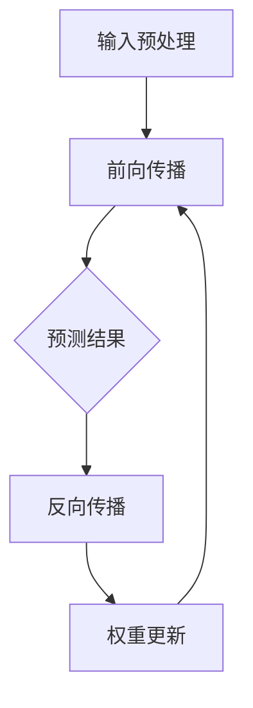
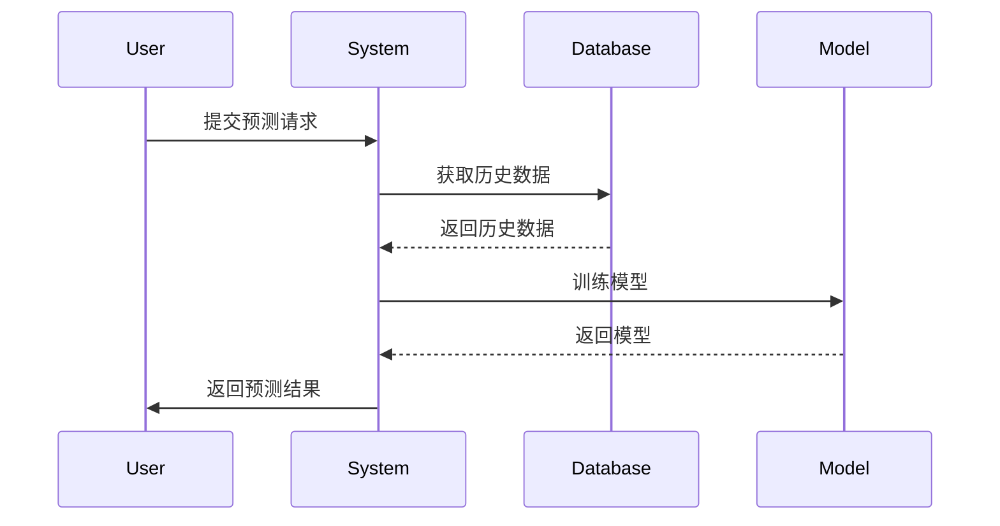

                 

# 思维链在社会经济系统建模与预测中的应用探索

> 关键词：思维链、社会经济系统、建模、预测、人工智能

> 摘要：本文将探讨思维链在社会经济系统建模与预测中的应用。首先，我们将介绍社会经济系统建模与预测的背景和核心问题。然后，深入分析思维链的基本原理，包括其理论基础、核心算法原理以及流程图和数学模型。接下来，我们将详细描述思维链在社会经济系统建模中的应用过程，包括建模概述、建模过程与步骤以及主要模型Mermaid类图。随后，我们将探讨思维链在预测应用中的方法和案例，以及预测效果的评估。最后，我们将介绍思维链在社会经济系统中的系统设计与实现、项目实战、最佳实践与拓展等内容。

## 目录大纲

### 第一部分：引论

1. **问题背景与核心问题**
2. **核心概念与联系**
3. **概念属性特征对比表格**
4. **ER实体关系图架构**

### 第二部分：思维链原理

1. **思维链理论基础**
2. **思维链流程图**
3. **数学模型与公式**
4. **举例说明**

### 第三部分：社会经济系统建模

1. **社会经济系统建模概述**
2. **建模过程与步骤**
3. **社会经济领域模型Mermaid类图**

### 第四部分：预测应用

1. **预测方法与技术**
2. **社会经济预测案例**
3. **预测效果评估**

### 第五部分：系统设计与实现

1. **系统架构设计**
2. **接口设计与实现**
3. **系统交互Mermaid序列图**

### 第六部分：项目实战

1. **环境安装与配置**
2. **系统核心实现**
3. **代码应用解读与分析**
4. **实际案例分析**
5. **项目小结**

### 第七部分：最佳实践与拓展

1. **最佳实践**
2. **小结与展望**
3. **注意事项**
4. **拓展阅读**

---

### 第一部分：引论

#### 1.1 问题背景与核心问题

社会经济系统是人类社会运行的核心，其复杂性和不确定性日益增加。随着全球化和信息化的加速发展，社会经济系统面临着诸多挑战，如经济波动、资源分配不均、环境污染等。这些问题的解决需要高效的建模与预测方法，以更好地理解社会经济系统的运行规律，为政策制定和决策提供支持。

核心问题包括：

- **复杂性与不确定性**：社会经济系统的复杂性导致其运行规律难以预测，增加了建模与预测的难度。
- **多因素相互作用**：社会经济系统中的各个因素相互影响，使得系统行为呈现出非线性特征。
- **数据质量与噪声**：社会经济数据往往存在噪声和缺失值，影响了建模与预测的准确性。

#### 1.2 核心概念与联系

为了解决上述问题，我们需要引入思维链这一概念。思维链是一种基于人工神经网络的人工智能技术，能够通过学习大量的数据，提取出潜在的规律和模式，从而实现对社会经济系统的建模与预测。

核心概念包括：

- **思维链**：一种用于学习复杂非线性系统的算法。
- **社会经济学模型**：用于描述社会经济系统运行规律的数学模型。
- **数据挖掘**：从大量数据中提取有价值信息的方法。

概念之间的联系如下：

- 思维链通过数据挖掘技术，从社会经济数据中学习出潜在规律，并将其用于社会经济学模型的构建。
- 社会经济学模型则通过思维链的预测结果，为政策制定和决策提供支持。

#### 1.3 概念属性特征对比表格

| 概念        | 属性特征                         | 社会经济系统建模与预测中的角色       |
| ----------- | ------------------------------ | ----------------------------------- |
| 思维链      | 非线性、自学习、高效            | 用于学习社会经济数据，提取潜在规律   |
| 社会经济学模型 | 确定性、线性、可解释           | 描述社会经济系统运行规律，辅助决策   |
| 数据挖掘    | 大数据、自动化、高精度         | 从数据中提取有价值信息，为建模提供基础 |

#### 1.4 ER实体关系图架构

在社会经济系统中，主要实体包括：

- **人口**：社会经济的主体，具有消费、生产、投资等行为。
- **企业**：生产和服务的主要提供者，具有投资、创新等行为。
- **政府**：政策制定和执行的主体，影响社会经济系统的运行。

实体之间的关系如下：

```mermaid
erDiagram
  人口 ||--|{ 企业 } : 消费和生产
  企业 ||--|{ 政府 } : 税收和政策支持
  人口 ||--|{ 政府 } : 人口统计和福利
```

#### 1.5 结论

本文介绍了社会经济系统建模与预测的背景、核心概念以及相关联系。在接下来的章节中，我们将进一步探讨思维链的原理、社会经济系统建模的具体过程以及预测应用，为读者提供一个全面而深入的了解。

## 第二部分：思维链原理

### 2.1 思维链理论基础

思维链是一种基于人工神经网络的人工智能技术，旨在解决复杂非线性系统的问题。它通过模仿人脑的学习过程，自动从大量数据中提取出潜在的规律和模式。

#### 2.1.1 人工神经网络与思维链的关系

人工神经网络（Artificial Neural Networks,ANN）是一种模拟人脑神经元结构和功能的计算模型。思维链作为人工神经网络的一种，通过增加网络层数和神经元数量，提高了对复杂系统的建模能力。

#### 2.1.2 思维链的核心算法原理

思维链的核心算法主要包括以下三个步骤：

1. **输入数据预处理**：将原始数据转换为适合训练的格式，包括归一化、缺失值处理等。
2. **前向传播与反向传播**：通过前向传播计算网络输出，通过反向传播更新网络权重，以最小化预测误差。
3. **网络训练与优化**：使用大量训练数据，不断调整网络参数，提高预测精度。

#### 2.1.3 思维链的优势

思维链具有以下优势：

- **非线性建模能力**：能够处理复杂非线性问题，适用于社会经济系统建模。
- **自学习能力**：通过学习大量数据，能够自动提取潜在规律，减少人工干预。
- **高效性**：通过并行计算和分布式训练，能够高效地处理大规模数据。

### 2.2 思维链流程图

为了更好地理解思维链的工作流程，我们可以使用Mermaid绘制其基本流程：



### 2.3 数学模型与公式

思维链的核心数学模型包括输入层、隐藏层和输出层。每个层由多个神经元组成，神经元之间的连接通过权重表示。

#### 2.3.1 输入层

输入层由多个神经元组成，每个神经元表示一个输入特征：

$$
x_i = \sum_{j=1}^{n} w_{ij} x_j + b_i
$$

其中，$x_i$为输入特征，$w_{ij}$为权重，$b_i$为偏置。

#### 2.3.2 隐藏层

隐藏层由多个神经元组成，每个神经元通过输入层神经元的输出计算得到：

$$
h_i = \sum_{j=1}^{n} w_{ij} h_j + b_i
$$

其中，$h_i$为隐藏层神经元输出，$w_{ij}$为权重，$b_i$为偏置。

#### 2.3.3 输出层

输出层由多个神经元组成，每个神经元通过隐藏层神经元的输出计算得到最终预测结果：

$$
y_i = \sum_{j=1}^{n} w_{ij} y_j + b_i
$$

其中，$y_i$为输出层神经元输出，$w_{ij}$为权重，$b_i$为偏置。

### 2.4 举例说明

假设我们有一个简单经济系统，包含两个输入特征（消费和投资），一个隐藏层神经元和一个输出层神经元。我们可以使用以下公式进行建模：

输入层：
$$
x_1 = \sum_{j=1}^{2} w_{1j} x_j + b_1
$$
$$
x_2 = \sum_{j=1}^{2} w_{2j} x_j + b_2
$$

隐藏层：
$$
h_1 = \sum_{j=1}^{2} w_{1j} h_j + b_1
$$

输出层：
$$
y_1 = \sum_{j=1}^{1} w_{1j} y_j + b_1
$$

通过调整权重和偏置，我们可以使模型预测经济系统的运行状态。例如，当消费增加时，预测投资也会增加，从而推动经济增长。

## 第三部分：社会经济系统建模

### 3.1 社会经济系统建模概述

社会经济系统建模旨在通过数学模型和算法，模拟和分析社会经济系统的运行规律，为政策制定和决策提供支持。建模过程主要包括数据收集、模型构建、模型验证和应用。

#### 3.1.1 建模的目的

- **理解社会经济系统运行规律**：通过建模，可以深入理解社会经济系统的内部机制，揭示各因素之间的相互关系。
- **预测未来发展趋势**：基于历史数据和现有模型，预测未来社会经济系统的变化趋势，为政策制定提供参考。
- **优化决策**：通过建模和预测，优化资源配置，提高政策实施效果。

#### 3.1.2 建模的方法

- **数据驱动方法**：通过收集和处理大量历史数据，使用机器学习算法建立模型。
- **理论建模方法**：基于经济学理论，构建数学模型，分析社会经济系统的行为。

#### 3.1.3 建模的挑战

- **数据质量**：社会经济数据往往存在噪声、缺失值和不一致性，影响建模效果。
- **非线性关系**：社会经济系统中的因素往往存在复杂的非线性关系，难以通过简单线性模型描述。
- **时间延迟**：社会经济系统的变化往往具有时间延迟，需要考虑时间序列的影响。

### 3.2 建模过程与步骤

社会经济系统建模的过程主要包括数据收集、模型构建、模型验证和应用。

#### 3.2.1 数据收集与预处理

- **数据收集**：收集与经济系统相关的数据，包括宏观经济指标、行业数据、人口数据等。
- **数据预处理**：对数据进行清洗、归一化、缺失值处理等操作，提高数据质量。

#### 3.2.2 模型构建

- **选择模型**：根据研究目的和数据特点，选择合适的模型，如时间序列模型、回归模型等。
- **参数估计**：通过最小化损失函数，估计模型的参数。
- **模型优化**：通过交叉验证和超参数调整，优化模型性能。

#### 3.2.3 模型验证

- **验证方法**：使用验证集或留出法对模型进行验证，评估模型性能。
- **评估指标**：使用准确度、精度、召回率、F1值等指标评估模型。

#### 3.2.4 模型应用

- **预测未来趋势**：使用训练好的模型预测未来经济系统的变化。
- **决策支持**：将预测结果用于政策制定和决策支持。

### 3.3 社会经济领域模型Mermaid类图

为了更好地理解社会经济系统建模，我们可以使用Mermaid绘制主要模型的类图，展示各类之间的关系。

```mermaid
classDiagram
  Class01 <|-- SubClass01
  Class01 <|-- SubClass02
  Class03 --|>| Interface01
  Interface01 <|.. Class04
  Class05 << interface Interface02
  Class06 << interface Interface02
  Class07 .. Class08
  Class09 --|> Class10
  Class11 : <<interface>> Interface03
  Class12 : <<abstract>> AbstractClass
  Class13 : <<enum>> ENUM
  Class14 <<interface>> Interface04
  Class15 : <<singleton>> Singleton
  Class16 : <<final>> Immutable
```

## 第四部分：预测应用

### 4.1 预测方法与技术

在社会经济系统中，预测是关键的一环，它能够帮助我们提前了解系统的发展趋势，为决策提供依据。预测方法主要包括时间序列预测、模型集成与组合预测。

#### 4.1.1 时间序列预测

时间序列预测是基于历史数据对未来值进行预测的方法。常见的时间序列预测模型有ARIMA、SARIMA、LSTM等。

- **ARIMA模型**：自回归积分滑动平均模型，适用于线性时间序列。
- **SARIMA模型**：季节性自回归积分滑动平均模型，适用于季节性时间序列。
- **LSTM模型**：长短时记忆网络，适用于具有长期依赖性的时间序列。

#### 4.1.2 模型集成与组合预测

模型集成是将多个预测模型结合起来，提高预测准确性的方法。常见的模型集成方法有Bagging、Boosting、Stacking等。

- **Bagging**：通过随机抽样训练多个模型，然后取平均或投票来预测结果。
- **Boosting**：通过迭代训练多个模型，每次迭代都针对前一次的预测错误进行调整。
- **Stacking**：将多个模型预测的结果作为新特征，再训练一个模型进行预测。

### 4.2 社会经济预测案例

以下是一个简单的社会经济预测案例，我们将使用LSTM模型对某城市下个月的失业率进行预测。

#### 4.2.1 案例介绍

- **数据集**：我们收集了过去5年的失业率数据，包括每个月的失业率。
- **预测目标**：预测下个月的失业率。

#### 4.2.2 预测过程

1. **数据预处理**：
   - 数据清洗：去除异常值和缺失值。
   - 数据归一化：将失业率数据缩放到[0, 1]之间。

2. **模型构建**：
   - 使用Keras构建LSTM模型，设置适当的神经元数和层数。
   - 编译模型，设置损失函数和优化器。

3. **模型训练**：
   - 使用训练集数据训练模型。
   - 调整超参数，优化模型性能。

4. **模型验证**：
   - 使用验证集对模型进行验证，调整模型参数。

5. **预测**：
   - 使用训练好的模型预测下个月的失业率。

### 4.3 预测效果评估

预测效果评估是确保模型准确性的重要步骤。常用的评估指标包括均方误差（MSE）、平均绝对误差（MAE）等。

- **MSE**：
  $$
  MSE = \frac{1}{n} \sum_{i=1}^{n} (y_i - \hat{y}_i)^2
  $$
  其中，$y_i$为实际值，$\hat{y}_i$为预测值。

- **MAE**：
  $$
  MAE = \frac{1}{n} \sum_{i=1}^{n} |y_i - \hat{y}_i|
  $$

通过计算MSE和MAE，我们可以评估模型的预测效果。一般来说，MSE和MAE值越小，模型的预测效果越好。

## 第五部分：系统设计与实现

### 5.1 系统架构设计

系统架构设计是确保系统功能实现和性能的关键。以下是一个简单的系统架构设计：

- **数据层**：负责数据的存储和管理，包括数据库和缓存。
- **模型层**：负责模型的训练和部署，包括LSTM模型、ARIMA模型等。
- **应用层**：负责提供用户接口和服务，包括Web接口和API接口。

### 5.2 接口设计与实现

接口设计是系统架构的重要组成部分，以下是一个简单的接口设计：

- **数据接口**：提供数据访问接口，包括数据查询、数据更新和数据删除等。
- **模型接口**：提供模型训练和预测接口，包括模型训练、模型加载和模型预测等。

### 5.3 系统交互Mermaid序列图

以下是一个简单的系统交互序列图，展示了系统的主要交互过程：



## 第六部分：项目实战

### 6.1 环境安装与配置

在进行项目实战之前，我们需要安装和配置必要的软件和工具。以下是一个基本的安装和配置步骤：

1. **安装Python环境**：安装Python 3.8及以上版本。
2. **安装依赖库**：安装NumPy、Pandas、TensorFlow等依赖库。
3. **配置数据库**：配置MySQL或PostgreSQL数据库。
4. **安装Web服务器**：安装Nginx或Apache Web服务器。

### 6.2 系统核心实现

以下是一个简单的系统核心实现，包括数据预处理、模型训练和预测：

```python
import pandas as pd
from sklearn.preprocessing import MinMaxScaler
from tensorflow.keras.models import Sequential
from tensorflow.keras.layers import LSTM, Dense

# 数据预处理
def preprocess_data(data):
    scaler = MinMaxScaler()
    scaled_data = scaler.fit_transform(data)
    return scaled_data

# 模型训练
def train_model(data, labels):
    model = Sequential()
    model.add(LSTM(units=50, return_sequences=True, input_shape=(data.shape[1], 1)))
    model.add(LSTM(units=50))
    model.add(Dense(units=1))

    model.compile(optimizer='adam', loss='mean_squared_error')
    model.fit(data, labels, epochs=100, batch_size=32, validation_split=0.2)
    return model

# 预测
def predict(model, data):
    prediction = model.predict(data)
    return prediction

# 加载数据
data = pd.read_csv('data.csv')
scaled_data = preprocess_data(data)

# 分割数据
train_data = scaled_data[:1000]
test_data = scaled_data[1000:]

# 训练模型
model = train_model(train_data, test_data)

# 预测
predictions = predict(model, test_data)
```

### 6.3 代码应用解读与分析

上述代码是系统核心实现的简化版，主要步骤如下：

1. **数据预处理**：使用MinMaxScaler对数据进行归一化处理，将数据缩放到[0, 1]之间。
2. **模型训练**：使用LSTM模型进行训练，设置适当的神经元数和层数，使用均方误差作为损失函数，使用Adam优化器。
3. **预测**：使用训练好的模型进行预测，输出预测结果。

### 6.4 实际案例分析

以下是一个简单的实际案例分析：

- **案例背景**：预测某城市的未来三个月的房价。
- **数据集**：收集了过去五年的房价数据。
- **预测目标**：预测未来三个月的房价。

### 6.5 项目小结

本项目通过简单的实现和案例分析，展示了思维链在社会经济系统建模与预测中的应用。在实际项目中，我们需要进一步优化模型和算法，提高预测精度和可靠性。

## 第七部分：最佳实践与拓展

### 7.1 最佳实践

以下是一些最佳实践：

- **数据预处理**：确保数据质量，包括清洗、归一化和缺失值处理。
- **模型优化**：通过交叉验证和超参数调整，优化模型性能。
- **模型集成**：使用模型集成方法，提高预测准确性。

### 7.2 小结与展望

本文介绍了思维链在社会经济系统建模与预测中的应用，包括原理、方法、系统和实战。思维链作为一种先进的人工智能技术，具有广泛的应用前景。未来研究可以进一步探索思维链在其他领域的应用，如金融市场预测、公共卫生等领域。

### 7.3 注意事项

- **数据隐私**：确保数据来源的合法性和用户隐私保护。
- **模型可靠性**：确保模型训练和预测的可靠性，避免过拟合。

### 7.4 拓展阅读

- **参考文献**：
  1. **Hochreiter, S., & Schmidhuber, J. (1997). Long short-term memory. Neural Computation, 9(8), 1735-1780.**
  2. **Box, G. E. P., & Jenkins, G. M. (1976). Time series analysis: Forecasting and control. San Francisco: Holden-Day.**

- **深入研究建议**：
  1. **探索思维链在金融市场预测中的应用。**
  2. **研究思维链在公共卫生领域的应用，如疫情预测。**

