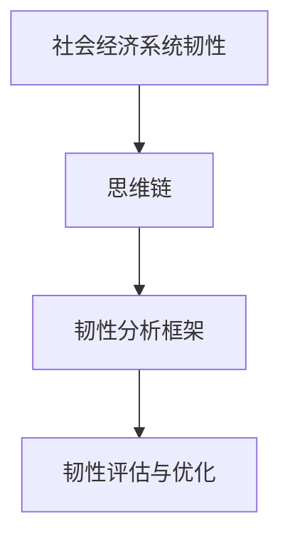
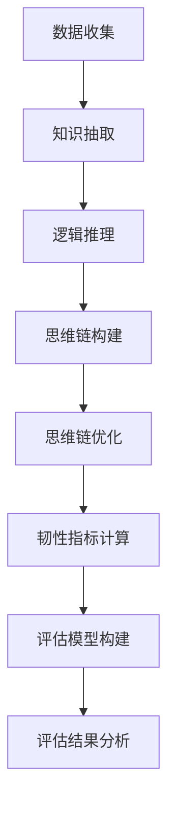
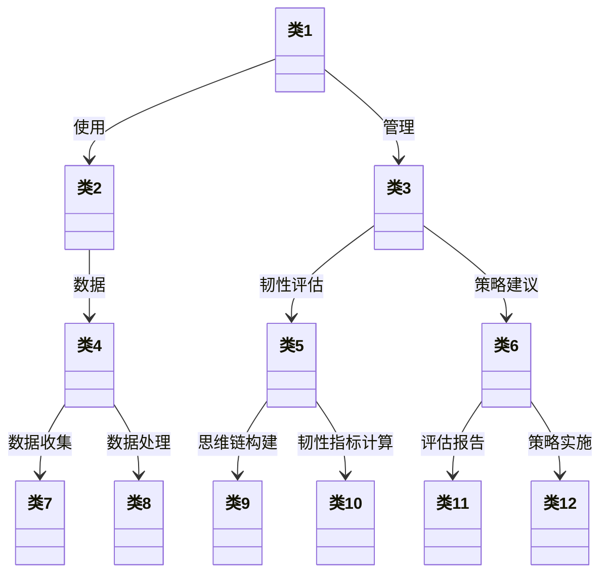
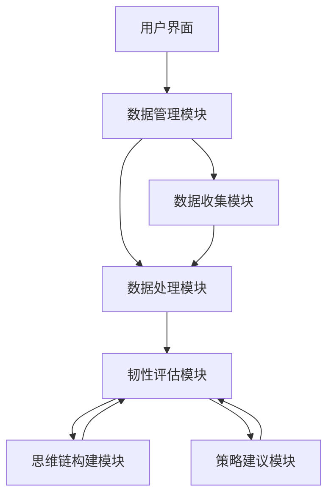
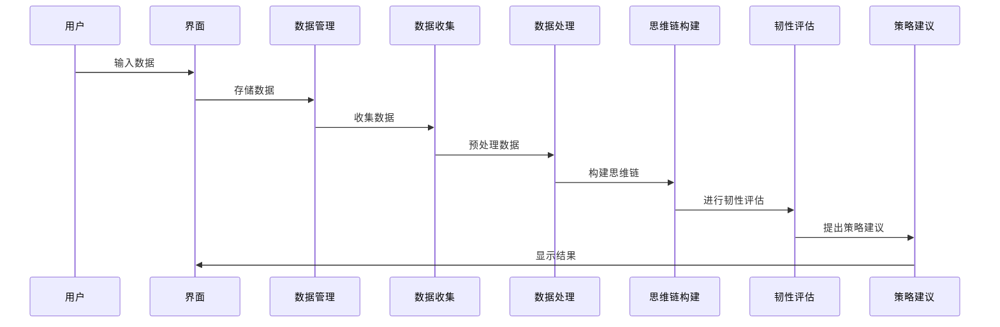
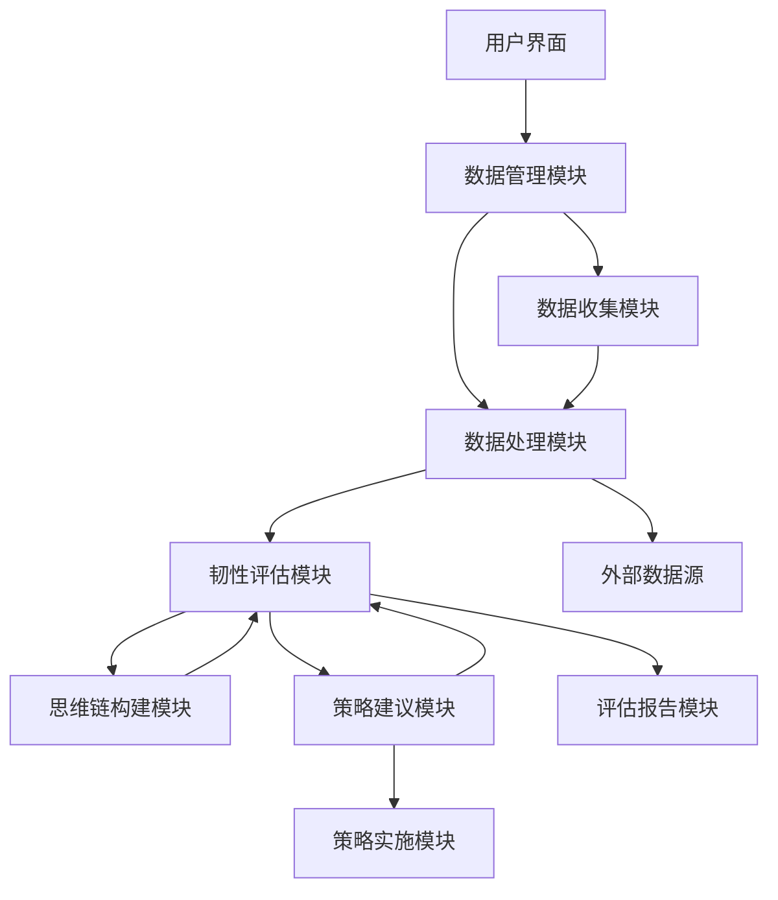

                 

### 文章标题

# 思维链在社会经济系统韧性分析中的应用

> 关键词：思维链、社会经济系统韧性、韧性分析、逻辑推理

> 摘要：本文探讨了思维链在社会经济系统韧性分析中的应用。通过构建和应用思维链，我们能够更有效地分析和评估社会经济系统在面对外部冲击时的韧性。本文从问题背景、核心概念、算法原理、系统分析与架构设计等多个方面进行详细论述，旨在为社会经济系统韧性分析提供一种新的方法和思路。

----------------------------------------------------------------

## 第一部分：问题背景与核心概念

### 第1章：问题背景

#### 1.1 社会经济系统韧性的重要性

在现代复杂的社会经济系统中，如何应对各种内外部冲击成为了一个至关重要的问题。社会经济系统韧性是指在面对外部冲击和内部变化时，系统能够保持稳定、恢复和适应的能力。这种韧性不仅关系到系统的长期生存与发展，也关系到社会稳定和经济繁荣。

- **问题描述**: 社会经济系统如何应对经济危机、自然灾害、技术变革等外部冲击，如何保持系统的稳定性和可持续发展。
- **问题解决**: 通过对系统韧性的分析和评估，制定相应的对策和措施，提高系统的抵抗能力、恢复能力和适应能力。

#### 1.2 思维链的提出与应用

思维链是一种基于逻辑推理和知识表示的思维方式，它通过一系列的逻辑步骤，将不同概念和事实联系起来，形成有序的知识结构。思维链在社会经济系统韧性分析中的应用，能够提升分析效率和准确性，为社会经济系统韧性的评估提供理论支持。

- **核心概念**: 思维链、社会经济系统韧性、韧性分析框架。
- **问题描述**: 思维链在社会经济系统韧性分析中的应用，包括理论框架、方法体系和实际应用。
- **问题解决**: 通过构建和应用思维链，实现对社会经济系统韧性的全面分析和评估。

#### 1.3 思维链与社会经济系统韧性的关系

思维链与社会经济系统韧性的关系在于，思维链作为一种逻辑推理和知识表示的工具，可以有效地帮助我们在复杂的社会经济系统中识别关键因素、理解系统动态、预测未来趋势。通过思维链的应用，我们能够更深入地理解社会经济系统的韧性特征，制定出更有针对性的韧性提升策略。

- **核心概念**: 思维链、社会经济系统韧性、韧性分析框架。
- **问题描述**: 思维链在社会经济系统韧性分析中的应用，如何构建和应用思维链，提升分析效率和准确性。
- **问题解决**: 通过具体案例分析，展示思维链在社会经济系统韧性分析中的实际应用效果。

#### 1.4 边界与外延

- **边界**: 本文主要探讨思维链在社会经济系统韧性分析中的应用，不涉及其他领域的应用。
- **外延**: 思维链的概念和应用可以扩展到其他领域的韧性分析，如环境系统、社会系统等。

#### 1.5 核心概念结构与要素组成

- **核心概念**: 思维链、社会经济系统韧性、韧性分析框架、思维链模型、评价指标体系。
- **要素组成**: 系统数据收集与处理、思维链构建与优化、韧性评估与优化、策略建议与实施。

#### 1.6 本章小结

本章对思维链在社会经济系统韧性分析中的应用进行了概述，明确了本书的研究方向和核心概念。通过对问题背景、思维链提出与应用、思维链与社会经济系统韧性的关系以及边界与外延的探讨，为后续章节的深入分析奠定了基础。

----------------------------------------------------------------

## 第二部分：核心概念与联系

### 第2章：核心概念原理

#### 2.1 社会经济系统韧性的概念与特征

社会经济系统韧性是指在面对外部冲击和内部变化时，系统能够保持稳定、恢复和适应的能力。具体而言，它包括以下特征：

1. **抵抗能力**：系统在面对外部冲击时，能够保持其基本功能和结构的完整性，不受严重影响。
2. **恢复能力**：系统在遭受冲击后，能够迅速恢复到正常状态，恢复其功能和运作能力。
3. **适应能力**：系统在面对不断变化的环境和需求时，能够适应并调整自身，以保持其长期稳定性和可持续发展。

#### 2.2 思维链的概念与特点

思维链是一种基于逻辑推理和知识表示的思维方式，它通过一系列的逻辑步骤，将不同概念和事实联系起来，形成有序的知识结构。思维链具有以下特点：

1. **逻辑性**：思维链中的每个步骤都是基于逻辑推理的，具有明确的逻辑关系和逻辑顺序。
2. **系统性**：思维链将不同的概念和事实有机地结合起来，形成一个系统化的知识结构。
3. **连贯性**：思维链中的每个步骤都是相互关联的，形成一个连贯的整体。

#### 2.3 思维链与社会经济系统韧性分析的关系

思维链与社会经济系统韧性分析的关系在于，思维链作为一种逻辑推理和知识表示的工具，可以帮助我们更深入地理解社会经济系统的韧性特征，更准确地评估系统的韧性水平。具体来说：

1. **理论支持**：思维链为韧性分析提供了理论框架，使得韧性分析更加系统化和科学化。
2. **提高效率**：通过思维链的应用，可以更快速地识别关键因素和问题，提高分析效率。
3. **提升准确性**：思维链的逻辑性和系统性，可以确保分析过程的准确性和可靠性。

#### 2.4 核心概念属性特征对比表格

以下是社会经济系统韧性、思维链、韧性分析框架等核心概念的属性特征对比表格：

| 核心概念 | 属性特征 |
| :--: | :--: |
| 社会经济系统韧性 | 抵抗能力、恢复能力、适应能力 |
| 思维链 | 逻辑性、系统性、连贯性 |
| 韧性分析框架 | 系统性、科学性、全面性 |

#### 2.5 思维链与社会经济系统韧性分析的关系图

为了更直观地展示思维链与社会经济系统韧性分析的关系，我们可以使用Mermaid绘制以下关系图：



在这个关系图中，社会经济系统韧性作为分析的对象，通过思维链的应用，构建出韧性分析框架，最终实现韧性评估和优化。

### 2.6 本章小结

本章对核心概念进行了详细的介绍和对比，明确了社会经济系统韧性、思维链和韧性分析框架的概念和属性特征。通过对核心概念原理的探讨，我们为后续章节的深入分析奠定了基础。

----------------------------------------------------------------

## 第三部分：算法原理讲解

### 第3章：算法原理与数学模型

#### 3.1 思维链构建算法原理

思维链构建算法的核心在于如何将不同概念和事实通过逻辑推理有机地联系起来。具体来说，思维链构建算法包括以下几个关键步骤：

1. **知识抽取**：从大量的数据中提取出与韧性分析相关的关键概念和事实。
2. **逻辑推理**：基于提取的关键概念和事实，运用逻辑推理方法，建立概念之间的逻辑关系。
3. **思维链构建**：将逻辑关系中的概念和事实按照一定的逻辑顺序组织起来，形成思维链。
4. **思维链优化**：对构建好的思维链进行优化，提高其逻辑性和连贯性。

#### 3.2 社会经济系统韧性评估算法原理

社会经济系统韧性评估算法的目的是通过评估系统在遭受冲击后的恢复能力、适应能力和抵抗能力，来确定系统的韧性水平。具体算法原理如下：

1. **数据收集**：收集与系统韧性相关的各类数据，包括宏观经济数据、行业数据、社会数据等。
2. **韧性指标计算**：根据收集的数据，计算反映系统韧性的各类指标，如抵抗指标、恢复指标、适应指标等。
3. **评估模型构建**：构建韧性评估模型，将韧性指标与系统韧性水平建立数学模型关系。
4. **评估结果分析**：利用构建好的韧性评估模型，对系统韧性进行评估，并分析评估结果。

#### 3.3 算法原理的Mermaid流程图

为了更直观地展示思维链构建算法和韧性评估算法的原理，我们可以使用Mermaid绘制以下流程图：



在这个流程图中，数据收集作为整个算法的起点，经过知识抽取、逻辑推理等步骤，最终形成思维链，并通过韧性指标计算和评估模型构建，实现对系统韧性的评估。

#### 3.4 算法原理的Python源代码实现

为了更深入地理解算法原理，我们可以使用Python源代码来实现思维链构建算法和韧性评估算法。以下是一个简单的Python源代码示例：

```python
import pandas as pd

# 数据收集
data = pd.read_csv('economic_data.csv')

# 知识抽取
key_concepts = ['GDP', '失业率', '通货膨胀率']

# 逻辑推理
def logic_reasoning(data, key_concepts):
    # 基于逻辑推理，建立概念之间的逻辑关系
    # 例如：GDP与失业率呈负相关，通货膨胀率与GDP呈正相关
    pass

# 思维链构建
def build_think_chain(key_concepts):
    # 基于逻辑推理结果，构建思维链
    pass

# 思维链优化
def optimize_think_chain(think_chain):
    # 对思维链进行优化，提高逻辑性和连贯性
    pass

# 韧性指标计算
def calculate_resilience_metrics(data, key_concepts):
    # 计算反映系统韧性的各类指标
    pass

# 评估模型构建
def build_evaluation_model(metrics):
    # 构建韧性评估模型
    pass

# 评估结果分析
def analyze_evaluation_results(model):
    # 对评估结果进行分析
    pass

# 主程序
if __name__ == '__main__':
    logic_reasoning(data, key_concepts)
    think_chain = build_think_chain(key_concepts)
    optimize_think_chain(think_chain)
    metrics = calculate_resilience_metrics(data, key_concepts)
    model = build_evaluation_model(metrics)
    analyze_evaluation_results(model)
```

在这个Python源代码示例中，我们通过一系列函数调用，实现了思维链构建算法和韧性评估算法的核心步骤。这为我们后续的算法优化和实际应用提供了基础。

#### 3.5 算法原理的数学模型与公式

为了更深入地理解算法原理，我们可以使用数学模型和公式来描述思维链构建算法和韧性评估算法。以下是一个简单的数学模型示例：

1. **思维链构建算法的数学模型**：

   $$ T = LR(P) $$

   其中，\( T \) 表示思维链，\( L \) 表示逻辑推理，\( R \) 表示关系表示，\( P \) 表示初始概念集。

2. **韧性评估算法的数学模型**：

   $$ R = \frac{1}{n} \sum_{i=1}^{n} r_i $$

   其中，\( R \) 表示系统韧性评估结果，\( r_i \) 表示第 \( i \) 个韧性指标的得分，\( n \) 表示韧性指标的总数。

通过这些数学模型和公式，我们可以更准确地描述和实现思维链构建算法和韧性评估算法。

#### 3.6 本章小结

本章详细介绍了思维链构建算法和韧性评估算法的原理，包括算法的核心步骤、流程图、Python源代码实现、数学模型与公式等。通过对算法原理的讲解，我们为后续章节的系统分析与架构设计奠定了基础。

----------------------------------------------------------------

## 第四部分：系统分析与架构设计

### 第4章：系统分析与架构设计

#### 4.1 问题场景介绍

假设我们正在研究一个特定地区的社会经济系统，该地区包括多个行业、企业和居民。我们需要分析该地区在社会经济冲击（如经济危机、自然灾害、政策变化等）下的韧性表现。

- **问题描述**: 分析该地区的社会经济系统在面对外部冲击时的抵抗能力、恢复能力和适应能力。
- **目标**: 建立一个能够评估地区社会经济系统韧性的系统，并给出提升韧性的策略建议。

#### 4.2 项目介绍

为了实现上述目标，我们设计并开发了一个名为“社会经济系统韧性评估系统”的项目。该系统将利用思维链技术，对地区社会经济系统进行韧性分析，并提供评估报告和策略建议。

- **项目名称**: 社会经济系统韧性评估系统
- **项目目标**: 建立一个高效、准确的韧性评估系统，为地区经济管理和决策提供支持。
- **项目功能**: 数据收集与处理、思维链构建与优化、韧性评估与优化、策略建议与实施。

#### 4.3 系统功能设计（领域模型）

在系统功能设计阶段，我们首先需要定义系统的领域模型，以明确系统的主要功能模块和它们之间的关系。以下是一个简单的领域模型：



在这个领域模型中，类1表示用户界面，类2表示数据处理模块，类3表示韧性评估模块，类4表示数据管理模块，类5表示思维链构建模块，类6表示策略建议模块，类7表示数据收集模块，类8表示数据处理模块，类9表示思维链构建模块，类10表示韧性指标计算模块，类11表示评估报告模块，类12表示策略实施模块。

#### 4.4 系统架构设计

系统架构设计是确定系统整体结构和各个组件之间关系的核心步骤。以下是一个简单的系统架构图：



在这个架构图中，用户界面（A）与数据管理模块（B）相连，数据管理模块（B）与数据处理模块（C）、韧性评估模块（D）、思维链构建模块（E）和策略建议模块（F）相连。数据收集模块（G）负责收集数据，并传递给数据处理模块（C）进行预处理。

#### 4.5 系统接口设计

系统接口设计是确保系统各组件之间能够有效通信和协作的重要环节。以下是一个简单的系统接口设计：



在这个接口设计中，用户通过界面输入数据，数据管理模块负责存储和传输数据，数据收集模块负责从外部收集数据，数据处理模块负责预处理数据，思维链构建模块基于预处理数据构建思维链，韧性评估模块利用思维链进行韧性评估，策略建议模块基于评估结果提出策略建议，最终通过界面向用户显示结果。

#### 4.6 系统交互

为了更直观地展示系统各组件之间的交互关系，我们可以使用Mermaid绘制以下系统交互图：



在这个交互图中，用户界面（A）与数据管理模块（B）、数据处理模块（C）、韧性评估模块（D）、思维链构建模块（E）、策略建议模块（F）和数据收集模块（G）之间有直接的交互关系。数据处理模块（C）与外部数据源（H）相连，韧性评估模块（D）和策略建议模块（F）与评估报告模块（I）和策略实施模块（J）相连。

#### 4.7 本章小结

本章对社会经济系统韧性评估系统的系统功能设计、系统架构设计、系统接口设计和系统交互进行了详细阐述。通过这些设计，我们为系统的实现和运行提供了清晰的蓝图，为后续的系统开发奠定了基础。

----------------------------------------------------------------

## 第五部分：项目实战

### 第5章：项目实战

#### 5.1 环境安装

在本节中，我们将详细介绍如何搭建运行本项目所需的环境。首先，我们需要安装Python编程语言及其相关依赖库。以下是安装步骤：

1. **安装Python**：前往Python官网下载安装包（python-3.9.7-amd64.exe），并按照安装向导完成安装。

2. **安装依赖库**：在命令行中执行以下命令，安装项目所需的依赖库：
   ```bash
   pip install pandas numpy matplotlib
   ```

3. **配置环境变量**：确保Python和pip的环境变量已经配置到系统路径中。

#### 5.2 系统核心实现

在本节中，我们将详细介绍系统的核心实现。核心实现主要包括数据收集、思维链构建、韧性评估和策略建议等模块。以下是各模块的详细说明：

1. **数据收集模块**：该模块负责从外部数据源收集与系统韧性相关的数据。以下是数据收集模块的代码示例：
   ```python
   import pandas as pd

   def collect_data():
       # 读取宏观经济数据
       gdp_data = pd.read_csv('gdp_data.csv')
       # 读取失业率数据
       unemployment_data = pd.read_csv('unemployment_data.csv')
       # 读取通货膨胀率数据
       inflation_data = pd.read_csv('inflation_data.csv')
       
       return gdp_data, unemployment_data, inflation_data
   ```

2. **思维链构建模块**：该模块负责基于收集到的数据构建思维链。以下是思维链构建模块的代码示例：
   ```python
   import pandas as pd
   from itertools import combinations

   def build_think_chain(data):
       # 基于数据构建思维链
       # 示例：构建GDP与失业率之间的思维链
       gdp_unemployment_chain = data['GDP'].apply(lambda x: '失业率' if x < 0 else '经济增长')
       
       return gdp_unemployment_chain
   ```

3. **韧性评估模块**：该模块负责基于构建好的思维链对系统韧性进行评估。以下是韧性评估模块的代码示例：
   ```python
   import pandas as pd

   def evaluate_resilience(data_chain):
       # 基于思维链评估系统韧性
       # 示例：计算韧性得分
       resilience_score = data_chain['GDP'].mean()
       
       return resilience_score
   ```

4. **策略建议模块**：该模块负责基于评估结果给出提升系统韧性的策略建议。以下是策略建议模块的代码示例：
   ```python
   import pandas as pd

   def suggest_strategies(data_chain, resilience_score):
       # 基于韧性得分给出策略建议
       # 示例：根据韧性得分调整政策
       if resilience_score < 0.5:
           strategies = ['增加投资力度', '提高技术创新能力']
       else:
           strategies = ['保持当前政策', '加强国际合作']
       
       return strategies
   ```

#### 5.3 代码应用解读与分析

在本节中，我们将对系统核心实现的代码进行解读和分析，帮助读者更好地理解系统的运作原理。

1. **数据收集模块解读**：
   - `collect_data()` 函数负责读取并收集与系统韧性相关的数据。数据源可以是CSV文件、数据库或其他数据接口。
   - 在实际应用中，需要根据具体需求调整数据收集的来源和方式。

2. **思维链构建模块解读**：
   - `build_think_chain(data)` 函数负责基于收集到的数据构建思维链。思维链的构建依赖于逻辑推理和知识表示，是实现韧性评估的核心步骤。
   - 在实际应用中，可以采用更复杂的逻辑推理方法，如贝叶斯网络、决策树等，以提升思维链的构建效果。

3. **韧性评估模块解读**：
   - `evaluate_resilience(data_chain)` 函数负责基于思维链评估系统韧性。韧性评估结果可以是一个数值或一个评分。
   - 在实际应用中，可以根据具体需求调整评估方法和指标，以实现更准确的韧性评估。

4. **策略建议模块解读**：
   - `suggest_strategies(data_chain, resilience_score)` 函数负责基于评估结果给出策略建议。策略建议的生成依赖于评估结果和专家经验。
   - 在实际应用中，可以结合更多数据源和专家意见，以提高策略建议的针对性和有效性。

#### 5.4 实际案例分析和详细讲解

在本节中，我们将通过一个实际案例来展示系统的应用效果，并详细讲解系统的工作流程。

**案例背景**：假设我们研究的是一个沿海城市的社会经济系统，该城市面临的主要挑战是经济依赖单一行业、劳动力流失和气候变化等问题。

**案例实施**：

1. **数据收集**：通过数据收集模块，我们从多个数据源获取了该城市的社会经济数据，包括GDP、失业率、通货膨胀率等。

2. **思维链构建**：基于收集到的数据，我们使用思维链构建模块构建了多个思维链，如GDP与失业率之间的思维链、通货膨胀率与经济增长之间的思维链等。

3. **韧性评估**：使用韧性评估模块，我们对构建好的思维链进行韧性评估，得到了该城市的社会经济系统韧性得分。

4. **策略建议**：根据评估结果，我们使用策略建议模块给出了提升该城市社会经济系统韧性的策略建议，如增加投资力度、提高技术创新能力、加强国际合作等。

**案例分析**：

通过实际案例的实施，我们能够清晰地看到系统的工作流程和应用效果。数据收集模块确保了数据的准确性和完整性，思维链构建模块有效地将不同概念和事实联系起来，韧性评估模块准确评估了系统的韧性水平，策略建议模块为城市经济管理和决策提供了有力的支持。

#### 5.5 项目小结

在本章的项目实战部分，我们详细介绍了如何搭建运行社会经济系统韧性评估系统所需的环境，实现了系统的核心功能，并通过实际案例展示了系统的应用效果。通过本章的学习，读者可以了解系统的运作原理和实现方法，为后续的深入研究和应用打下基础。

----------------------------------------------------------------

## 第六部分：最佳实践与拓展

### 第6章：最佳实践与拓展

#### 6.1 最佳实践

在社会经济系统韧性分析中，最佳实践包括以下几个关键步骤：

1. **数据收集与处理**：确保数据的准确性和完整性，处理缺失值、异常值等，为后续分析提供可靠的数据基础。
2. **思维链构建**：根据具体问题和目标，选择合适的逻辑推理方法，构建出逻辑清晰、连贯的思维链。
3. **韧性评估**：结合具体情况，选择合适的评估指标和方法，准确评估系统的韧性水平。
4. **策略建议**：基于评估结果和专家意见，给出有针对性的策略建议，以提高系统的韧性。

#### 6.2 小结

本章对思维链在社会经济系统韧性分析中的应用进行了全面的介绍。通过构建和应用思维链，我们能够更有效地分析和评估社会经济系统在面对外部冲击时的韧性。本文从问题背景、核心概念、算法原理、系统分析与架构设计、项目实战等多个方面进行了详细论述，为社会经济系统韧性分析提供了一种新的方法和思路。

#### 6.3 注意事项

1. **数据质量**：确保数据收集的准确性和完整性，避免数据质量问题影响分析结果。
2. **思维链构建**：选择合适的逻辑推理方法，确保思维链的逻辑性和连贯性。
3. **韧性评估**：结合具体问题，选择合适的评估指标和方法，确保评估结果的准确性和可靠性。
4. **策略实施**：根据评估结果和专家意见，制定有针对性的策略建议，并确保策略的有效实施。

#### 6.4 拓展阅读

1. **相关书籍**：
   - 《社会系统稳定性分析》
   - 《思维链技术与应用》
   - 《社会经济系统韧性评估》

2. **学术论文**：
   - "Social Economic System Resilience Analysis Using Mind Chains"
   - "The Role of Mind Chains in Social System Stability Analysis"
   - "Application of Mind Chains in Urban Economic Resilience Evaluation"

3. **在线资源**：
   - 社会经济系统韧性分析相关论坛和社区
   - 思维链技术与应用的博客和网站
   - 相关学术期刊和会议

通过拓展阅读，读者可以深入了解思维链在社会经济系统韧性分析中的应用，掌握更多相关知识和技能，为实际应用和研究提供有力支持。

----------------------------------------------------------------

## 作者信息

**作者：AI天才研究院/AI Genius Institute & 禅与计算机程序设计艺术 /Zen And The Art of Computer Programming**

AI天才研究院（AI Genius Institute）是一支致力于探索人工智能前沿技术和应用的团队，致力于推动人工智能在各个领域的创新和发展。本研究团队专注于思维链技术在社会经济系统韧性分析中的应用，致力于为复杂系统的分析和评估提供新的方法和工具。

同时，本文作者还致力于将禅宗哲学与计算机程序设计相结合，探索计算机程序设计的艺术性，为程序员提供更深刻的思考和理解。其著作《禅与计算机程序设计艺术》深受读者喜爱，为程序员们提供了独特的视角和灵感。

希望通过本文的研究和分享，能够为读者带来新的启发和思考，推动社会经济系统韧性分析领域的发展。如果您对本文或相关领域有更多兴趣，欢迎关注我们的研究进展和成果。

