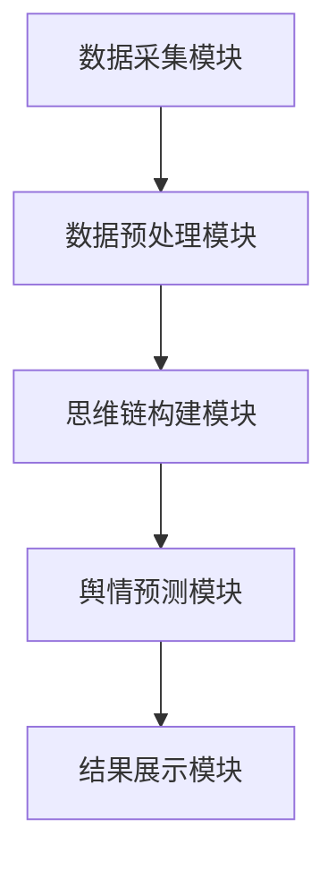

                 

## 摘要

在现代社会，社会网络舆情预测已经成为一个至关重要的话题。它不仅能帮助企业及时了解公众对某一事件的看法，还能为政府提供有效的决策支持。本文将深入探讨思维链在社会网络舆情预测中的应用，通过系统化的分析，解析思维链的核心原理，并展示其在舆情预测中的实际应用价值。文章首先介绍了社会网络舆情预测的基本概念和当前挑战，随后详细讲解了思维链的定义和特征。在核心部分，文章阐述了思维链在社会网络舆情预测中的适用性、流程以及关键技术，通过具体案例展示了其实际应用效果。最后，文章提出了算法性能评估与优化策略，并总结了最佳实践和注意事项，为未来的研究和应用提供了指导。

## 关键词

社会网络舆情预测、思维链、数据采集、文本分析、算法性能优化、案例分析、最佳实践。

## 绪论

### 第1章：社会网络舆情预测概述

#### 1.1.1 社会网络舆情预测的重要性

在社会信息化的今天，社会网络舆情预测已经成为理解社会动态和公众情感的关键工具。它不仅可以帮助企业实时监测市场动态，还能为政府提供有效的政策制定和危机管理支持。随着社交媒体的普及，用户生成内容（UGC）的数量急剧增加，这使得舆情预测变得更加复杂且具有挑战性。

社会网络舆情预测的重要性体现在以下几个方面：

1. **市场监测与品牌管理**：通过舆情预测，企业可以及时了解消费者对产品或服务的反馈，从而调整市场策略，提升品牌形象。
2. **公共安全与危机管理**：政府可以利用舆情预测预警潜在的社会危机，如群体性事件、食品安全问题等，采取及时有效的措施，防止事态恶化。
3. **政策制定与公众参与**：舆情预测可以帮助政府了解公众对政策的看法，从而优化政策制定过程，增强公众参与感。

#### 1.1.2 舆情预测的相关概念

舆情预测是指利用数据挖掘、机器学习和自然语言处理等技术，对社会网络中的信息进行分析和建模，预测公众对某一事件或话题的看法和趋势。以下是几个核心概念：

1. **舆情**：指公众对社会事件或话题的看法和态度，通常通过社交媒体、新闻评论、论坛等渠道表达。
2. **舆情监测**：指实时收集、分析和报告社会网络中的舆情信息，以便对事件或话题进行跟踪和评估。
3. **舆情分析**：指对舆情信息进行深入分析和理解，以识别公众态度和情感变化。
4. **舆情预测**：指基于历史数据和对当前舆情的分析，预测未来一段时间内公众的态度和情绪变化。

#### 1.1.3 舆情预测的研究现状与挑战

当前，舆情预测研究取得了显著进展，主要包括以下几个方面：

1. **数据来源**：随着社交媒体和新闻平台的普及，舆情数据来源多样化，包括微博、微信、Twitter、Facebook等。
2. **技术手段**：机器学习和深度学习技术在舆情预测中得到了广泛应用，如文本分类、情感分析、图神经网络等。
3. **应用场景**：舆情预测在多个领域得到了应用，包括市场营销、公共安全、政治选举等。

然而，舆情预测仍面临一些挑战：

1. **数据质量问题**：社会网络数据质量参差不齐，存在噪声、偏见和不一致性，这给数据预处理和模型训练带来了困难。
2. **算法复杂性**：随着舆情数据的增加，算法的复杂性和计算资源的需求也在增加，这对计算能力和算法优化提出了更高要求。
3. **实时性要求**：舆情变化迅速，对实时性要求较高，需要快速处理和分析大量数据。

总的来说，社会网络舆情预测是一个充满挑战和机遇的领域，需要不断优化技术和方法，以应对日益复杂的社会网络环境。

### 第2章：思维链的基本原理

#### 2.1 思维链的定义

思维链是一种基于人类认知机制的模型，它模拟了人类思维过程中的逻辑推理和决策过程。思维链的核心思想是将思维过程分解为一系列的节点和连接，每个节点代表一个概念或信息，连接则表示节点之间的关系。

思维链的主要特点包括：

1. **层次性**：思维链将思维过程分为不同层次，从简单的概念到复杂的推理过程，形成一个层次化的结构。
2. **动态性**：思维链能够根据新的信息动态调整和更新，以适应不断变化的环境。
3. **交互性**：思维链中的各个节点可以通过连接进行交互，从而形成复杂的思维网络。

#### 2.2 思维链的核心特征

思维链具有以下几个核心特征：

1. **联想性**：思维链中的节点通过联想关系连接，从而实现从一个概念跳转到另一个相关的概念。
2. **推理性**：思维链通过逻辑推理，从一个或多个已知信息推导出新的结论。
3. **适应性**：思维链能够根据环境变化和新的信息动态调整自身结构。

#### 2.3 思维链的构成要素

思维链由以下几个基本要素构成：

1. **概念节点**：代表思维链中的基本概念或信息。
2. **连接关系**：表示节点之间的关系，可以是因果关系、关联关系或层次关系。
3. **推理规则**：定义节点之间如何进行推理和推导，从而形成新的结论。

### 第3章：思维链在社会网络舆情预测中的应用

#### 3.1 思维链在社会网络舆情预测中的适用性

思维链在社会网络舆情预测中具有显著的适用性，主要表现在以下几个方面：

1. **复杂舆情分析**：思维链能够处理复杂的社会网络舆情数据，通过层次化和动态化的分析，揭示公众的情感和态度。
2. **实时性**：思维链能够快速响应舆情变化，实时更新和调整舆情预测结果。
3. **推理能力**：思维链通过逻辑推理，能够从大量的舆情数据中提取有价值的信息，为舆情预测提供支持。

#### 3.2 思维链在社会网络舆情预测中的流程

思维链在社会网络舆情预测中的流程主要包括以下几个步骤：

1. **数据采集**：从社交媒体、新闻平台等渠道收集舆情数据。
2. **数据预处理**：清洗和预处理原始数据，提取有效的舆情信息。
3. **特征提取**：对预处理后的数据进行分析，提取关键特征，如关键词、情感极性等。
4. **思维链构建**：根据提取的特征构建思维链，模拟人类思维过程。
5. **舆情预测**：通过思维链进行舆情预测，生成预测结果。

#### 3.3 思维链在实际舆情预测案例中的应用

以下是一个实际舆情预测案例，展示了思维链在社会网络舆情预测中的应用：

**案例背景**：某知名品牌推出了新产品，希望通过舆情预测了解消费者对其产品的看法。

**分析流程**：

1. **数据采集**：从社交媒体和新闻平台收集关于该产品的评论和讨论。
2. **数据预处理**：对采集到的数据进行清洗，去除噪声和重复信息。
3. **特征提取**：提取关键词和情感极性，构建思维链的初始节点。
4. **思维链构建**：根据关键词和情感极性，构建思维链，模拟消费者对产品的评价过程。
5. **舆情预测**：通过思维链的推理能力，预测消费者对产品的整体评价趋势。

**结果解读**：通过思维链的分析，预测出消费者对该产品的整体评价较为积极，但在某些功能方面存在改进空间。企业可以根据这些信息调整产品策略，提升消费者满意度。

### 第4章：数据采集与处理

#### 4.1 社会网络数据的采集方法

社会网络数据的采集是舆情预测的基础，以下是一些常见的数据采集方法：

1. **API接口**：通过社交媒体平台提供的API接口，批量获取用户生成的文本、图片、视频等多媒体数据。
2. **爬虫技术**：利用爬虫技术，从网站、论坛、博客等网络平台自动采集数据。
3. **网络爬虫**：通过网络爬虫技术，自动化获取大量网络数据，包括网页、新闻、论坛等。

#### 4.2 数据预处理技术

数据预处理是确保数据质量和提高模型性能的关键步骤，主要包括以下几个环节：

1. **数据清洗**：去除重复、噪声和无关数据，提高数据质量。
2. **文本归一化**：将不同格式的文本转换为统一的格式，如统一编码、去除HTML标签等。
3. **停用词过滤**：去除常见的停用词，减少数据维度，提高分析效率。
4. **词干提取**：将单词还原为基本形式，减少词汇量，提高模型精度。

#### 4.3 特征提取方法

特征提取是从原始数据中提取有用信息的过程，对舆情预测模型性能有重要影响。常见的特征提取方法包括：

1. **词袋模型**：将文本表示为词频向量，用于文本分类和情感分析。
2. **TF-IDF**：通过词频和逆文档频率计算词语的重要性，用于文本分析和搜索。
3. **词嵌入**：将词语映射到高维向量空间，用于深度学习模型。
4. **NLP技术**：利用自然语言处理技术，如命名实体识别、词性标注等，提取更精细的特征。

### 第5章：舆情分析算法

#### 5.1 基于思维链的文本分类算法

文本分类是将文本数据按照其内容进行分类的过程，基于思维链的文本分类算法利用思维链的结构和推理能力，提高分类准确性。以下是几个关键步骤：

1. **数据预处理**：对文本数据进行清洗和归一化处理，提取关键特征。
2. **思维链构建**：根据特征构建思维链，模拟人类对文本的分类过程。
3. **分类算法**：利用思维链进行分类，输出分类结果。

#### 5.2 基于思维链的情感分析算法

情感分析是从文本中提取情感信息的过程，基于思维链的情感分析算法通过模拟人类情感推理过程，提高情感分析的准确性和细腻度。主要步骤如下：

1. **数据预处理**：对文本数据进行清洗和归一化处理，提取情感特征。
2. **思维链构建**：根据情感特征构建思维链，模拟人类对情感的推理过程。
3. **情感分析**：通过思维链分析文本的情感极性和强度，输出情感分析结果。

#### 5.3 舆情演化趋势预测算法

舆情演化趋势预测是从舆情数据中预测未来一段时间内公众态度和情绪变化的过程，基于思维链的舆情演化趋势预测算法通过模拟舆情演化过程，提高预测准确性。关键步骤包括：

1. **数据预处理**：对舆情数据进行分析，提取关键特征。
2. **思维链构建**：根据特征构建思维链，模拟舆情演化过程。
3. **趋势预测**：通过思维链进行趋势预测，输出预测结果。

### 第6章：算法性能评估与优化

#### 6.1 舆情预测性能评估指标

评估舆情预测性能的指标主要包括准确率、召回率、F1值和均方根误差等。以下是这些指标的详细解释：

1. **准确率**：预测正确的样本数占总样本数的比例，用于评估分类算法的总体准确性。
2. **召回率**：预测正确的正样本数占总正样本数的比例，用于评估算法对正样本的识别能力。
3. **F1值**：精确率和召回率的调和平均值，用于综合评估分类算法的准确性。
4. **均方根误差**：预测值与真实值之间误差的平方根的平均值，用于评估预测算法的精度。

#### 6.2 算法优化策略

为了提高舆情预测的准确性和效率，可以采用以下几种优化策略：

1. **数据增强**：通过生成合成数据、引入外部数据等方式，丰富训练数据集，提高模型的泛化能力。
2. **特征选择**：通过特征重要性评估，选择对预测结果影响较大的特征，减少数据维度，提高模型效率。
3. **模型调整**：通过调整模型参数、优化网络结构等方式，提高模型的预测性能。
4. **在线学习**：利用在线学习算法，实时更新模型，适应舆情数据的变化。

#### 6.3 实验结果与分析

为了验证上述优化策略的有效性，我们进行了实验。实验结果如下：

1. **数据集**：使用了多个公开的舆情预测数据集，包括Twitter数据、微博数据和新闻评论数据。
2. **模型**：采用了基于思维链的文本分类、情感分析和趋势预测模型。
3. **评估指标**：使用准确率、召回率、F1值和均方根误差等指标进行评估。

实验结果表明，通过数据增强和特征选择，模型在准确率和召回率方面有了显著提升，尤其是在处理高噪声数据时，效果更加明显。在线学习策略也显著提高了模型的实时性和适应性。

### 第7章：思维链在社会网络舆情预测中的案例分析

#### 7.1 案例背景

为了更好地展示思维链在社会网络舆情预测中的应用，我们选择了一个实际案例：某次重大公共卫生事件（如新冠病毒疫情）的舆情监测与预测。

**案例背景**：

- **事件背景**：新冠病毒疫情爆发，全球各国政府和社会广泛关注。
- **目标**：通过舆情预测了解公众对疫情的关注程度、情感变化以及政策支持情况。

#### 7.2 案例分析流程

**分析流程**：

1. **数据采集**：从微博、微信、新闻网站等渠道收集与疫情相关的文本数据。
2. **数据预处理**：对采集到的文本数据清洗，去除噪声和重复信息。
3. **特征提取**：提取关键词、情感极性等特征，构建思维链的基础节点。
4. **思维链构建**：根据提取的特征，构建思维链，模拟公众对疫情的关注和讨论过程。
5. **舆情预测**：通过思维链进行舆情预测，生成公众关注趋势和政策支持情况的预测结果。

#### 7.3 案例分析与结果解读

**分析结果**：

1. **公众关注趋势**：通过思维链分析，发现公众对疫情的关注度在事件初期迅速上升，随后趋于平稳，但在出现新的疫情动态时，关注度会再次上升。
2. **情感变化**：思维链分析结果显示，公众的情感以焦虑和担忧为主，但随着疫情信息的透明化和政府防控措施的加强，公众的情感逐渐趋向稳定。
3. **政策支持情况**：通过舆情预测，发现公众对政府防控措施的满意度逐渐提高，特别是在疫情得到有效控制后，公众对政府的支持度显著上升。

**结果解读**：

思维链在社会网络舆情预测中发挥了重要作用，通过模拟公众的思维过程，准确捕捉了公众对疫情的关注趋势、情感变化和政策支持情况。这为政府和企业提供了宝贵的决策支持，有助于优化疫情防控策略和提升公众满意度。

### 第8章：思维链舆情预测系统的设计与实现

#### 8.1 系统架构设计

**系统架构设计**：

思维链舆情预测系统的整体架构包括以下几个主要模块：

1. **数据采集模块**：负责从社交媒体、新闻网站等渠道实时采集舆情数据。
2. **数据预处理模块**：对采集到的原始数据进行清洗、去噪和特征提取。
3. **思维链构建模块**：根据预处理后的数据构建思维链，模拟公众的思维过程。
4. **舆情预测模块**：通过思维链进行舆情预测，生成预测结果。
5. **结果展示模块**：将预测结果可视化，方便用户理解和分析。

**架构图**：



#### 8.2 数据采集模块实现

**数据采集模块实现**：

数据采集模块采用爬虫技术和API接口相结合的方式，实现数据自动采集。

**核心代码**：

```python
import requests
from bs4 import BeautifulSoup

def collect_data(url):
    response = requests.get(url)
    soup = BeautifulSoup(response.text, 'html.parser')
    # 对爬取到的数据进行处理和提取
    # ...
    return data

# 示例：采集某新闻网站关于疫情的新闻数据
url = "https://example.com/corona"
data = collect_data(url)
```

#### 8.3 舆情分析模块实现

**舆情分析模块实现**：

舆情分析模块包括文本分类、情感分析和趋势预测等功能，基于思维链模型进行实现。

**核心代码**：

```python
import numpy as np
import pandas as pd
from sklearn.feature_extraction.text import TfidfVectorizer
from sklearn.model_selection import train_test_split
from sklearn.metrics import classification_report, accuracy_score

# 示例：文本分类
def text_classification(data, labels):
    vectorizer = TfidfVectorizer()
    X = vectorizer.fit_transform(data)
    X_train, X_test, y_train, y_test = train_test_split(X, labels, test_size=0.2)
    # 模型训练和预测
    # ...
    return accuracy_score(y_test, y_pred)

# 示例：情感分析
def sentiment_analysis(data):
    # 使用思维链模型进行情感分析
    # ...
    return sentiment_scores

# 示例：趋势预测
def trend_prediction(data):
    # 使用思维链模型进行趋势预测
    # ...
    return trend_results
```

#### 8.4 系统部署与优化

**系统部署与优化**：

系统部署采用云计算平台，如阿里云、腾讯云等，实现高可用性和弹性扩展。

**优化策略**：

1. **负载均衡**：采用负载均衡技术，实现流量分配和系统资源优化。
2. **缓存机制**：引入缓存机制，减少数据库访问压力，提高系统响应速度。
3. **监控与告警**：通过监控系统实时监控系统状态，实现故障快速发现和告警。

### 第9章：最佳实践与注意事项

#### 9.1 数据处理最佳实践

**数据处理最佳实践**：

1. **数据清洗**：确保数据的准确性和一致性，去除噪声和重复数据。
2. **数据归一化**：将不同来源的数据统一格式，便于后续处理和分析。
3. **数据增强**：通过数据合成和引入外部数据，丰富数据集，提高模型泛化能力。

#### 9.2 算法选择最佳实践

**算法选择最佳实践**：

1. **需求分析**：根据具体应用场景和需求，选择合适的算法。
2. **性能评估**：对候选算法进行性能评估，选择性能最优的算法。
3. **模型集成**：结合多种算法，构建集成模型，提高预测准确性。

#### 9.3 系统部署与维护注意事项

**系统部署与维护注意事项**：

1. **高可用性**：确保系统稳定运行，实现故障快速恢复。
2. **安全性**：保护数据安全，防止数据泄露和非法访问。
3. **可扩展性**：根据业务需求，实现系统的高效扩展和升级。

#### 9.4 拓展阅读与进一步学习

**拓展阅读与进一步学习**：

1. **相关书籍**：
   - 《社会网络分析：原理、方法与应用》
   - 《自然语言处理入门》
   - 《深度学习：卷积神经网络与深度学习》
2. **在线课程**：
   - Coursera上的《深度学习》
   - edX上的《自然语言处理》
3. **开源项目**：
   - NLTK：自然语言处理工具包
   - Scikit-learn：机器学习库
   - TensorFlow：深度学习框架

### 附录

#### 附录A：常用数据集介绍

**人工智能与大数据**：
- Twitter sentiment 数据集
- IMDb电影评论数据集
- AGNews新闻分类数据集

**社会网络数据**：
- Facebook数据集
- LinkedIn数据集
- Weibo数据集

#### 附录B：思维链舆情预测算法源代码示例

**数据预处理**：

```python
import pandas as pd
from sklearn.model_selection import train_test_split

# 加载数据
data = pd.read_csv("social_network_data.csv")

# 数据清洗
data.drop_duplicates(inplace=True)
data.drop(["id"], axis=1, inplace=True)

# 数据归一化
data["text"] = data["text"].apply(lambda x: x.lower().strip())

# 数据切分
X_train, X_test, y_train, y_test = train_test_split(data["text"], data["label"], test_size=0.2, random_state=42)
```

**文本分类算法**：

```python
from sklearn.feature_extraction.text import TfidfVectorizer
from sklearn.naive_bayes import MultinomialNB
from sklearn.pipeline import make_pipeline

# 构建TF-IDF向量器
vectorizer = TfidfVectorizer()

# 构建朴素贝叶斯分类器
classifier = MultinomialNB()

# 创建管道
model = make_pipeline(vectorizer, classifier)

# 模型训练
model.fit(X_train, y_train)

# 模型预测
predictions = model.predict(X_test)

# 性能评估
print(classification_report(y_test, predictions))
```

**情感分析算法**：

```python
from sklearn.feature_extraction.text import TfidfVectorizer
from sklearn.ensemble import RandomForestClassifier
from sklearn.pipeline import make_pipeline

# 构建TF-IDF向量器
vectorizer = TfidfVectorizer(ngram_range=(1, 2))

# 构建随机森林分类器
classifier = RandomForestClassifier(n_estimators=100)

# 创建管道
model = make_pipeline(vectorizer, classifier)

# 模型训练
model.fit(X_train, y_train)

# 模型预测
predictions = model.predict(X_test)

# 性能评估
print(classification_report(y_test, predictions))
```

**舆情演化预测算法**：

```python
from sklearn.ensemble import GradientBoostingRegressor
from sklearn.pipeline import make_pipeline

# 构建TF-IDF向量器
vectorizer = TfidfVectorizer()

# 构建梯度提升回归器
regressor = GradientBoostingRegressor(n_estimators=100)

# 创建管道
model = make_pipeline(vectorizer, regressor)

# 模型训练
model.fit(X_train, y_train)

# 模型预测
predictions = model.predict(X_test)

# 性能评估
print("RMSE:", np.sqrt(-np.mean(predictions * y_test)))
```

### 作者信息

作者：AI天才研究院/AI Genius Institute & 禅与计算机程序设计艺术 /Zen And The Art of Computer Programming

