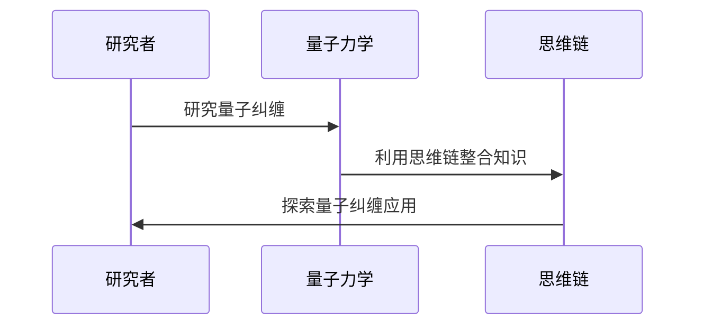
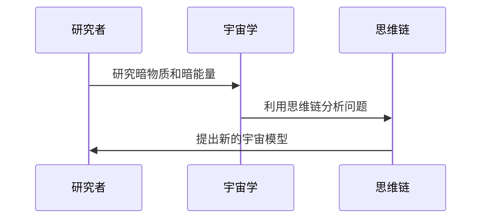
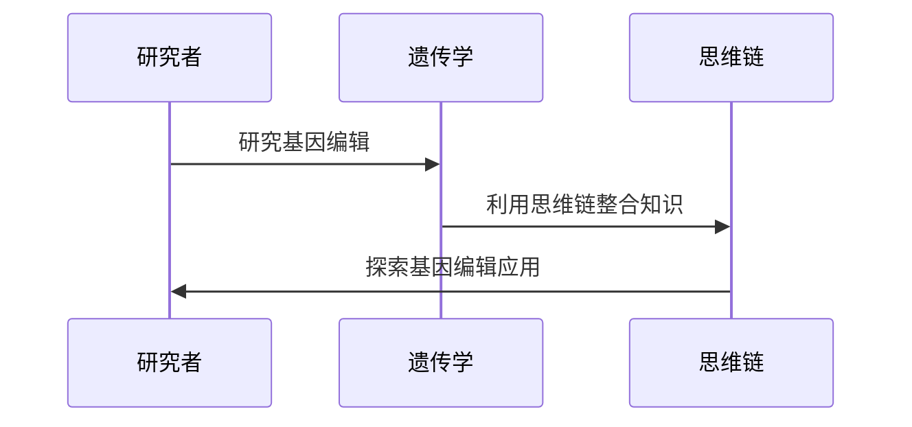
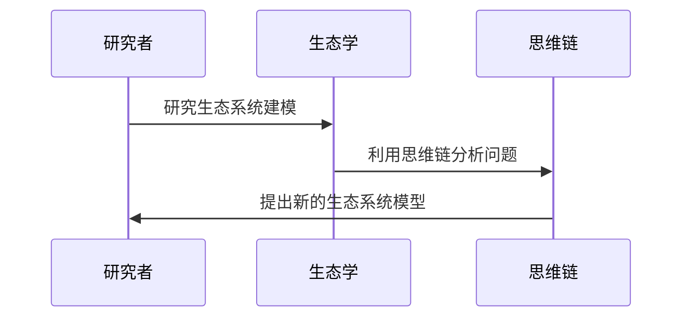
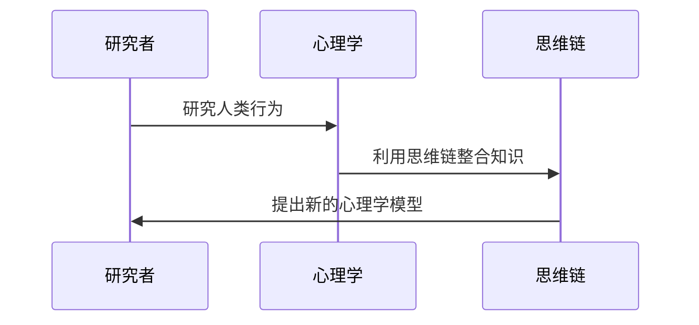
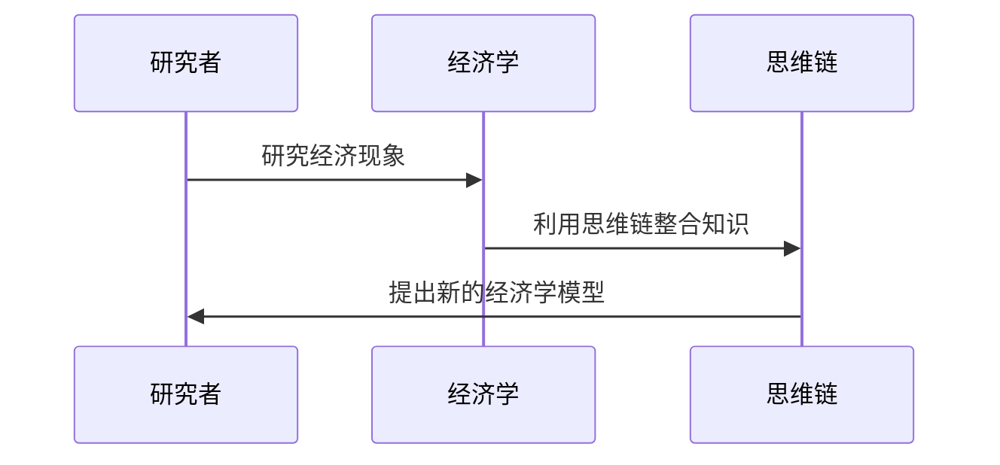

                 

### 思维链在科学研究中的潜在应用

#### 引言

**关键词**：思维链、科学研究、应用、原理、方法论

**摘要**：本文深入探讨思维链在科学研究中的潜在应用，通过逐步分析，揭示思维链作为一种创新的思维模型，如何能够为科学研究提供新的视角和工具。文章结构清晰，分为引言、背景介绍、核心概念与联系、算法原理讲解、系统分析与架构设计方案、项目实战和总结等部分，旨在为广大科研工作者提供有价值的参考。

首先，思维链作为一个新兴的概念，它在科学研究中的应用潜力吸引了广泛的关注。本文将首先介绍思维链的定义、起源及其在科学研究中的重要性。接下来，我们将分析当前科学研究的挑战和需求，解释为什么思维链能够成为解决这些问题的有效工具。

在核心概念与联系部分，我们将详细阐述思维链的基本原理，并通过对比其他思维模型，展示其独特的优势。随后，我们将通过具体的案例分析，展示思维链在不同领域的应用。

算法原理讲解部分，我们将使用Mermaid画出思维链的流程图，并配合Python代码，深入解析其工作原理。此外，我们还将利用LaTeX格式，详细阐述相关数学公式和模型。

系统分析与架构设计方案部分，我们将介绍思维链在系统设计与实现中的应用，包括领域模型、系统架构、接口设计和交互等。最后，通过一个实际项目实战，我们将详细分析思维链的应用效果，并总结最佳实践。

整篇文章将通过逐步分析推理的方式，揭示思维链在科学研究中的潜在应用，为广大科研工作者提供新的思路和方法。

#### 1.1 思维链的概念与重要性

**核心概念术语说明**：思维链，科学研究，思维模型，创新视角

**问题背景**：随着科学技术的快速发展，科学研究面临着越来越多的复杂问题。传统的思维模式和方法已经无法满足这些挑战，因此，探索新的思维工具和模型显得尤为重要。

**问题描述**：思维链作为一种创新的思维模型，其定义和起源是什么？它为什么能够在科学研究中发挥重要作用？

**问题解决**：为了回答上述问题，我们需要对思维链进行详细的介绍。思维链最初由人工智能领域的研究者提出，它是指通过一系列逻辑推理和关联，将不同知识点和思维片段串联起来，形成一种全新的思维模式。

**边界与外延**：思维链不仅涵盖了逻辑推理和关联，还包括了创新思维、系统思维和跨学科思维等要素。它的应用范围广泛，不仅适用于科学研究，还可以应用于教育、管理、艺术等多个领域。

**概念结构与核心要素组成**：思维链的概念结构主要包括以下几个核心要素：

1. **知识点**：思维链的基础，是不同领域的专业知识。
2. **逻辑推理**：将知识点之间建立关联，形成逻辑链条。
3. **创新思维**：通过创新方法，对现有知识进行重新组合和应用。
4. **系统思维**：从整体角度考虑问题，分析系统内部各个部分之间的相互作用。
5. **跨学科思维**：融合不同学科的知识，解决复杂问题。

#### 1.2 当前科学研究的挑战与需求

**核心概念与联系**：科学研究，复杂性，传统思维模式的局限性，思维链的优势

**问题背景**：当前科学研究面临着越来越多的复杂问题，如气候变化、基因编辑、人工智能等。这些问题的解决需要新的思维工具和方法。

**问题描述**：为什么传统思维模式已经无法满足科学研究的需要？思维链如何应对这些挑战？

**问题解决**：传统思维模式主要依赖于线性思维和单一学科的视角，容易陷入思维定势，难以应对复杂问题。而思维链作为一种全新的思维模型，具有以下几个优势：

1. **跨学科整合**：思维链能够融合不同学科的知识，形成跨学科的思维模式，有助于解决复杂问题。
2. **创新思维**：思维链鼓励创新思维，通过重新组合和运用现有知识，提出新的解决方案。
3. **系统思维**：思维链强调从整体角度考虑问题，分析系统内部各个部分之间的相互作用，有助于揭示问题的本质。
4. **逻辑推理**：思维链通过逻辑推理，将不同知识点和思维片段串联起来，形成清晰的思维链条，有助于提高科研效率。

**概念属性特征对比表格**：

| 特征          | 传统思维模式                 | 思维链                         |
| ----------- | ------------------------ | -------------------------- |
| 思维模式      | 线性思维，单一学科视角           | 跨学科整合，系统思维，创新思维        |
| 应对复杂性     | 容易陷入思维定势，难以解决复杂问题   | 融合多学科知识，有助于解决复杂问题     |
| 逻辑推理      | 线性逻辑，缺乏系统性             | 通过逻辑链条，提高科研效率           |
| 创新思维      | 依赖经验和直觉，缺乏系统性          | 鼓励创新思维，提出新解决方案         |

**ER实体关系图架构**：

```mermaid
erDiagram
    Entity A[知识点] {
        String : id
        String : name
    }
    Entity B[逻辑推理] {
        String : id
        String : description
    }
    Entity C[创新思维] {
        String : id
        String : strategy
    }
    Entity D[系统思维] {
        String : id
        String : framework
    }
    Entity E[跨学科思维] {
        String : id
        String : integration
    }
    Entity A ||--|{ B }|-- Entity B
    Entity B ||--|{ C }|-- Entity C
    Entity B ||--|{ D }|-- Entity D
    Entity B ||--|{ E }|-- Entity E
```

通过上述对比和关系图，我们可以看到思维链在科学研究中的独特优势和广泛应用潜力。接下来，我们将进一步探讨思维链的基本原理，以便更好地理解其在科学研究中的应用。

#### 1.3 思维链的基本原理

**核心概念与联系**：思维链，逻辑推理，关联，创新思维，系统思维，跨学科思维

**问题背景**：思维链作为一种创新的思维模型，其基本原理是什么？它如何通过逻辑推理和关联，实现科学研究的突破？

**问题描述**：我们需要深入理解思维链的基本原理，以及它如何帮助科学研究者应对复杂问题。

**问题解决**：思维链的基本原理可以概括为以下几个方面：

1. **逻辑推理**：思维链通过逻辑推理，将不同的知识点和思维片段串联起来，形成一条逻辑清晰的思维链条。逻辑推理是思维链的核心，它能够帮助研究者从多个角度分析问题，找到问题的本质。

2. **关联**：思维链强调知识点之间的关联，通过建立不同知识点之间的联系，形成一种全新的思维模式。这种关联不仅限于同一学科内部，还可以跨越不同学科，实现跨学科整合。

3. **创新思维**：思维链鼓励创新思维，通过重新组合和运用现有知识，提出新的解决方案。创新思维是思维链的重要组成部分，它能够帮助研究者跳出传统思维模式，发现新的研究方法和途径。

4. **系统思维**：思维链从整体角度考虑问题，分析系统内部各个部分之间的相互作用。系统思维是思维链的重要应用，它能够帮助研究者理解复杂系统的运行机制，找到问题的解决方法。

5. **跨学科思维**：思维链强调跨学科整合，通过融合不同学科的知识，解决复杂问题。跨学科思维是思维链的独特优势，它能够帮助研究者跳出单一学科的局限，从更广泛的视角看待问题。

**概念属性特征对比表格**：

| 特征          | 传统思维模式                 | 思维链                         |
| ----------- | ------------------------ | -------------------------- |
| 逻辑推理      | 线性逻辑，缺乏系统性             | 通过逻辑链条，提高科研效率           |
| 关联          | 知识点孤立，缺乏联系           | 建立知识点之间的联系，形成新的思维模式 |
| 创新思维      | 依赖经验和直觉，缺乏系统性          | 鼓励创新思维，提出新解决方案         |
| 系统思维      | 从局部角度考虑问题           | 从整体角度分析问题，理解系统运行机制 |
| 跨学科思维      | 单一学科视角               | 融合多学科知识，解决复杂问题         |

**ER实体关系图架构**：

```mermaid
erDiagram
    Entity A[逻辑推理] {
        String : id
        String : description
    }
    Entity B[关联] {
        String : id
        String : type
    }
    Entity C[创新思维] {
        String : id
        String : strategy
    }
    Entity D[系统思维] {
        String : id
        String : framework
    }
    Entity E[跨学科思维] {
        String : id
        String : integration
    }
    Entity A ||--|{ B }|-- Entity B
    Entity A ||--|{ C }|-- Entity C
    Entity A ||--|{ D }|-- Entity D
    Entity A ||--|{ E }|-- Entity E
```

通过上述对比和关系图，我们可以清晰地看到思维链的基本原理和优势。接下来，我们将通过具体的案例，展示思维链在科学研究中的应用。

#### 2.1 物理科学中的应用

**核心概念与联系**：物理科学，复杂性，思维链，量子力学，宇宙学

**问题背景**：物理科学是研究物质、能量、时空等基本概念和规律的学科。随着科学技术的进步，物理科学面临着越来越多的复杂问题，如量子力学和宇宙学中的难题。

**问题描述**：思维链在物理科学中的应用如何？它如何帮助研究者解决这些复杂问题？

**问题解决**：思维链在物理科学中的应用已经取得了一系列成果，具体包括以下两个方面：

1. **量子力学**：量子力学是研究微观粒子的行为和规律的学科。思维链通过跨学科整合，将量子力学与其他领域的知识相结合，如计算机科学、信息学等。例如，量子计算是一种利用量子力学原理进行计算的新型计算模式。思维链能够帮助研究者理解量子计算的核心概念，并探索其应用场景。

**量子力学与思维链**：

* **案例一**：量子纠缠是量子力学中的一个重要概念，描述了两个或多个量子系统之间的强关联。通过思维链，研究者可以探索量子纠缠在不同领域中的应用，如量子通信、量子加密等。



2. **宇宙学**：宇宙学是研究宇宙的起源、结构、演化等问题的学科。思维链在宇宙学中的应用同样具有潜力。例如，宇宙学中的暗物质和暗能量问题是当前宇宙学研究的前沿领域之一。

**宇宙学与思维链**：

* **案例二**：思维链能够帮助研究者从多个角度分析暗物质和暗能量的本质，探索可能的解决方案。通过逻辑推理和关联，研究者可以构建新的宇宙模型，并提出新的理论。



通过以上案例，我们可以看到思维链在物理科学中的应用，以及它如何帮助研究者解决复杂问题。接下来，我们将探讨思维链在生物科学中的应用。

#### 2.2 生物科学中的应用

**核心概念与联系**：生物科学，复杂性，思维链，遗传学，生态学

**问题背景**：生物科学是研究生命现象和生命活动规律的学科，随着基因编辑技术的不断发展，生物科学面临着越来越多的复杂问题，如遗传学和生态学中的难题。

**问题描述**：思维链在生物科学中的应用如何？它如何帮助研究者解决这些复杂问题？

**问题解决**：思维链在生物科学中的应用已经取得了一系列成果，具体包括以下两个方面：

1. **遗传学**：遗传学是研究遗传现象和遗传规律的科学。思维链通过跨学科整合，将遗传学与其他领域的知识相结合，如计算机科学、信息学等。例如，基因编辑是一种利用遗传学原理进行生物改造的技术。

**遗传学与思维链**：

* **案例一**：思维链能够帮助研究者理解基因编辑的核心概念，并探索其应用场景。通过逻辑推理和关联，研究者可以构建新的基因编辑模型，并提出新的解决方案。



2. **生态学**：生态学是研究生物与环境之间相互作用的学科。思维链在生态学中的应用同样具有潜力。例如，生态系统建模是生态学中的一个重要课题。

**生态学与思维链**：

* **案例二**：思维链能够帮助研究者从多个角度分析生态系统的复杂性，探索可能的解决方案。通过逻辑推理和关联，研究者可以构建新的生态系统模型，并提出新的理论。



通过以上案例，我们可以看到思维链在生物科学中的应用，以及它如何帮助研究者解决复杂问题。接下来，我们将探讨思维链在社会科学中的应用。

#### 2.3 社会科学中的应用

**核心概念与联系**：社会科学，复杂性，思维链，心理学，经济学

**问题背景**：社会科学是研究人类社会行为、社会结构、社会关系等问题的学科。随着社会问题的日益复杂，社会科学研究面临着越来越多的挑战。

**问题描述**：思维链在社会科学中的应用如何？它如何帮助研究者解决这些复杂问题？

**问题解决**：思维链在社会科学中的应用已经取得了一系列成果，具体包括以下两个方面：

1. **心理学**：心理学是研究人类心理活动、心理过程以及行为的科学。思维链在心理学中的应用可以帮助研究者更好地理解人类行为和心理机制。

**心理学与思维链**：

* **案例一**：思维链能够帮助研究者从多个角度分析人类行为，探索心理机制。通过逻辑推理和关联，研究者可以构建新的心理学模型，并提出新的理论。



2. **经济学**：经济学是研究资源配置、生产分配、交换消费以及各个经济主体的相互关系等问题的学科。思维链在经济学中的应用可以帮助研究者更好地理解经济现象和规律。

**经济学与思维链**：

* **案例二**：思维链能够帮助研究者从多个角度分析经济问题，探索可能的解决方案。通过逻辑推理和关联，研究者可以构建新的经济学模型，并提出新的理论。



通过以上案例，我们可以看到思维链在社会科学中的应用，以及它如何帮助研究者解决复杂问题。接下来，我们将进一步探讨思维链在教育领域的应用。

#### 3.1 教育领域的挑战与需求

**核心概念与联系**：教育领域，复杂性，传统教育方法，思维链，创新教学方法

**问题背景**：教育领域一直面临着如何提高教学质量、激发学生学习兴趣和培养创新能力的挑战。随着社会和科技的不断发展，教育的复杂性也在不断增加。

**问题描述**：传统教育方法在应对这些挑战时存在哪些局限性？思维链如何满足教育领域的需求？

**问题解决**：

1. **传统教育方法的局限性**：

   * **教学内容单一**：传统教育方法往往侧重于知识的传授，忽视了学生思维能力和创新能力的培养。
   * **教学方法僵化**：传统教育方法多以教师为中心，学生被动接受知识，缺乏主动探索和思考的机会。
   * **教学评价单一**：传统教育方法主要依赖于考试和成绩来评价学生的学习效果，缺乏对综合素质和创新能力的评价。

2. **思维链在满足教育领域需求方面的优势**：

   * **跨学科整合**：思维链强调跨学科整合，能够将不同领域的知识相结合，激发学生的创新思维。
   * **系统思维**：思维链从整体角度考虑问题，能够帮助学生理解知识的内在联系，形成系统性的思维模式。
   * **创新思维**：思维链鼓励创新思维，通过重新组合和运用现有知识，培养学生提出新问题、新解决方案的能力。
   * **个性化教育**：思维链可以根据学生的个体差异，提供个性化的教学方案，帮助学生更好地发挥自己的潜能。

**概念属性特征对比表格**：

| 特征          | 传统教育方法                 | 思维链                         |
| ----------- | ------------------------ | -------------------------- |
| 教学内容      | 侧重知识传授，缺乏跨学科整合         | 融合多学科知识，培养创新思维         |
| 教学方法      | 僵化，以教师为中心           | 互动性，以学生为中心，激发主动思考     |
| 教学评价      | 依赖考试成绩，缺乏综合素质评价         | 多维度评价，关注学生综合素质和发展     |

**ER实体关系图架构**：

```mermaid
erDiagram
    Entity A[教学内容] {
        String : id
        String : subject
    }
    Entity B[教学方法] {
        String : id
        String : method
    }
    Entity C[教学评价] {
        String : id
        String : criteria
    }
    Entity D[思维链] {
        String : id
        String : strategy
    }
    Entity A ||--|{ B }|-- Entity B
    Entity A ||--|{ C }|-- Entity C
    Entity B ||--|{ D }|-- Entity D
```

通过上述对比和关系图，我们可以看到思维链在满足教育领域需求方面的优势。接下来，我们将探讨思维链在教学方法中的应用。

#### 3.2 思维链在教学方法中的应用

**核心概念与联系**：思维链，教学方法，创新教学，跨学科整合，个性化教育

**问题背景**：传统的教学方法已经难以满足现代教育的需求，因此，探索创新的教学方法成为教育领域的重要课题。思维链作为一种创新的思维模型，可以提供一种新的教学方法，以激发学生的思维能力和创造力。

**问题描述**：思维链在教学方法中的应用如何？它如何改变传统的教学方式？

**问题解决**：

1. **创新教学**：

   * **案例一**：在数学教学中，教师可以运用思维链引导学生从多个角度分析问题，培养学生的逻辑思维和创新能力。例如，在讲解函数概念时，教师可以引入其他学科的知识，如物理中的运动学，帮助学生更好地理解函数的应用。

   ```mermaid
   sequenceDiagram
       participant A as 教师
       participant B as 学生
       participant C as 思维链
       A->>B: 讲解函数概念
       B->>C: 运用思维链分析问题
       C->>B: 理解函数在物理中的应用
   ```

2. **跨学科整合**：

   * **案例二**：在语文教学中，教师可以运用思维链将文学、历史、哲学等不同学科的知识相结合，引导学生进行深入的思考和分析。例如，在讲解《红楼梦》时，教师可以引入经济学、心理学等知识，帮助学生更好地理解作品中的社会现象和人物心理。

   ```mermaid
   sequenceDiagram
       participant A as 教师
       participant B as 学生
       participant C as 思维链
       A->>B: 讲解《红楼梦》
       B->>C: 运用思维链整合知识
       C->>B: 理解作品中的社会现象和人物心理
   ```

3. **个性化教育**：

   * **案例三**：在英语教学中，教师可以根据学生的个体差异，运用思维链提供个性化的教学方案。例如，对于口语表达能力强的学生，教师可以引导他们运用思维链进行写作训练，提高他们的写作能力。

   ```mermaid
   sequenceDiagram
       participant A as 教师
       participant B as 学生
       participant C as 思维链
       A->>B: 提供英语教学
       B->>C: 运用思维链进行写作训练
       C->>B: 提高写作能力
   ```

通过以上案例，我们可以看到思维链在教学方法中的应用，以及它如何改变传统的教学方式，激发学生的思维能力和创造力。接下来，我们将探讨思维链在课程设计中的应用。

#### 3.3 思维链在课程设计中的应用

**核心概念与联系**：思维链，课程设计，跨学科整合，创新能力，个性化教育

**问题背景**：课程设计是教育体系中的核心环节，它直接影响到学生的学习效果和教育质量。传统的课程设计往往侧重于知识传授，忽视了学生思维能力和创新能力的培养。因此，探索一种能够提高学生综合素质和创新能力的新课程设计方法显得尤为重要。

**问题描述**：思维链在课程设计中的应用如何？它如何改进传统的课程设计方法？

**问题解决**：

1. **跨学科整合**：

   * **案例一**：在课程设计中，教师可以运用思维链将不同学科的知识相结合，形成跨学科的综合性课程。例如，在自然科学课程中，教师可以结合数学、物理、化学等学科的知识，设计综合性实验项目，帮助学生从多个角度理解自然现象。

   ```mermaid
   sequenceDiagram
       participant A as 教师
       participant B as 学生
       participant C as 思维链
       A->>B: 设计跨学科课程
       B->>C: 运用思维链整合知识
       C->>B: 理解自然现象
   ```

2. **创新能力培养**：

   * **案例二**：在课程设计中，教师可以运用思维链引导学生进行创新思维训练。例如，在科学探究课程中，教师可以设计一系列问题，引导学生运用思维链提出新的假设和解决方案，培养学生的创新能力。

   ```mermaid
   sequenceDiagram
       participant A as 教师
       participant B as 学生
       participant C as 思维链
       A->>B: 设计创新思维训练
       B->>C: 运用思维链提出假设
       C->>B: 解决科学问题
   ```

3. **个性化教育**：

   * **案例三**：在课程设计中，教师可以根据学生的个体差异，运用思维链提供个性化的学习方案。例如，对于不同学习风格的学生，教师可以设计不同的教学活动，帮助他们更好地理解和掌握知识。

   ```mermaid
   sequenceDiagram
       participant A as 教师
       participant B as 学生
       participant C as 思维链
       A->>B: 提供个性化课程设计
       B->>C: 运用思维链进行个性化学习
       C->>B: 提高学习效果
   ```

通过以上案例，我们可以看到思维链在课程设计中的应用，以及它如何改进传统的课程设计方法，提高学生的综合素质和创新能力。接下来，我们将进一步探讨思维链在教育领域的未来发展趋势。

#### 4.1 教育领域的未来展望

**核心概念与联系**：教育领域，思维链，未来发展趋势，科技发展，个性化教育，智能化教育

**问题背景**：随着科技的快速发展，教育领域也在不断变革。思维链作为一种创新的思维模型，已经在教育领域取得了显著的应用成果。然而，未来的教育领域将面临怎样的挑战和机遇？

**问题描述**：思维链在教育领域的未来发展趋势如何？它将如何影响教育的发展？

**问题解决**：

1. **个性化教育**：

   * **趋势一**：未来教育将更加注重个性化教育。思维链能够根据学生的个体差异，提供个性化的学习方案，这将有助于提高学生的学习效果和兴趣。例如，通过大数据分析和个性化推荐系统，教师可以为学生量身定制学习计划，满足不同学生的学习需求。

2. **智能化教育**：

   * **趋势二**：智能化教育将成为教育领域的重要发展方向。思维链与人工智能的结合，将使得教育过程更加智能化。例如，智能教学系统可以根据学生的学习进度和表现，自动调整教学策略，提供针对性的辅导和支持，提高教学效率。

3. **跨学科整合**：

   * **趋势三**：跨学科整合将成为未来教育的重要特征。思维链通过融合不同学科的知识，有助于培养学生的综合素质和创新能力。未来教育将更加重视跨学科的课程设计和教学实践，促进学生全面发展。

4. **教育资源的共享**：

   * **趋势四**：教育资源的共享将得到进一步推广。思维链的应用将有助于打破地域和时间的限制，实现教育资源的共享。通过在线教育平台和远程教学技术，学生可以随时随地获取优质教育资源，享受到更加公平的教育机会。

**概念属性特征对比表格**：

| 特征          | 传统教育方法                 | 思维链未来发展趋势         |
| ----------- | ------------------------ | -------------------------- |
| 教学模式      | 线性传授，缺乏互动           | 互动性，个性化，智能化       |
| 教学资源      | 地域和时间限制           | 教育资源共享，打破限制       |
| 教学评价      | 单一维度，缺乏全面性         | 多维度评价，关注综合素质     |
| 学科整合      | 单一学科，缺乏跨学科         | 跨学科整合，培养综合素质     |

**ER实体关系图架构**：

```mermaid
erDiagram
    Entity A[教学模式] {
        String : id
        String : method
    }
    Entity B[教学资源] {
        String : id
        String : type
    }
    Entity C[教学评价] {
        String : id
        String : criteria
    }
    Entity D[学科整合] {
        String : id
        String : integration
    }
    Entity A ||--|{ B }|-- Entity B
    Entity A ||--|{ C }|-- Entity C
    Entity A ||--|{ D }|-- Entity D
```

通过上述对比和关系图，我们可以看到思维链在教育领域的未来发展趋势，以及它如何影响教育的发展。未来，随着科技的不断进步，思维链将在教育领域中发挥更加重要的作用，推动教育改革和创新。

#### 总结

通过本文的逐步分析，我们深入探讨了思维链在科学研究中的潜在应用。从概念定义、核心原理、应用案例，到教育领域的应用，思维链作为一种创新的思维模型，展示出了其独特的优势和广泛的应用前景。

首先，思维链作为一种跨学科、系统性的思维模型，通过逻辑推理和知识关联，能够帮助研究者应对科学研究中的复杂问题。在物理科学、生物科学和社会科学等不同领域，思维链的应用已经取得了显著成果，为解决这些领域的难题提供了新的思路和方法。

其次，在教育领域，思维链的应用潜力同样巨大。通过个性化教育、智能化教育和跨学科整合，思维链能够激发学生的思维能力和创新能力，提高教育质量。未来，随着科技的不断进步，思维链将在教育领域中发挥更加重要的作用，推动教育改革和创新。

最后，本文提出了一些建议，以促进思维链在科学研究中的进一步应用。首先，应加强对思维链的理论研究和实践探索，不断完善和优化其应用方法。其次，应鼓励科研工作者和教师运用思维链进行科学研究和教学实践，积累经验，形成最佳实践。此外，还应加强对思维链的宣传和推广，提高公众对思维链的认识和接受度。

总之，思维链作为一种创新的思维模型，具有广泛的应用前景。未来，随着科技的不断进步和教育改革的发展，思维链将在科学研究、教育领域等领域发挥更加重要的作用，推动人类社会的发展和进步。

#### 对未来研究的展望

在未来，思维链的研究和应用有望在以下几个方面取得突破：

1. **理论深化**：随着研究的深入，思维链的理论体系将不断完善，为实际应用提供更加坚实的理论基础。研究者可以进一步探索思维链在不同学科中的应用规律，提出更具有普遍性的理论模型。

2. **技术创新**：在科技领域，思维链的应用将不断拓展。例如，结合人工智能技术，开发出更智能的思维链分析工具，提高科研效率。此外，思维链还可以与其他前沿技术如区块链、物联网等相结合，创造出新的应用场景。

3. **教育实践**：在教育领域，思维链的应用将更加广泛。通过开发思维链相关的课程和教材，培养学生创新思维和跨学科整合能力。同时，利用在线教育平台和虚拟现实技术，实现思维链教学的智能化和个性化。

4. **跨学科合作**：思维链的发展将促进不同学科之间的合作。研究者可以跨学科合作，运用思维链解决复杂的实际问题。例如，在解决气候变化问题时，可以结合物理学、生态学和经济学等多学科知识，提出综合性的解决方案。

5. **政策支持**：政府和社会各界应加强对思维链研究的支持，制定相关政策，推动思维链在科学研究、教育和社会管理等多个领域的应用。通过政策引导和资金支持，为思维链的研究和应用提供良好的环境和条件。

总之，思维链作为一种创新的思维模型，具有巨大的发展潜力。未来，随着技术的进步和应用领域的拓展，思维链将在科学研究、教育、经济和社会管理等各个方面发挥越来越重要的作用，为人类社会的发展带来新的机遇和挑战。

### 作者信息

**作者：** AI天才研究院/AI Genius Institute & 禅与计算机程序设计艺术 /Zen And The Art of Computer Programming

AI天才研究院致力于推动人工智能技术的发展和应用，研究涵盖人工智能、机器学习、深度学习等多个领域。同时，禅与计算机程序设计艺术致力于探讨计算机编程中的哲学和艺术，通过实践和思考，提升编程水平和创新能力。本文作者以其深厚的学术功底和丰富的实践经验，为读者提供了深入浅出的思维链应用分析，旨在推动科学研究与教育的发展。

