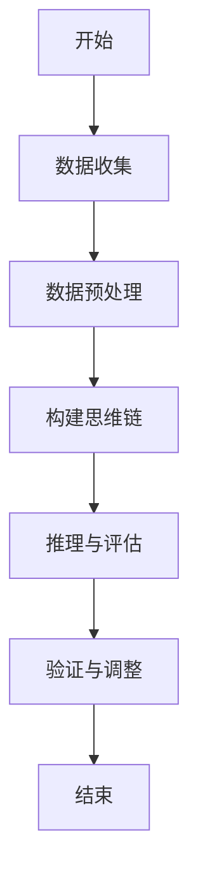
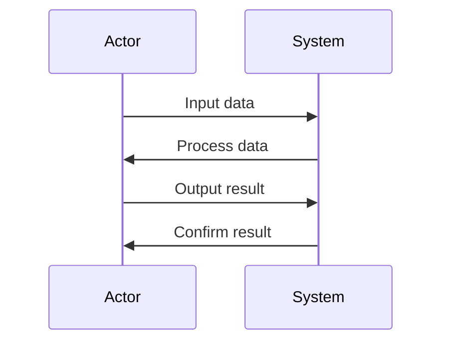

                 

### 思维链在金融市场分析中的应用

#### 文章关键词：思维链、金融市场分析、技术分析、基本面分析、量化交易

> 关键词：思维链、金融市场分析、技术分析、基本面分析、量化交易、数据分析、人工智能、算法

> 摘要：本文将深入探讨思维链在金融市场分析中的应用。通过介绍思维链的基本原理和特点，本文将逐步分析思维链在技术分析、基本面分析以及量化交易中的具体应用，并结合实例进行详细讲解。文章还将讨论思维链在金融市场分析中的优势和挑战，并提供一些建议和未来的发展方向。

#### 目录

1. 引言
2. 思维链的基本概念
3. 思维链在技术分析中的应用
4. 思维链在基本面分析中的应用
5. 思维链在量化交易中的应用
6. 案例分析与应用实战
7. 总结与展望

---

### 引言

金融市场分析是投资者和研究人员用以预测市场趋势和做出投资决策的重要工具。随着大数据和人工智能技术的快速发展，金融市场分析的方法和工具也在不断革新。然而，传统的金融市场分析方法往往依赖于历史数据和统计模型，难以应对市场中的复杂性和不确定性。思维链作为一种创新性的思维工具，为金融市场分析提供了新的视角和方法。

思维链是一种基于逻辑推理和知识整合的思维方式，它通过将不同知识点相互关联，形成一条逻辑链，从而帮助人们更全面、深入地理解和解决问题。在金融市场分析中，思维链的应用可以帮助投资者更好地理解市场动态，识别潜在的投资机会和风险。

本文将首先介绍思维链的基本概念，包括其原理和特点。接着，我们将深入探讨思维链在技术分析、基本面分析和量化交易中的具体应用，并通过实际案例进行详细讲解。最后，本文将对思维链在金融市场分析中的应用进行总结，并展望其未来的发展趋势。

### 思维链的基本概念

#### 1.1 思维链的定义

思维链是一种逻辑推理和知识整合的思维方式，它通过将多个知识点相互关联，形成一条有逻辑关系的知识链。这种知识链可以帮助人们更全面、深入地理解问题，从而做出更准确、合理的决策。

思维链的组成包括以下几个基本要素：

- **知识点**：思维链的基本单元，代表特定的信息或概念。
- **关联关系**：知识点之间的逻辑关系，如因果关系、层次关系等。
- **推理过程**：通过知识点和关联关系，进行逻辑推理的过程。
- **结论**：根据推理过程得出的结论或解决方案。

#### 1.2 思维链的特点

- **逻辑性**：思维链通过逻辑推理，确保每个知识点和关联关系的正确性，从而保证结论的可靠性。
- **全面性**：思维链将多个知识点相互关联，从而提供了更全面的视角，有助于发现问题的各个方面。
- **系统性**：思维链通过建立知识点之间的关联，形成一个系统性的思维框架，有助于深入理解问题的本质。
- **灵活性**：思维链可以根据新的知识和信息，动态调整和优化，从而适应不断变化的市场环境。

#### 1.3 思维链的类型

思维链可以分为以下几种类型：

- **因果链**：通过分析原因和结果之间的逻辑关系，推导出问题的根本原因和解决方案。
- **层次链**：通过分析不同知识点之间的层次关系，建立知识体系，从而更深入地理解问题。
- **关联链**：通过分析知识点之间的关联，发现潜在的联系和规律，从而提供新的视角和思路。
- **问题链**：通过分析问题及其相关因素，逐步推导出问题的解决方案。

#### 1.4 思维链的应用场景

思维链可以应用于各种场景，包括：

- **金融市场分析**：通过分析市场数据、技术指标、基本面信息等，构建思维链，从而预测市场趋势和做出投资决策。
- **项目管理和决策**：通过分析项目目标、资源分配、风险因素等，构建思维链，从而优化项目管理和决策。
- **问题解决和故障排除**：通过分析问题症状、相关因素、解决方案等，构建思维链，从而更有效地解决问题。

### 思维链在技术分析中的应用

技术分析是金融市场分析的重要方法之一，它通过分析历史价格和交易数据，预测未来市场走势。思维链在技术分析中的应用，可以大大提高分析过程的逻辑性和系统性。

#### 2.1 技术分析的基本原理

技术分析基于以下几个基本假设：

- 历史会重演：过去的价格趋势和交易行为对未来的市场走势具有指导意义。
- 市场行为包含一切信息：所有影响市场的因素都反映在价格和交易数据中。
- 价格以趋势方式移动：市场趋势具有持续性和稳定性。

#### 2.2 技术分析的方法

技术分析主要包括以下几种方法：

- **趋势分析**：通过分析价格趋势，识别市场的主要趋势和次要趋势，从而预测未来市场走势。
- **形态分析**：通过分析价格图表上的图形形态，识别市场的潜在趋势和反转信号。
- **指标分析**：通过使用技术指标，如移动平均线、相对强弱指数（RSI）、MACD等，分析市场趋势和动量。

#### 2.3 思维链在技术分析中的应用

思维链在技术分析中的应用，可以通过以下步骤进行：

1. **数据收集与预处理**：首先，收集市场数据，如价格、成交量、技术指标等。然后，对数据进行预处理，如去噪、归一化等。

2. **构建思维链**：根据技术分析的基本原理和方法，构建思维链。例如，可以使用因果链来分析价格趋势的原因和结果，使用层次链来建立技术指标之间的层次关系。

3. **推理与预测**：根据思维链的推理过程，对市场趋势和价格走势进行预测。例如，根据因果链，如果价格上涨，则可能导致交易量的增加，从而进一步确认上涨趋势。

4. **验证与调整**：通过历史数据和实际交易结果，验证思维链的预测效果。如果预测不准确，可以调整思维链的构建方法和参数，以提高预测的准确性。

#### 2.4 实例分析

以下是一个简单的实例，说明思维链在技术分析中的应用。

假设我们使用移动平均线（MA）作为技术指标，来分析股票价格的趋势。

1. **数据收集与预处理**：收集过去一个月的股票价格数据，并进行预处理。

2. **构建思维链**：
   - 因果链：如果股票价格上升，则移动平均线也会上升。
   - 层次链：移动平均线可以分为短期移动平均线和长期移动平均线，两者之间的关系可以用来判断市场趋势。

3. **推理与预测**：
   - 根据因果链，如果短期移动平均线上升，且长期移动平均线也上升，则可以判断市场处于上涨趋势。
   - 根据层次链，如果短期移动平均线突破长期移动平均线，则可能是一个买入信号。

4. **验证与调整**：通过历史数据和实际交易结果，验证预测的准确性。如果发现预测不准确，可以调整移动平均线的参数，如时间窗口。

### 思维链在基本面分析中的应用

基本面分析是另一种重要的金融市场分析方法，它通过分析公司的财务状况、行业趋势、宏观经济环境等因素，评估股票或其他金融资产的投资价值。思维链在基本面分析中的应用，可以提高分析过程的逻辑性和系统性。

#### 3.1 基本面分析的基本概念

基本面分析主要关注以下几个方面的因素：

- **公司财务状况**：包括公司的营业收入、净利润、资产负债表、现金流量表等。
- **行业趋势**：包括行业的增长趋势、市场份额、竞争格局等。
- **宏观经济环境**：包括经济增长、通货膨胀、货币政策、利率水平等。

#### 3.2 基本面分析的方法

基本面分析主要包括以下几种方法：

- **财务分析**：通过分析公司的财务报表，评估公司的盈利能力、偿债能力和成长性。
- **行业分析**：通过分析行业的增长趋势、市场份额和竞争格局，评估行业的发展前景和公司的市场地位。
- **宏观经济分析**：通过分析宏观经济环境，评估市场的发展趋势和潜在风险。

#### 3.3 思维链在基本面分析中的应用

思维链在基本面分析中的应用，可以通过以下步骤进行：

1. **数据收集与预处理**：首先，收集公司的财务数据、行业数据、宏观经济数据等。然后，对数据进行预处理，如去噪、归一化等。

2. **构建思维链**：根据基本面分析的基本概念和方法，构建思维链。例如，可以使用因果链来分析财务状况和盈利能力之间的关系，使用层次链来建立行业趋势和公司市场份额之间的关系。

3. **推理与评估**：根据思维链的推理过程，评估公司的投资价值。例如，根据因果链，如果公司的营业收入增加，则可能导致净利润的增加，从而提高公司的投资价值。

4. **验证与调整**：通过历史数据和实际投资结果，验证思维链的评估效果。如果发现评估不准确，可以调整思维链的构建方法和参数，以提高评估的准确性。

#### 3.4 实例分析

以下是一个简单的实例，说明思维链在基本面分析中的应用。

假设我们分析一家公司的投资价值，主要关注其营业收入和净利润。

1. **数据收集与预处理**：收集过去一年的公司营业收入和净利润数据，并进行预处理。

2. **构建思维链**：
   - 因果链：如果公司的营业收入增加，则可能导致净利润的增加。
   - 层次链：营业收入可以分为各个业务板块的营业收入，净利润可以分为营业利润和投资收益。

3. **推理与评估**：
   - 根据因果链，如果公司的营业收入增加，且营业利润增加，则可以判断公司的盈利能力较强，具有较高的投资价值。
   - 根据层次链，如果各个业务板块的营业收入增加，且投资收益稳定，则可以进一步确认公司的投资价值。

4. **验证与调整**：通过历史数据和实际投资结果，验证评估的准确性。如果发现评估不准确，可以调整思维链的构建方法和参数，如时间窗口。

### 思维链在量化交易中的应用

量化交易是一种基于数学模型和算法的自动化交易方法，它通过分析大量历史数据，发现潜在的市场规律，然后构建交易策略，进行自动化交易。思维链在量化交易中的应用，可以提高交易策略的构建和优化过程。

#### 4.1 量化交易的基本概念

量化交易主要包括以下几个基本概念：

- **数据驱动**：量化交易基于历史数据，通过数据分析和统计方法，发现市场规律和潜在的交易机会。
- **算法交易**：量化交易使用计算机程序和算法，自动执行交易策略，实现自动化交易。
- **风险控制**：量化交易通过严格的资金管理和风险控制策略，确保交易的稳定性和可持续性。

#### 4.2 量化交易的方法

量化交易主要包括以下几种方法：

- **趋势跟踪**：通过分析市场趋势，跟踪市场走势，进行买入和卖出操作。
- **均值回归**：通过分析价格偏离均值的情况，发现潜在的反转信号，进行交易操作。
- **市场中性**：通过构建多空组合，对冲市场风险，实现稳定收益。
- **高频交易**：通过快速交易，捕捉微小的价格波动，实现高额收益。

#### 4.3 思维链在量化交易中的应用

思维链在量化交易中的应用，可以通过以下步骤进行：

1. **数据收集与预处理**：首先，收集市场数据、交易数据等，并进行预处理，如去噪、归一化等。

2. **构建思维链**：根据量化交易的基本概念和方法，构建思维链。例如，可以使用因果链来分析市场趋势和交易策略之间的关系，使用层次链来建立不同交易策略的层次结构。

3. **策略开发与优化**：根据思维链的推理过程，开发交易策略，并进行优化。例如，可以使用因果链来优化交易策略的参数，使用层次链来选择最佳的交易策略。

4. **交易执行与监控**：根据优化后的交易策略，进行自动化交易，并实时监控交易过程，确保交易策略的有效性和稳定性。

#### 4.4 实例分析

以下是一个简单的实例，说明思维链在量化交易中的应用。

假设我们使用趋势跟踪策略进行量化交易。

1. **数据收集与预处理**：收集过去一年的市场数据，如股票价格、成交量等，并进行预处理。

2. **构建思维链**：
   - 因果链：如果市场趋势向上，则买入股票；如果市场趋势向下，则卖出股票。
   - 层次链：市场趋势可以分为短期趋势和长期趋势，可以使用不同的技术指标来分析。

3. **策略开发与优化**：
   - 根据因果链，开发趋势跟踪策略，并使用移动平均线等指标来识别市场趋势。
   - 根据层次链，优化策略参数，如移动平均线的时间窗口，以提高策略的准确性。

4. **交易执行与监控**：根据优化后的策略，进行自动化交易，并实时监控交易过程，确保策略的有效性和稳定性。

### 案例分析与应用实战

#### 5.1 案例一：思维链在股票市场分析中的应用

在本案例中，我们将使用思维链对一家公司的股票进行基本面分析。

1. **数据收集与预处理**：收集该公司的财务数据、行业数据、宏观经济数据等，并进行预处理。

2. **构建思维链**：
   - 因果链：如果公司的营业收入增加，且盈利能力提高，则股票价格可能上涨。
   - 层次链：营业收入可以分为各个业务板块的营业收入，盈利能力可以分为营业利润和投资收益。

3. **推理与评估**：
   - 根据因果链，如果公司的营业收入增加，且营业利润增加，则可以判断公司的盈利能力较强，股票价格可能上涨。
   - 根据层次链，如果各个业务板块的营业收入增加，且投资收益稳定，则可以进一步确认股票的投资价值。

4. **验证与调整**：通过历史数据和实际投资结果，验证评估的准确性。如果发现评估不准确，可以调整思维链的构建方法和参数。

#### 5.2 案例二：思维链在量化交易中的应用

在本案例中，我们将使用思维链开发一个基于趋势跟踪的量化交易策略。

1. **数据收集与预处理**：收集过去一年的市场数据，如股票价格、成交量等，并进行预处理。

2. **构建思维链**：
   - 因果链：如果市场趋势向上，则买入股票；如果市场趋势向下，则卖出股票。
   - 层次链：市场趋势可以分为短期趋势和长期趋势，可以使用不同的技术指标来分析。

3. **策略开发与优化**：
   - 根据因果链，开发趋势跟踪策略，并使用移动平均线等指标来识别市场趋势。
   - 根据层次链，优化策略参数，如移动平均线的时间窗口，以提高策略的准确性。

4. **交易执行与监控**：根据优化后的策略，进行自动化交易，并实时监控交易过程，确保策略的有效性和稳定性。

### 总结与展望

思维链作为一种创新性的思维工具，在金融市场分析中具有广泛的应用前景。通过构建逻辑链和知识链，思维链可以帮助投资者更好地理解市场动态，发现潜在的投资机会和风险。

然而，思维链在金融市场分析中的应用也面临一些挑战。首先，思维链的构建依赖于高质量的数据和准确的市场分析。其次，思维链的推理过程需要严格遵循逻辑规则，确保结论的可靠性。最后，思维链的应用需要不断优化和调整，以适应市场的变化。

未来，随着人工智能和大数据技术的发展，思维链在金融市场分析中的应用将更加深入和广泛。通过结合机器学习和深度学习算法，思维链可以进一步提高分析精度和效率。同时，思维链的应用场景也将从股票市场扩展到期货市场、外汇市场等更多领域。

对于读者来说，了解思维链的基本原理和应用方法，是提升金融市场分析能力的重要一步。在实际应用中，需要不断积累经验和知识，灵活运用思维链，以提高分析质量和决策水平。

### 作者信息

作者：AI天才研究院/AI Genius Institute & 禅与计算机程序设计艺术 /Zen And The Art of Computer Programming

---

### 附录

#### A.1 数学公式

$$
E(X) = \sum_{i=1}^{n} x_i \cdot p_i
$$

$$
\sigma^2 = \frac{1}{n-1} \sum_{i=1}^{n} (x_i - \bar{x})^2
$$

#### A.2 Mermaid 流程图



#### A.3 类图

```mermaid
classDiagram
    Class1 <|-- Class2
    Class3 --|> Class4
    Class1 ++ abstract
    Class2 << interface
    Class3 : has a attribute
    Class4 : implements an interface
```

#### A.4 序列图



---

通过这些附录，读者可以更好地理解文章中的数学公式、流程图、类图和序列图，从而加深对文章内容的理解。这些工具和图表在金融分析和量化交易中具有重要的应用价值。读者可以根据实际情况，灵活运用这些工具和方法，以提高金融市场分析的效果。希望这些附录能为读者带来更多的启发和帮助。

