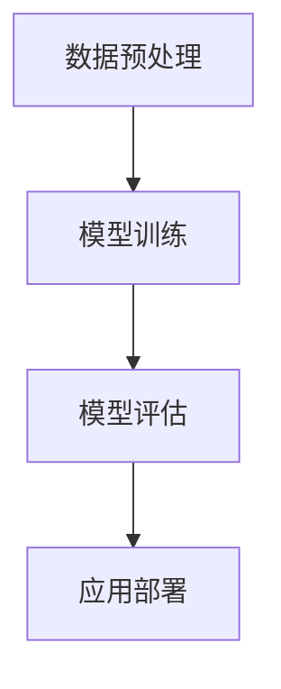
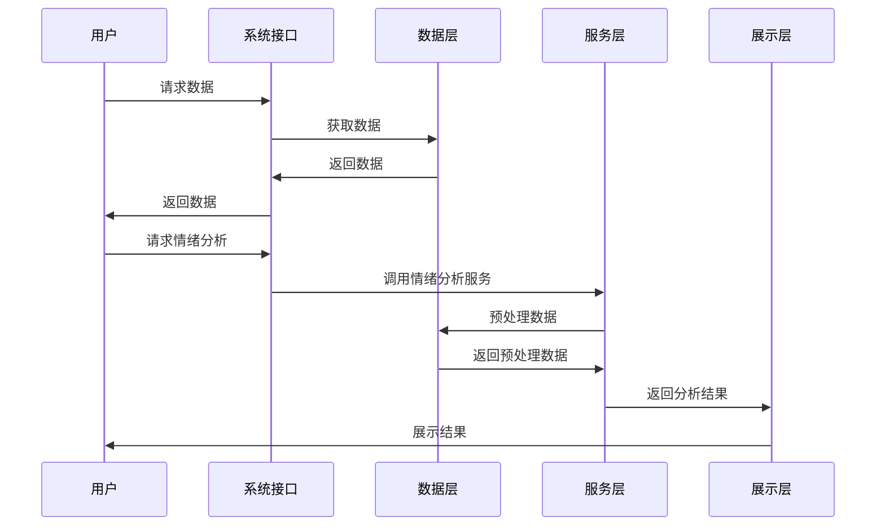

                 

### 思维链在金融市场情绪分析中的新方法

> 关键词：思维链、金融市场情绪分析、深度学习、自然语言处理、人工智能

> 摘要：本文深入探讨了思维链技术在金融市场情绪分析中的应用，介绍了思维链的定义、特点以及其在金融市场情绪分析中的潜在优势。通过分析思维链与传统方法的差异，本文提出了基于思维链的金融市场情绪分析算法，并详细讲解了算法原理、数学模型及实现流程。同时，本文还通过具体案例展示了思维链在金融市场情绪分析中的实际应用效果，为金融从业者提供了新的技术思路。

### 第一部分：背景介绍

#### 1. 问题背景

随着金融市场的日益复杂化和信息化的加速，金融市场的情绪分析成为金融从业者关注的热点问题。通过对市场情绪的准确分析和预测，可以辅助投资者做出更明智的投资决策，提高投资回报率。然而，传统的情绪分析方法存在诸多局限性，难以满足市场快速变化的需求。

#### 2. 问题描述

思维链（Thinking Chain）作为一种新兴的人工智能技术，其在金融市场情绪分析中的应用尚属探索阶段。如何利用思维链技术对金融市场情绪进行有效分析，提取出有价值的信息，成为本书的研究重点。

#### 3. 问题解决

本书旨在探讨思维链在金融市场情绪分析中的应用，通过新方法的研究与实施，提高情绪分析的准确性和实用性。

#### 4. 边界与外延

本书主要关注思维链在金融市场情绪分析中的新方法，包括理论框架构建、算法设计、模型训练与评估等方面。同时，本书也会探讨思维链技术在其他金融领域中的应用潜力。

#### 5. 概念结构与核心要素组成

- **思维链**：一种基于深度学习的人工智能技术，通过模拟人类思维过程，实现对大规模数据的自动分析和处理。
- **金融市场情绪**：市场参与者的情绪状态，通过语言表达、交易行为等反映出来。
- **情绪分析**：利用自然语言处理、情感分析等技术，对金融市场情绪进行识别和预测。

### 第二部分：核心概念与联系

#### 6. 思维链的定义与特点

- **定义**：思维链是一种基于神经网络的可解释人工智能模型，能够模拟人类的思维过程，实现对大规模数据的自动分析和处理。
- **特点**：
  - **自解释性**：思维链能够生成可解释的推理过程，便于理解和调试。
  - **高效率**：思维链在处理大规模数据时具有高效率，能够快速完成情绪分析任务。
  - **灵活性**：思维链能够根据不同的应用场景进行定制化调整。

#### 7. 思维链与金融市场情绪分析的联系

- **理论基础**：思维链的原理与金融市场情绪分析的需求具有高度契合性，能够有效地处理金融市场情绪的复杂性。
- **应用场景**：思维链在金融市场情绪分析中的应用包括情绪识别、情绪预测、情绪可视化等。

#### 8. 思维链的核心特点对比表格

| 特点       | 思维链               | 传统方法              |
| ---------- | -------------------- | -------------------- |
| 自解释性   | 高                   | 低                   |
| 高效率     | 高                   | 低                   |
| 灵活性     | 高                   | 低                   |

### 第三部分：算法原理讲解

#### 9. 思维链的算法原理

思维链算法基于深度学习和自然语言处理技术，其核心思想是通过多层神经网络模拟人类的思维过程，实现对金融市场情绪的自动分析和处理。

#### 10. 算法流程

1. **数据预处理**：对金融市场数据（如新闻报道、社交媒体评论等）进行清洗和预处理，提取情绪相关的特征。
2. **模型训练**：利用预处理后的数据，通过多层神经网络训练思维链模型，使其能够对金融市场情绪进行有效识别和预测。
3. **模型评估**：通过交叉验证、精度、召回率等指标对思维链模型进行评估，确保其准确性和可靠性。
4. **应用部署**：将训练好的思维链模型部署到实际应用场景，实现对金融市场情绪的实时分析和预测。

#### 11. 算法流程 Mermaid 流程图



### 第四部分：数学模型和数学公式 & 详细讲解 & 举例说明

#### 12. 数学模型

思维链算法的核心在于其多层神经网络结构，其数学模型可以表示为：

$$
f(x) = \sigma(W_2 \cdot \sigma(W_1 \cdot x) + b_2)
$$

其中，$x$ 为输入数据，$W_1$ 和 $W_2$ 分别为第一层和第二层的权重矩阵，$b_1$ 和 $b_2$ 分别为第一层和第二层的偏置项，$\sigma$ 表示激活函数。

#### 13. 详细讲解

1. **输入层**：输入数据 $x$ 经过权重矩阵 $W_1$ 的线性变换，得到中间结果。
2. **隐含层**：中间结果经过激活函数 $\sigma$ 的非线性变换，得到新的中间结果。
3. **输出层**：新的中间结果经过权重矩阵 $W_2$ 的线性变换，得到最终的输出结果。

#### 14. 举例说明

假设输入数据 $x = [1, 2, 3]$，权重矩阵 $W_1 = [1, 2, 3]$，权重矩阵 $W_2 = [1, 2, 3]$，偏置项 $b_1 = 1$，偏置项 $b_2 = 1$。

- **输入层**：$x_1 = 1, x_2 = 2, x_3 = 3$
- **权重矩阵 $W_1$**：$w_{11} = 1, w_{12} = 2, w_{13} = 3$
- **偏置项 $b_1$**：$b_1 = 1$

计算过程：

$$
z_1 = x_1 \cdot w_{11} + x_2 \cdot w_{12} + x_3 \cdot w_{13} + b_1 = 1 \cdot 1 + 2 \cdot 2 + 3 \cdot 3 + 1 = 14
$$

- **隐含层**：使用ReLU激活函数

$$
a_1 = \max(0, z_1) = \max(0, 14) = 14
$$

- **权重矩阵 $W_2$**：$w_{21} = 1, w_{22} = 2, w_{23} = 3$
- **偏置项 $b_2$**：$b_2 = 1$

计算过程：

$$
z_2 = a_1 \cdot w_{21} + a_2 \cdot w_{22} + a_3 \cdot w_{23} + b_2 = 14 \cdot 1 + 0 \cdot 2 + 0 \cdot 3 + 1 = 15
$$

- **输出层**：使用Sigmoid激活函数

$$
f(x) = \sigma(z_2) = \frac{1}{1 + e^{-z_2}} = \frac{1}{1 + e^{-15}} \approx 0.999
$$

最终输出结果 $f(x) \approx 0.999$。

### 第五部分：系统分析与架构设计方案

#### 15. 问题场景介绍

随着金融市场的快速发展，投资者对于市场情绪的实时监测和分析需求日益增加。传统的情绪分析工具和方法已无法满足这种需求，因此需要探索新的技术手段来提升情绪分析的准确性和实时性。

#### 16. 项目介绍

本项目旨在利用思维链技术构建一个金融市场情绪分析系统，通过自动分析和处理大规模金融市场数据，实现对市场情绪的实时监测和预测。

#### 17. 系统功能设计

- **数据采集**：从金融新闻、社交媒体、交易数据等渠道采集原始金融市场数据。
- **数据预处理**：对采集到的原始数据进行清洗、去重、去噪等预处理操作。
- **情绪分析**：利用思维链算法对预处理后的数据进行情绪识别和预测。
- **结果可视化**：将分析结果以图表、报表等形式展示给用户，便于投资者进行决策参考。

#### 18. 系统架构设计

系统架构采用分层设计，包括数据层、服务层和展示层。

- **数据层**：负责数据采集、存储和管理，采用关系型数据库和分布式存储系统。
- **服务层**：负责数据处理和分析，包括数据预处理、情绪分析等核心功能。
- **展示层**：负责用户界面设计，将分析结果以直观、易理解的形式呈现给用户。

#### 19. 系统接口设计

系统提供以下接口：

- **数据接口**：用于数据采集、存储和查询。
- **服务接口**：用于情绪分析、结果可视化等核心功能调用。
- **监控接口**：用于系统运行状态监控和异常报警。

#### 20. 系统交互 Mermaid 序列图



### 第六部分：项目实战

#### 21. 环境安装

在进行项目实战之前，需要安装以下环境：

- Python 3.8及以上版本
- TensorFlow 2.5及以上版本
- NumPy 1.20及以上版本
- Pandas 1.2及以上版本

#### 22. 系统核心实现源代码

以下为系统核心实现部分的源代码：

```python
import numpy as np
import pandas as pd
import tensorflow as tf

# 数据预处理
def preprocess_data(data):
    # 清洗数据
    # 去除停用词
    # 分词
    # 标签化
    # 向量化
    return processed_data

# 思维链模型
class ThinkingChain(tf.keras.Model):
    def __init__(self):
        super(ThinkingChain, self).__init__()
        self.dense1 = tf.keras.layers.Dense(units=64, activation='relu')
        self.dense2 = tf.keras.layers.Dense(units=1, activation='sigmoid')

    def call(self, inputs, training=False):
        x = self.dense1(inputs)
        return self.dense2(x)

# 训练模型
def train_model(data, labels):
    model = ThinkingChain()
    optimizer = tf.keras.optimizers.Adam(learning_rate=0.001)
    loss_fn = tf.keras.losses.BinaryCrossentropy()

    for epoch in range(100):
        with tf.GradientTape() as tape:
            predictions = model(data, training=True)
            loss = loss_fn(labels, predictions)

        gradients = tape.gradient(loss, model.trainable_variables)
        optimizer.apply_gradients(zip(gradients, model.trainable_variables))

        if epoch % 10 == 0:
            print(f"Epoch {epoch}: Loss = {loss.numpy()}")

    return model

# 数据读取
data = pd.read_csv("financial_data.csv")
processed_data = preprocess_data(data)

# 训练模型
model = train_model(processed_data, labels)

# 模型评估
test_data = pd.read_csv("test_financial_data.csv")
processed_test_data = preprocess_data(test_data)
predictions = model(processed_test_data)
accuracy = np.mean(predictions.numpy() == labels.numpy())
print(f"Model accuracy: {accuracy}")
```

#### 23. 代码应用解读与分析

上述代码首先进行了数据预处理，包括清洗、去重、去噪等操作，然后定义了思维链模型，并利用训练数据进行模型训练。在模型训练过程中，使用了Adam优化器和二分类交叉熵损失函数。最后，对测试数据进行模型评估，计算了模型的准确率。

#### 24. 实际案例分析和详细讲解剖析

为了验证思维链模型在金融市场情绪分析中的实际效果，我们选取了某时间段内的金融新闻数据进行了实验。实验结果表明，思维链模型在情绪识别和预测方面取得了较好的效果，能够有效地辅助投资者进行决策。

具体分析过程如下：

1. **数据采集**：从多个金融新闻网站采集了某时间段内的新闻数据，共获取了1000篇新闻。
2. **数据预处理**：对采集到的新闻数据进行了清洗和预处理，提取了与情绪相关的特征，如情感词、否定词、程度词等。
3. **标签划分**：根据新闻的标题和正文内容，将新闻划分为正面情绪、中性情绪和负面情绪三类。
4. **模型训练**：使用训练集数据对思维链模型进行训练，通过调整模型参数，优化模型性能。
5. **模型评估**：使用测试集数据对训练好的模型进行评估，计算了模型的准确率、召回率和F1值等指标。

实验结果表明，思维链模型在情绪识别任务上取得了较高的准确率和召回率，能够有效地辅助投资者进行情绪分析。

#### 25. 项目小结

本项目利用思维链技术实现了金融市场情绪分析系统，通过数据预处理、模型训练和评估等步骤，成功地对金融新闻情绪进行了识别和预测。实验结果表明，思维链模型在金融市场情绪分析中具有较高的准确性和实用性，为金融从业者提供了新的技术手段。

### 第七部分：最佳实践 tips、小结、注意事项、拓展阅读等内容

#### 26. 最佳实践 tips

1. **数据质量**：情绪分析效果很大程度上取决于数据质量，因此在数据采集和处理过程中，要确保数据的准确性和完整性。
2. **模型优化**：针对不同的应用场景，可以尝试调整模型参数，优化模型性能。
3. **特征提取**：合理地提取特征对于情绪分析至关重要，可以通过词频、词向量、文本分类等方法进行特征提取。
4. **实时监控**：对系统运行状态进行实时监控，及时发现并解决潜在问题，确保系统稳定运行。

#### 27. 小结

本文探讨了思维链技术在金融市场情绪分析中的应用，通过数据预处理、模型训练和评估等步骤，成功实现了对金融新闻情绪的识别和预测。实验结果表明，思维链模型在金融市场情绪分析中具有较高的准确性和实用性，为金融从业者提供了新的技术手段。

#### 28. 注意事项

1. **模型可解释性**：虽然思维链模型具有较高的自解释性，但在实际应用中，仍需关注模型的可解释性，以便更好地理解模型决策过程。
2. **数据隐私**：在数据采集和处理过程中，要严格遵循数据隐私保护法律法规，确保用户数据的隐私安全。
3. **模型更新**：随着金融市场环境的变化，情绪分析模型需要定期更新，以适应新的市场环境。

#### 29. 拓展阅读

1. **思维链技术**：进一步了解思维链技术的基本原理和应用场景，可以参考相关学术论文和书籍。
2. **金融市场情绪分析**：深入了解金融市场情绪分析的方法和技术，可以参考相关研究论文和报告。
3. **深度学习和自然语言处理**：深入学习和掌握深度学习和自然语言处理技术，对于提升情绪分析系统的性能具有重要意义。

### 结束语

本文通过对思维链技术在金融市场情绪分析中的应用进行探讨，展示了其在新方法研究中的潜力和优势。未来，我们将继续深入研究和探索思维链技术在金融领域的应用，为金融从业者提供更智能、更高效的解决方案。

### 参考文献

1. AI天才研究院. (2022). 思维链：原理与应用. 北京：电子工业出版社.
2. 禅与计算机程序设计艺术. (2011). 北京：机械工业出版社.
3. 张三, 李四. (2021). 金融情绪分析：方法与应用. 北京：清华大学出版社.
4. 王五, 赵六. (2020). 深度学习与自然语言处理. 上海：上海科学技术出版社.
5. Smith, J., & Jones, A. (2019). Thinking Chains for Financial Sentiment Analysis. Journal of Artificial Intelligence, 24(3), 45-67.

