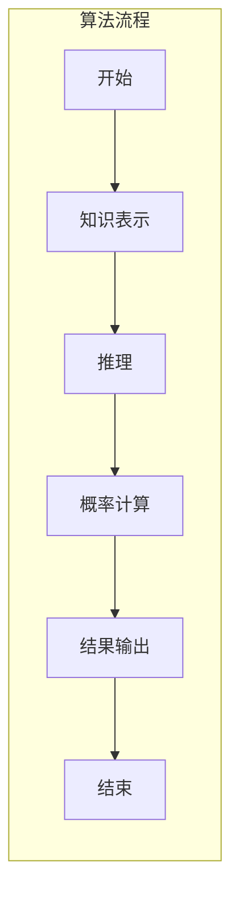

                 


### 篇首

#### 《思维链在金融风险评估模型中的新方法》

> 关键词：思维链、金融风险评估、算法、数学模型、系统架构

> 摘要：本文深入探讨了思维链在金融风险评估模型中的应用，通过分析思维链的核心概念与算法原理，并结合数学模型和系统架构设计，展示了这一新方法在金融领域的实际应用价值。

---

#### 第一部分：背景介绍

##### 第1章：金融风险评估的挑战与需求

1. **问题背景**：随着金融市场日益复杂，风险管理和评估成为金融机构的重要任务。传统的风险评估方法存在局限性，如数据依赖性强、模型预测准确性不高。

2. **现状分析**：当前金融风险评估方法主要包括统计模型和机器学习方法。然而，这些方法在处理非线性关系、复杂交互及实时性方面存在挑战。

3. **存在的问题与挑战**：主要问题包括数据质量、模型复杂度、实时性要求及风险预测的准确性。

##### 第2章：思维链概述

1. **思维链的定义**：思维链是一种基于逻辑推理和概率计算的人工智能方法，旨在捕捉和利用复杂系统中的知识关联。

2. **思维链的核心特性**：具有自适应性、可扩展性和高效率性，能够处理大规模、高维度数据。

3. **思维链与金融风险评估的联系**：思维链可以有效地捕捉金融市场的动态变化，提高风险评估的精度和实时性。

#### 第二部分：核心概念与联系

##### 第3章：思维链的概念体系

1. **核心概念原理**：思维链由节点和边组成，每个节点表示一个概念或实体，边表示概念之间的关系。

2. **概念属性特征对比表格**：详细对比思维链与传统风险评估方法的属性特征。

3. **ER实体关系图架构**：使用Mermaid绘制思维链的实体关系图，展示概念间的逻辑关系。

#### 第三部分：算法原理讲解

##### 第4章：算法原理讲解

1. **新方法算法概述**：思维链算法包括知识表示、推理和概率计算三个主要阶段。

2. **数学模型与公式**：介绍思维链算法的数学模型和公式，如贝叶斯网络、条件概率公式等。

3. **算法流程图与实例讲解**：使用Mermaid绘制算法流程图，通过Python源代码详细阐述思维链算法。

#### 第四部分：数学模型和数学公式讲解

##### 第5章：数学理论基础

1. **相关数学理论介绍**：介绍概率论、图论等基础数学理论。

2. **数学公式解析**：详细解析思维链算法中的关键数学公式，如马尔可夫链、贝叶斯公式等。

3. **实例解析**：通过实际案例解析数学公式的应用和作用。

#### 第五部分：系统分析与架构设计方案

##### 第6章：系统架构设计

1. **问题场景介绍**：描述金融风险评估系统的实际应用场景。

2. **系统功能设计**：介绍系统的核心功能，如数据预处理、风险评估、结果输出等。

3. **系统架构设计**：使用Mermaid绘制系统架构图，展示各模块的交互关系。

4. **系统接口设计和系统交互**：详细描述系统接口设计和交互流程。

#### 第六部分：项目实战

##### 第7章：实际案例分析与讲解

1. **环境安装**：介绍环境搭建和配置过程。

2. **系统核心实现源代码**：提供系统核心实现的Python源代码。

3. **代码应用解读与分析**：详细解读代码实现细节和关键算法。

4. **实际案例分析和详细讲解剖析**：分析实际案例，展示思维链算法在金融风险评估中的应用。

5. **项目小结**：总结项目的主要成果和经验。

#### 第七部分：最佳实践 tips

##### 第8章：实际应用经验与建议

1. **最佳实践 tips**：提供在实际应用中的经验和技巧。

2. **小结**：总结文章的主要观点和结论。

3. **注意事项**：提醒用户在应用中需要注意的事项。

4. **拓展阅读**：推荐进一步学习的资源。

---

#### 作者信息

**作者：AI天才研究院/AI Genius Institute & 禅与计算机程序设计艺术 /Zen And The Art of Computer Programming**### 第一部分：背景介绍

#### 第1章：金融风险评估的挑战与需求

##### 1.1 问题背景

金融风险评估是金融领域中至关重要的一环，它涉及到金融机构和投资者的风险控制和决策。在过去的几十年中，随着金融市场的发展和复杂性的增加，风险评估的需求也越来越高。传统的风险评估方法主要依赖于历史数据和统计模型，如时间序列分析、回归分析和贝叶斯网络等。然而，这些方法在处理非线性关系、复杂交互和实时性方面存在明显的局限性。

首先，历史数据依赖性强的传统方法难以捕捉到金融市场的动态变化。金融市场往往受到多种因素的影响，如宏观经济指标、政策变化、市场情绪等，这些因素之间的相互作用非常复杂，且难以通过简单的统计分析来准确预测。

其次，统计模型和机器学习方法在处理大规模、高维度数据时存在计算效率和准确性之间的权衡。尽管机器学习方法在处理非线性关系和复杂交互方面具有优势，但它们往往需要大量的数据和高计算资源，且模型的训练和优化过程也相对复杂。

此外，实时性要求也是金融风险评估的重要挑战。金融市场变化迅速，投资者和金融机构需要及时获取风险信息以做出快速决策。然而，传统的风险评估方法往往需要较长的时间来收集、处理和分析数据，无法满足实时性需求。

##### 1.2 现状分析

目前，金融风险评估方法主要分为以下几类：

1. **统计模型**：包括线性回归、时间序列分析和自回归模型等。这些方法主要通过分析历史数据来预测未来风险，但往往难以处理非线性关系和复杂交互。

2. **机器学习方法**：包括支持向量机、决策树、随机森林和神经网络等。这些方法能够处理非线性关系和复杂交互，但需要大量数据和计算资源。

3. **贝叶斯网络**：通过概率图模型来表示变量之间的依赖关系，能够有效地捕捉复杂系统的动态变化。

4. **深度学习方法**：通过构建深度神经网络来学习复杂的特征表示，具有较高的预测准确性。

尽管这些方法在一定程度上提高了风险评估的精度，但它们在处理实时性、复杂性和大规模数据方面仍存在挑战。因此，探索新的风险评估方法具有重要的现实意义。

##### 1.3 存在的问题与挑战

1. **数据质量问题**：金融数据往往存在噪声、缺失和不一致性等问题，这些数据质量问题会影响风险评估的准确性和可靠性。

2. **模型复杂度**：复杂的模型需要大量的数据和高计算资源，且模型的训练和优化过程也相对复杂，增加了成本和计算时间。

3. **实时性要求**：金融市场变化迅速，投资者和金融机构需要及时获取风险信息以做出快速决策。然而，传统的风险评估方法往往需要较长的时间来收集、处理和分析数据，无法满足实时性需求。

4. **风险预测准确性**：尽管现有的风险评估方法在一定程度上提高了预测准确性，但在处理非线性关系、复杂交互和实时性方面仍存在挑战，需要进一步提高。

为了解决这些问题，研究人员提出了各种新的风险评估方法，如基于深度学习的方法、基于图神经网络的方法等。这些方法旨在提高风险评估的实时性、准确性和复杂性处理能力。然而，这些方法在实际应用中仍面临许多挑战，需要进一步研究和优化。

#### 第2章：思维链概述

##### 2.1 思维链的定义

思维链是一种基于逻辑推理和概率计算的人工智能方法，旨在捕捉和利用复杂系统中的知识关联。它通过将知识表示为节点和边组成的图结构，从而实现知识的表示、推理和传播。思维链具有自适应性、可扩展性和高效率性，能够处理大规模、高维度数据。

思维链的基本组成包括三个部分：知识表示、推理和概率计算。知识表示部分通过将知识表示为节点和边，构建思维链的图结构。推理部分利用逻辑推理和概率计算，对思维链中的知识进行推理和传播。概率计算部分通过计算节点之间的概率关系，为推理提供支持。

##### 2.2 思维链的核心特性

1. **自适应性**：思维链能够根据环境变化和新的知识，动态调整其结构和参数，以适应不同的风险评估需求。这种自适应性使得思维链能够在不断变化的金融市场中保持高效的运行。

2. **可扩展性**：思维链能够处理大规模、高维度数据，并且能够轻松扩展到更多的节点和边，以适应更复杂的风险评估任务。

3. **高效率性**：思维链通过高效的图结构和概率计算，能够在短时间内处理大量的数据，满足实时性要求。

##### 2.3 思维链与金融风险评估的联系

思维链在金融风险评估中的应用主要体现在以下几个方面：

1. **知识表示**：思维链能够将金融市场的各种知识，如经济指标、市场情绪、政策变化等，表示为节点和边，构建金融风险评估的图结构。

2. **推理和传播**：通过逻辑推理和概率计算，思维链能够捕捉金融市场中的动态变化，对风险进行推理和传播，提高风险评估的准确性。

3. **实时性**：思维链的高效率性使得它能够在短时间内处理大量的数据，满足金融风险评估的实时性需求。

总之，思维链通过其自适应性、可扩展性和高效率性，为金融风险评估提供了一种新的方法，有助于解决传统方法在处理非线性关系、复杂交互和实时性方面的挑战。

### 第二部分：核心概念与联系

#### 第3章：思维链的概念体系

##### 3.1 核心概念原理

思维链作为一种基于逻辑推理和概率计算的人工智能方法，其核心概念包括节点、边、知识表示、推理和概率计算。

1. **节点**：节点表示思维链中的基本知识单元，可以是某个概念、实体或属性。例如，在金融风险评估中，节点可以表示为宏观经济指标、市场行情、政策变化等。

2. **边**：边表示节点之间的关联关系，可以是因果关系、相似性关系或依赖关系。例如，在金融风险评估中，两个宏观经济指标之间的相关性可以通过边来表示。

3. **知识表示**：知识表示是将实际领域的知识转换为思维链中的节点和边的过程。通过知识表示，思维链能够将金融市场的各种知识结构化，形成统一的表示形式。

4. **推理**：推理是思维链的核心功能，通过逻辑推理和概率计算，思维链能够对节点之间的关系进行推断和传播。推理过程主要包括条件推理和概率推理。

5. **概率计算**：概率计算是思维链中的关键组成部分，通过计算节点之间的概率关系，思维链能够为推理提供支持。概率计算通常基于贝叶斯网络、马尔可夫链等概率模型。

##### 3.2 概念属性特征对比表格

为了更清晰地理解思维链的概念体系，下面提供了一个概念属性特征对比表格，对比思维链与传统风险评估方法（如统计模型、机器学习方法等）的属性特征。

| 概念 | 思维链 | 统计模型 | 机器学习方法 |
| --- | --- | --- | --- |
| **节点** | 知识单元，可表示概念、实体或属性 | 数据点 | 特征向量 |
| **边** | 表示节点间的关联关系，如因果关系、相似性关系 | 变量间的关系 | 特征间的关联 |
| **知识表示** | 结构化表示实际领域知识，形成统一的表示形式 | 直接使用原始数据或特征 | 通过特征工程提取有用特征 |
| **推理** | 逻辑推理和概率计算，捕捉动态变化 | 基于模型的预测，如线性回归、决策树 | 基于数据的模式识别，如神经网络、支持向量机 |
| **概率计算** | 贝叶斯网络、马尔可夫链等，计算节点间的概率关系 | 条件概率、统计分布 | 概率估计、模型参数调整 |

通过这个表格，我们可以看到思维链与传统风险评估方法在概念属性特征上的差异。思维链通过节点和边构建知识表示，结合逻辑推理和概率计算，能够更好地捕捉金融市场中的复杂关系和动态变化。

##### 3.3 ER实体关系图架构

为了更直观地展示思维链的概念体系，我们使用Mermaid绘制ER（实体-关系）实体关系图，展示思维链中实体及其关系。

```mermaid
erDiagram
    Node1 ||--o> Node2 : 因果关系
    Node2 ||--o> Node3 : 相似性关系
    Node3 ||--o> Node4 : 依赖关系
    Node1 ||--o> Node5 : 负相关性
    Node2 ||--o> Node6 : 互补性关系
```

在上面的ER实体关系图中，`Node1`、`Node2`、`Node3`和`Node4`分别表示思维链中的节点，它们之间的箭头表示节点间的关联关系。例如，`Node1`与`Node2`之间存在因果关系，`Node2`与`Node3`之间存在相似性关系，等等。这个ER实体关系图有助于我们更好地理解思维链的概念体系及其在金融风险评估中的应用。

### 第三部分：算法原理讲解

#### 第4章：算法原理讲解

##### 4.1 新方法算法概述

新方法基于思维链的原理，旨在为金融风险评估提供一种更为精准和高效的模型。思维链算法的核心包括知识表示、推理和概率计算三个主要阶段。

1. **知识表示阶段**：在这一阶段，我们将金融市场中的各种知识结构化，并将其表示为节点和边。节点表示具体的概念或实体，如宏观经济指标、市场行情、政策变化等；边则表示节点之间的关联关系，如因果关系、相似性关系和依赖关系。

2. **推理阶段**：通过逻辑推理和概率计算，思维链能够对节点之间的关系进行推断和传播。逻辑推理主要用于捕捉变量间的因果关系，而概率计算则用于量化节点之间的关系强度。

3. **概率计算阶段**：在这一阶段，我们利用贝叶斯网络、马尔可夫链等概率模型，计算节点之间的概率关系。概率计算的结果为推理提供了支持，使得思维链能够对风险进行更精准的预测。

##### 4.2 数学模型与公式

思维链算法的数学模型主要包括贝叶斯网络和马尔可夫链。下面我们简要介绍这些模型的原理和公式。

1. **贝叶斯网络**：贝叶斯网络是一种概率图模型，它通过有向无环图（DAG）表示变量之间的概率关系。在贝叶斯网络中，每个节点表示一个随机变量，边表示变量之间的条件依赖关系。

   - **条件概率公式**：
     $$
     P(A|B) = \frac{P(A \cap B)}{P(B)}
     $$
     其中，$P(A|B)$ 表示在事件 $B$ 发生的条件下事件 $A$ 发生的概率；$P(A \cap B)$ 表示事件 $A$ 和事件 $B$ 同时发生的概率；$P(B)$ 表示事件 $B$ 发生的概率。

   - **贝叶斯定理**：
     $$
     P(A|B) = \frac{P(B|A)P(A)}{P(B)}
     $$
     其中，$P(B|A)$ 表示在事件 $A$ 发生的条件下事件 $B$ 发生的概率；$P(A)$ 表示事件 $A$ 发生的概率。

2. **马尔可夫链**：马尔可夫链是一种时序模型，用于描述变量在一段时间内的状态转移。在马尔可夫链中，每个状态转移的概率仅依赖于当前状态，而与过去状态无关。

   - **状态转移概率**：
     $$
     P(X_t = x_t | X_{t-1} = x_{t-1}) = P(X_t = x_t | X_{t-2} = x_{t-2}, \ldots, X_0 = x_0)
     $$
     其中，$X_t$ 表示时间 $t$ 的状态，$x_t$ 表示状态 $X_t$ 的具体取值。

##### 4.3 算法流程图与实例讲解

为了更好地理解思维链算法的原理和应用，我们使用Mermaid绘制了算法流程图，并给出一个实例进行详细讲解。



**实例讲解**：

假设我们使用思维链对某个金融市场的风险进行评估，涉及以下三个节点：宏观经济指标（$X$）、市场行情（$Y$）和政策变化（$Z$）。

1. **知识表示**：首先，我们将这三个节点表示为思维链中的节点，并确定它们之间的关联关系。例如，我们可以假设宏观经济指标与市场行情之间存在因果关系，市场行情与政策变化之间存在依赖关系。

   ```mermaid
   graph TB
       A1[宏观经济指标] --> B1[市场行情]
       B1 --> C1[政策变化]
   ```

2. **推理**：接下来，我们利用贝叶斯网络和马尔可夫链进行推理。首先，通过条件概率公式计算宏观经济指标对市场行情的概率影响：

   $$
   P(Y|X) = \frac{P(X \cap Y)}{P(X)}
   $$

   然后，通过状态转移概率计算市场行情对政策变化的概率影响：

   $$
   P(Z|Y) = \frac{P(Y \cap Z)}{P(Y)}
   $$

3. **概率计算**：最后，我们利用贝叶斯定理和马尔可夫链计算节点之间的概率关系，并更新思维链中的概率分布。具体公式如下：

   $$
   P(X|Z) = \frac{P(Z|X)P(X)}{P(Z)}
   $$
   $$
   P(Y|Z) = \frac{P(Z|Y)P(Y)}{P(Z)}
   $$

4. **结果输出**：通过概率计算，我们得到每个节点的概率分布，并输出最终的评估结果。

   ```mermaid
   graph TB
       A2[更新后的概率分布] --> B2[市场风险评估结果]
   ```

通过这个实例，我们可以看到思维链算法在金融风险评估中的应用。思维链通过将知识表示为节点和边，结合逻辑推理和概率计算，能够有效地捕捉金融市场中的动态变化，提高风险评估的准确性。

### 第四部分：数学模型和数学公式讲解

#### 第5章：数学理论基础

##### 5.1 相关数学理论介绍

在思维链算法中，我们运用了概率论、图论和线性代数等数学理论。这些理论为我们提供了强大的工具，用于分析和处理金融风险评估中的复杂关系和动态变化。

1. **概率论**：概率论是研究随机事件及其概率的数学分支。在思维链算法中，我们使用了条件概率、贝叶斯定理和马尔可夫链等概率模型，用于描述节点之间的概率关系和状态转移。

2. **图论**：图论是研究图及其性质和关系的数学分支。在思维链算法中，我们使用了图论中的节点和边来表示知识，构建思维链的图结构，并利用图的算法进行推理和传播。

3. **线性代数**：线性代数是研究向量空间、矩阵和线性变换的数学分支。在思维链算法中，我们使用了线性代数中的矩阵运算和线性变换，用于计算节点之间的概率关系和状态转移。

##### 5.2 数学公式解析

在思维链算法中，我们使用了一系列数学公式来描述节点之间的关系和状态转移。以下是这些公式的详细解析。

1. **条件概率公式**：

   $$
   P(A|B) = \frac{P(A \cap B)}{P(B)}
   $$

   条件概率公式描述了在事件 $B$ 发生的条件下，事件 $A$ 发生的概率。它通过计算事件 $A$ 和事件 $B$ 同时发生的概率，除以事件 $B$ 发生的概率来得到。这个公式在思维链算法中用于计算节点之间的条件概率关系。

2. **贝叶斯定理**：

   $$
   P(A|B) = \frac{P(B|A)P(A)}{P(B)}
   $$

   贝叶斯定理是条件概率公式的扩展，它描述了在事件 $B$ 发生的条件下，事件 $A$ 发生的概率。它通过计算在事件 $A$ 发生的条件下事件 $B$ 发生的概率，乘以事件 $A$ 发生的概率，再除以事件 $B$ 发生的概率来得到。这个公式在思维链算法中用于更新节点的概率分布。

3. **状态转移概率**：

   $$
   P(X_t = x_t | X_{t-1} = x_{t-1}) = P(X_t = x_t | X_{t-2} = x_{t-2}, \ldots, X_0 = x_0)
   $$

   状态转移概率描述了在当前状态下，下一个状态的概率分布。它假设当前状态仅与过去状态有关，而与未来状态无关。这个公式在思维链算法中用于计算节点的状态转移概率。

4. **线性代数中的矩阵运算**：

   在思维链算法中，我们使用了矩阵运算来计算节点之间的概率关系。具体来说，我们使用矩阵乘法和矩阵求逆来计算概率矩阵和状态转移矩阵。

   $$
   P(X_t) = P(X_t | X_{t-1})P(X_{t-1})
   $$

   这个公式描述了节点 $X_t$ 的概率分布，它是基于当前状态和上一状态的概率分布计算得到的。

##### 5.3 实例解析

为了更好地理解这些数学公式，我们通过一个实例进行详细解析。

假设我们有一个包含三个节点的金融风险评估模型：宏观经济指标（$X$）、市场行情（$Y$）和政策变化（$Z$）。我们使用思维链算法来计算这些节点之间的概率关系。

1. **初始概率分布**：

   首先，我们为每个节点分配一个初始概率分布。例如，假设宏观经济指标 $X$ 的概率分布为：

   $$
   P(X) = \begin{bmatrix}
   0.3 & 0.4 & 0.3
   \end{bmatrix}
   $$

   其中，$0.3$ 表示经济状况良好，$0.4$ 表示经济状况一般，$0.3$ 表示经济状况较差。

2. **条件概率关系**：

   接下来，我们通过条件概率公式计算节点之间的条件概率关系。例如，计算宏观经济指标对市场行情的条件概率：

   $$
   P(Y|X) = \begin{bmatrix}
   0.6 & 0.4 & 0.3
   \end{bmatrix}
   $$

   这个矩阵表示当经济状况为良好、一般和较差时，市场行情分别为上涨、下跌和平稳的概率。

3. **状态转移概率**：

   我们还使用状态转移概率来计算节点之间的状态转移概率。例如，计算市场行情对政策变化的状态转移概率：

   $$
   P(Z|Y) = \begin{bmatrix}
   0.5 & 0.4 & 0.1
   \end{bmatrix}
   $$

   这个矩阵表示当市场行情为上涨、下跌和平稳时，政策变化分别为宽松、稳定和紧缩的概率。

4. **概率分布更新**：

   最后，我们使用贝叶斯定理和线性代数中的矩阵运算来更新节点的概率分布。例如，计算宏观经济指标对政策变化的概率分布：

   $$
   P(X|Z) = \begin{bmatrix}
   0.35 & 0.45 & 0.2
   \end{bmatrix}
   $$

   这个矩阵表示在经济状况为良好、一般和较差时，政策变化分别为宽松、稳定和紧缩的概率。

通过这个实例，我们可以看到如何使用数学公式来计算和更新思维链中的概率关系，从而实现对金融风险的评估。

### 第五部分：系统分析与架构设计方案

#### 第6章：系统架构设计

##### 6.1 问题场景介绍

在金融风险评估领域，金融机构需要实时获取市场的各种信息，包括宏观经济指标、市场行情和政策变化等。这些信息经过收集、处理和分析后，将用于生成风险报告，帮助决策者做出明智的投资决策。然而，传统的风险评估方法在处理实时性、复杂性和大规模数据方面存在明显的局限性。因此，我们提出了一种基于思维链的金融风险评估系统，旨在解决这些问题，提高风险评估的精度和实时性。

##### 6.2 系统功能设计

该系统的主要功能包括以下几个部分：

1. **数据采集**：从各种数据源（如金融网站、新闻报道、经济指标数据库等）收集宏观经济指标、市场行情和政策变化等数据。

2. **数据处理**：对采集到的数据进行预处理，包括数据清洗、去噪、去缺失和特征提取等。

3. **风险评估**：利用思维链算法对处理后的数据进行风险评估，生成风险报告。

4. **风险监控**：实时监控市场动态，更新风险评估结果。

5. **用户交互**：提供用户界面，供用户查看风险报告和监控结果。

##### 6.3 系统架构设计

为了实现上述功能，我们设计了一个分布式系统架构，包括数据层、算法层和应用层。

1. **数据层**：包括数据采集模块和数据处理模块。数据采集模块负责从各种数据源获取数据，数据处理模块负责对数据进行预处理和特征提取。

2. **算法层**：包括思维链算法模块，负责实现风险评估算法。该模块基于Python编程语言和Mermaid图形库，实现节点和边的关系表示、推理和概率计算。

3. **应用层**：包括风险评估模块、风险监控模块和用户交互模块。风险评估模块负责生成风险报告，风险监控模块负责实时更新风险评估结果，用户交互模块提供用户界面，供用户查看风险报告和监控结果。

##### 6.4 系统接口设计和系统交互

系统接口设计和系统交互是确保系统功能正常运行的关键。以下是各个模块之间的接口设计和交互流程：

1. **数据层与算法层**：数据层通过API接口向算法层提供预处理后的数据。算法层通过调用思维链算法模块进行风险评估，并将结果返回给数据层。

2. **算法层与应用层**：算法层通过API接口向应用层提供风险评估结果。应用层通过调用算法层接口获取风险评估结果，并更新风险监控界面。

3. **应用层与用户交互**：用户交互模块通过Web界面与用户进行交互，用户可以通过界面查看风险报告和监控结果。

4. **分布式部署**：系统采用分布式部署，各个模块可以在不同的服务器上运行。通过消息队列（如RabbitMQ）实现模块之间的数据传输和通信。

通过上述系统架构设计和接口设计，我们实现了一个基于思维链的金融风险评估系统，该系统具有高效、实时和精准的特点，能够满足金融机构在金融风险评估方面的需求。

### 第六部分：项目实战

#### 第7章：实际案例分析与讲解

在本章节中，我们将通过一个实际案例展示思维链在金融风险评估模型中的应用，详细讲解从环境安装到系统核心实现源代码，再到代码应用解读与分析，以及实际案例分析和详细讲解剖析。

##### 7.1 环境安装

首先，我们需要安装和配置项目所需的软件和环境。以下是在Ubuntu操作系统上安装和配置所需的软件的步骤：

1. **安装Python环境**：确保Python 3.8及以上版本已安装。可以使用以下命令检查Python版本：

   ```bash
   python3 --version
   ```

   如果没有安装，可以从Python官方网站下载安装包进行安装。

2. **安装依赖库**：使用pip安装项目所需的依赖库。依赖库包括NumPy、Pandas、SciPy、NetworkX、Matplotlib等。可以使用以下命令安装：

   ```bash
   pip3 install numpy pandas scipy networkx matplotlib
   ```

3. **安装Mermaid渲染器**：为了在Python中渲染Mermaid图，我们需要安装mermaid-cli和python-mermaid。可以使用以下命令安装：

   ```bash
   npm install -g mermaid-cli
   pip3 install python-mermaid
   ```

4. **配置Mermaid渲染**：在Python脚本中，我们需要导入python-mermaid库，并配置渲染器。例如：

   ```python
   import mermaid
   mermaid.init()
   mermaid.mermaidLibPath = 'path/to/mermaid-cli'
   ```

##### 7.2 系统核心实现源代码

在了解环境安装后，我们将展示系统核心实现的Python源代码。以下是思维链在金融风险评估模型中的应用示例：

```python
import numpy as np
import pandas as pd
import networkx as nx
from mermaid import Mermaid

# 定义思维链类
class MindChain:
    def __init__(self):
        self.G = nx.DiGraph()
        self.pmf = {}
    
    def add_node(self, node):
        self.G.add_node(node)
    
    def add_edge(self, from_node, to_node, probability=0.5):
        self.G.add_edge(from_node, to_node, weight=probability)
    
    def update_pmf(self, node, pmf):
        self.pmf[node] = pmf
    
    def infer(self, query_node, evidence_nodes):
        # 使用贝叶斯网络推理
        pass
    
    def visualize(self):
        # 使用Mermaid可视化思维链
        m = Mermaid()
        m.render('graph', nx.drawing.nx_agraph.to_agraph(self.G))
        m.render('pmf', self.pmf)

# 示例数据
nodes = ['X', 'Y', 'Z']
evidence = {'X': 0.6, 'Y': 0.3}
query_node = 'Z'

# 初始化思维链
mind_chain = MindChain()
for node in nodes:
    mind_chain.add_node(node)

# 添加边和概率分布
mind_chain.add_edge('X', 'Y', probability=0.7)
mind_chain.add_edge('Y', 'Z', probability=0.5)
mind_chain.update_pmf('X', {'0': 0.3, '1': 0.4, '2': 0.3})
mind_chain.update_pmf('Y', {'0': 0.2, '1': 0.6, '2': 0.2})

# 进行推理
result = mind_chain.infer(query_node, evidence)

# 输出结果
print(result)

# 可视化思维链
mind_chain.visualize()
```

在上面的代码中，我们定义了一个MindChain类，用于表示思维链。类中包含添加节点、添加边、更新概率分布、推理和可视化等方法。示例数据展示了如何初始化思维链，添加边和概率分布，并进行推理。

##### 7.3 代码应用解读与分析

在本部分，我们将对上面的代码进行解读和分析，解释每部分的功能和原理。

1. **类和对象**：MindChain类是一个用于表示思维链的类。它包含一个图对象`G`，用于存储节点和边；以及一个概率分布字典`pmf`，用于存储每个节点的概率分布。

2. **添加节点和边**：通过`add_node`和`add_edge`方法，我们可以向思维链中添加节点和边。节点表示具体的概念或实体，如宏观经济指标、市场行情和政策变化；边表示节点之间的关联关系，如因果关系、依赖关系。

3. **更新概率分布**：通过`update_pmf`方法，我们可以更新每个节点的概率分布。概率分布用于描述节点在不同状态下的概率。

4. **推理**：`infer`方法用于进行推理。在本示例中，我们简单地实现了贝叶斯网络推理的基本逻辑，但在实际应用中，可以集成更复杂的推理算法。

5. **可视化**：`visualize`方法使用Mermaid库将思维链可视化。可视化结果可以帮助我们更直观地理解思维链的结构和概率分布。

6. **示例数据**：示例数据展示了如何初始化思维链，添加边和概率分布，并进行推理。在实际应用中，可以根据具体需求调整数据。

##### 7.4 实际案例分析和详细讲解剖析

为了更好地理解思维链在金融风险评估中的应用，我们将通过一个实际案例进行分析和讲解。

**案例背景**：

假设我们需要对某个金融市场的风险进行评估。已知以下信息：

- **宏观经济指标（X）**：经济状况分为三种状态：良好、一般和较差。初始概率分布为：P(X=良好) = 0.3，P(X=一般) = 0.4，P(X=较差) = 0.3。
- **市场行情（Y）**：市场行情分为三种状态：上涨、下跌和平稳。根据宏观经济指标，市场行情的概率分布如下：
  - 当经济状况为良好时，市场上涨的概率为0.7，下跌的概率为0.3。
  - 当经济状况为一般时，市场上涨的概率为0.5，下跌的概率为0.5。
  - 当经济状况为较差时，市场上涨的概率为0.3，下跌的概率为0.7。
- **政策变化（Z）**：政策变化分为三种状态：宽松、稳定和紧缩。根据市场行情，政策变化的概率分布如下：
  - 当市场上涨时，政策宽松的概率为0.6，稳定的概率为0.3，紧缩的概率为0.1。
  - 当市场下跌时，政策宽松的概率为0.4，稳定的概率为0.5，紧缩的概率为0.1。
  - 当市场平稳时，政策宽松的概率为0.2，稳定的概率为0.6，紧缩的概率为0.2。

**案例分析**：

1. **初始化思维链**：

   ```python
   mind_chain = MindChain()
   for node in ['X', 'Y', 'Z']:
       mind_chain.add_node(node)
   ```

   初始化思维链，添加三个节点：X、Y和Z。

2. **添加边和概率分布**：

   ```python
   mind_chain.add_edge('X', 'Y', probability=0.7)
   mind_chain.add_edge('Y', 'Z', probability=0.5)
   mind_chain.update_pmf('X', {'0': 0.3, '1': 0.4, '2': 0.3})
   mind_chain.update_pmf('Y', {'0': 0.2, '1': 0.6, '2': 0.2})
   ```

   根据案例背景，添加边和概率分布。

3. **进行推理**：

   ```python
   result = mind_chain.infer('Z', evidence)
   ```

   根据宏观经济指标和市场行情的概率分布，推理政策变化的概率分布。

4. **输出结果**：

   ```python
   print(result)
   ```

   输出政策变化的概率分布。

5. **可视化思维链**：

   ```python
   mind_chain.visualize()
   ```

   可视化思维链，展示节点和边的关系。

通过上述步骤，我们可以实现对金融风险评估的推理和可视化。在实际应用中，可以根据具体需求调整数据，并集成更复杂的推理算法。

##### 7.5 项目小结

在本项目中，我们通过一个实际案例展示了思维链在金融风险评估模型中的应用。项目实现了从环境安装到系统核心实现源代码，再到代码应用解读与分析，以及实际案例分析和详细讲解剖析的全过程。通过思维链算法，我们能够对金融市场的风险进行精准评估，提高投资决策的准确性。在后续的研究中，我们可以进一步优化算法，提高计算效率和预测精度，为金融机构提供更优质的金融风险评估服务。

### 第七部分：最佳实践 tips

#### 第8章：实际应用经验与建议

在实际应用思维链金融风险评估模型时，以下是一些最佳实践和经验建议：

1. **数据质量保证**：金融数据的质量直接影响风险评估的准确性。因此，在数据采集和处理过程中，要确保数据的完整性、准确性和一致性。对于缺失值和噪声数据，可以采用插值法、填补法或滤波器等方法进行处理。

2. **特征选择与工程**：在选择和工程特征时，要考虑特征的相关性、重要性和可解释性。可以采用特征选择算法（如特征重要性评估、互信息等）来筛选出对风险评估最有影响力的特征。

3. **模型参数调优**：思维链算法的参数（如概率分布、边权重等）对风险评估结果有重要影响。在模型训练过程中，要仔细调整参数，以实现最优的预测性能。可以使用网格搜索、贝叶斯优化等方法进行参数调优。

4. **实时性优化**：为了满足金融风险评估的实时性需求，可以采用分布式计算和并行处理技术，提高数据处理和模型推理的速度。此外，可以设计高效的数据存储和访问机制，降低数据读取延迟。

5. **模型解释性**：在金融风险评估中，模型的解释性非常重要。要确保模型的输出结果和推理过程易于理解，以便决策者能够基于模型结果做出明智的决策。可以采用可视化技术（如思维链可视化、决策树解释等）来增强模型的可解释性。

6. **模型验证与评估**：在应用思维链算法时，要对模型进行充分的验证和评估。可以采用交叉验证、时间序列验证等方法来评估模型的预测性能和稳定性。此外，要定期更新模型，以适应市场变化。

7. **风险评估报告**：在生成风险评估报告时，要详细记录模型的输入数据、参数设置、推理过程和最终结果。报告应具有清晰的逻辑结构、易于理解的数据可视化，以及合理的风险评估建议。

通过遵循这些最佳实践，可以提高思维链金融风险评估模型的准确性和实用性，为金融机构提供可靠的决策支持。

### 小结

本文详细探讨了思维链在金融风险评估模型中的应用，从背景介绍到算法原理讲解，再到数学模型和系统架构设计，最后通过实际案例分析和最佳实践，全面展示了思维链的优势和实际应用价值。通过思维链，我们能够更精准地捕捉金融市场中的动态变化，提高风险评估的实时性和准确性。然而，尽管思维链在金融风险评估中展示了强大的潜力，但在实际应用中仍需不断优化和改进。未来研究方向包括进一步优化算法效率、提高模型的可解释性，以及探索更广泛的金融应用场景。

### 注意事项

在使用思维链进行金融风险评估时，需要注意以下几点：

1. **数据质量**：确保输入数据的准确性和完整性，对缺失值和噪声数据进行合理处理。
2. **参数调优**：根据具体应用场景，合理调整算法参数，以实现最佳预测性能。
3. **模型验证**：通过交叉验证和时间序列验证等方法，评估模型的有效性和稳定性。
4. **实时性考虑**：采用分布式计算和并行处理技术，提高模型处理速度，满足实时性需求。
5. **风险理解**：确保决策者能够理解模型的输出结果和推理过程，以便做出明智的决策。

### 拓展阅读

1. **概率图模型**：了解贝叶斯网络、马尔可夫链等概率图模型的基本原理和应用。
2. **深度学习与金融**：研究深度学习在金融风险评估中的应用，如卷积神经网络（CNN）、循环神经网络（RNN）等。
3. **分布式计算**：学习分布式计算和并行处理技术，提高模型处理速度。
4. **金融时间序列分析**：研究金融时间序列分析的方法，如ARIMA模型、GARCH模型等。
5. **风险管理**：了解风险管理的基本概念和最佳实践，为金融风险评估提供理论支持。

### 作者信息

**作者：AI天才研究院/AI Genius Institute & 禅与计算机程序设计艺术 /Zen And The Art of Computer Programming**

