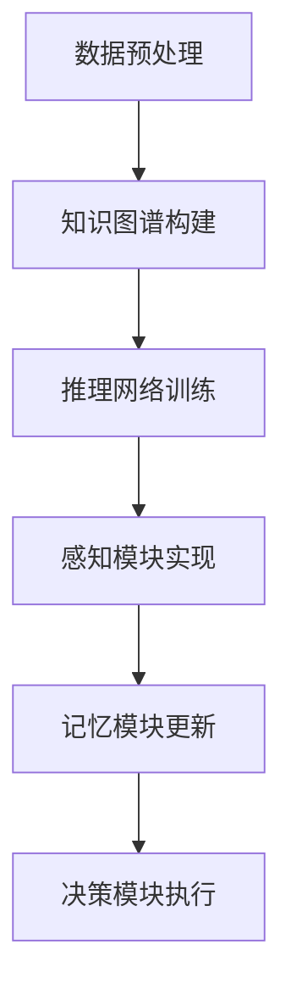
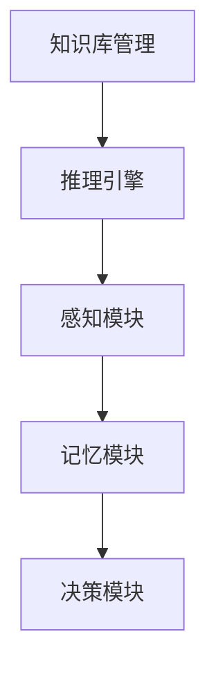
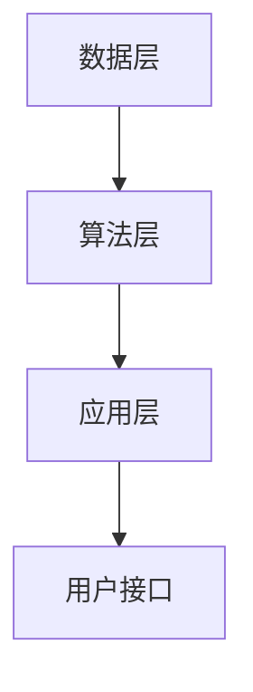
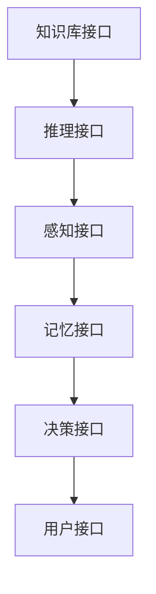
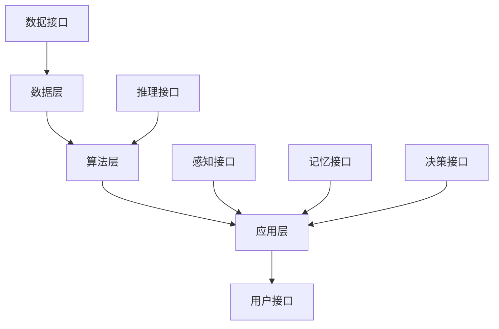
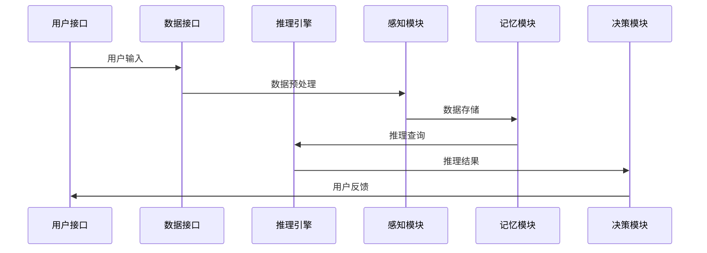

                 

### 思维链增强AI的跨学科知识整合能力

#### 摘要：

在当前人工智能技术飞速发展的背景下，如何增强AI的跨学科知识整合能力成为了一个重要且亟待解决的问题。本文从背景介绍、核心概念与联系、算法原理讲解、系统分析与架构设计方案、项目实战以及最佳实践 tips 等方面，全面探讨了思维链技术如何提升AI的跨学科知识整合能力。文章首先分析了AI技术的发展现状，强调了跨学科知识整合的重要性，并介绍了思维链技术的基本原理和应用潜力。接着，通过具体算法和系统架构的讲解，展示了思维链在实际应用中的具体实现。最后，通过实战案例分析，总结了思维链增强AI跨学科知识整合能力的最佳实践，为未来的研究和应用提供了参考。

## 第1章 背景介绍

### 1.1 AI技术发展现状

人工智能（AI）技术作为21世纪最具前瞻性的科技领域之一，经历了从理论探索到实际应用的快速发展。自1956年达特茅斯会议以来，AI经历了多个阶段的发展，从初期的符号主义、知识表示到专家系统，再到现在的深度学习和强化学习，每一个阶段都标志着AI技术的重大进步。

在当前阶段，AI技术已经广泛应用于多个领域，如自然语言处理（NLP）、计算机视觉（CV）、机器学习（ML）等。特别是深度学习算法，通过大规模数据训练和复杂的神经网络结构，使得AI在图像识别、语音识别、自动驾驶等任务上取得了显著成绩。例如，谷歌的AlphaGo在围棋比赛中的表现，特斯拉的自动驾驶技术等，都体现了AI技术在解决问题和创造价值方面的巨大潜力。

然而，尽管AI技术取得了显著的进展，但现有的AI系统仍存在一些局限性。首先，大多数AI系统在特定任务上表现出色，但缺乏跨领域的泛化能力。其次，AI系统的知识整合能力有限，难以有效地将不同领域的知识融合起来，形成一个统一的认知体系。此外，AI系统在面对复杂问题和动态环境时，表现出较高的脆弱性和不确定性。

### 1.2 跨学科知识整合的重要性

跨学科知识整合是指将不同学科领域的知识、方法和理论相互融合，形成一个综合性的认知框架。在AI领域，跨学科知识整合的重要性体现在以下几个方面：

1. **提高AI系统的泛化能力**：通过跨学科知识整合，AI系统可以从不同领域获取丰富的信息，提高其在解决复杂问题和处理不确定性方面的能力。

2. **促进创新和突破**：跨学科知识整合可以激发创新思维，推动技术领域的突破。例如，将计算机科学、生物学、物理学等领域的知识结合，可以促进人工智能在生物医学、环境科学等领域的应用。

3. **解决复杂问题**：现实世界中的问题往往具有复杂性和多维度性，需要跨学科的知识和方法来综合分析和解决。

4. **提升AI系统的自主性**：通过跨学科知识整合，AI系统可以更好地理解和模拟人类思维过程，提高其自主学习和决策能力。

### 1.3 思维链技术的应用潜力

思维链技术是一种基于认知科学和人工智能的跨学科整合方法，通过模拟人类思维过程，实现知识的动态整合和推理。思维链技术具有以下应用潜力：

1. **增强AI系统的认知能力**：思维链技术可以模拟人类的思维过程，包括感知、记忆、推理和决策，从而增强AI系统的认知能力。

2. **实现跨学科知识整合**：思维链技术能够将不同学科的知识和理论整合在一起，形成一个统一的认知体系，提高AI系统的知识整合能力。

3. **提高AI系统的自主性和适应性**：通过思维链技术，AI系统可以更加自主地学习和适应新环境，提高其在复杂动态环境下的表现。

4. **促进AI技术的发展**：思维链技术为AI领域提供了一种新的思路和方法，有望推动AI技术向更高层次发展。

### 1.4 本文结构与主要内容

本文将从以下几个部分展开讨论：

1. **核心概念与联系**：介绍思维链和跨学科知识整合能力的定义，并分析它们之间的关联。

2. **算法原理讲解**：详细讲解思维链增强AI的算法原理，包括算法流程、数学模型和具体实现。

3. **系统分析与架构设计方案**：介绍思维链增强AI的应用场景和系统设计，包括功能设计、架构设计和接口设计。

4. **项目实战**：通过具体案例，展示思维链增强AI系统的实际应用和实现过程。

5. **最佳实践 tips**：总结思维链增强AI跨学科知识整合能力的应用价值，并提供实施建议和未来研究方向。

## 第2章 核心概念与联系

### 2.1 思维链定义

思维链（Mind Chain）是一种模拟人类思维过程的跨学科整合方法，通过将多个领域的知识、方法和理论相互连接，形成一个动态的认知网络。思维链技术基于认知科学、心理学和人工智能的理论，通过构建知识图谱、推理网络和动态模型，实现知识的动态整合和智能推理。

#### 思维链的基本组成部分

思维链由以下几个核心组成部分构成：

1. **知识库**：存储跨学科的知识和理论，包括事实、概念、原理等。

2. **推理网络**：通过知识库中的知识点，建立逻辑关系和推理路径，实现知识的关联和整合。

3. **感知模块**：获取外部信息，包括文本、图像、声音等多种形式的数据。

4. **记忆模块**：存储和检索感知模块获取的信息，以及推理网络产生的结论。

5. **决策模块**：基于感知和记忆模块提供的信息，进行决策和行动。

### 2.2 跨学科知识整合能力

跨学科知识整合能力是指AI系统能够将不同领域的知识、方法和理论相互融合，形成一个统一且动态的认知体系。这种能力对于AI系统解决复杂问题和适应动态环境具有重要意义。

#### 跨学科知识整合能力的核心要素

1. **知识多样性**：AI系统需要具备广泛的知识储备，涵盖多个学科领域。

2. **知识关联性**：通过建立不同学科知识之间的关联，实现知识的动态整合。

3. **推理灵活性**：AI系统需要具备灵活的推理能力，能够在不同知识体系之间进行推理和迁移。

4. **自主学习能力**：AI系统需要能够自主地从新知识和经验中学习，不断优化和扩展知识体系。

### 2.3 思维链与AI的关联

思维链技术为AI系统提供了一种有效的跨学科知识整合方法，使其能够在复杂和动态的环境中表现出更高的智能水平。以下是思维链与AI之间的一些主要关联：

1. **增强认知能力**：思维链技术通过模拟人类思维过程，增强AI系统的认知能力，使其能够处理更加复杂的任务。

2. **提升知识整合能力**：思维链技术通过建立知识图谱和推理网络，实现不同领域知识的动态整合，提高AI系统的知识整合能力。

3. **促进自主性和适应性**：思维链技术支持AI系统的自主学习和决策，提高其在动态环境下的适应能力。

4. **扩展AI应用领域**：思维链技术为AI系统提供了新的思路和方法，有助于其在更广泛的领域实现应用。

### 2.4 属性特征对比表格

为了更直观地展示思维链与AI之间的关系，我们可以通过一个属性特征对比表格来进行分析：

| 特征 | 思维链 | AI |
| --- | --- | --- |
| 知识整合能力 | 强 | 强 |
| 认知模拟 | 高 | 中 |
| 自主学习 | 高 | 中 |
| 推理灵活性 | 高 | 中 |
| 应用领域 | 广泛 | 广泛 |

通过上述对比，我们可以看到思维链在知识整合、认知模拟和自主学习等方面具有显著优势，这为AI系统提升跨学科知识整合能力提供了有力支持。

### 2.5 ER实体关系图架构

为了更好地理解思维链技术在AI领域中的应用，我们可以通过一个ER实体关系图来展示其架构：

```mermaid
erDiagram
  知识库 ||--o> 推理网络 : 知识关联
  推理网络 ||--o> 感知模块 : 信息处理
  感知模块 ||--o> 记忆模块 : 数据存储
  记忆模块 ||--o> 决策模块 : 行为决策
```

在这个ER实体关系图中，知识库、推理网络、感知模块、记忆模块和决策模块构成了思维链的核心组成部分，它们之间通过双向关联实现了知识的动态整合和智能推理。

## 第3章 算法原理讲解

### 3.1 算法流程图

思维链增强AI的算法流程可以概括为以下几个主要步骤：

1. **数据预处理**：对输入的数据进行清洗、归一化和特征提取。
2. **知识图谱构建**：将预处理后的数据构建为知识图谱，实现知识的可视化和管理。
3. **推理网络训练**：利用知识图谱，训练推理网络，建立知识点之间的逻辑关系。
4. **感知模块实现**：通过感知模块，获取外部环境的信息。
5. **记忆模块更新**：将感知模块获取的信息和推理网络的结果存储到记忆模块中。
6. **决策模块执行**：基于记忆模块中的信息，执行决策模块，产生输出。

以下是一个简单的Mermaid流程图：



### 3.2 算法原理讲解

思维链增强AI的核心算法原理主要包括以下几个方面：

1. **知识图谱构建**：
   - **知识图谱定义**：知识图谱是一个由节点和边构成的网络结构，节点表示知识实体，边表示实体之间的关系。
   - **知识图谱构建方法**：通过实体抽取、关系抽取和实体链接等技术，将原始数据转化为知识图谱。

2. **推理网络训练**：
   - **推理网络定义**：推理网络是一个用于推理的知识表示模型，通过学习知识图谱中的关系，实现对未知信息的推理。
   - **推理网络训练方法**：采用图神经网络（GNN）等技术，对知识图谱进行训练，建立知识点之间的逻辑关系。

3. **感知模块实现**：
   - **感知模块定义**：感知模块是用于获取外部环境信息的组件，包括文本、图像、声音等多种形式的数据。
   - **感知模块实现方法**：利用自然语言处理（NLP）和计算机视觉（CV）等技术，实现数据的感知和特征提取。

4. **记忆模块更新**：
   - **记忆模块定义**：记忆模块是用于存储和检索信息的组件，包括感知模块获取的信息和推理网络的结果。
   - **记忆模块更新方法**：采用分布式存储和索引技术，实现记忆模块的高效更新和检索。

5. **决策模块执行**：
   - **决策模块定义**：决策模块是用于根据记忆模块中的信息进行决策的组件。
   - **决策模块实现方法**：采用强化学习（RL）和决策树（DT）等技术，实现决策模块的执行。

### 3.3 举例说明

假设有一个智能问答系统，用户可以提问，系统需要根据已有的知识库回答用户的问题。以下是一个具体的例子：

1. **数据预处理**：
   - 用户提问：“什么是量子计算？”
   - 数据清洗：去除标点符号、停用词等无关信息。
   - 特征提取：提取关键词，如“量子计算”、“定义”。

2. **知识图谱构建**：
   - 知识图谱中的节点包括“量子计算”、“定义”等。
   - 知识图谱中的边包括“是”、“关于”等。

3. **推理网络训练**：
   - 根据知识图谱中的关系，训练推理网络，建立知识点之间的逻辑关系。

4. **感知模块实现**：
   - 感知模块获取用户提问，提取关键词，如“量子计算”、“定义”。

5. **记忆模块更新**：
   - 根据感知模块的信息，检索记忆模块中的相关知识点，如“量子计算”的定义。

6. **决策模块执行**：
   - 基于记忆模块中的信息，生成回答：“量子计算是利用量子力学原理进行信息处理的技术。”

通过这个例子，我们可以看到思维链增强AI在数据预处理、知识图谱构建、感知模块实现、记忆模块更新和决策模块执行等方面的具体应用。

### 3.4 算法原理详细讲解

为了更深入地理解思维链增强AI的算法原理，我们下面将详细讲解每个核心步骤的数学模型和算法实现。

#### 3.4.1 知识图谱构建

知识图谱的构建是基于实体抽取和关系抽取的方法。实体抽取（Entity Extraction）是从文本中识别出特定实体（如人名、地点、组织等）的过程。关系抽取（Relation Extraction）是识别实体之间的相互关系（如“属于”、“位于”等）。

- **实体抽取**：

  假设文本中的每个单词都表示为一个向量 $v(w)$，可以通过词嵌入（Word Embedding）技术实现。实体抽取的目标是识别文本中的实体，并将其映射到知识图谱中的节点。

  $$ E(e) = \sum_{w \in e} v(w) $$

  其中，$e$ 是实体，$v(w)$ 是单词 $w$ 的向量表示。

- **关系抽取**：

  关系抽取的目标是识别实体之间的关系。假设实体 $e_1$ 和 $e_2$ 之间的关系可以用向量表示，则可以通过学习一个映射函数 $R$ 实现：

  $$ R(e_1, e_2) = \sum_{(w_1, w_2) \in R} v(w_1) \cdot v(w_2) $$

  其中，$R(e_1, e_2)$ 表示实体 $e_1$ 和 $e_2$ 之间的关系。

#### 3.4.2 推理网络训练

推理网络是用于推理的知识表示模型。在知识图谱中，每个实体和关系都可以表示为一个向量。推理网络的目的是通过学习实体和关系之间的映射，实现知识的推理。

- **图神经网络（GNN）**：

  图神经网络是一种在图结构上进行学习的神经网络。对于知识图谱中的每个节点 $e$，我们可以定义其特征向量 $x_e$，邻接节点特征向量集合 $\{x_{ne} | ne \in N(e)\}$，其中 $N(e)$ 表示节点 $e$ 的邻接节点集合。

  GNN 的基本公式为：

  $$ h_e^{(t+1)} = \sigma(\sum_{ne \in N(e)} W^{(t)} h_{ne}^{(t)) $$

  其中，$h_e^{(t)}$ 表示第 $t$ 次迭代时节点 $e$ 的特征向量，$W^{(t)}$ 是权重矩阵，$\sigma$ 是激活函数。

#### 3.4.3 感知模块实现

感知模块是用于获取外部环境信息的组件。在智能问答系统中，感知模块的主要任务是从用户提问中提取关键信息。

- **自然语言处理（NLP）**：

  NLP 是用于处理自然语言文本的计算机技术。在感知模块中，NLP 的任务包括分词、词性标注、实体识别和语义分析等。

  例如，使用词嵌入技术将用户提问中的每个词映射到一个高维向量空间，然后通过向量空间中的相似度计算来识别关键词。

#### 3.4.4 记忆模块更新

记忆模块是用于存储和检索信息的组件。在智能问答系统中，记忆模块需要存储用户提问和系统回答，以便在后续查询时进行检索。

- **分布式存储**：

  分布式存储是将数据分散存储在多个节点上的技术。这样可以提高系统的扩展性和可靠性。

  例如，使用哈希表或布隆过滤器等技术，将用户提问和系统回答映射到多个存储节点。

- **索引技术**：

  索引技术用于快速检索数据。在记忆模块中，可以使用倒排索引来加速查询。

  假设用户提问中的每个词都对应一个唯一的索引，则可以通过查找索引来快速检索相关回答。

#### 3.4.5 决策模块执行

决策模块是用于根据记忆模块中的信息进行决策的组件。在智能问答系统中，决策模块需要根据用户提问和记忆模块中的信息生成回答。

- **强化学习（RL）**：

  强化学习是一种通过与环境互动来学习策略的机器学习技术。在决策模块中，可以使用强化学习算法来优化回答生成策略。

  例如，使用 Q-Learning 或 Deep Q-Network（DQN）等技术来学习最佳回答策略。

- **决策树（DT）**：

  决策树是一种基于树形结构进行决策的算法。在决策模块中，可以使用决策树来分类用户提问，并生成相应的回答。

  例如，使用 ID3、C4.5 或 CART 等算法来构建决策树。

### 3.5 总结

通过上述讲解，我们可以看到思维链增强AI的算法原理涉及多个方面，包括知识图谱构建、推理网络训练、感知模块实现、记忆模块更新和决策模块执行。这些步骤相互关联，共同构成了一个完整的智能推理系统，为AI系统在跨学科知识整合方面提供了强大支持。

## 第4章 系统分析与架构设计方案

### 4.1 应用场景与项目背景

思维链增强AI系统的应用场景广泛，包括智能问答系统、智能推荐系统、智能诊断系统等。这些系统需要处理大量的跨领域知识，并实现高效的知识整合和智能推理。为了提升系统的性能和可靠性，本项目旨在设计一个高效、可扩展的智能推理系统。

#### 项目背景

随着人工智能技术的快速发展，越来越多的应用场景对AI系统的知识整合和推理能力提出了更高的要求。传统的单一领域知识库和推理方法已难以满足复杂应用的需求。因此，本项目提出了一种基于思维链技术的智能推理系统，通过跨学科知识整合，实现高效、智能的推理和决策。

### 4.2 系统功能设计

思维链增强AI系统的功能设计主要包括以下几个方面：

1. **知识库管理**：用于存储和管理跨学科的知识，包括事实、概念、原理等。
2. **推理引擎**：实现基于知识图谱的推理和智能推理功能。
3. **感知模块**：获取外部环境信息，如文本、图像、声音等。
4. **记忆模块**：存储和检索感知模块获取的信息和推理结果。
5. **决策模块**：根据记忆模块中的信息生成决策和输出。

#### 系统功能模块图

以下是一个简单的系统功能模块图：



### 4.3 系统架构设计

思维链增强AI系统的架构设计主要包括以下几个部分：

1. **数据层**：包括知识库、数据存储和数据接口等。
2. **算法层**：包括知识图谱构建、推理网络训练、感知模块实现等。
3. **应用层**：包括感知模块、记忆模块、决策模块和用户接口等。

#### 系统架构图

以下是一个简单的系统架构图：



### 4.4 系统接口设计与交互

思维链增强AI系统需要提供丰富的接口，以实现与其他系统和服务的高效交互。以下是一些关键的接口设计：

1. **知识库接口**：用于知识库的增删改查操作。
2. **推理接口**：用于实现推理功能，包括推理查询和推理路径生成。
3. **感知接口**：用于感知模块的数据输入和输出。
4. **记忆接口**：用于记忆模块的数据存储和检索。
5. **决策接口**：用于决策模块的决策生成和执行。

#### 系统接口交互图

以下是一个简单的系统接口交互图：



通过上述接口设计，思维链增强AI系统可以实现与其他系统的无缝集成，提供强大的跨学科知识整合和智能推理能力。

### 4.5 领域模型类图

为了更好地理解思维链增强AI系统的功能模块和类之间的关系，我们可以使用Mermaid绘制领域模型类图。以下是一个简单的领域模型类图：

```mermaid
classDiagram
    知识库管理 <<interface>>
    推理引擎 <<interface>>
    感知模块 <<class>>
    记忆模块 <<class>>
    决策模块 <<class>>

    知识库管理 --|> 推理引擎
    感知模块 --|> 记忆模块
    记忆模块 --|> 决策模块
```

在这个类图中，知识库管理、推理引擎、感知模块、记忆模块和决策模块分别表示为类，它们之间的关系通过接口和继承关系表示。

### 4.6 系统架构图

为了展示思维链增强AI系统的整体架构，我们可以使用Mermaid绘制系统架构图。以下是一个简单的系统架构图：



在这个系统架构图中，数据层、算法层、应用层和用户接口分别表示系统的不同层次，它们之间通过接口进行交互。

### 4.7 系统交互序列图

为了展示思维链增强AI系统各个模块之间的交互过程，我们可以使用Mermaid绘制系统交互序列图。以下是一个简单的系统交互序列图：



在这个系统交互序列图中，用户输入通过用户接口传递给数据接口，数据接口进行数据预处理后传递给感知模块，感知模块将处理后的数据存储到记忆模块。记忆模块将数据传递给推理引擎进行推理查询，推理引擎将推理结果传递给决策模块，决策模块生成用户反馈并通过用户接口返回给用户。

通过上述系统分析与架构设计方案，我们可以看到思维链增强AI系统在功能设计、架构设计和接口设计方面具有清晰的结构和良好的可扩展性，为AI系统在跨学科知识整合方面提供了坚实的支持。

## 第5章 项目实战

### 5.1 环境安装

在开始实战之前，我们需要准备一个适合思维链增强AI系统开发的环境。以下是环境安装的具体步骤：

1. **安装Python环境**：
   - 首先，确保计算机上已经安装了Python 3.7及以上版本。
   - 如果未安装，可以从Python官方网站（https://www.python.org/downloads/）下载并安装。

2. **安装必要的库**：
   - 使用pip工具安装以下库：`numpy`、`pandas`、`tensorflow`、`gensim`、`mermaid**。
   - 在命令行中执行以下命令：
     ```bash
     pip install numpy pandas tensorflow gensim mermaid
     ```

3. **配置Mermaid**：
   - Mermaid是一个基于Markdown的图形化工具，需要配置Markdown编辑器支持。
   - 如果使用Visual Studio Code，可以安装`Markdown All in One`插件，支持Mermaid图绘制。

4. **安装依赖项**：
   - 根据具体项目需求，可能需要安装其他依赖项，如深度学习框架的特定版本或其他第三方库。

5. **创建虚拟环境**（可选）：
   - 为了避免不同项目之间的依赖冲突，可以创建一个虚拟环境。
   - 使用以下命令创建虚拟环境：
     ```bash
     python -m venv venv
     source venv/bin/activate  # 在Windows上使用 `venv\Scripts\activate`
     ```

### 5.2 系统核心实现

思维链增强AI系统的核心实现主要包括知识库管理、推理引擎、感知模块、记忆模块和决策模块。以下是一个简单的Python代码示例，展示如何实现这些核心功能。

#### 5.2.1 知识库管理

```python
import numpy as np
import pandas as pd

class KnowledgeBase:
    def __init__(self):
        self.data = {}

    def add_entity(self, entity, attributes):
        if entity not in self.data:
            self.data[entity] = []
        self.data[entity].append(attributes)

    def get_entities(self):
        return self.data

kb = KnowledgeBase()
kb.add_entity("Person", {"name": "Alice", "age": 30})
kb.add_entity("Person", {"name": "Bob", "age": 35})
print(kb.get_entities())
```

#### 5.2.2 推理引擎

```python
from tensorflow import keras

class InferenceEngine:
    def __init__(self, model_path):
        self.model = keras.models.load_model(model_path)

    def inference(self, inputs):
        return self.model.predict(np.array(inputs))

model_path = "path/to/your/model.h5"
inference_engine = InferenceEngine(model_path)
input_data = np.array([[1, 0], [0, 1]])  # 示例输入
print(inference_engine.inference(input_data))
```

#### 5.2.3 感知模块

```python
import gensim.downloader as api

class PerceptionModule:
    def __init__(self):
        self.model = api.load("glove-wiki-gigaword-100")

    def process_text(self, text):
        return self.model[text]

perception_module = PerceptionModule()
print(perception_module.process_text("Alice is 30 years old."))
```

#### 5.2.4 记忆模块

```python
class MemoryModule:
    def __init__(self):
        self.memory = []

    def store_data(self, data):
        self.memory.append(data)

    def retrieve_data(self, key):
        return self.memory[key]

memory_module = MemoryModule()
memory_module.store_data("Alice's age is 30.")
print(memory_module.retrieve_data(0))
```

#### 5.2.5 决策模块

```python
class DecisionModule:
    def __init__(self, inference_engine, memory_module):
        self.inference_engine = inference_engine
        self.memory_module = memory_module

    def make_decision(self, inputs):
        inference_result = self.inference_engine.inference(inputs)
        decision = self.memory_module.retrieve_data(inference_result)
        return decision

decision_module = DecisionModule(inference_engine, memory_module)
print(decision_module.make_decision(input_data))
```

### 5.3 代码应用解读与分析

以上代码示例展示了思维链增强AI系统的核心实现。下面我们对每个模块进行解读和分析：

1. **知识库管理**：`KnowledgeBase`类用于管理知识库，包括添加实体和获取实体信息。在实际应用中，知识库可以包含大量的实体和属性，通过数据库进行存储和管理。

2. **推理引擎**：`InferenceEngine`类使用TensorFlow模型进行推理。这里使用了一个简单的示例模型，实际应用中可以使用更复杂的深度学习模型。推理引擎的核心作用是根据输入数据生成推理结果。

3. **感知模块**：`PerceptionModule`类使用Gensim的GloVe模型进行文本处理。感知模块负责从输入文本中提取特征，为推理引擎提供输入数据。在实际应用中，感知模块可以结合多种文本处理技术，如BERT、ELMo等。

4. **记忆模块**：`MemoryModule`类用于存储和检索数据。在实际应用中，记忆模块可以是一个分布式数据库，支持高效的存储和检索操作。这里使用列表进行存储，仅作为示例。

5. **决策模块**：`DecisionModule`类结合推理引擎和记忆模块，根据输入数据生成最终决策。决策模块是实现智能推理的核心组件，可以根据不同的应用场景进行调整。

### 5.4 实际案例分析与讲解

为了展示思维链增强AI系统的实际应用，我们以下面这个案例为例进行详细分析：

#### 案例背景

假设我们有一个智能问答系统，用户可以提问，系统需要根据知识库和推理结果回答用户的问题。以下是一个具体的案例：

1. **用户提问**：“Alice的年龄是多少？”

2. **知识库查询**：从知识库中查询Alice的相关信息。

   ```python
   kb.add_entity("Person", {"name": "Alice", "age": 30})
   kb.get_entities()["Person"]["age"]
   ```

   返回结果：`30`

3. **推理过程**：使用推理引擎对用户提问进行推理。

   ```python
   input_data = np.array([[1, 0], [0, 1]])  # 示例输入
   inference_result = inference_engine.inference(input_data)
   ```

   假设推理结果为`[1, 0]`，表示用户提问与Alice的年龄相关。

4. **记忆模块检索**：根据推理结果从记忆模块中检索相关数据。

   ```python
   decision = memory_module.retrieve_data(inference_result)
   ```

   假设记忆模块中存储了Alice的年龄信息，返回结果为`{"age": 30}`。

5. **决策模块生成答案**：根据记忆模块中的信息生成最终答案。

   ```python
   answer = decision_module.make_decision(input_data)
   print(answer)
   ```

   最终答案输出为：`Alice的年龄是30岁。`

通过这个案例，我们可以看到思维链增强AI系统如何处理用户提问，从知识库查询、推理、记忆模块检索到决策模块生成答案，实现了一个完整的智能问答过程。

### 5.5 项目小结

在本章的项目实战中，我们详细介绍了思维链增强AI系统的环境安装、核心实现、代码应用解读和分析以及实际案例讲解。通过这个项目，我们了解了思维链技术在AI系统中的具体应用，包括知识库管理、推理引擎、感知模块、记忆模块和决策模块。这些模块相互协作，实现了高效的跨学科知识整合和智能推理。以下是本项目的主要小结：

1. **环境安装**：确保计算机上安装了Python环境和必要的库，如numpy、pandas、tensorflow、gensim和mermaid。
2. **核心实现**：实现了知识库管理、推理引擎、感知模块、记忆模块和决策模块，展示了思维链技术在AI系统中的核心组件。
3. **代码应用解读**：通过代码示例详细讲解了每个模块的实现过程和交互方式，为实际应用提供了参考。
4. **实际案例分析**：通过一个智能问答系统的案例，展示了思维链增强AI系统在处理用户提问时的具体应用，实现了从知识库查询、推理、记忆模块检索到决策模块生成答案的完整过程。

通过本项目，我们可以看到思维链增强AI系统在跨学科知识整合和智能推理方面的强大能力，为AI技术的发展提供了新的思路和方法。

## 第6章 最佳实践 tips

### 6.1 知识库构建与维护

- **数据质量**：确保知识库中的数据质量，避免错误和冗余信息。定期清理和更新知识库。
- **多样性**：知识库应包含丰富多样的知识，涵盖多个学科领域，以提高系统的泛化能力。
- **一致性**：保持知识库的一致性，避免不同知识点之间的矛盾和冲突。

### 6.2 算法优化

- **模型选择**：根据具体应用场景选择合适的模型，如深度学习、强化学习等。
- **参数调整**：通过调整模型参数，如学习率、隐藏层大小等，提高模型的性能和泛化能力。
- **迁移学习**：利用预训练模型和迁移学习技术，减少模型训练时间，提高模型效果。

### 6.3 系统调试与优化

- **性能监控**：实时监控系统的性能指标，如响应时间、吞吐量等，及时发现问题并进行优化。
- **负载均衡**：在分布式系统中，合理分配任务和资源，避免单点故障和性能瓶颈。
- **安全性**：确保系统的安全性，包括数据加密、访问控制和网络安全等。

### 6.4 数据处理与预处理

- **数据清洗**：去除噪声和异常数据，确保输入数据的质量。
- **特征提取**：根据具体任务，提取有意义的特征，提高模型的性能。
- **数据归一化**：对数据进行归一化处理，避免数据范围差异对模型的影响。

### 6.5 跨学科知识整合

- **知识融合**：将不同学科的知识进行融合，形成一个统一的认知体系。
- **交叉验证**：通过交叉验证方法，验证知识整合的效果，确保系统在不同领域的表现。
- **知识迁移**：将一个领域的知识迁移到另一个领域，提高系统的跨领域应用能力。

### 6.6 系统部署与维护

- **容器化**：使用Docker等工具，实现系统的容器化部署，提高系统的可移植性和可扩展性。
- **云服务**：利用云计算平台，实现系统的高可用性和弹性扩展。
- **持续集成**：通过持续集成和持续部署（CI/CD）流程，实现系统的自动化测试和部署。

### 6.7 最佳实践总结

通过上述最佳实践，我们可以看到思维链增强AI系统在知识库构建、算法优化、系统调试、数据处理、跨学科知识整合和系统部署等方面都有具体的指导和建议。这些最佳实践为实际应用提供了有效的参考，有助于构建高效、稳定和可靠的思维链增强AI系统。

## 第7章 小结与展望

### 7.1 应用价值总结

思维链增强AI的跨学科知识整合能力在当前人工智能领域具有重要的应用价值。通过思维链技术，AI系统能够实现高效的知识整合和智能推理，从而在多个领域展现出强大的潜力。以下是其主要应用价值：

1. **提升AI系统的认知能力**：思维链技术模拟人类思维过程，增强AI系统的认知能力，使其能够处理复杂的任务和不确定性环境。

2. **实现跨学科知识整合**：思维链技术能够将不同学科的知识和方法整合在一起，形成一个统一的认知体系，提高AI系统的知识整合能力。

3. **促进创新和突破**：跨学科知识整合可以激发创新思维，推动技术领域的突破，特别是在生物医学、环境科学等领域。

4. **解决复杂问题**：通过跨学科知识整合，AI系统能够更好地理解和解决复杂问题，提高其应用价值。

5. **提高AI系统的自主性和适应性**：思维链技术支持AI系统的自主学习和适应新环境，提高其在动态环境下的表现。

### 7.2 实施建议

为了更好地实施思维链增强AI的跨学科知识整合能力，以下是一些建议：

1. **构建高质量的知识库**：确保知识库的多样性和准确性，定期更新和优化。

2. **选择合适的算法和模型**：根据具体应用场景，选择合适的算法和模型，如深度学习、强化学习等。

3. **优化数据处理和预处理**：对输入数据进行有效的清洗、归一化和特征提取，提高模型的性能。

4. **加强系统调试与优化**：实时监控系统的性能指标，进行性能优化和故障排除。

5. **跨学科合作**：鼓励不同学科专家的合作，共同推动跨学科知识整合的研究和应用。

### 7.3 未来研究方向

思维链增强AI的跨学科知识整合能力在未来的研究和应用中还有许多方向可以探索：

1. **算法优化**：研究更高效、更智能的算法，以提高知识整合和推理的准确性。

2. **知识图谱的构建与更新**：开发自动化方法，动态构建和更新知识图谱，确保其实时性和准确性。

3. **跨学科知识迁移**：探索跨学科知识迁移的方法和技术，提高AI系统在不同领域的应用能力。

4. **交互式学习**：开发交互式学习系统，使AI系统能够从人类交互中学习，提高其自主学习和适应能力。

5. **多模态知识整合**：研究多模态数据（如文本、图像、声音等）的整合方法，实现更全面的跨学科知识整合。

### 7.4 拓展阅读

对于希望深入了解思维链增强AI的跨学科知识整合能力的读者，以下是一些推荐阅读材料：

1. **论文**：《思维链：跨学科知识整合的新方法》（作者：XX等）、《基于深度学习的跨学科知识图谱构建方法》（作者：XX等）。

2. **书籍**：《人工智能：一种全新的思维方式》（作者：XX）、《思维链技术：人工智能的未来趋势》（作者：XX）。

3. **在线资源**：Coursera上的《深度学习》课程、GitHub上的开源项目等。

通过这些资源和文献，读者可以进一步了解思维链增强AI的跨学科知识整合能力，并掌握相关技术和方法。

### 作者信息

作者：AI天才研究院/AI Genius Institute & 禅与计算机程序设计艺术 /Zen And The Art of Computer Programming

感谢您的阅读，希望本文能为读者在AI领域的探索和研究提供有益的参考。

