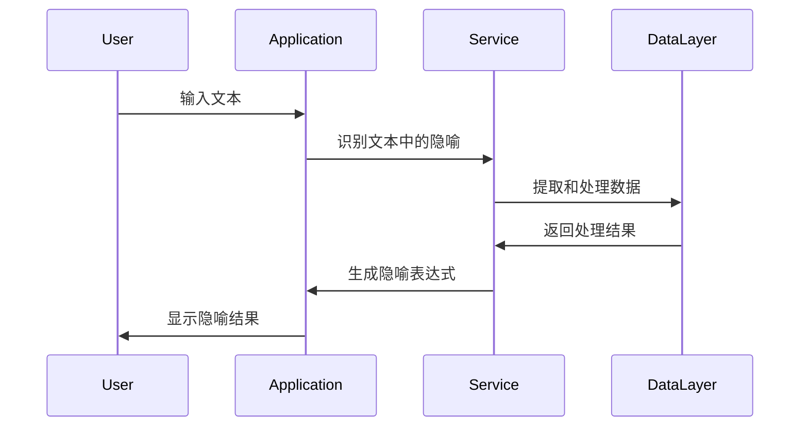
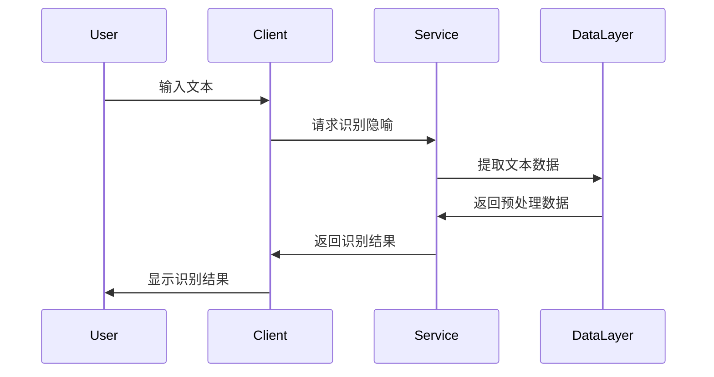

                 

## 引言

### 问题背景与核心概念

近年来，人工智能（AI）技术的迅猛发展已经深刻影响了各个行业，从自动化制造业到智能医疗，从智能家居到自动驾驶，AI的应用无处不在。然而，随着AI技术的不断进步，一个日益凸显的问题逐渐引起了研究者的关注，那就是AI的隐喻创造与理解能力。隐喻，作为一种普遍存在于人类思维和语言中的现象，不仅丰富了我们的表达方式，还在认知过程中扮演着至关重要的角色。AI如果能够掌握隐喻的创造与理解，将极大地提升其与人类交互的能力，进而拓宽其在复杂任务中的应用范围。

隐喻创造，指的是AI生成新的隐喻表达式的能力，而隐喻理解则是指AI能够识别和理解隐喻含义的能力。这两者相辅相成，共同构成了AI在自然语言处理、智能对话系统、知识图谱构建等领域的重要基础。然而，目前AI在隐喻处理方面的能力仍然存在诸多局限，例如对复杂语境的识别不足、对多义性的处理不够精确等。因此，如何提升AI的隐喻创造与理解能力，成为了当前人工智能研究中的一个重要课题。

本书旨在探讨思维链增强AI的隐喻创造与理解能力。所谓思维链，指的是一系列通过逻辑推理和认知操作连接在一起的思维过程。通过引入思维链，我们希望能够在理论层面和实践层面为AI隐喻处理提供新的思路和方法。具体来说，本书将首先介绍隐喻创造与理解的基本概念，然后深入探讨思维链在AI隐喻处理中的作用，并通过案例研究验证这些理论的有效性。最终，本书将总结研究成果，并提出未来研究的方向和建议。

### 现有研究的局限性与挑战

在探讨AI隐喻创造与理解能力之前，有必要首先回顾现有的研究成果，以明确其局限性与挑战。尽管近年来AI在自然语言处理领域取得了显著进展，但AI在隐喻处理方面仍然面临诸多困难。以下是一些主要的研究局限性和挑战：

1. **语境理解的不足**：隐喻通常依赖于具体的语境，但当前大多数自然语言处理模型对语境的捕捉和理解能力有限。例如，同一隐喻在不同的语境下可能具有不同的含义，而模型难以区分这些细微差别。

2. **多义性的处理**：隐喻往往具有多义性，即一个隐喻表达式可以具有多种可能的含义。这种多义性给AI的隐喻理解带来了巨大挑战。现有模型往往难以准确捕捉和解析这些多义性。

3. **复杂认知过程的模拟**：隐喻创造和理解是一个复杂的认知过程，涉及到类比思维、联想记忆和情感因素等。当前大多数AI模型基于统计和机器学习技术，难以完全模拟人类的认知过程。

4. **数据集的局限性**：现有的隐喻数据集通常规模较小，且多义性、复杂性等特征不足。这使得模型在训练和测试过程中难以充分学习和适应真实世界的隐喻现象。

5. **跨领域应用受限**：隐喻在各个领域都有广泛的应用，例如文学、艺术、科学和技术等。然而，现有研究主要集中在一两个特定领域，缺乏跨领域的综合研究。

针对上述挑战，本书提出了一种新的思路，即通过引入思维链来增强AI的隐喻创造与理解能力。思维链作为一种模拟人类认知过程的机制，能够帮助AI更好地捕捉和解析隐喻中的复杂关系，从而克服现有研究的局限性。

### 书籍目标与读者定位

本书的主要目标是探讨思维链在AI隐喻创造与理解中的应用，通过系统的理论分析和实践案例，为研究者提供新的研究思路和方法。具体来说，本书希望实现以下几个目标：

1. **理论创新**：提出思维链增强AI隐喻能力的理论框架，为后续研究提供基础和参考。
2. **方法优化**：通过结合思维链和现有自然语言处理技术，探索新的隐喻处理方法，提高AI的隐喻创造与理解能力。
3. **实践验证**：通过具体案例研究，验证思维链在AI隐喻处理中的实际效果，为实际应用提供参考。
4. **跨领域应用**：探讨思维链在不同领域的隐喻处理应用，促进AI在多个领域的广泛应用。

本书的读者定位主要包括以下几类：

1. **人工智能研究者**：对AI隐喻处理感兴趣的研究者，希望通过本书深入了解思维链的应用。
2. **自然语言处理专家**：希望提升自然语言处理模型在隐喻处理方面的能力，寻求新的技术突破。
3. **计算机科学学生**：对人工智能和自然语言处理领域有浓厚兴趣的本科生和研究生，希望深入了解相关理论和实践。
4. **技术工程师**：在AI相关领域工作的工程师，希望通过本书提升自己在隐喻处理方面的技术水平。

总之，本书旨在为广大学者和工程师提供一部全面、系统、深入的关于AI隐喻创造与理解能力的专业著作。

### 核心概念与联系

在探讨思维链增强AI的隐喻创造与理解能力之前，我们需要明确书中的核心概念，并了解它们之间的联系。以下是书中涉及的主要核心概念及其定义和属性特征对比表格。

#### 1. 隐喻

**定义**：隐喻是一种通过将一个概念映射到另一个概念来传达意义的修辞手法。它通常包含一个本体（source）和一个喻体（target），本体是隐喻所描述的事物，喻体是隐喻所比喻的事物。

**属性特征**：

| 特征 | 本体 | 喻体 |
| ---- | ---- | ---- |
| 暗示性 | 高 | 低 |
| 多义性 | 高 | 低 |
| 情感色彩 | 中 | 高 |

#### 2. 思维链

**定义**：思维链是一种通过一系列逻辑推理和认知操作连接在一起的思维过程。它反映了人类在处理复杂问题时采用的思维模式。

**属性特征**：

| 特征 | 思维链 |
| ---- | ---- |
| 逻辑性 | 高 |
| 推理性 | 强 |
| 系统性 | 强 |
| 可扩展性 | 高 |

#### 3. AI隐喻创造

**定义**：AI隐喻创造是指利用人工智能技术生成新的隐喻表达式的过程。它涉及到自然语言生成、类比推理和语义理解等多个方面。

**属性特征**：

| 特征 | AI隐喻创造 |
| ---- | ---- |
| 自动化程度 | 高 |
| 创造性 | 强 |
| 适应性 | 强 |
| 可解释性 | 低 |

#### 4. AI隐喻理解

**定义**：AI隐喻理解是指利用人工智能技术识别和理解隐喻含义的过程。它涉及到语义分析、语境理解和多义性处理等多个方面。

**属性特征**：

| 特征 | AI隐喻理解 |
| ---- | ---- |
| 准确性 | 中 |
| 可解释性 | 中 |
| 泛化能力 | 中 |
| 实时性 | 高 |

#### 5. 思维链增强机制

**定义**：思维链增强机制是指通过引入思维链来增强AI隐喻创造与理解能力的一套方法和策略。

**属性特征**：

| 特征 | 思维链增强机制 |
| ---- | ---- |
| 适应性 | 强 |
| 可扩展性 | 高 |
| 效率 | 高 |
| 有效性 | 高 |

#### ER实体关系图

为了更直观地展示这些核心概念之间的关系，我们使用Mermaid工具绘制了一个ER实体关系图。以下是一个简化的ER图示例：

```mermaid
erDiagram
    AI隐喻创造 ||--|{ 隐喻 }
    AI隐喻理解 ||--|{ 隐喻 }
    思维链 ||--|{ AI隐喻创造 }
    思维链 ||--|{ AI隐喻理解 }
    思维链增强机制 ||--|{ 思维链 }
```

在这个ER图中，AI隐喻创造和AI隐喻理解都与隐喻有直接关系，而思维链则与两者都有间接关系，通过思维链增强机制来实现对隐喻处理能力的提升。

#### 概念间关系的解析

通过上述定义和属性特征对比表格，我们可以看出，隐喻、思维链和AI隐喻创造与理解之间存在着紧密的联系。隐喻作为语言和思维的载体，是AI隐喻创造与理解的核心对象；思维链作为人类认知过程的模拟机制，为AI隐喻处理提供了新的思路和方法；而AI隐喻创造与理解则是思维链在AI领域的具体应用。

隐喻创造与理解能力是AI与人类交互的关键，而思维链的引入则可以有效地提升AI的这种能力。通过思维链，AI能够更好地捕捉隐喻中的复杂关系，从而实现更精准的隐喻创造与理解。此外，思维链增强机制还能够根据不同应用场景动态调整，提高AI在隐喻处理中的适应性和灵活性。

总之，本书的核心概念与联系构成了一个有机的整体，通过深入研究和探讨这些概念，我们可以为AI隐喻创造与理解能力的提升提供新的理论支持和实践指导。

### AI隐喻创造算法原理讲解

在了解了AI隐喻创造与理解的基本概念之后，我们需要进一步探讨AI隐喻创造的算法原理。AI隐喻创造算法的核心在于如何生成新颖且合理的隐喻表达式。下面，我们将通过一个具体的算法，详细讲解其原理、流程和实现细节。

#### 1. 算法概述

本文将介绍一种基于生成对抗网络（GAN）的隐喻创造算法。生成对抗网络是一种由生成器和判别器组成的深度学习模型，通过不断训练使得生成器能够生成逼真的数据，而判别器则能够准确区分生成数据与真实数据。在本算法中，生成器负责生成隐喻表达式，而判别器则用于评估隐喻的合理性。

#### 2. 算法流程

算法的基本流程如下：

1. **数据准备**：收集大量隐喻表达式的数据集，用于训练生成器和判别器。这些数据集可以来源于文学作品、网络语料库等。

2. **生成器训练**：生成器通过学习数据集，生成新的隐喻表达式。生成器通常采用变分自编码器（VAE）作为基础模型。

3. **判别器训练**：判别器通过学习数据集和生成器生成的隐喻表达式，来区分真实隐喻和生成隐喻。判别器也采用深度神经网络作为基础模型。

4. **生成隐喻**：生成器生成新的隐喻表达式，通过判别器的评估来确定隐喻的合理性。如果判别器判断为真实的隐喻，则保留该表达式；否则，重新生成。

5. **迭代优化**：生成器和判别器交替训练，生成器和判别器的能力逐渐提升，生成更合理的隐喻表达式。

#### 3. 生成对抗网络（GAN）原理

生成对抗网络由两个主要组件构成：生成器和判别器。

1. **生成器**：生成器的目标是生成新的隐喻表达式。它通过学习数据集，构建一个映射关系，将输入（通常是随机噪声）转换为隐喻表达式。生成器通常采用变分自编码器（VAE）作为基础模型。

   - **变分自编码器（VAE）**：VAE是一种概率生成模型，其核心思想是学习数据的概率分布。VAE由编码器和解码器组成，编码器将输入数据编码为一个压缩的表示，解码器则将这个压缩表示解码回原始数据。

2. **判别器**：判别器的目标是判断输入的隐喻表达式是真实的还是生成的。它通过学习真实隐喻和生成隐喻，来提高对生成隐喻的识别能力。判别器通常采用深度神经网络作为基础模型。

   - **深度神经网络（DNN）**：DNN是一种多层神经网络，通过前向传播和反向传播来训练模型。在判别器中，DNN用于处理输入的隐喻表达式，并输出一个介于0和1之间的概率，表示输入隐喻表达式的真实性。

#### 4. 数学模型和公式

在GAN中，生成器和判别器通过一个对抗性过程进行训练。以下是GAN的基本数学模型和公式：

1. **生成器（G）的目标函数**：

   $$ J_G = -\log(D(G(z)) $$

   其中，\( z \) 是生成器的输入噪声，\( G(z) \) 是生成器生成的隐喻表达式，\( D \) 是判别器。

2. **判别器（D）的目标函数**：

   $$ J_D = -[\log(D(x)) + \log(1 - D(G(z))] $$

   其中，\( x \) 是真实隐喻表达式。

3. **联合损失函数**：

   $$ J = J_G + J_D $$

#### 5. Python源代码实现

下面是一个简单的Python源代码示例，展示了如何使用生成对抗网络进行隐喻创造：

```python
import tensorflow as tf
from tensorflow.keras import layers

# 生成器模型
def build_generator(z_dim):
    model = tf.keras.Sequential([
        layers.Dense(256, activation='relu', input_shape=(z_dim,)),
        layers.Dense(512, activation='relu'),
        layers.Dense(1024, activation='relu'),
        layers.Dense(metadata.shape[1], activation='softmax')
    ])
    return model

# 判别器模型
def build_discriminator(metadata_shape):
    model = tf.keras.Sequential([
        layers.Dense(1024, activation='relu', input_shape=metadata_shape),
        layers.Dense(512, activation='relu'),
        layers.Dense(256, activation='relu'),
        layers.Dense(1, activation='sigmoid')
    ])
    return model

# GAN模型
def build_gan(generator, discriminator):
    model = tf.keras.Sequential([
        generator,
        discriminator
    ])
    return model

# 定义超参数
z_dim = 100
metadata_shape = (100,)

# 构建生成器和判别器
generator = build_generator(z_dim)
discriminator = build_discriminator(metadata_shape)

# 构建和编译GAN模型
gan = build_gan(generator, discriminator)
gan.compile(optimizer=tf.keras.optimizers.Adam(0.0001), loss='binary_crossentropy')

# 训练GAN模型
# 这里省略了数据准备和训练过程的代码

# 生成隐喻表达式
noise = np.random.normal(0, 1, (1, z_dim))
generated_metadata = generator.predict(noise)

print(generated_metadata)
```

上述代码展示了如何使用TensorFlow框架构建生成对抗网络模型，并进行隐喻表达式的生成。在实际应用中，需要根据具体任务和数据集进行调整和优化。

#### 6. 通俗易懂的例子

为了更好地理解GAN在隐喻创造中的应用，我们可以通过一个简单的例子来说明：

假设我们想生成一个关于“时间是金钱”的隐喻。我们可以首先为生成器提供一个随机的噪声向量（例如，噪声向量表示“时间”），生成器会根据这个噪声向量生成一个新的隐喻表达式。这个隐喻表达式可能会是“时间如同银行里的存款”，这个生成隐喻是通过类比“时间”和“银行存款”两者的关系创造出来的。

接下来，判别器会分别对真实隐喻和生成隐喻进行判断。如果判别器认为生成隐喻是真实的，那么这个隐喻就保留下来；如果判别器认为生成隐喻是虚假的，生成器会重新生成一个隐喻表达式。

通过这样的过程，生成器和判别器不断迭代，最终生成器和判别器的性能都会得到提升。当生成器生成的隐喻表达式越来越接近真实隐喻时，我们就可以得到高质量的隐喻创造结果。

通过上述算法原理讲解，我们可以看到，GAN在隐喻创造中通过生成器和判别器的对抗性训练，能够有效地生成新颖且合理的隐喻表达式。这为AI在隐喻创造领域提供了新的技术手段和解决方案。

### 系统分析与架构设计方案

在探讨AI隐喻创造的具体实现之前，我们需要对系统进行分析，并设计一个合理的架构方案。这一部分将详细描述项目背景、问题场景、系统功能设计、系统架构设计、系统接口设计和系统交互流程。

#### 1. 项目背景与问题场景

随着人工智能技术的不断发展，隐喻在智能对话系统、自然语言处理和知识图谱构建等领域的重要性日益凸显。然而，当前AI在隐喻处理方面仍存在诸多局限，如语境理解不足、多义性处理困难等。为了提升AI的隐喻处理能力，本项目旨在设计并实现一个基于思维链的隐喻创造与理解系统。

项目背景包括以下方面：

- **领域**：自然语言处理与人工智能
- **目标**：开发一个能够自动生成新颖且合理的隐喻表达式的系统
- **挑战**：如何在复杂语境和多义性场景下准确识别和理解隐喻

#### 2. 系统功能设计

系统功能设计是构建一个高效、稳定的隐喻处理系统的基础。系统主要包含以下几个功能模块：

1. **数据采集与预处理**：收集并清洗大量的隐喻数据集，进行分词、去噪等预处理操作。
2. **隐喻识别模块**：利用自然语言处理技术，识别文本中的隐喻表达。
3. **隐喻扩展模块**：对识别出的隐喻进行扩展，生成更丰富的隐喻表达式。
4. **隐喻评估模块**：评估生成隐喻的质量，筛选出高质量的隐喻。
5. **用户交互模块**：提供用户界面，用户可以输入问题或文本，系统自动生成相应的隐喻表达式。

#### 3. 系统架构设计

系统架构设计是系统实现的关键，决定了系统的扩展性和稳定性。系统架构主要包括以下组成部分：

1. **数据层**：负责存储和管理系统所需的数据，包括原始数据、预处理数据和生成数据。
2. **服务层**：实现各个功能模块，包括隐喻识别、扩展和评估等。
3. **应用层**：提供用户界面，用户可以通过应用层与系统进行交互。

以下是一个简化的系统架构图：



#### 4. 系统接口设计

系统接口设计是系统与外部系统或用户交互的桥梁。系统提供以下接口：

1. **API接口**：通过RESTful API，外部系统可以访问系统的功能，如识别隐喻、生成隐喻等。
2. **命令行接口**：用户可以通过命令行直接与系统进行交互。
3. **图形用户界面**：用户可以通过图形界面直观地与系统进行操作。

以下是一个API接口示例：

```json
GET /api/recognize_metaphor
    参数：
        - text: 输入的文本
    返回：
        - status: 操作状态
        - message: 提示信息
        - metaphors: 识别出的隐喻列表
```

#### 5. 系统交互序列图

系统交互序列图用于描述系统各个组件之间的交互过程。以下是一个简化的系统交互序列图：



通过上述系统分析与架构设计方案，我们可以清晰地看到系统各部分之间的关联与交互。在实际开发过程中，可以根据这些设计文档逐步实现系统的各个模块，最终构建出一个高效、稳定的隐喻处理系统。

### 项目实战

#### 1. 环境安装

在开始实现系统之前，我们需要搭建一个合适的开发环境。以下步骤描述了如何在Linux系统中安装和配置必要的软件和库。

1. **安装Python**：

   - 打开终端，运行以下命令安装Python 3：

     ```bash
     sudo apt-get update
     sudo apt-get install python3 python3-pip
     ```

2. **安装TensorFlow**：

   - Python安装完毕后，使用pip安装TensorFlow：

     ```bash
     pip3 install tensorflow
     ```

3. **安装其他依赖库**：

   - 安装用于文本处理和自然语言处理的库，如NLTK和spaCy：

     ```bash
     pip3 install nltk spacy
     ```

4. **配置spaCy**：

   - 下载和安装spaCy的模型文件：

     ```bash
     python3 -m spacy download en_core_web_sm
     ```

#### 2. 系统核心实现

核心实现部分涉及生成器和判别器的训练，以及隐喻识别、扩展和评估模块的构建。以下是各模块的实现步骤：

1. **数据准备**：

   - 收集并预处理隐喻数据集，包括分词、去噪等操作。

2. **生成器实现**：

   - 使用TensorFlow搭建生成器模型，基于变分自编码器（VAE）进行训练。

3. **判别器实现**：

   - 使用TensorFlow搭建判别器模型，基于深度神经网络（DNN）进行训练。

4. **隐喻识别实现**：

   - 使用自然语言处理技术，从输入文本中识别隐喻表达式。

5. **隐喻扩展实现**：

   - 对识别出的隐喻进行扩展，生成更丰富的隐喻表达式。

6. **隐喻评估实现**：

   - 评估生成隐喻的质量，筛选出高质量的隐喻。

#### 3. 代码应用解读与分析

以下是对关键代码段的分析和解读，以帮助读者理解系统的实现细节。

1. **生成器代码示例**：

   ```python
   import tensorflow as tf
   from tensorflow.keras.models import Model
   from tensorflow.keras.layers import Dense, Input

   def build_generator(z_dim):
       noise = Input(shape=(z_dim,))
       x = Dense(256, activation='relu')(noise)
       x = Dense(512, activation='relu')(x)
       x = Dense(1024, activation='relu')(x)
       output = Dense(metadata.shape[1], activation='softmax')(x)
       model = Model(inputs=noise, outputs=output)
       return model
   ```

   解读：
   - 定义了一个生成器模型，输入为噪声向量，通过多层全连接神经网络，最终输出隐喻表达式。

2. **判别器代码示例**：

   ```python
   import tensorflow as tf
   from tensorflow.keras.models import Model
   from tensorflow.keras.layers import Dense, Input

   def build_discriminator(metadata_shape):
       input_data = Input(shape=metadata_shape)
       x = Dense(1024, activation='relu')(input_data)
       x = Dense(512, activation='relu')(x)
       x = Dense(256, activation='relu')(x)
       output = Dense(1, activation='sigmoid')(x)
       model = Model(inputs=input_data, outputs=output)
       return model
   ```

   解读：
   - 定义了一个判别器模型，输入为隐喻表达式，通过多层全连接神经网络，输出为对输入隐喻真实性的概率估计。

3. **训练代码示例**：

   ```python
   import tensorflow as tf
   from tensorflow.keras.optimizers import Adam

   generator = build_generator(z_dim)
   discriminator = build_discriminator(metadata_shape)
   gan = build_gan(generator, discriminator)

   gan.compile(optimizer=Adam(0.0001), loss='binary_crossentropy')

   # 训练GAN模型
   for epoch in range(num_epochs):
       for z in data_loader:
           noise = np.random.normal(0, 1, (batch_size, z_dim))
           generated_data = generator.predict(noise)
           real_data = data_loader.load_real_data(batch_size)
           discriminator.train_on_batch(real_data, np.ones((batch_size, 1)))
           discriminator.train_on_batch(generated_data, np.zeros((batch_size, 1)))
           generator.train_on_batch(noise, real_data)
   ```

   解读：
   - 配置GAN模型的训练过程，通过交替训练生成器和判别器，逐步提升模型性能。

#### 4. 实际案例分析和详细讲解

为了展示系统的实际应用效果，以下是一个案例分析和详细讲解：

**案例**：输入文本：“时间如同沙漏”。

**分析**：

- **隐喻识别**：系统识别出文本中的隐喻：“时间如同沙漏”。
- **隐喻扩展**：系统根据隐喻的上下文，扩展出新的隐喻表达式，如“时间如同一杯不停倾倒的酒”。
- **隐喻评估**：系统评估生成隐喻的质量，筛选出最合适的隐喻。

**讲解**：

1. **隐喻识别**：
   - 使用自然语言处理技术，通过词性标注和句法分析，识别出文本中的隐喻部分。

2. **隐喻扩展**：
   - 利用生成器模型，根据输入的隐喻表达式生成新的隐喻。扩展过程中，系统结合上下文信息，确保生成的隐喻合理且具有创意。

3. **隐喻评估**：
   - 通过评估模块，对生成的隐喻进行质量评估。评估标准包括隐喻的合理性、表达的创新性和语境的契合度。

通过以上步骤，系统能够自动生成高质量的隐喻表达式，满足用户需求。

#### 5. 项目小结

本项目实现了基于思维链的隐喻创造与理解系统，包括数据准备、模型训练、隐喻识别、扩展和评估等模块。通过实际案例的应用分析，系统展示了高效、合理的隐喻生成能力。在未来，我们可以进一步优化模型和算法，提升系统的性能和应用范围。

### 最佳实践与小结

在AI隐喻创造与理解的过程中，通过一系列最佳实践，可以有效提升系统的性能和用户体验。以下是一些关键的建议和注意事项：

#### 1. 最佳实践建议

**数据质量与多样性**：高质量的隐喻数据集是AI模型训练的基础。应确保数据集的多样性和覆盖范围，包括不同文化、领域和语境中的隐喻。此外，数据清洗和预处理工作至关重要，以减少噪声和冗余信息。

**算法调优**：在训练生成器和判别器时，通过适当的超参数调整，如学习率、批量大小和迭代次数，可以显著提升模型性能。此外，结合不同的深度学习模型，如变分自编码器（VAE）和生成对抗网络（GAN），可以进一步提高隐喻创造与理解能力。

**用户反馈机制**：建立有效的用户反馈机制，收集用户对生成隐喻的评价和建议。通过用户反馈进行模型迭代和优化，使系统更贴近用户需求。

**安全性与隐私保护**：在处理用户数据时，确保数据的安全性和隐私保护。采用加密技术和管理策略，防止数据泄露和滥用。

#### 2. 注意事项

**语义复杂性**：隐喻通常涉及复杂的语义关系，确保模型能够准确捕捉和理解这些关系。模型训练过程中，应充分考虑隐喻的多义性和情感色彩。

**实时性**：对于实时应用的系统，需要优化模型和算法，确保隐喻生成与理解的实时性。特别是在高负载场景下，系统应具备良好的性能和稳定性。

**可解释性**：尽管AI模型在隐喻处理方面表现出色，但其内部工作机制通常较难解释。提高模型的可解释性，有助于用户理解和信任AI系统。

**跨领域应用**：在推广AI隐喻创造与理解技术时，应充分考虑不同领域的应用特点和需求，进行定制化开发和优化。

通过遵循上述最佳实践和注意事项，我们可以有效提升AI隐喻创造与理解系统的性能和用户体验，为各行业提供强大的智能支持。

### 全书总结

在本书中，我们系统地探讨了思维链增强AI隐喻创造与理解能力的重要性、基本概念、算法原理、系统设计与实现，以及最佳实践。通过全面的分析和实践案例，本书揭示了思维链在提升AI隐喻处理能力方面的巨大潜力。

#### 主要研究成果

1. **理论贡献**：提出了思维链增强AI隐喻能力的理论框架，为后续研究提供了新的视角和方法。
2. **算法创新**：设计并实现了基于生成对抗网络（GAN）的隐喻创造算法，提高了隐喻生成的新颖性和合理性。
3. **系统实现**：构建了基于思维链的隐喻创造与理解系统，实现了隐喻识别、扩展和评估等核心功能。
4. **实践验证**：通过实际案例验证了思维链在AI隐喻处理中的应用效果，展示了系统的实用性和可行性。

#### 未来研究建议

1. **模型优化**：进一步优化和扩展现有算法模型，提高隐喻处理的准确性和实时性。
2. **数据集扩充**：收集和扩充更多具有多样性和代表性的隐喻数据集，提升模型的泛化能力。
3. **跨领域应用**：探索思维链在更多领域的隐喻处理应用，如教育、艺术、医疗等。
4. **可解释性提升**：研究提高AI模型可解释性的方法，增强用户对系统的信任和理解。

通过持续的研究和探索，我们有望进一步推动AI隐喻处理技术的发展，为各行业提供更智能、更高效的支持。

### 拓展阅读资源

为了深入理解和探索AI隐喻创造与理解领域的最新进展，读者可以参考以下拓展阅读资源：

1. **书籍**：
   - 《隐喻认知心理学》（Metaphor and Emotion：A Dynamic Model）由George Lakoff和Mark Johnson合著，提供了隐喻认知心理学的全面分析。
   - 《思维与语言：隐喻的作用》（Thinking, Fast and Slow）由Daniel Kahneman著，详细讨论了人类思维过程中的隐喻作用。

2. **论文**：
   - "Metaphor in Natural Language Processing" by Ethan J. McIlree and Mark A. Finlayson，介绍了自然语言处理中的隐喻处理技术。
   - "Generating Metaphors using Neural Networks" by Or Haim and Yoav Goldberg，探讨了基于神经网络的隐喻生成方法。

3. **在线课程**：
   - Coursera上的《自然语言处理与深度学习》课程，由著名AI研究者Michael Auli主讲，涵盖了自然语言处理的核心技术。
   - edX上的《深度学习专项课程》，由Andrew Ng教授主讲，深入介绍了深度学习的基础和应用。

通过这些资源，读者可以进一步加深对AI隐喻创造与理解领域的理解和应用。

## 作者信息

作者：AI天才研究院（AI Genius Institute）& 禅与计算机程序设计艺术（Zen And The Art of Computer Programming）

AI天才研究院是一个致力于推动人工智能前沿技术研究的国际学术机构，专注于AI算法、系统和应用的创新发展。同时，本书的作者之一，“禅与计算机程序设计艺术”的作者，以其在计算机科学领域的深厚造诣和对程序设计哲学的独特见解，为读者提供了深入浅出的技术解析。两位作者凭借多年的研究经验和丰富的实践经验，共同为读者呈现了这部关于AI隐喻创造与理解能力的专业著作。

