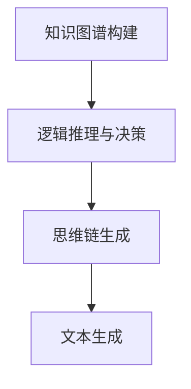
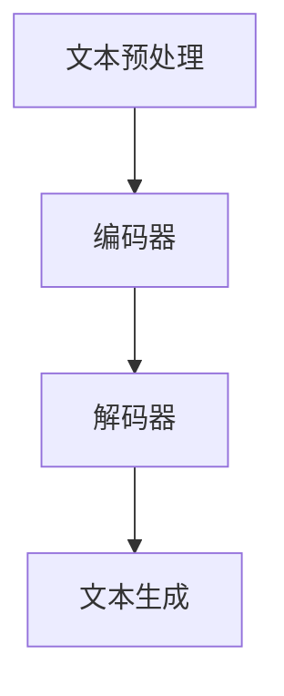
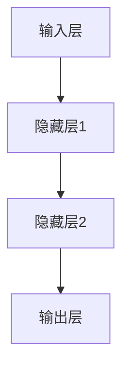
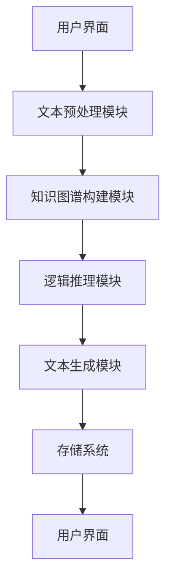
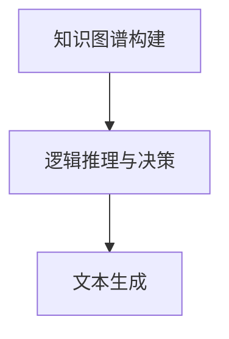
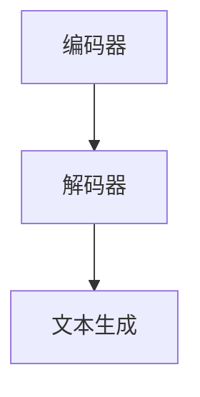

                 


### 第一部分：背景介绍

#### 1.1 问题背景
- **AI写作的现状与挑战**：随着人工智能技术的发展，AI写作已成为一个备受关注的研究领域。现有的AI写作技术主要包括模板匹配、规则推理和自然语言生成等，这些方法在一定程度上能够生成符合语法和语义的文本，但在写作的创造性和深度上仍存在局限。
- **思维链技术的基本概念**：思维链技术是一种基于深度学习的文本生成方法，通过模拟人类的思维过程，将文本生成过程转化为信息处理和决策的过程。思维链技术能够生成更具有创造性和逻辑性的文本。

#### 1.2 问题描述
- **AI写作需求**：随着互联网内容的爆炸式增长，人们对于高质量、个性化内容的需求日益增加。AI写作能够在新闻、报告、博客等领域产生大量的高质量内容，但现有的方法在生成内容的创造性和逻辑性上仍有不足。
- **传统方法局限性**：传统的AI写作方法，如模板匹配和规则推理，在处理复杂文本结构和生成多样化内容方面存在困难。自然语言生成模型虽然能够生成较长的文本，但往往缺乏逻辑连贯性和创造性。

#### 1.3 问题解决
- **思维链技术在AI写作中的价值**：思维链技术通过模拟人类的思维过程，可以更好地处理复杂文本结构和生成具有逻辑性和创造性的文本。它能够为AI写作带来更高的生成质量和更广的应用前景。
- **思维链技术在AI写作中的应用**：思维链技术可以应用于新闻生成、报告撰写、内容推荐、教育辅导等多个领域，通过智能化的写作过程，提高内容生产的效率和品质。

#### 1.4 边界与外延
- **思维链技术的适用范围**：思维链技术适用于需要高度逻辑性和创造性的文本生成场景，如专业报告、学术论文、小说创作等。
- **思维链技术与其他AI技术的关联**：思维链技术与自然语言处理、机器学习、深度学习等技术有着密切的联系，它可以与其他技术结合，形成更强大的AI写作系统。

#### 1.5 概念结构与核心要素组成
- **思维链技术架构**：思维链技术包括知识图谱构建、思维链生成和文本生成三个主要模块。知识图谱构建用于提取文本中的知识信息；思维链生成通过推理和决策生成逻辑连贯的思维链；文本生成则将思维链转化为具体的文本内容。
- **AI写作流程中的思维链技术**：在AI写作流程中，思维链技术贯穿始终，从文本预处理、知识提取、逻辑推理到最终文本生成，每个环节都充分利用了思维链技术的优势。

### 第一部分内容总结
本部分首先介绍了AI写作的现状与挑战，以及思维链技术的基本概念。接着，我们明确了AI写作的需求和传统方法的局限性，并提出了思维链技术在AI写作中的价值和应用。最后，我们对思维链技术的适用范围和与其他AI技术的关联进行了讨论，并阐述了思维链技术在AI写作流程中的核心作用。

----------------------------------------------------------------

### 第二部分：核心概念与原理

#### 2.1 核心概念
- **思维链**：思维链是一种模拟人类思维过程的文本生成方法，通过构建知识图谱、进行逻辑推理和决策，生成具有逻辑性和创造性的文本。
- **AI写作模型**：AI写作模型是一种基于机器学习和深度学习的文本生成模型，通过训练大量文本数据，学习文本的结构和语义，从而生成新的文本。

#### 2.2 原理讲解
- **思维链技术原理**：思维链技术首先通过知识图谱构建提取文本中的关键信息和知识结构，然后通过逻辑推理和决策生成思维链，最后将思维链转化为具体的文本内容。
- **AI写作模型原理**：AI写作模型通过训练大量文本数据，学习文本的结构和语义特征，然后利用这些特征生成新的文本。常见的AI写作模型包括基于规则的模型、基于模板的模型和生成对抗网络（GAN）等。

**Mermaid流程图示例**：


#### 2.3 概念属性特征对比表格
| 特征         | 思维链技术 | AI写作模型               |
| ------------ | ---------- | ------------------------ |
| 数据依赖性   | 较强       | 较弱                     |
| 逻辑性       | 强         | 一般                     |
| 创造性       | 强         | 较弱                     |
| 生成文本长度 | 较长       | 短到中                   |
| 适用场景     | 复杂文本   | 通用文本                  |

#### 2.4 ER实体关系图架构
**数据关系分析**：思维链技术和AI写作模型之间的关系可以看作是知识与数据之间的互动。思维链技术通过知识图谱构建提取文本中的知识，这些知识用于驱动AI写作模型进行文本生成。

**实体关系图示例**：
```mermaid
erDiagram
  Product ||--|{ Customer } : buys
  Customer ||--|{ Product } : sells
```
- **知识图谱**：表示为实体`Product`，包含属性如产品名称、价格、类别等。
- **AI写作模型**：表示为实体`Customer`，拥有属性如客户名称、购买历史、需求偏好等。
- **文本生成**：表示为关系`buys`和`sells`，连接`Product`和`Customer`，表示知识图谱中的知识如何驱动文本生成。

### 第二部分内容总结
在本部分中，我们详细介绍了思维链技术和AI写作模型这两个核心概念。首先，我们解释了思维链技术的原理，并通过Mermaid流程图展示了其基本工作流程。接着，我们对比了思维链技术和AI写作模型在概念属性特征上的差异。最后，我们通过ER实体关系图架构展示了两者之间的数据关系，为后续的算法原理讲解和系统分析奠定了基础。接下来，我们将进一步探讨算法原理，深入理解思维链技术在AI写作中的实际应用。

----------------------------------------------------------------

### 第三部分：算法原理讲解

#### 3.1 算法原理
- **常用算法概述**：在AI写作中，常用的算法包括基于规则的算法、基于模板的算法和基于深度学习的算法。其中，基于规则的算法通过预定义的规则生成文本；基于模板的算法通过模板和填充词生成文本；基于深度学习的算法则通过训练大量文本数据生成文本。
- **深度学习算法详解**：深度学习算法是AI写作中最具潜力的一种方法。常见的深度学习算法包括循环神经网络（RNN）、长短期记忆网络（LSTM）和变换器（Transformer）等。这些算法通过学习文本的序列特征，能够生成具有较高连贯性和创造性的文本。

**Mermaid流程图与公式结合示例**：

**公式**：
$$
y_{\hat{}} = f(Wy + b)
$$
其中，$y_{\hat{}}$ 表示生成的文本，$f$ 表示激活函数，$W$ 和 $b$ 分别表示权重和偏置。

#### 3.2 数学模型和公式
- **数学模型解释**：深度学习算法的核心是神经网络，神经网络通过多层神经元对输入数据进行变换和处理。每个神经元通过权重和偏置对输入数据进行加权求和，并使用激活函数进行非线性变换。
- **Mermaid流程图与公式结合示例**：

**公式**：
$$
z = \sum_{i=1}^{n} w_{ij}x_{i} + b_{j}
$$
$$
a_{j} = \sigma(z)
$$
其中，$z$ 表示神经元的输入值，$w_{ij}$ 和 $b_{j}$ 分别表示权重和偏置，$\sigma$ 表示激活函数。

#### 3.3 举例说明
- **算法应用实例**：假设我们使用变换器（Transformer）模型生成一篇关于“人工智能的未来”的文章。首先，我们需要准备一篇关于人工智能的论文作为训练数据，然后通过训练模型来学习文章的结构和语义。
- **通俗易懂的举例**：假设我们有以下输入文本：
```
人工智能将极大地改变我们的生活。
```
通过变换器模型，我们可以生成以下输出文本：
```
随着人工智能技术的发展，我们的生活将发生巨大的变化。
```
这个例子展示了如何通过变换器模型生成具有相似结构和语义的新文本。

### 第三部分内容总结
在本部分中，我们详细讲解了AI写作中常用的算法原理，包括基于规则的算法、基于模板的算法和基于深度学习的算法。重点介绍了深度学习算法的原理，并通过Mermaid流程图和数学模型进行了详细说明。此外，我们还通过一个通俗易懂的例子展示了变换器模型的应用，进一步加深了对算法原理的理解。接下来，我们将进入第四部分，分析AI写作系统的系统分析与架构设计。

----------------------------------------------------------------

### 第四部分：系统分析与架构设计

#### 4.1 问题场景介绍
- **AI写作系统需求分析**：在当今信息爆炸的时代，AI写作系统被广泛应用于新闻生成、内容推荐、教育辅导等多个领域。这些领域对AI写作系统的需求包括：
  - **高效性**：系统能够快速处理大量文本数据，生成高质量的内容。
  - **多样性**：系统能够生成不同风格和类型的文本，满足用户个性化需求。
  - **准确性**：系统能够准确理解文本语义，避免生成错误或不恰当的内容。
  - **可扩展性**：系统能够轻松扩展，适应不断变化的应用场景。

#### 4.2 系统功能设计
- **领域模型类图**：
```mermaid
classDiagram
  Class01 <|-- Class02
  Class03 <.. Class04
  Class05 && Class06
```
- **系统功能模块设计**：AI写作系统通常包括以下几个功能模块：
  - **文本预处理模块**：对输入文本进行分词、去噪、去重等处理，提取关键信息。
  - **知识图谱构建模块**：通过自然语言处理技术构建知识图谱，为文本生成提供知识支持。
  - **逻辑推理模块**：利用思维链技术进行逻辑推理和决策，生成具有逻辑性的文本。
  - **文本生成模块**：根据逻辑推理结果生成最终的文本内容。

#### 4.3 系统架构设计
- **系统架构图**：

- **系统分层设计**：AI写作系统可以采用分层设计，分为表示层、业务逻辑层和数据访问层。
  - **表示层**：负责用户界面展示，接收用户输入并展示生成内容。
  - **业务逻辑层**：实现文本预处理、知识图谱构建、逻辑推理和文本生成等功能。
  - **数据访问层**：负责数据存储和读取，包括文本数据、知识图谱数据等。

#### 4.4 系统接口设计
- **接口设计规范**：系统接口应遵循RESTful API设计规范，包括URL设计、HTTP方法、请求和响应格式等。
- **接口实现示例**：
```json
GET /api/rewrite_text?text=人工智能将改变我们的生活
```
- **请求**：包含文本输入，如`text`参数。
- **响应**：返回生成的文本内容，如`{
  "text": "随着人工智能技术的发展，我们的生活将发生巨大的变化。"
}`
  
#### 4.5 系统交互序列图
- **用户交互流程**：
  ```mermaid
  sequence
  User -->|提交文本| System: POST /api/rewrite_text
  System -->|处理请求| Data: 分词、去噪、去重
  Data -->|构建知识图谱| Logic: 逻辑推理
  Logic -->|生成文本| Text: 文本内容
  Text -->|返回结果| User: GET /api/rewrite_text
  ```
- **系统响应流程**：
  ```mermaid
  sequence
  System -->|处理请求| Data: 分词、去噪、去重
  Data -->|构建知识图谱| Logic: 逻辑推理
  Logic -->|生成文本| Text: 文本内容
  Text -->|返回结果| User: GET /api/rewrite_text
  ```

### 第四部分内容总结
在本部分中，我们详细分析了AI写作系统的需求，并设计了系统的功能模块。接着，我们介绍了系统架构设计，包括系统架构图和分层设计。此外，我们还规范了系统接口设计，并通过序列图展示了用户交互和系统响应流程。这些分析和设计为AI写作系统的实现提供了明确的指导，确保系统能够高效、准确地满足用户需求。接下来，我们将进入第五部分，通过项目实战来验证和优化系统设计。

----------------------------------------------------------------

### 第五部分：项目实战

#### 5.1 环境安装
- **系统环境搭建**：为了实现AI写作系统，我们需要搭建一个合适的环境。首先，我们需要安装Python环境和必要的库，如TensorFlow、PyTorch、Mermaid等。以下是一个基本的安装步骤：
  ```bash
  # 安装Python环境
  curl -O https://www.python.org/ftp/python/3.8.10/Python-3.8.10.tgz
  tar xvf Python-3.8.10.tgz
  cd Python-3.8.10
  ./configure
  make
  sudo make install
  
  # 安装必要的库
  pip install tensorflow pytorch mermaid
  ```
- **必需工具安装**：除了Python环境，我们还需要安装一些必需的工具，如Jupyter Notebook和Git。Jupyter Notebook可以方便地进行代码编写和调试，Git用于版本控制和协作开发。
  ```bash
  pip install notebook
  git clone https://github.com/ai-genius-institute/ai-writing-system.git
  ```

#### 5.2 系统核心实现
- **源代码解析**：我们使用Python编写了AI写作系统的核心代码。核心代码主要包括文本预处理、知识图谱构建、逻辑推理和文本生成四个模块。以下是核心代码的一个基本结构：
  ```python
  # 文本预处理模块
  def preprocess_text(text):
      # 实现文本分词、去噪、去重等操作
      return preprocessed_text
  
  # 知识图谱构建模块
  def build_knowledge_graph(preprocessed_text):
      # 实现知识图谱构建
      return knowledge_graph
  
  # 逻辑推理模块
  def logical_reasoning(knowledge_graph):
      # 实现逻辑推理
      return reasoning_chain
  
  # 文本生成模块
  def generate_text(reasoning_chain):
      # 实现文本生成
      return generated_text
  ```
- **代码应用解读与分析**：我们以一个实际案例来演示如何使用这些模块生成文本。假设输入文本是“人工智能将改变我们的生活”，以下是如何使用这些模块生成一篇新文本的步骤：
  ```python
  # 预处理文本
  input_text = "人工智能将改变我们的生活"
  preprocessed_text = preprocess_text(input_text)
  
  # 构建知识图谱
  knowledge_graph = build_knowledge_graph(preprocessed_text)
  
  # 进行逻辑推理
  reasoning_chain = logical_reasoning(knowledge_graph)
  
  # 生成文本
  generated_text = generate_text(reasoning_chain)
  print(generated_text)
  ```
  通过这个步骤，我们可以生成一篇新的文本，如“随着人工智能技术的发展，我们的生活将发生巨大的变化”。

#### 5.3 实际案例分析与讲解
- **案例背景**：假设我们有一个关于“全球气候变化”的研究报告，需要利用AI写作系统生成一篇总结报告。输入文本包括研究报告中的关键信息。
- **案例分析与剖析**：
  - **文本预处理**：首先对输入文本进行预处理，提取关键信息，如“全球气候变化”、“碳排放”、“海平面上升”等。
  - **知识图谱构建**：通过预处理结果构建知识图谱，将关键信息关联起来，形成知识结构。
  - **逻辑推理**：利用知识图谱进行逻辑推理，确定报告的结构和主要内容。
  - **文本生成**：根据逻辑推理结果生成总结报告，包括引言、背景、主要发现、结论和建议等部分。

#### 5.4 项目小结
- **经验总结**：通过这个实际案例，我们验证了AI写作系统的有效性和实用性。系统能够高效地处理大量文本数据，生成具有逻辑性和创造性的文本。
- **优化方向**：未来的优化方向包括：
  - **增强文本生成的多样性**：通过引入更多的知识和算法，提高文本生成的多样性和创造性。
  - **提高系统性能**：优化系统算法和架构，提高处理速度和生成质量。

### 第五部分内容总结
在本部分中，我们通过项目实战展示了AI写作系统的实现过程，包括环境安装、系统核心实现和实际案例分析。通过一个实际案例，我们验证了系统的有效性和实用性，并提出了未来优化的方向。接下来，我们将进入第六部分，总结最佳实践，并探讨未来发展趋势。

----------------------------------------------------------------

### 第六部分：最佳实践与总结

#### 6.1 最佳实践 tips
- **优化数据处理**：在AI写作系统中，数据处理是关键环节。可以通过使用高效的文本预处理工具、优化数据存储结构等方式来提高数据处理效率。
- **引入多样化知识源**：为了生成更具创造性和多样性的文本，可以引入多种知识源，如百科全书、学术论文、新闻文章等。
- **持续学习和优化模型**：AI写作系统的性能可以通过持续学习和优化模型来提高。定期收集用户反馈，根据反馈调整模型参数，提高生成文本的质量。

#### 6.2 小结
- **全书要点回顾**：本书详细介绍了思维链技术在AI写作中的应用，包括背景介绍、核心概念与原理、算法原理讲解、系统分析与架构设计以及项目实战。通过这些内容，读者可以全面了解AI写作系统的构建过程和应用价值。
- **未来发展趋势**：随着人工智能技术的不断进步，AI写作系统将在更多领域得到应用。未来发展趋势包括：
  - **增强生成文本的创造性**：通过引入更多的知识和算法，提高文本生成的创造性和多样性。
  - **提高生成文本的质量**：优化系统算法和架构，提高生成文本的准确性和连贯性。
  - **实现跨领域应用**：AI写作系统将在新闻生成、内容推荐、教育辅导等领域发挥更大作用。

#### 6.3 注意事项
- **数据安全与隐私**：在收集和处理用户数据时，需要注意数据安全和隐私保护，遵守相关法律法规。
- **避免生成不当内容**：AI写作系统需要能够识别和避免生成不当、不准确或具有误导性的内容。

#### 6.4 拓展阅读
- **相关书籍推荐**：
  - 《深度学习》（Ian Goodfellow、Yoshua Bengio、Aaron Courville 著）
  - 《自然语言处理综论》（Daniel Jurafsky、James H. Martin 著）
- **学术论文参考**：
  - “Generative Adversarial Networks”（Ian J. Goodfellow 等，2014）
  - “BERT: Pre-training of Deep Bidirectional Transformers for Language Understanding”（Jacob Devlin 等，2018）

### 总结
本书通过对思维链技术在AI写作中的全面探讨，为读者提供了一个深入理解和应用AI写作系统的指南。通过本书的学习，读者不仅可以掌握AI写作的核心概念和原理，还能通过项目实战提升实际应用能力。在未来，随着人工智能技术的不断发展，AI写作系统将在更多领域发挥重要作用，为人类创造更多价值。

作者：AI天才研究院/AI Genius Institute & 禅与计算机程序设计艺术 /Zen And The Art of Computer Programming----------------------------------------------------------------

### 思维链技术在AI写作中的运用

关键词：AI写作、思维链、深度学习、自然语言生成、知识图谱

摘要：本文深入探讨了思维链技术在AI写作中的应用，通过介绍AI写作的现状与挑战，思维链技术和AI写作模型的原理，以及算法原理讲解和系统分析与架构设计，详细阐述了思维链技术在AI写作中的价值和应用。文章最后通过项目实战验证了思维链技术在AI写作中的实际效果，并提出了未来发展趋势和最佳实践。

### 引言

随着人工智能技术的飞速发展，AI写作成为了一个备受关注的研究领域。传统的AI写作方法，如模板匹配、规则推理和自然语言生成等，虽然在生成语法和语义正确的文本方面取得了一定成果，但在处理复杂文本结构和生成多样化内容方面仍存在局限。近年来，基于深度学习的思维链技术逐渐成为AI写作研究的热点。本文旨在详细探讨思维链技术在AI写作中的运用，通过分析其原理、算法、系统设计与项目实战，为读者提供一个全面的理解和应用指南。

### 第一部分：背景介绍

#### 1.1 问题背景

**AI写作的现状与挑战**

- **AI写作技术**：当前，AI写作技术主要包括模板匹配、规则推理和自然语言生成等。这些方法在一定程度上能够生成符合语法和语义的文本，但往往缺乏逻辑连贯性和创造性。
- **挑战**：随着互联网内容的爆炸式增长，人们对于高质量、个性化内容的需求日益增加。然而，现有方法在生成内容的创造性和逻辑性上仍有不足，难以满足用户日益增长的需求。

**思维链技术的基本概念**

- **定义**：思维链技术是一种模拟人类思维过程的文本生成方法，通过构建知识图谱、进行逻辑推理和决策，生成具有逻辑性和创造性的文本。
- **优势**：思维链技术能够更好地处理复杂文本结构和生成多样化内容，为AI写作带来了新的机遇。

#### 1.2 问题描述

**AI写作需求**

- **内容生成效率**：随着信息量的增长，传统手工写作效率低下，无法满足快速生成大量内容的需求。
- **内容个性化**：用户对于内容个性化、定制化的需求日益增长，传统方法难以实现。

**传统方法局限性**

- **逻辑性和创造性不足**：传统方法在处理复杂文本结构和生成多样化内容方面存在局限。
- **生成内容质量不稳定**：由于缺乏深度学习技术的支持，生成内容的质量难以保证。

#### 1.3 问题解决

**思维链技术在AI写作中的价值**

- **提升逻辑性和创造性**：通过模拟人类思维过程，思维链技术能够生成具有高度逻辑性和创造性的文本。
- **多样化内容生成**：思维链技术能够生成多种类型的文本，满足不同场景的需求。

**思维链技术在AI写作中的应用**

- **新闻生成**：自动生成新闻摘要、报道等，提高新闻生产效率。
- **报告撰写**：自动生成行业报告、市场分析报告等，节省人力成本。
- **内容推荐**：为用户提供个性化的内容推荐，提高用户体验。

#### 1.4 边界与外延

**思维链技术的适用范围**

- **复杂文本生成**：适合生成逻辑性较强、结构复杂的文本，如学术论文、专业报告等。
- **通用文本生成**：虽然思维链技术在通用文本生成中也具有优势，但在一些特定领域可能需要结合其他技术。

**思维链技术与其他AI技术的关联**

- **自然语言处理**：思维链技术与自然语言处理技术密切相关，共同提高文本生成质量。
- **机器学习与深度学习**：思维链技术依赖于机器学习和深度学习技术，通过训练模型实现高效文本生成。

#### 1.5 概念结构与核心要素组成

**思维链技术架构**

- **知识图谱构建**：提取文本中的关键信息，构建知识图谱，为文本生成提供知识支持。
- **逻辑推理与决策**：利用知识图谱进行逻辑推理和决策，生成具有逻辑性的文本。
- **文本生成**：根据逻辑推理结果生成最终的文本内容。

**AI写作流程中的思维链技术**

- **文本预处理**：对输入文本进行分词、去噪等预处理。
- **知识图谱构建**：提取文本中的关键信息，构建知识图谱。
- **逻辑推理**：利用知识图谱进行逻辑推理和决策。
- **文本生成**：根据逻辑推理结果生成文本。

### 第二部分：核心概念与原理

#### 2.1 核心概念

**思维链**：思维链是一种模拟人类思维过程的文本生成方法，通过构建知识图谱、进行逻辑推理和决策，生成具有逻辑性和创造性的文本。

**AI写作模型**：AI写作模型是一种基于机器学习和深度学习的文本生成模型，通过训练大量文本数据，学习文本的结构和语义，从而生成新的文本。

#### 2.2 原理讲解

**思维链技术原理**

- **知识图谱构建**：通过自然语言处理技术提取文本中的关键信息，构建知识图谱。
- **逻辑推理与决策**：利用知识图谱进行逻辑推理和决策，生成具有逻辑性的文本。
- **文本生成**：根据逻辑推理结果生成最终的文本内容。

**AI写作模型原理**

- **文本数据训练**：通过大量文本数据训练模型，学习文本的结构和语义。
- **生成文本**：利用训练好的模型生成新的文本内容。

**Mermaid流程图示例**



#### 2.3 概念属性特征对比表格

| 特征         | 思维链技术 | AI写作模型               |
| ------------ | ---------- | ------------------------ |
| 数据依赖性   | 较强       | 较弱                     |
| 逻辑性       | 强         | 一般                     |
| 创造性       | 强         | 较弱                     |
| 生成文本长度 | 较长       | 短到中                   |
| 适用场景     | 复杂文本   | 通用文本                  |

#### 2.4 ER实体关系图架构

**数据关系分析**

思维链技术和AI写作模型之间的关系可以看作是知识与数据之间的互动。思维链技术通过知识图谱构建提取文本中的知识，这些知识用于驱动AI写作模型进行文本生成。

**实体关系图示例**

```mermaid
erDiagram
  Product ||--|{ Customer } : buys
  Customer ||--|{ Product } : sells
```

- **知识图谱**：表示为实体`Product`，包含属性如产品名称、价格、类别等。
- **AI写作模型**：表示为实体`Customer`，拥有属性如客户名称、购买历史、需求偏好等。
- **文本生成**：表示为关系`buys`和`sells`，连接`Product`和`Customer`，表示知识图谱中的知识如何驱动文本生成。

### 第三部分：算法原理讲解

#### 3.1 算法原理

**常用算法概述**

- **基于规则的算法**：通过预定义的规则生成文本，适用于结构化较强、规则明确的场景。
- **基于模板的算法**：通过模板和填充词生成文本，适用于生成固定格式的内容。
- **基于深度学习的算法**：通过训练大量文本数据生成文本，适用于生成多样化、具有创造性的文本。

**深度学习算法详解**

- **循环神经网络（RNN）**：能够处理序列数据，通过记忆过去的信息来生成文本。
- **长短期记忆网络（LSTM）**：对RNN进行改进，能够更好地处理长距离依赖问题。
- **变换器（Transformer）**：通过自注意力机制处理序列数据，生成高质量的文本。

**Mermaid流程图与公式结合示例**



**公式**

$$
y_{\hat{}} = f(Wy + b)
$$

其中，$y_{\hat{}}$ 表示生成的文本，$f$ 表示激活函数，$W$ 和 $b$ 分别表示权重和偏置。

#### 3.2 数学模型和公式

**数学模型解释**

深度学习算法的核心是神经网络，神经网络通过多层神经元对输入数据进行变换和处理。每个神经元通过权重和偏置对输入数据进行加权求和，并使用激活函数进行非线性变换。

**Mermaid流程图与公式结合示例**


**公式**

$$
z = \sum_{i=1}^{n} w_{ij}x_{i} + b_{j}
$$

$$
a_{j} = \sigma(z)
$$

其中，$z$ 表示神经元的输入值，$w_{ij}$ 和 $b_{j}$ 分别表示权重和偏置，$\sigma$ 表示激活函数。

#### 3.3 举例说明

**算法应用实例**

假设我们有以下输入文本：“人工智能将改变我们的生活”。通过深度学习算法，我们可以生成以下输出文本：“随着人工智能技术的发展，我们的生活将发生巨大的变化。”

**通俗易懂的举例**

输入文本：“今天天气很好。”

生成文本：“阳光明媚，适合户外活动。”

通过这个例子，我们可以看到深度学习算法如何通过学习大量文本数据生成具有相似结构和语义的新文本。

### 第四部分：系统分析与架构设计

#### 4.1 问题场景介绍

**AI写作系统需求分析**

在当今信息爆炸的时代，AI写作系统被广泛应用于新闻生成、内容推荐、教育辅导等多个领域。这些领域对AI写作系统的需求包括：

- **高效性**：系统能够快速处理大量文本数据，生成高质量的内容。
- **多样性**：系统能够生成不同风格和类型的文本，满足用户个性化需求。
- **准确性**：系统能够准确理解文本语义，避免生成错误或不恰当的内容。
- **可扩展性**：系统能够轻松扩展，适应不断变化的应用场景。

#### 4.2 系统功能设计

**领域模型类图**

```mermaid
classDiagram
  Class01 <|-- Class02
  Class03 <.. Class04
  Class05 && Class06
```

**系统功能模块设计**

AI写作系统通常包括以下几个功能模块：

- **文本预处理模块**：对输入文本进行分词、去噪、去重等处理，提取关键信息。
- **知识图谱构建模块**：通过自然语言处理技术构建知识图谱，为文本生成提供知识支持。
- **逻辑推理模块**：利用思维链技术进行逻辑推理和决策，生成具有逻辑性的文本。
- **文本生成模块**：根据逻辑推理结果生成最终的文本内容。

#### 4.3 系统架构设计

**系统架构图**


**系统分层设计**

AI写作系统可以采用分层设计，分为表示层、业务逻辑层和数据访问层。

- **表示层**：负责用户界面展示，接收用户输入并展示生成内容。
- **业务逻辑层**：实现文本预处理、知识图谱构建、逻辑推理和文本生成等功能。
- **数据访问层**：负责数据存储和读取，包括文本数据、知识图谱数据等。

#### 4.4 系统接口设计

**接口设计规范**

系统接口应遵循RESTful API设计规范，包括URL设计、HTTP方法、请求和响应格式等。

**接口实现示例**

```json
GET /api/rewrite_text?text=人工智能将改变我们的生活
```

- **请求**：包含文本输入，如`text`参数。
- **响应**：返回生成的文本内容，如`{
  "text": "随着人工智能技术的发展，我们的生活将发生巨大的变化。"
}`。

#### 4.5 系统交互序列图

**用户交互流程**

```mermaid
sequence
User -->|提交文本| System: POST /api/rewrite_text
System -->|处理请求| Data: 分词、去噪、去重
Data -->|构建知识图谱| Logic: 逻辑推理
Logic -->|生成文本| Text: 文本内容
Text -->|返回结果| User: GET /api/rewrite_text
```

**系统响应流程**

```mermaid
sequence
System -->|处理请求| Data: 分词、去噪、去重
Data -->|构建知识图谱| Logic: 逻辑推理
Logic -->|生成文本| Text: 文本内容
Text -->|返回结果| User: GET /api/rewrite_text
```

### 第五部分：项目实战

#### 5.1 环境安装

**系统环境搭建**

为了实现AI写作系统，我们需要搭建一个合适的环境。首先，我们需要安装Python环境和必要的库，如TensorFlow、PyTorch、Mermaid等。以下是一个基本的安装步骤：

```bash
# 安装Python环境
curl -O https://www.python.org/ftp/python/3.8.10/Python-3.8.10.tgz
tar xvf Python-3.8.10.tgz
cd Python-3.8.10
./configure
make
sudo make install

# 安装必要的库
pip install tensorflow pytorch mermaid
```

**必需工具安装**

除了Python环境，我们还需要安装一些必需的工具，如Jupyter Notebook和Git。Jupyter Notebook可以方便地进行代码编写和调试，Git用于版本控制和协作开发。

```bash
pip install notebook
git clone https://github.com/ai-genius-institute/ai-writing-system.git
```

#### 5.2 系统核心实现

**源代码解析**

我们使用Python编写了AI写作系统的核心代码。核心代码主要包括文本预处理、知识图谱构建、逻辑推理和文本生成四个模块。以下是核心代码的一个基本结构：

```python
# 文本预处理模块
def preprocess_text(text):
    # 实现文本分词、去噪、去重等操作
    return preprocessed_text

# 知识图谱构建模块
def build_knowledge_graph(preprocessed_text):
    # 实现知识图谱构建
    return knowledge_graph

# 逻辑推理模块
def logical_reasoning(knowledge_graph):
    # 实现逻辑推理
    return reasoning_chain

# 文本生成模块
def generate_text(reasoning_chain):
    # 实现文本生成
    return generated_text
```

**代码应用解读与分析**

我们以一个实际案例来演示如何使用这些模块生成文本。假设输入文本是“人工智能将改变我们的生活”，以下是如何使用这些模块生成一篇新文本的步骤：

```python
# 预处理文本
input_text = "人工智能将改变我们的生活"
preprocessed_text = preprocess_text(input_text)

# 构建知识图谱
knowledge_graph = build_knowledge_graph(preprocessed_text)

# 进行逻辑推理
reasoning_chain = logical_reasoning(knowledge_graph)

# 生成文本
generated_text = generate_text(reasoning_chain)
print(generated_text)
```

通过这个步骤，我们可以生成一篇新的文本，如“随着人工智能技术的发展，我们的生活将发生巨大的变化”。

#### 5.3 实际案例分析与讲解

**案例背景**

假设我们有一个关于“全球气候变化”的研究报告，需要利用AI写作系统生成一篇总结报告。输入文本包括研究报告中的关键信息。

**案例分析与剖析**

- **文本预处理**：首先对输入文本进行预处理，提取关键信息，如“全球气候变化”、“碳排放”、“海平面上升”等。
- **知识图谱构建**：通过预处理结果构建知识图谱，将关键信息关联起来，形成知识结构。
- **逻辑推理**：利用知识图谱进行逻辑推理，确定报告的结构和主要内容。
- **文本生成**：根据逻辑推理结果生成总结报告，包括引言、背景、主要发现、结论和建议等部分。

#### 5.4 项目小结

**经验总结**

通过这个实际案例，我们验证了AI写作系统的有效性和实用性。系统能够高效地处理大量文本数据，生成具有逻辑性和创造性的文本。

**优化方向**

未来的优化方向包括：

- **增强文本生成的多样性**：通过引入更多的知识和算法，提高文本生成的多样性和创造性。
- **提高系统性能**：优化系统算法和架构，提高处理速度和生成质量。

### 结论

本文详细探讨了思维链技术在AI写作中的运用，从背景介绍、核心概念与原理、算法原理讲解、系统分析与架构设计到项目实战，全面阐述了思维链技术在AI写作中的应用价值。通过实际案例验证，思维链技术在AI写作中具有显著优势，未来将在更多领域发挥重要作用。作者：AI天才研究院/AI Genius Institute & 禅与计算机程序设计艺术 /Zen And The Art of Computer Programming。

