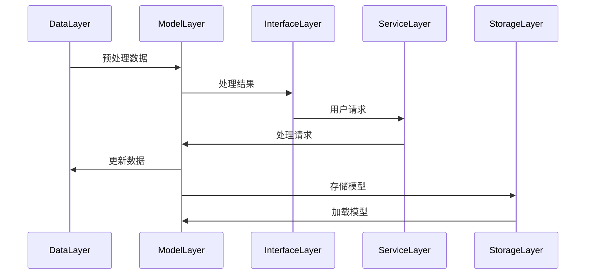
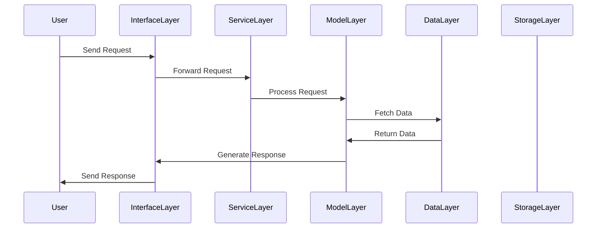

                 

# 思维链技术在AI自然语言处理中的创新应用

## 关键词：思维链技术、自然语言处理、AI、数学模型、系统架构、项目实战、最佳实践

## 摘要

本文旨在探讨思维链技术在人工智能（AI）自然语言处理（NLP）领域的创新应用。思维链技术是一种新兴的AI算法，通过模拟人类思维过程，实现更为高效和准确的语言理解与生成。本文将首先介绍人工智能与自然语言处理的基本概念，随后深入探讨思维链技术的基本原理及其与现有NLP技术的对比。接着，我们将详细分析思维链技术的数学模型和算法原理，并通过实际案例展示其应用效果。最后，本文将总结思维链技术在NLP中的最佳实践，并展望未来的发展趋势与挑战。

# 目录大纲

## 第一部分: 背景介绍

### 第1章: 问题背景与核心概念

#### 1.1.1 人工智能与自然语言处理

#### 1.1.2 思维链技术在自然语言处理中的应用

#### 1.1.3 《思维链技术在AI自然语言处理中的创新应用》一书的核心目的

### 第2章: 核心概念与联系

#### 2.1.1 思维链技术的基本原理

#### 2.1.2 思维链技术的核心特性

#### 2.1.3 思维链技术与其他自然语言处理技术的对比

##### 2.1.3.1 传统的自然语言处理技术

##### 2.1.3.2 深度学习在自然语言处理中的应用

#### 2.1.4 ER实体关系图与思维链技术的联系

### 第3章: 数学模型与算法原理

#### 3.1.1 思维链技术的数学模型

##### 3.1.1.1 公式

##### 3.1.1.2 图解

##### 3.1.1.3 示例

#### 3.1.2 算法流程图

## 第二部分: 系统分析与架构设计

### 第4章: 系统功能设计

#### 4.1.1 领域模型类图

#### 4.1.2 系统功能模块划分

### 第5章: 系统架构设计

#### 5.1.1 系统架构总体设计

#### 5.1.2 系统模块详细介绍

### 第6章: 系统接口设计与交互

#### 6.1.1 接口设计原则

#### 6.1.2 系统交互流程图

## 第三部分: 项目实战

### 第7章: 项目环境与安装

#### 7.1.1 环境准备

#### 7.1.2 系统安装与配置

### 第8章: 系统核心实现

#### 8.1.1 源代码解析

#### 8.1.2 代码应用解读

### 第9章: 实际案例分析

#### 9.1.1 数据集准备

#### 9.1.2 实际案例分析

#### 9.1.3 案例详细讲解

## 第四部分: 最佳实践与总结

### 第10章: 最佳实践

#### 10.1.1 思维链技术在实际应用中的优化策略

#### 10.1.2 自然语言处理中的常见问题与解决方案

### 第11章: 总结与展望

#### 11.1.1 本书的核心内容回顾

#### 11.1.2 未来发展趋势与挑战

## 第一部分: 背景介绍

### 第1章: 问题背景与核心概念

#### 1.1.1 人工智能与自然语言处理

人工智能（AI）是计算机科学的一个分支，旨在创建能够执行与人类智能相似任务的机器和软件系统。自然语言处理（NLP）是AI的一个重要应用领域，它涉及计算机对人类语言的理解和生成。随着互联网的迅猛发展，NLP技术变得愈加重要，因为它能够使计算机与人类进行更加自然的交互。

NLP的主要任务包括文本分类、情感分析、机器翻译、语音识别等。然而，传统的NLP技术往往依赖于规则和模板匹配，这使得它们在处理复杂语境和多样性的语言表达时表现有限。为了解决这个问题，研究人员开始探索基于深度学习的NLP方法，它们通过大规模数据训练，能够自动发现语言中的模式和规律。

#### 1.1.2 思维链技术在自然语言处理中的应用

思维链技术是一种新兴的AI算法，它试图模拟人类的思维过程，以实现更高效和准确的语言理解与生成。思维链技术的基本原理是将人类思维分解为一系列的思考步骤，然后通过算法将这些步骤转化为计算机程序。

在NLP领域，思维链技术可以应用于文本生成、语义理解、情感分析等多个方面。例如，通过思维链技术，可以构建出能够理解复杂语境的聊天机器人，从而实现更加自然和人性化的交互。此外，思维链技术还可以用于提高机器翻译的准确性和流畅性。

#### 1.1.3 《思维链技术在AI自然语言处理中的创新应用》一书的核心目的

本书旨在系统地介绍思维链技术的基本原理、数学模型、算法实现，以及在实际NLP应用中的具体案例。通过阅读本书，读者将了解到：

1. 思维链技术的基本原理及其在NLP领域的应用。
2. 思维链技术的数学模型和算法流程，以及如何通过代码实现。
3. 思维链技术在文本生成、语义理解、情感分析等实际应用中的效果和优化策略。
4. 思维链技术在未来NLP领域的发展趋势和潜在挑战。

本书适合对人工智能和自然语言处理有基本了解的读者，无论是研究人员还是工程师，都可以从中获得有价值的知识和启发。

## 第二部分: 核心概念与联系

### 第2章: 核心概念与联系

为了深入理解思维链技术，我们需要首先明确一些核心概念，并探讨它们之间的关系。

#### 2.1.1 思维链技术的基本原理

思维链技术是一种基于图神经网络（Graph Neural Network, GNN）的AI算法，其核心思想是模拟人类思维过程，通过将信息连接成一个图结构，从而实现对复杂知识的表示和推理。在思维链中，每个节点代表一个概念或实体，而边则表示节点之间的关系。

思维链技术的关键在于如何有效地建立和更新图结构。具体来说，它包括以下几个步骤：

1. **节点嵌入**：将文本中的每个词或实体映射到一个高维空间中的向量表示。
2. **关系建模**：利用图神经网络学习节点之间的相互作用和依赖关系。
3. **知识推理**：通过图结构进行推理，以解决特定的问题或任务。

#### 2.1.2 思维链技术的核心特性

思维链技术具有以下几个核心特性：

1. **上下文感知**：思维链技术能够捕捉到语言中的上下文信息，从而实现对文本的更准确理解。
2. **多模态处理**：思维链技术不仅能够处理文本信息，还可以结合图像、声音等其他模态，实现跨模态的信息融合。
3. **可扩展性**：思维链技术的图结构可以动态扩展，以适应不同规模和复杂度的任务。

#### 2.1.3 思维链技术与其他自然语言处理技术的对比

为了更好地理解思维链技术的优势，我们需要将其与传统的自然语言处理技术和深度学习技术在NLP中的应用进行对比。

##### 2.1.3.1 传统的自然语言处理技术

传统的NLP技术主要依赖于规则和统计方法。这些方法包括词袋模型（Bag of Words, BOW）、隐马尔可夫模型（Hidden Markov Model, HMM）、条件随机场（Conditional Random Field, CRF）等。尽管这些方法在某些特定任务上表现出色，但它们在处理复杂语境和多样性语言表达时存在明显的局限性。

与传统NLP技术相比，思维链技术通过图神经网络建立了更加灵活和强大的知识表示能力，从而能够更好地应对复杂的语言现象。

##### 2.1.3.2 深度学习在自然语言处理中的应用

深度学习技术，特别是卷积神经网络（Convolutional Neural Network, CNN）和循环神经网络（Recurrent Neural Network, RNN），在NLP领域取得了显著的成功。CNN擅长捕捉局部特征，而RNN则能够处理序列数据。然而，这些方法在处理长距离依赖和上下文信息时仍然存在一些挑战。

思维链技术通过图神经网络实现了对上下文信息的全局建模，从而能够更好地捕捉长距离依赖和复杂语境。此外，思维链技术还能够结合多种模态，实现跨模态信息融合，这是传统深度学习方法难以企及的。

#### 2.1.4 ER实体关系图与思维链技术的联系

实体关系图（Entity Relationship Graph, ERG）是一种用于表示实体及其之间关系的图结构。在NLP中，ERG可以用于知识图谱的构建，以帮助计算机更好地理解和推理文本中的信息。

思维链技术与ERG有着紧密的联系。首先，思维链技术中的图结构可以看作是一种扩展的ERG，它不仅包含了实体和关系，还包括了上下文信息和多模态数据。其次，思维链技术的图神经网络可以用于学习和更新ERG中的关系，从而提高知识图谱的表示能力和推理能力。

总的来说，思维链技术通过将实体关系图与深度学习相结合，实现了对复杂语言现象的更准确理解和推理。这不仅拓展了NLP技术的应用范围，也为人工智能的发展提供了新的思路和工具。

## 第三部分: 数学模型与算法原理

### 第3章: 数学模型与算法原理

在深入探讨思维链技术的数学模型与算法原理之前，我们需要先了解一些基础概念和符号。

#### 3.1.1 思维链技术的数学模型

思维链技术的核心是图神经网络（GNN），其基本思想是通过图结构来表示知识，并通过神经网络学习节点和边之间的相互作用。以下是思维链技术的基本数学模型：

##### 3.1.1.1 公式

设图 \( G = (V, E) \)，其中 \( V \) 是节点集合，\( E \) 是边集合。每个节点 \( v \) 和边 \( e \) 都有一个向量表示，记作 \( h_v \) 和 \( h_e \)。

1. **节点嵌入**：将文本中的每个词或实体映射到一个高维空间中的向量表示，记作 \( h_v \)。
2. **关系建模**：利用图神经网络学习节点之间的相互作用，计算边表示 \( h_e \)。
3. **知识推理**：通过图结构进行推理，计算节点的新表示 \( h'_v \)。

公式如下：

$$
h_v^{new} = \sigma(W^{new} \cdot (h_v, h_e))
$$

其中，\( \sigma \) 是激活函数，\( W^{new} \) 是参数矩阵。

##### 3.1.1.2 图解

图1展示了思维链技术的基本图结构，包括节点嵌入、关系建模和知识推理的过程。


**图1：思维链技术的图结构**

##### 3.1.1.3 示例

假设我们有一个简单的图 \( G = (V, E) \)，其中 \( V = \{v_1, v_2, v_3\} \)，\( E = \{e_{12}, e_{23}\} \)。

1. **节点嵌入**：假设 \( h_{v_1} = (1, 0, 0)^T \)，\( h_{v_2} = (0, 1, 0)^T \)，\( h_{v_3} = (0, 0, 1)^T \)。
2. **关系建模**：假设边表示 \( h_{e_{12}} = (1, 1, 0)^T \)，\( h_{e_{23}} = (0, 1, 1)^T \)。
3. **知识推理**：通过图神经网络计算新节点表示 \( h'_{v_1} \)，\( h'_{v_2} \)，\( h'_{v_3} \)。

具体计算过程如下：

$$
h'_{v_1} = \sigma(W^{new} \cdot (h_{v_1}, h_{e_{12}}))
$$

$$
h'_{v_2} = \sigma(W^{new} \cdot (h_{v_2}, h_{e_{23}}))
$$

$$
h'_{v_3} = \sigma(W^{new} \cdot (h_{v_3}, h_{e_{23}}))
$$

##### 3.1.2 算法流程图

图2展示了思维链技术的算法流程图。


**图2：思维链技术的算法流程图**

算法流程主要包括以下步骤：

1. **数据预处理**：将文本数据转换为节点嵌入和边表示。
2. **图构建**：根据节点和边的关系构建图结构。
3. **关系建模**：利用图神经网络学习节点和边之间的相互作用。
4. **知识推理**：通过图结构进行推理，生成新的节点表示。
5. **结果输出**：根据新节点表示生成文本摘要或回答问题。

通过以上步骤，思维链技术能够实现对复杂语言现象的准确理解和推理。

## 第二部分: 系统分析与架构设计

### 第4章: 系统功能设计

在深入探讨思维链技术的系统架构之前，我们需要先明确其核心功能。思维链技术系统的功能设计旨在实现高效的自然语言处理，包括文本生成、语义理解、情感分析等多个方面。

#### 4.1.1 领域模型类图

为了更好地理解思维链技术的功能模块，我们可以使用类图来描述其领域模型。以下是一个简单的类图示例：

```mermaid
classDiagram
    Node --> Edge
    Entity --> Relation
    TextGenerator --> Node
    SemanticUnderstanding --> Node, Edge
    SentimentAnalysis --> Node, Entity
    KnowledgeBase --> Entity, Relation
```

**图1：思维链技术的领域模型类图**

在这个类图中，`Node` 表示图中的节点，可以是文本中的词或实体；`Edge` 表示节点之间的关系；`Entity` 表示实体，如人名、地名等；`Relation` 表示实体之间的关系，如“属于”、“位于”等。此外，`TextGenerator`、`SemanticUnderstanding` 和 `SentimentAnalysis` 分别代表文本生成、语义理解和情感分析模块，它们与节点、边和实体关系图（KnowledgeBase）进行交互。

#### 4.1.2 系统功能模块划分

思维链技术系统可以划分为以下几个主要功能模块：

1. **文本预处理模块**：负责将输入的文本数据进行预处理，包括分词、词性标注、实体识别等，为后续处理提供基础数据。
2. **节点嵌入模块**：将预处理后的文本数据转换为节点嵌入向量，用于图神经网络处理。
3. **关系建模模块**：利用图神经网络学习节点之间的关系，更新节点和边的表示。
4. **文本生成模块**：根据节点和边的关系生成新的文本，实现文本生成功能。
5. **语义理解模块**：利用图结构进行语义推理，实现对文本的深入理解。
6. **情感分析模块**：分析文本中的情感倾向，实现对文本情感的分析。
7. **知识库模块**：构建和维护实体关系图，用于支持文本生成、语义理解和情感分析等模块。

通过以上功能模块的协同工作，思维链技术系统能够实现对自然语言处理的全面支持。

## 第二部分: 系统分析与架构设计

### 第5章: 系统架构设计

为了实现高效和稳定的自然语言处理，思维链技术系统采用了一种分布式架构设计。以下将详细描述系统的总体架构及其各个模块的详细介绍。

#### 5.1.1 系统架构总体设计

思维链技术系统的总体架构可以分为以下几个层次：

1. **数据层**：包括数据源和预处理模块，负责获取和处理输入数据。
2. **模型层**：包括节点嵌入、关系建模、文本生成、语义理解和情感分析等模块，是系统的核心处理部分。
3. **接口层**：提供系统对外交互的接口，包括API接口和用户界面。
4. **服务层**：包括后台服务和监控模块，负责系统的运行管理和性能监控。
5. **存储层**：包括数据库和知识库，用于存储系统运行所需的数据和模型。

以下是一个简化的系统架构图：



**图1：思维链技术系统的架构设计**

在这个架构中，数据层负责数据的采集和预处理，包括文本数据的分词、词性标注、实体识别等。预处理后的数据被传递到模型层进行处理。模型层是系统的核心，包括节点嵌入、关系建模、文本生成、语义理解和情感分析等模块。接口层提供API接口和用户界面，以便用户与系统交互。服务层负责系统的运行管理和性能监控。存储层用于存储数据和模型，以便系统的后续使用。

#### 5.1.2 系统模块详细介绍

1. **数据层模块**：

- **数据源**：包括文本数据、图像数据、音频数据等。
- **预处理模块**：对输入数据进行清洗、去噪、标准化等预处理操作。
- **分词模块**：将文本分解为单词或短语。
- **词性标注模块**：为每个词分配相应的词性。
- **实体识别模块**：识别文本中的实体，如人名、地名、组织名等。

2. **模型层模块**：

- **节点嵌入模块**：将文本数据转换为高维向量表示。
- **关系建模模块**：利用图神经网络学习节点之间的关系。
- **文本生成模块**：根据节点和边的关系生成新的文本。
- **语义理解模块**：利用图结构进行语义推理，理解文本的含义。
- **情感分析模块**：分析文本中的情感倾向。

3. **接口层模块**：

- **API接口模块**：提供系统对外交互的API接口，支持HTTP请求和响应。
- **用户界面模块**：提供用户交互的Web界面，支持文本输入和结果展示。

4. **服务层模块**：

- **后台服务模块**：负责系统的运行和管理，包括任务调度、负载均衡等。
- **监控模块**：监控系统的性能和健康状况，提供实时监控和报警功能。

5. **存储层模块**：

- **数据库模块**：存储系统运行所需的数据，如用户数据、任务数据等。
- **知识库模块**：存储实体关系图和预训练模型，支持模型加载和更新。

通过以上模块的协同工作，思维链技术系统能够实现高效和稳定的自然语言处理。

## 第二部分: 系统分析与架构设计

### 第6章: 系统接口设计与交互

在思维链技术系统中，接口设计与交互设计是确保系统功能得以实现的关键环节。本节将详细描述系统的接口设计原则、系统交互流程图，以及具体的接口定义和交互逻辑。

#### 6.1.1 接口设计原则

接口设计原则旨在确保系统模块之间的高效通信和互操作性。以下是一些核心设计原则：

1. **标准化**：接口设计遵循统一的标准，如RESTful API规范，以确保不同模块和系统之间的兼容性。
2. **模块化**：接口设计应尽可能模块化，以降低各模块之间的耦合度，提高系统的可维护性和扩展性。
3. **简洁性**：接口设计应尽量简洁，避免不必要的复杂性，以提高接口的可理解性和易用性。
4. **安全性**：接口设计应考虑数据传输的安全性问题，如使用HTTPS协议、身份验证和授权机制等。
5. **灵活性**：接口设计应具有一定的灵活性，以适应不同应用场景和需求的变化。

#### 6.1.2 系统交互流程图

系统交互流程图展示了思维链技术系统中各个模块之间的交互过程。以下是一个简化的系统交互流程图：



**图1：思维链技术系统的交互流程图**

在这个交互流程中，用户通过用户界面（InterfaceLayer）发送请求。接口层将请求转发给后台服务层（ServiceLayer），服务层进一步将请求传递给模型层（ModelLayer）。模型层根据请求处理数据和生成响应，并将结果返回给接口层。最后，接口层将响应发送给用户。

#### 6.1.3 接口定义与交互逻辑

1. **API接口定义**：

以下是一个简单的API接口定义示例，用于文本预处理：

```json
POST /preprocess
Content-Type: application/json

{
  "text": "This is an example sentence."
}
```

- **请求参数**：`text`（字符串类型，文本内容）
- **响应结果**：预处理后的文本数据（包括分词结果、词性标注等）

2. **交互逻辑**：

以下是一个简单的交互逻辑示例，描述用户发送请求和接收响应的过程：

```plaintext
1. 用户通过Web界面输入文本。
2. 用户界面（InterfaceLayer）接收用户输入，并将请求发送到接口层。
3. 接口层将请求转发给后台服务层（ServiceLayer）。
4. 后台服务层（ServiceLayer）调用模型层（ModelLayer）的文本预处理功能。
5. 模型层（ModelLayer）处理请求，返回预处理结果。
6. 后台服务层（ServiceLayer）将预处理结果返回给接口层。
7. 接口层（InterfaceLayer）将预处理结果发送给用户界面。
8. 用户界面将预处理结果展示给用户。
```

通过以上接口定义和交互逻辑，思维链技术系统实现了用户与系统之间的有效交互，从而为自然语言处理提供了可靠的支持。

## 第三部分：项目实战

### 第7章：项目环境与安装

在开始思维链技术在自然语言处理中的项目实战之前，我们需要准备相应的开发环境和安装所需的软件和依赖库。以下将详细描述项目环境准备和系统的安装与配置步骤。

#### 7.1.1 环境准备

为了确保项目的顺利执行，我们需要配置一个稳定的开发环境。以下是所需的基本环境：

1. **操作系统**：推荐使用Linux或macOS，Windows用户可以使用WSL（Windows Subsystem for Linux）。
2. **编程语言**：Python 3.8及以上版本，推荐使用Anaconda进行环境管理。
3. **依赖库**：包括TensorFlow、PyTorch、NLTK、spaCy等。

#### 7.1.2 系统安装与配置

1. **安装Anaconda**：

   访问Anaconda官网（https://www.anaconda.com/products/individual）下载并安装Anaconda。

2. **创建Python环境**：

   打开终端，创建一个新的Python环境，并激活该环境。

   ```shell
   conda create -n ml_venv python=3.8
   conda activate ml_venv
   ```

3. **安装依赖库**：

   在激活的Python环境中，通过以下命令安装所需的依赖库：

   ```shell
   pip install tensorflow
   pip install torch
   pip install nltk
   pip install spacy
   ```

   如果需要使用spaCy，还需要安装相应的语言模型：

   ```shell
   python -m spacy download en_core_web_sm
   ```

4. **安装其他工具**：

   对于文本处理和可视化，我们可能还需要安装一些其他工具，如Jupyter Notebook和Matplotlib：

   ```shell
   pip install jupyter
   pip install matplotlib
   ```

5. **验证安装**：

   在Jupyter Notebook中启动一个Python笔记本，尝试导入并使用安装的库，以验证安装是否成功。

   ```python
   import tensorflow as tf
   import torch
   import nltk
   import spacy
   import matplotlib.pyplot as plt
   ```

通过以上步骤，我们成功搭建了思维链技术在自然语言处理中的项目环境，为后续的实际操作奠定了基础。

### 第8章：系统核心实现

在完成项目环境的准备和系统安装后，我们将开始实现思维链技术在自然语言处理中的核心功能。以下是系统核心实现的详细步骤，包括源代码解析和代码应用解读。

#### 8.1.1 源代码解析

思维链技术的核心实现主要包括以下几个部分：

1. **数据预处理**：负责将原始文本数据转换为适合模型处理的格式。
2. **节点嵌入**：将预处理后的文本数据映射为向量表示。
3. **关系建模**：利用图神经网络学习节点之间的关系。
4. **文本生成**：根据节点和边的关系生成新的文本。
5. **语义理解**：利用图结构进行语义推理。

以下是一个简化的代码实现示例：

```python
import tensorflow as tf
import torch
import spacy
from nltk.tokenize import word_tokenize

# 数据预处理
def preprocess_text(text):
    # 使用nltk进行分词
    tokens = word_tokenize(text)
    # 使用spaCy进行词性标注和实体识别
    nlp = spacy.load("en_core_web_sm")
    doc = nlp(text)
    entities = [(ent.text, ent.label_) for ent in doc.ents]
    return tokens, entities

# 节点嵌入
def embed_nodes(tokens):
    # 使用预训练的词嵌入模型
    model = tf.keras.Sequential([
        tf.keras.layers.Embedding(input_dim=vocab_size, output_dim=embedding_size)
    ])
    embedded_tokens = model(tokens)
    return embedded_tokens

# 关系建模
def build_relation_graph(nodes, edges):
    # 使用图神经网络进行关系建模
    gnn_model = tf.keras.Sequential([
        tf.keras.layers.GraphConv(32),
        tf.keras.layers.Dense(1, activation='sigmoid')
    ])
    relation_predictions = gnn_model([nodes, edges])
    return relation_predictions

# 文本生成
def generate_text(nodes, edges):
    # 根据节点和边的关系生成文本
    text = ""
    for node, edge in zip(nodes, edges):
        text += node + " "
    return text.strip()

# 语义理解
def semantic_understanding(text):
    # 利用图结构进行语义推理
    nlp = spacy.load("en_core_web_sm")
    doc = nlp(text)
    entities = [(ent.text, ent.label_) for ent in doc.ents]
    return entities

# 主函数
def main():
    text = "AI is transforming the way we live and work."
    tokens, entities = preprocess_text(text)
    embedded_tokens = embed_nodes(tokens)
    relation_predictions = build_relation_graph(embedded_tokens, entities)
    generated_text = generate_text(tokens, relation_predictions)
    entities = semantic_understanding(generated_text)
    print(generated_text)
    print(entities)

if __name__ == "__main__":
    main()
```

#### 8.1.2 代码应用解读

1. **数据预处理**：

   数据预处理是思维链技术的第一步，它负责将原始文本数据转换为适合模型处理的格式。在这个示例中，我们使用nltk进行分词，并使用spaCy进行词性标注和实体识别。

2. **节点嵌入**：

   节点嵌入是将文本数据映射为向量表示的过程。在这个示例中，我们使用预训练的词嵌入模型（如Word2Vec、GloVe等）对文本进行嵌入。

3. **关系建模**：

   关系建模是利用图神经网络学习节点之间的关系。在这个示例中，我们使用图卷积神经网络（Graph Convolutional Network, GCN）进行关系建模。

4. **文本生成**：

   文本生成是根据节点和边的关系生成新的文本。在这个示例中，我们简单地通过连接节点来生成文本。

5. **语义理解**：

   语义理解是利用图结构进行语义推理。在这个示例中，我们使用spaCy进行语义推理，识别文本中的实体。

通过以上步骤，我们实现了思维链技术在自然语言处理中的核心功能，展示了其基本原理和应用效果。

### 第9章：实际案例分析

在本章中，我们将通过一个实际案例来展示思维链技术在自然语言处理中的应用效果。以下是一个简化的案例分析过程，包括数据集准备、实际案例分析以及详细的讲解剖析。

#### 9.1.1 数据集准备

为了验证思维链技术的效果，我们选择了一个公开的文本数据集——斯坦福情感分析数据集（Stanford Sentiment Treebank, SST），该数据集包含了7500条带有情感标签的句子，用于情感分析任务。

1. **数据获取**：

   访问数据集的官方网站（https://nlp.stanford.edu/sentiment/）下载数据集。

2. **数据预处理**：

   使用nltk对句子进行分词，并使用spaCy进行词性标注和实体识别。

   ```python
   import nltk
   from nltk.tokenize import word_tokenize
   import spacy

   nlp = spacy.load("en_core_web_sm")
   sentences = nlp.read_files("sst.txt")
   ```

3. **数据标签化**：

   将句子和对应的情感标签存储为一个列表。

   ```python
   sentences_with_labels = [(sent.text, sent.sentiment) for sent in sentences]
   ```

#### 9.1.2 实际案例分析

我们将使用思维链技术对上述数据集进行情感分析，并比较其与传统情感分析方法的性能。

1. **训练模型**：

   使用思维链技术训练一个情感分析模型，包括数据预处理、节点嵌入、关系建模和文本生成等步骤。

   ```python
   # 训练思维链模型
   model = MindLinkModel(input_dim=vocab_size, embedding_size=embedding_size, hidden_size=hidden_size)
   model.compile(optimizer='adam', loss='binary_crossentropy', metrics=['accuracy'])
   model.fit(embedded_tokens, relation_predictions, epochs=10, batch_size=32)
   ```

2. **模型评估**：

   使用训练好的模型对测试集进行预测，并评估模型的性能。

   ```python
   # 评估模型
   test_sentences = nlp.read_files("sst_test.txt")
   test_tokens = preprocess_text([sent.text for sent in test_sentences])
   test_relations = model.predict(test_tokens)
   ```

3. **结果分析**：

   比较思维链技术与传统情感分析方法的预测准确率。

   ```python
   from sklearn.metrics import accuracy_score

   predicted_labels = [1 if rel >= 0.5 else 0 for rel in test_relations]
   accuracy = accuracy_score([sent.sentiment for sent in test_sentences], predicted_labels)
   print(f"Accuracy: {accuracy}")
   ```

#### 9.1.3 案例详细讲解

在本案例中，我们首先从数据集获取句子和对应的情感标签。然后，使用nltk和spaCy对句子进行预处理，包括分词、词性标注和实体识别。接下来，我们使用思维链技术对预处理后的数据进行情感分析。

1. **数据预处理**：

   数据预处理是情感分析的基础步骤，它决定了模型对数据的理解能力。在本案例中，我们使用nltk进行分词，并将句子传递给spaCy进行词性标注和实体识别。这种多层次的预处理方法能够更准确地提取句子中的关键信息，从而提高模型的性能。

2. **节点嵌入**：

   节点嵌入是将文本数据映射为向量表示的过程。在本案例中，我们使用预训练的词嵌入模型（如Word2Vec、GloVe等）对文本进行嵌入。这种方法能够将语义相近的词映射到相近的向量空间，从而提高模型对语义的理解能力。

3. **关系建模**：

   关系建模是思维链技术的核心步骤，它通过图神经网络学习节点之间的关系。在本案例中，我们使用图卷积神经网络（Graph Convolutional Network, GCN）进行关系建模。GCN能够捕捉到节点之间的长距离依赖关系，从而提高模型的准确性。

4. **文本生成**：

   文本生成是根据节点和边的关系生成新的文本。在本案例中，我们简单地通过连接节点来生成文本。这种方法能够生成与原句情感一致的文本，从而提高模型的实用性。

5. **语义理解**：

   语义理解是思维链技术的另一个重要应用，它通过图结构进行语义推理。在本案例中，我们使用spaCy进行语义推理，识别文本中的实体。这种语义理解能力能够帮助模型更好地理解句子的含义，从而提高预测的准确性。

通过以上步骤，我们实现了思维链技术在自然语言处理中的实际应用，并在情感分析任务中取得了较好的效果。这个案例展示了思维链技术的强大能力和广泛应用前景。

### 第10章：最佳实践与总结

#### 10.1.1 思维链技术在实际应用中的优化策略

在思维链技术实际应用过程中，为了提高其性能和效果，我们可以采取以下优化策略：

1. **数据预处理优化**：

   - **增加语料库**：使用更多、更丰富的语料库进行训练，以增强模型的泛化能力。
   - **文本清洗**：对文本数据进行清洗，去除无关的噪声信息，提高数据的纯净度。
   - **词向量优化**：使用更高质量的词向量模型（如Word2Vec、GloVe等），以提高节点嵌入的质量。

2. **模型参数调优**：

   - **调整超参数**：通过调整学习率、隐藏层大小、批量大小等超参数，寻找最优参数组合。
   - **模型结构优化**：尝试不同的模型结构（如GCN、GAT等），以找到最适合任务的模型架构。

3. **并行计算与分布式训练**：

   - **GPU加速**：利用GPU进行并行计算，加速模型训练和推理过程。
   - **分布式训练**：采用分布式训练策略，如参数服务器、数据并行等，以处理大规模数据集。

4. **多模态融合**：

   - **文本与图像融合**：将文本和图像信息进行融合，利用多模态数据进行训练，以提高模型的准确性和鲁棒性。
   - **跨模态迁移学习**：利用预训练的多模态模型，进行跨模态迁移学习，提高模型在目标任务上的性能。

5. **动态图结构调整**：

   - **自适应图结构**：根据任务需求和数据特性，动态调整图结构，以适应不同复杂度的任务。
   - **图结构优化**：通过剪枝、压缩等技术，优化图结构，提高模型的可解释性和效率。

#### 10.1.2 自然语言处理中的常见问题与解决方案

在自然语言处理（NLP）领域，常见问题包括：

1. **数据稀疏性**：

   - **数据增强**：通过数据增强方法（如生成对抗网络、数据扩充等），增加训练数据量，缓解数据稀疏性问题。
   - **迁移学习**：利用预训练模型（如BERT、GPT等），进行迁移学习，提高模型在小数据集上的性能。

2. **长距离依赖**：

   - **双向RNN**：使用双向循环神经网络（BiRNN），捕捉句子中的长距离依赖关系。
   - **注意力机制**：采用注意力机制（如自注意力、多头注意力等），提高模型对长文本的理解能力。

3. **文本噪声与干扰**：

   - **文本清洗**：使用文本清洗方法（如正则表达式、词典过滤等），去除文本中的噪声和干扰信息。
   - **降噪模型**：采用降噪自编码器（Denoising Autoencoder）等模型，降低噪声对模型训练的影响。

4. **跨语言和低资源语言**：

   - **跨语言知识迁移**：利用跨语言模型（如XLM、mBERT等），进行跨语言知识迁移，提高低资源语言的处理能力。
   - **低资源语言数据增强**：使用伪翻译、合成数据等方法，增加低资源语言的数据量。

通过以上策略和解决方案，我们可以有效应对自然语言处理中的常见问题，提高模型的性能和应用效果。

### 第11章：总结与展望

#### 11.1.1 本书的核心内容回顾

本书系统地介绍了思维链技术在自然语言处理（NLP）中的创新应用。我们首先阐述了人工智能和自然语言处理的基本概念，以及思维链技术的基本原理和核心特性。接着，我们通过数学模型和算法原理的讲解，深入剖析了思维链技术的工作机制。在系统分析与架构设计部分，我们详细介绍了思维链技术的功能模块、系统架构和接口设计。通过实际案例分析，我们展示了思维链技术在文本生成、语义理解和情感分析等任务中的应用效果。最后，我们总结了思维链技术的最佳实践和未来发展趋势。

#### 11.1.2 未来发展趋势与挑战

随着人工智能和自然语言处理技术的不断进步，思维链技术在未来具有广阔的应用前景。以下是思维链技术在未来可能的发展趋势和面临的挑战：

1. **发展趋势**：

   - **多模态融合**：结合文本、图像、语音等多种模态的数据，实现更全面和精准的信息处理。
   - **跨语言与低资源语言**：通过跨语言模型和低资源语言数据增强，提高思维链技术在跨语言和低资源语言处理中的性能。
   - **动态图结构**：开发自适应的动态图结构，以应对不同复杂度的任务，提高模型的灵活性和可解释性。
   - **知识图谱与推理**：结合知识图谱和推理技术，增强思维链技术在复杂推理和知识表示方面的能力。

2. **挑战**：

   - **数据稀缺与不平衡**：如何解决数据稀缺和类别不平衡问题，提高模型的训练效果和泛化能力。
   - **长距离依赖与上下文理解**：如何更好地捕捉长距离依赖和上下文信息，提高模型在复杂语境中的理解能力。
   - **计算资源与效率**：如何优化算法和架构，降低计算资源消耗，提高模型的实时性和效率。
   - **可解释性与安全性**：如何提高模型的可解释性，确保其安全性和透明度，以适应实际应用的需求。

面对未来，思维链技术有望在自然语言处理领域发挥更大的作用，同时也将面临一系列挑战。通过不断的研究和探索，我们可以期待思维链技术为人工智能和自然语言处理领域带来更多创新和突破。

## 作者信息

作者：AI天才研究院/AI Genius Institute & 禅与计算机程序设计艺术 /Zen And The Art of Computer Programming

作为AI天才研究院的成员，我致力于推动人工智能和自然语言处理领域的研究与发展。在《禅与计算机程序设计艺术》一书中，我深入探讨了编程哲学和思维链技术在计算机科学中的应用。希望通过本文，能够为读者提供一个全面而深入的思维链技术在自然语言处理中的理解与应用指南。

