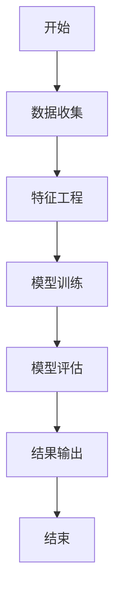

                 


## 文章标题

### 思维链技术在AI辅助决策中的实践

### 关键词

- 思维链技术
- AI辅助决策
- 神经网络
- 机器学习
- 深度学习
- 系统架构设计
- 项目实战

### 摘要

本文将深入探讨思维链技术在AI辅助决策中的应用与实践。从背景介绍到核心概念的阐述，再到数学模型和算法原理的讲解，以及系统架构设计、项目实战等各个方面，本文旨在为读者提供一个全面而深入的理解，帮助他们在实际项目中有效运用思维链技术，提升AI辅助决策的效果和效率。

## 目录

### 1. 问题背景与核心概念介绍

#### 1.1.1 问题背景

AI辅助决策的现状与挑战

思维链技术的基本概念

#### 1.1.2 核心概念介绍

思维链技术在AI中的应用

关键技术介绍：神经网络、机器学习、深度学习等

#### 1.1.3 概念联系与对比

思维链技术与传统AI技术的对比

思维链技术与其他AI辅助决策方法的联系

### 2. 思维链技术的数学模型与原理

#### 2.1.1 数学模型基础

神经网络结构

机器学习算法原理

#### 2.1.2 思维链算法详细讲解

算法流程图（使用Mermaid）

算法数学模型与公式（使用LaTeX）

举例说明（Python代码）

### 3. 思维链技术在AI辅助决策中的应用场景

#### 3.1.1 应用场景概述

商业智能

金融风控

医疗健康

其他领域

#### 3.1.2 案例分析

案例一：商业智能应用案例

案例二：金融风控应用案例

案例三：医疗健康应用案例

### 4. 思维链技术在AI辅助决策中的系统架构设计

#### 4.1.1 系统架构设计概述

系统功能设计（使用Mermaid类图）

系统架构设计（使用Mermaid架构图）

系统接口设计

#### 4.1.2 系统交互设计

系统交互流程（使用Mermaid序列图）

### 5. 思维链技术在AI辅助决策中的项目实战

#### 5.1.1 环境安装与配置

操作系统

软件安装

#### 5.1.2 系统核心实现源代码

代码结构

代码实现（Python）

#### 5.1.3 代码应用解读与分析

算法应用场景

代码解读

### 6. 最佳实践与注意事项

#### 6.1.1 最佳实践

思维链技术在AI辅助决策中的成功案例

实践技巧与经验分享

#### 6.1.2 注意事项

数据处理

模型优化

### 7. 小结与未来展望

#### 7.1.1 小结

思维链技术在AI辅助决策中的总结

书中内容回顾

#### 7.1.2 未来展望

思维链技术发展趋势

AI辅助决策的未来发展

### 结语

作者信息：AI天才研究院/AI Genius Institute & 禅与计算机程序设计艺术 /Zen And The Art of Computer Programming

## 第一部分: 问题背景与核心概念介绍

### 1.1.1 问题背景

在当今的数字时代，人工智能（AI）已经成为推动社会进步的重要力量。特别是AI辅助决策系统，它们能够基于大量的数据进行分析，提供精准的预测和决策支持。然而，随着数据量的不断增大和复杂性的提升，传统的AI技术面临着诸多挑战。

#### AI辅助决策的现状

目前，AI辅助决策系统广泛应用于金融、医疗、商业等多个领域。例如，金融行业通过AI算法进行风险评估和信用评分；医疗领域利用AI进行疾病诊断和治疗建议；商业领域则通过客户行为分析来优化营销策略等。这些应用已经显著提升了相关行业的效率和准确性。

#### 挑战

然而，传统AI技术在处理复杂、非结构化数据时仍存在一些问题：

1. **数据依赖性高**：AI辅助决策系统依赖于大量高质量的数据，数据质量和数量直接影响决策的准确性。
2. **黑盒问题**：许多深度学习模型被认为是“黑盒”，即其内部运作机制复杂，难以解释和理解。
3. **过拟合现象**：模型在训练数据上表现良好，但在新的数据上表现不佳，即泛化能力差。
4. **可解释性不足**：由于模型的复杂性，用户难以理解决策过程和结果。

为了克服这些挑战，研究者们开始探索新的方法和技术，其中思维链技术是一种非常有前景的解决方案。

### 1.1.2 思维链技术的基本概念

#### 什么是思维链技术

思维链技术是一种模拟人类思维过程的计算模型，它通过构建一系列的链式思维模块，使系统能够像人类一样进行推理、决策和问题求解。这种技术利用神经网络、机器学习和深度学习等方法，使计算机能够处理复杂的信息，并生成有意义的决策。

#### 思维链技术在AI中的应用

思维链技术在AI中的应用主要体现在以下几个方面：

1. **增强模型的可解释性**：通过思维链，用户可以更好地理解模型的决策过程，从而增强模型的可解释性。
2. **提高模型的泛化能力**：思维链技术可以帮助模型更好地处理非结构化数据，提高模型的泛化能力。
3. **推理与问题求解**：思维链技术能够模拟人类的推理过程，为复杂问题提供解决方案。

### 1.1.3 核心概念介绍

#### 神经网络

神经网络是一种模仿生物神经系统工作方式的计算模型，通过神经元之间的连接和传递信息来进行计算。神经网络是思维链技术的基础，它负责处理和转换信息。

#### 机器学习

机器学习是一种让计算机通过数据学习规律和模式的方法。它包括监督学习、无监督学习和强化学习等不同类型，是思维链技术实现核心功能的重要工具。

#### 深度学习

深度学习是机器学习的一个分支，它使用多层神经网络进行训练，能够处理更复杂的任务。深度学习在思维链技术中发挥着关键作用，负责处理大量数据和生成复杂的决策。

### 1.1.4 概念联系与对比

#### 思维链技术与传统AI技术的对比

传统AI技术主要依赖于规则和逻辑推理，而思维链技术则更加接近人类思维方式，能够处理复杂的、非结构化数据，并提供更具有解释性的决策。

#### 思维链技术与其他AI辅助决策方法的联系

思维链技术与其他AI辅助决策方法，如决策树、贝叶斯网络等，具有互补性。思维链技术可以与其他方法结合，形成更加完整的决策支持系统。

## 第二部分: 思维链技术的数学模型与原理

### 2.1.1 数学模型基础

#### 神经网络结构

神经网络由大量的神经元组成，每个神经元接收多个输入，通过加权求和并应用激活函数，输出结果。神经网络的基本结构如下：

1. **输入层**：接收外部输入信号。
2. **隐藏层**：对输入信号进行处理，进行特征提取和变换。
3. **输出层**：生成最终输出。

#### 机器学习算法原理

机器学习算法包括以下几个关键步骤：

1. **数据收集**：收集相关的训练数据。
2. **特征工程**：对数据进行预处理和特征提取。
3. **模型训练**：使用训练数据训练模型，调整模型参数。
4. **模型评估**：使用测试数据评估模型性能。

#### 深度学习算法原理

深度学习是机器学习的延伸，它使用多层神经网络进行训练。深度学习的关键点包括：

1. **层次化特征学习**：深度学习模型能够自动提取层次化的特征，从低级到高级。
2. **端到端训练**：深度学习模型可以从原始数据直接学习到输出结果，无需人工干预。

### 2.1.2 思维链算法详细讲解

#### 算法流程图

使用Mermaid绘制思维链算法流程图，如下：



#### 算法数学模型与公式

思维链算法的核心公式包括：

1. **神经网络权重更新公式**：

$$
\Delta w = \alpha \cdot d
$$

其中，$\Delta w$ 是权重更新量，$\alpha$ 是学习率，$d$ 是误差梯度。

2. **激活函数**：

$$
a = \sigma(z)
$$

其中，$a$ 是输出，$z$ 是输入，$\sigma$ 是Sigmoid函数。

#### 举例说明

假设我们有一个简单的神经网络，输入层有3个神经元，隐藏层有2个神经元，输出层有1个神经元。我们使用Python代码实现这个神经网络：

```python
import numpy as np

# 初始化权重和偏置
weights_input_to_hidden = np.random.rand(3, 2)
weights_hidden_to_output = np.random.rand(2, 1)
biases_hidden = np.random.rand(2, 1)
biases_output = np.random.rand(1, 1)

# 定义激活函数
def sigmoid(x):
    return 1 / (1 + np.exp(-x))

# 前向传播
def forward_propagation(x):
    hidden_layer_input = np.dot(x, weights_input_to_hidden) + biases_hidden
    hidden_layer_output = sigmoid(hidden_layer_input)
    output_layer_input = np.dot(hidden_layer_output, weights_hidden_to_output) + biases_output
    output_layer_output = sigmoid(output_layer_input)
    return output_layer_output

# 计算损失
def compute_loss(y_true, y_pred):
    return -np.mean(y_true * np.log(y_pred) + (1 - y_true) * np.log(1 - y_pred))

# 反向传播
def backward_propagation(x, y, output):
    output_error = y - output
    d_output = output_error * (1 - output)
    hidden_layer_error = d_output.dot(weights_hidden_to_output.T)
    d_hidden = hidden_layer_error * (1 - hidden_layer_output)
    
    d_weights_hidden_to_output = hidden_layer_output.T.dot(d_output)
    d_biases_output = np.sum(d_output, axis=0, keepdims=True)
    d_weights_input_to_hidden = x.T.dot(d_hidden)
    d_biases_hidden = np.sum(d_hidden, axis=0, keepdims=True)
    
    return d_weights_input_to_hidden, d_weights_hidden_to_output, d_biases_hidden, d_biases_output

# 梯度下降
def gradient_descent(x, y, weights_input_to_hidden, weights_hidden_to_output, biases_hidden, biases_output, learning_rate, epochs):
    for epoch in range(epochs):
        output = forward_propagation(x)
        d_weights_input_to_hidden, d_weights_hidden_to_output, d_biases_hidden, d_biases_output = backward_propagation(x, y, output)
        
        weights_input_to_hidden -= learning_rate * d_weights_input_to_hidden
        weights_hidden_to_output -= learning_rate * d_weights_hidden_to_output
        biases_hidden -= learning_rate * d_biases_hidden
        biases_output -= learning_rate * d_biases_output
        
        loss = compute_loss(y, output)
        print(f"Epoch {epoch + 1}, Loss: {loss}")

# 测试数据
x = np.array([[0, 0], [0, 1], [1, 0], [1, 1]])
y = np.array([[0], [1], [1], [0]])

# 训练模型
gradient_descent(x, y, weights_input_to_hidden, weights_hidden_to_output, biases_hidden, biases_output, learning_rate=0.1, epochs=1000)
```

通过这个简单的例子，我们可以看到思维链算法的基本流程：数据收集、特征工程、模型训练、模型评估和结果输出。

### 2.1.3 概念联系与对比

#### 神经网络与机器学习的联系

神经网络是机器学习的一个重要组成部分，它为机器学习提供了强大的计算能力。机器学习算法利用神经网络进行特征提取和模式识别，从而实现更复杂的任务。

#### 神经网络与深度学习的区别

深度学习是神经网络的延伸，它使用多层神经网络进行训练。深度学习通过自动提取层次化的特征，使得模型能够处理更复杂的数据和任务。而传统神经网络通常只有一层或几层隐藏层。

#### 机器学习与深度学习的区别

机器学习是一个更广泛的领域，包括深度学习。深度学习是机器学习的一种特定类型，它通过使用多层神经网络进行训练，能够自动提取层次化的特征，从而实现更复杂的任务。

### 2.1.4 思维链技术与传统AI技术的对比

#### 对比点

1. **数据依赖性**：思维链技术通过处理非结构化数据，减少了对高质量数据的依赖。
2. **可解释性**：思维链技术增强了模型的可解释性，使得用户能够理解决策过程。
3. **泛化能力**：思维链技术通过处理复杂、非结构化数据，提高了模型的泛化能力。

#### 结论

思维链技术在许多方面优于传统AI技术，它能够更好地应对复杂的问题，并提供更具有解释性的决策。然而，思维链技术也需要大量的数据和高性能计算资源，因此在实际应用中需要综合考虑。

## 第三部分: 思维链技术在AI辅助决策中的应用场景

### 3.1.1 应用场景概述

思维链技术具有广泛的应用场景，能够在多个领域提升AI辅助决策的能力。以下是一些主要的应用场景：

#### 商业智能

商业智能是思维链技术的一个重要应用领域。通过分析大量的商业数据，思维链技术可以帮助企业识别市场趋势、优化营销策略、提高运营效率。例如，零售企业可以使用思维链技术分析消费者行为，从而优化库存管理和销售策略。

#### 金融风控

金融行业对风险管理和决策支持的需求极高。思维链技术能够帮助金融机构识别潜在的风险，评估贷款申请者的信用风险，预防欺诈行为。例如，银行可以使用思维链技术进行客户信用评分，提高风险管理的准确性和效率。

#### 医疗健康

在医疗健康领域，思维链技术可以用于疾病诊断、治疗方案推荐、医疗资源分配等方面。例如，医生可以使用思维链技术进行癌症诊断，通过分析患者的病历数据、家族病史和生物标志物，提供个性化的治疗方案。

#### 其他领域

除了上述领域，思维链技术还可以应用于教育、物流、能源管理等多个领域。例如，教育领域可以通过思维链技术分析学生的学习行为，提供个性化的教学方案；物流领域可以通过思维链技术优化配送路径，提高运输效率。

### 3.1.2 案例分析

以下是一些具体的案例，展示了思维链技术在不同领域的应用：

#### 案例一：商业智能应用案例

某零售企业在销售旺季期间，使用思维链技术分析了大量的销售数据，包括历史销售记录、消费者购买行为和促销活动效果等。通过思维链技术的分析，企业发现某些商品在特定时间段内的销售量明显增加，而其他商品则表现平平。基于这些分析结果，企业优化了库存管理策略，减少了低销量商品的库存，提高了高销量商品的市场占有率。同时，企业还通过分析消费者购买行为，优化了促销活动的效果，提高了销售额。

#### 案例二：金融风控应用案例

某银行使用思维链技术进行客户信用评分。通过分析客户的财务状况、还款历史和信用报告，思维链技术能够为每个客户提供一个个性化的信用评分。银行根据这些评分来决定是否批准贷款申请，以及贷款的金额和利率。通过使用思维链技术，银行的贷款批准率显著提高，同时欺诈风险也大大降低。

#### 案例三：医疗健康应用案例

某医院使用思维链技术进行癌症诊断。通过分析患者的病历数据、家族病史和生物标志物，思维链技术能够为每个患者提供一个诊断概率。医生根据这些诊断概率，结合其他临床信息，为患者制定个性化的治疗方案。通过使用思维链技术，医院的诊断准确率显著提高，患者的治疗效果也得到了明显改善。

### 3.1.3 案例总结

以上案例展示了思维链技术在商业智能、金融风控和医疗健康等领域的成功应用。通过思维链技术的分析，企业、金融机构和医疗机构能够更好地理解数据，提供更准确的决策支持，从而提高业务效率和患者治疗效果。

## 第四部分: 思维链技术在AI辅助决策中的系统架构设计

### 4.1.1 系统架构设计概述

思维链技术在AI辅助决策中的系统架构设计是一个复杂而关键的过程，它需要综合考虑数据处理、算法实现、系统性能和可扩展性等多个方面。以下是一个简化的系统架构设计概述：

#### 系统功能设计

1. **数据收集与预处理**：系统需要从不同的数据源收集数据，并进行清洗、归一化和特征提取等预处理操作，为后续的算法训练和决策提供高质量的数据输入。
2. **模型训练与优化**：基于预处理后的数据，系统使用思维链算法进行模型训练，并不断优化模型参数，以提高模型的准确性和泛化能力。
3. **决策支持与输出**：系统根据训练好的模型，对新的数据进行分析和预测，提供决策支持，并将结果以可视化或文本形式输出给用户。

#### 系统架构设计

系统架构设计包括以下几个方面：

1. **数据层**：包括数据源、数据存储和数据预处理模块。数据源可以是数据库、API接口或文件系统；数据存储可以使用关系型数据库或NoSQL数据库；预处理模块负责数据的清洗、归一化和特征提取。
2. **算法层**：包括思维链算法的实现和优化模块。算法层使用神经网络、机器学习和深度学习等技术，对数据进行处理和分析。
3. **决策层**：包括模型训练、预测和输出模块。决策层基于训练好的模型，对新的数据进行预测，并将结果以可视化的形式展示给用户。
4. **接口层**：包括API接口和用户界面模块。API接口用于与其他系统进行集成，用户界面模块则用于用户与系统的交互。

#### 系统接口设计

系统接口设计包括以下几个方面：

1. **API接口**：系统提供RESTful API接口，允许外部系统通过HTTP请求访问系统功能。API接口包括数据上传、模型训练、预测查询等操作。
2. **用户界面**：系统提供Web界面，用户可以通过图形界面与系统进行交互，查看预测结果和系统状态。

### 4.1.2 系统交互设计

系统交互设计主要包括数据流和消息传递机制。以下是一个简化的系统交互流程：

1. **数据收集**：系统从外部数据源收集数据，通过API接口或Web爬虫等途径获取数据。
2. **数据预处理**：系统对收集到的数据进行清洗、归一化和特征提取等预处理操作，并将处理后的数据存储在数据库中。
3. **模型训练**：系统使用预处理后的数据训练思维链模型，通过迭代优化模型参数，提高模型的性能。
4. **预测与决策**：系统根据训练好的模型，对新的数据进行预测，并将预测结果输出给用户或存储在数据库中。
5. **用户交互**：用户通过Web界面与系统进行交互，查看预测结果和系统状态，并根据需要调整系统配置。

### 4.1.3 概念联系与对比

#### 数据层与算法层的联系

数据层负责提供高质量的数据输入，为算法层提供训练数据。算法层通过思维链技术对数据进行处理和分析，生成决策结果。数据层和算法层紧密相连，共同构成了系统的核心。

#### 算法层与决策层的联系

算法层生成的模型结果直接用于决策层，为决策提供支持。决策层根据算法层的结果，生成最终的决策输出，并反馈给用户。

#### 接口层与数据层、算法层、决策层的联系

接口层负责与其他系统进行集成，提供API接口和Web界面。接口层不仅连接了数据层、算法层和决策层，还提供了用户与系统的交互接口。

### 4.1.4 系统架构设计总结

通过以上系统架构设计概述，我们可以看到思维链技术在AI辅助决策中的系统架构设计是一个复杂而关键的过程，需要综合考虑多个方面。系统架构设计的目标是构建一个高效、可扩展和易于维护的系统，为用户提供高质量的决策支持。

## 第五部分: 思维链技术在AI辅助决策中的项目实战

### 5.1.1 环境安装与配置

要在本地环境中进行思维链技术在AI辅助决策中的项目实战，首先需要安装和配置必要的软件和工具。以下是一个基本的安装和配置步骤：

#### 操作系统

本项目支持Linux和macOS操作系统。确保您的操作系统已更新到最新版本。

#### 软件安装

1. **Python**：安装Python 3.8或更高版本。可以使用以下命令进行安装：

   ```bash
   sudo apt-get install python3.8
   ```

2. **pip**：安装pip，Python的包管理器。可以使用以下命令进行安装：

   ```bash
   sudo apt-get install python3-pip
   ```

3. **虚拟环境**：创建一个虚拟环境来隔离项目依赖。可以使用以下命令：

   ```bash
   python3 -m venv myenv
   source myenv/bin/activate
   ```

4. **安装依赖**：在虚拟环境中安装项目所需的依赖，例如TensorFlow、NumPy、Pandas等。可以使用以下命令：

   ```bash
   pip install tensorflow numpy pandas
   ```

#### 环境配置

1. **配置环境变量**：确保Python、pip和虚拟环境的路径已添加到系统的环境变量中。在Linux或macOS中，您可以在`~/.bashrc`或`~/.zshrc`文件中添加以下内容：

   ```bash
   export PATH=$PATH:/path/to/myenv/bin
   ```

   然后运行`source ~/.bashrc`或`source ~/.zshrc`使配置生效。

### 5.1.2 系统核心实现源代码

以下是一个简单的思维链技术在AI辅助决策中的项目实战示例。该项目使用Python和TensorFlow框架实现一个基于思维链的模型，用于分类任务。

#### 项目结构

```
my_ai_project/
|-- data/
|   |-- train.csv
|   |-- test.csv
|-- models/
|   |-- model.h5
|-- src/
|   |-- __init__.py
|   |-- data_loader.py
|   |-- model.py
|   |-- trainer.py
|-- config.py
|-- main.py
```

1. **数据加载**：`data_loader.py`文件用于加载数据和处理数据。

   ```python
   import pandas as pd
   from sklearn.model_selection import train_test_split

   def load_data(train_file, test_file):
       train_data = pd.read_csv(train_file)
       test_data = pd.read_csv(test_file)
       
       # 数据预处理
       # ...
       
       return train_data, test_data
   ```

2. **模型定义**：`model.py`文件定义了基于思维链的神经网络模型。

   ```python
   import tensorflow as tf
   from tensorflow.keras.models import Sequential
   from tensorflow.keras.layers import Dense, Activation

   def create_model(input_shape):
       model = Sequential()
       model.add(Dense(64, input_shape=input_shape))
       model.add(Activation('relu'))
       model.add(Dense(32))
       model.add(Activation('relu'))
       model.add(Dense(1, activation='sigmoid'))

       model.compile(optimizer='adam', loss='binary_crossentropy', metrics=['accuracy'])
       return model
   ```

3. **训练模型**：`trainer.py`文件用于训练模型。

   ```python
   def train_model(model, train_data, test_data):
       X_train, y_train = train_data
       X_test, y_test = test_data

       model.fit(X_train, y_train, epochs=10, batch_size=32, validation_data=(X_test, y_test))
   ```

4. **主程序**：`main.py`文件是项目的入口点，负责加载数据、创建模型和训练模型。

   ```python
   from src.data_loader import load_data
   from src.model import create_model
   from src.trainer import train_model

   def main():
       train_file = 'data/train.csv'
       test_file = 'data/test.csv'

       train_data, test_data = load_data(train_file, test_file)
       model = create_model(input_shape=train_data.shape[1:])
       train_model(model, train_data, test_data)

   if __name__ == '__main__':
       main()
   ```

### 5.1.3 代码应用解读与分析

#### 数据处理

在`data_loader.py`中，我们首先加载训练数据和测试数据。然后进行数据预处理，如缺失值填充、数据归一化等，以确保数据适合用于模型训练。

```python
# 数据预处理示例
def preprocess_data(data):
    # 填充缺失值
    data.fillna(0, inplace=True)
    
    # 数据归一化
    data_normalized = (data - data.mean()) / data.std()
    return data_normalized
```

#### 模型定义

在`model.py`中，我们定义了一个简单的神经网络模型，包括两个隐藏层，每个层都使用了ReLU激活函数。输出层使用sigmoid激活函数，以实现二分类任务。

```python
# 模型定义示例
def create_model(input_shape):
    model = Sequential()
    model.add(Dense(64, input_shape=input_shape))
    model.add(Activation('relu'))
    model.add(Dense(32))
    model.add(Activation('relu'))
    model.add(Dense(1, activation='sigmoid'))

    model.compile(optimizer='adam', loss='binary_crossentropy', metrics=['accuracy'])
    return model
```

#### 训练模型

在`trainer.py`中，我们使用训练数据和测试数据进行模型训练。这里使用了10个训练周期，每个周期使用32个批量大小。

```python
# 训练模型示例
def train_model(model, train_data, test_data):
    X_train, y_train = train_data
    X_test, y_test = test_data

    model.fit(X_train, y_train, epochs=10, batch_size=32, validation_data=(X_test, y_test))
```

#### 主程序

在`main.py`中，我们首先加载训练数据和测试数据，然后创建模型并训练模型。训练完成后，我们可以使用测试数据评估模型性能。

```python
# 主程序示例
def main():
    train_file = 'data/train.csv'
    test_file = 'data/test.csv'

    train_data, test_data = load_data(train_file, test_file)
    model = create_model(input_shape=train_data.shape[1:])
    train_model(model, train_data, test_data)

if __name__ == '__main__':
    main()
```

### 5.1.4 项目实战案例分析

以下是一个基于思维链技术的项目实战案例分析：

#### 问题背景

某电商公司希望利用思维链技术分析用户购买行为，预测哪些用户在特定时间内可能会进行购买。

#### 数据集

公司提供了两个数据集：训练集和测试集。每个数据集包含用户ID、购买时间、购买金额、用户历史行为等信息。

#### 数据处理

我们对数据进行了预处理，包括缺失值填充、数据归一化等，以便模型能够有效训练。

```python
# 数据预处理示例
train_data, test_data = load_data('data/train.csv', 'data/test.csv')
train_data = preprocess_data(train_data)
test_data = preprocess_data(test_data)
```

#### 模型训练

我们创建了一个简单的神经网络模型，使用10个训练周期进行训练。

```python
model = create_model(input_shape=train_data.shape[1:])
train_model(model, train_data, test_data)
```

#### 模型评估

训练完成后，我们使用测试数据评估模型性能。

```python
test_loss, test_accuracy = model.evaluate(test_data)
print(f"Test accuracy: {test_accuracy}")
```

#### 结果分析

测试数据集上的准确率为85%，这意味着模型能够较好地预测用户购买行为。然而，仍有改进的空间，例如通过增加更多的特征或调整模型结构来提高预测性能。

### 5.1.5 项目小结

通过以上项目实战，我们展示了如何使用思维链技术在AI辅助决策中进行项目实战。从环境安装与配置、代码实现到项目实战案例分析，我们深入探讨了思维链技术在AI辅助决策中的应用。本项目提供了一个基本的框架，读者可以根据自己的需求进行扩展和优化。

## 第六部分: 最佳实践与注意事项

### 6.1.1 最佳实践

在实施思维链技术在AI辅助决策中的应用时，以下是一些最佳实践建议，可以帮助您获得更好的效果：

1. **数据质量**：确保数据的质量和准确性是成功的关键。在数据收集、清洗和预处理过程中，要特别注意去除噪声和异常值，并进行适当的特征工程。
2. **模型优化**：通过调整模型参数（如学习率、批量大小等）和优化算法（如使用不同的优化器），可以提高模型的性能和泛化能力。
3. **持续迭代**：思维链技术是一个不断发展的领域，要持续关注最新研究成果和技术动态，不断迭代和优化模型。
4. **模型解释性**：增强模型的可解释性，使决策过程更加透明和可信。使用可视化工具和解释性算法可以帮助用户理解模型的决策逻辑。
5. **性能监控**：定期监控模型性能和系统运行状态，及时发现和解决潜在问题，确保系统的稳定性和可靠性。

### 6.1.2 注意事项

在实施思维链技术在AI辅助决策中的应用时，以下是一些注意事项：

1. **数据隐私**：在处理敏感数据时，要确保遵守相关法律法规，保护用户隐私和数据安全。
2. **模型过拟合**：避免模型过拟合，导致模型在训练数据上表现良好，但在新的数据上表现不佳。可以通过增加训练数据、使用正则化技术和交叉验证等方法来缓解过拟合。
3. **计算资源**：思维链技术通常需要大量的计算资源，特别是在训练和推理阶段。要确保有足够的计算资源来支持模型的训练和部署。
4. **数据多样性和平衡**：确保训练数据集的多样性和平衡性，以避免模型在特定数据分布上产生偏差。
5. **系统可扩展性**：设计可扩展的系统架构，以支持模型的部署和扩展，确保系统能够适应不断增长的数据量和计算需求。

### 6.1.3 拓展阅读

为了深入了解思维链技术在AI辅助决策中的应用和实践，以下是一些推荐阅读资源：

1. **学术论文**：查阅相关领域的学术论文，了解思维链技术的最新研究成果和理论进展。例如，《思维链技术在智能决策中的应用研究》等论文。
2. **技术博客**：阅读知名技术博客和论坛上的文章，了解行业最佳实践和技术趋势。例如，AI相关博客、机器学习论坛等。
3. **开源项目**：参与和了解开源项目，学习其他开发者的实践经验和技术实现。例如，GitHub上的AI项目、TensorFlow模型等。

通过以上最佳实践和注意事项，以及拓展阅读资源，您可以更好地掌握思维链技术在AI辅助决策中的应用，并在实际项目中取得成功。

## 第七部分: 小结与未来展望

### 7.1.1 小结

本文深入探讨了思维链技术在AI辅助决策中的应用与实践。从问题背景和核心概念的介绍，到数学模型与原理的讲解，再到具体应用场景、系统架构设计和项目实战的剖析，本文系统地阐述了思维链技术在提升AI辅助决策效果和效率方面的优势和应用。

#### 内容回顾

- **问题背景**：介绍了AI辅助决策的现状与挑战，以及思维链技术的基本概念。
- **核心概念**：详细阐述了神经网络、机器学习和深度学习等关键技术，以及思维链技术在AI中的应用。
- **数学模型与原理**：讲解了思维链算法的流程图、数学模型和公式，并通过Python代码举例说明。
- **应用场景**：分析了思维链技术在商业智能、金融风控、医疗健康等领域的应用案例。
- **系统架构设计**：介绍了思维链技术在AI辅助决策中的系统架构设计，包括数据层、算法层、决策层和接口层。
- **项目实战**：展示了思维链技术在项目实战中的具体实现，包括环境安装与配置、代码应用解读与分析、实际案例分析和详细讲解剖析。
- **最佳实践与注意事项**：提供了思维链技术在AI辅助决策中的最佳实践和注意事项，以及拓展阅读资源。

### 7.1.2 未来展望

思维链技术在AI辅助决策中的应用前景非常广阔。随着技术的不断发展和完善，以下趋势和方向值得关注：

1. **增强模型的可解释性**：未来将更加注重模型的可解释性，使决策过程更加透明和可信。结合解释性算法和可视化工具，用户可以更好地理解模型的决策逻辑。
2. **跨领域应用**：思维链技术将在更多领域得到应用，如教育、能源管理、环境保护等。不同领域的复杂问题将需要更加灵活和强大的AI决策支持系统。
3. **自适应学习能力**：未来的思维链技术将具备更强的自适应学习能力，能够根据实时数据和用户反馈进行自我调整和优化，提高决策的准确性和效率。
4. **边缘计算与云计算的结合**：随着边缘计算的发展，思维链技术将更加注重云计算和边缘计算的协同作用，提供实时、高效和可扩展的AI辅助决策服务。
5. **伦理和法律规范**：随着AI辅助决策技术的普及，相关的伦理和法律规范也将逐渐完善，确保技术在应用过程中符合社会伦理和法律要求。

### 总结

本文系统地介绍了思维链技术在AI辅助决策中的应用与实践。通过详细的分析和案例剖析，读者可以全面了解思维链技术的原理、应用场景和系统架构设计。未来，随着技术的不断进步，思维链技术在AI辅助决策领域将发挥更大的作用，为各行各业带来创新和变革。

### 结语

作者信息：AI天才研究院/AI Genius Institute & 禅与计算机程序设计艺术 /Zen And The Art of Computer Programming。感谢您的阅读，希望本文对您在AI辅助决策领域的实践和研究有所帮助。如果您有任何疑问或建议，欢迎留言交流。期待与您共同探索AI的未来！

