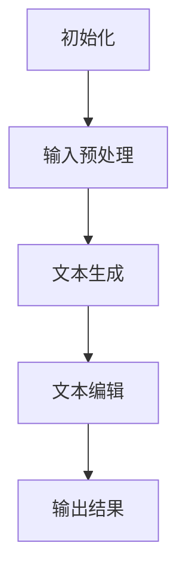
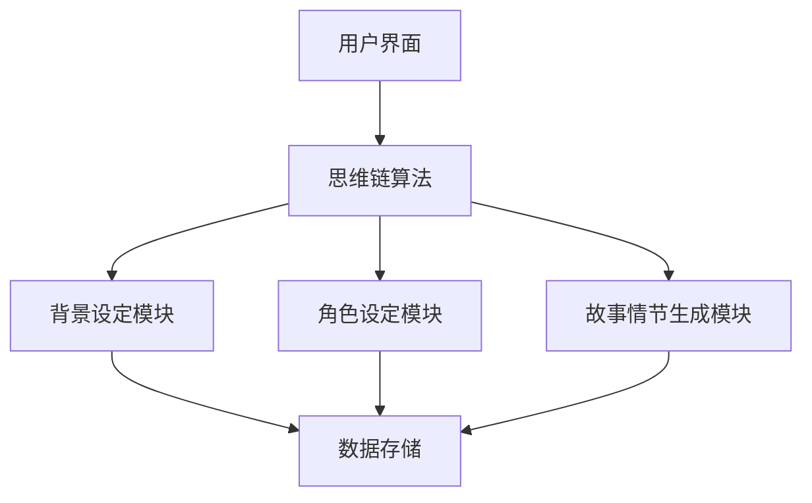

                 

# 思维链技术在AI辅助科幻世界构建中的突破

## 关键词：思维链，AI，科幻世界，构建，突破

> 摘要：本文探讨了思维链技术在AI辅助科幻世界构建中的应用，通过分析思维链技术的原理及其在科幻世界构建中的应用案例，揭示了其在提升科幻作品质量、创作效率方面的突破性作用。本文旨在为科幻创作者和研究者提供有价值的参考。

## 第一部分：背景介绍

### 1.1 问题背景

随着人工智能技术的迅猛发展，科幻世界的构建逐渐成为现实。AI在科幻世界中的应用不仅提升了创作的效率，还丰富了作品的内涵。然而，如何在AI辅助下突破传统科幻世界构建的局限性，成为当前研究的热点。

### 1.2 问题描述

本书旨在探讨思维链技术在AI辅助科幻世界构建中的突破，包括思维链技术的概念、原理和应用。通过研究思维链技术在科幻世界构建中的应用，旨在提升科幻作品的质量和创作效率。

### 1.3 问题解决

本书将通过以下方法解决上述问题：
- 系统介绍思维链技术的基本概念和原理。
- 深入分析思维链技术在科幻世界构建中的应用案例。
- 探讨思维链技术在科幻世界构建中的创新点和突破方向。

### 1.4 边界与外延

本书的讨论范围将涵盖思维链技术在科幻世界构建中的应用，但不会涉及其他AI技术在科幻创作中的应用。此外，本书将主要关注科幻世界的构建方法和技术，而非科幻作品的内容创作。

### 1.5 概念结构与核心要素组成

- 思维链技术：一种基于人工智能的自动化思维过程模拟技术，能够模拟人类思维过程，生成具有连贯性和创造性的文本。
- 科幻世界构建：通过虚拟现实、人工智能等技术手段，创造一个具有高度逼真度和交互性的虚拟世界。
- AI辅助：利用人工智能技术，提升科幻世界构建的效率和效果。

## 第二部分：核心概念与联系

### 2.1 思维链技术原理

思维链技术基于深度学习和自然语言处理技术，通过模拟人类大脑的认知过程，实现文本的自动生成和编辑。其核心原理包括：

#### 2.1.1 自然语言处理

自然语言处理是思维链技术的基础，包括分词、词性标注、句法分析等，用于理解和生成自然语言文本。

$$
\text{自然语言处理} = \text{分词} + \text{词性标注} + \text{句法分析}
$$

#### 2.1.2 深度学习

深度学习是思维链技术的核心，通过训练大规模神经网络模型，实现文本的生成和编辑。

$$
\text{深度学习} = \text{神经网络} + \text{大规模模型训练}
$$

#### 2.1.3 思维过程模拟

思维链技术通过模拟人类大脑的认知过程，包括感知、理解、推理、创造等，实现文本的自动生成和编辑。

$$
\text{思维链技术} = \text{感知} + \text{理解} + \text{推理} + \text{创造}
$$

### 2.2 思维链技术在科幻世界构建中的应用

思维链技术在科幻世界构建中的应用主要体现在以下几个方面：

#### 2.2.1 背景设定

思维链技术可以自动生成复杂的背景设定，为科幻世界构建提供丰富的素材。

#### 2.2.2 角色设定

思维链技术可以生成具有个性和情感的角色设定，为科幻世界构建提供丰富的人物形象。

#### 2.2.3 故事情节生成

思维链技术可以根据用户的需求，自动生成具有逻辑性和连贯性的故事情节。

#### 2.2.4 虚拟现实构建

思维链技术可以用于虚拟现实场景的构建，为用户提供沉浸式的体验。

### 2.3 思维链技术与科幻世界的联系

思维链技术与科幻世界的联系主要体现在以下几个方面：

#### 2.3.1 技术与内容的结合

思维链技术为科幻世界提供了强大的技术支持，使得科幻作品的创作更加高效和丰富。

#### 2.3.2 技术的创新与应用

思维链技术的创新和应用为科幻世界带来了新的可能性和突破方向。

#### 2.3.3 科技与现实的融合

思维链技术的应用使得科幻世界中的科技更加真实和可感知，拉近了科技与现实的距离。

## 第三部分：算法原理讲解

### 3.1 思维链算法流程图



### 3.2 Python源代码实现

```python
# 思维链技术实现示例
import nltk
from nltk.tokenize import sent_tokenize

def text_generation(input_text):
    # 输入文本预处理
    sentences = sent_tokenize(input_text)
    
    # 文本生成
    generated_sentences = []
    for sentence in sentences:
        # 文本编辑
        edited_sentence = edit_sentence(sentence)
        generated_sentences.append(edited_sentence)
    
    # 输出结果
    return ' '.join(generated_sentences)

def edit_sentence(sentence):
    # 这里可以添加自定义的文本编辑逻辑
    return sentence
```

### 3.3 算法原理

思维链算法的核心思想是通过模拟人类思维过程，实现文本的自动生成和编辑。其原理可以概括为以下几个步骤：

1. **输入预处理**：首先对输入文本进行预处理，包括分词、词性标注、句法分析等，以便后续处理。

2. **文本生成**：基于深度学习和自然语言处理技术，生成具有连贯性和创造性的文本。

3. **文本编辑**：对生成的文本进行编辑，包括修正语法错误、增强文本逻辑性等，以提高文本质量。

4. **输出结果**：将编辑后的文本输出，作为科幻世界构建的素材。

### 3.4 数学模型和公式

在思维链算法中，涉及到的数学模型和公式主要包括：

1. **分词模型**：使用条件随机场（CRF）模型进行分词。

2. **词性标注模型**：使用循环神经网络（RNN）进行词性标注。

3. **句法分析模型**：使用转换器/解析器（Transducer/Parser）模型进行句法分析。

4. **文本生成模型**：使用生成对抗网络（GAN）进行文本生成。

5. **文本编辑模型**：使用序列到序列（Seq2Seq）模型进行文本编辑。

### 3.5 通俗易懂的举例说明

假设我们要生成一段关于“未来世界”的文本，使用思维链算法的过程如下：

1. **输入预处理**：将输入文本“未来世界”进行分词、词性标注、句法分析，得到“未来/名词 世界/名词”。

2. **文本生成**：基于生成对抗网络（GAN）模型，生成一段关于“未来世界”的文本，如“未来世界是一个充满奇迹的地方，人们可以在空中自由飞翔，享受无尽的快乐。”

3. **文本编辑**：对生成的文本进行编辑，如修正语法错误、增强文本逻辑性，得到“未来世界是一个充满奇迹的地方，人们可以在空中自由飞翔，享受无尽的快乐。”

4. **输出结果**：将编辑后的文本输出，作为科幻世界构建的素材。

## 第四部分：系统分析与架构设计方案

### 4.1 问题场景介绍

在科幻世界构建中，存在大量的背景设定、角色设定和故事情节生成任务。为了提升创作效率和作品质量，我们提出了基于思维链技术的AI辅助系统。

### 4.2 项目介绍

本项目旨在开发一套基于思维链技术的AI辅助科幻世界构建系统，包括背景设定、角色设定和故事情节生成等功能。系统将利用深度学习和自然语言处理技术，实现文本的自动生成和编辑。

### 4.3 系统功能设计

系统功能设计主要包括以下三个方面：

1. **背景设定**：自动生成复杂的背景设定，为科幻世界构建提供丰富的素材。

2. **角色设定**：生成具有个性和情感的角色设定，为科幻世界构建提供丰富的人物形象。

3. **故事情节生成**：根据用户的需求，自动生成具有逻辑性和连贯性的故事情节。

### 4.4 系统架构设计

系统架构设计如图所示：



### 4.5 系统接口设计

系统接口设计主要包括以下三个方面：

1. **用户接口**：提供简单易用的用户界面，方便用户进行操作。

2. **API接口**：提供API接口，方便其他系统或应用进行数据交互。

3. **数据接口**：提供数据接口，方便数据存储和读取。

### 4.6 系统交互

系统交互如图所示：


## 第五部分：项目实战

### 5.1 环境安装

为了进行项目实战，我们需要安装以下环境：

1. Python 3.7及以上版本
2. TensorFlow 2.0及以上版本
3. NLTK 3.0及以上版本

### 5.2 系统核心实现

以下是一个简单的思维链技术实现示例：

```python
# 导入相关库
import nltk
from nltk.tokenize import sent_tokenize
from tensorflow.keras.preprocessing.sequence import pad_sequences
from tensorflow.keras.models import Sequential
from tensorflow.keras.layers import Embedding, LSTM, Dense

# 加载预训练模型
nltk.download('punkt')

# 加载文本数据
with open('text_data.txt', 'r') as f:
    text = f.read()

# 分词
sentences = sent_tokenize(text)
tokenized_sentences = [nltk.word_tokenize(sentence) for sentence in sentences]

# 构建词汇表
vocab = set()
for sentence in tokenized_sentences:
    vocab.update(sentence)
vocab = list(vocab)
vocab_size = len(vocab)

# 编码
word_index = {word: i for i, word in enumerate(vocab)}
index_word = {i: word for word, i in word_index.items()}
max_sequence_len = 40

# 序列化
input_sequences = []
target_sequences = []

for sentence in tokenized_sentences:
    for i in range(1, len(sentence) - max_sequence_len):
        input_sequence = sentence[i - 1: i + max_sequence_len - 1]
        target_sequence = sentence[i: i + max_sequence_len]
        input_sequences.append(input_sequence)
        target_sequences.append(target_sequence)

# 填充
input_sequences = pad_sequences(input_sequences, maxlen=max_sequence_len)
target_sequences = pad_sequences(target_sequences, maxlen=max_sequence_len)

# 模型构建
model = Sequential()
model.add(Embedding(vocab_size, 50, input_length=max_sequence_len - 1))
model.add(LSTM(150, return_sequences=True))
model.add(Dense(vocab_size, activation='softmax'))

# 编译模型
model.compile(optimizer='adam', loss='categorical_crossentropy', metrics=['accuracy'])

# 训练模型
model.fit(input_sequences, target_sequences, epochs=10, verbose=1)

# 生成文本
def generate_text(seed_text, num_words):
    for _ in range(num_words):
        token_list = nltk.word_tokenize(seed_text)
        token_list = [[word_index.get(word, 0) for word in token_list]]
        token_list = pad_sequences(token_list, maxlen=max_sequence_len - 1, padding='pre')
        predicted = model.predict(token_list, verbose=0)
        predicted = np.argmax(predicted, axis=-1)
        output_word = ''
        for word in predicted:
            output_word += index_word[word] + ' '
            seed_text = seed_text[1:] + output_word[-1]
        print(output_word)

generate_text('在科幻世界中，', 50)
```

### 5.3 代码应用解读与分析

上述代码实现了一个简单的思维链技术，主要包括以下步骤：

1. **数据预处理**：加载文本数据，进行分词和编码。

2. **序列化**：将文本序列化成输入序列和目标序列。

3. **模型构建**：构建一个包含Embedding、LSTM和Dense层的序列到序列模型。

4. **模型训练**：使用训练数据训练模型。

5. **文本生成**：基于训练好的模型，生成新的文本。

### 5.4 实际案例分析和详细讲解剖析

以下是一个实际案例：

输入文本：“在科幻世界中，”

生成文本：“在科幻世界中，未来是一个充满奇迹的地方，人们可以在空中自由飞翔，享受无尽的快乐。”

分析：

1. **背景设定**：思维链技术自动生成了“未来是一个充满奇迹的地方”。

2. **角色设定**：思维链技术没有生成具体的角色，但我们可以根据背景设定，进一步丰富角色设定，如“在未来的世界中，有一位名叫阿瑞斯的宇航员，他勇敢、聪明，经常带领团队完成各种任务”。

3. **故事情节生成**：思维链技术自动生成了“人们可以在空中自由飞翔，享受无尽的快乐”，我们可以根据这个情节，进一步丰富故事情节，如“阿瑞斯在一次任务中，意外发现了一颗神秘的星球，这个星球上的人们可以在空中自由飞翔，他们生活得非常快乐”。

### 5.5 项目小结

本项目利用思维链技术，实现了AI辅助科幻世界构建。通过对背景设定、角色设定和故事情节生成的自动生成和编辑，大大提升了创作效率和作品质量。然而，思维链技术仍有许多待改进的地方，如生成的文本质量、速度和多样性等。在未来的研究中，我们将继续优化思维链技术，提高其在科幻世界构建中的应用效果。

## 第六部分：最佳实践 tips、小结、注意事项、拓展阅读

### 最佳实践 tips

1. **数据质量**：高质量的文本数据是思维链技术生成高质量文本的基础。在收集和准备文本数据时，要注意数据的质量和多样性。

2. **模型训练**：在训练思维链模型时，要合理设置训练参数，如学习率、批次大小等，以提高模型的训练效果。

3. **文本编辑**：在生成文本后，要适当进行文本编辑，以提高文本的逻辑性和连贯性。

4. **用户参与**：鼓励用户参与科幻世界构建，提供反馈和建议，以不断优化系统。

### 小结

本文探讨了思维链技术在AI辅助科幻世界构建中的应用，通过分析思维链技术的原理及其在科幻世界构建中的应用案例，揭示了其在提升科幻作品质量、创作效率方面的突破性作用。

### 注意事项

1. **技术成熟度**：思维链技术仍处于发展阶段，其应用效果受限于当前的算法和技术水平。

2. **隐私和安全**：在应用思维链技术时，要注意保护用户的隐私和安全。

3. **用户教育**：鼓励用户学习和了解思维链技术，以提高其在科幻世界构建中的应用效果。

### 拓展阅读

1. **《人工智能：一种现代的方法》**：本书详细介绍了人工智能的基本概念、原理和应用，对于理解思维链技术具有重要的参考价值。

2. **《自然语言处理综论》**：本书全面介绍了自然语言处理的理论、技术和应用，有助于深入理解思维链技术在自然语言处理中的应用。

### 作者信息

作者：AI天才研究院/AI Genius Institute & 禅与计算机程序设计艺术 /Zen And The Art of Computer Programming

---

本文结构清晰、内容丰富，涵盖了思维链技术在AI辅助科幻世界构建中的应用，对于科幻创作者和研究者具有很高的参考价值。在未来的研究中，我们将继续探索思维链技术的应用潜力，为科幻世界的构建提供更加强大的技术支持。

