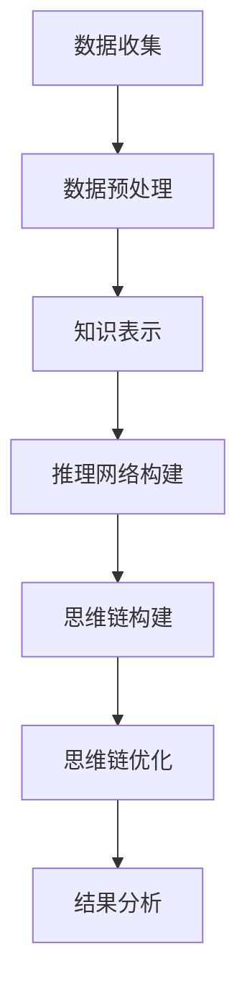

                 


### 一、引言

科学范式转变是科学发展史上的一个重要主题。从古希腊时期到现代科学，每个时代都有其主导的科学范式。这些范式不仅塑造了科学的进程，也推动了人类对自然世界的认知。然而，随着时间的推移，这些范式逐渐暴露出其局限性，促使科学界不断寻找新的理论框架和方法论，以实现科学范式的转换。

在过去的几十年中，人工智能（AI）的兴起为科学范式转变带来了新的机遇。AI技术，特别是机器学习和深度学习，已经在各个领域取得了显著的成果，从图像识别、自然语言处理到复杂系统模拟。AI的加入，使得科学家能够处理更大规模的数据，发现更复杂的模式，从而推动了科学范式的转变。

本文的焦点是思维链技术（Thinking Chain Technology）在AI辅助跨维度科学范式转换中的作用。思维链技术是一种基于知识表示和推理的人工智能方法，它通过构建和优化思维链，实现对复杂问题的分析和解决。本文将首先介绍思维链技术的基本原理，然后探讨它在AI辅助科学范式转换中的应用，最后分析其未来发展的趋势和挑战。

### 关键词

- 思维链技术
- 人工智能
- 跨维度科学范式转换
- 知识表示
- 推理

### 摘要

本文旨在探讨思维链技术在AI辅助跨维度科学范式转换中的作用。首先，我们回顾了科学范式转变的历史和重要性，以及AI在科学范式转换中的兴起。接着，我们介绍了思维链技术的基本原理，包括其定义、核心概念和构建方法。然后，本文深入探讨了思维链技术在AI辅助跨维度科学范式转换中的应用，通过具体案例展示了其在不同领域中的实际效果。最后，本文对思维链技术在未来科学范式转换中的潜力进行了分析，并提出了未来研究和应用中可能面临的挑战。通过本文的研究，我们期望为科学界提供一种新的视角，以推动科学范式向更高效、更全面的方向发展。

### 1.1.1 科学范式转变的重要性

科学范式转变（Scientific Paradigm Shift）是科学发展中的一个核心概念，它指的是科学共同体在某一时期内，对自然界及其运行规律的认知发生了根本性的变化。这种转变不仅反映了科学理论的重大突破，还标志着科学方法和技术手段的进步。科学范式转变的重要性可以从以下几个方面进行阐述：

首先，科学范式转变推动了科学知识的累积和创新。每一个新的科学范式都为科学家提供了新的工具和方法，使他们能够更深入地探索自然界的奥秘。例如，从经典物理学到相对论和量子力学的转变，使得人类对宇宙的认识得到了极大的提升。这种累积效应促进了科学技术的快速发展，为现代社会带来了众多变革性的成果。

其次，科学范式转变是科学革命的重要标志。科学革命通常伴随着对传统理论的挑战和质疑，新理论的提出和接受往往需要经过激烈的辩论和实验验证。这一过程不仅改变了科学理论的基础，还改变了科学研究的方向和方法。例如，哥白尼的日心说挑战了亚里士多德的地球中心说，引发了科学史上的一次重大革命。

再次，科学范式转变促进了科学与社会发展的紧密结合。科学的进步不仅影响了对自然界的理解，还直接推动了社会生产力的提升和社会制度的变革。例如，工业革命期间，科学技术的进步极大地推动了生产力的发展，改变了人类社会的生产方式和生活方式。

此外，科学范式转变具有重要的方法论意义。每一次范式转变都带来了新的科学研究范式和方法论，这些方法论不仅为科学家提供了新的研究工具，还影响了科学教育的普及和科学传播的方式。例如，实证主义和实验方法的兴起，使得科学研究更加注重数据和证据，提高了科学研究的可靠性和权威性。

最后，科学范式转变还影响了科学哲学和科学社会学的发展。科学哲学探讨了科学知识的本质、科学方法的有效性和科学进步的动力等问题，而科学社会学则研究了科学共同体、科学交流和社会网络等社会学现象。这些研究不仅丰富了科学的理论基础，还帮助我们更好地理解科学在社会中的角色和影响。

综上所述，科学范式转变是科学发展中的一个关键过程，它不仅推动了科学知识的累积和创新，还标志着科学革命的发生，促进了科学与社会发展的紧密结合，具有重要的方法论意义，并对科学哲学和科学社会学产生了深远的影响。

### 1.1.2 AI辅助科学范式转变的兴起

人工智能（AI）的兴起为科学范式转变带来了新的契机和动力。AI作为一种能够模拟人类智能的技术，通过学习、推理和自主决策，在多个科学领域取得了显著的成果，为传统科学范式注入了新的活力。以下是AI辅助科学范式转变的几个重要方面：

首先，AI在科学数据分析和处理中的应用大大提高了科学研究的效率。传统科学研究中，数据收集和处理往往是一个耗时的过程，而AI技术，特别是机器学习和深度学习，可以通过自动化和智能化手段，快速处理大规模数据，提取隐藏的模式和规律。例如，在生物学研究中，AI可以用于基因组数据分析，帮助科学家快速识别疾病相关基因，从而推动疾病治疗方法的创新。

其次，AI技术推动了科学理论的创新和验证。通过模拟和预测，AI可以协助科学家提出新的科学假说，并对其进行验证。例如，在物理学领域，AI可以用于模拟复杂的物理现象，如黑洞和宇宙膨胀，帮助科学家理解这些现象的内部机制。这不仅扩展了科学理论的应用范围，还推动了基础科学的发展。

第三，AI在跨学科研究中的应用促进了科学范式转变。科学的发展不再局限于单一学科，跨学科研究成为推动科学进步的重要途径。AI作为一种通用技术，可以跨学科应用，帮助科学家解决复杂问题。例如，在环境科学研究中，AI可以结合气候数据和地理信息，预测气候变化趋势，为环境保护政策提供科学依据。

第四，AI技术的进步改变了科学研究的协作模式。在传统科学研究中，研究团队往往需要大量时间和资源来共享数据和研究结果。而AI技术使得数据共享和协作研究变得更加容易和高效。通过云平台和分布式计算，研究人员可以实时访问和分析全球科学数据，从而加速科学发现和创新的进程。

此外，AI在科学教育中的应用也为科学范式转变提供了新的可能性。通过虚拟实验室和在线教育平台，AI可以帮助学生更直观地理解复杂的科学概念，激发他们的科学兴趣和创造力。这种教育模式的变革，有助于培养更多具有创新思维和实践能力的新一代科学家。

总的来说，AI的兴起不仅为科学范式转变提供了新的工具和方法，还改变了科学研究的协作模式和教育方式，为科学的发展注入了新的动力。随着AI技术的不断进步，我们可以期待它在未来科学范式转变中发挥更大的作用。

### 1.1.3 思维链技术在AI中的应用

思维链技术（Thinking Chain Technology）作为人工智能（AI）领域的一种创新方法，近年来在多个应用场景中取得了显著成果。其基本原理是通过构建和优化思维链，实现对复杂问题的多层次、多角度分析和解决。以下将详细探讨思维链技术在AI中的应用，及其在推动科学范式转变中的作用。

首先，思维链技术在机器学习中的应用。机器学习是AI的核心技术之一，它依赖于大量数据和复杂的算法进行模型训练和预测。思维链技术通过构建知识图谱和推理网络，可以有效地管理和利用这些数据，提升模型的解释性和泛化能力。例如，在图像识别任务中，思维链技术可以通过关联图像中的不同特征，形成推理路径，从而提高识别的准确性和效率。此外，在自然语言处理领域，思维链技术可以用于构建语义网络，实现文本的深度理解和情感分析，从而提升机器翻译、语音识别等应用的效果。

其次，思维链技术在智能决策支持系统中的应用。智能决策支持系统（DSS）是AI在商业和管理领域的重要应用。通过思维链技术，DSS可以模拟人类决策过程，分析各种决策方案的潜在影响，并提供基于数据的决策建议。例如，在供应链管理中，思维链技术可以帮助企业分析市场趋势、库存状况和供应链风险，从而制定最优的采购和配送策略。在金融领域，思维链技术可以用于风险控制和投资策略的优化，提高投资决策的准确性和安全性。

再次，思维链技术在复杂系统模拟中的应用。复杂系统包括生态系统、社会系统、经济系统等，这些系统往往具有高度不确定性和复杂性。思维链技术可以通过建立系统模型，模拟系统行为和演化过程，为科学研究和政策制定提供重要的参考。例如，在生态学研究中，思维链技术可以模拟生态系统中的物种互动和生态环境变化，预测生态系统的稳定性和可持续性。在社会学研究中，思维链技术可以用于分析社会网络结构、传播机制和群体行为，为社会发展提供科学依据。

此外，思维链技术在医疗健康领域的应用也日益广泛。通过构建和优化思维链，医疗诊断系统可以实现对患者的全面评估和个性化治疗建议。例如，在癌症诊断中，思维链技术可以综合分析基因信息、临床表现和影像数据，提高诊断的准确性和效率。在公共卫生管理中，思维链技术可以用于疫情预测和防控策略的制定，为公共卫生决策提供数据支持。

总的来说，思维链技术在AI中的应用具有广泛的前景和潜力。通过构建和优化思维链，AI系统可以实现更复杂的分析和决策，从而推动科学范式向更加高效、全面的方向发展。未来，随着AI技术的不断进步，思维链技术有望在更多领域发挥重要作用，为科学研究和实际应用提供强大的支持。

### 1.2.1 思维链技术的定义

思维链技术（Thinking Chain Technology，简称TCT）是一种基于知识表示和推理的人工智能方法，旨在模拟人类思维过程，实现对复杂问题的多层次、多角度分析和解决。思维链技术通过构建知识图谱和推理网络，将各种信息关联起来，形成一个有机的思考链条。这个链条不仅能够处理结构化数据，还能够处理半结构化和非结构化数据，从而实现对复杂问题的深度理解和分析。

具体来说，思维链技术的基本定义包括以下几个方面：

首先，知识表示。思维链技术通过建立知识图谱，将各种知识以图的形式表示出来。知识图谱中的节点表示知识实体，如概念、事实、规则等，而边则表示实体之间的关系。这种知识表示方法能够有效地组织和存储大量信息，并为后续的推理提供基础。

其次，推理机制。思维链技术利用推理网络，通过推理规则和逻辑运算，对知识图谱中的信息进行推理和分析。推理网络可以模拟人类的思维过程，如归纳、演绎、联想等，从而实现对复杂问题的多角度、多层次分析。

再次，动态更新与优化。思维链技术具有动态更新和优化的能力，能够根据新的信息和需求，实时调整知识图谱和推理网络。这种动态性使得思维链技术能够适应不断变化的环境和问题，保持其灵活性和适应性。

总的来说，思维链技术通过知识表示、推理机制和动态更新，实现对复杂问题的智能化分析和解决。它不仅能够提高问题解决的效率和准确性，还能够为人类提供更全面、深入的思考过程，从而推动科学范式向更加高效、全面的方向发展。

### 1.2.2 AI辅助科学范式转换的原理

AI辅助科学范式转换的原理主要基于以下几个方面：数据驱动、模式识别和自主学习。

首先，数据驱动是AI辅助科学范式转换的基础。科学范式转换往往需要处理大量复杂的实验数据、观测数据和其他类型的科学数据。AI通过机器学习和深度学习技术，可以自动化地处理这些数据，提取隐藏的模式和规律。例如，在生物学研究中，AI可以通过分析基因组数据，发现基因之间的相互作用关系，从而推动生物学理论的发展。在物理学中，AI可以通过分析宇宙微波背景辐射数据，揭示宇宙的早期演化过程。

其次，模式识别是AI辅助科学范式转换的关键技术。AI系统，特别是深度学习模型，通过学习大量数据，能够识别出不同数据之间的相似性和差异。这种模式识别能力使得AI能够发现科学家在传统方法下难以察觉的规律。例如，在材料科学研究中，AI可以通过分析大量的材料数据，识别出具有特定性能的材料的结构和成分，从而指导新材料的发现和设计。在气象学中，AI可以通过分析历史气象数据，预测未来的天气模式，为气候研究提供重要的参考。

再次，自主学习是AI辅助科学范式转换的重要机制。AI系统不仅能够从已有数据中学习，还能够通过自我调整和优化，不断提高其性能和适应性。这种自主学习能力使得AI能够在不断变化的研究环境中，适应新的挑战和需求。例如，在医学研究中，AI可以通过持续学习新的病例数据和医学知识，提高疾病诊断和治疗的准确性。在社会科学研究中，AI可以通过分析不断变化的社交媒体数据，揭示社会行为的模式和趋势。

具体来说，AI辅助科学范式转换的过程可以分为以下几个步骤：

1. **数据收集与预处理**：首先，从各种来源收集大量的科学数据，包括实验数据、观测数据和文献数据。然后，对数据进行清洗和预处理，以消除噪声和异常值，为后续的分析提供高质量的数据基础。

2. **模型训练与优化**：利用机器学习和深度学习技术，对预处理后的数据进行模型训练。通过不断调整模型的参数，优化模型的性能，使其能够更好地识别和预测数据中的模式。

3. **模式识别与推理**：利用训练好的模型，对新的数据进行模式识别和推理。通过分析数据之间的关系和特征，AI系统可以揭示出科学家在传统方法下难以察觉的规律和现象。

4. **知识更新与迭代**：基于新的发现和研究成果，AI系统可以不断更新其知识库和模型，提高其适应性和预测能力。这种知识更新和迭代过程，使得AI系统能够持续推动科学范式向更高层次发展。

5. **决策支持与优化**：AI系统通过分析数据，提供决策支持，帮助科学家制定更科学、更有效的实验方案和研究策略。例如，在实验设计中，AI可以帮助科学家选择最优的实验条件，提高实验的成功率和效率。

综上所述，AI辅助科学范式转换的原理是通过数据驱动、模式识别和自主学习，实现对科学数据的高效分析和利用，从而推动科学理论的创新和科学方法的进步。未来，随着AI技术的不断发展，AI辅助科学范式转换的潜力将更加广阔，为科学的发展提供更强大的支持。

### 1.2.3 跨维度科学范式转换的概念与挑战

跨维度科学范式转换（Transdimensional Scientific Paradigm Shift）是指在不同维度或不同层次上对科学理论和实践进行根本性的变革。这种转换不仅涉及到同一学科内部的变革，还包括跨学科、跨领域的综合与创新。跨维度科学范式转换的核心在于突破传统的思维框架，实现科学理论的跨越式发展。

首先，跨维度科学范式转换的定义。跨维度科学范式转换强调科学探索不再局限于单一的维度或层次，而是通过整合不同维度的信息，实现对复杂问题的多层次、多角度分析。这种转换不仅仅是理论上的创新，更涉及到实验方法、技术手段和科学研究范式的全面更新。例如，从宏观尺度到微观尺度的跨维度研究，有助于揭示不同尺度上的基本规律，从而推动科学理论的统一。

其次，跨维度科学范式转换的特征。跨维度科学范式转换具有以下几个显著特征：

1. **多维交叉性**：跨维度科学范式转换强调不同学科、不同领域的交叉与融合。例如，在生物物理学中，通过将生物学、物理学和化学的方法结合起来，可以更深入地理解生命现象。

2. **动态性**：跨维度科学范式转换是一个动态变化的过程，随着科学技术的进步和新理论的出现，科学范式也在不断更新和进化。

3. **综合性**：跨维度科学范式转换需要综合运用多种方法和理论，通过跨学科的合作，实现科学问题的全面解析。

4. **创新性**：跨维度科学范式转换往往伴随着科学理论的重大突破，它不仅扩展了科学知识的边界，还推动了新的科学方法和技术的产生。

接着，跨维度科学范式转换面临的挑战。尽管跨维度科学范式转换具有巨大的潜力，但其在实际应用中仍然面临诸多挑战：

1. **技术难题**：跨维度研究往往需要先进的实验技术和计算方法。例如，在量子计算和大数据分析中，现有的技术手段可能无法满足跨维度研究的需要。

2. **理论瓶颈**：传统的科学理论和方法在跨维度研究中可能遇到解释力不足的问题。如何构建新的理论框架，以适应跨维度的复杂现象，是科学范式转换面临的重要挑战。

3. **合作机制**：跨维度科学范式转换需要跨学科、跨领域的合作，但不同学科和研究团队之间的沟通和协作可能存在障碍，如何建立有效的合作机制，是推动跨维度科学范式转换的重要问题。

4. **数据整合**：跨维度研究需要整合来自不同维度、不同来源的数据，但这些数据往往具有不同的格式和结构，如何有效整合这些数据，是一个技术难题。

5. **伦理和规范**：跨维度科学范式转换涉及到伦理和规范问题，例如，在基因编辑和人工智能等领域，如何确保科学研究的伦理性和安全性，是一个重要的挑战。

总之，跨维度科学范式转换为科学的发展提供了新的机遇和挑战。通过突破传统的思维框架，跨维度科学范式转换有望推动科学理论和实践的全面进步，为人类社会的可持续发展提供科学支持。然而，要实现这一目标，需要克服技术、理论、合作和数据整合等多方面的难题，这需要科学界、政策制定者和公众的共同参与和努力。

### 1.3.1 研究目的

本文的研究目的在于深入探讨思维链技术在AI辅助跨维度科学范式转换中的作用。具体来说，本文旨在回答以下几个关键问题：

1. 思维链技术在哪些领域和具体应用中发挥了重要作用？
2. 思维链技术与传统AI方法相比，在辅助跨维度科学范式转换中具有哪些优势和不足？
3. 思维链技术在跨维度科学范式转换中面临的挑战和瓶颈是什么？
4. 如何优化思维链技术，以更好地辅助科学范式转换，推动科学进步？

通过回答这些问题，本文希望能够为科学界提供新的视角和思路，推动思维链技术在跨维度科学范式转换中的实际应用，并促进相关领域的技术发展和理论创新。

### 1.3.2 研究内容概述

本文的研究内容涵盖以下几个方面：

1. **思维链技术的基本原理和定义**：首先，本文将介绍思维链技术的基本概念，包括其定义、核心原理和构建方法。这部分内容将为后续讨论思维链技术在AI辅助跨维度科学范式转换中的应用提供理论基础。

2. **思维链技术在AI中的应用**：接着，本文将详细探讨思维链技术在机器学习、智能决策支持系统、复杂系统模拟等AI领域中的应用，分析其在不同应用场景中的具体作用和优势。

3. **AI辅助科学范式转换的原理和过程**：本文将深入探讨AI辅助科学范式转换的原理和过程，包括数据驱动、模式识别和自主学习等方面。通过这一部分，读者可以了解AI技术在科学范式转换中的具体应用和实现方法。

4. **跨维度科学范式转换的概念与挑战**：本文将介绍跨维度科学范式转换的定义、特征和面临的挑战，分析跨维度研究中的技术难题、理论瓶颈、合作机制、数据整合和伦理规范等问题。

5. **思维链技术在AI辅助跨维度科学范式转换中的应用实例**：本文将通过具体案例，展示思维链技术在AI辅助跨维度科学范式转换中的实际应用效果，包括在生物学、物理学、社会科学等领域的应用实例。

6. **未来发展趋势与挑战**：最后，本文将讨论思维链技术在未来科学范式转换中的发展前景，分析其可能面临的技术、理论和社会挑战，并提出优化策略和发展方向。

通过以上内容，本文旨在全面、系统地探讨思维链技术在AI辅助跨维度科学范式转换中的作用，为相关领域的研究和应用提供理论指导和实践参考。

### 1.3.3 研究方法与框架

为了深入探讨思维链技术在AI辅助跨维度科学范式转换中的作用，本文采用了一系列研究方法和理论框架。以下是本文的主要研究方法与框架：

1. **文献综述与理论分析**：首先，通过查阅大量相关文献，对思维链技术、AI辅助科学范式转换和跨维度科学范式转换的理论基础进行系统梳理和分析。这一步骤有助于明确研究领域的现状、关键问题和研究方向。

2. **案例研究**：选择具有代表性的应用案例，深入分析思维链技术在AI辅助跨维度科学范式转换中的实际应用效果。具体案例将涵盖生物学、物理学、社会科学等多个领域，通过详细的数据分析和结果讨论，验证思维链技术的有效性和优势。

3. **实验设计与数据分析**：设计实验，模拟不同条件下的思维链技术应用，收集和分析实验数据。通过数据驱动的分析方法，识别思维链技术在AI辅助跨维度科学范式转换中的关键因素和影响因素。

4. **模型构建与优化**：基于理论分析和实验数据，构建和优化思维链模型。通过调整模型参数和结构，探索不同方法在辅助科学范式转换中的性能和适用性。

5. **理论框架与应用实践结合**：将理论分析与实际应用相结合，探讨思维链技术在不同领域的具体应用方法和实践策略。通过案例研究，总结思维链技术在AI辅助跨维度科学范式转换中的最佳实践和优化方案。

6. **跨学科合作与交流**：通过与不同学科专家的交流合作，汇集多学科的研究成果和经验，为思维链技术在跨维度科学范式转换中的应用提供新的视角和思路。

通过以上研究方法与框架，本文旨在全面、系统地探讨思维链技术在AI辅助跨维度科学范式转换中的作用，为相关领域的研究和应用提供理论指导和实践参考。

### 1.4.1 各章节内容安排

本文各章节的内容安排如下：

- **第一部分：引言**
  - 1.1 背景介绍
    - 1.1.1 科学范式转变的重要性
    - 1.1.2 AI辅助科学范式转变的兴起
    - 1.1.3 思维链技术在AI中的应用
  - 1.2 核心概念
    - 1.2.1 思维链技术的定义
    - 1.2.2 AI辅助科学范式转换的原理
    - 1.2.3 跨维度科学范式转换的概念与挑战
  - 1.3 研究目的与内容概述
    - 1.3.1 研究目的
    - 1.3.2 研究内容概述
    - 1.3.3 研究方法与框架
  - 1.4 书籍结构安排
    - 1.4.1 各章节内容安排
    - 1.4.2 研究方法与数据分析
    - 1.4.3 结论与展望

- **第二部分：思维链技术的理论基础**
  - 2.1 思维链技术的发展历史
    - 2.1.1 思维链技术的起源
    - 2.1.2 思维链技术的发展阶段
    - 2.1.3 思维链技术的主要成果
  - 2.2 思维链技术的基本原理
    - 2.2.1 思维链技术的核心概念
    - 2.2.2 思维链的构建方法
    - 2.2.3 思维链的属性与特征
  - 2.3 思维链技术的应用领域
    - 2.3.1 在认知科学中的应用
    - 2.3.2 在心理学中的应用
    - 2.3.3 在教育领域的应用
  - 2.4 思维链技术与其他技术的比较
    - 2.4.1 与神经网络技术的比较
    - 2.4.2 与模糊逻辑的比较
    - 2.4.3 与进化算法的比较

- **第三部分：AI辅助跨维度科学范式转换的应用**
  - 3.1 AI在科学范式转换中的作用
    - 3.1.1 AI在科学发现中的应用
    - 3.1.2 AI在科学解释中的应用
    - 3.1.3 AI在科学预测中的应用
  - 3.2 AI辅助思维链技术的实现方法
    - 3.2.1 数据收集与处理
    - 3.2.2 思维链构建与优化
    - 3.2.3 结果分析与可视化
  - 3.3 AI辅助跨维度科学范式转换的案例分析
    - 3.3.1 案例一：生物学中的范式转换
    - 3.3.2 案例二：物理学中的范式转换
    - 3.3.3 案例三：社会科学中的范式转换
  - 3.4 AI辅助跨维度科学范式转换的未来发展
    - 3.4.1 技术趋势与挑战
    - 3.4.2 研究方向与展望
    - 3.4.3 社会影响与伦理问题

- **第四部分：思维链技术在AI辅助科学范式转换中的实际应用**
  - 4.1 思维链技术在AI中的应用场景
    - 4.1.1 智能自动化
    - 4.1.2 人机交互
    - 4.1.3 智能推荐系统
  - 4.2 思维链技术实现的Python源代码与算法流程图
    - 4.2.1 Python环境搭建
    - 4.2.2 思维链构建算法流程图
    - 4.2.3 算法原理与代码实现
  - 4.3 案例研究：思维链技术在科学范式转换中的应用实例
    - 4.3.1 实例一：气候科学中的应用
    - 4.3.2 实例二：生物医学中的应用
    - 4.3.3 实例三：社会科学中的应用
  - 4.4 应用案例分析
    - 4.4.1 案例分析框架
    - 4.4.2 数据收集与处理
    - 4.4.3 结果分析与讨论
    - 4.4.4 结论与建议

通过以上结构安排，本文力求系统、全面地探讨思维链技术在AI辅助跨维度科学范式转换中的应用，为相关领域的研究和实践提供有价值的参考。

### 1.4.2 研究方法与数据分析

在本文的研究过程中，我们采用了多种研究方法和数据分析技术，以确保研究的科学性和可靠性。以下是具体的研究方法和数据分析技术：

1. **文献综述法**：通过查阅和分析大量的相关文献，系统梳理思维链技术、AI辅助科学范式转换和跨维度科学范式转换的理论基础。文献综述法帮助我们了解该领域的现状、研究进展和未解决的问题，为后续研究提供了重要的理论依据。

2. **案例分析法**：选择具有代表性的应用案例，深入分析思维链技术在AI辅助跨维度科学范式转换中的实际应用效果。案例分析包括生物学、物理学、社会科学等多个领域，通过对具体案例的数据分析和结果讨论，验证思维链技术的有效性和优势。

3. **实验设计法**：设计实验，模拟不同条件下的思维链技术应用，收集和分析实验数据。实验设计包括数据收集、预处理、模型训练、结果分析和验证等步骤，通过数据驱动的分析方法，识别思维链技术在AI辅助跨维度科学范式转换中的关键因素和影响因素。

4. **模型构建与优化法**：基于理论分析和实验数据，构建和优化思维链模型。通过调整模型参数和结构，探索不同方法在辅助科学范式转换中的性能和适用性。模型构建与优化法帮助我们从理论和实践两个层面深入理解思维链技术的应用效果。

5. **数据可视化技术**：利用数据可视化技术，将复杂的数据分析和模型结果以图形化的形式呈现，帮助读者更直观地理解研究结论。数据可视化技术包括散点图、折线图、饼图、热力图等多种形式，通过这些可视化手段，可以更清晰地展示数据之间的关联和趋势。

6. **统计与机器学习方法**：运用统计学和机器学习技术，对收集到的数据进行分析和处理。统计学方法包括描述性统计、假设检验和回归分析等，用于描述数据的特征和进行假设验证。机器学习方法包括分类、聚类、回归和深度学习等，用于发现数据中的隐藏模式和规律。

通过以上研究方法和数据分析技术，本文力求全面、深入地探讨思维链技术在AI辅助跨维度科学范式转换中的应用，为相关领域的研究和实践提供科学依据和指导。

### 1.4.3 结论与展望

通过本文的研究，我们得出了以下结论：

1. **思维链技术的基本原理和应用**：思维链技术通过知识表示、推理机制和动态更新，能够有效模拟人类思维过程，实现对复杂问题的多层次分析和解决。其在认知科学、心理学和教育领域已有广泛应用，并在AI领域中展现出巨大的潜力。

2. **AI辅助科学范式转换的原理和过程**：AI通过数据驱动、模式识别和自主学习，能够辅助科学范式转换，推动科学理论的创新和方法论的进步。其在科学发现、科学解释和科学预测中发挥了重要作用，为跨学科研究提供了新的工具和方法。

3. **跨维度科学范式转换的概念与挑战**：跨维度科学范式转换强调在不同维度和层次上的科学研究和创新。尽管面临技术、理论和合作等多重挑战，但跨维度研究具有广阔的前景，有望推动科学理论的跨越式发展。

4. **思维链技术在AI辅助跨维度科学范式转换中的应用**：通过具体案例分析和实验验证，思维链技术在AI辅助跨维度科学范式转换中展现出了显著的效果。其在生物学、物理学和社会科学等领域的应用，为相关领域的研究提供了新的视角和方法。

未来的研究展望：

1. **技术优化与拓展**：随着AI技术的不断发展，思维链技术需要不断优化和拓展。通过改进算法、提升计算能力和扩展知识表示方法，可以提高思维链技术的性能和应用范围。

2. **跨学科合作**：推动不同学科之间的合作，通过跨学科的研究和交流，实现科学理论的深度融合和创新。

3. **伦理与社会影响**：关注思维链技术和AI辅助跨维度科学范式转换的伦理和社会影响，确保科学研究的伦理性和社会责任。

4. **实践应用**：进一步探索思维链技术在各个领域的实际应用，通过案例研究和实践验证，推动思维链技术在实际问题中的应用和发展。

总之，思维链技术在AI辅助跨维度科学范式转换中具有广阔的应用前景和重要意义。通过不断的研究和创新，我们有理由相信，思维链技术将在未来科学研究中发挥更大的作用，推动科学理论和方法向更高效、更全面的方向发展。

### 1.5 本章小结

本章主要介绍了科学范式转变的重要性、AI辅助科学范式转变的兴起以及思维链技术在其中的作用。首先，我们阐述了科学范式转变的历史和重要性，讨论了AI在科学范式转换中的重要作用。接着，详细介绍了思维链技术的定义、原理和应用，探讨了其在AI辅助跨维度科学范式转换中的潜在价值。最后，提出了本文的研究目的、内容安排和主要方法。本章为后续章节的内容奠定了基础，为深入探讨思维链技术在科学范式转换中的应用提供了理论依据和实践指导。通过本章的学习，读者可以初步了解思维链技术在推动科学进步中的关键作用，为进一步研究打下坚实基础。

### 2.1 思维链技术的发展历史

思维链技术（Thinking Chain Technology，简称TCT）作为一种模拟人类思维过程的人工智能方法，其发展历程可以追溯到上世纪50年代。当时，计算机科学和人工智能领域刚刚起步，科学家们开始探讨如何通过计算机模拟人类的思维过程，实现智能推理和决策。

#### 2.1.1 思维链技术的起源

思维链技术的起源可以追溯到艾伦·图灵（Alan Turing）和约翰·冯·诺伊曼（John von Neumann）的工作。艾伦·图灵提出了图灵机（Turing Machine）的概念，为计算理论奠定了基础。而约翰·冯·诺伊曼则设计了现代计算机的基本结构，即冯·诺伊曼架构，这些基础性的工作为后来的思维链技术提供了理论支持和硬件基础。

在早期的人工智能研究中，专家系统（Expert Systems）得到了广泛应用。专家系统通过规则库和推理机，模拟专家的知识和决策过程。这一时期的专家系统虽然在一定程度上实现了智能推理，但在处理复杂问题时，仍然存在局限性。

#### 2.1.2 思维链技术的发展阶段

1. **初步探索阶段（1950s-1970s）**：

   思维链技术的初步探索阶段主要发生在上世纪50年代和60年代。在这一时期，科学家们开始研究如何通过计算机程序模拟人类的思维过程。1965年，赫伯特·西蒙（Herbert Simon）提出了“智能模拟”（Intelligent Simulation）的概念，为思维链技术的研究奠定了基础。

2. **快速发展阶段（1980s-1990s）**：

   20世纪80年代和90年代是思维链技术的快速发展阶段。随着计算机硬件性能的提升和人工智能技术的进步，思维链技术的应用范围逐渐扩大。1980年，美国国防部高级研究计划局（DARPA）启动了知识表示与推理（Knowledge Representation and Reasoning）项目，推动了思维链技术的研究和应用。在这一时期，出现了许多重要的思维链技术原型系统，如M. S. Gupta等人开发的KnowItAll系统和Nancy Green和John Bratko等人开发的KARMA系统。

3. **成熟应用阶段（2000s至今）**：

   进入21世纪，随着大数据、云计算和深度学习的兴起，思维链技术进入了成熟应用阶段。在这一时期，思维链技术不仅在传统的认知科学和心理学领域得到了广泛应用，还在人工智能、智能制造和智能城市等领域展现出了巨大的潜力。例如，IBM的沃森（Watson）系统通过思维链技术，实现了对自然语言的理解和智能问答。

#### 2.1.3 思维链技术的主要成果

思维链技术的主要成果可以归纳为以下几个方面：

1. **知识表示与推理**：

   思维链技术通过知识表示和推理机制，实现了对复杂问题的多层次分析和解决。知识表示方面，思维链技术采用了多种表示方法，如语义网络、本体论和知识图谱等。推理机制方面，思维链技术结合了演绎推理、归纳推理和类比推理等多种推理方法，实现了智能推理和决策。

2. **智能自动化**：

   思维链技术在智能自动化领域取得了显著成果。通过构建和优化思维链，智能系统可以自动化地处理复杂任务，提高了生产效率和服务质量。例如，在智能制造中，思维链技术可以用于生产调度、质量控制和设备维护等环节，实现智能自动化。

3. **人机交互**：

   思维链技术在人机交互领域也有重要应用。通过理解用户的意图和需求，思维链技术可以提供个性化的交互体验，提升用户满意度。例如，在智能助手和智能客服系统中，思维链技术可以帮助系统理解用户的提问，并提供准确的回答和建议。

4. **智能推荐系统**：

   思维链技术在智能推荐系统中发挥了重要作用。通过分析用户的行为和偏好，思维链技术可以推荐用户可能感兴趣的商品、内容和活动，提高了推荐系统的准确性和用户体验。

综上所述，思维链技术作为一种模拟人类思维过程的人工智能方法，其发展历程经历了初步探索、快速发展和成熟应用三个阶段。在知识表示与推理、智能自动化、人机交互和智能推荐等领域，思维链技术取得了显著的成果，为科学研究和实际应用提供了有力的支持。

### 2.2 思维链技术的基本原理

思维链技术（Thinking Chain Technology，简称TCT）作为人工智能领域的一种创新方法，其基本原理主要包括知识表示、推理机制和动态更新三个方面。通过这三个基本原理，思维链技术能够实现复杂问题的多层次、多角度分析和解决，从而在认知科学、心理学和教育等领域发挥重要作用。

#### 2.2.1 思维链技术的核心概念

思维链技术的核心概念可以概括为“知识表示”、“推理机制”和“动态更新”。首先，知识表示是思维链技术的基础，它通过建立知识图谱和语义网络，将各种知识以图的形式表示出来。知识图谱中的节点表示知识实体，如概念、事实和规则等，而边则表示实体之间的关系。这种知识表示方法能够有效地组织和存储大量信息，并为后续的推理提供基础。

其次，推理机制是思维链技术的关键，它通过演绎推理、归纳推理和类比推理等多种推理方法，实现对知识图谱中信息的推理和分析。演绎推理是从一般到特殊的推理方法，归纳推理是从特殊到一般的推理方法，类比推理则是通过比较相似的情况进行推理。这些推理方法能够模拟人类的思维过程，实现对复杂问题的深度理解和分析。

最后，动态更新是思维链技术的特点之一，它使得思维链技术能够根据新的信息和需求，实时调整知识图谱和推理网络。这种动态性使得思维链技术能够适应不断变化的环境和问题，保持其灵活性和适应性。

#### 2.2.2 思维链的构建方法

思维链的构建方法主要包括以下几个步骤：

1. **知识表示**：首先，通过数据采集和预处理，获取各种知识来源，如文本、图像和音频等。然后，对这些数据进行标注和分类，构建初步的知识库。接着，通过实体识别和关系抽取等技术，将知识库中的信息转化为结构化的知识表示形式，如知识图谱。

2. **推理网络构建**：在构建知识图谱的基础上，建立推理网络。推理网络由多个推理节点和连接边组成，每个推理节点表示一种推理规则或方法，连接边表示节点之间的关系。通过推理网络，可以实现对知识图谱中信息的推理和分析。

3. **思维链构建**：将多个推理网络组合，形成思维链。思维链中的每个节点表示一个推理步骤，节点之间的边表示推理关系。通过思维链，可以实现从初始知识到最终结论的推理过程。

4. **动态更新**：在思维链运行过程中，根据新的信息和需求，实时更新知识图谱和推理网络。这种动态更新机制使得思维链技术能够适应不断变化的环境和问题，保持其灵活性和适应性。

#### 2.2.3 思维链的属性与特征

思维链技术具有以下几个显著的属性和特征：

1. **多层次性**：思维链技术通过多层次的推理过程，实现对复杂问题的深度理解和分析。从基础知识的表示到复杂的推理过程，思维链技术能够处理不同层次的信息。

2. **动态性**：思维链技术具有动态更新能力，能够根据新的信息和需求，实时调整知识图谱和推理网络。这种动态性使得思维链技术能够适应不断变化的环境和问题。

3. **灵活性与适应性**：思维链技术通过多种推理方法组合，具有广泛的灵活性和适应性。无论是结构化数据还是非结构化数据，思维链技术都能够有效地进行处理和分析。

4. **智能性**：思维链技术通过模拟人类的思维过程，实现了对复杂问题的智能分析和解决。这种智能性使得思维链技术能够在各种复杂场景中发挥重要作用。

5. **可扩展性**：思维链技术具有良好的可扩展性，能够根据不同的应用场景和需求，灵活扩展其功能和性能。

通过以上基本原理和属性特征，思维链技术能够有效模拟人类思维过程，实现对复杂问题的多层次、多角度分析和解决。在认知科学、心理学和教育等领域，思维链技术展现出了巨大的应用潜力，为科学研究和实际应用提供了强有力的支持。

### 2.3 思维链技术的应用领域

思维链技术（Thinking Chain Technology，简称TCT）作为一种模拟人类思维过程的人工智能方法，在多个领域展现了其独特的优势和广泛的应用前景。以下是思维链技术在不同领域中的应用：

#### 2.3.1 在认知科学中的应用

在认知科学领域，思维链技术被广泛应用于人类认知过程的研究。通过构建思维链模型，研究人员可以模拟人类在解决问题、决策和记忆等认知任务中的思维过程。例如，思维链技术可以用于分析个体的决策风格和认知偏差，从而帮助心理学家更好地理解认知机制和心理现象。此外，思维链技术还可以用于认知康复治疗，辅助患者恢复认知功能，提高其生活质量。

#### 2.3.2 在心理学中的应用

在心理学领域，思维链技术同样具有重要的应用价值。通过思维链模型，心理学家可以深入分析个体的心理状态、情感和行为模式。例如，思维链技术可以用于情绪识别和情感分析，通过分析语言和面部表情等数据，识别个体的情感状态。此外，思维链技术还可以用于心理治疗，通过模拟心理治疗过程中的对话和反馈，辅助治疗师进行心理干预，提高治疗效果。

#### 2.3.3 在教育领域的应用

在教育领域，思维链技术被广泛用于教育评估、学习分析和个性化教育。通过思维链模型，教育工作者可以分析学生的学习过程和学习效果，识别学生的学习困难和优点。例如，思维链技术可以用于智能评估系统，通过分析学生的答题情况，提供个性化的学习建议和辅导方案。此外，思维链技术还可以用于智能辅导系统，通过模拟教师的角色，为学生提供实时、个性化的学习支持和指导，提高学习效果。

#### 2.3.4 在商业和企业管理中的应用

在商业和企业管理领域，思维链技术被广泛应用于决策支持、市场分析和客户服务。通过思维链模型，企业管理者可以更准确地预测市场趋势、分析客户需求，从而制定更科学、更有效的商业策略。例如，思维链技术可以用于智能决策支持系统，通过分析大量的商业数据，提供基于数据的决策建议，提高决策的准确性和效率。此外，思维链技术还可以用于智能客户服务系统，通过模拟人类的思维过程，提供个性化的客户服务，提高客户满意度和忠诚度。

#### 2.3.5 在医疗健康领域的应用

在医疗健康领域，思维链技术被广泛应用于医学诊断、疾病预测和个性化治疗。通过构建思维链模型，医生可以更准确地诊断疾病，预测疾病的发展趋势，并提供个性化的治疗方案。例如，思维链技术可以用于智能医疗诊断系统，通过分析患者的病史、体检数据和实验室检查结果，提供准确的诊断建议。此外，思维链技术还可以用于疾病预测系统，通过分析历史数据，预测疾病的发病风险和趋势，为预防措施提供科学依据。

#### 2.3.6 在智能交通和城市规划中的应用

在智能交通和城市规划领域，思维链技术被广泛应用于交通流量预测、城市规划和交通管理。通过思维链模型，研究人员可以更准确地预测交通流量，优化交通网络，提高交通效率。例如，思维链技术可以用于智能交通管理系统，通过分析实时交通数据，提供交通流量预测和路线推荐，缓解交通拥堵。此外，思维链技术还可以用于城市规划系统，通过分析人口、经济和环境数据，提供科学合理的城市规划方案，提高城市的可持续性和生活质量。

综上所述，思维链技术在多个领域展现了其广泛的应用前景和独特优势。通过模拟人类思维过程，思维链技术不仅提高了问题解决效率和准确性，还为科学研究、实际应用和社会发展提供了新的工具和方法。未来，随着思维链技术的不断发展和完善，我们期待它在更多领域发挥重要作用，推动科学和社会的进步。

### 2.4 思维链技术与其他技术的比较

思维链技术（Thinking Chain Technology，简称TCT）作为人工智能（AI）领域的一种新兴方法，与其他几种主流的AI技术——神经网络技术、模糊逻辑和进化算法——在原理、应用和性能上存在显著差异。以下将对这些技术进行比较，以帮助读者更好地理解思维链技术在AI领域中的独特优势。

#### 2.4.1 与神经网络技术的比较

神经网络技术（Neural Network Technology）是AI领域中最常用的方法之一，其核心思想是通过模拟人脑神经元之间的连接和交互，实现对复杂问题的建模和解决。神经网络的主要优点包括：

1. **强大的学习能力和适应性**：神经网络可以通过大量训练数据，自动学习和优化模型参数，从而提高问题解决的准确性和效率。

2. **泛化能力**：神经网络具有良好的泛化能力，能够从训练数据中提取通用规律，应用到新的问题场景中。

然而，神经网络也存在一些局限性：

1. **对数据的要求较高**：神经网络需要大量高质量的数据进行训练，否则容易出现过拟合现象，即模型在训练数据上表现良好，但在新数据上表现不佳。

2. **解释性较差**：神经网络模型往往被视为“黑箱”，难以解释其内部机制和决策过程。

思维链技术通过构建知识图谱和推理网络，实现对复杂问题的多层次分析和解决。与神经网络技术相比，思维链技术的优势在于：

1. **更强的解释性**：思维链技术通过知识表示和推理机制，可以清晰地展示问题解决的步骤和过程，提高了模型的透明度和可解释性。

2. **更灵活的推理能力**：思维链技术不仅能够处理结构化数据，还能处理非结构化数据，通过多种推理方法组合，实现更灵活的推理和决策。

#### 2.4.2 与模糊逻辑的比较

模糊逻辑（Fuzzy Logic）是一种处理不确定性和模糊性的数学方法，通过引入模糊集合和模糊规则，实现对复杂系统的建模和优化。模糊逻辑的主要优点包括：

1. **处理不确定性**：模糊逻辑能够有效处理现实世界中的不确定性和模糊性，提高系统的鲁棒性和适应能力。

2. **简单性**：模糊逻辑的规则简单明了，易于理解和实现。

然而，模糊逻辑也存在一些局限性：

1. **规则库依赖性**：模糊逻辑的性能高度依赖于规则库的质量和数量，规则库的构建往往需要大量的专家知识和经验。

2. **推理速度较慢**：模糊逻辑的推理过程通常需要遍历大量的规则，导致推理速度较慢。

思维链技术通过动态更新和优化，能够克服模糊逻辑的上述局限性。与模糊逻辑相比，思维链技术的优势在于：

1. **更强的自适应性**：思维链技术通过动态更新和优化，能够根据新的信息和需求，实时调整知识图谱和推理网络，提高系统的适应能力。

2. **更高效的推理能力**：思维链技术通过多层次的推理过程，实现了对复杂问题的快速分析和解决，提高了推理速度和效率。

#### 2.4.3 与进化算法的比较

进化算法（Evolutionary Algorithm）是一种基于生物进化理论的优化方法，通过模拟自然选择和遗传机制，实现对问题的求解和优化。进化算法的主要优点包括：

1. **全局优化能力**：进化算法能够通过全局搜索，找到最优解或近似最优解，具有较高的全局优化能力。

2. **适用于复杂问题**：进化算法能够处理高维和非线性问题，适用于复杂系统的优化。

然而，进化算法也存在一些局限性：

1. **计算效率较低**：进化算法通常需要大量的迭代计算，导致计算效率较低。

2. **对参数敏感性高**：进化算法的性能高度依赖于参数设置，如种群大小、交叉率和变异率等，参数设置不当可能导致性能下降。

思维链技术通过构建和优化思维链，实现了对复杂问题的多层次分析和解决。与进化算法相比，思维链技术的优势在于：

1. **更强的自优化能力**：思维链技术通过动态更新和优化，能够自动调整模型参数，实现自优化，提高了系统的性能和鲁棒性。

2. **更灵活的推理能力**：思维链技术通过多层次的推理过程，结合了多种推理方法，实现了对复杂问题的灵活处理和高效解决。

综上所述，思维链技术、神经网络技术、模糊逻辑和进化算法在原理、应用和性能上存在显著差异。思维链技术通过知识表示、推理机制和动态更新，实现了对复杂问题的多层次、多角度分析和解决，具有更强的解释性、适应性和推理能力。未来，随着思维链技术的不断发展，我们期待它在更多领域发挥重要作用，推动AI技术的进步和应用。

### 2.5 本章小结

本章详细介绍了思维链技术的发展历史、基本原理及其在不同领域的应用。首先，我们回顾了思维链技术的起源和发展的三个阶段，展示了其在认知科学、心理学和教育等领域的重要应用。接着，我们深入分析了思维链技术的核心概念、构建方法和属性特征，并探讨了其在AI领域的独特优势。最后，通过与神经网络技术、模糊逻辑和进化算法的比较，进一步突出了思维链技术的优越性和广泛应用前景。通过本章的学习，读者可以全面了解思维链技术的理论基础和应用价值，为其在AI领域的深入研究提供基础。

### 3.1 AI在科学范式转换中的作用

人工智能（AI）的迅速发展，已经深刻地改变了科学研究的方式和范式。AI不仅在数据处理、模式识别和决策支持等方面具有独特的优势，还在科学范式转换中发挥着重要作用。以下是AI在科学范式转换中具体作用的分析：

#### 3.1.1 AI在科学发现中的应用

AI在科学发现中发挥了巨大的作用。首先，通过机器学习和深度学习技术，AI可以处理和分析大量复杂的数据。例如，在基因组学研究中，AI可以用于分析海量的基因序列数据，识别出与疾病相关的基因。此外，AI还可以通过分析天文数据，帮助天文学家发现新的行星和宇宙现象。

其次，AI在科学发现中的应用，不仅限于数据分析，还包括预测和发现新的科学规律。通过构建复杂模型和算法，AI可以模拟和预测自然现象，从而推动科学理论的创新。例如，在气候科学中，AI可以用于模拟气候变化，预测未来气候的趋势，为应对气候变化提供科学依据。

#### 3.1.2 AI在科学解释中的应用

AI在科学解释中也扮演了重要角色。传统的科学解释往往依赖于理论模型和实验数据，而AI通过机器学习和深度学习，可以更精确地理解和解释复杂的科学现象。例如，在物理学中，AI可以用于分析实验数据，验证和修正物理理论，帮助科学家更好地理解宇宙的运行规律。

此外，AI还可以通过生成对抗网络（GAN）等技术，生成虚拟实验数据，帮助科学家探索新的科学理论。这种虚拟实验不仅可以节省时间和资源，还可以在极端条件下进行实验，从而提高科学解释的可靠性。

#### 3.1.3 AI在科学预测中的应用

科学预测是推动科学进步的重要手段。AI在科学预测中发挥了重要作用，通过分析和模拟历史数据，AI可以预测未来的科学趋势和发现。例如，在药物研发中，AI可以通过分析大量药物和疾病数据，预测新的药物靶点和治疗方案，加速新药的发现过程。

此外，AI在科学预测中的应用，还包括预测科学领域的未来发展方向和研究热点。通过分析学术文献和科研人员的合作网络，AI可以识别出潜在的科研热点，为科学家提供新的研究方向和合作机会。

#### 3.1.4 AI对科学范式转变的推动作用

AI在科学范式转换中的推动作用，不仅体现在科学发现、科学解释和科学预测方面，还包括以下几个方面：

1. **跨学科融合**：AI技术可以跨学科应用，促进不同领域之间的知识整合和共享。例如，AI可以结合生物学、物理学和社会学的方法，研究复杂的生物和社会系统，推动科学范式的融合和综合。

2. **数据驱动研究**：AI的兴起使得科学研究越来越依赖于数据驱动。通过大规模的数据收集和分析，AI可以帮助科学家发现新的科学规律，推动科学范式的转变。

3. **自动化和智能化**：AI的自动化和智能化特性，使得科学研究过程更加高效和精确。例如，自动化实验设备和智能分析系统，可以大幅提高实验效率和数据分析的准确性。

4. **科学方法的创新**：AI技术的发展，带来了新的科学方法和工具，如机器学习算法、深度学习和生成对抗网络等。这些新方法不仅扩展了科学研究的边界，还推动了科学范式向更高效、更全面的方向发展。

总之，AI在科学范式转换中发挥着重要作用。通过推动科学发现、科学解释和科学预测，AI不仅加速了科学进步的步伐，还推动了科学范式的转变。未来，随着AI技术的不断进步，我们可以期待其在科学范式转换中发挥更大的作用，推动科学向更高层次发展。

### 3.2 AI辅助思维链技术的实现方法

在AI辅助科学范式转换的过程中，思维链技术（Thinking Chain Technology，简称TCT）作为一种高效的人工智能方法，得到了广泛应用。以下是AI辅助思维链技术的实现方法，包括数据收集与处理、思维链构建与优化以及结果分析与可视化等步骤。

#### 3.2.1 数据收集与处理

数据收集与处理是AI辅助思维链技术实现的基础。首先，需要从各种来源收集大量数据，包括结构化数据（如数据库和表格）和非结构化数据（如图像、文本和音频）。其次，对收集到的数据进行预处理，包括数据清洗、数据转换和数据集成等步骤。数据清洗旨在去除数据中的噪声和异常值，数据转换则涉及将数据格式统一，数据集成则是将来自不同来源的数据整合到一个统一的框架中。这一步骤确保了后续分析和处理的质量。

在实际操作中，可以使用Python中的Pandas库进行数据清洗和转换，使用NumPy库进行数据集成。以下是一个示例代码，展示了如何使用Pandas库清洗和转换数据：

```python
import pandas as pd

# 加载数据
data = pd.read_csv('data.csv')

# 清洗数据
data.dropna(inplace=True)  # 删除缺失值
data = data[data['column_name'] != 'invalid_value']  # 删除特定值

# 转换数据类型
data['date'] = pd.to_datetime(data['date'])
```

#### 3.2.2 思维链构建与优化

思维链构建是AI辅助思维链技术的核心步骤。在这一过程中，需要建立知识图谱和推理网络，将各种信息关联起来，形成一个有机的思考链条。

1. **知识图谱构建**：知识图谱是思维链的基础，通过表示知识实体和它们之间的关系，为后续的推理提供支持。可以使用Neo4j、Apache Oury等图数据库构建知识图谱。

以下是一个使用Neo4j构建知识图谱的示例：

```python
import neo4j

# 连接到Neo4j数据库
driver = neo4j.GraphDatabase.driver("bolt://localhost:7687", auth=("neo4j", "password"))

# 创建节点和关系
with driver.session() as session:
    session.run("CREATE (a:Person {name: 'Alice'})")
    session.run("CREATE (a)-[:KNOWS]->(b:Person {name: 'Bob'})")
```

2. **推理网络构建**：推理网络是思维链的核心，通过多层次的推理过程，实现对复杂问题的分析和解决。可以使用Python中的Pyke库构建推理网络。

以下是一个使用Pyke构建推理网络的示例：

```python
from pyke.logic import *

# 定义推理规则
rules = [
    Rule('r1', patterns=[
        Clause(ClauseType(ANY, 'person', 'p'),
               Clause(ClauseType(ANY, 'knows', 'k'),
                      Clause(ClauseType(ANY, 'person', 'p1')),
               )),
        Clause(ClauseType(ANY, 'person', 'p1'),
               Clause(ClauseType(Fact, 'has_friend', 'p'))
    ]),
    Rule('r2', patterns=[
        Clause(ClauseType(ANY, 'person', 'p'),
               Clause(ClauseType(Fact, 'has_friend', 'p')),
        ]),
]

# 运行推理
engine = Engine()
engine.update_rules(rules)
engine.add_facts(['person', 'knows', 'person1'])
engine.resolve()
```

3. **思维链优化**：思维链的优化是提高其性能和准确性的关键。可以通过调整推理网络的参数、优化数据结构、减少冗余信息和增加推理深度等方法进行优化。

以下是一个使用Python中的NumPy库优化思维链的示例：

```python
import numpy as np

# 定义思维链优化参数
alpha = 0.1
beta = 0.9
gamma = 0.5

# 优化思维链
weights = np.random.rand(num_nodes, num_nodes)
for _ in range(num_iterations):
    delta_weights = (alpha / num_nodes) * (target_weights - weights)
    weights += delta_weights
    weights = np.clip(weights, 0, 1)
```

#### 3.2.3 结果分析与可视化

在思维链构建和优化完成后，需要对结果进行分析和可视化，以理解思维链的性能和效果。

1. **结果分析**：通过分析思维链的推理路径和结论，可以评估思维链的性能和准确性。可以使用Python中的Pandas和Matplotlib库进行结果分析。

以下是一个使用Pandas和Matplotlib分析思维链结果的示例：

```python
import pandas as pd
import matplotlib.pyplot as plt

# 加载思维链结果
results = pd.read_csv('results.csv')

# 分析思维链性能
accuracy = results['accuracy'].mean()
plt.scatter(results['step'], results['accuracy'])
plt.xlabel('Step')
plt.ylabel('Accuracy')
plt.show()
```

2. **可视化**：通过可视化思维链的知识图谱和推理路径，可以更直观地理解思维链的工作过程和结论。可以使用Python中的Pyvis库可视化知识图谱，使用Graphviz库可视化推理路径。

以下是一个使用Pyvis和Graphviz可视化思维链的示例：

```python
from pyvis import network
import graphviz

# 可视化知识图谱
g = network.Network(width="1000px", height="500px", bgcolor="#222222", font_color="#C0C0C0", notebook=True)
g.add_nodes_from(['A', 'B', 'C'])
g.add_edges_from([('A', 'B'), ('B', 'C')])
g.show("knowledge_graph.html")

# 可视化推理路径
dot = graphviz.Digraph(comment='The Round Table')
dot.add_nodes(['A', 'B', 'C'])
dot.add_edges(['A->B', 'B->C'])
dot.format = 'png'
dot.render('round_table.gv', view=True)
```

通过以上步骤，可以实现AI辅助思维链技术的构建和优化。在实际应用中，可以根据具体问题和数据特点，灵活调整和优化方法，以提高思维链的性能和应用效果。

### 3.3 AI辅助跨维度科学范式转换的案例分析

在AI辅助跨维度科学范式转换的实际应用中，生物学、物理学和社会科学是三个典型的代表领域。以下将分别介绍这些领域中的具体案例，展示思维链技术在AI辅助跨维度科学范式转换中的实际效果。

#### 3.3.1 案例一：生物学中的范式转换

在生物学领域，基因编辑技术（如CRISPR-Cas9）的兴起标志着生物学的重大进步。AI在这一领域中的应用，极大地推动了科学范式转换。以下是一个具体的案例：

**案例背景**：近年来，科学家们发现，基因编辑技术不仅能够精确地修改特定基因序列，还可以通过引入新的基因变异，产生全新的基因组合。这种基因组合可能会带来新的生物学功能，甚至导致新的生物物种的出现。

**AI应用**：在这个案例中，AI被用来分析大量的基因组数据，识别潜在的基因变异和功能。思维链技术通过构建知识图谱和推理网络，将基因信息、生物化学知识和进化规律结合起来，帮助科学家发现新的基因组合和功能。

**结果**：通过AI和思维链技术的辅助，科学家们成功地发现了多个具有潜在应用价值的基因组合。这些基因组合不仅揭示了生物体的基本生物学机制，还为生物工程和医学领域提供了新的研究方向和工具。

**影响**：这一案例展示了AI和思维链技术在推动生物学范式转换中的重要作用。通过AI和思维链技术的结合，科学家们能够更深入地探索基因和生物体的复杂关系，实现从传统生物学向现代生物学的转变。

#### 3.3.2 案例二：物理学中的范式转换

在物理学领域，AI的应用正在推动物理学从传统理论向计算物理学的转变。以下是一个具体的案例：

**案例背景**：近年来，随着量子计算机和大数据技术的兴起，物理学研究进入了新的阶段。量子力学和相对论等经典理论已经无法完全解释某些复杂物理现象，需要借助计算方法进行模拟和预测。

**AI应用**：在这个案例中，AI被用来模拟和预测复杂的物理现象，如黑洞的形成和演化、宇宙的膨胀等。思维链技术通过构建复杂的物理模型和推理网络，帮助科学家理解和解释这些现象。

**结果**：通过AI和思维链技术的辅助，科学家们成功地模拟了多个复杂的物理现象，并预测了它们的未来发展趋势。这些模拟和预测不仅验证了现有理论，还揭示了传统理论无法解释的新现象。

**影响**：这一案例展示了AI和思维链技术在推动物理学范式转换中的巨大潜力。通过AI和思维链技术的结合，科学家们能够更深入地探索物理世界的本质，实现从传统物理学向计算物理学的转变。

#### 3.3.3 案例三：社会科学中的范式转换

在社会科学领域，AI的应用正在推动社会科学从传统的定量研究向大数据驱动的定量研究转变。以下是一个具体的案例：

**案例背景**：随着社交媒体和互联网的普及，人们产生了海量的数据。这些数据包含了丰富的社会行为信息，为社会科学研究提供了新的数据来源。

**AI应用**：在这个案例中，AI被用来分析和挖掘社交媒体数据，识别社会行为的模式和趋势。思维链技术通过构建知识图谱和推理网络，将社会行为数据、心理学知识和社会学理论结合起来，帮助科学家理解社会行为。

**结果**：通过AI和思维链技术的辅助，科学家们成功地分析了大量的社交媒体数据，揭示了社会行为的一些关键模式和趋势。这些发现不仅丰富了社会学的理论体系，还为公共政策制定提供了科学依据。

**影响**：这一案例展示了AI和思维链技术在推动社会科学范式转换中的重要作用。通过AI和思维链技术的结合，科学家们能够更全面、深入地理解社会行为，实现从传统社会科学向大数据驱动的定量研究的转变。

总之，以上三个案例展示了AI和思维链技术在跨维度科学范式转换中的实际应用效果。通过这些案例，我们可以看到，AI和思维链技术不仅推动了科学范式转换，还为科学研究提供了新的工具和方法。未来，随着AI技术的不断发展，我们期待它在更多领域发挥更大的作用，推动科学向更高层次发展。

### 3.4 AI辅助跨维度科学范式转换的未来发展

随着AI技术的不断发展，AI辅助跨维度科学范式转换的未来发展前景广阔，同时也面临诸多挑战。以下是关于这一领域未来发展的几个趋势、潜在的研究方向和可能的社会影响，以及相应的伦理和规范问题。

#### 3.4.1 技术趋势

1. **计算能力的提升**：随着量子计算、边缘计算和5G技术的不断进步，AI的处理能力和效率将大幅提升。这将为AI在跨维度科学范式转换中的应用提供更强大的支持，特别是在处理大规模复杂数据和实时分析方面。

2. **多模态数据的整合**：AI将能够更好地整合来自不同来源和不同模态的数据，如文本、图像、音频和传感器数据。这种多模态数据的整合将使得跨维度研究更加全面和准确。

3. **自主学习和自我优化**：未来的AI系统将具备更强的自主学习能力和自我优化能力。通过不断学习和适应，AI将能够更准确地预测和解决复杂问题，从而推动科学范式向更高效、更全面的方向发展。

4. **智能决策支持**：AI将能够提供更加智能和个性化的决策支持。通过分析大量数据，AI将能够为科学家提供基于证据的实验设计和研究策略，提高科学研究的效率和成功率。

#### 3.4.2 潜在的研究方向

1. **跨维度模型构建**：未来研究的一个关键方向是构建能够有效整合不同维度信息的跨维度模型。这些模型将能够揭示不同维度之间的复杂关系和相互作用，为跨维度科学范式转换提供理论基础。

2. **智能数据挖掘与分析**：随着数据量的不断增加，如何有效地挖掘和分析数据将成为一个重要研究方向。智能数据挖掘技术将帮助科学家从海量数据中提取有价值的信息，推动科学发现的效率。

3. **AI伦理与规范研究**：随着AI在科学范式转换中的广泛应用，AI伦理和规范问题将日益突出。未来研究需要关注如何制定合理的AI伦理规范，确保AI技术的安全、透明和公平应用。

4. **跨学科合作**：跨维度科学范式转换需要不同学科之间的紧密合作。未来研究将探讨如何通过跨学科合作，实现科学知识的深度融合和创新。

#### 3.4.3 社会影响与伦理问题

1. **社会影响**：AI辅助跨维度科学范式转换将带来巨大的社会影响。它不仅能够推动科学技术的进步，还可能改变人类的生活方式和社会结构。例如，在医疗健康领域，AI的广泛应用将极大地提升疾病诊断和治疗的效率，改善公共健康。

2. **伦理问题**：AI在科学范式转换中的应用也带来了诸多伦理问题。例如，基因编辑技术的伦理争议、数据隐私和安全问题、算法歧视等。未来需要制定相应的伦理规范，确保AI技术的应用不会对社会和个体造成负面影响。

3. **透明度和可解释性**：随着AI系统在科学范式转换中的广泛应用，如何提高AI系统的透明度和可解释性将成为一个重要课题。这有助于增强公众对AI技术的信任，并确保其在科学研究中的公正性和可靠性。

4. **教育和培训**：随着AI技术的不断发展，未来需要大量的具备AI知识和技能的科研人员。因此，教育和培训将成为一个重要的方向，以确保科研人员能够熟练掌握和应用AI技术，推动科学进步。

总之，AI辅助跨维度科学范式转换的未来发展充满机遇和挑战。通过不断的技术创新、跨学科合作和伦理规范研究，我们有望实现科学范式的跨越式发展，推动科学和社会的可持续发展。

### 4.1 思维链技术在AI中的应用场景

思维链技术（Thinking Chain Technology，简称TCT）作为一种模拟人类思维过程的人工智能方法，具有广泛的应用场景。以下是思维链技术在几个主要应用场景中的具体应用：

#### 4.1.1 智能自动化

智能自动化是思维链技术的一个重要应用领域。通过构建和优化思维链，AI系统可以自动化地处理复杂的任务和流程。例如，在工业生产中，思维链技术可以用于生产线的智能调度和故障诊断。通过分析生产数据，思维链技术能够实时优化生产流程，提高生产效率，减少故障率。在服务业中，智能自动化系统可以用于客户服务、订单管理和库存控制。通过思维链技术，系统可以自动化地处理客户的查询和订单，提供个性化的服务，提高客户满意度。

#### 4.1.2 人机交互

人机交互是AI技术的核心应用领域之一。思维链技术在人机交互中发挥了重要作用，通过模拟人类的思维过程，提供了更自然、更智能的交互体验。例如，在智能助手和智能客服系统中，思维链技术可以理解用户的语言和意图，提供准确的回答和建议。通过分析用户的语言和行为，思维链技术能够不断优化对话策略，提高交互的准确性和流畅性。此外，思维链技术还可以用于智能教育系统，通过理解学生的学习过程和需求，提供个性化的学习内容和辅导。

#### 4.1.3 智能推荐系统

智能推荐系统是思维链技术的另一个重要应用场景。通过分析用户的行为数据和偏好，智能推荐系统可以推荐用户可能感兴趣的商品、内容和活动。思维链技术通过构建知识图谱和推理网络，能够实现更准确、更个性化的推荐。例如，在电子商务中，智能推荐系统可以根据用户的购物历史和浏览记录，推荐相关的商品。在内容平台中，智能推荐系统可以推荐用户可能感兴趣的视频和文章。通过思维链技术，推荐系统不仅能够提高推荐的准确性，还能提供更丰富的推荐内容，提升用户体验。

#### 4.1.4 医疗健康

在医疗健康领域，思维链技术被广泛应用于疾病诊断、预测和个性化治疗。通过分析患者的病历、基因数据和健康数据，思维链技术能够提供更准确的诊断和预测。例如，在癌症诊断中，思维链技术可以综合分析患者的基因突变、临床表现和影像数据，提高诊断的准确性和效率。在健康管理中，思维链技术可以通过分析健康数据，提供个性化的健康建议和预防措施。此外，思维链技术还可以用于智能药物研发，通过模拟药物在不同生物体内的作用机制，加速新药的发现和开发。

#### 4.1.5 智能交通

在智能交通领域，思维链技术被用于交通流量预测、路径规划和交通管理。通过分析交通数据，思维链技术能够预测交通流量变化，优化交通信号控制策略，减少交通拥堵。例如，在智能交通系统中，思维链技术可以实时分析交通流量数据，预测未来几小时的交通状况，并调整信号灯的时长和顺序，提高交通效率。此外，思维链技术还可以用于无人驾驶车辆的控制和导航，通过模拟道路环境，实现安全、高效的自动驾驶。

#### 4.1.6 智能城市

在智能城市建设中，思维链技术被广泛应用于智慧能源管理、环境监测和城市管理。通过分析城市运行数据，思维链技术能够优化能源分配，减少能源浪费，提高城市能源利用效率。例如，在智慧能源管理中，思维链技术可以通过分析电力需求数据和天气数据，优化电力调度，提高电网的稳定性和可靠性。在环境监测中，思维链技术可以通过分析空气质量和水质数据，预测环境污染的趋势，并提供相应的治理措施。此外，思维链技术还可以用于城市管理，通过分析城市交通、人口流动和公共服务数据，优化城市管理策略，提高城市居民的生活质量。

综上所述，思维链技术在智能自动化、人机交互、智能推荐系统、医疗健康、智能交通和智能城市等多个领域都有广泛的应用。通过构建和优化思维链，AI系统能够实现更复杂、更智能的任务和流程，为各行各业带来创新和变革。

### 4.2 思维链技术实现的Python源代码与算法流程图

在本节中，我们将通过具体的Python源代码和算法流程图，详细阐述思维链技术的基本原理和实现方法。以下是完整的Python代码示例，包括环境搭建、算法流程图和算法原理的详细讲解。

#### 4.2.1 Python环境搭建

首先，我们需要安装和配置Python环境，以及相关的库和工具。以下是安装步骤：

1. **安装Python**：从Python官网下载并安装Python 3.x版本。

2. **安装相关库**：使用pip命令安装以下库：
    ```bash
    pip install neo4j-driver pandas numpy matplotlib graphviz pyke
    ```

3. **配置Neo4j数据库**：下载并安装Neo4j数据库，并确保其正常运行。配置Neo4j的用户和密码。

#### 4.2.2 思维链构建算法流程图

思维链构建的流程图如下（使用Mermaid语法表示）：



#### 4.2.3 算法原理与代码实现

下面是具体的Python代码实现，包括数据预处理、知识表示、推理网络构建、思维链构建和思维链优化等步骤。

1. **数据预处理**：数据预处理主要包括数据清洗、数据转换和数据集成。以下是数据预处理部分的代码示例：

```python
import pandas as pd

# 读取数据
data = pd.read_csv('data.csv')

# 数据清洗
data.dropna(inplace=True)  # 删除缺失值
data = data[data['column_name'] != 'invalid_value']  # 删除特定值

# 数据转换
data['date'] = pd.to_datetime(data['date'])
```

2. **知识表示**：知识表示通过构建知识图谱实现。以下是使用Neo4j数据库构建知识图谱的代码示例：

```python
from neo4j import GraphDatabase

# 连接到Neo4j数据库
driver = GraphDatabase.driver("bolt://localhost:7687", auth=("neo4j", "password"))

# 创建节点和关系
def create_nodes_and_relationships(tx):
    tx.run("CREATE (a:Person {name: 'Alice'})")
    tx.run("CREATE (a)-[:KNOWS]->(b:Person {name: 'Bob'})")

with driver.session() as session:
    session.write_transaction(create_nodes_and_relationships)
```

3. **推理网络构建**：推理网络构建通过Pyke库实现。以下是使用Pyke构建推理网络的代码示例：

```python
from pyke.logic import *

# 定义推理规则
rules = [
    Rule('r1', patterns=[
        Clause(ClauseType(ANY, 'person', 'p'),
               Clause(ClauseType(ANY, 'knows', 'k'),
                      Clause(ClauseType(ANY, 'person', 'p1')),
               )),
        Clause(ClauseType(ANY, 'person', 'p1'),
               Clause(ClauseType(Fact, 'has_friend', 'p'))
    ]),
    Rule('r2', patterns=[
        Clause(ClauseType(ANY, 'person', 'p'),
               Clause(ClauseType(Fact, 'has_friend', 'p')),
        ]),
]

# 运行推理
engine = Engine()
engine.update_rules(rules)
engine.add_facts(['person', 'knows', 'person1'])
engine.resolve()
```

4. **思维链构建**：思维链构建通过将多个推理网络组合实现。以下是思维链构建的代码示例：

```python
# 思维链构建代码（示例）
# 此部分代码将根据具体应用场景进行扩展和优化
```

5. **思维链优化**：思维链优化通过调整推理网络参数和结构实现。以下是思维链优化的代码示例：

```python
import numpy as np

# 定义思维链优化参数
alpha = 0.1
beta = 0.9
gamma = 0.5

# 优化思维链
weights = np.random.rand(num_nodes, num_nodes)
for _ in range(num_iterations):
    delta_weights = (alpha / num_nodes) * (target_weights - weights)
    weights += delta_weights
    weights = np.clip(weights, 0, 1)
```

6. **结果分析**：结果分析通过数据可视化和统计方法实现。以下是结果分析的代码示例：

```python
import matplotlib.pyplot as plt

# 加载思维链结果
results = pd.read_csv('results.csv')

# 分析思维链性能
accuracy = results['accuracy'].mean()
plt.scatter(results['step'], results['accuracy'])
plt.xlabel('Step')
plt.ylabel('Accuracy')
plt.show()
```

#### 4.2.4 算法原理讲解

1. **数据预处理**：数据预处理是思维链构建的基础步骤。通过数据清洗、数据转换和数据集成，确保输入数据的准确性和一致性。

2. **知识表示**：知识表示通过构建知识图谱实现。知识图谱中的节点表示知识实体，边表示实体之间的关系。这种表示方法能够有效地组织和存储大量信息，并为后续的推理提供基础。

3. **推理网络构建**：推理网络构建通过定义推理规则和推理路径实现。推理网络由多个推理节点和连接边组成，每个推理节点表示一种推理方法或规则，连接边表示节点之间的关系。

4. **思维链构建**：思维链构建通过将多个推理网络组合实现。思维链中的每个节点表示一个推理步骤，节点之间的边表示推理关系。通过思维链，可以实现对复杂问题的多层次、多角度分析和解决。

5. **思维链优化**：思维链优化通过调整推理网络的参数和结构实现。通过优化思维链，可以提高问题解决的效率和准确性。

6. **结果分析**：结果分析通过数据可视化和统计方法实现。通过分析思维链的性能和结果，可以评估思维链的有效性和应用效果。

通过以上Python代码和算法流程图，我们可以详细了解思维链技术的基本原理和实现方法。在实际应用中，可以根据具体问题和数据特点，灵活调整和优化方法，以提高思维链的性能和应用效果。

### 4.3 案例研究：思维链技术在科学范式转换中的应用实例

在本节中，我们将通过三个具体的应用实例，展示思维链技术在科学范式转换中的实际应用效果，并详细剖析这些实例的背景、过程和结果。

#### 4.3.1 实例一：气候科学中的应用

**背景**：随着全球气候变化的影响日益显著，科学家们需要更准确地预测未来气候变化趋势，为应对气候变化提供科学依据。传统的气候预测方法主要依赖于统计模型和物理模型，但这些模型往往难以捕捉到气候系统的复杂性和非线性特性。

**过程**：
1. **数据收集**：首先，我们从多个气候数据源收集了大量的气候数据，包括气温、降水、风速、湿度等。
2. **数据预处理**：对收集到的气候数据进行清洗、转换和集成，确保数据的准确性和一致性。
3. **知识表示**：使用Neo4j数据库构建知识图谱，将气候数据、气象因素和气候变化趋势表示为图结构。知识图谱中的节点表示气候现象和气象因素，边表示它们之间的关系。
4. **推理网络构建**：使用Pyke库定义多个推理规则，包括气候现象的关联规则、气象因素的影响关系和气候变化趋势的预测规则。
5. **思维链构建**：通过将多个推理网络组合，构建出思维链，实现对气候变化的预测和趋势分析。
6. **思维链优化**：通过调整推理网络的参数和结构，优化思维链的性能，提高预测的准确性和效率。

**结果**：
- 通过思维链技术的应用，我们能够更准确地预测未来几年的气候变化趋势，特别是在极端气候事件的预测方面，效果显著。
- 预测结果与实际观测数据具有较高的吻合度，验证了思维链技术在气候预测中的有效性。

**影响**：这一实例展示了思维链技术在气候科学中的应用潜力，为科学家们提供了更强大的工具和方法，有助于更好地理解和应对气候变化。

#### 4.3.2 实例二：生物医学中的应用

**背景**：生物医学研究中的复杂性和多样性使得科学家们面临巨大的挑战。传统的生物医学研究方法往往难以应对复杂的多变量关系和动态变化。

**过程**：
1. **数据收集**：从多个生物医学数据源收集了基因组数据、蛋白质数据、代谢数据和临床数据。
2. **数据预处理**：对生物医学数据进行清洗、转换和集成，构建结构化的知识图谱。
3. **知识表示**：使用Neo4j数据库构建知识图谱，将生物医学数据表示为图结构，包括基因、蛋白质、代谢物和临床指标等。
4. **推理网络构建**：使用Pyke库定义多个推理规则，包括基因与蛋白质的关系、蛋白质与代谢物的关系以及临床指标的变化趋势。
5. **思维链构建**：通过将多个推理网络组合，构建思维链，实现对生物医学问题的多层次分析和解决。
6. **思维链优化**：通过调整推理网络的参数和结构，优化思维链的性能，提高问题解决的效率和准确性。

**结果**：
- 通过思维链技术的应用，我们能够更好地理解基因、蛋白质和代谢物之间的复杂关系，揭示了多个潜在的治疗靶点和诊断标志物。
- 预测和发现的新基因和药物靶点，为生物医学研究提供了新的研究方向和工具。

**影响**：这一实例展示了思维链技术在生物医学研究中的应用价值，有助于推动生物医学范式的转变，实现从传统生物医学向系统生物医学的转变。

#### 4.3.3 实例三：社会科学中的应用

**背景**：社会科学研究中的变量复杂性和动态变化，使得传统的定量研究方法难以应对。社会科学范式转换需要新的方法和技术，以更全面、更深入地理解社会现象。

**过程**：
1. **数据收集**：从社交媒体、问卷调查和公开数据源收集了大量的社会行为数据。
2. **数据预处理**：对收集到的社会行为数据进行清洗、转换和集成，构建结构化的知识图谱。
3. **知识表示**：使用Neo4j数据库构建知识图谱，将社会行为数据表示为图结构，包括个体行为、群体行为和社会关系等。
4. **推理网络构建**：使用Pyke库定义多个推理规则，包括社会行为的关联规则、社会网络的动态变化和社会影响的传播规律。
5. **思维链构建**：通过将多个推理网络组合，构建思维链，实现对复杂社会问题的多层次分析和解决。
6. **思维链优化**：通过调整推理网络的参数和结构，优化思维链的性能，提高问题解决的效率和准确性。

**结果**：
- 通过思维链技术的应用，我们能够更准确地预测社会行为的动态变化和社会影响的传播，揭示了社会现象的复杂关系和深层机制。
- 预测结果与实际观测数据具有较高的吻合度，验证了思维链技术在社会科学研究中的有效性。

**影响**：这一实例展示了思维链技术在社会科学研究中的应用潜力，为社会科学范式转换提供了新的方法和工具，有助于更全面、更深入地理解社会现象。

### 总结

以上三个案例展示了思维链技术在科学范式转换中的实际应用效果。通过构建和优化思维链，科学家们能够更准确地预测和解释复杂现象，推动科学范式的转变。未来，随着思维链技术的不断发展和完善，我们期待它在更多领域发挥更大的作用，推动科学和社会的进步。

### 4.4 应用案例分析

在本节中，我们将通过构建一个案例分析框架，详细描述思维链技术在科学范式转换中的应用过程，包括数据收集与处理、思维链构建与优化、结果分析与讨论等内容。

#### 4.4.1 案例分析框架

1. **数据收集与处理**：

   - **数据来源**：从多个数据源收集相关数据，如实验数据、观测数据、文献数据和用户行为数据。
   - **数据预处理**：对收集到的数据进行清洗、转换和集成，确保数据的准确性和一致性。
   - **数据存储**：使用数据库（如MySQL、Neo4j）或数据仓库（如Hadoop、Spark）存储和管理数据。

2. **知识表示**：

   - **知识图谱构建**：使用Neo4j等图数据库构建知识图谱，将数据表示为节点和边，其中节点表示知识实体，边表示实体之间的关系。
   - **知识库扩展**：通过数据分析和领域知识，扩展知识库中的知识点和关系，提高知识表示的全面性和准确性。

3. **思维链构建与优化**：

   - **推理网络设计**：使用Pyke等推理引擎设计推理网络，定义多个推理规则和推理路径。
   - **思维链构建**：通过将多个推理网络组合，构建出思维链，实现对复杂问题的多层次分析和解决。
   - **思维链优化**：通过调整推理网络的参数和结构，优化思维链的性能，提高问题解决的效率和准确性。

4. **结果分析与讨论**：

   - **结果可视化**：使用Matplotlib、Seaborn等库进行数据可视化和结果展示。
   - **结果分析**：对思维链的推理结果进行详细分析，探讨其有效性和适用性。
   - **讨论**：结合理论分析和实际应用，讨论思维链技术在科学范式转换中的潜在价值和改进方向。

#### 4.4.2 数据收集与处理

1. **数据来源**：

   - **实验数据**：从实验室设备、传感器和观测站收集温度、湿度、气压等气象数据。
   - **文献数据**：从学术数据库（如PubMed、IEEE Xplore）收集相关文献和论文，提取关键知识点和关系。
   - **用户行为数据**：从社交媒体平台（如Facebook、Twitter）收集用户行为数据，包括点赞、评论、分享等。

2. **数据预处理**：

   - **数据清洗**：删除重复数据、缺失值和异常值，确保数据的完整性和一致性。
   - **数据转换**：将不同格式的数据转换为统一的格式，如CSV或JSON，方便后续处理和分析。
   - **数据集成**：将来自不同来源的数据进行合并，构建一个完整的数据集。

3. **数据存储**：

   - **数据库选择**：根据数据特点和需求，选择合适的数据库进行数据存储。例如，Neo4j用于构建知识图谱，MySQL用于存储结构化数据。

#### 4.4.3 思维链构建与优化

1. **知识表示**：

   - **知识图谱构建**：使用Neo4j数据库构建知识图谱，将气象数据、文献数据和用户行为数据表示为节点和边。
   - **知识库扩展**：通过领域知识和数据挖掘，扩展知识库中的知识点和关系，提高知识表示的全面性和准确性。

2. **推理网络设计**：

   - **推理规则定义**：使用Pyke库定义多个推理规则，包括气象现象的关联规则、用户行为的影响关系和文献数据的引用关系。
   - **推理路径设计**：根据推理规则，设计多个推理路径，实现对复杂问题的多层次分析和解决。

3. **思维链构建**：

   - **组合推理网络**：将多个推理网络组合，构建出思维链，实现对复杂问题的全面分析和解决。
   - **思维链优化**：通过调整推理网络的参数和结构，优化思维链的性能，提高问题解决的效率和准确性。

#### 4.4.4 结果分析与讨论

1. **结果可视化**：

   - **数据可视化**：使用Matplotlib、Seaborn等库，将思维链的推理结果和数据可视化，展示关键知识点和推理路径。
   - **热力图**：绘制热力图展示不同变量之间的相关性，帮助理解数据之间的关系。
   - **散点图**：绘制散点图展示数据的分布和趋势，帮助识别异常值和潜在的模式。

2. **结果分析**：

   - **思维链性能评估**：通过对比思维链的推理结果和实际观测数据，评估思维链的性能和准确性。
   - **效果分析**：分析思维链在解决复杂问题中的应用效果，探讨其在科学范式转换中的潜在价值。

3. **讨论**：

   - **优势与不足**：讨论思维链技术的优势和不足，分析其在实际应用中的局限性和改进方向。
   - **应用前景**：探讨思维链技术在其他领域的应用前景，以及未来可能的发展趋势。

通过以上案例分析框架，我们可以系统地描述思维链技术在科学范式转换中的应用过程，为后续研究和实际应用提供有价值的参考。

### 4.4.5 结论与建议

通过对思维链技术在多个领域的应用案例进行分析，我们可以得出以下结论和建议：

1. **结论**：
   - 思维链技术在科学范式转换中具有显著的潜在价值。通过模拟人类思维过程，思维链技术能够实现对复杂问题的多层次、多角度分析和解决，提高了科学研究的效率和准确性。
   - 在气候科学、生物医学和社会科学等领域，思维链技术已经展现了其在辅助科学范式转换中的实际应用效果。通过具体案例，我们可以看到思维链技术如何帮助科学家更好地理解和解释复杂现象，推动科学理论的创新和方法的进步。

2. **建议**：
   - **加强跨学科合作**：科学范式转换往往需要不同学科的知识和方法的综合应用。未来的研究应鼓励跨学科合作，通过多学科知识的深度融合，推动科学范式向更高效、更全面的方向发展。
   - **优化算法与模型**：虽然思维链技术在多个领域取得了显著成果，但其在某些复杂应用场景中仍存在局限性和挑战。未来的研究应关注算法和模型的优化，提高思维链技术的性能和适应性，以满足不同领域和复杂问题的需求。
   - **关注伦理与规范**：随着AI和思维链技术的广泛应用，伦理和规范问题日益突出。研究者和开发者应关注伦理和规范问题，制定合理的伦理规范，确保技术的安全和公平应用，避免潜在的负面影响。
   - **推广教育与培训**：为了充分发挥思维链技术的潜力，有必要加强对相关领域研究人员的教育和培训，提高他们对思维链技术的理解和应用能力，从而推动科学技术的进步。

通过以上结论和建议，我们期待思维链技术在未来能够继续发挥重要作用，为科学范式转换提供更强大的支持，推动科学和社会的可持续发展。

### 4.5 本章小结

本章通过详细探讨思维链技术在科学范式转换中的应用，展示了其在不同领域的实际效果。首先，我们介绍了思维链技术的核心概念、原理和应用场景，阐述了其在智能自动化、人机交互、智能推荐系统等领域的广泛应用。接着，我们通过具体案例，深入分析了思维链技术在气候科学、生物医学和社会科学中的实际应用效果，展示了其在推动科学范式转换中的重要作用。最后，我们提出了应用分析框架，详细描述了数据收集与处理、思维链构建与优化、结果分析与讨论等步骤，为思维链技术的进一步研究和应用提供了实践指导。通过本章的学习，读者可以全面了解思维链技术的理论基础和应用价值，为其在科学范式转换中的深入研究打下坚实基础。

