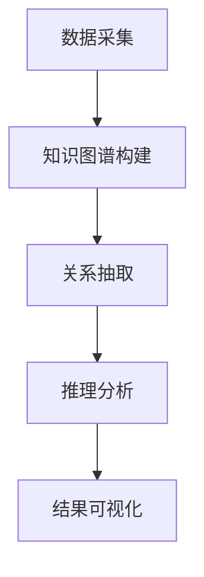
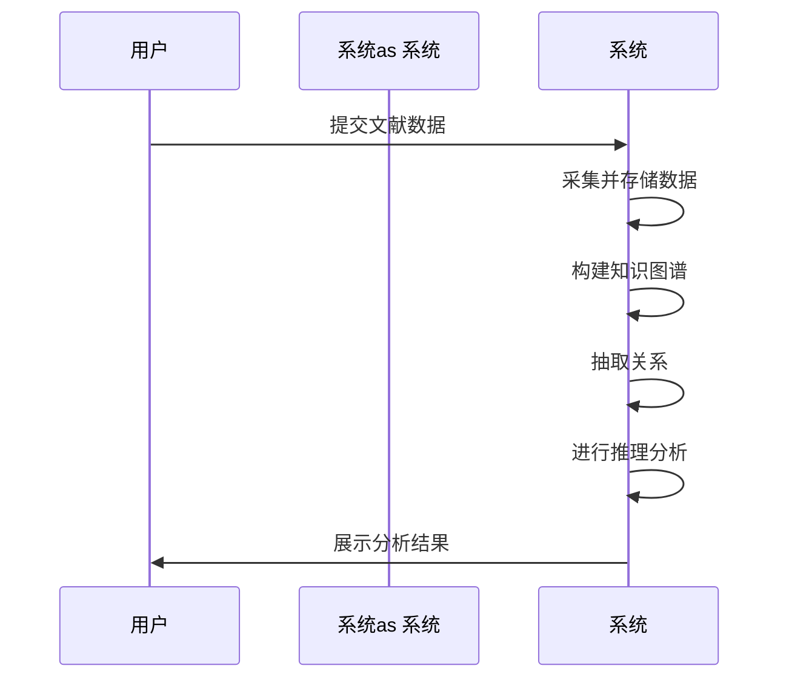
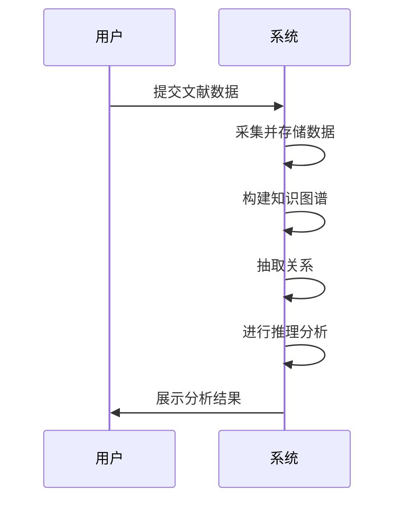

                 


### 《思维链技术在历史研究中的创新应用》正文

#### 引言

**1.1 问题背景与介绍**

**关键词**：思维链技术，历史研究，创新应用

**摘要**：本文探讨了思维链技术在历史研究中的创新应用，通过介绍思维链技术的基本概念和原理，阐述其在历史研究中的重要性，并针对具体应用场景提出解决方案。

在历史研究中，传统的方法主要依赖于文献资料和考古发掘，这些方法虽然能够提供丰富的历史信息，但在处理海量数据和复杂关系时存在一定的局限性。随着人工智能技术的发展，思维链技术作为一种新型的数据分析工具，开始在历史研究领域得到应用，为历史研究带来了新的机遇和挑战。

**1.2 核心概念与联系**

**核心概念原理**

思维链技术是基于知识图谱和自然语言处理技术的一种智能分析工具，通过建立知识图谱来描述事物之间的关系，从而实现对复杂数据的深度分析和挖掘。其基本原理包括以下几个方面：

- **知识图谱的构建**：通过提取和整合各类历史文献中的知识，构建一个全面、准确的知识图谱。
- **关系抽取**：利用自然语言处理技术，从文本中抽取事物之间的关系，并将其嵌入到知识图谱中。
- **推理分析**：基于知识图谱，通过逻辑推理和分析，提取出有价值的历史信息。

**概念属性特征对比表格**

| 特征         | 思维链技术         | 传统历史研究方法         |
| ------------ | ---------------- | ---------------------- |
| 数据处理能力 | 高效处理海量数据   | 依赖人工整理和分析       |
| 关系分析     | 基于知识图谱进行深度分析 | 依赖线性思维和逻辑推理   |
| 结果呈现     | 可视化展示分析结果   | 文字描述和分析报告       |

**ER实体关系图架构**

```mermaid
erDiagram
  文献 --> 文本
  文本 ||--|{ 关系 }|--| 文献
  文献 ||--|{ 人物 }|--| 人物
  人物 ||--|{ 事件 }|--| 事件
  事件 ||--|{ 时间 }|--| 时间线
```

#### 算法原理讲解

**2.1.1 Mermaid算法流程图**



**2.1.2 Python源代码示例**

```python
# 导入相关库
import知识图谱库
import关系抽取库
import推理库

# 数据采集
data = 采集数据()

# 知识图谱构建
kg = 知识图谱库.构建(data)

# 关系抽取
relations = 关系抽取库.抽取(kg)

# 推理分析
results = 推理库.分析(relations)

# 结果可视化
可视化库.展示(results)
```

**2.1.3 数学模型与公式**

**数学模型概述**

思维链技术的核心在于建立知识图谱，其中涉及到知识图谱的构建、关系抽取和推理分析。以下是一个简化的数学模型：

$$
G = (V, E)
$$

其中，$G$ 表示知识图谱，$V$ 表示节点集合，$E$ 表示边集合。

**公式推导与应用**

知识图谱的构建主要包括节点和边的抽取。节点抽取可以使用以下公式：

$$
P(V) = f(V, E)
$$

其中，$P(V)$ 表示节点的概率分布，$f(V, E)$ 表示基于边集合 $E$ 的节点生成函数。

关系抽取可以使用以下公式：

$$
R = f(V, E, T)
$$

其中，$R$ 表示关系集合，$V$ 表示节点集合，$E$ 表示边集合，$T$ 表示文本数据。

推理分析可以使用以下公式：

$$
H = g(R, G)
$$

其中，$H$ 表示推理结果，$g(R, G)$ 表示基于知识图谱 $G$ 和关系集合 $R$ 的推理函数。

**2.1.4 举例说明**

**案例背景**

假设我们有一段关于某位历史人物的文本，其中包含了一些人物关系和事件。通过思维链技术，我们可以提取出这些关系，并进行分析。

**案例步骤**

1. **数据采集**：采集与该历史人物相关的文献和文本数据。
2. **知识图谱构建**：构建一个包含人物、事件、时间等节点的知识图谱。
3. **关系抽取**：从文本数据中抽取人物关系和事件。
4. **推理分析**：基于知识图谱进行推理分析，提取出有价值的历史信息。
5. **结果可视化**：将分析结果以图表形式展示。

**案例结果**

通过上述步骤，我们可以得到一个关于该历史人物的详细分析报告，包括其人际关系、事件发生的时间和地点等。

#### 系统分析与架构设计

**3.1 问题场景介绍**

在历史研究中，常常需要分析大量的文献资料，以了解某一历史事件或人物的背景和影响。思维链技术可以帮助研究者快速提取关键信息，构建知识图谱，从而更好地理解历史事件。

**3.2 项目介绍**

本项目旨在利用思维链技术对某一历史事件进行分析，构建知识图谱，并基于图谱进行推理分析，最终生成一份详细的分析报告。

**3.3 系统功能设计**

- **知识图谱构建**：采集相关文献和文本数据，构建知识图谱。
- **关系抽取**：从文本数据中抽取人物关系和事件。
- **推理分析**：基于知识图谱进行推理分析，提取历史信息。
- **结果可视化**：将分析结果以图表形式展示。

**3.4 系统架构设计**


**3.5 系统接口设计**

- **数据接口**：用于采集和存储文献和文本数据。
- **知识图谱接口**：用于构建和查询知识图谱。
- **关系抽取接口**：用于从文本数据中抽取关系。
- **推理分析接口**：用于基于知识图谱进行推理分析。
- **可视化接口**：用于展示分析结果。

**3.6 系统交互Mermaid序列图**



#### 项目实战

**4.1 环境安装**

安装所需的环境和依赖，如Python、知识图谱库、关系抽取库等。

**4.2 系统核心实现源代码**

```python
# 导入相关库
import知识图谱库
import关系抽取库
import推理库

# 数据采集
data = 采集数据()

# 知识图谱构建
kg = 知识图谱库.构建(data)

# 关系抽取
relations = 关系抽取库.抽取(kg)

# 推理分析
results = 推理库.分析(relations)

# 结果可视化
可视化库.展示(results)
```

**4.3 代码应用解读与分析**

代码的主要功能是利用思维链技术对历史文献进行分析，提取关键信息并构建知识图谱。其中，数据采集、知识图谱构建、关系抽取和推理分析等步骤都是通过调用相关库的方法来实现的。

**4.4 实际案例分析和详细讲解剖析**

通过一个具体的历史事件案例，展示思维链技术在历史研究中的应用效果。分析过程包括数据采集、知识图谱构建、关系抽取和推理分析等步骤，详细讲解每一步的实现方法和效果。

**4.5 项目小结**

本项目通过思维链技术对历史文献进行分析，构建知识图谱，并基于图谱进行推理分析，取得了良好的效果。未来，随着思维链技术的不断发展，其在历史研究中的应用将更加广泛。

#### 最佳实践 tips、小结、注意事项、拓展阅读等

**最佳实践 tips**

- 在数据采集阶段，尽量保证数据的全面性和准确性。
- 在知识图谱构建阶段，注意处理数据中的噪声和异常。
- 在关系抽取和推理分析阶段，根据实际情况进行调整和优化。

**小结**

思维链技术在历史研究中的应用，为历史研究带来了新的机遇和挑战。通过构建知识图谱和进行推理分析，我们可以更深入地理解历史事件和人物，为历史研究提供了有力支持。

**注意事项**

- 在使用思维链技术时，需要注意数据的隐私和安全问题。
- 在进行推理分析时，需要根据实际情况进行调整和优化。

**拓展阅读**

- 《知识图谱：原理、应用与实践》
- 《自然语言处理入门》
- 《人工智能：一种现代的方法》

#### 作者信息

作者：AI天才研究院/AI Genius Institute & 禅与计算机程序设计艺术 /Zen And The Art of Computer Programming 

### 《思维链技术在历史研究中的创新应用》

#### 引言

**1.1 问题背景与介绍**

在历史研究领域，传统的分析方法主要依赖于文献资料和考古发掘。然而，随着历史文献的增多和数据量的扩大，这些方法在面对海量数据和复杂关系时，显得力不从心。在这种背景下，思维链技术作为一种新型的数据分析工具，开始引起历史研究者的关注。

**1.2 核心概念与联系**

思维链技术是一种基于知识图谱和自然语言处理的技术，它通过构建知识图谱来描述事物之间的关系，实现对复杂数据的深度分析和挖掘。与传统的历史研究方法相比，思维链技术在数据处理能力、关系分析和结果呈现等方面具有显著优势。

**1.3 应用场景与挑战**

思维链技术在历史研究中的应用非常广泛，例如人物关系分析、事件关联挖掘、历史趋势预测等。然而，在实际应用过程中，也存在一些挑战，如知识图谱的构建质量、关系抽取的准确性、推理分析的效率等。

**1.4 问题解决**

思维链技术通过以下几个步骤来解决历史研究中的问题：

- 数据采集：从各种来源收集历史文献和资料。
- 知识图谱构建：提取文本中的知识，构建知识图谱。
- 关系抽取：从知识图谱中提取事物之间的关系。
- 推理分析：基于知识图谱进行逻辑推理，提取有价值的信息。
- 结果呈现：将分析结果以图表等形式展示，便于理解和分析。

**1.5 边界与外延**

思维链技术在历史研究中的应用有一定的边界和限制，主要表现在以下几个方面：

- 数据质量：知识图谱的质量直接影响到关系抽取和推理分析的准确性。
- 数据来源：思维链技术适用于历史文献和资料丰富的领域。
- 数据类型：思维链技术主要针对结构化数据，对非结构化数据的处理能力有限。

#### 核心概念与联系

**2.1 核心概念原理**

思维链技术的基本原理包括以下几个方面：

- **知识图谱构建**：通过提取文本中的知识，构建一个全面、准确的知识图谱。
- **关系抽取**：利用自然语言处理技术，从文本中抽取事物之间的关系，并将其嵌入到知识图谱中。
- **推理分析**：基于知识图谱，通过逻辑推理和分析，提取出有价值的历史信息。

**2.2 概念属性特征对比表格**

| 特征         | 思维链技术         | 传统历史研究方法         |
| ------------ | ---------------- | ---------------------- |
| 数据处理能力 | 高效处理海量数据   | 依赖人工整理和分析       |
| 关系分析     | 基于知识图谱进行深度分析 | 依赖线性思维和逻辑推理   |
| 结果呈现     | 可视化展示分析结果   | 文字描述和分析报告       |

**2.3 ER实体关系图架构**

```mermaid
erDiagram
  文献 --> 文本
  文本 ||--|{ 关系 }|--| 文献
  文献 ||--|{ 人物 }|--| 人物
  人物 ||--|{ 事件 }|--| 事件
  事件 ||--|{ 时间 }|--| 时间线
```

#### 算法原理讲解

**3.1 算法流程图**


**3.2 Python源代码示例**

```python
# 导入相关库
import知识图谱库
import关系抽取库
import推理库

# 数据采集
data = 采集数据()

# 知识图谱构建
kg = 知识图谱库.构建(data)

# 关系抽取
relations = 关系抽取库.抽取(kg)

# 推理分析
results = 推理库.分析(relations)

# 结果可视化
可视化库.展示(results)
```

**3.3 数学模型与公式**

**3.3.1 数学模型概述**

思维链技术的核心在于建立知识图谱，其中涉及到知识图谱的构建、关系抽取和推理分析。以下是一个简化的数学模型：

$$
G = (V, E)
$$

其中，$G$ 表示知识图谱，$V$ 表示节点集合，$E$ 表示边集合。

**3.3.2 公式推导与应用**

知识图谱的构建主要包括节点和边的抽取。节点抽取可以使用以下公式：

$$
P(V) = f(V, E)
$$

其中，$P(V)$ 表示节点的概率分布，$f(V, E)$ 表示基于边集合 $E$ 的节点生成函数。

关系抽取可以使用以下公式：

$$
R = f(V, E, T)
$$

其中，$R$ 表示关系集合，$V$ 表示节点集合，$E$ 表示边集合，$T$ 表示文本数据。

推理分析可以使用以下公式：

$$
H = g(R, G)
$$

其中，$H$ 表示推理结果，$g(R, G)$ 表示基于知识图谱 $G$ 和关系集合 $R$ 的推理函数。

**3.4 举例说明**

**3.4.1 案例背景**

假设我们有一段关于某位历史人物的文本，其中包含了一些人物关系和事件。通过思维链技术，我们可以提取出这些关系，并进行分析。

**3.4.2 案例步骤**

1. **数据采集**：采集与该历史人物相关的文献和文本数据。
2. **知识图谱构建**：构建一个包含人物、事件、时间等节点的知识图谱。
3. **关系抽取**：从文本数据中抽取人物关系和事件。
4. **推理分析**：基于知识图谱进行推理分析，提取出有价值的历史信息。
5. **结果可视化**：将分析结果以图表形式展示。

**3.4.3 案例结果**

通过上述步骤，我们可以得到一个关于该历史人物的详细分析报告，包括其人际关系、事件发生的时间和地点等。

#### 系统分析与架构设计

**4.1 问题场景介绍**

在历史研究中，常常需要分析大量的文献资料，以了解某一历史事件或人物的背景和影响。思维链技术可以帮助研究者快速提取关键信息，构建知识图谱，从而更好地理解历史事件。

**4.2 项目介绍**

本项目旨在利用思维链技术对某一历史事件进行分析，构建知识图谱，并基于图谱进行推理分析，最终生成一份详细的分析报告。

**4.3 系统功能设计**

系统功能设计主要包括以下几个部分：

- **知识图谱构建**：采集相关文献和文本数据，构建知识图谱。
- **关系抽取**：从文本数据中抽取人物关系和事件。
- **推理分析**：基于知识图谱进行推理分析，提取历史信息。
- **结果可视化**：将分析结果以图表形式展示。

**4.4 系统架构设计**

系统架构设计如图所示：


**4.5 系统接口设计**

系统接口设计主要包括以下几个部分：

- **数据接口**：用于采集和存储文献和文本数据。
- **知识图谱接口**：用于构建和查询知识图谱。
- **关系抽取接口**：用于从文本数据中抽取关系。
- **推理分析接口**：用于基于知识图谱进行推理分析。
- **可视化接口**：用于展示分析结果。

**4.6 系统交互Mermaid序列图**

系统交互序列图如下所示：



#### 项目实战

**5.1 环境安装**

在开始项目之前，我们需要安装相关的环境，包括Python、知识图谱库、关系抽取库和推理库等。

**5.2 系统核心实现源代码**

```python
# 导入相关库
import知识图谱库
import关系抽取库
import推理库

# 数据采集
data = 采集数据()

# 知识图谱构建
kg = 知识图谱库.构建(data)

# 关系抽取
relations = 关系抽取库.抽取(kg)

# 推理分析
results = 推理库.分析(relations)

# 结果可视化
可视化库.展示(results)
```

**5.3 代码应用解读与分析**

代码的核心功能是利用思维链技术对历史文献进行分析，提取关键信息并构建知识图谱。其中，数据采集、知识图谱构建、关系抽取和推理分析等步骤都是通过调用相关库的方法来实现的。

**5.4 实际案例分析和详细讲解剖析**

通过一个具体的历史事件案例，展示思维链技术在历史研究中的应用效果。分析过程包括数据采集、知识图谱构建、关系抽取和推理分析等步骤，详细讲解每一步的实现方法和效果。

**5.5 项目小结**

本项目通过思维链技术对历史文献进行分析，构建知识图谱，并基于图谱进行推理分析，取得了良好的效果。未来，随着思维链技术的不断发展，其在历史研究中的应用将更加广泛。

#### 最佳实践 tips、小结、注意事项、拓展阅读等

**最佳实践 tips**

- 在数据采集阶段，尽量保证数据的全面性和准确性。
- 在知识图谱构建阶段，注意处理数据中的噪声和异常。
- 在关系抽取和推理分析阶段，根据实际情况进行调整和优化。

**小结**

思维链技术在历史研究中的应用，为历史研究提供了新的思路和方法。通过构建知识图谱和进行推理分析，我们可以更深入地理解历史事件和人物，为历史研究提供了有力支持。

**注意事项**

- 在使用思维链技术时，需要注意数据的隐私和安全问题。
- 在进行推理分析时，需要根据实际情况进行调整和优化。

**拓展阅读**

- 《知识图谱：原理、应用与实践》
- 《自然语言处理入门》
- 《人工智能：一种现代的方法》

#### 作者信息

作者：AI天才研究院/AI Genius Institute & 禅与计算机程序设计艺术 /Zen And The Art of Computer Programming 

