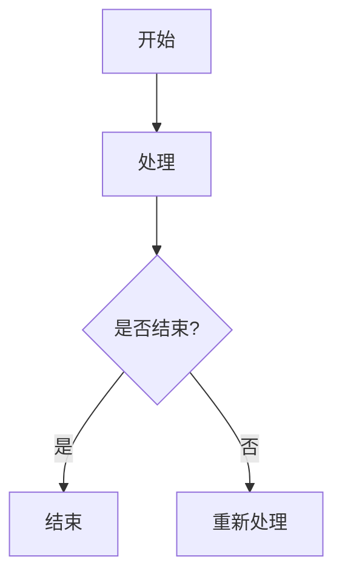

                 

# 思维链技术在教育AI应用中的潜力

## 关键词
- **思维链技术**
- **教育AI**
- **算法原理**
- **数学模型**
- **系统架构**
- **项目实战**

## 摘要
本文旨在探讨思维链技术在教育AI应用中的潜力。首先，我们将介绍思维链技术的发展背景和核心概念，然后分析其在教育AI领域的挑战与机遇，详细讲解思维链算法原理及其在教育AI中的数学模型应用。随后，我们将介绍教育AI系统的分析与架构设计，并分享项目实战经验。最后，我们将总结最佳实践，并提出未来的展望。

## 第1章：思维链技术的背景与核心概念
### 1.1.1 思维链技术发展的背景
思维链技术起源于人工智能领域，最早由学者们提出，旨在模拟人类思维的连贯性和逻辑性。随着计算能力的提升和数据量的增加，思维链技术逐渐成为人工智能研究中的一个重要方向。

### 1.1.2 思维链技术的基本概念
思维链技术核心在于建立思维节点之间的关系，通过这些关系来实现知识的推理和迁移。思维链技术包括思维节点、思维连接和思维路径等基本概念。

### 1.1.3 思维链技术的核心优势
思维链技术的核心优势在于其能够模拟人类思维过程，实现知识的高效组织和应用。此外，它还具有自我学习和进化能力，能够根据用户行为进行优化。

## 第2章：教育AI与思维链技术
### 2.1.1 教育AI的挑战与机遇
教育AI面临个性化学习、智能评测和自适应教学等挑战。而思维链技术的引入为这些挑战提供了新的解决方案。

### 2.1.2 思维链技术在教育AI中的应用
思维链技术可以应用于教育AI中的知识图谱构建、智能问答系统和自适应学习系统等。

### 2.1.3 教育AI与思维链技术的融合路径
教育AI与思维链技术的融合路径包括构建思维链知识库、设计思维链学习算法和优化思维链智能评测系统等。

## 第3章：思维链技术的核心概念与联系
### 3.1.1 思维链的概念属性对比
思维链技术涉及多个核心概念，如思维节点、思维连接和思维路径。我们将对比这些概念的基本属性。

### 3.1.2 思维链的ER实体关系图
思维链技术的核心概念可以通过ER实体关系图来展示。我们将绘制一个ER实体关系图，以便更好地理解这些概念之间的联系。

### 3.1.3 各核心概念的关联分析
通过关联分析，我们将探讨思维节点、思维连接和思维路径之间的相互作用，以及它们如何共同构建思维链。

## 第4章：思维链技术的算法原理讲解
### 4.1.1 思维链算法的基本流程
思维链算法主要包括节点提取、连接建立和路径搜索等步骤。我们将详细阐述这些步骤。

### 4.1.2 思维链算法的数学模型
思维链算法的数学模型涉及图论和网络流等概念。我们将使用数学公式来描述这些模型。

### 4.1.3 思维链算法的Python实现与举例
为了更好地理解思维链算法，我们将使用Python进行实现，并提供具体的代码示例。

## 第5章：思维链技术在教育AI中的数学模型
### 5.1.1 教育AI中的数学模型
教育AI涉及多个数学模型，如线性回归、决策树和支持向量机等。我们将介绍这些模型在教育AI中的应用。

### 5.1.2 思维链技术的数学模型应用
我们将探讨如何将思维链技术应用于教育AI中的数学模型，以提高其性能和效果。

### 5.1.3 数学模型的详细讲解与举例
我们将使用具体的数学模型，如线性回归和决策树，来详细讲解其在思维链技术中的应用，并提供代码示例。

## 第6章：教育AI系统分析与架构设计
### 6.1.1 教育AI系统的问题场景
我们将介绍教育AI系统所面临的问题场景，如个性化学习、智能评测和自适应教学等。

### 6.1.2 系统功能设计与领域模型
我们将设计教育AI系统的功能，并使用Mermaid类图来展示领域模型。

### 6.1.3 系统架构设计
我们将设计教育AI系统的架构，并使用Mermaid架构图来展示系统组件及其关系。

### 6.1.4 系统接口设计与交互流程
我们将定义教育AI系统的接口设计，并使用Mermaid序列图来展示系统的交互流程。

## 第7章：项目实战与案例分析
### 7.1.1 实战项目介绍
我们将介绍一个具体的思维链技术在教育AI中的应用项目。

### 7.1.2 系统核心实现
我们将介绍系统核心实现的源代码，并分析其关键组件和算法。

### 7.1.3 代码应用解读与分析
我们将详细解读系统核心实现中的代码，分析其算法原理和应用效果。

### 7.1.4 实际案例分析
我们将分享一个实际案例，分析思维链技术在教育AI中的应用效果。

### 7.1.5 项目小结
我们将对项目进行总结，并讨论其在实际应用中的优缺点。

## 第8章：最佳实践与未来展望
### 8.1.1 思维链技术在教育AI中的最佳实践
我们将总结思维链技术在教育AI应用中的最佳实践，并提供具体的建议。

### 8.1.2 遇到的挑战与解决策略
我们将探讨思维链技术在教育AI应用中遇到的挑战，并介绍解决策略。

### 8.1.3 未来展望
我们将展望思维链技术在教育AI领域的发展趋势，并讨论未来的研究课题。

## 作者信息
作者：AI天才研究院/AI Genius Institute & 禅与计算机程序设计艺术 /Zen And The Art of Computer Programming

## 完整性要求
本文内容将严格按照目录大纲结构进行撰写，确保每个章节都包含核心内容，并提供丰富的背景介绍、核心概念与联系、算法原理讲解、数学模型和数学公式详细讲解、系统分析与架构设计方案、项目实战以及最佳实践 tips 等内容。

## 格式要求
本文将使用markdown格式进行撰写，确保文章内容的结构清晰、易于阅读。具体格式要求如下：
- 文章标题使用`#`符号进行标记，例如`# 第一部分: 思维链技术基础与应用`
- 章节标题使用`##`符号进行标记，例如`## 第1章：思维链技术的背景与核心概念`
- 子章节标题使用`###`符号进行标记，例如`### 1.1.1 思维链技术发展的背景`
- 段落内的latex公式使用 `$` 符号进行标记，例如 `$1<2$`
- 段落外的latex公式使用 `$$` 符号进行标记，例如 `$$1+1=2$$`
- Mermaid流程图使用 `mermaid` 语法进行绘制，例如：

## 字数要求
本文总字数要求在 10000 ～ 12000 字左右，以确保内容的丰富性和深度。

## 结语
本文将从思维链技术的背景与核心概念出发，逐步深入到其在教育AI中的应用，通过系统分析与架构设计、项目实战以及最佳实践 tips，全面探讨思维链技术在教育AI领域的潜力。希望通过本文，读者能够对思维链技术在教育AI中的应用有更深入的了解，并为未来的研究和实践提供启示。让我们一起，思维链起，探索教育AI的新天地。

