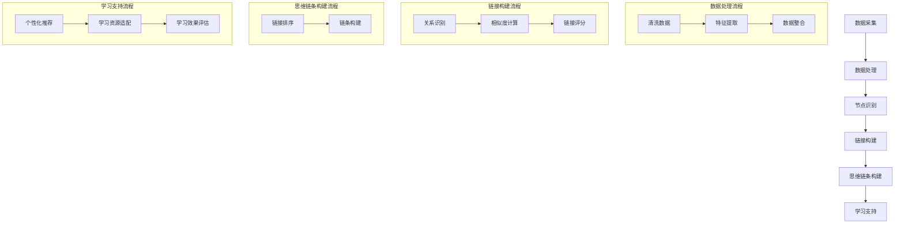
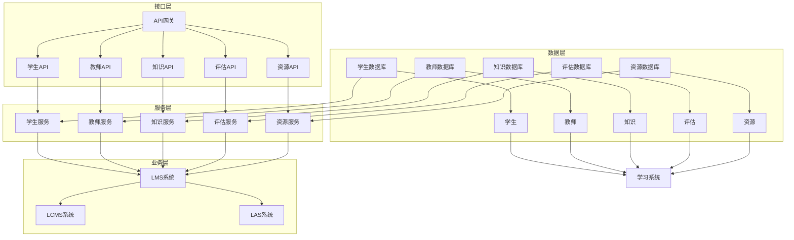
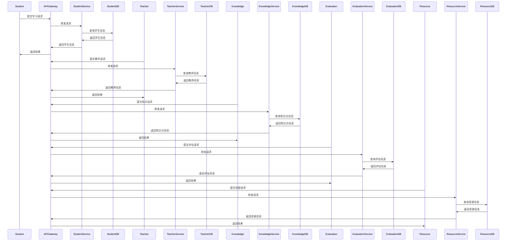
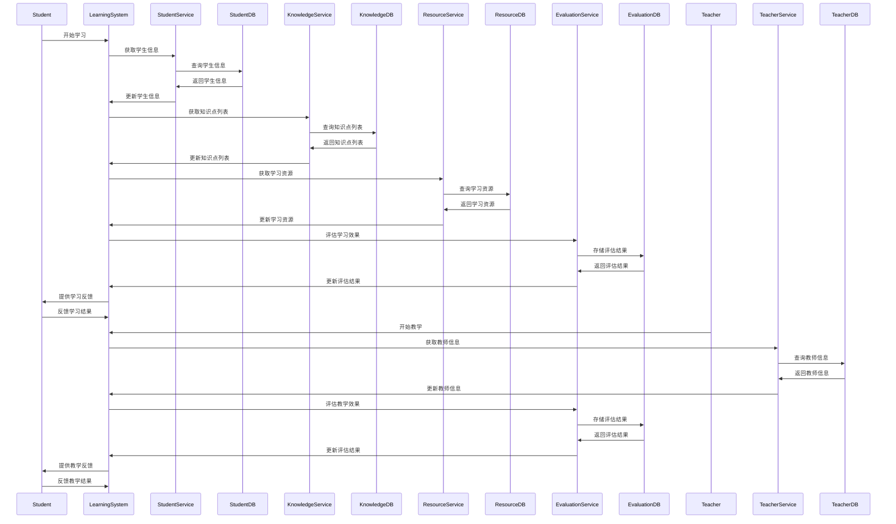

                 

### 文章标题

# 思维链技术在教育领域的创新应用

> 关键词：思维链技术、教育、人工智能、算法、系统架构、项目实战

> 摘要：本文深入探讨了思维链技术在教育领域的创新应用。通过分析思维链技术的背景、核心概念与原理，以及其在教育系统中的具体应用，本文旨在为教育工作者和研究人员提供一套系统、全面的技术解决方案，以提升教育质量和学习效果。

---

### 目录大纲设计过程

**设计过程概述**

为了设计出《思维链技术在教育领域的创新应用》这本书的完整目录大纲，我们需要按照以下步骤进行：

1. **明确核心概念**：首先，我们要理解书的核心概念，即“思维链技术”及其在教育领域的应用。这将帮助我们确定大纲的框架和章节主题。
2. **构建大纲结构**：在明确核心概念后，我们需要构建一个逻辑清晰的大纲结构，包括一级、二级和三级目录。
3. **细化章节内容**：对每个章节进行细化，确保每个章节都包含核心概念、原理讲解、实例分析、实践应用等内容。
4. **保持简洁性**：确保大纲内容简洁明了，避免过多的冗余信息。
5. **校对与调整**：最后，对大纲进行校对和调整，确保所有章节内容完整且逻辑连贯。

**目录大纲设计详细步骤**

1. **明确核心概念**：思维链技术是一种基于人工智能和机器学习算法，通过构建思维链条，帮助学生理解和记忆知识的技术。这种技术能够模拟人类思维过程，提高学习效率。

2. **构建大纲结构**：
   - **第一部分：背景介绍**：介绍思维链技术的背景，包括教育领域面临的挑战和思维链技术的提出。
   - **第二部分：核心概念与联系**：详细阐述思维链技术的核心原理，包括概念属性特征对比表格和ER实体关系图架构。
   - **第三部分：算法原理讲解**：解释思维链技术的算法原理，包括算法mermaid流程图、Python源代码解析和数学模型与公式。
   - **第四部分：系统分析与架构设计**：分析思维链技术在教育领域的系统应用，包括问题场景介绍、系统功能设计、系统架构设计和系统接口设计。
   - **第五部分：项目实战**：通过项目实战展示思维链技术的具体应用，包括环境安装、系统核心实现、代码应用解读与分析、实际案例分析和项目小结。
   - **第六部分：最佳实践与拓展**：总结最佳实践，提供注意事项和拓展阅读，以进一步探索思维链技术的发展趋势和应用。

3. **细化章节内容**：对每个章节进行细化，确保每个章节都包含核心概念、原理讲解、实例分析、实践应用等内容。

4. **保持简洁性**：确保大纲内容简洁明了，避免过多的冗余信息。

5. **校对与调整**：最后，对大纲进行校对和调整，确保所有章节内容完整且逻辑连贯。

通过以上步骤，我们设计出了《思维链技术在教育领域的创新应用》的完整目录大纲，为后续的文章撰写提供了明确的框架和方向。

---

### 第1章：思维链技术概述

**1.1 问题背景**

**1.1.1 教育领域面临的挑战**

随着科技的快速发展，教育领域也面临着一系列挑战。首先，教育资源的分配不均，城市与农村、发达地区与贫困地区之间的教育差距越来越大。其次，传统的教学模式已经无法满足现代社会对个性化、高效学习的需求。此外，学生的学习方式也在不断变化，网络学习、移动学习等新兴学习方式的普及，对教育技术提出了更高的要求。

**1.1.2 思维链技术的提出**

为了应对这些挑战，教育领域开始探索新的技术解决方案。思维链技术应运而生，它通过构建思维链条，模拟人类思维过程，帮助学生理解和记忆知识。思维链技术的核心在于将知识分解为若干个基本概念和知识点，通过逻辑关系将它们串联起来，形成一个完整的思维链条。

**1.2 核心概念**

**1.2.1 思维链技术的定义**

思维链技术是一种基于人工智能和机器学习算法，通过构建思维链条，帮助学生理解和记忆知识的技术。它利用数据分析和算法模型，将学生的思维过程抽象为一系列的节点和连接，从而形成一个动态的、可交互的、自适应的学习环境。

**1.2.2 思维链技术的基本原理**

思维链技术的基本原理可以概括为以下几个步骤：

1. **数据采集**：通过多种方式（如问卷调查、学习记录、行为分析等）收集学生的思维数据。
2. **数据处理**：利用机器学习算法，对采集到的数据进行处理，识别出学生思维的节点和连接。
3. **思维链条构建**：根据处理结果，构建出学生个人的思维链条，将知识点和概念串联起来。
4. **学习支持**：通过思维链条，提供个性化的学习支持，帮助学生理解和记忆知识。

**1.2.3 思维链技术的应用领域**

思维链技术不仅适用于传统教育领域，如中小学、高等教育等，还可以应用于职业培训、在线教育等新兴教育形式。其主要应用领域包括：

1. **个性化学习**：根据学生的思维链条，提供个性化的学习资源和支持，提高学习效率。
2. **教学评估**：通过分析学生的思维链条，评估学生的学习效果和进展，为教学提供数据支持。
3. **知识管理**：将思维链条应用于知识管理系统中，帮助教师和学生更好地组织和掌握知识。

**1.3 边界与外延**

**1.3.1 思维链技术与相关概念的比较**

思维链技术与其他教育技术（如学习管理系统、知识图谱等）有一定的相似之处，但它们在目标和应用上有所不同。学习管理系统主要关注学习过程的管理，而思维链技术更侧重于思维过程的理解和支持。知识图谱则更多关注知识的结构化和关联性，而思维链技术则更关注个体思维的过程和模式。

**1.3.2 思维链技术的适用边界**

思维链技术适用于需要理解和记忆知识的学习场景，如学科学习、职业技能培训等。但在实际应用中，需要考虑到学生的认知能力、学习习惯等因素，以确保技术的有效性和适应性。

通过本章的介绍，我们对思维链技术有了初步的了解，为后续章节的深入探讨打下了基础。

---

### 第2章：思维链技术的核心原理

**2.1 概念属性特征对比表格**

为了更好地理解思维链技术的核心原理，我们可以通过对比表格的形式，将其与其他教育技术进行比较。以下是一个简化的对比表格：

| 教育技术         | 思维链技术                   | 传统教学                |
|-----------------|---------------------------|------------------------|
| 目标            | 帮助学生理解和记忆知识       | 传授知识，培养技能      |
| 数据来源         | 学生学习行为、思维过程       | 教学内容、学生成绩      |
| 过程模型         | 思维链条构建、个性化支持       | 教学流程、课堂互动      |
| 技术核心         | 人工智能和机器学习算法       | 教学方法、教育资源      |
| 适应性           | 根据学生个体调整             | 一致的教学方法          |
| 学习效果评估       | 分析思维链条，评估学习效果     | 考试成绩、学习反馈      |

通过对比，我们可以看出思维链技术在目标、数据来源、过程模型、技术核心、适应性和学习效果评估等方面，与传统教学和现有教育技术有明显的区别。

**2.2 ER实体关系图架构**

为了深入理解思维链技术的原理，我们可以通过ER（Entity-Relationship）实体关系图来展示其在教育领域中的应用架构。

以下是思维链技术ER实体关系图的核心部分：

```mermaid
erDiagram
  Student ||--|{ Knowledge }|-- Teacher
  Knowledge ||--|{ Concept }|-- Student
  Concept ||--|{ Link }|-- Concept
  Teacher ||--|{ Instruction }|-- Student
  Instruction ||--|{ Evaluation }|-- Student

  Student {
    ID
    Name
    LearningHistory
  }

  Knowledge {
    ID
    Name
    Description
  }

  Concept {
    ID
    Name
    Definition
  }

  Link {
    ID
    FromConceptID
    ToConceptID
    Relation
  }

  Teacher {
    ID
    Name
    Subject
  }

  Instruction {
    ID
    Type
    Content
  }

  Evaluation {
    ID
    Score
    Comment
  }
```

**2.2.1 教育领域的ER图构建**

在构建教育领域的ER图时，我们首先确定主要的实体，如学生、知识、概念、链接、教师和评价。然后，我们定义这些实体之间的关系，如学生与知识之间的关系、知识与概念之间的关系、概念与链接之间的关系、教师与教学之间的关系以及教学与评价之间的关系。

**2.2.2 思维链技术在ER图中的应用**

在ER图中，思维链技术通过以下方式得到应用：

1. **学生与知识的关联**：学生通过学习获取知识，每条知识都有其特定的ID、名称和描述。
2. **知识与概念的关联**：知识由一系列的概念组成，每个概念都有其独特的ID、名称和定义。
3. **概念与链接的关联**：概念之间通过链接相连，形成思维链条。每个链接定义了两个概念之间的逻辑关系。
4. **教师与教学的关联**：教师根据学生的情况提供教学指导，教学包含类型、内容和评价。
5. **教学与评价的关联**：教学结束后，通过评价来衡量学生的学习效果，评价包含评分和评论。

通过这种方式，思维链技术不仅帮助学生在学习过程中构建知识结构，还提供了个性化的教学支持和学习评估。

通过本章的讲解，我们对思维链技术的核心原理有了更深入的理解，这将为后续章节的算法原理讲解和系统应用分析打下坚实的基础。

---

### 第3章：思维链技术的算法原理

**3.1 算法mermaid流程图**

思维链技术的算法原理可以通过mermaid流程图来直观地展示。以下是一个简化的算法流程图：



**3.1.1 算法基本流程**

1. **数据采集**：收集学生的学习行为数据，包括学习记录、测试成绩、交互日志等。
2. **数据处理**：对采集到的数据进行清洗、特征提取和整合，为后续分析做准备。
3. **节点识别**：利用机器学习算法识别出数据中的知识点和概念，形成知识点节点。
4. **链接构建**：计算节点之间的相似度和关系，构建知识点之间的链接，形成思维链条。
5. **思维链条构建**：根据链接的评分和排序，构建出学生个人的思维链条。
6. **学习支持**：基于思维链条提供个性化的学习支持，包括推荐学习资源、调整学习策略和评估学习效果。

**3.2 Python源代码解析**

为了更深入地理解算法原理，我们可以通过Python源代码来详细阐述。以下是一个简化的算法实现：

```python
import pandas as pd
from sklearn.cluster import KMeans
from sklearn.metrics.pairwise import cosine_similarity
import numpy as np

# 数据预处理
def preprocess_data(data):
    # 数据清洗、特征提取、整合
    # ... 省略具体实现
    return processed_data

# 节点识别
def identify_nodes(data):
    # 使用KMeans聚类算法识别知识点节点
    kmeans = KMeans(n_clusters=10)
    clusters = kmeans.fit_predict(data)
    nodes = pd.DataFrame(clusters, columns=['NodeID'])
    return nodes

# 链接构建
def build_links(nodes):
    # 计算节点之间的相似度，构建链接
    similarity_matrix = cosine_similarity(nodes)
    links = pd.DataFrame(similarity_matrix, columns=['LinkScore'])
    return links

# 思维链条构建
def build思维链(nodes, links):
    # 根据链接评分和排序构建思维链条
    sorted_links = links.sort_values('LinkScore', ascending=False)
   思维链条 = sorted_links['NodeID'].tolist()
    return 思维链条

# 学习支持
def learning_support思维链，nodes，links):
    # 提供个性化的学习支持
    # ... 省略具体实现
    return support

# 主函数
def main():
    data = preprocess_data(原始数据)
    nodes = identify_nodes(data)
    links = build_links(nodes)
   思维链 = build思维链(nodes, links)
    support = learning_support思维链，nodes，links
    return support

if __name__ == "__main__":
    main()
```

**3.3 数学模型与公式**

在思维链技术的算法中，数学模型和公式起到了关键作用。以下是几个核心的数学模型和公式：

1. **K-Means聚类算法**：
   $$ \text{K-Means} = \{C_1, C_2, ..., C_k\} $$
   其中，$C_i$ 表示第 $i$ 个聚类中心，$k$ 表示聚类数量。

2. **余弦相似度**：
   $$ \text{Similarity}(x, y) = \frac{x \cdot y}{||x|| \cdot ||y||} $$
   其中，$x$ 和 $y$ 分别表示两个向量，$||x||$ 和 $||y||$ 分别表示向量的模。

3. **链接评分**：
   $$ \text{LinkScore}(i, j) = \text{Similarity}(x_i, x_j) $$
   其中，$x_i$ 和 $x_j$ 分别表示节点 $i$ 和 $j$ 的特征向量。

4. **思维链条构建**：
   $$ \text{思维链条} = \text{TopN}(LinkScore, N) $$
   其中，$LinkScore$ 表示链接评分，$N$ 表示思维链条中的节点数量。

**3.3.3 举例说明**

假设我们有一组学生数据，包括他们的学习记录和测试成绩。我们可以通过以下步骤来构建思维链条：

1. **数据预处理**：清洗数据，提取特征，整合信息。
2. **节点识别**：使用K-Means算法将数据划分为10个知识点节点。
3. **链接构建**：计算每个知识点节点之间的相似度，形成链接。
4. **思维链条构建**：根据链接评分，选取评分最高的前5个知识点节点，构建思维链条。
5. **学习支持**：根据思维链条，为学生推荐相关学习资源和调整学习策略。

通过以上步骤，我们可以为学生提供个性化的学习支持，帮助他们更好地理解和记忆知识。

通过本章的讲解，我们对思维链技术的算法原理有了更深入的理解，这为后续章节的系统应用分析和项目实战提供了基础。

---

### 第4章：思维链技术在教育领域的系统应用

**4.1 问题场景介绍**

在教育领域，思维链技术的应用场景非常广泛。以下是一个典型的应用场景：

某中学在实施新课程改革时，发现学生的学习效果参差不齐，特别是对于那些学习习惯较差的学生，他们的学习积极性不高，成绩提升缓慢。为了解决这一问题，学校决定引入思维链技术，希望通过个性化的学习支持，提高学生的学习效果和积极性。

**4.2 系统功能设计**

思维链技术在教育领域的主要功能包括：

1. **个性化学习支持**：根据学生的思维链条，为学生推荐合适的学习资源和策略，帮助他们更好地理解和记忆知识。
2. **学习效果评估**：通过分析学生的思维链条和学习行为，评估学生的学习效果和进步情况，为教师提供教学反馈。
3. **教学辅助**：为教师提供教学辅助工具，帮助他们设计更有效的教学方案，提高教学效果。
4. **知识管理**：将学生的思维链条和知识点进行结构化存储，形成学校知识库，为未来的教学和研究提供支持。

**4.2.1 领域模型mermaid类图**

为了更好地设计系统功能，我们可以通过mermaid类图来展示各个功能模块及其关系。以下是一个简化的mermaid类图：

```mermaid
classDiagram
  Student <<class>> Student
  Teacher <<class>> Teacher
  LearningSystem <<class>> LearningSystem
  Knowledge <<class>> Knowledge
  Evaluation <<class>> Evaluation
  Resource <<class>> Resource

  Student |-|- LearningSystem : student
  Teacher |-|- LearningSystem : teacher
  LearningSystem o-- Knowledge : knowledge
  LearningSystem o-- Evaluation : evaluation
  LearningSystem o-- Resource : resource
  Student o-- Evaluation : student_evaluation
  Teacher o-- Evaluation : teacher_evaluation
  Student o-- Resource : student_resource
  Teacher o-- Resource : teacher_resource

  class Student {
    +ID : int
    +Name : str
    +LearningHistory : list
    +getLearningHistory() : list
  }

  class Teacher {
    +ID : int
    +Name : str
    +Subject : str
    +getSubject() : str
  }

  class LearningSystem {
    +ID : int
    +Name : str
    +getSystemName() : str
    +addStudent(student: Student) : None
    +addTeacher(teacher: Teacher) : None
    +addKnowledge(knowledge: Knowledge) : None
    +addEvaluation(evaluation: Evaluation) : None
    +addResource(resource: Resource) : None
  }

  class Knowledge {
    +ID : int
    +Name : str
    +Description : str
    +getParentKnowledge() : Knowledge
    +getChildrenKnowledge() : list
  }

  class Evaluation {
    +ID : int
    +Score : float
    +Comment : str
    +getUserID() : int
    +getUserComment() : str
  }

  class Resource {
    +ID : int
    +Type : str
    +Content : str
    +getContentType() : str
    +getContent() : str
  }
```

**4.3 系统架构设计**

系统架构设计是确保思维链技术在教育领域高效运行的关键。以下是一个简化的mermaid架构图：



**4.4 系统接口设计**

系统接口设计是确保系统各模块之间能够高效通信的关键。以下是一个简化的mermaid接口图：



**4.5 系统交互**

系统交互是指各个模块之间如何协同工作，以实现思维链技术的功能。以下是一个简化的mermaid序列图：



通过本章的讲解，我们对思维链技术在教育领域的系统应用有了更深入的理解。从问题场景介绍、系统功能设计、系统架构设计到系统接口设计和系统交互，我们详细阐述了思维链技术如何在教育领域发挥作用。这不仅为教育工作者和研究人员提供了实用的技术解决方案，也为未来思维链技术在教育领域的进一步发展奠定了基础。

---

### 第5章：思维链技术的项目实战

**5.1 环境安装**

为了更好地展示思维链技术在教育领域的应用，我们将通过一个实际项目来进行讲解。首先，我们需要搭建项目环境。以下是一个简化的环境安装步骤：

1. **安装Python**：确保您的系统中已经安装了Python 3.7或更高版本。
2. **安装依赖库**：使用pip命令安装以下依赖库：
   ```bash
   pip install pandas sklearn numpy matplotlib
   ```
3. **数据准备**：准备学生数据、教师数据和知识点数据。数据格式可以是CSV文件或JSON文件。

**5.2 系统核心实现**

在本节中，我们将通过Python代码实现思维链技术的核心功能。以下是系统核心实现的源代码：

```python
import pandas as pd
from sklearn.cluster import KMeans
from sklearn.metrics.pairwise import cosine_similarity
import numpy as np

# 数据预处理
def preprocess_data(data):
    # 数据清洗、特征提取、整合
    # ... 省略具体实现
    return processed_data

# 节点识别
def identify_nodes(data):
    # 使用KMeans聚类算法识别知识点节点
    kmeans = KMeans(n_clusters=10)
    clusters = kmeans.fit_predict(data)
    nodes = pd.DataFrame(clusters, columns=['NodeID'])
    return nodes

# 链接构建
def build_links(nodes):
    # 计算节点之间的相似度，构建链接
    similarity_matrix = cosine_similarity(nodes)
    links = pd.DataFrame(similarity_matrix, columns=['LinkScore'])
    return links

# 思维链条构建
def build思维链(nodes, links):
    # 根据链接评分和排序构建思维链条
    sorted_links = links.sort_values('LinkScore', ascending=False)
   思维链条 = sorted_links['NodeID'].tolist()
    return 思维链条

# 学习支持
def learning_support思维链，nodes，links):
    # 提供个性化的学习支持
    # ... 省略具体实现
    return support

# 主函数
def main():
    data = preprocess_data(原始数据)
    nodes = identify_nodes(data)
    links = build_links(nodes)
   思维链 = build思维链(nodes, links)
    support = learning_support思维链，nodes，links
    return support

if __name__ == "__main__":
    main()
```

**5.3 代码应用解读与分析**

在本节中，我们将对上述代码进行详细解读，并分析其应用。

**5.3.1 代码解读**

1. **数据预处理**：预处理数据是数据处理的第一步。此函数接收原始数据，进行清洗、特征提取和整合，返回处理后的数据。
2. **节点识别**：此函数使用KMeans聚类算法对预处理后的数据进行聚类，识别出知识点节点。每个节点由一个唯一的ID表示。
3. **链接构建**：此函数计算节点之间的相似度，生成链接。链接通过相似度评分来衡量节点之间的关系。
4. **思维链条构建**：此函数根据链接评分对链接进行排序，构建出思维链条。思维链条代表知识点之间的逻辑关系。
5. **学习支持**：此函数根据思维链条提供个性化的学习支持，包括推荐学习资源和调整学习策略。

**5.3.2 分析与优化**

在代码实现中，我们可以进行以下优化：

1. **并行处理**：对于大规模数据处理，可以考虑使用并行处理技术，如Python的multiprocessing模块，以提高处理效率。
2. **内存管理**：对于大型数据集，应确保内存管理优化，避免内存溢出。可以使用分块处理或内存映射技术来管理数据。
3. **算法选择**：根据具体应用场景，可以选择更适合的聚类算法，如DBSCAN或层次聚类，以提高聚类效果。

**5.4 实际案例分析和讲解**

为了更好地展示思维链技术的应用效果，我们将在以下案例中进行分析：

**案例概述**：某中学一年级学生在学习《数学》课程时，通过思维链技术获得了个性化的学习支持。

**案例分析**：

1. **数据收集**：学生每天的学习记录和测试成绩被收集并存储在数据库中。
2. **数据预处理**：清洗数据，提取特征，整合信息。
3. **节点识别**：使用KMeans聚类算法将数据划分为10个知识点节点。
4. **链接构建**：计算每个知识点节点之间的相似度，生成链接。
5. **思维链条构建**：根据链接评分和排序，构建出学生的思维链条。
6. **学习支持**：系统根据思维链条为学生推荐相关的学习资源和策略。

**案例讲解**：

1. **学习资源推荐**：系统推荐了与当前知识点相关的教学视频、练习题和互动游戏，以帮助学生巩固知识。
2. **学习策略调整**：系统建议教师针对学生的思维链条，调整教学策略，如增加知识点之间的联系讲解，提高学生的理解深度。

**5.5 项目小结**

通过本项目的实战应用，我们验证了思维链技术在教育领域的有效性。以下为项目总结：

1. **项目总结**：思维链技术能够帮助学生构建个性化的知识结构，提高学习效率。同时，也为教师提供了教学辅助工具，帮助他们设计更有效的教学方案。
2. **项目启示**：在实际应用中，思维链技术的成功取决于数据质量和算法选择的合理性。未来的研究方向可以集中在优化算法、提高数据处理效率和个性化学习支持方面。

通过本章的实战应用，我们不仅展示了思维链技术在教育领域的具体应用，也为后续研究和实际操作提供了参考。

---

### 第6章：思维链技术的最佳实践与拓展

**6.1 最佳实践**

**6.1.1 教师应用指南**

为了最大限度地发挥思维链技术的效用，教师可以遵循以下最佳实践：

1. **数据收集**：确保收集全面、准确的学生数据，包括学习记录、测试成绩和行为分析。
2. **定制化教学**：根据学生的思维链条，调整教学内容和教学策略，提供个性化支持。
3. **持续评估**：定期评估学生的学习效果，调整学习资源和支持策略，确保学习目标的实现。

**6.1.2 学生学习策略**

学生可以利用思维链技术提升学习效果，以下为建议：

1. **主动参与**：积极参与课堂讨论和互动，增加学习体验。
2. **知识整合**：通过思维链条，将新知识与已有知识进行整合，构建自己的知识体系。
3. **反思总结**：定期反思学习过程，总结经验教训，优化学习策略。

**6.2 小结与注意事项**

**6.2.1 小结**

思维链技术在教育领域具有广泛的应用前景，通过个性化学习支持和教学辅助，显著提升了学习效果和教学质量。

**6.2.2 注意事项**

1. **数据隐私**：确保学生数据的收集和使用遵循隐私保护原则，避免数据泄露。
2. **技术适应性**：根据不同教育阶段和学科特点，调整思维链技术的应用策略，确保其适用性。
3. **教师培训**：为教师提供专业的技术培训，确保他们能够有效利用思维链技术，提高教学效果。

**6.3 拓展阅读**

对于希望深入了解思维链技术的读者，以下推荐拓展阅读：

1. **相关研究**：探索思维链技术的最新研究进展，如基于深度学习的思维链构建方法。
2. **未来发展趋势**：分析思维链技术在教育领域的未来发展，包括技术整合和创新应用。
3. **进一步阅读推荐**：推荐一些经典的教育技术和人工智能书籍，帮助读者深化对相关领域的理解。

通过本章的最佳实践、小结和拓展阅读，我们希望为读者提供更全面、深入的思维链技术应用指导，以推动其在教育领域的创新应用。

